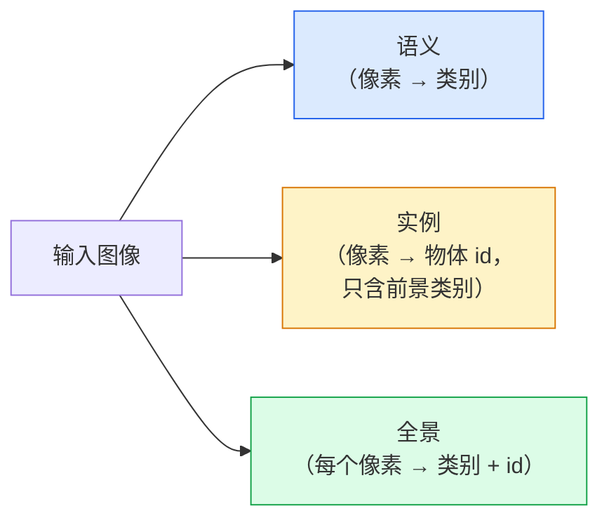
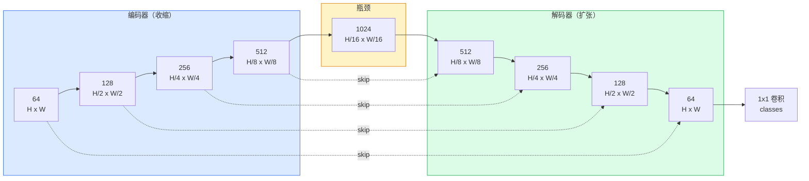

# 语义分割 —— U-Net

> 分割就是在每个像素上做分类。U-Net 让它行得通的办法，是把一个下采样编码器和一个上采样解码器配成一对，再在两者之间接上跳连。

**类型：** Build
**语言：** Python
**前置要求：** 阶段 4 第 03 课（CNN）、阶段 4 第 04 课（图像分类）
**预计时间：** ~75 分钟

## 学习目标

- 区分语义分割、实例分割、全景分割，并为给定问题挑对任务
- 用 PyTorch 从零搭一个 U-Net，包含编码器块、瓶颈、带转置卷积的解码器，以及跳连
- 实现逐像素交叉熵、Dice 损失，以及那个当前是医学和工业分割默认的组合损失
- 逐类读 IoU 和 Dice 指标，诊断一个差分数是来自小物体召回、边界精度，还是类别不平衡

## 问题所在

分类每张图输出一个标签。检测每张图输出一把框。分割每个像素输出一个标签。对一个 `H x W` 大小的输入，输出是一个形状为 `H x W`（语义）或 `H x W x N_instances`（实例）的张量。那是每张图数百万个预测，不是一个。

分割的这种结构，正是它撑起几乎每个稠密预测视觉产品的原因：医学影像（肿瘤掩码）、自动驾驶（道路、车道、障碍物）、卫星（建筑轮廓、作物边界）、文档解析（版面区域）、机器人（可抓取区域）。这些任务没一个能靠在物体周围画个框来解决；它们需要精确的轮廓。

架构上的问题陈述起来简单、解起来不简单：你需要网络同时看到图像的全局上下文（这是哪种场景）和局部像素细节（究竟哪个像素是道路而不是人行道）。标准 CNN 在空间上压缩以获得上下文，这就把细节扔掉了。U-Net 就是那个把两者都拿到手的设计。

## 核心概念

### 语义 vs 实例 vs 全景



- **语义**说"这个像素是路，那个像素是车"。挨在一起的两辆车塌成一个斑块。
- **实例**说"这个像素是车 #3，那个像素是车 #5"。忽略背景物（"stuff" = 天空、道路、草地）。
- **全景**把两者统一：每个像素拿到一个类别标签，每个实例拿到一个唯一 id，stuff 和 things 都被分割。

这一课讲语义。下一课（Mask R-CNN）讲实例。

### U-Net 的形状



编码器把空间分辨率减半四次、通道数翻倍。解码器反过来：把空间分辨率翻倍四次、通道数减半。跳连在每个分辨率上把对应的编码器特征和解码器特征拼接起来。最后的 1x1 卷积在全分辨率上把 `64 -> num_classes`。

跳连为什么必要：等解码器试图输出像素级预测时，它只见过小的特征图。没有跳连，它无法准确定位边缘，因为那个信息在编码器里被压掉了。跳连把编码器一路下来算出的高分辨率特征图递给它。

### 转置上采样 vs 双线性上采样

解码器必须扩张空间维度。两个选项：

- **转置卷积**（`nn.ConvTranspose2d`）—— 可学习的上采样。历史上 U-Net 的默认。如果 stride 和核大小除不尽，会产生棋盘格伪影。
- **双线性上采样 + 3x3 卷积** —— 平滑上采样后接一个卷积。伪影更少、参数更少，如今是现代默认。

两者野外都见得到。对第一个 U-Net，双线性更稳妥。

### 像素网格上的交叉熵

对 C 类的语义分割，模型输出是 `(N, C, H, W)`。目标是带整数类别 ID 的 `(N, H, W)`。交叉熵与分类情形完全相同，只是在每个空间位置上应用：

```
Loss = 在 (n, h, w) 上对 -log( softmax(logits[n, :, h, w])[target[n, h, w]] ) 求平均
```

PyTorch 的 `F.cross_entropy` 原生处理这个形状。不需要 reshape。

### Dice 损失，以及你为什么需要它

交叉熵平等对待每个像素。当一个类别主导画面时（医学影像：99% 背景、1% 肿瘤），这就错了。网络可以靠处处预测背景拿到 99% 准确率，却仍然没用。

Dice 损失通过直接优化预测掩码和真值掩码之间的重叠来解决：

```
Dice(p, y) = 2 * sum(p * y) / (sum(p) + sum(y) + epsilon)
Dice_loss = 1 - Dice
```

其中 `p` 是某个类别的 sigmoid/softmax 概率图，`y` 是二值真值掩码。只有重叠完美时损失才为零。因为它基于比例，类别不平衡无关紧要。

实践中，用**组合损失**：

```
L = L_cross_entropy + lambda * L_dice       (lambda 约 1)
```

交叉熵在训练早期给出稳定梯度；Dice 让训练的尾段聚焦在真正匹配掩码形状上。这个组合是医学影像的默认，在任何类别不平衡的数据集上都很难被超越。

### 评估指标

- **像素准确率** —— 预测正确的像素百分比。便宜。在不平衡数据上失效，原因和分类里的准确率一样。
- **逐类 IoU** —— 每个类别掩码的交并比；跨类别求平均 = mIoU。
- **Dice（像素上的 F1）** —— 类似 IoU；`Dice = 2 * IoU / (1 + IoU)`。医学影像偏好 Dice，驾驶领域偏好 IoU；它们单调相关。
- **边界 F1** —— 衡量预测边界与真值边界的接近程度，连小偏移也惩罚。对半导体检测这类高精度任务很重要。

报逐类 IoU，不只 mIoU。平均 IoU 会在其他九个都到 85% 时掩盖某个 15% 的类别。

### 输入分辨率的权衡

U-Net 的编码器把分辨率减半四次，所以输入必须能被 16 整除。医学图像常是 512x512 或 1024x1024。自动驾驶裁剪是 2048x1024。U-Net 的内存成本随 `H * W * C_max` 缩放，在 1024x1024、1024 瓶颈通道时，单次前向就已经用掉好几 GB 显存。

两个标准的变通：
1. 把输入切块——处理带重叠的 256x256 小块再拼接。
2. 用空洞卷积替换瓶颈，在保持空间分辨率更高的同时扩大感受野（DeepLab 家族）。

对第一个模型，256x256 输入配 64 通道基底的 U-Net，在 8 GB 显存上训得很舒服。

## 动手构建

### 第 1 步：编码器块

两个 3x3 卷积，配批归一化和 ReLU。第一个卷积改变通道数；第二个保持不变。

```python
import torch
import torch.nn as nn
import torch.nn.functional as F

class DoubleConv(nn.Module):
    def __init__(self, in_c, out_c):
        super().__init__()
        self.net = nn.Sequential(
            nn.Conv2d(in_c, out_c, kernel_size=3, padding=1, bias=False),
            nn.BatchNorm2d(out_c),
            nn.ReLU(inplace=True),
            nn.Conv2d(out_c, out_c, kernel_size=3, padding=1, bias=False),
            nn.BatchNorm2d(out_c),
            nn.ReLU(inplace=True),
        )

    def forward(self, x):
        return self.net(x)
```

这个块全程复用。`bias=False` 是因为 BN 的 beta 处理了 bias。

### 第 2 步：下采样块和上采样块

```python
class Down(nn.Module):
    def __init__(self, in_c, out_c):
        super().__init__()
        self.net = nn.Sequential(
            nn.MaxPool2d(2),
            DoubleConv(in_c, out_c),
        )

    def forward(self, x):
        return self.net(x)


class Up(nn.Module):
    def __init__(self, in_c, out_c):
        super().__init__()
        self.up = nn.Upsample(scale_factor=2, mode="bilinear", align_corners=False)
        self.conv = DoubleConv(in_c, out_c)

    def forward(self, x, skip):
        x = self.up(x)
        if x.shape[-2:] != skip.shape[-2:]:
            x = F.interpolate(x, size=skip.shape[-2:], mode="bilinear", align_corners=False)
        x = torch.cat([skip, x], dim=1)
        return self.conv(x)
```

只比空间形状（`shape[-2:]`）的检查，能处理维度不能被 16 整除的输入；拼接前用一个安全的 `F.interpolate` 把张量对齐。比完整形状会在通道数不同时也触发，而那本应是一个响亮的报错，不是一次无声的插值。

### 第 3 步：U-Net

```python
class UNet(nn.Module):
    def __init__(self, in_channels=3, num_classes=2, base=64):
        super().__init__()
        self.inc = DoubleConv(in_channels, base)
        self.d1 = Down(base, base * 2)
        self.d2 = Down(base * 2, base * 4)
        self.d3 = Down(base * 4, base * 8)
        self.d4 = Down(base * 8, base * 16)
        self.u1 = Up(base * 16 + base * 8, base * 8)
        self.u2 = Up(base * 8 + base * 4, base * 4)
        self.u3 = Up(base * 4 + base * 2, base * 2)
        self.u4 = Up(base * 2 + base, base)
        self.outc = nn.Conv2d(base, num_classes, kernel_size=1)

    def forward(self, x):
        x1 = self.inc(x)
        x2 = self.d1(x1)
        x3 = self.d2(x2)
        x4 = self.d3(x3)
        x5 = self.d4(x4)
        x = self.u1(x5, x4)
        x = self.u2(x, x3)
        x = self.u3(x, x2)
        x = self.u4(x, x1)
        return self.outc(x)

net = UNet(in_channels=3, num_classes=2, base=32)
x = torch.randn(1, 3, 256, 256)
print(f"output: {net(x).shape}")
print(f"params: {sum(p.numel() for p in net.parameters()):,}")
```

输出形状 `(1, 2, 256, 256)`——和输入相同的空间尺寸，`num_classes` 个通道。`base=32` 时约 770 万参数。

### 第 4 步：损失

```python
def dice_loss(logits, targets, num_classes, eps=1e-6):
    probs = F.softmax(logits, dim=1)
    targets_one_hot = F.one_hot(targets, num_classes).permute(0, 3, 1, 2).float()
    dims = (0, 2, 3)
    intersection = (probs * targets_one_hot).sum(dim=dims)
    denom = probs.sum(dim=dims) + targets_one_hot.sum(dim=dims)
    dice = (2 * intersection + eps) / (denom + eps)
    return 1 - dice.mean()


def combined_loss(logits, targets, num_classes, lam=1.0):
    ce = F.cross_entropy(logits, targets)
    dc = dice_loss(logits, targets, num_classes)
    return ce + lam * dc, {"ce": ce.item(), "dice": dc.item()}
```

Dice 逐类计算再平均（宏 Dice）。`eps` 防止对 batch 里不存在的类别除以零。

### 第 5 步：IoU 指标

```python
@torch.no_grad()
def iou_per_class(logits, targets, num_classes):
    preds = logits.argmax(dim=1)
    ious = torch.zeros(num_classes)
    for c in range(num_classes):
        pred_c = (preds == c)
        true_c = (targets == c)
        inter = (pred_c & true_c).sum().float()
        union = (pred_c | true_c).sum().float()
        ious[c] = (inter / union) if union > 0 else torch.tensor(float("nan"))
    return ious
```

返回一个长度为 C 的向量。`nan` 标记 batch 里不存在的类别——算 mIoU 时不要把那些算进去。

### 第 6 步：用于端到端验证的合成数据集

在彩色背景上生成形状，逼网络学形状而不是像素颜色。

```python
import numpy as np
from torch.utils.data import Dataset, DataLoader

def synthetic_segmentation(num_samples=200, size=64, seed=0):
    rng = np.random.default_rng(seed)
    images = np.zeros((num_samples, size, size, 3), dtype=np.float32)
    masks = np.zeros((num_samples, size, size), dtype=np.int64)
    for i in range(num_samples):
        bg = rng.uniform(0, 1, (3,))
        images[i] = bg
        masks[i] = 0
        num_shapes = rng.integers(1, 4)
        for _ in range(num_shapes):
            cls = int(rng.integers(1, 3))
            color = rng.uniform(0, 1, (3,))
            cx, cy = rng.integers(10, size - 10, size=2)
            r = int(rng.integers(4, 12))
            yy, xx = np.meshgrid(np.arange(size), np.arange(size), indexing="ij")
            if cls == 1:
                mask = (xx - cx) ** 2 + (yy - cy) ** 2 < r ** 2
            else:
                mask = (np.abs(xx - cx) < r) & (np.abs(yy - cy) < r)
            images[i][mask] = color
            masks[i][mask] = cls
        images[i] += rng.normal(0, 0.02, images[i].shape)
        images[i] = np.clip(images[i], 0, 1)
    return images, masks


class SegDataset(Dataset):
    def __init__(self, images, masks):
        self.images = images
        self.masks = masks

    def __len__(self):
        return len(self.images)

    def __getitem__(self, i):
        img = torch.from_numpy(self.images[i]).permute(2, 0, 1).float()
        mask = torch.from_numpy(self.masks[i]).long()
        return img, mask
```

三个类别：背景（0）、圆（1）、方块（2）。网络必须学会区分形状。

### 第 7 步：训练循环

```python
def train_one_epoch(model, loader, optimizer, device, num_classes):
    model.train()
    loss_sum, total = 0.0, 0
    iou_sum = torch.zeros(num_classes)
    for x, y in loader:
        x, y = x.to(device), y.to(device)
        logits = model(x)
        loss, _ = combined_loss(logits, y, num_classes)
        optimizer.zero_grad()
        loss.backward()
        optimizer.step()
        loss_sum += loss.item() * x.size(0)
        total += x.size(0)
        iou_sum += iou_per_class(logits, y, num_classes).nan_to_num(0)
    return loss_sum / total, iou_sum / len(loader)
```

在合成数据集上跑 10-30 个 epoch，看着形状类别的 mIoU 爬过 0.9。注意 `nan_to_num(0)` 把 batch 里不存在的类别当成零；要得到准确的逐类 IoU，按是否出现做掩码，并在评估时跨 batch 用 `torch.nanmean`，而不是在这里求平均。

## 上手使用

生产中，`segmentation_models_pytorch`（"smp"）用任意 torchvision 或 timm 骨干包住了每个标准分割架构。三行：

```python
import segmentation_models_pytorch as smp

model = smp.Unet(
    encoder_name="resnet34",
    encoder_weights="imagenet",
    in_channels=3,
    classes=3,
)
```

干真活时还值得知道：
- **DeepLabV3+** 用空洞卷积替换基于 max-pool 的下采样，让瓶颈保持分辨率；在卫星和驾驶数据上边界更快更好。
- **SegFormer** 把卷积编码器换成层级 transformer；在许多基准上是当前 SOTA。
- **Mask2Former** / **OneFormer** 在单一架构里统一语义、实例和全景分割。

这三个在 `smp` 或 `transformers` 里都是即插即换，用同一个 data loader。

## 交付

这一课产出：

- `outputs/prompt-segmentation-task-picker.md` —— 一个 prompt，在语义、实例、全景分割之间挑选，并为给定任务点名架构。
- `outputs/skill-segmentation-mask-inspector.md` —— 一个 skill，报告类别分布、预测掩码统计，以及被预测不足或边界模糊的类别。

## 练习

1. **（简单）** 为二值分割任务（前景 vs 背景）实现 `bce_dice_loss`。在一个合成两类数据集上验证：当前景占像素 5% 时，组合损失比单用 BCE 收敛更快。
2. **（中等）** 把 `nn.Upsample + conv` 上采样块换成 `nn.ConvTranspose2d` 上采样块。两者都在合成数据集上训练并比 mIoU。观察转置卷积版本里棋盘格伪影出现在哪里。
3. **（困难）** 拿一个真实分割数据集（Oxford-IIIT Pets、Cityscapes mini 划分，或一个医学子集），把 U-Net 训到 `smp.Unet` 参考的 2 个 IoU 点以内。报告逐类 IoU，找出哪些类别从损失里加 Dice 中获益最多。

## 关键术语

| 术语 | 大家嘴上怎么说 | 它实际是什么 |
|------|----------------|----------------------|
| 语义分割 | "给每个像素打标签" | 把每个像素分类到 C 个类别；同类别的实例会合并 |
| 实例分割 | "给每个物体打标签" | 区分同一类别的不同实例；只含前景 |
| 全景分割 | "语义 + 实例" | 每个像素拿到一个类别；每个 thing 实例还拿到一个唯一 id |
| 跳连 | "U-Net 桥" | 把编码器特征拼接进对应分辨率的解码器特征；保留高频细节 |
| 转置卷积 | "反卷积" | 可学习的上采样；可能产生棋盘格伪影 |
| Dice 损失 | "重叠损失" | 1 - 2|A ∩ B| / (|A| + |B|)；直接优化掩码重叠，对类别不平衡鲁棒 |
| mIoU | "平均交并比" | 跨类别的平均 IoU；分割的社区标准指标 |
| 边界 F1 | "边界精度" | 只在边界像素上算的 F1 分数；对精度关键任务要紧 |

## 延伸阅读

- [U-Net: Convolutional Networks for Biomedical Image Segmentation (Ronneberger et al., 2015)](https://arxiv.org/abs/1505.04597) —— 原始论文；人人照抄的那张图在第 2 页
- [Fully Convolutional Networks (Long et al., 2015)](https://arxiv.org/abs/1411.4038) —— 首次把分割变成端到端卷积问题的那篇论文
- [segmentation_models_pytorch](https://github.com/qubvel/segmentation_models.pytorch) —— 生产分割的参考；每个标准架构加每个标准损失
- [Lessons learned from training SOTA segmentation (kaggle.com competitions)](https://www.kaggle.com/code/iafoss/carvana-unet-pytorch) —— 讲解为什么 TTA、伪标签和类别权重在真实数据上要紧
