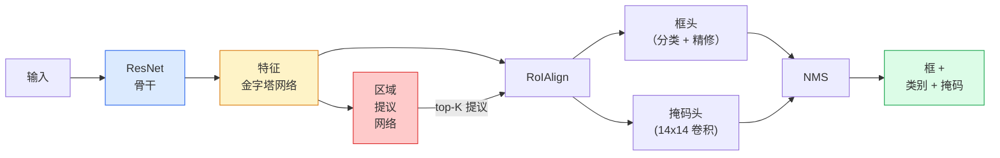

# 实例分割 —— Mask R-CNN

> 给一个 Faster R-CNN 检测器加一个小小的掩码分支，你就有了实例分割。难点在 RoIAlign，而它比看起来更难。

**类型：** Build + Learn
**语言：** Python
**前置要求：** 阶段 4 第 06 课（YOLO）、阶段 4 第 07 课（U-Net）
**预计时间：** ~75 分钟

## 学习目标

- 端到端梳理 Mask R-CNN 架构：骨干、FPN、RPN、RoIAlign、框头、掩码头
- 从零实现 RoIAlign，解释为什么 RoIPool 不再用了
- 用 torchvision 的 `maskrcnn_resnet50_fpn_v2` 预训练模型产出生产质量的实例掩码，并正确读懂它的输出格式
- 通过替换框头和掩码头、保持骨干冻结，在一个小的自定义数据集上微调 Mask R-CNN

## 问题所在

语义分割给你每个类别一个掩码。实例分割给你每个物体一个掩码，即便两个物体共享一个类别。数个体、跨帧追踪、测量东西（墙上每块砖、显微图像里每个细胞的边界框），全都要求实例分割。

Mask R-CNN（He 等人，2017）通过把实例分割重新框定为"检测加掩码"解决了这点。这个设计如此干净，以致接下来五年几乎每篇实例分割论文都是 Mask R-CNN 的变体，而 torchvision 实现至今仍是中小数据集的生产默认。

棘手的工程问题是采样：当一个 proposal 框的角点和像素边界对不齐时，你怎么从里面裁出一块固定尺寸的特征区域？这件事弄错，到处都损失零点几个 mAP。RoIAlign 就是答案。

## 核心概念

### 架构



要理解五个部件：

1. **骨干** —— 在 ImageNet 上训练的 ResNet-50 或 ResNet-101。产出 stride 4、8、16、32 的特征图层级。
2. **FPN（特征金字塔网络）** —— 自顶向下 + 侧向连接，给每个层级 C 通道的语义丰富特征。检测查询与物体大小匹配的 FPN 层级。
3. **RPN（区域提议网络）** —— 一个小卷积头，在每个 anchor 位置预测"这里有没有物体？"和"我该怎么精修这个框？"。每张图产出约 1000 个 proposal。
4. **RoIAlign** —— 从任意 FPN 层级上的任意框采出一块固定尺寸（如 7x7）的特征 patch。双线性采样，不量化。
5. **头部** —— 一个两层框头，精修框并挑类别，加上一个小卷积头，为每个 proposal 输出一个 `28x28` 的二值掩码。

### 为什么用 RoIAlign，不用 RoIPool

原始的 Fast R-CNN 用 RoIPool，它把 proposal 框切成网格，取每个单元里的最大特征，并把所有坐标四舍五入成整数。那个取整把特征图从输入像素坐标错开多达一整个特征图像素——在 224x224 图像上很小，在特征图 stride 32 时是灾难性的。

```
RoIPool：
  框 (34.7, 51.3, 98.2, 142.9)
  取整 -> (34, 51, 98, 142)
  切网格 -> 每个单元边界各自取整
  错位在每一步累积

RoIAlign：
  框 (34.7, 51.3, 98.2, 142.9)
  用双线性插值在精确的浮点坐标处采样
  哪儿都不取整
```

RoIAlign 在 COCO 上白送 3-4 个点的掩码 AP。如今每个在乎定位的检测器都用它——YOLOv7 seg、RT-DETR、Mask2Former 一概如此。

### 一段话讲清 RPN

在特征图的每个位置，放 K 个不同尺寸和形状的 anchor 框。为每个 anchor 预测一个 objectness 分数和一个回归偏移量，把 anchor 变成更贴合的框。按分数保留 top 约 1,000 个框，在 IoU 0.7 处应用 NMS，把幸存者递给头部。RPN 用它自己的小损失训练——结构和第 6 课的 YOLO 损失相同，只是两个类别（物体 / 非物体）。

### 掩码头

对每个 proposal（RoIAlign 之后），掩码头是一个小 FCN：四个 3x3 卷积、一个 2x 反卷积、一个最终的 1x1 卷积，在 `28x28` 分辨率上产出 `num_classes` 个输出通道。只保留对应于预测类别的那个通道；其余忽略。这把掩码预测和分类解耦了。

把 28x28 掩码上采样到 proposal 的原始像素尺寸，产出最终的二值掩码。

### 损失

Mask R-CNN 有四个损失加在一起：

```
L = L_rpn_cls + L_rpn_box + L_box_cls + L_box_reg + L_mask
```

- `L_rpn_cls`、`L_rpn_box` —— RPN proposal 的 objectness + 框回归。
- `L_box_cls` —— 头部分类器上对 (C+1) 个类别（含背景）的交叉熵。
- `L_box_reg` —— 头部框精修上的 smooth L1。
- `L_mask` —— 28x28 掩码输出上的逐像素二值交叉熵。

每个损失有自己的默认权重；torchvision 实现把它们暴露成构造函数参数。

### 输出格式

`torchvision.models.detection.maskrcnn_resnet50_fpn_v2` 返回一个 dict 列表，每张图一个：

```
{
    "boxes":  (N, 4)，(x1, y1, x2, y2) 像素坐标,
    "labels": (N,) 类别 ID，0 = 背景，所以索引从 1 起,
    "scores": (N,) 置信度分数,
    "masks":  (N, 1, H, W) [0, 1] 的浮点掩码 —— 在 0.5 处取阈值变二值,
}
```

掩码已经是整图分辨率。28x28 的头部输出在内部被上采样过了。

## 动手构建

### 第 1 步：从零实现 RoIAlign

这是 Mask R-CNN 里唯一一个看代码比看文字更好理解的组件。

```python
import torch
import torch.nn.functional as F

def roi_align_single(feature, box, output_size=7, spatial_scale=1 / 16.0):
    """
    feature: (C, H, W) 单图特征图
    box: (x1, y1, x2, y2)，原图像素坐标
    output_size: 输出网格的边长（框头用 7，掩码头用 14）
    spatial_scale: 特征图 stride 的倒数
    """
    C, H, W = feature.shape
    x1, y1, x2, y2 = [c * spatial_scale - 0.5 for c in box]
    bin_w = (x2 - x1) / output_size
    bin_h = (y2 - y1) / output_size

    grid_y = torch.linspace(y1 + bin_h / 2, y2 - bin_h / 2, output_size)
    grid_x = torch.linspace(x1 + bin_w / 2, x2 - bin_w / 2, output_size)
    yy, xx = torch.meshgrid(grid_y, grid_x, indexing="ij")

    gx = 2 * (xx + 0.5) / W - 1
    gy = 2 * (yy + 0.5) / H - 1
    grid = torch.stack([gx, gy], dim=-1).unsqueeze(0)
    sampled = F.grid_sample(feature.unsqueeze(0), grid, mode="bilinear",
                            align_corners=False)
    return sampled.squeeze(0)
```

每个数都在一个双线性采样的位置上。不取整、不量化、不丢梯度。

### 第 2 步：和 torchvision 的 RoIAlign 对比

```python
from torchvision.ops import roi_align

feature = torch.randn(1, 16, 50, 50)
boxes = torch.tensor([[0, 10, 20, 100, 90]], dtype=torch.float32)  # (batch_idx, x1, y1, x2, y2)

ours = roi_align_single(feature[0], boxes[0, 1:].tolist(), output_size=7, spatial_scale=1/4)
theirs = roi_align(feature, boxes, output_size=(7, 7), spatial_scale=1/4, sampling_ratio=1, aligned=True)[0]

print(f"shape ours:   {tuple(ours.shape)}")
print(f"shape theirs: {tuple(theirs.shape)}")
print(f"max|diff|:    {(ours - theirs).abs().max().item():.3e}")
```

用 `sampling_ratio=1` 和 `aligned=True`，两者在 `1e-5` 以内吻合。

### 第 3 步：加载一个预训练 Mask R-CNN

```python
import torch
from torchvision.models.detection import maskrcnn_resnet50_fpn_v2, MaskRCNN_ResNet50_FPN_V2_Weights

model = maskrcnn_resnet50_fpn_v2(weights=MaskRCNN_ResNet50_FPN_V2_Weights.DEFAULT)
model.eval()
print(f"params: {sum(p.numel() for p in model.parameters()):,}")
print(f"classes (including background): {len(model.roi_heads.box_predictor.cls_score.out_features * [0])}")
```

4600 万参数，91 个类别（COCO）。第一个类别（id 0）是背景；模型实际检测的一切从 id 1 开始。

### 第 4 步：跑推理

```python
with torch.no_grad():
    x = torch.randn(3, 400, 600)
    predictions = model([x])
p = predictions[0]
print(f"boxes:  {tuple(p['boxes'].shape)}")
print(f"labels: {tuple(p['labels'].shape)}")
print(f"scores: {tuple(p['scores'].shape)}")
print(f"masks:  {tuple(p['masks'].shape)}")
```

掩码张量形状是 `(N, 1, H, W)`。在 0.5 处取阈值得到每个物体的二值掩码：

```python
binary_masks = (p['masks'] > 0.5).squeeze(1)  # (N, H, W) 布尔
```

### 第 5 步：为自定义类别数替换头部

常见的微调配方：复用骨干、FPN 和 RPN；替换两个分类头。

```python
from torchvision.models.detection.faster_rcnn import FastRCNNPredictor
from torchvision.models.detection.mask_rcnn import MaskRCNNPredictor

def build_custom_maskrcnn(num_classes):
    model = maskrcnn_resnet50_fpn_v2(weights=MaskRCNN_ResNet50_FPN_V2_Weights.DEFAULT)
    in_features = model.roi_heads.box_predictor.cls_score.in_features
    model.roi_heads.box_predictor = FastRCNNPredictor(in_features, num_classes)
    in_features_mask = model.roi_heads.mask_predictor.conv5_mask.in_channels
    hidden_layer = 256
    model.roi_heads.mask_predictor = MaskRCNNPredictor(in_features_mask, hidden_layer, num_classes)
    return model

custom = build_custom_maskrcnn(num_classes=5)
print(f"custom cls_score.out_features: {custom.roi_heads.box_predictor.cls_score.out_features}")
```

`num_classes` 必须包含背景类，所以一个有 4 个物体类别的数据集用 `num_classes=5`。

### 第 6 步：冻结不需要训练的部分

在小数据集上，冻结骨干和 FPN。只有 RPN 的 objectness + 回归和两个头在学。

```python
def freeze_backbone_and_fpn(model):
    # torchvision Mask R-CNN 把 FPN 打包在 `model.backbone` 里
    #（作为 `model.backbone.fpn`），所以遍历 `model.backbone.parameters()`
    # 同时覆盖了 ResNet 特征层和 FPN 的侧向/输出卷积。
    for p in model.backbone.parameters():
        p.requires_grad = False
    return model

custom = freeze_backbone_and_fpn(custom)
trainable = sum(p.numel() for p in custom.parameters() if p.requires_grad)
print(f"trainable after freeze: {trainable:,}")
```

在 500 张图的数据集上，这就是收敛和过拟合之间的差别。

## 上手使用

torchvision 里 Mask R-CNN 的完整训练循环是 40 行，在不同任务之间没什么实质变化——换数据集就走。

```python
def train_step(model, images, targets, optimizer):
    model.train()
    loss_dict = model(images, targets)
    losses = sum(loss for loss in loss_dict.values())
    optimizer.zero_grad()
    losses.backward()
    optimizer.step()
    return {k: v.item() for k, v in loss_dict.items()}
```

`targets` 列表里每张图必须有一个 dict，含 `boxes`、`labels` 和 `masks`（作为 `(num_instances, H, W)` 二值张量）。模型在训练时返回一个四损失的 dict，在评估时返回一个预测列表，由 `model.training` 决定。

`pycocotools` 评估器同时为框和掩码产出 mAP@IoU=0.5:0.95；你需要这两个数才能知道瓶颈是框头还是掩码头。

## 交付

这一课产出：

- `outputs/prompt-instance-vs-semantic-router.md` —— 一个 prompt，问三个问题，在实例/语义/全景之间挑选，外加确切的起步模型。
- `outputs/skill-mask-rcnn-head-swapper.md` —— 一个 skill，给定新的 `num_classes`，为任意 torchvision 检测模型生成那 10 行换头代码。

## 练习

1. **（简单）** 在 100 个随机框上把你的 RoIAlign 和 `torchvision.ops.roi_align` 对比。报告最大绝对差。再跑一遍 RoIPool（2017 年前的行为），展示它在靠近边界的框上偏离约 1-2 个特征图像素。
2. **（中等）** 在一个 50 张图的自定义数据集上微调 `maskrcnn_resnet50_fpn_v2`（任意两个类别：气球、鱼、坑洞、logo）。冻结骨干，训 20 个 epoch，报告掩码 AP@0.5。
3. **（困难）** 把 Mask R-CNN 的掩码头换成在 56x56 而不是 28x28 处预测。测量替换前后的 mAP@IoU=0.75。解释为什么提升（或没提升）符合预期的"边界精度 / 内存"权衡。

## 关键术语

| 术语 | 大家嘴上怎么说 | 它实际是什么 |
|------|----------------|----------------------|
| Mask R-CNN | "检测加掩码" | Faster R-CNN + 一个小 FCN 头，为每个 proposal 每个类别预测一个 28x28 掩码 |
| FPN | "特征金字塔" | 自顶向下 + 侧向连接，给每个 stride 层级 C 通道的语义丰富特征 |
| RPN | "区域提议器" | 一个小卷积头，每张图产出约 1000 个物体/非物体 proposal |
| RoIAlign | "不取整的裁剪" | 从任意浮点坐标框双线性采出一块固定尺寸的特征网格 |
| RoIPool | "2017 年前的裁剪" | 和 RoIAlign 目的相同，但对框坐标取整；已淘汰 |
| 掩码 AP | "实例 mAP" | 用掩码 IoU 而非框 IoU 算的平均精度；COCO 实例分割指标 |
| 二值掩码头 | "逐类掩码" | 为每个 proposal 每个类别预测一个二值掩码；只保留预测类别那个通道 |
| 背景类 | "类别 0" | 那个兜底的"无物体"类别；真实类别的索引从 1 开始 |

## 延伸阅读

- [Mask R-CNN (He et al., 2017)](https://arxiv.org/abs/1703.06870) —— 论文；第 3 节讲 RoIAlign 是关键读物
- [FPN: Feature Pyramid Networks (Lin et al., 2017)](https://arxiv.org/abs/1612.03144) —— FPN 论文；每个现代检测器都用它
- [torchvision Mask R-CNN tutorial](https://pytorch.org/tutorials/intermediate/torchvision_tutorial.html) —— 微调循环的参考
- [Detectron2 model zoo](https://github.com/facebookresearch/detectron2/blob/main/MODEL_ZOO.md) —— 生产实现，几乎为每个检测和分割变体提供训练好的权重
