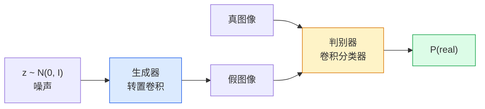
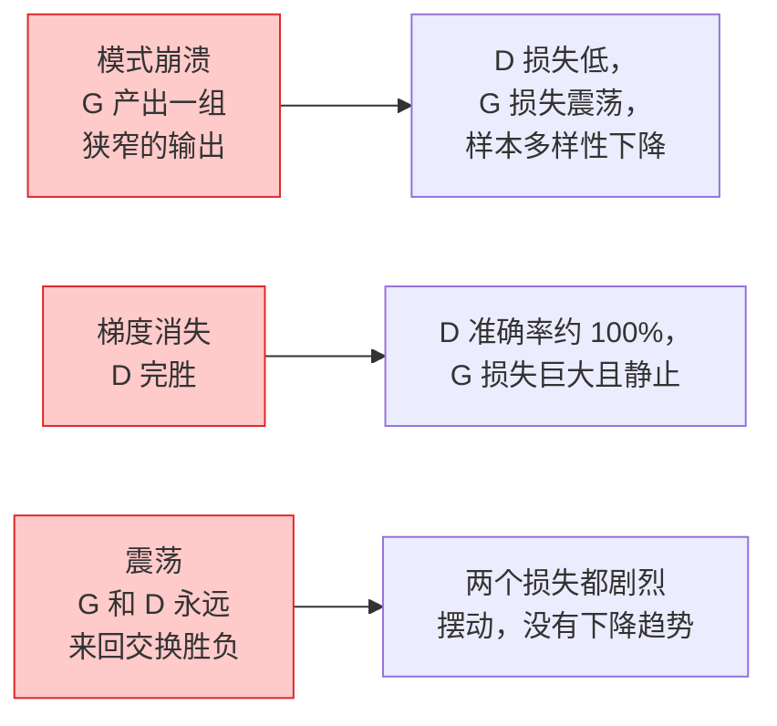

# 图像生成 —— GAN

> GAN 是一场固定博弈里的两个神经网络。一个画画，一个挑刺。它们一起变强，直到画作骗过了评审。

**类型：** Build
**语言：** Python
**前置要求：** 阶段 4 第 03 课（CNN）、阶段 3 第 06 课（优化器）、阶段 3 第 07 课（正则化）
**预计时间：** ~75 分钟

## 学习目标

- 解释生成器和判别器之间的极小极大博弈，以及为什么均衡对应于 p_model = p_data
- 用 PyTorch 实现一个 DCGAN，在 60 行以内让它生成连贯的 32x32 合成图像
- 用三个标准技巧稳定 GAN 训练：非饱和损失、谱归一化、TTUR（双时间尺度更新规则）
- 读懂训练曲线，区分健康收敛与模式崩溃、震荡、判别器完胜

## 问题所在

分类教网络把图像映射到标签。生成把问题反过来：采样出看起来像是来自同一分布的新图像。没有"正确"的输出可以拿来 diff；只有一个你想模仿的分布。

标准损失函数（MSE、交叉熵）衡量不了"这个样本是不是来自真实分布"。最小化逐像素误差产出的是模糊的平均，不是逼真的样本。突破在于把损失学出来：训练第二个网络，它的活儿是分辨真假，用它的判断去推动生成器。

GAN（Goodfellow 等人，2014）定义了那个框架。到 2018 年，StyleGAN 已经在产出与照片无法区分的 1024x1024 人脸。此后扩散模型在质量和可控性上夺了王座，但每个让扩散变得实用的技巧——归一化选择、潜空间、特征损失——都是先在 GAN 上被理解的。

## 核心概念

### 两个网络



**生成器** G 拿一个噪声向量 `z` 输出一张图像。**判别器** D 拿一张图像输出一个标量：这张图像是真的的概率。

### 博弈

G 想让 D 出错。D 想做对。形式上：

```
min_G max_D  E_x[log D(x)] + E_z[log(1 - D(G(z)))]
```

从右往左读：D 在最大化对真（`log D(real)`）图像和假（`log (1 - D(fake))`）图像的准确率。G 在最小化 D 对假图的准确率——它想让 `D(G(z))` 高。

Goodfellow 证明了这个极小极大有一个全局均衡，此时 `p_G = p_data`，D 处处输出 0.5，生成分布和真实分布之间的 Jensen-Shannon 散度为零。难的是怎么到那儿。

### 非饱和损失

上面那个形式数值不稳定。训练早期，每张假图的 `D(G(z))` 都接近零，所以 `log(1 - D(G(z)))` 关于 G 的梯度消失。修法：把 G 的损失翻过来。

```
L_D = -E_x[log D(x)] - E_z[log(1 - D(G(z)))]
L_G = -E_z[log D(G(z))]                          # 非饱和
```

现在当 `D(G(z))` 接近零时，G 的损失很大，它的梯度有信息量。每个现代 GAN 都用这个变体训练。

### DCGAN 架构规则

Radford、Metz、Chintala（2015）把多年失败的实验提炼成了五条让 GAN 训练稳定的规则：

1. 用带 stride 的卷积替换池化（两个网络都是）。
2. 在生成器和判别器都用批归一化，除了 G 的输出和 D 的输入。
3. 在更深的架构上去掉全连接层。
4. G 在除输出外的所有层用 ReLU（输出用 tanh 落到 [-1, 1]）。
5. D 在所有层用 LeakyReLU（negative_slope=0.2）。

每个现代基于卷积的 GAN（StyleGAN、BigGAN、GigaGAN）仍然从这些规则起步，再一个一个替换部件。

### 失败模式及其特征



- **模式崩溃**：G 找到一张能骗过 D 的图像，就只产那一张。修法：加 minibatch discrimination、谱归一化，或标签条件化。
- **判别器完胜**：D 太快变得太强，G 的梯度消失。修法：更小的 D、更低的 D 学习率，或对真标签做标签平滑。
- **震荡**：两个网络来回交换胜负，从不接近均衡。修法：TTUR（D 比 G 快 2-4 倍学习），或换成 Wasserstein 损失。

### 评估

GAN 没有真值，那你怎么知道它在起作用？

- **样本检查** —— 每个 epoch 末就看 64 个样本。没得商量。
- **FID（Fréchet Inception Distance）** —— 真实集和生成集的 Inception-v3 特征分布之间的距离。越低越好。社区标准。
- **Inception Score** —— 更老、更脆；优先用 FID。
- **生成模型的 Precision/Recall** —— 分别衡量质量（precision）和覆盖（recall）。比单看 FID 信息量大。

对小型合成数据的运行，样本检查就够了。

## 动手构建

### 第 1 步：生成器

一个小 DCGAN 生成器，拿 64 维噪声产出一张 32x32 图像。

```python
import torch
import torch.nn as nn

class Generator(nn.Module):
    def __init__(self, z_dim=64, img_channels=3, feat=64):
        super().__init__()
        self.net = nn.Sequential(
            nn.ConvTranspose2d(z_dim, feat * 4, kernel_size=4, stride=1, padding=0, bias=False),
            nn.BatchNorm2d(feat * 4),
            nn.ReLU(inplace=True),
            nn.ConvTranspose2d(feat * 4, feat * 2, kernel_size=4, stride=2, padding=1, bias=False),
            nn.BatchNorm2d(feat * 2),
            nn.ReLU(inplace=True),
            nn.ConvTranspose2d(feat * 2, feat, kernel_size=4, stride=2, padding=1, bias=False),
            nn.BatchNorm2d(feat),
            nn.ReLU(inplace=True),
            nn.ConvTranspose2d(feat, img_channels, kernel_size=4, stride=2, padding=1, bias=False),
            nn.Tanh(),
        )

    def forward(self, z):
        return self.net(z.view(z.size(0), -1, 1, 1))
```

四个转置卷积，每个都是 `kernel_size=4, stride=2, padding=1`，让它们干净地把空间尺寸翻倍。通过 tanh 输出 [-1, 1] 的激活。

### 第 2 步：判别器

生成器的镜像。LeakyReLU、带 stride 的卷积，以一个标量 logit 收尾。

```python
class Discriminator(nn.Module):
    def __init__(self, img_channels=3, feat=64):
        super().__init__()
        self.net = nn.Sequential(
            nn.Conv2d(img_channels, feat, kernel_size=4, stride=2, padding=1),
            nn.LeakyReLU(0.2, inplace=True),
            nn.Conv2d(feat, feat * 2, kernel_size=4, stride=2, padding=1, bias=False),
            nn.BatchNorm2d(feat * 2),
            nn.LeakyReLU(0.2, inplace=True),
            nn.Conv2d(feat * 2, feat * 4, kernel_size=4, stride=2, padding=1, bias=False),
            nn.BatchNorm2d(feat * 4),
            nn.LeakyReLU(0.2, inplace=True),
            nn.Conv2d(feat * 4, 1, kernel_size=4, stride=1, padding=0),
        )

    def forward(self, x):
        return self.net(x).view(-1)
```

最后一个卷积把 `4x4` 特征图缩成 `1x1`。每张图输出一个标量；只在算损失时应用 sigmoid。

### 第 3 步：训练步

交替进行：每个 batch 先更新 D 一次，再更新 G 一次。

```python
import torch.nn.functional as F

def train_step(G, D, real, z, opt_g, opt_d, device):
    real = real.to(device)
    bs = real.size(0)

    # D 步
    opt_d.zero_grad()
    d_real = D(real)
    d_fake = D(G(z).detach())
    loss_d = (F.binary_cross_entropy_with_logits(d_real, torch.ones_like(d_real))
              + F.binary_cross_entropy_with_logits(d_fake, torch.zeros_like(d_fake)))
    loss_d.backward()
    opt_d.step()

    # G 步
    opt_g.zero_grad()
    d_fake = D(G(z))
    loss_g = F.binary_cross_entropy_with_logits(d_fake, torch.ones_like(d_fake))
    loss_g.backward()
    opt_g.step()

    return loss_d.item(), loss_g.item()
```

D 步里的 `G(z).detach()` 很关键：在更新 D 时我们不想让梯度流进 G。忘了它就是经典的新手 bug。

### 第 4 步：在合成形状上的完整训练循环

```python
from torch.utils.data import DataLoader, TensorDataset
import numpy as np

def synthetic_images(num=2000, size=32, seed=0):
    rng = np.random.default_rng(seed)
    imgs = np.zeros((num, 3, size, size), dtype=np.float32) - 1.0
    for i in range(num):
        r = rng.uniform(6, 12)
        cx, cy = rng.uniform(r, size - r, size=2)
        yy, xx = np.meshgrid(np.arange(size), np.arange(size), indexing="ij")
        mask = (xx - cx) ** 2 + (yy - cy) ** 2 < r ** 2
        color = rng.uniform(-0.5, 1.0, size=3)
        for c in range(3):
            imgs[i, c][mask] = color[c]
    return torch.from_numpy(imgs)

device = "cuda" if torch.cuda.is_available() else "cpu"
data = synthetic_images()
loader = DataLoader(TensorDataset(data), batch_size=64, shuffle=True)

G = Generator(z_dim=64, img_channels=3, feat=32).to(device)
D = Discriminator(img_channels=3, feat=32).to(device)
opt_g = torch.optim.Adam(G.parameters(), lr=2e-4, betas=(0.5, 0.999))
opt_d = torch.optim.Adam(D.parameters(), lr=2e-4, betas=(0.5, 0.999))

for epoch in range(10):
    for (batch,) in loader:
        z = torch.randn(batch.size(0), 64, device=device)
        ld, lg = train_step(G, D, batch, z, opt_g, opt_d, device)
    print(f"epoch {epoch}  D {ld:.3f}  G {lg:.3f}")
```

`Adam(lr=2e-4, betas=(0.5, 0.999))` 是 DCGAN 默认——低 beta1 让动量项不至于把这场对抗博弈稳得过了头。

### 第 5 步：采样

```python
@torch.no_grad()
def sample(G, n=16, z_dim=64, device="cpu"):
    G.eval()
    z = torch.randn(n, z_dim, device=device)
    imgs = G(z)
    imgs = (imgs + 1) / 2
    return imgs.clamp(0, 1)
```

采样前永远切到 eval 模式。对 DCGAN 这很要紧，因为这时用的是批归一化的运行统计量，而不是这个 batch 的统计量。

### 第 6 步：谱归一化

判别器里 BN 的即插即换替代品，保证网络是 1-Lipschitz 的。修掉大多数"D 赢得太狠"的失败。

```python
from torch.nn.utils import spectral_norm

def build_sn_discriminator(img_channels=3, feat=64):
    return nn.Sequential(
        spectral_norm(nn.Conv2d(img_channels, feat, 4, 2, 1)),
        nn.LeakyReLU(0.2, inplace=True),
        spectral_norm(nn.Conv2d(feat, feat * 2, 4, 2, 1)),
        nn.LeakyReLU(0.2, inplace=True),
        spectral_norm(nn.Conv2d(feat * 2, feat * 4, 4, 2, 1)),
        nn.LeakyReLU(0.2, inplace=True),
        spectral_norm(nn.Conv2d(feat * 4, 1, 4, 1, 0)),
    )
```

把 `Discriminator` 换成 `build_sn_discriminator()`，你通常就不需要 TTUR 技巧了。谱归一化是你能用的最容易的单项鲁棒性升级。

## 上手使用

要认真做生成，用预训练权重，或者换成扩散。两个标准库：

- `torch_fidelity` 在你的生成器上算 FID / IS，不用写自定义评估代码。
- `pytorch-gan-zoo`（遗留）和 `StudioGAN` 提供 DCGAN、WGAN-GP、SN-GAN、StyleGAN 和 BigGAN 经过测试的实现。

在 2026 年，GAN 仍然是这些场景的最佳选择：实时图像生成（延迟 <10 ms）、风格迁移、带精确控制的图到图翻译（Pix2Pix、CycleGAN）。扩散在照片级真实感和文本条件化上胜出。

## 交付

这一课产出：

- `outputs/prompt-gan-training-triage.md` —— 一个 prompt，读一段训练曲线描述，挑出失败模式（模式崩溃、D 完胜、震荡）外加唯一推荐的修法。
- `outputs/skill-dcgan-scaffold.md` —— 一个 skill，从 `z_dim`、目标 `image_size` 和 `num_channels` 写出一个 DCGAN 脚手架，含训练循环和样本保存器。

## 练习

1. **（简单）** 在合成圆形数据集上训练上面的 DCGAN，每个 epoch 末保存 16 个样本的网格。到第几个 epoch，生成的圆变得明显是圆的？
2. **（中等）** 把判别器的批归一化换成谱归一化。两个版本并排训练。哪个收敛更快？哪个在三个种子上方差更低？
3. **（困难）** 实现一个条件 DCGAN：把类别标签喂进 G 和 D（在 G 里把 one-hot 拼到噪声上，在 D 里拼一个类别嵌入通道）。在第 7 课的合成"圆 vs 方"数据集上训练，通过用特定标签采样，展示类别条件化起了作用。

## 关键术语

| 术语 | 大家嘴上怎么说 | 它实际是什么 |
|------|----------------|----------------------|
| 生成器（G） | "画东西的网" | 把噪声映射到图像；被训练来骗过判别器 |
| 判别器（D） | "评审" | 二分类器；被训练来区分真图和生成图 |
| 极小极大 | "博弈" | 一个对抗损失对 G 取 min、对 D 取 max；均衡是 p_G = p_data |
| 非饱和损失 | "数值上理智的版本" | G 的损失是 -log(D(G(z))) 而非 log(1 - D(G(z)))，避免训练早期梯度消失 |
| 模式崩溃 | "生成器只做一种东西" | G 只产出数据分布的一小个子集；用 SN、minibatch discrimination 或更大 batch 修 |
| TTUR | "两个学习率" | D 比 G 快地学习，通常 2-4 倍；稳定训练 |
| 谱归一化 | "1-Lipschitz 层" | 一种权重归一化，约束每层的 Lipschitz 常数；阻止 D 变得任意陡 |
| FID | "Fréchet Inception Distance" | 真实集和生成集的 Inception-v3 特征分布之间的距离；标准评估指标 |

## 延伸阅读

- [Generative Adversarial Networks (Goodfellow et al., 2014)](https://arxiv.org/abs/1406.2661) —— 开启这一切的那篇论文
- [DCGAN (Radford, Metz, Chintala, 2015)](https://arxiv.org/abs/1511.06434) —— 让 GAN 可训练的架构规则
- [Spectral Normalization for GANs (Miyato et al., 2018)](https://arxiv.org/abs/1802.05957) —— 最有用的单项稳定技巧
- [StyleGAN3 (Karras et al., 2021)](https://arxiv.org/abs/2106.12423) —— SOTA GAN；读起来像过去十年每个技巧的精选集
