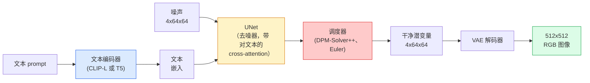

# Stable Diffusion —— 架构与微调

> Stable Diffusion 是一个跑在预训练 VAE 潜空间里的 DDPM，通过 cross-attention 接受文本条件，用一个快速确定性 ODE 求解器采样，由无分类器引导操控。

**类型：** Learn + Use
**语言：** Python
**前置要求：** 阶段 4 第 10 课（扩散）、阶段 7 第 02 课（自注意力）
**预计时间：** ~75 分钟

## 学习目标

- 梳理一条 Stable Diffusion pipeline 的五个部件：VAE、文本编码器、U-Net、调度器、安全检查器——以及它们各自实际在干什么
- 解释潜扩散，以及为什么在 4x64x64 的潜空间（而不是 3x512x512 的图像）里训练能把算力降低 48 倍而不损失质量
- 用 `diffusers` 生成图像，跑图到图、inpainting，以及 ControlNet 引导的生成
- 在一个小的自定义数据集上用 LoRA 微调 Stable Diffusion，并在推理时加载 LoRA 适配器

## 问题所在

直接在 512x512 RGB 图像上训练 DDPM 很贵。每个训练步都要反向穿过一个看 3x512x512 = 786,432 个输入值的 U-Net，而采样要 50+ 次穿过同一个 U-Net 的前向。在 Stable Diffusion 1.5（2022 年发布）的质量水平上，像素空间扩散大约需要 256 GPU-月的训练，在消费级 GPU 上每张图 10-30 秒。

让开放权重的文本到图像变实用的那个技巧是**潜扩散**（Rombach 等人，CVPR 2022）。训练一个 VAE，把一张 3x512x512 图像映射成一个 4x64x64 潜张量再映射回去，然后在那个潜空间里做扩散。算力下降 `(3*512*512)/(4*64*64) = 48x`。在同样的 GPU 上，采样从几十秒降到两秒以内。

几乎每个现代图像生成模型——SDXL、SD3、FLUX、HunyuanDiT、Wan-Video——都是一个潜扩散模型，只在自编码器、去噪器（U-Net 或 DiT）和文本条件化上有所变化。学会 Stable Diffusion，你就学会了这个模板。

## 核心概念

### Pipeline



- **VAE** —— 冻结的自编码器。编码器把图像变成潜变量（用于 img2img 和训练）。解码器把潜变量变回图像。
- **文本编码器** —— CLIP 文本编码器（SD 1.x/2.x）、CLIP-L + CLIP-G（SDXL），或 T5-XXL（SD3/FLUX）。产出一串 token 嵌入。
- **U-Net** —— 去噪器。带 cross-attention 层，在每个分辨率上从潜变量注意到文本嵌入。
- **调度器** —— 采样算法（DDIM、Euler、DPM-Solver++）。挑 sigma，把预测的噪声混回潜变量。
- **安全检查器** —— 对输出图像的可选 NSFW / 违法内容过滤器。

### 无分类器引导（CFG）

朴素文本条件化为每个 prompt `c` 学 `epsilon_theta(x_t, t, c)`。CFG 用同一个网络训练，但 10% 的时候把 `c` 丢掉（换成空嵌入），得到一个同时预测条件和无条件噪声的单一模型。推理时：

```
eps = eps_uncond + w * (eps_cond - eps_uncond)
```

`w` 是引导尺度。`w=0` 是无条件，`w=1` 是朴素条件，`w>1` 把输出推向"更受 prompt 约束"，代价是多样性。SD 默认 `w=7.5`。

CFG 是文本到图像能达到生产质量的原因。没有它，prompt 对输出的偏置很弱；有了它，prompt 占主导。

### 潜空间几何

VAE 的 4 通道潜变量不只是一张压缩图像。它是一个流形，在上面做算术大致对应于语义编辑（prompt engineering + 插值都活在这里），扩散 U-Net 被训练把它全部建模预算花在这里。解码一个随机的 4x64x64 潜变量不会产出一张看起来随机的图像——它产出垃圾，因为只有潜变量的一个特定子流形才解码成有效图像。

两个后果：

1. **Img2img** = 把图像编码成潜变量，加部分噪声，跑去噪器，解码。图像结构得以保留，因为编码近似可逆；内容根据 prompt 改变。
2. **Inpainting** = 和 img2img 一样，但去噪器只更新被掩码的区域；未被掩码的区域保持在编码后的潜变量上。

### U-Net 架构

SD 的 U-Net 是第 10 课 TinyUNet 的放大版，有三处添加：

- 每个空间分辨率上的 **Transformer 块**，包含自注意力 + 对文本嵌入的 cross-attention。
- 通过对正弦编码做 MLP 的**时间嵌入**。
- 编码器和解码器在对应分辨率之间的**跳连**。

SD 1.5 的总参数：约 8.6 亿。SDXL：约 26 亿。FLUX：约 120 亿。参数的跃升大多在注意力层。

### LoRA 微调

完整微调 Stable Diffusion 需要 20+ GB 显存，更新 8.6 亿参数。LoRA（Low-Rank Adaptation，低秩适配）保持基座模型冻结，往注意力层注入小的秩分解矩阵。SD 的一个 LoRA 适配器通常是 10-50 MB，在单块消费级 GPU 上 10-60 分钟训完，推理时作为即插即用的修改加载。

```
原始: W_q : (d_in, d_out)   冻结
LoRA: W_q + alpha * (A @ B)   其中 A : (d_in, r), B : (r, d_out)

r 通常是 4-32。
```

LoRA 就是几乎每个社区微调的分发方式。CivitAI 和 Hugging Face 上托管着数百万个。

### 你会见到的调度器

- **DDIM** —— 确定性，约 50 步，简单。
- **Euler ancestral** —— 随机，30-50 步，样本略更有创意。
- **DPM-Solver++ 2M Karras** —— 确定性，20-30 步，生产默认。
- **LCM / TCD / Turbo** —— 一致性模型和蒸馏变体；1-4 步，代价是一些质量。

换调度器在 `diffusers` 里是一行改动，有时不用任何重训就能修好样本问题。

## 动手构建

这一课端到端用 `diffusers`，而不是从零重建 Stable Diffusion。你要重建的部件（VAE、文本编码器、U-Net、调度器）各自是单独课程的主题；这里的目标是熟练掌握生产 API。

### 第 1 步：文本到图像

```python
import torch
from diffusers import StableDiffusionPipeline

pipe = StableDiffusionPipeline.from_pretrained(
    "runwayml/stable-diffusion-v1-5",
    torch_dtype=torch.float16,
).to("cuda")

image = pipe(
    prompt="a dog riding a skateboard in tokyo, studio ghibli style",
    guidance_scale=7.5,
    num_inference_steps=25,
    generator=torch.Generator("cuda").manual_seed(42),
).images[0]
image.save("dog.png")
```

`float16` 把显存减半且无可见质量损失。`num_inference_steps=25` 配默认的 DPM-Solver++，和 `num_inference_steps=50` 配 DDIM 相当。

### 第 2 步：换调度器

```python
from diffusers import DPMSolverMultistepScheduler, EulerAncestralDiscreteScheduler

pipe.scheduler = DPMSolverMultistepScheduler.from_config(pipe.scheduler.config)
pipe.scheduler = EulerAncestralDiscreteScheduler.from_config(pipe.scheduler.config)
```

调度器状态和 U-Net 权重解耦。你可以在 DDPM 上训练，用任意调度器采样。

### 第 3 步：图到图

```python
from diffusers import StableDiffusionImg2ImgPipeline
from PIL import Image

img2img = StableDiffusionImg2ImgPipeline.from_pretrained(
    "runwayml/stable-diffusion-v1-5",
    torch_dtype=torch.float16,
).to("cuda")

init_image = Image.open("dog.png").convert("RGB").resize((512, 512))
out = img2img(
    prompt="a dog riding a skateboard, oil painting",
    image=init_image,
    strength=0.6,
    guidance_scale=7.5,
).images[0]
```

`strength` 是去噪前加多少噪声（0.0 = 不变，1.0 = 完全重新生成）。0.5-0.7 是风格迁移的标准区间。

### 第 4 步：Inpainting

```python
from diffusers import StableDiffusionInpaintPipeline

inpaint = StableDiffusionInpaintPipeline.from_pretrained(
    "runwayml/stable-diffusion-inpainting",
    torch_dtype=torch.float16,
).to("cuda")

image = Image.open("dog.png").convert("RGB").resize((512, 512))
mask = Image.open("dog_mask.png").convert("L").resize((512, 512))

out = inpaint(
    prompt="a cat",
    image=image,
    mask_image=mask,
    guidance_scale=7.5,
).images[0]
```

掩码里的白色像素是要重新生成的区域。黑色像素被保留。

### 第 5 步：LoRA 加载

```python
pipe.load_lora_weights("sayakpaul/sd-lora-ghibli")
pipe.fuse_lora(lora_scale=0.8)

image = pipe(prompt="a village square in ghibli style").images[0]
```

`lora_scale` 控制强度；0.0 = 无效果，1.0 = 全效果。`fuse_lora` 把适配器原地烘焙进权重以提速，但就不能再换了。加载另一个适配器前调用 `pipe.unfuse_lora()`。

### 第 6 步：LoRA 训练（草图）

真正的 LoRA 训练在 `peft` 或 `diffusers.training` 里。大纲：

```python
# 伪代码
for step, batch in enumerate(dataloader):
    images, prompts = batch
    latents = vae.encode(images).latent_dist.sample() * 0.18215

    t = torch.randint(0, num_train_timesteps, (batch_size,))
    noise = torch.randn_like(latents)
    noisy_latents = scheduler.add_noise(latents, noise, t)

    text_emb = text_encoder(tokenizer(prompts))

    pred_noise = unet(noisy_latents, t, text_emb)  # LoRA 权重在这里注入

    loss = F.mse_loss(pred_noise, noise)
    loss.backward()
    optimizer.step()
```

只有 LoRA 矩阵接收梯度；基座 U-Net、VAE 和文本编码器都冻结。batch size 为 1 加梯度检查点，这能塞进 8 GB 显存。

## 上手使用

生产中，你真正要做的决策：

- **模型家族**：SD 1.5 适合开源社区微调，SDXL 适合更高保真度，SD3 / FLUX 适合业界最强和严格的授权要求。
- **调度器**：20-30 步用 DPM-Solver++ 2M Karras，延迟要在 1s 以内时用 LCM-LoRA。
- **精度**：4080/4090 上用 `float16`，A100 及更新的用 `bfloat16`，显存紧张时用 `int8`（通过 `bitsandbytes` 或 `compel`）。
- **条件化**：朴素文本可用；要更强的控制，在基座 pipeline 之上加 ControlNet（canny、depth、pose）。

批量生成用社区工具 `AUTO1111` / `ComfyUI`；生产 API 用 `diffusers` + `accelerate`，或带 TensorRT 编译的 `optimum-nvidia`。

## 交付

这一课产出：

- `outputs/prompt-sd-pipeline-planner.md` —— 一个 prompt，给定延迟预算、保真度目标和授权约束，挑出 SD 1.5 / SDXL / SD3 / FLUX 外加调度器和精度。
- `outputs/skill-lora-training-setup.md` —— 一个 skill，为自定义数据集写出完整的 LoRA 训练配置，含 caption、rank、batch size 和学习率。

## 练习

1. **（简单）** 用 `[1, 3, 5, 7.5, 10, 15]` 的 `guidance_scale` 生成同一个 prompt。描述图像如何变化。在哪个引导值伪影开始出现？
2. **（中等）** 拿任意真实照片，以 `[0.2, 0.4, 0.6, 0.8, 1.0]` 的 `strength` 跑过 `StableDiffusionImg2ImgPipeline`。哪个 strength 在改变风格的同时保住了构图？为什么 1.0 完全忽略了输入？
3. **（困难）** 在单一主体（宠物、logo、角色）的 10-20 张图上训练一个 LoRA，生成有这个主体的全新场景。报告产出最佳身份保留、又不过拟合到输入图像的 LoRA rank 和训练步数。

## 关键术语

| 术语 | 大家嘴上怎么说 | 它实际是什么 |
|------|----------------|----------------------|
| 潜扩散 | "在潜变量里扩散" | 把整个 DDPM 跑在 VAE 潜空间（4x64x64）而非像素空间（3x512x512）；省 48 倍算力 |
| VAE 缩放因子 | "0.18215" | 把 VAE 原始潜变量重新缩放到大致单位方差的常数；写死在每条 SD pipeline 里 |
| 无分类器引导 | "CFG" | 混合条件和无条件噪声预测；影响最大的单个推理旋钮 |
| 调度器 | "采样器" | 把噪声 + 模型预测变成去噪潜变量轨迹的算法 |
| LoRA | "低秩适配器" | 微调注意力层而不触碰基座权重的小秩分解矩阵 |
| Cross-attention | "文本-图像注意力" | 从潜变量 token 到文本 token 的注意力；在每个 U-Net 层注入 prompt 信息 |
| ControlNet | "结构条件化" | 一个单独训练的适配器，用额外输入（canny、depth、pose、分割）操控 SD |
| DPM-Solver++ | "默认调度器" | 二阶确定性 ODE 求解器；2026 年在低步数（20-30）下质量最佳 |

## 延伸阅读

- [High-Resolution Image Synthesis with Latent Diffusion (Rombach et al., 2022)](https://arxiv.org/abs/2112.10752) —— Stable Diffusion 论文；包含为设计正名的每一项消融
- [Classifier-Free Diffusion Guidance (Ho & Salimans, 2022)](https://arxiv.org/abs/2207.12598) —— CFG 论文
- [LoRA: Low-Rank Adaptation of Large Language Models (Hu et al., 2021)](https://arxiv.org/abs/2106.09685) —— LoRA 起初是给 NLP 的；几乎没改动就迁移到了 SD
- [diffusers documentation](https://huggingface.co/docs/diffusers) —— 每条 SD / SDXL / SD3 / FLUX pipeline 的参考
