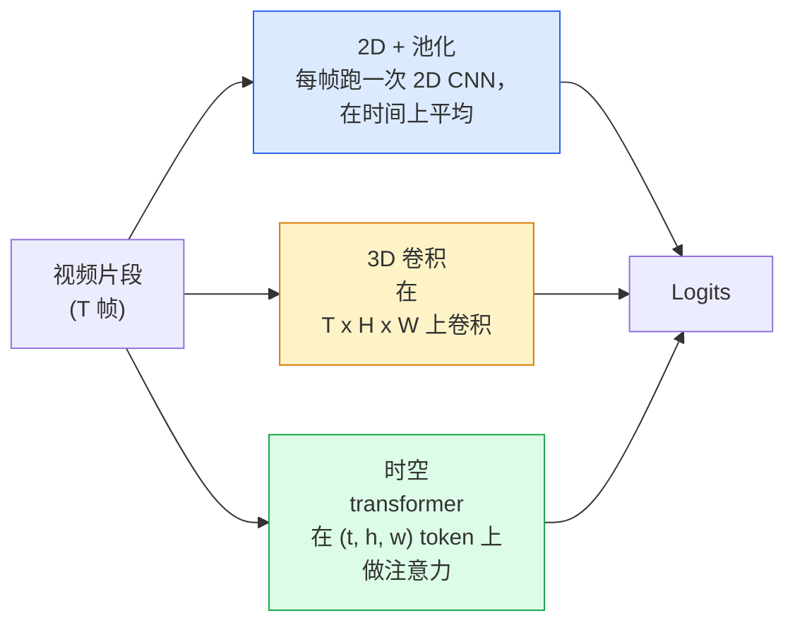

# 视频理解 —— 时序建模

> 一段视频是一串图像，加上把它们连起来的物理。每个视频模型要么把时间当成一个额外的轴（3D 卷积）、一个可注意的序列（transformer），要么当成一个提取一次再池化的特征（2D+池化）。

**类型：** Learn + Build
**语言：** Python
**前置要求：** 阶段 4 第 03 课（CNN）、阶段 4 第 04 课（图像分类）
**预计时间：** ~45 分钟

## 学习目标

- 区分三种主要的视频建模方法（2D+池化、3D 卷积、时空 transformer），预测它们的成本和准确率权衡
- 用 PyTorch 实现帧采样、时序池化，以及一个 2D+池化的基线分类器
- 解释为什么 I3D 的"膨胀"3D 核能从 ImageNet 权重很好地迁移，以及因式分解的 (2+1)D 卷积做法有何不同
- 读懂标准动作识别数据集和指标：Kinetics-400/600、UCF101、Something-Something V2；clip 级和 video 级的 top-1 准确率

## 问题所在

一段 30 秒、30 fps 的视频是 900 张图像。朴素地看，视频分类就是把图像分类跑 900 次再做某种聚合。当动作在几乎每一帧都可见时（体育、烹饪、健身视频），这行得通；而当动作由运动本身定义时就惨败："把某物从左推到右"在每一帧里看起来都是两个静止的物体。

每个视频架构的核心问题是：时序结构何时被建模、怎么建模？答案驱动其余一切——算力成本、预训练策略、能否复用 ImageNet 权重、模型在什么数据集上训练。

这一课故意比静态图像那几课短。图像的核心机制已经就位，视频理解大多是关于时序这条线：采样、建模、聚合。

## 核心概念

### 三个架构家族



### 2D + 池化

拿一个 2D CNN（ResNet、EfficientNet、ViT）。在每个采样帧上独立跑它。把逐帧嵌入做平均（或 max-pool，或 attention-pool）。把池化后的向量喂给分类器。

优点：
- ImageNet 预训练直接迁移。
- 实现最简单。
- 便宜：T 帧 * 单图推理成本。

缺点：
- 无法建模运动。动作 = 外观的聚合。
- 时序池化对顺序不变；"开门"和"关门"看起来一样。

何时用：外观主导的任务、小视频数据集上的迁移学习、初始基线。

### 3D 卷积

把 2D (H, W) 核换成 3D (T, H, W) 核。网络在空间和时间上都做卷积。早期家族：C3D、I3D、SlowFast。

I3D 技巧：拿一个预训练的 2D ImageNet 模型，把每个 2D 核沿一个新的时间轴复制来"膨胀"它。一个 3x3 的 2D 卷积变成一个 3x3x3 的 3D 卷积。这给 3D 模型强大的预训练权重，而不用从零训练。

优点：
- 直接建模运动。
- I3D 膨胀白送迁移学习。

缺点：
- 比 2D 对应物多 T/8 的 FLOPs（时序核为 3、堆 3 次时）。
- 时序核很小；长程运动需要金字塔或双流方法。

何时用：运动即信号的动作识别（Something-Something V2、Kinetics 里运动密集的类别）。

### 时空 transformer

把视频 token 化成时空 patch 的网格，在全部 patch 上做注意力。TimeSformer、ViViT、Video Swin、VideoMAE。

要紧的注意力模式：
- **联合（Joint）** —— 在 (t, h, w) 上做一次大注意力。在 `T*H*W` 上是二次的；贵。
- **分离（Divided）** —— 每个块两次注意力：一次在时间上，一次在空间上。近似线性缩放。
- **因式分解（Factorised）** —— 时间注意力和空间注意力跨块交替。

优点：
- 在每个主流基准上都是 SOTA 准确率。
- 通过 patch 膨胀从图像 transformer（ViT）迁移。
- 通过稀疏注意力支持长上下文视频。

缺点：
- 吃算力。
- 需要小心选注意力模式，否则运行时膨胀。

何时用：大数据集、高保真视频理解、多模态视频+文本任务。

### 帧采样

一段 10 秒、30 fps 的片段是 300 帧；把全部 300 帧喂给任何模型都是浪费。标准策略：

- **均匀采样** —— 在片段上均匀挑 T 帧。2D+池化的默认。
- **密集采样** —— 随机的连续 T 帧窗口。3D 卷积常用，因为运动需要相邻帧。
- **多片段（Multi-clip）** —— 从同一视频采多个 T 帧窗口，各自分类，测试时把预测平均。

T 通常是 8、16、32 或 64。T 越高 = 越多时序信号、越多算力。

### 评估

两个层级：
- **Clip 级准确率** —— 模型看一个 T 帧片段，报告 top-k。
- **Video 级准确率** —— 把每个视频的多个片段的 clip 级预测平均；更高、更稳。

永远两个都报。一个 78% clip / 82% video 的模型严重依赖测试时平均；一个 80% / 81% 的模型在单片段上更鲁棒。

### 你会遇到的数据集

- **Kinetics-400 / 600 / 700** —— 通用动作数据集。40 万片段；YouTube URL（很多现在已失效）。
- **Something-Something V2** —— 运动定义的动作（"把 X 从左移到右"）。无法用 2D+池化解决。
- **UCF-101**、**HMDB-51** —— 更老、更小，仍在被报告。
- **AVA** —— 空间和时间上的动作*定位*；比分类更难。

## 动手构建

### 第 1 步：帧采样器

作用于帧列表（或视频张量）的均匀和密集采样器。

```python
import numpy as np

def sample_uniform(num_frames_total, T):
    if num_frames_total <= T:
        return list(range(num_frames_total)) + [num_frames_total - 1] * (T - num_frames_total)
    step = num_frames_total / T
    return [int(i * step) for i in range(T)]


def sample_dense(num_frames_total, T, rng=None):
    rng = rng or np.random.default_rng()
    if num_frames_total <= T:
        return list(range(num_frames_total)) + [num_frames_total - 1] * (T - num_frames_total)
    start = int(rng.integers(0, num_frames_total - T + 1))
    return list(range(start, start + T))
```

两者都返回 `T` 个索引，你用它们切片视频张量。

### 第 2 步：一个 2D+池化基线

在每帧上跑一个 2D ResNet-18，平均池化特征，分类。

```python
import torch
import torch.nn as nn
from torchvision.models import resnet18, ResNet18_Weights

class FramePool(nn.Module):
    def __init__(self, num_classes=400, pretrained=True):
        super().__init__()
        weights = ResNet18_Weights.IMAGENET1K_V1 if pretrained else None
        backbone = resnet18(weights=weights)
        self.features = nn.Sequential(*(list(backbone.children())[:-1]))  # 保留全局平均池化
        self.head = nn.Linear(512, num_classes)

    def forward(self, x):
        # x: (N, T, 3, H, W)
        N, T = x.shape[:2]
        x = x.view(N * T, *x.shape[2:])
        feats = self.features(x).view(N, T, -1)
        pooled = feats.mean(dim=1)
        return self.head(pooled)

model = FramePool(num_classes=10)
x = torch.randn(2, 8, 3, 224, 224)
print(f"output: {model(x).shape}")
print(f"params: {sum(p.numel() for p in model.parameters()):,}")
```

一千一百万参数，ImageNet 预训练，逐帧跑，平均，分类。在外观密集的任务上，这个基线常常和正经的 3D 模型差距在 5-10 个点以内——有时还更好，因为它复用了一个更强的 ImageNet 骨干。

### 第 3 步：一个 I3D 风格的膨胀 3D 卷积

把单个 2D 卷积沿一个新的时间轴重复权重，变成 3D 卷积。

```python
def inflate_2d_to_3d(conv2d, time_kernel=3):
    out_c, in_c, kh, kw = conv2d.weight.shape
    weight_3d = conv2d.weight.data.unsqueeze(2)  # (out, in, 1, kh, kw)
    weight_3d = weight_3d.repeat(1, 1, time_kernel, 1, 1) / time_kernel
    conv3d = nn.Conv3d(in_c, out_c, kernel_size=(time_kernel, kh, kw),
                        padding=(time_kernel // 2, conv2d.padding[0], conv2d.padding[1]),
                        stride=(1, conv2d.stride[0], conv2d.stride[1]),
                        bias=False)
    conv3d.weight.data = weight_3d
    return conv3d

conv2d = nn.Conv2d(3, 64, kernel_size=3, padding=1, bias=False)
conv3d = inflate_2d_to_3d(conv2d, time_kernel=3)
print(f"2D weight shape:  {tuple(conv2d.weight.shape)}")
print(f"3D weight shape:  {tuple(conv3d.weight.shape)}")
x = torch.randn(1, 3, 8, 56, 56)
print(f"3D output shape:  {tuple(conv3d(x).shape)}")
```

除以 `time_kernel` 让激活量级大致保持不变——这对第一遍不破坏批归一化统计量很重要。

### 第 4 步：因式分解的 (2+1)D 卷积

把一个 3D 卷积拆成一个 2D（空间）和一个 1D（时序）卷积。相同感受野，更少参数，在某些基准上准确率更好。

```python
class Conv2Plus1D(nn.Module):
    def __init__(self, in_c, out_c, kernel_size=3):
        super().__init__()
        mid_c = (in_c * out_c * kernel_size * kernel_size * kernel_size) \
                // (in_c * kernel_size * kernel_size + out_c * kernel_size)
        self.spatial = nn.Conv3d(in_c, mid_c, kernel_size=(1, kernel_size, kernel_size),
                                 padding=(0, kernel_size // 2, kernel_size // 2), bias=False)
        self.bn = nn.BatchNorm3d(mid_c)
        self.act = nn.ReLU(inplace=True)
        self.temporal = nn.Conv3d(mid_c, out_c, kernel_size=(kernel_size, 1, 1),
                                  padding=(kernel_size // 2, 0, 0), bias=False)

    def forward(self, x):
        return self.temporal(self.act(self.bn(self.spatial(x))))

c = Conv2Plus1D(3, 64)
x = torch.randn(1, 3, 8, 56, 56)
print(f"(2+1)D output: {tuple(c(x).shape)}")
```

一个完整的 R(2+1)D 网络就是一个 ResNet-18，把每个 3x3 卷积换成 `Conv2Plus1D`。

## 上手使用

两个库覆盖生产视频工作：

- `torchvision.models.video` —— R(2+1)D、MViT、Swin3D，带预训练的 Kinetics 权重。和图像模型同一套 API。
- `pytorchvideo`（Meta）—— 模型库、Kinetics / SSv2 / AVA 的 data loader、标准变换。

做视觉-语言视频模型（视频字幕、视频问答），用 `transformers`（`VideoMAE`、`VideoLLaMA`、`InternVideo`）。

## 交付

这一课产出：

- `outputs/prompt-video-architecture-picker.md` —— 一个 prompt，根据"外观 vs 运动"、数据集规模和算力预算，挑选 2D+池化 / I3D / (2+1)D / transformer。
- `outputs/skill-frame-sampler-auditor.md` —— 一个 skill，检查视频 pipeline 的采样器并标出常见 bug：差一索引、`num_frames < T` 时采样不均、缺少保宽高比的裁剪等。

## 练习

1. **（简单）** 算 FramePool（T=8）与 I3D 风格 3D ResNet（T=8）的（近似）FLOPs。论证为什么 2D+池化便宜 3-5 倍。
2. **（中等）** 生成一个合成视频数据集：随机的球往随机方向移动，按运动方向打标签（"从左到右""从右到左""对角向上"）。在它上面训练 FramePool。展示它达到接近随机的准确率，证明对运动任务光靠外观不够。
3. **（困难）** 把 ResNet-18 里每个 Conv2d 换成 `Conv2Plus1D`，搭一个 R(2+1)D-18。从一个 ImageNet 预训练的 ResNet-18 膨胀第一个卷积的权重。在练习 2 的运动数据集上训练，打败 FramePool。

## 关键术语

| 术语 | 大家嘴上怎么说 | 它实际是什么 |
|------|----------------|----------------------|
| 2D + 池化 | "逐帧分类器" | 在每个采样帧上跑一个 2D CNN，跨时间平均池化特征，分类 |
| 3D 卷积 | "时空核" | 在 (T, H, W) 上卷积的核；能原生建模运动 |
| 膨胀（Inflation） | "把 2D 权重抬到 3D" | 沿新时间轴重复 2D 卷积的权重来初始化 3D 卷积权重，再除以 kernel_T 保住激活尺度 |
| (2+1)D | "因式分解卷积" | 把 3D 拆成 2D 空间 + 1D 时序；更少参数，中间多一个非线性 |
| 分离注意力 | "先时间后空间" | 每层两次注意力的 transformer 块：一次在同一帧的 token 上，一次在同一位置的 token 上 |
| Clip | "T 帧窗口" | T 帧的一个采样子序列；视频模型消费的单位 |
| Clip vs video 准确率 | "两种评估设置" | Clip = 每视频一个样本，video = 跨多个采样片段平均 |
| Kinetics | "视频界的 ImageNet" | 400-700 个动作类别、30 万+ YouTube 片段，标准的视频预训练语料 |

## 延伸阅读

- [I3D: Quo Vadis, Action Recognition (Carreira & Zisserman, 2017)](https://arxiv.org/abs/1705.07750) —— 引入膨胀和 Kinetics 数据集
- [R(2+1)D: A Closer Look at Spatiotemporal Convolutions (Tran et al., 2018)](https://arxiv.org/abs/1711.11248) —— 因式分解卷积，至今仍是强基线
- [TimeSformer: Is Space-Time Attention All You Need? (Bertasius et al., 2021)](https://arxiv.org/abs/2102.05095) —— 第一个强大的视频 transformer
- [VideoMAE (Tong et al., 2022)](https://arxiv.org/abs/2203.12602) —— 视频的掩码自编码器预训练；当前主导的预训练配方
