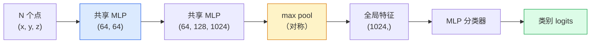

# 3D 视觉 —— 点云与 NeRF

> 3D 视觉有两种口味。点云是传感器的原始输出。NeRF 是学出来的体积场。两者都回答"什么东西在空间的哪个位置"。

**类型：** Learn + Build
**语言：** Python
**前置要求：** 阶段 4 第 03 课（CNN）、阶段 1 第 12 课（张量运算）
**预计时间：** ~45 分钟

## 学习目标

- 区分显式（点云、网格、体素）和隐式（有符号距离场、NeRF）3D 表示，以及各自何时使用
- 理解 PointNet 的对称函数技巧，它让神经网络对一个无序点集具有置换不变性
- 梳理一次 NeRF 前向：射线投射、体积渲染、位置编码、MLP 密度+颜色头
- 用 `nerfstudio` 或 `instant-ngp`，从一小组带位姿的图像做预训练 3D 重建

## 问题所在

相机产出一张 2D 图像。LIDAR 产出一组没有顺序的 3D 点。运动恢复结构（structure-from-motion）流水线产出一团稀疏的 3D 关键点云。NeRF 从一小撮带位姿的图像重建出整个 3D 场景。这些都是"视觉"，但没一个长得像 CNN 想要的稠密张量。

3D 视觉要紧，是因为几乎每个高价值的机器人任务都跑在 3D 里：抓取、避障、导航、AR 遮挡、3D 内容采集。一个只懂 2D 图像的视觉工程师，被挡在了这个领域增长最快的那一块之外（AR/VR 内容、机器人、自动驾驶栈、用于地产或建筑的基于 NeRF 的 3D 重建）。

这两种表示各因不同原因占主导。点云是传感器白送给你的。NeRF 及其后继（3D 高斯泼溅、神经 SDF）是你让神经网络去学一个场景时得到的。

## 核心概念

### 点云

点云是 R^3 里 N 个点的无序集合，每个点可选地带特征（颜色、强度、法向）。

```
cloud = [
  (x1, y1, z1, r1, g1, b1),
  (x2, y2, z2, r2, g2, b2),
  ...
  (xN, yN, zN, rN, gN, bN),
]
```

没有网格，没有连接关系。两个性质让这对神经网络很难：

- **置换不变性** —— 输出不能依赖点的顺序。
- **可变 N** —— 单个模型必须处理不同大小的点云。

PointNet（Qi 等人，2017）用一个点子解决了两者：对每个点应用共享 MLP，再用一个对称函数（max pool）聚合。结果是一个不依赖顺序的固定大小向量。

```
f(P) = max_{p in P} MLP(p)
```

这就是 PointNet 的整个核心。更深的变体（PointNet++、Point Transformer）加了层级采样和局部聚合，但对称函数技巧没变。

### PointNet 架构



"共享 MLP"意思是同一个 MLP 独立地在每个点上跑。为效率起见，实现成在点维度上的 1x1 卷积。

### 神经辐射场（NeRF）

NeRF（Mildenhall 等人，2020）拿"我们能从 N 张照片重建一个 3D 场景吗？"这个问题，用一个本身就是场景的神经网络来回答。网络把 `(x, y, z, viewing_direction)` 映射到 `(density, colour)`。渲染一个新视角，就是在这个网络上的一个射线投射循环。

```
NeRF MLP:  (x, y, z, theta, phi) -> (sigma, r, g, b)

要渲染新视角的一个像素 (u, v)：
  1. 从相机经过像素 (u, v) 投射一条射线
  2. 沿射线在距离 t_1, t_2, ..., t_N 处采样点
  3. 在每个点查询 MLP
  4. 用 (1 - exp(-sigma * dt)) 加权合成颜色
  5. 求和就是渲染出的像素颜色
```

一个损失把渲染像素和训练照片里的真值像素比较。穿过渲染步反向传播来更新 MLP。没有 3D 真值，没有显式几何——场景存在 MLP 权重里。

### NeRF 里的位置编码

朴素 MLP 直接吃 `(x, y, z)` 无法表示高频细节，因为 MLP 在谱上偏向低频。NeRF 通过在 MLP 之前把每个坐标编码成傅里叶特征向量来修这点：

```
gamma(p) = (sin(2^0 pi p), cos(2^0 pi p), sin(2^1 pi p), cos(2^1 pi p), ...)
```

最多 L=10 个频率级。这和 transformer 用于位置的技巧一样，在扩散的时间条件化里也再次出现（第 10 课）。没有它，NeRF 看起来很模糊。

### 体积渲染

```
C(r) = sum_i T_i * (1 - exp(-sigma_i * delta_i)) * c_i

T_i  = exp(- sum_{j<i} sigma_j * delta_j)
delta_i = t_{i+1} - t_i
```

`T_i` 是透射率——多少光能存活到点 i。`(1 - exp(-sigma_i * delta_i))` 是点 i 处的不透明度。`c_i` 是颜色。最终像素是沿射线的加权和。

### 什么取代了 NeRF

纯 NeRF 训练慢（几小时）、渲染慢（每张图几秒）。此后的脉络：

- **Instant-NGP**（2022）—— 哈希网格编码取代 MLP 的位置输入；几秒训完。
- **Mip-NeRF 360** —— 处理无界场景和抗锯齿。
- **3D 高斯泼溅**（2023）—— 用数百万个 3D 高斯替换体积场；几分钟训完，实时渲染。当前的生产默认。

2026 年几乎每个真实的 NeRF 产品其实都是 3D 高斯泼溅。心智模型仍是 NeRF。

### 数据集和基准

- **ShapeNet** —— 把 3D CAD 模型当点云做分类和分割。
- **ScanNet** —— 真实室内扫描，用于分割。
- **KITTI** —— 户外 LIDAR 点云，用于自动驾驶。
- **NeRF Synthetic** / **Blended MVS** —— 带位姿的图像数据集，用于视角合成。
- **Mip-NeRF 360** 数据集 —— 无界真实场景。

## 动手构建

### 第 1 步：PointNet 分类器

```python
import torch
import torch.nn as nn

class PointNet(nn.Module):
    def __init__(self, num_classes=10):
        super().__init__()
        self.mlp1 = nn.Sequential(
            nn.Conv1d(3, 64, 1),    nn.BatchNorm1d(64),   nn.ReLU(inplace=True),
            nn.Conv1d(64, 64, 1),   nn.BatchNorm1d(64),   nn.ReLU(inplace=True),
        )
        self.mlp2 = nn.Sequential(
            nn.Conv1d(64, 128, 1),  nn.BatchNorm1d(128),  nn.ReLU(inplace=True),
            nn.Conv1d(128, 1024, 1), nn.BatchNorm1d(1024), nn.ReLU(inplace=True),
        )
        self.head = nn.Sequential(
            nn.Linear(1024, 512),   nn.BatchNorm1d(512),  nn.ReLU(inplace=True),
            nn.Dropout(0.3),
            nn.Linear(512, 256),    nn.BatchNorm1d(256),  nn.ReLU(inplace=True),
            nn.Dropout(0.3),
            nn.Linear(256, num_classes),
        )

    def forward(self, x):
        # x: (N, 3, num_points) —— 为 Conv1d 转置过
        x = self.mlp1(x)
        x = self.mlp2(x)
        x = torch.max(x, dim=-1)[0]       # (N, 1024)
        return self.head(x)

pts = torch.randn(4, 3, 1024)
net = PointNet(num_classes=10)
print(f"output: {net(pts).shape}")
print(f"params: {sum(p.numel() for p in net.parameters()):,}")
```

约 160 万参数。每片点云跑 1,024 个点。

### 第 2 步：位置编码

```python
def positional_encoding(x, L=10):
    """
    x: (..., D) -> (..., D * 2 * L)
    """
    freqs = 2.0 ** torch.arange(L, dtype=x.dtype, device=x.device)
    args = x.unsqueeze(-1) * freqs * 3.141592653589793
    sinc = torch.cat([args.sin(), args.cos()], dim=-1)
    return sinc.reshape(*x.shape[:-1], -1)

x = torch.randn(5, 3)
y = positional_encoding(x, L=10)
print(f"input:  {x.shape}")
print(f"encoded: {y.shape}     # (5, 60)")
```

乘以 `2^l * pi` 给出逐级更高的频率。

### 第 3 步：迷你 NeRF MLP

```python
class TinyNeRF(nn.Module):
    def __init__(self, L_pos=10, L_dir=4, hidden=128):
        super().__init__()
        self.L_pos = L_pos
        self.L_dir = L_dir
        pos_dim = 3 * 2 * L_pos
        dir_dim = 3 * 2 * L_dir
        self.trunk = nn.Sequential(
            nn.Linear(pos_dim, hidden), nn.ReLU(inplace=True),
            nn.Linear(hidden, hidden),  nn.ReLU(inplace=True),
            nn.Linear(hidden, hidden),  nn.ReLU(inplace=True),
            nn.Linear(hidden, hidden),  nn.ReLU(inplace=True),
        )
        self.sigma = nn.Linear(hidden, 1)
        self.color = nn.Sequential(
            nn.Linear(hidden + dir_dim, hidden // 2), nn.ReLU(inplace=True),
            nn.Linear(hidden // 2, 3), nn.Sigmoid(),
        )

    def forward(self, x, d):
        x_enc = positional_encoding(x, self.L_pos)
        d_enc = positional_encoding(d, self.L_dir)
        h = self.trunk(x_enc)
        sigma = torch.relu(self.sigma(h)).squeeze(-1)
        rgb = self.color(torch.cat([h, d_enc], dim=-1))
        return sigma, rgb

nerf = TinyNeRF()
x = torch.randn(128, 3)
d = torch.randn(128, 3)
s, c = nerf(x, d)
print(f"sigma: {s.shape}   rgb: {c.shape}")
```

比原始 NeRF（有 2 个深度为 8 的 MLP 主干）小得多。够用来演示架构。

### 第 4 步：沿射线做体积渲染

```python
def volumetric_render(sigma, rgb, t_vals):
    """
    sigma: (..., N_samples)
    rgb:   (..., N_samples, 3)
    t_vals: (N_samples,) 沿射线的距离
    """
    delta = torch.cat([t_vals[1:] - t_vals[:-1], torch.full_like(t_vals[:1], 1e10)])
    alpha = 1.0 - torch.exp(-sigma * delta)
    trans = torch.cumprod(torch.cat([torch.ones_like(alpha[..., :1]), 1.0 - alpha + 1e-10], dim=-1), dim=-1)[..., :-1]
    weights = alpha * trans
    rendered = (weights.unsqueeze(-1) * rgb).sum(dim=-2)
    depth = (weights * t_vals).sum(dim=-1)
    return rendered, depth, weights


N = 64
t_vals = torch.linspace(2.0, 6.0, N)
sigma = torch.rand(N) * 0.5
rgb = torch.rand(N, 3)
rendered, depth, weights = volumetric_render(sigma, rgb, t_vals)
print(f"rendered colour: {rendered.tolist()}")
print(f"depth:           {depth.item():.2f}")
```

一条射线，64 个采样，合成为单个 RGB 像素和一个深度。

## 上手使用

干真活：

- `nerfstudio`（Tancik 等人）—— NeRF / Instant-NGP / 高斯泼溅当前的参考库。命令行加一个 web 查看器。
- `pytorch3d`（Meta）—— 可微渲染、点云工具、网格操作。
- `open3d` —— 点云处理、配准、可视化。

部署时，3D 高斯泼溅已基本取代了纯 NeRF，因为它渲染快 100 倍。重建质量相当。

## 交付

这一课产出：

- `outputs/prompt-3d-task-router.md` —— 一个 prompt，根据任务和输入数据路由到合适的 3D 表示（点云、网格、体素、NeRF、高斯泼溅）。
- `outputs/skill-point-cloud-loader.md` —— 一个 skill，为 .ply / .pcd / .xyz 文件写一个 PyTorch `Dataset`，含正确的归一化、居中和点采样。

## 练习

1. **（简单）** 证明 PointNet 是置换不变的：把同一片点云跑两次，一次把点打乱。验证输出在浮点噪声范围内一致。
2. **（中等）** 实现一个极简的射线生成函数，给定相机内参和位姿，为一张 H x W 图像的每个像素产出射线原点和方向。
3. **（困难）** 在一个彩色立方体的渲染视角合成数据集上（用可微渲染或简单光线追踪器生成）训练一个 TinyNeRF。报告第 1、10、100 个 epoch 的渲染损失。到第几个 epoch 模型产出可辨认的视角？

## 关键术语

| 术语 | 大家嘴上怎么说 | 它实际是什么 |
|------|----------------|----------------------|
| 点云 | "来自 LIDAR 的 3D 点" | (x, y, z) 的无序集合，每个点可选地带特征 |
| PointNet | "第一个跑在点云上的神经网络" | 每点共享 MLP + 对称（max）池化；天然置换不变 |
| NeRF | "本身就是场景的 MLP" | 把 (x, y, z, dir) 映射到 (密度, 颜色) 的网络；靠射线投射渲染 |
| 位置编码 | "傅里叶特征" | 把每个坐标编码成多个频率上的 sin/cos，克服 MLP 的低频偏置 |
| 体积渲染 | "射线积分" | 用透射率和 alpha 把沿射线的采样合成为单个像素 |
| Instant-NGP | "哈希网格 NeRF" | 用多分辨率哈希网格替换 NeRF 的坐标 MLP；快 100-1000 倍 |
| 3D 高斯泼溅 | "数百万个高斯" | 场景 = 一堆 3D 高斯；实时渲染，几分钟训完 |
| SDF | "有符号距离场" | 返回到最近表面有符号距离的函数；另一种隐式表示 |

## 延伸阅读

- [PointNet (Qi et al., 2017)](https://arxiv.org/abs/1612.00593) —— 置换不变的分类器
- [NeRF (Mildenhall et al., 2020)](https://arxiv.org/abs/2003.08934) —— 让"从照片做 3D 重建"成为神经网络问题的那篇论文
- [Instant-NGP (Müller et al., 2022)](https://arxiv.org/abs/2201.05989) —— 哈希网格，1000 倍加速
- [3D Gaussian Splatting (Kerbl et al., 2023)](https://arxiv.org/abs/2308.04079) —— 在生产中取代 NeRF 的架构
