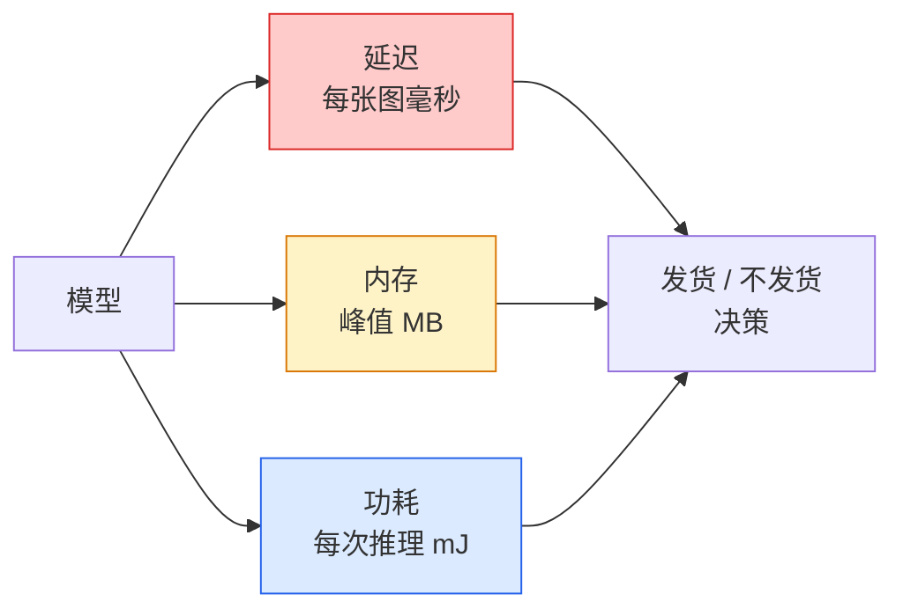

# 实时视觉 —— 边缘部署

> 边缘推理是这样一门手艺：让一个 90 准确率的模型在一台只有 2 GB 内存的设备上以 30 fps 跑起来。每一个百分点的准确率，都在和几毫秒的延迟做交换。

**类型：** Learn + Build
**语言：** Python
**前置要求：** 阶段 4 第 04 课（图像分类）、阶段 10 第 11 课（量化）
**预计时间：** ~75 分钟

## 学习目标

- 为任意 PyTorch 模型测量推理延迟、峰值内存和吞吐，读懂 FLOPs / 参数 / 延迟的权衡
- 用 PyTorch 的训练后量化把视觉模型量化到 INT8，验证准确率损失 < 1%
- 导出到 ONNX 并用 ONNX Runtime 或 TensorRT 编译；说出三种最常见的导出失败及其修法
- 解释边缘约束下何时挑 MobileNetV3、EfficientNet-Lite、ConvNeXt-Tiny 或 MobileViT

## 问题所在

训练时的视觉模型是个浮点怪兽。1 亿参数，每次前向 10 GFLOPs，2 GB 显存。这些没一样塞得进手机、车载信息娱乐单元、工业相机或无人机。交付一个视觉系统，意味着把同样的预测塞进一个小 100 倍的预算里。

三个旋钮干了大部分活：模型选择（同样配方下更小的架构）、量化（INT8 而非 FP32），以及推理运行时（ONNX Runtime、TensorRT、Core ML、TFLite）。把它们调对，就是"在工作站上跑的 demo"和"装在 30 美元相机模组上发货的产品"之间的差别。

这一课先立起测量的纪律（测不了就优化不了），再走这三个旋钮。目标不是学会每个边缘运行时，而是知道有哪些杠杆、以及怎么验证每一个都做了你以为它做的事。

## 核心概念

### 三项预算



- **延迟**：p50、p95、p99。只看 p50 的平均会掩盖尾部行为，而尾部对实时系统很要紧。
- **峰值内存**：设备见过的最大值，不是稳态平均。要紧是因为在嵌入式目标上 OOM 是致命的。
- **功耗 / 能量**：电池供电设备上每次推理的毫焦。常用 CPU/GPU 利用率 * 时间来代理。

一张 (模型, 延迟, 内存, 准确率) 的表，就是边缘决策的依据。每个格子都在目标设备上测，不是在工作站上。

### 测量纪律

每次边缘性能分析都该遵守的三条规则：

1. 测量前用 5-10 次占位前向**预热**模型。冷缓存和 JIT 编译产生不具代表性的最初数字。
2. 在计时块前后用 `torch.cuda.synchronize()` **同步** GPU 工作负载。不这么做，你测的是 kernel 分发，不是 kernel 执行。
3. 把输入尺寸**固定**到生产分辨率。224x224 的延迟不是 512x512 的延迟。

### 把 FLOPs 当代理

FLOPs（每次推理的浮点运算数）是延迟的一个便宜、与设备无关的代理。用于架构对比有用，当绝对墙钟时间会误导。一个 FLOPs 多 10% 的模型在实践中可能快 2 倍，因为它用了硬件友好的操作（深度可分卷积编译得好，大的 7x7 卷积不行）。

规则：架构搜索用 FLOPs，部署决策用设备上的延迟。

### 一段话讲清量化

把 FP32 权重和激活换成 INT8。模型大小降 4 倍，内存带宽降 4 倍，在有 INT8 kernel 的硬件上（每个现代移动 SoC、每个带 Tensor Core 的 NVIDIA GPU）算力降 2-4 倍。视觉任务上用训练后静态量化，准确率损失通常是 0.1-1 个百分点。

类型：

- **动态** —— 权重量化成 INT8，激活用 FP 计算。简单，加速小。
- **静态（训练后）** —— 量化权重 + 在一个小校准集上校准激活范围。比动态快得多。
- **量化感知训练（QAT）** —— 训练时模拟量化，让模型围着它学。准确率最佳，需要带标签数据。

对视觉，训练后静态量化用 5% 的力气拿到 95% 的好处。只在 PTQ 的准确率损失无法接受时才用 QAT。

### 剪枝和蒸馏

- **剪枝** —— 移除不重要的权重（基于幅值）或通道（结构化）。在过参数化的模型上效果好；在已经紧凑的架构上没那么有用。
- **蒸馏** —— 训练一个小学生去模仿大教师的 logits。常常能找回缩小模型时损失的大部分准确率。生产边缘模型的标准做法。

### 推理运行时

- **PyTorch eager** —— 慢，不用于部署。仅用于开发。
- **TorchScript** —— 遗留。被 `torch.compile` 和 ONNX 导出取代。
- **ONNX Runtime** —— 中立运行时。CPU、CUDA、CoreML、TensorRT、OpenVINO 都有 ONNX provider。从这里起步。
- **TensorRT** —— NVIDIA 的编译器。在 NVIDIA GPU（工作站和 Jetson）上延迟最佳。和 ONNX Runtime 集成或独立用。
- **Core ML** —— Apple 的 iOS/macOS 运行时。需要 `.mlmodel` 或 `.mlpackage`。
- **TFLite** —— Google 的 Android/ARM 运行时。需要 `.tflite`。
- **OpenVINO** —— Intel 的 CPU/VPU 运行时。需要 `.xml` + `.bin`。

实践中：导出 PyTorch -> ONNX -> 为目标挑运行时。ONNX 是通用语。

### 边缘架构选择器

| 预算 | 模型 | 为什么 |
|--------|-------|-----|
| < 3M 参数 | MobileNetV3-Small | 哪儿都能编译，不错的基线 |
| 3-10M | EfficientNet-Lite-B0 | TFLite 上每参数准确率最佳 |
| 10-20M | ConvNeXt-Tiny | 每参数准确率最佳，对 CPU 友好 |
| 20-30M | MobileViT-S 或 EfficientViT | 带 ImageNet 准确率的 transformer |
| 30-80M | Swin-V2-Tiny | 如果栈支持窗口注意力 |

把这些都量化到 INT8，除非你有特定理由不这么做。

## 动手构建

### 第 1 步：正确测量延迟

```python
import time
import torch

def measure_latency(model, input_shape, device="cpu", warmup=10, iters=50):
    model = model.to(device).eval()
    x = torch.randn(input_shape, device=device)
    with torch.no_grad():
        for _ in range(warmup):
            model(x)
        if device == "cuda":
            torch.cuda.synchronize()
        times = []
        for _ in range(iters):
            if device == "cuda":
                torch.cuda.synchronize()
            t0 = time.perf_counter()
            model(x)
            if device == "cuda":
                torch.cuda.synchronize()
            times.append((time.perf_counter() - t0) * 1000)
    times.sort()
    return {
        "p50_ms": times[len(times) // 2],
        "p95_ms": times[int(len(times) * 0.95)],
        "p99_ms": times[int(len(times) * 0.99)],
        "mean_ms": sum(times) / len(times),
    }
```

预热、同步、用 `time.perf_counter()`。报百分位数，不只是均值。

### 第 2 步：参数和 FLOP 计数

```python
def parameter_count(model):
    return sum(p.numel() for p in model.parameters())

def flops_estimate(model, input_shape):
    """
    只含卷积/线性的模型的粗略 FLOP 计数。生产中用 `fvcore` 或 `ptflops`。
    """
    total = 0
    def conv_hook(m, inp, out):
        nonlocal total
        c_out, c_in, kh, kw = m.weight.shape
        h, w = out.shape[-2:]
        total += 2 * c_in * c_out * kh * kw * h * w
    def linear_hook(m, inp, out):
        nonlocal total
        total += 2 * m.in_features * m.out_features
    hooks = []
    for m in model.modules():
        if isinstance(m, torch.nn.Conv2d):
            hooks.append(m.register_forward_hook(conv_hook))
        elif isinstance(m, torch.nn.Linear):
            hooks.append(m.register_forward_hook(linear_hook))
    model.eval()
    with torch.no_grad():
        model(torch.randn(input_shape))
    for h in hooks:
        h.remove()
    return total
```

真实项目用 `fvcore.nn.FlopCountAnalysis` 或 `ptflops`；它们正确处理每种模块类型。

### 第 3 步：训练后静态量化

```python
def quantise_ptq(model, calibration_loader, backend="x86"):
    import torch.ao.quantization as tq
    model = model.eval().cpu()
    model.qconfig = tq.get_default_qconfig(backend)
    tq.prepare(model, inplace=True)
    with torch.no_grad():
        for x, _ in calibration_loader:
            model(x)
    tq.convert(model, inplace=True)
    return model
```

三步：配置、prepare（插入 observer）、用真实数据校准、convert（融合 + 量化）。要求模型先被融合（`Conv -> BN -> ReLU` -> `ConvBnReLU`），这个由 `torch.ao.quantization.fuse_modules` 处理。

### 第 4 步：导出到 ONNX

```python
def export_onnx(model, sample_input, path="model.onnx"):
    model = model.eval()
    torch.onnx.export(
        model,
        sample_input,
        path,
        input_names=["input"],
        output_names=["output"],
        dynamic_axes={"input": {0: "batch"}, "output": {0: "batch"}},
        opset_version=17,
    )
    return path
```

`opset_version=17` 是 2026 年的安全默认。`dynamic_axes` 让你以任意 batch 大小运行 ONNX 模型。

### 第 5 步：基准测试并对比各模式

```python
import torch.nn as nn
from torchvision.models import mobilenet_v3_small

def compare_regimes():
    model = mobilenet_v3_small(weights=None, num_classes=10)
    params = parameter_count(model)
    flops = flops_estimate(model, (1, 3, 224, 224))
    lat_fp32 = measure_latency(model, (1, 3, 224, 224), device="cpu")
    print(f"FP32 MobileNetV3-Small: {params:,} params  {flops/1e9:.2f} GFLOPs  "
          f"p50={lat_fp32['p50_ms']:.2f}ms  p95={lat_fp32['p95_ms']:.2f}ms")
```

对 `resnet50`、`efficientnet_v2_s` 和 `convnext_tiny` 跑同一个函数，你就有了做部署决策所需的对比表。

## 上手使用

生产栈收敛到三条路径之一：

- **Web / serverless**：PyTorch -> ONNX -> ONNX Runtime（CPU 或 CUDA provider）。最容易，对多数场景够用。
- **NVIDIA 边缘（Jetson、GPU 服务器）**：PyTorch -> ONNX -> TensorRT。延迟最佳，工程量最大。
- **移动端**：PyTorch -> ONNX -> Core ML（iOS）或 TFLite（Android）。导出前先量化。

测量方面，`torch-tb-profiler`、`nvprof` / `nsys`，以及 macOS 上的 Instruments 给出逐层分解。`benchmark_app`（OpenVINO）和 `trtexec`（TensorRT）给出独立的 CLI 数字。

## 交付

这一课产出：

- `outputs/prompt-edge-deployment-planner.md` —— 一个 prompt，给定目标设备和延迟 SLA，挑出骨干、量化策略和运行时。
- `outputs/skill-latency-profiler.md` —— 一个 skill，写出一个完整的延迟基准测试脚本，含预热、同步、百分位数和内存追踪。

## 练习

1. **（简单）** 在 CPU 上测量 `resnet18`、`mobilenet_v3_small`、`efficientnet_v2_s` 和 `convnext_tiny` 在 224x224 的 p50 延迟。报告这张表，找出哪个架构的"每毫秒准确率"最佳。
2. **（中等）** 对 `mobilenet_v3_small` 应用训练后静态量化。在 CIFAR-10 或类似数据集的一个留出子集上报告 FP32 vs INT8 的延迟和准确率损失。
3. **（困难）** 把 `convnext_tiny` 导出到 ONNX，用 `onnxruntime` 配 `CPUExecutionProvider` 跑它，和 PyTorch eager 基线比延迟。找出 ONNX Runtime 开始更快的第一个层并解释为什么。

## 关键术语

| 术语 | 大家嘴上怎么说 | 它实际是什么 |
|------|----------------|----------------------|
| 延迟 | "多快" | 从输入到输出的时间；p50/p95/p99 百分位，不是均值 |
| FLOPs | "模型大小" | 每次前向的浮点运算数；算力成本的粗略代理 |
| INT8 量化 | "8 比特" | 把 FP32 权重/激活换成 8 位整数；小约 4 倍，快 2-4 倍 |
| PTQ | "训练后量化" | 不重训就量化一个训练好的模型；简单，通常够用 |
| QAT | "量化感知训练" | 训练时模拟量化；准确率最佳，需要带标签数据 |
| ONNX | "中立格式" | 每个主流推理运行时都支持的模型交换格式 |
| TensorRT | "NVIDIA 编译器" | 把 ONNX 编译成 NVIDIA GPU 的优化引擎 |
| 蒸馏 | "教师 -> 学生" | 训练一个小模型模仿大模型的 logits；找回大部分损失的准确率 |

## 延伸阅读

- [EfficientNet (Tan & Le, 2019)](https://arxiv.org/abs/1905.11946) —— 用于高效架构的复合缩放
- [MobileNetV3 (Howard et al., 2019)](https://arxiv.org/abs/1905.02244) —— 带 h-swish 和 squeeze-excite 的移动优先架构
- [A Practical Guide to TensorRT Optimization (NVIDIA)](https://developer.nvidia.com/blog/accelerating-model-inference-with-tensorrt-tips-and-best-practices-for-pytorch-users/) —— 如何真正拿到论文里的吞吐数字
- [ONNX Runtime docs](https://onnxruntime.ai/docs/) —— 量化、图优化、provider 选择
