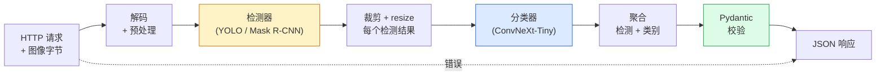

# 搭一条完整的视觉流水线 —— 综合项目

> 一个生产级视觉系统是一串模型和规则，用数据契约缝合起来。这些部件本阶段已经齐了；综合项目把它们端到端接起来。

**类型：** Build
**语言：** Python
**前置要求：** 阶段 4 第 01-15 课
**预计时间：** ~120 分钟

## 学习目标

- 设计一条生产视觉流水线，检测物体、对它们分类、产出结构化 JSON——每条失败路径都处理掉
- 把一个检测器（Mask R-CNN 或 YOLO）、一个分类器（ConvNeXt-Tiny）和一份数据契约（Pydantic）插进一个服务里
- 给端到端流水线做基准测试，找出第一个瓶颈（通常是预处理，然后是检测器）
- 交付一个极简 FastAPI 服务，接受图像上传、跑流水线、返回带分类的检测结果

## 问题所在

单个视觉模型有用；视觉产品是它们的链条。零售货架审计是检测器加产品分类器加价格 OCR 流水线。自动驾驶是 2D 检测器加 3D 检测器加分割器加追踪器加规划器。医学预筛是分割器加区域分类器加临床医生 UI。

把这些链条接起来，正是区分"ML 原型"和"产品"的那部分。模型之间每个接口都是 bug 的新藏身处。每个坐标变换、每次归一化、每次掩码 resize，都是无声故障的候选。一条流水线的强度等于它最弱的那个接口。

这个综合项目搭起最小可用流水线：检测 + 分类 + 结构化输出 + 一个服务层。Phase 4 里其余一切都嵌进这个骨架：把 Mask R-CNN 换成 YOLOv8、加个 OCR 头、加个分割分支、加个追踪器。架构稳定；部件可插拔。

## 核心概念

### 流水线



七个阶段。两个模型阶段很贵；其余五个阶段才是 bug 藏身的地方。

### 用 Pydantic 做数据契约

每个模型边界都变成一个带类型的对象。这把无声故障变成了响亮的故障。

```
Detection(
    box: tuple[float, float, float, float],   # (x1, y1, x2, y2)，绝对像素
    score: float,                              # [0, 1]
    class_id: int,                             # 来自检测器的标签映射
    mask: Optional[list[list[int]]],           # 若存在则 RLE 编码
)

PipelineResult(
    image_id: str,
    detections: list[Detection],
    classifications: list[Classification],
    inference_ms: float,
)
```

当一个检测器返回的框是 `(cx, cy, w, h)` 而不是 `(x1, y1, x2, y2)` 时，Pydantic 的校验在边界处失败，你立刻就发现了，而不是去调试一个悄悄返回空区域的下游裁剪。

### 延迟都去哪了

几乎每条视觉流水线里都成立的三个事实：

1. **预处理常常是最大的单个块。** 解码 JPEG、转换色彩空间、resize——这些是 CPU 密集的，又容易被忘掉。
2. **检测器主导 GPU 时间。** 70-90% 的 GPU 时间在检测的前向里。
3. **后处理（NMS、RLE 编解码）在 GPU 上便宜，在 CPU 上贵。** 永远用真实的目标来 profile。

知道这个分布，就能把优化变成一份按优先级排好的清单。

### 失败模式

- **空检测** —— 返回空列表，别崩。记日志。
- **越界的框** —— 裁剪前 clamp 到图像尺寸。
- **极小的裁剪** —— 对小于分类器最小输入的框跳过分类。
- **损坏的上传** —— 返回 400 加一个具体错误码，不是 500。
- **模型加载失败** —— 在服务启动时失败，不是在第一个请求时。

一条生产流水线处理这些每一个，而不去写隐藏故障的通用 `try/except`。每个故障都有一个命名的码和一个响应。

### 批处理

一个生产服务服务多个客户端。跨请求批处理检测和分类能成倍提升吞吐。代价：等一个 batch 填满带来的额外延迟。典型做法：收集请求最多 20ms，凑成一批，处理，分发响应。`torchserve` 和 `triton` 原生这么做；负载可预测的小服务自己写个微批处理器。

## 动手构建

### 第 1 步：数据契约

```python
from pydantic import BaseModel, Field
from typing import List, Optional, Tuple

class Detection(BaseModel):
    box: Tuple[float, float, float, float]
    score: float = Field(ge=0, le=1)
    class_id: int = Field(ge=0)
    mask_rle: Optional[str] = None


class Classification(BaseModel):
    detection_index: int
    class_id: int
    class_name: str
    score: float = Field(ge=0, le=1)


class PipelineResult(BaseModel):
    image_id: str
    detections: List[Detection]
    classifications: List[Classification]
    inference_ms: float
```

五秒钟的代码，在任何正经流水线上省掉一小时的调试。

### 第 2 步：一个极简的 Pipeline 类

```python
import time
import numpy as np
import torch
from PIL import Image

class VisionPipeline:
    def __init__(self, detector, classifier, class_names,
                 device="cpu", min_crop=32):
        self.detector = detector.to(device).eval()
        self.classifier = classifier.to(device).eval()
        self.class_names = class_names
        self.device = device
        self.min_crop = min_crop

    def preprocess(self, image):
        """
        image: PIL.Image 或 np.ndarray (H, W, 3) uint8
        返回: 设备上的 CHW float 张量
        """
        if isinstance(image, Image.Image):
            image = np.asarray(image.convert("RGB"))
        tensor = torch.from_numpy(image).permute(2, 0, 1).float() / 255.0
        return tensor.to(self.device)

    @torch.no_grad()
    def detect(self, image_tensor):
        return self.detector([image_tensor])[0]

    @torch.no_grad()
    def classify(self, crops):
        if len(crops) == 0:
            return []
        batch = torch.stack(crops).to(self.device)
        logits = self.classifier(batch)
        probs = logits.softmax(-1)
        scores, cls = probs.max(-1)
        return list(zip(cls.tolist(), scores.tolist()))

    def run(self, image, image_id="anonymous"):
        t0 = time.perf_counter()
        tensor = self.preprocess(image)
        det = self.detect(tensor)

        crops = []
        detections = []
        valid_indices = []
        for i, (box, score, cls) in enumerate(zip(det["boxes"], det["scores"], det["labels"])):
            x1, y1, x2, y2 = [max(0, int(b)) for b in box.tolist()]
            x2 = min(x2, tensor.shape[-1])
            y2 = min(y2, tensor.shape[-2])
            detections.append(Detection(
                box=(x1, y1, x2, y2),
                score=float(score),
                class_id=int(cls),
            ))
            if (x2 - x1) < self.min_crop or (y2 - y1) < self.min_crop:
                continue
            crop = tensor[:, y1:y2, x1:x2]
            crop = torch.nn.functional.interpolate(
                crop.unsqueeze(0),
                size=(224, 224),
                mode="bilinear",
                align_corners=False,
            )[0]
            crops.append(crop)
            valid_indices.append(i)

        class_preds = self.classify(crops)

        classifications = []
        for valid_idx, (cls_id, cls_score) in zip(valid_indices, class_preds):
            classifications.append(Classification(
                detection_index=valid_idx,
                class_id=int(cls_id),
                class_name=self.class_names[cls_id],
                score=float(cls_score),
            ))

        return PipelineResult(
            image_id=image_id,
            detections=detections,
            classifications=classifications,
            inference_ms=(time.perf_counter() - t0) * 1000,
        )
```

每个接口都带类型。每条失败路径都有一个具体的处理决策。

### 第 3 步：接一个检测器和一个分类器

```python
from torchvision.models.detection import maskrcnn_resnet50_fpn_v2
from torchvision.models import convnext_tiny

# 用 ImageNet 预训练权重，不训练就得到一条真实感的流水线
detector = maskrcnn_resnet50_fpn_v2(weights="DEFAULT")
classifier = convnext_tiny(weights="DEFAULT")
class_names = [f"imagenet_class_{i}" for i in range(1000)]

pipe = VisionPipeline(detector, classifier, class_names)

# 用一张合成图像做冒烟测试
test_image = (np.random.rand(400, 600, 3) * 255).astype(np.uint8)
result = pipe.run(test_image, image_id="demo")
print(result.model_dump_json(indent=2)[:500])
```

### 第 4 步：FastAPI 服务

```python
from fastapi import FastAPI, UploadFile, HTTPException
from io import BytesIO

app = FastAPI()
pipe = None  # 启动时初始化

@app.on_event("startup")
def load():
    global pipe
    detector = maskrcnn_resnet50_fpn_v2(weights="DEFAULT").eval()
    classifier = convnext_tiny(weights="DEFAULT").eval()
    pipe = VisionPipeline(detector, classifier, class_names=[f"c{i}" for i in range(1000)])

@app.post("/detect")
async def detect_endpoint(file: UploadFile):
    if file.content_type not in {"image/jpeg", "image/png", "image/webp"}:
        raise HTTPException(status_code=400, detail="unsupported image type")
    data = await file.read()
    try:
        img = Image.open(BytesIO(data)).convert("RGB")
    except Exception:
        raise HTTPException(status_code=400, detail="cannot decode image")
    result = pipe.run(img, image_id=file.filename or "upload")
    return result.model_dump()
```

用 `uvicorn main:app --host 0.0.0.0 --port 8000` 运行。用 `curl -F 'file=@dog.jpg' http://localhost:8000/detect` 测试。

### 第 5 步：给流水线做基准测试

```python
import time

def benchmark(pipe, num_runs=20, image_size=(400, 600)):
    img = (np.random.rand(*image_size, 3) * 255).astype(np.uint8)
    pipe.run(img)  # 预热

    stages = {"preprocess": [], "detect": [], "classify": [], "total": []}
    for _ in range(num_runs):
        t0 = time.perf_counter()
        tensor = pipe.preprocess(img)
        t1 = time.perf_counter()
        det = pipe.detect(tensor)
        t2 = time.perf_counter()
        crops = []
        for box in det["boxes"]:
            x1, y1, x2, y2 = [max(0, int(b)) for b in box.tolist()]
            x2 = min(x2, tensor.shape[-1])
            y2 = min(y2, tensor.shape[-2])
            if (x2 - x1) >= pipe.min_crop and (y2 - y1) >= pipe.min_crop:
                crop = tensor[:, y1:y2, x1:x2]
                crop = torch.nn.functional.interpolate(
                    crop.unsqueeze(0), size=(224, 224), mode="bilinear", align_corners=False
                )[0]
                crops.append(crop)
        pipe.classify(crops)
        t3 = time.perf_counter()
        stages["preprocess"].append((t1 - t0) * 1000)
        stages["detect"].append((t2 - t1) * 1000)
        stages["classify"].append((t3 - t2) * 1000)
        stages["total"].append((t3 - t0) * 1000)

    for stage, times in stages.items():
        times.sort()
        print(f"{stage:12s}  p50={times[len(times)//2]:7.1f} ms  p95={times[int(len(times)*0.95)]:7.1f} ms")
```

CPU 上的典型输出：预处理约 3 ms，检测 300-500 ms，分类 20-40 ms，总计 350-550 ms。在 GPU 上，检测是 20-40 ms，预处理 + 分类相对而言开始更要紧。

## 上手使用

生产模板都收敛到同一个结构，外加：

- **模型版本化** —— 总是把模型名和权重哈希记进响应。
- **每请求的 trace ID** —— 把每个请求每个阶段的耗时都记下来，好把慢响应和阶段关联起来。
- **降级路径** —— 如果分类器超时，返回不带分类的检测结果，而不是让整个请求失败。
- **安全过滤器** —— NSFW / PII 过滤器在分类后、响应离开服务前运行。
- **批量端点** —— 一个 `/detect_batch`，接受一个图像 URL 列表做批量处理。

生产服务用 `torchserve`、`Triton Inference Server` 和 `BentoML`，它们开箱即用地处理批处理、版本化、指标和健康检查。直接跑 `FastAPI` 对原型和小规模产品没问题。

## 交付

这一课产出：

- `outputs/prompt-vision-service-shape-reviewer.md` —— 一个 prompt，审查视觉服务代码里的契约/响应形状违规，点名第一个会崩的 bug。
- `outputs/skill-pipeline-budget-planner.md` —— 一个 skill，给定目标延迟和吞吐，给每个流水线阶段分配时间预算，并标出哪个阶段会最先超预算。

## 练习

1. **（简单）** 在任意开放数据集的 10 张图像上跑这条流水线。报告每个阶段的平均耗时和每张图检测数量的分布。
2. **（中等）** 给 `Detection` 加一个掩码输出字段，编码成 RLE。验证即便是 10 个物体的图像，JSON 也保持在 1MB 以下。
3. **（困难）** 在分类器前面加一个微批处理器：收集裁剪最多 10 ms，在一次 GPU 调用里全部分类，按请求返回结果。测量在每秒 5 个并发请求下的吞吐提升和增加的延迟。

## 关键术语

| 术语 | 大家嘴上怎么说 | 它实际是什么 |
|------|----------------|----------------------|
| 流水线 | "系统" | 预处理、推理、后处理步骤的有序链条，每对之间有带类型的接口 |
| 数据契约 | "schema" | 每个阶段的输入输出都遵循的 Pydantic / dataclass 定义；在边界处抓集成 bug |
| 预处理 | "模型之前" | 解码、色彩转换、resize、归一化；通常是最大的 CPU 时间消耗 |
| 后处理 | "模型之后" | NMS、掩码 resize、阈值、RLE 编码；GPU 上便宜，CPU 上贵 |
| 微批处理器 | "先收集再前向" | 等一个固定窗口凑多个请求、跑一次批量前向的聚合器 |
| Trace ID | "请求 id" | 每请求一个标识符，在每个阶段记录，好把慢请求端到端追踪 |
| 失败码 | "命名错误" | 每个失败类一个具体错误码，而非通用 500；让客户端重试逻辑成为可能 |
| 健康检查 | "就绪探针" | 报告服务能否应答的廉价端点；负载均衡器依赖它 |

## 延伸阅读

- [Full Stack Deep Learning — Deploying Models](https://fullstackdeeplearning.com/course/2022/lecture-5-deployment/) —— 生产 ML 部署的经典概览
- [BentoML docs](https://docs.bentoml.com) —— 带批处理、版本化和指标的服务框架
- [torchserve docs](https://pytorch.org/serve/) —— PyTorch 官方服务库
- [NVIDIA Triton Inference Server](https://developer.nvidia.com/triton-inference-server) —— 带批处理和多模型支持的高吞吐服务
