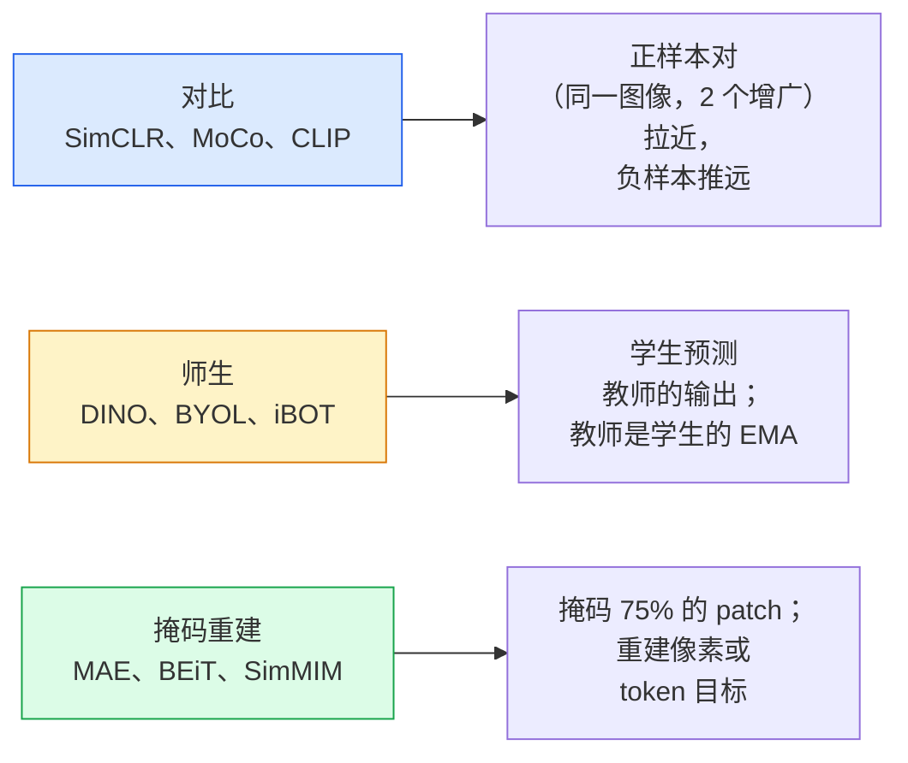

# 自监督视觉 —— SimCLR、DINO、MAE

> 标签是监督视觉的瓶颈。自监督预训练把它去掉：从 1 亿张无标签图像里学视觉特征，再在 1 万张有标签的上微调。

**类型：** Learn + Build
**语言：** Python
**前置要求：** 阶段 4 第 04 课（图像分类）、阶段 4 第 14 课（ViT）
**预计时间：** ~75 分钟

## 学习目标

- 梳理三大自监督家族——对比（SimCLR）、师生（DINO）、掩码重建（MAE）——说出各自优化什么
- 从零实现 InfoNCE 损失，解释为什么 512 的 batch 行而 32 的 batch 不行
- 解释为什么 MAE 的 75% 掩码比例不是随便定的，以及它和 BERT 文本 15% 的区别
- 用 DINOv2 或 MAE 的 ImageNet checkpoint 做线性探针和零样本检索

## 问题所在

监督 ImageNet 有 130 万张带标签图像，标注成本估计要 1000 万美元。医学和工业数据集更小，标注还更贵。每个视觉团队都问：我们能不能在便宜的无标签数据上预训练——YouTube 帧、网页爬取、摄像头录像、卫星扫描——再在一个小的带标签集上微调？

自监督学习就是答案。一个在 LAION 或 JFT 上训练的现代自监督 ViT，微调后达到甚至超过监督 ImageNet 的准确率。它迁移到下游任务（检测、分割、深度）也比监督预训练更好。DINOv2（Meta，2023）和 MAE（Meta，2022）是当前可迁移视觉特征的生产默认。

观念上的转变是：pretext 任务——模型被训练去做的那件事——不必是下游任务。要紧的是它逼模型学到有用的特征。预测灰度图像的颜色、旋转图像让模型分类旋转角度、掩码 patch 再重建——全都奏效过。能规模化的三种方法是对比学习、师生蒸馏和掩码重建。

## 核心概念

### 三个家族



### 对比学习（SimCLR）

拿一张图像，应用两个随机增广，得到两个视图。两个都过同一个编码器加一个投影头。最小化一个损失，它说"这两个嵌入应该接近""这个嵌入应该远离 batch 里其他每张图像的嵌入"。

```
batch 里 2N 个视图中，正样本对 (z_i, z_j) 的损失：

   L_ij = -log( exp(sim(z_i, z_j) / tau) / sum_k in batch \ {i} exp(sim(z_i, z_k) / tau) )

sim = 余弦相似度
tau = 温度（0.1 标准）
```

这就是 InfoNCE 损失。它要求每个正样本配很多负样本，所以 batch 大小要紧——SimCLR 需要 512-8192。MoCo 引入了过去 batch 的动量队列，把负样本数量和 batch 大小解耦。

### 师生（DINO）

两个同架构的网络：学生和教师。教师是学生权重的指数移动平均（EMA）。两个都看图像的增广视图。学生的输出被训练去匹配教师的——没有显式负样本。

```
loss = CE( student_output(view_1),  teacher_output(view_2) )
     + CE( student_output(view_2),  teacher_output(view_1) )

teacher_weights = m * teacher_weights + (1 - m) * student_weights   (m ≈ 0.996)
```

它为什么不会崩成"预测一个常数"：教师的输出被居中（每维减均值）和锐化（除以一个小温度）。居中阻止某一维主导；锐化阻止输出崩成均匀。

DINO 就是 DINOv2 放大的对象，在 1.42 亿张精选图像上。得到的特征是当前零样本视觉检索和稠密预测的 SOTA。

### 掩码重建（MAE）

掩码 ViT 输入的 75% 的 patch。只把可见的 25% 过编码器。一个小解码器接收编码器的输出加上被掩码位置的 mask token，被训练去重建被掩码 patch 的像素。

```
编码器:  可见的 25% patch -> 特征
解码器:  特征 + 被掩码位置的 mask token -> 重建像素
损失:    只在被掩码 patch 上，重建像素和原始像素之间的 MSE
```

让 MAE 奏效的关键设计选择：

- **75% 掩码比例** —— 高。逼编码器学语义特征；重建 25% 会近乎平凡（相邻像素相关性太强，CNN 都能搞定）。
- **不对称编码器/解码器** —— 大 ViT 编码器只看可见 patch；一个小解码器（8 层、512 维）做重建。比朴素 BEiT 预训练快 3 倍。
- **像素空间重建目标** —— 比 BEiT 的 token 化目标更简单，在 ViT 上效果更好。

预训练后丢掉解码器。编码器就是特征提取器。

### 为什么是 75% 而不是 15%

BERT 掩码 15% 的 token。MAE 掩码 75%。区别在信息密度。

- 自然语言每个 token 的熵高。预测 15% 的 token 仍然难，因为每个被掩码位置有很多合理的补全。
- 图像 patch 的熵低——一个没被掩码的邻域常常几乎精确地决定了被掩码 patch 的像素。要让预测需要语义理解，你必须激进地掩码。

75% 高到简单的空间外推解决不了任务；编码器必须表示图像内容。

### 线性探针评估

自监督预训练之后，标准评估是**线性探针**：冻结编码器，在上面用 ImageNet 标签训练一个线性分类器。报 top-1 准确率。

- SimCLR ResNet-50：约 71%（2020）
- DINO ViT-S/16：约 77%（2021）
- MAE ViT-L/16：约 76%（2022）
- DINOv2 ViT-g/14：约 86%（2023）

线性探针是对特征质量的纯粹度量；微调通常多加 2-5 个点，但也混进了头部重训的效果。

## 动手构建

### 第 1 步：双视图增广流水线

```python
import torch
import torchvision.transforms as T

two_view_train = lambda: T.Compose([
    T.RandomResizedCrop(96, scale=(0.2, 1.0)),
    T.RandomHorizontalFlip(),
    T.ColorJitter(0.4, 0.4, 0.4, 0.1),
    T.RandomGrayscale(p=0.2),
    T.ToTensor(),
])


class TwoViewDataset(torch.utils.data.Dataset):
    def __init__(self, base):
        self.base = base
        self.aug = two_view_train()

    def __len__(self):
        return len(self.base)

    def __getitem__(self, i):
        img, _ = self.base[i]
        v1 = self.aug(img)
        v2 = self.aug(img)
        return v1, v2
```

每个 __getitem__ 返回同一图像的两个增广视图；不需要标签。

### 第 2 步：InfoNCE 损失

```python
import torch.nn.functional as F

def info_nce(z1, z2, tau=0.1):
    """
    z1, z2: (N, D) 配对视图的 L2 归一化嵌入
    """
    N, D = z1.shape
    z = torch.cat([z1, z2], dim=0)  # (2N, D)
    sim = z @ z.T / tau              # (2N, 2N)

    mask = torch.eye(2 * N, dtype=torch.bool, device=z.device)
    sim = sim.masked_fill(mask, float("-inf"))

    targets = torch.cat([torch.arange(N, 2 * N), torch.arange(0, N)]).to(z.device)
    return F.cross_entropy(sim, targets)
```

调用前把嵌入做 L2 归一化。`tau=0.1` 是 SimCLR 默认；越低损失越尖锐，需要更多负样本。

### 第 3 步：InfoNCE 合理性检查

```python
z1 = F.normalize(torch.randn(16, 32), dim=-1)
z2 = z1.clone()
loss_same = info_nce(z1, z2, tau=0.1).item()
z2_random = F.normalize(torch.randn(16, 32), dim=-1)
loss_random = info_nce(z1, z2_random, tau=0.1).item()
print(f"InfoNCE with identical pairs:  {loss_same:.3f}")
print(f"InfoNCE with random pairs:     {loss_random:.3f}")
```

相同的对应给出低损失（大 batch 加冷温度时接近 0）。随机的对在 16 对的 batch 下应给出 log(2N-1) = 约 log(31) = 约 3.4。

### 第 4 步：MAE 风格的掩码

```python
def random_mask_indices(num_patches, mask_ratio=0.75, seed=0):
    g = torch.Generator().manual_seed(seed)
    n_keep = int(num_patches * (1 - mask_ratio))
    perm = torch.randperm(num_patches, generator=g)
    visible = perm[:n_keep]
    masked = perm[n_keep:]
    return visible.sort().values, masked.sort().values


num_patches = 196
visible, masked = random_mask_indices(num_patches, mask_ratio=0.75)
print(f"visible: {len(visible)} / {num_patches}")
print(f"masked:  {len(masked)} / {num_patches}")
```

简单、快、对给定种子确定。真实的 MAE 实现把它批量化，并保留逐样本的掩码。

## 上手使用

2026 年 DINOv2 是生产标准：

```python
import torch
from transformers import AutoImageProcessor, AutoModel

processor = AutoImageProcessor.from_pretrained("facebook/dinov2-base")
model = AutoModel.from_pretrained("facebook/dinov2-base")
model.eval()

# 用于零样本检索的逐图嵌入
with torch.no_grad():
    inputs = processor(images=[pil_image], return_tensors="pt")
    outputs = model(**inputs)
    embedding = outputs.last_hidden_state[:, 0]  # CLS token
```

得到的 768 维嵌入是现代图像检索、稠密对应和零样本迁移流水线的骨干。在下游任务上微调，很少需要超过一个线性头。

做图像-文本嵌入，SigLIP 或 OpenCLIP 是等价物；做 MAE 风格的微调，`timm` 仓库提供每个 MAE checkpoint。

## 交付

这一课产出：

- `outputs/prompt-ssl-pretraining-picker.md` —— 一个 prompt，给定数据集规模、算力和下游任务，挑出 SimCLR / MAE / DINOv2。
- `outputs/skill-linear-probe-runner.md` —— 一个 skill，为任意冻结编码器 + 带标签数据集写出线性探针评估。

## 练习

1. **（简单）** 验证：对对齐良好的嵌入降低温度时 InfoNCE 损失下降，对随机嵌入降低温度时损失上升。画一个 `tau in [0.05, 0.1, 0.2, 0.5]` 对损失的图。
2. **（中等）** 实现一个 DINO 风格的居中缓冲区。展示没有居中时，学生在几个 epoch 内就崩成一个常数向量。
3. **（困难）** 用第 10 课的 TinyUNet 作骨干，在 CIFAR-100 上训练 MAE。报告第 10、50、200 个 epoch 的线性探针准确率。展示在同样的 1,000 张图子集上，MAE 预训练的线性探针打败从零监督的线性探针。

## 关键术语

| 术语 | 大家嘴上怎么说 | 它实际是什么 |
|------|----------------|----------------------|
| 自监督 | "无标签" | 一个从无标签数据产出有用表示的 pretext 任务 |
| Pretext 任务 | "假任务" | SSL 期间用的目标（重建 patch、匹配视图）；预训练后丢掉 |
| 线性探针 | "冻结编码器 + 线性头" | 标准 SSL 评估：只在冻结特征之上训练一个线性分类器 |
| InfoNCE | "对比损失" | 在余弦相似度上做 softmax；正样本对是目标类别，其余都是负样本 |
| EMA 教师 | "移动平均教师" | 权重是学生权重指数移动平均的教师；BYOL、MoCo、DINO 都用 |
| 掩码比例 | "被遮 patch 的占比" | MAE 期间被掩码的 patch 比例；视觉 75%，文本 15% |
| 表示崩溃 | "常数输出" | SSL 失败，编码器对所有输入输出一个常数向量；靠居中、锐化或负样本防止 |
| DINOv2 | "生产 SSL 骨干" | Meta 2023 年的自监督 ViT；2026 年最强的通用图像特征 |

## 延伸阅读

- [SimCLR (Chen et al., 2020)](https://arxiv.org/abs/2002.05709) —— 对比学习参考
- [DINO (Caron et al., 2021)](https://arxiv.org/abs/2104.14294) —— 带动量、居中、锐化的师生
- [MAE (He et al., 2022)](https://arxiv.org/abs/2111.06377) —— ViT 的掩码自编码器预训练
- [DINOv2 (Oquab et al., 2023)](https://arxiv.org/abs/2304.07193) —— 把自监督 ViT 缩放到生产级特征
