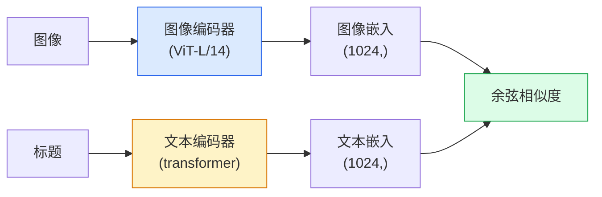

# 开放词表视觉 —— CLIP

> 一起训练一个图像编码器和一个文本编码器，让匹配的（图像，标题）对落在共享空间里的同一个点上。这就是全部诀窍。

**类型：** Build + Use
**语言：** Python
**前置要求：** 阶段 4 第 14 课（ViT）、阶段 4 第 17 课（自监督）
**预计时间：** ~45 分钟

## 学习目标

- 解释 CLIP 的双塔架构和对比训练目标
- 用一个预训练的 CLIP（或 SigLIP）做零样本分类，不做任何任务特定训练
- 从零实现零样本分类：编码类别 prompt、算余弦相似度、取 argmax
- 区分 CLIP、SigLIP、OpenCLIP 和 LLaVA/LLaMA-vision 模型——2026 年各自用于什么

## 问题所在

传统分类器是闭词表的：一个 1000 类的 ImageNet 模型只能预测 1000 个标签。每个新类别都需要带标签数据和一个重训的头。

CLIP（Radford 等人，OpenAI 2021）证明：在从网上爬来的 4 亿个（图像，标题）对上训练，产出的模型在推理时能分类到任意一组类别，这些类别纯用自然语言描述。你写一个句子就给了它一个新类别。

那个能力——零样本迁移——就是为什么每个现代视觉系统都从一个 CLIP 家族的 checkpoint 起步。检测（Grounding DINO、OWL-ViT）、分割（CLIPSeg、SAM）、检索、内容审核、VLM 和文本到图像生成，全都建在 CLIP 风格的联合嵌入之上。

## 核心概念

### 两座塔



两个编码器都以一个到相同嵌入维度的线性投影收尾（CLIP-B/32 是 512，CLIP-L/14 是 1024）。做 L2 归一化，算余弦相似度。

### 目标

给定一个 batch 的 N 个（图像，标题）对，构建一个 NxN 的相似度矩阵。训练两个编码器，让对角线（匹配的对）相似度高、非对角线（不匹配的）相似度低。

```
sim_matrix = image_embeddings @ text_embeddings.T / tau

loss_i2t = cross_entropy(sim_matrix,       targets=arange(N))
loss_t2i = cross_entropy(sim_matrix.T,     targets=arange(N))
loss = (loss_i2t + loss_t2i) / 2
```

对称，因为图到文和文到图的检索都该行得通。`tau`（温度）通常作为一个标量参数学出来，初始化为 0.07。

### SigLIP：更好的损失

SigLIP（Zhai 等人，2023）把 softmax 换成了逐对 sigmoid：

```
loss = 对所有对求 log(1 + exp(-y_ij * sim_ij)) 的均值
y_ij = 匹配则 +1，否则 -1
```

逐对损失去掉了 CLIP 需要的 batch 级归一化。SigLIP 在小 batch 下训得更好，在同等数据下匹敌或超过 CLIP。

### 零样本分类

给定一个训练好的 CLIP：

1. 为每个类别组一个 prompt："a photo of a {class}"。
2. 用文本编码器编码所有类别 prompt -> `T`，形状 (C, d)。
3. 编码测试图像 -> `I`，形状 (1, d)。
4. 相似度 = `I @ T.T`，形状 (1, C)。
5. Argmax -> 预测类别。

Prompt engineering 要紧。OpenAI 为 ImageNet 发布了 80 个 prompt 模板（"a photo of a {}"、"a blurry photo of a {}"、"a sketch of a {}"……）。把每个类别所有模板的嵌入平均，额外多 1-3% 的 top-1 准确率。

### 2026 年 CLIP 风格模型用在哪

- **零样本分类** —— 直接用。
- **图像检索** —— 把所有图像编码一次，推理时嵌入查询。
- **文本条件检测** —— Grounding DINO、OWL-ViT 把一个 CLIP 文本塔包在检测器外面。
- **文本条件分割** —— CLIPSeg；SAM 通过 CLIP 使用文本 prompt 输入。
- **VLM** —— LLaVA、Qwen-VL、InternVL 把一个 CLIP 家族的视觉编码器接进一个 LLM。
- **文本到图像生成** —— Stable Diffusion、DALL-E 3 以 CLIP 文本嵌入为条件。

一旦你有了一个共享嵌入空间，每个视觉+语言任务都变成了一次距离计算。

## 动手构建

### 第 1 步：一个微型双塔模型

真正的 CLIP 是 ViT + transformer。这一课的塔是预提取特征上的小 MLP，好让训练信号在 CPU 上看得见。

```python
import torch
import torch.nn as nn
import torch.nn.functional as F


class TwoTower(nn.Module):
    def __init__(self, img_in=128, txt_in=64, emb=64):
        super().__init__()
        self.image_proj = nn.Sequential(nn.Linear(img_in, 128), nn.ReLU(), nn.Linear(128, emb))
        self.text_proj = nn.Sequential(nn.Linear(txt_in, 128), nn.ReLU(), nn.Linear(128, emb))
        self.logit_scale = nn.Parameter(torch.ones([]) * 2.6592)  # ln(1/0.07)

    def forward(self, img_feats, txt_feats):
        i = F.normalize(self.image_proj(img_feats), dim=-1)
        t = F.normalize(self.text_proj(txt_feats), dim=-1)
        return i, t, self.logit_scale.exp()
```

两个投影、共享维度输出、学习出来的温度。和真正的 CLIP API 形状相同。

### 第 2 步：对比损失

```python
def clip_loss(image_emb, text_emb, logit_scale):
    N = image_emb.size(0)
    sim = logit_scale * image_emb @ text_emb.T
    targets = torch.arange(N, device=sim.device)
    l_i = F.cross_entropy(sim, targets)
    l_t = F.cross_entropy(sim.T, targets)
    return (l_i + l_t) / 2
```

对称。logit_scale 越高 = softmax 越尖锐 = 越自信但有不稳定风险。

### 第 3 步：零样本分类器

```python
@torch.no_grad()
def zero_shot_classify(model, image_feats, class_text_feats, class_names):
    """
    image_feats:      (N, img_in)
    class_text_feats: (C, txt_in)   每个类别一个平均嵌入
    """
    i = F.normalize(model.image_proj(image_feats), dim=-1)
    t = F.normalize(model.text_proj(class_text_feats), dim=-1)
    sim = i @ t.T
    pred = sim.argmax(dim=-1)
    return [class_names[p] for p in pred.tolist()]
```

每步一行。这就是配生产 CLIP checkpoint 用的精确零样本流程。

### 第 4 步：合理性检查

```python
torch.manual_seed(0)
model = TwoTower()

img = torch.randn(8, 128)
txt = torch.randn(8, 64)
i, t, scale = model(img, txt)
loss = clip_loss(i, t, scale)
print(f"batch size: {i.size(0)}   loss: {loss.item():.3f}")
```

对一个随机初始化的模型，损失应该接近 `log(N) = log(8) = 2.08`——还没学到结构时对称交叉熵的目标值。

## 上手使用

2026 年 OpenCLIP 是社区默认：

```python
import open_clip
import torch
from PIL import Image

model, _, preprocess = open_clip.create_model_and_transforms("ViT-B-32", pretrained="laion2b_s34b_b79k")
tokenizer = open_clip.get_tokenizer("ViT-B-32")

image = preprocess(Image.open("dog.jpg")).unsqueeze(0)
text = tokenizer(["a photo of a dog", "a photo of a cat", "a photo of a car"])

with torch.no_grad():
    image_features = model.encode_image(image)
    text_features = model.encode_text(text)
    image_features = image_features / image_features.norm(dim=-1, keepdim=True)
    text_features = text_features / text_features.norm(dim=-1, keepdim=True)
    probs = (100.0 * image_features @ text_features.T).softmax(dim=-1)

print(probs)
```

SigLIP 更新，在小规模上训得更好，新工作更推荐它：`google/siglip-base-patch16-224`。Hugging Face 两个都提供。

## 交付

这一课产出：

- `outputs/prompt-zero-shot-class-picker.md` —— 一个 prompt，给定一份类别列表和一个领域，为零样本 CLIP 设计类别模板。
- `outputs/skill-image-text-retriever.md` —— 一个 skill，用任意 CLIP checkpoint 构建图像嵌入索引，支持按文本查询和按图像查询。

## 练习

1. **（简单）** 用一个预训练的 OpenCLIP ViT-B/32，配 80 模板 prompt 集，在 CIFAR-10 上做零样本分类。报告 top-1 准确率；应该在 85-90% 左右。
2. **（中等）** 在同样的 CIFAR-10 任务上，对比单模板（"a photo of a {}"）和 80 模板平均嵌入。量化差距并解释为什么模板有帮助。
3. **（困难）** 构建一个零样本图像检索索引：用 CLIP 嵌入 1,000 张图像，建一个 FAISS 索引，用自然语言描述查询。对你手写的 20 个留出查询报告检索 recall@5。

## 关键术语

| 术语 | 大家嘴上怎么说 | 它实际是什么 |
|------|----------------|----------------------|
| 双塔 | "双编码器" | 分开的图像和文本编码器，都以一个共享维度的投影头收尾 |
| 零样本 | "无任务特定训练" | 推理时分类到仅用文本描述的类别；不碰任何标签 |
| 温度 / logit_scale | "tau" | 学习出来的标量，在 softmax 前缩放相似度矩阵 |
| Prompt 模板 | "A photo of a {}" | 类别名外面的自然语言包装；平均多个模板提升零样本准确率 |
| CLIP | "图像+文本模型" | 2021 年的 OpenAI 模型；2026 年这个领域的通用语 |
| SigLIP | "Sigmoid CLIP" | 把 softmax 换成逐对 sigmoid；在小 batch 下训得更好 |
| OpenCLIP | "开放复现" | 社区在 LAION 上训练的 CLIP 变体；开源流水线的生产默认 |
| VLM | "视觉-语言模型" | 一个 CLIP 家族编码器加一个 LLM，被训练来回答关于图像的问题 |

## 延伸阅读

- [CLIP: Learning Transferable Visual Models from Natural Language Supervision (Radford et al., 2021)](https://arxiv.org/abs/2103.00020)
- [SigLIP: Sigmoid Loss for Language-Image Pre-Training (Zhai et al., 2023)](https://arxiv.org/abs/2303.15343)
- [OpenCLIP](https://github.com/mlfoundations/open_clip) —— 社区代码库
- [DINOv2 vs CLIP vs MAE: a features comparison](https://huggingface.co/blog/dinov2) —— HF 指南，并排列出各自的用例
