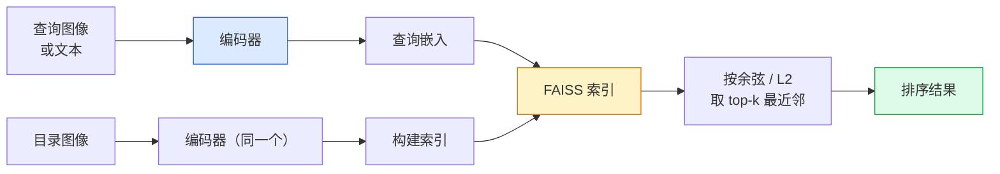

# 图像检索与度量学习

> 检索系统按嵌入空间里的距离给候选排序。度量学习就是塑造那个空间、让距离表达你想要的含义的这门手艺。

**类型：** Build
**语言：** Python
**前置要求：** 阶段 4 第 14 课（ViT）、阶段 4 第 18 课（CLIP）
**预计时间：** ~45 分钟

## 学习目标

- 解释三元组、对比、基于代理的度量学习损失，为给定数据集挑对那一个
- 正确实现 L2 归一化和余弦相似度，审视"同一物品"和"同一类别"检索之间的区别
- 构建 FAISS 索引，用文本和图像查询它，为一个留出查询集报告 recall@K
- 把 DINOv2、CLIP 和 SigLIP 当现成嵌入骨干用，知道各自何时胜出

## 问题所在

检索在生产视觉里无处不在：去重、以图搜图、视觉搜索（"找相似商品"）、人脸重识别、监控里的行人 re-ID、电商的实例级匹配。产品问题永远一样："给定这张查询图像，给我的目录排序。"

两个设计决策塑造整个系统。嵌入——什么模型产出向量。索引——如何规模化地找最近邻。两者在 2026 年都已商品化（嵌入用 DINOv2，索引用 FAISS），这反而抬高了门槛：难的是为你的应用定义*什么算相似*，再塑造嵌入空间让距离匹配。

那种塑造就是度量学习。它是一门小而高杠杆的手艺。

## 核心概念

### 检索一览



### 四个损失家族

| 损失 | 需要 | 优点 | 缺点 |
|------|----------|------|------|
| **对比** | (anchor, positive) + 负样本 | 简单，任何成对标签都能用 | 没有大量负样本时收敛慢 |
| **三元组** | (anchor, positive, negative) | 直观；直接控制 margin | 难三元组挖掘很贵 |
| **NT-Xent / InfoNCE** | 成对 + batch 内挖的负样本 | 能扩展到大 batch | 需要大 batch 或动量队列 |
| **基于代理（ProxyNCA）** | 仅类别标签 | 快、稳、无需挖掘 | 在小数据集上可能过拟合到代理 |

对多数生产用例，从一个预训练骨干起步，只有当现成嵌入在你的测试集上表现不佳时才加一个度量学习微调。

### 三元组损失的形式

```
L = max(0, ||f(a) - f(p)||^2 - ||f(a) - f(n)||^2 + margin)
```

把 anchor `a` 拉近 positive `p`，推离 negative `n`，用一个 `margin` 确保有间隔。这种三图结构推广到任何相似度排序。

挖掘要紧：容易的三元组（`n` 本就离 `a` 远）贡献零损失；只有难三元组才教得动网络。半难（semi-hard）挖掘（`n` 比 `p` 更远但在 margin 之内）是 2016 年 FaceNet 的配方，至今仍占主导。

### 余弦相似度 vs L2

两个度量，两种约定：

- **余弦**：向量之间的夹角。要求 L2 归一化的嵌入。
- **L2**：欧氏距离。在原始或归一化嵌入上都能用，但通常和 L2 归一化 + 平方 L2 配对。

对多数现代网络，两者等价：当 `||a|| = ||b|| = 1` 时 `||a - b||^2 = 2 - 2 cos(a, b)`。挑和你嵌入训练相匹配的约定；混用会悄悄改变"最近"的含义。

### Recall@K

标准检索指标：

```
recall@K = 前 K 个结果里至少有一个正确匹配的查询所占的比例
```

把 recall@1、@5、@10 并排报。recall@10 高于 0.95 而 recall@1 低于 0.5，意味着嵌入空间结构对了但排序有噪声——试更长的微调或加一个重排步骤。

对去重，precision@K 更要紧，因为每个假阳性都是用户可见的错误。对视觉搜索，recall@K 是产品信号。

### 一段话讲清 FAISS

Facebook AI Similarity Search。最近邻搜索事实上的库。三种索引选择：

- `IndexFlatIP` / `IndexFlatL2` —— 暴力、精确、无需训练。最多约 100 万向量时用。
- `IndexIVFFlat` —— 分成 K 个 cell，只搜最近的几个 cell。近似、快、需要训练数据。
- `IndexHNSW` —— 基于图，查询多时最快，索引体积大。

对 10 万向量，你大概想要余弦相似度上的 `IndexFlatIP`。对 1000 万，你想要 `IndexIVFFlat`。对 1 亿+，配合乘积量化（`IndexIVFPQ`）。

### 实例级 vs 类别级检索

同名的两个很不一样的问题：

- **类别级** —— "在我的目录里找猫"。类条件相似度；现成的 CLIP / DINOv2 嵌入效果好。
- **实例级** —— "在我的目录里找*这个确切的商品*"。需要在同类别视觉相似的物体之间做细粒度区分；现成嵌入表现不佳；用度量学习微调才要紧。

挑模型前永远先问你在解哪一个。

## 动手构建

### 第 1 步：三元组损失

```python
import torch
import torch.nn.functional as F

def triplet_loss(anchor, positive, negative, margin=0.2):
    d_ap = F.pairwise_distance(anchor, positive, p=2)
    d_an = F.pairwise_distance(anchor, negative, p=2)
    return F.relu(d_ap - d_an + margin).mean()
```

一行。在 L2 归一化或原始嵌入上都能用。

### 第 2 步：半难挖掘

给定一个 batch 的嵌入和标签，为每个 anchor 找最难的半难负样本。

```python
def semi_hard_negatives(emb, labels, margin=0.2):
    dist = torch.cdist(emb, emb)
    same_class = labels[:, None] == labels[None, :]
    diff_class = ~same_class
    N = emb.size(0)

    positives = dist.clone()
    positives[~same_class] = float("-inf")
    positives.fill_diagonal_(float("-inf"))
    pos_idx = positives.argmax(dim=1)

    semi_hard = dist.clone()
    semi_hard[same_class] = float("inf")
    d_ap = dist[torch.arange(N), pos_idx].unsqueeze(1)
    semi_hard[dist <= d_ap] = float("inf")
    neg_idx = semi_hard.argmin(dim=1)

    fallback_mask = semi_hard[torch.arange(N), neg_idx] == float("inf")
    if fallback_mask.any():
        hardest = dist.clone()
        hardest[same_class] = float("inf")
        neg_idx = torch.where(fallback_mask, hardest.argmin(dim=1), neg_idx)
    return pos_idx, neg_idx
```

每个 anchor 拿到类内最难的 positive，以及一个比 positive 更远但在 margin 之内的半难 negative。

### 第 3 步：Recall@K

```python
def recall_at_k(query_emb, gallery_emb, query_labels, gallery_labels, k=1):
    sim = query_emb @ gallery_emb.T
    _, top_k = sim.topk(k, dim=-1)
    matches = (gallery_labels[top_k] == query_labels[:, None]).any(dim=-1)
    return matches.float().mean().item()
```

L2 归一化嵌入上按内积取 top-k 等于按余弦取 top-k。报告至少有一个正确邻居的查询的平均比例。

### 第 4 步：拼起来

```python
import torch
import torch.nn as nn
from torch.optim import Adam

class Encoder(nn.Module):
    def __init__(self, in_dim=128, emb_dim=64):
        super().__init__()
        self.net = nn.Sequential(
            nn.Linear(in_dim, 128), nn.ReLU(),
            nn.Linear(128, emb_dim),
        )

    def forward(self, x):
        return F.normalize(self.net(x), dim=-1)

torch.manual_seed(0)
num_classes = 6
protos = F.normalize(torch.randn(num_classes, 128), dim=-1)

def sample_batch(bs=32):
    labels = torch.randint(0, num_classes, (bs,))
    x = protos[labels] + 0.15 * torch.randn(bs, 128)
    return x, labels

enc = Encoder()
opt = Adam(enc.parameters(), lr=3e-3)

for step in range(200):
    x, y = sample_batch(32)
    emb = enc(x)
    pos_idx, neg_idx = semi_hard_negatives(emb, y)
    loss = triplet_loss(emb, emb[pos_idx], emb[neg_idx])
    opt.zero_grad(); loss.backward(); opt.step()
```

几百步之后，嵌入聚类形成每类一簇。

## 上手使用

2026 年的生产栈：

- **DINOv2 + FAISS** —— 通用视觉检索。现成就能用。
- **CLIP + FAISS** —— 查询是文本时。
- **微调过的 DINOv2 + FAISS** —— 实例级检索、人脸 re-ID、时尚、电商。
- **Milvus / Weaviate / Qdrant** —— 包在 FAISS 或 HNSW 外面的托管向量数据库。

做 SOTA 实例检索，配方是：DINOv2 骨干，加一个嵌入头，在实例标注的对上用三元组或 InfoNCE 损失微调，在 FAISS 里建索引。

## 交付

这一课产出：

- `outputs/prompt-retrieval-loss-picker.md` —— 一个 prompt，为给定检索问题挑出 triplet / InfoNCE / ProxyNCA。
- `outputs/skill-recall-at-k-runner.md` —— 一个 skill，为 recall@K 写一个干净的评估框架，含训练/验证/gallery 划分和正确的数据契约。

## 练习

1. **（简单）** 跑上面的玩具例子。训练前后用 PCA 画嵌入，看那六簇形成。
2. **（中等）** 加一个 ProxyNCA 损失实现：每类一个学习出来的"代理"，在余弦相似度上做标准交叉熵。在玩具数据上对比它和三元组损失的收敛速度。
3. **（困难）** 拿 1,000 张 ImageNet 验证图像，通过 HuggingFace 用 DINOv2 嵌入，建一个 FAISS flat 索引，用同样的图像作查询报告 recall@{1, 5, 10}（应为 1.0），再用一个带 ImageNet 标签作真值的留出划分报告。

## 关键术语

| 术语 | 大家嘴上怎么说 | 它实际是什么 |
|------|----------------|----------------------|
| 度量学习 | "塑造空间" | 训练一个编码器，让它输出空间里的距离反映一个目标相似度 |
| 三元组损失 | "拉与推" | L = max(0, d(a, p) - d(a, n) + margin)；经典的度量学习损失 |
| 半难挖掘 | "有用的负样本" | 比 positive 离 anchor 更远但在 margin 之内的负样本；经验上信息量最大 |
| 基于代理的损失 | "类原型" | 每类一个学习出来的代理；在"与代理的相似度"上做交叉熵；无需成对挖掘 |
| Recall@K | "Top-K 命中率" | 前 K 个里至少有一个正确结果的查询所占比例 |
| 实例检索 | "找这个确切的东西" | 细粒度匹配；现成特征通常表现不佳 |
| FAISS | "那个最近邻库" | Facebook 的最近邻库；支持精确和近似索引 |
| HNSW | "图索引" | 层级可导航小世界；快速近似最近邻，内存开销小 |

## 延伸阅读

- [FaceNet: A Unified Embedding for Face Recognition (Schroff et al., 2015)](https://arxiv.org/abs/1503.03832) —— 三元组损失 / 半难挖掘的论文
- [In Defense of the Triplet Loss for Person Re-Identification (Hermans et al., 2017)](https://arxiv.org/abs/1703.07737) —— 三元组微调的实用指南
- [FAISS documentation](https://github.com/facebookresearch/faiss/wiki) —— 每种索引、每种权衡
- [SMoT: Metric Learning Taxonomy (Kim et al., 2021)](https://arxiv.org/abs/2010.06927) —— 现代损失及其联系的综述
