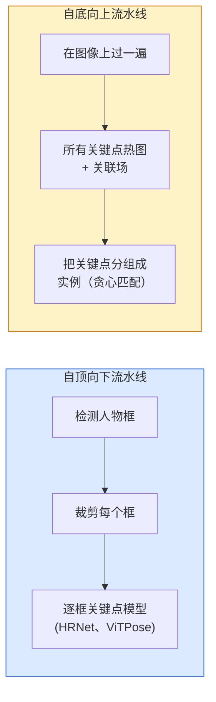

# 关键点检测与姿态估计

> 一个姿态就是一组有序的关键点。一个关键点检测器就是一个热图回归器。其余都是记账。

**类型：** Build
**语言：** Python
**前置要求：** 阶段 4 第 06 课（检测）、阶段 4 第 07 课（U-Net）
**预计时间：** ~45 分钟

## 学习目标

- 区分自顶向下和自底向上的姿态估计，说出各自何时使用
- 用"每个关键点一个高斯"的目标为 K 个关键点回归热图，在推理时提取关键点坐标
- 解释部件亲和场（Part Affinity Fields，PAF），以及自底向上流水线如何把关键点关联成实例
- 用 MediaPipe Pose 或 MMPose 做生产关键点估计，理解它们的输出格式

## 问题所在

关键点任务藏在很多名字下：人体姿态（17 个身体关节）、人脸关键点（68 或 478 个点）、手（21 个点）、动物姿态、机器人物体姿态、医学解剖标志点。每一个都共享同一种结构：检测物体上 K 个离散点并输出它们的 (x, y) 坐标。

姿态估计是动作捕捉、健身 app、运动分析、手势控制、动画、AR 试穿和机器人抓取的基础。2D 情形已经成熟；3D 姿态（从单相机估计世界坐标里的关节位置）是当前的研究前沿。

工程问题是规模。单图单人姿态是个 20ms 的问题。人群里 30 fps 的多人姿态是个不同的问题，用不同的架构。

## 核心概念

### 自顶向下 vs 自底向上



- **自顶向下** —— 先检测人，再在每个裁剪上跑一个逐人关键点模型。准确率最高；随人数线性缩放。
- **自底向上** —— 一次前向预测所有关键点加一个关联场；再分组。无论人群多大都是常数时间。

自顶向下（HRNet、ViTPose）是准确率领先者；自底向上（OpenPose、HigherHRNet）是拥挤场景的吞吐领先者。

### 热图回归

不直接回归 `(x, y)`，而是为每个关键点预测一个 `H x W` 的热图，在真实位置中心有一个高斯斑块。

```
target[k, y, x] = exp(-((x - cx_k)^2 + (y - cy_k)^2) / (2 sigma^2))
```

推理时，每个热图的 argmax 就是预测的关键点位置。

热图为什么比直接回归更好：网络的空间结构（卷积特征图）天然对齐空间输出。高斯目标还做正则化——小的定位误差产生小的损失，而不是零。

### 亚像素定位

Argmax 给出整数坐标。要亚像素精度，就对 argmax 及其邻居拟合一条抛物线来精修，或用那个著名的偏移量 `(dx, dy) = 0.25 * (heatmap[y, x+1] - heatmap[y, x-1], ...)` 方向。

### 部件亲和场（PAF）

OpenPose 用于自底向上关联的诀窍。对每一对相连的关键点（例如左肩到左肘），预测一个 2 通道场，编码从一个指向另一个的单位向量。要把一个肩膀和它的肘关联起来，沿连接候选对的直线对 PAF 做积分；积分最高的对被匹配。

```
对每个连接（肢体）：
  PAF 通道: 2（单位向量 x, y）
  线积分: 在采样点上对 (PAF . line_direction) 求和
  积分越高 = 匹配越强
```

优雅，且无需逐人裁剪就能扩展到任意人群规模。

### COCO 关键点

标准的身体姿态数据集：每人 17 个关键点，指标用 PCK（Percentage of Correct Keypoints，正确关键点百分比）和 OKS（Object Keypoint Similarity，物体关键点相似度）。OKS 是关键点版的 IoU，也是 COCO mAP@OKS 报告的东西。

### 2D vs 3D

- **2D 姿态** —— 图像坐标；已达生产质量（MediaPipe、HRNet、ViTPose）。
- **3D 姿态** —— 世界 / 相机坐标；仍是活跃研究。常见方法：
  - 用一个小 MLP 把 2D 预测抬升到 3D（VideoPose3D）。
  - 从图像直接回归 3D（PyMAF、MHFormer）。
  - 多视角设置（CMU Panoptic）拿真值。

## 动手构建

### 第 1 步：高斯热图目标

```python
import numpy as np
import torch

def gaussian_heatmap(size, cx, cy, sigma=2.0):
    yy, xx = np.meshgrid(np.arange(size), np.arange(size), indexing="ij")
    return np.exp(-((xx - cx) ** 2 + (yy - cy) ** 2) / (2 * sigma ** 2)).astype(np.float32)

hm = gaussian_heatmap(64, 32, 32, sigma=2.0)
print(f"peak: {hm.max():.3f} at ({hm.argmax() % 64}, {hm.argmax() // 64})")
```

沿通道轴堆叠的逐关键点热图给出完整的目标张量。

### 第 2 步：微型关键点头

一个输出 K 个热图通道的 U-Net 风格模型。

```python
import torch.nn as nn
import torch.nn.functional as F

class TinyKeypointNet(nn.Module):
    def __init__(self, num_keypoints=4, base=16):
        super().__init__()
        self.down1 = nn.Sequential(nn.Conv2d(3, base, 3, 2, 1), nn.ReLU(inplace=True))
        self.down2 = nn.Sequential(nn.Conv2d(base, base * 2, 3, 2, 1), nn.ReLU(inplace=True))
        self.mid = nn.Sequential(nn.Conv2d(base * 2, base * 2, 3, 1, 1), nn.ReLU(inplace=True))
        self.up1 = nn.ConvTranspose2d(base * 2, base, 2, 2)
        self.up2 = nn.ConvTranspose2d(base, num_keypoints, 2, 2)

    def forward(self, x):
        h1 = self.down1(x)
        h2 = self.down2(h1)
        h3 = self.mid(h2)
        u1 = self.up1(h3)
        return self.up2(u1)
```

输入 `(N, 3, H, W)`，输出 `(N, K, H, W)`。损失是对高斯目标的逐像素 MSE。

### 第 3 步：推理 —— 提取关键点坐标

```python
def heatmap_to_coords(heatmaps):
    """
    heatmaps: (N, K, H, W)
    返回:     (N, K, 2) 图像像素里的浮点坐标
    """
    N, K, H, W = heatmaps.shape
    hm = heatmaps.reshape(N, K, -1)
    idx = hm.argmax(dim=-1)
    ys = (idx // W).float()
    xs = (idx % W).float()
    return torch.stack([xs, ys], dim=-1)

coords = heatmap_to_coords(torch.randn(2, 4, 32, 32))
print(f"coords: {coords.shape}")  # (2, 4, 2)
```

推理时一行。要亚像素精修，就在 argmax 附近插值。

### 第 4 步：合成关键点数据集

简单：在白画布上画四个点，学着预测它们。

```python
def make_synthetic_sample(size=64):
    img = np.ones((3, size, size), dtype=np.float32)
    rng = np.random.default_rng()
    kps = rng.integers(8, size - 8, size=(4, 2))
    for cx, cy in kps:
        img[:, cy - 2:cy + 2, cx - 2:cx + 2] = 0.0
    hms = np.stack([gaussian_heatmap(size, cx, cy) for cx, cy in kps])
    return img, hms, kps
```

够简单，一个小模型一分钟就能学会。

### 第 5 步：训练

```python
model = TinyKeypointNet(num_keypoints=4)
opt = torch.optim.Adam(model.parameters(), lr=3e-3)

for step in range(200):
    batch = [make_synthetic_sample() for _ in range(16)]
    imgs = torch.from_numpy(np.stack([b[0] for b in batch]))
    hms = torch.from_numpy(np.stack([b[1] for b in batch]))
    pred = model(imgs)
    # 把 pred 上采样到全分辨率
    pred = F.interpolate(pred, size=hms.shape[-2:], mode="bilinear", align_corners=False)
    loss = F.mse_loss(pred, hms)
    opt.zero_grad(); loss.backward(); opt.step()
```

## 上手使用

- **MediaPipe Pose** —— Google 的生产姿态估计器；提供 WebGL + 移动端运行时，延迟低于 10ms。
- **MMPose**（OpenMMLab）—— 全面的研究代码库；每个 SOTA 架构带预训练权重。
- **YOLOv8-pose** —— 最快的实时多人姿态，单次前向。
- **transformers HumanDPT / PoseAnything** —— 用于开放词表姿态（任意物体、任意关键点集）的较新视觉-语言方法。

## 交付

这一课产出：

- `outputs/prompt-pose-stack-picker.md` —— 一个 prompt，给定延迟、人群规模和 2D vs 3D 需求，挑出 MediaPipe / YOLOv8-pose / HRNet / ViTPose。
- `outputs/skill-heatmap-to-coords.md` —— 一个 skill，写出每个生产姿态模型用的那套亚像素"热图到坐标"例程。

## 练习

1. **（简单）** 在合成 4 点数据集上训练这个小关键点模型。报告 200 步后预测和真实关键点之间的平均 L2 误差。
2. **（中等）** 加亚像素精修：给定 argmax 位置，从邻近像素沿 x 和 y 各拟合一条 1D 抛物线。报告相对整数 argmax 的精度提升。
3. **（困难）** 构建一个 2 人合成数据集，每张图显示 4 关键点模式的两个实例。训练一个带 PAF 的自底向上流水线，PAF 预测哪个关键点属于哪个实例，并评估 OKS。

## 关键术语

| 术语 | 大家嘴上怎么说 | 它实际是什么 |
|------|----------------|----------------------|
| 关键点 | "一个标志点" | 物体上一个特定的有序点（关节、角点、特征） |
| 姿态 | "骨架" | 属于一个实例的一组有序关键点 |
| 自顶向下 | "先检测再姿态" | 两阶段流水线：人物检测器 + 逐裁剪关键点模型；准确率最高 |
| 自底向上 | "先姿态后分组" | 单次预测所有关键点 + 分组；在人群规模上常数时间 |
| 热图 | "高斯目标" | 每个关键点一个 H x W 张量，峰值在真实位置；首选的回归目标 |
| PAF | "部件亲和场" | 编码肢体方向的 2 通道单位向量场；用于把关键点分组成实例 |
| OKS | "关键点 IoU" | Object Keypoint Similarity；姿态的 COCO 指标 |
| HRNet | "高分辨率网络" | 主导的自顶向下关键点架构；全程保留高分辨率特征 |

## 延伸阅读

- [OpenPose (Cao et al., 2017)](https://arxiv.org/abs/1812.08008) —— 带 PAF 的自底向上；至今对该方法讲解最好
- [HRNet (Sun et al., 2019)](https://arxiv.org/abs/1902.09212) —— 自顶向下的参考架构
- [ViTPose (Xu et al., 2022)](https://arxiv.org/abs/2204.12484) —— 把朴素 ViT 当姿态骨干；在许多基准上是当前 SOTA
- [MediaPipe Pose](https://developers.google.com/mediapipe/solutions/vision/pose_landmarker) —— 生产实时姿态；2026 年部署最快的栈
