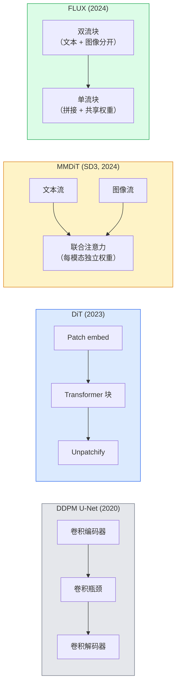

# 扩散 Transformer 与 Rectified Flow

> U-Net 不是扩散的秘密。把它换成 transformer，把噪声调度换成一条直线流，突然你就有了 SD3、FLUX，以及 2026 年每个文本到图像模型。

**类型：** Learn + Build
**语言：** Python
**前置要求：** 阶段 4 第 10 课（扩散 DDPM）、阶段 4 第 14 课（ViT）、阶段 7 第 02 课（自注意力）
**预计时间：** ~75 分钟

## 学习目标

- 梳理从 U-Net DDPM（第 10 课）到扩散 Transformer（DiT）、MMDiT（SD3）、单+双流 DiT（FLUX）的演变
- 解释 rectified flow：为什么噪声和数据之间的直线轨迹让模型能用 20 步而不是 1000 步采样
- 实现一个小 DiT 块和一个 rectified-flow 训练循环，都不超过 100 行
- 按架构、参数量和授权区分模型变体（SD3、FLUX.1-dev、FLUX.1-schnell、Z-Image、Qwen-Image）

## 问题所在

第 10 课用 U-Net 去噪器搭了一个 DDPM。那套配方主导了 2020-2023：U-Net + beta 调度 + 噪声预测损失。它产出了 Stable Diffusion 1.5、2.1 和 DALL-E 2。

2026 年每个业界最强的文本到图像模型都走过了它。Stable Diffusion 3、FLUX、SD4、Z-Image、Qwen-Image、Hunyuan-Image——没一个用 U-Net。它们用扩散 Transformer（DiT）。SD3 和 FLUX 还把 DDPM 噪声调度换成了 rectified flow，它把从噪声到数据的路径拉直，并借助一致性或蒸馏变体实现 1-4 步推理。

这个转变要紧，是因为它正是扩散式图像生成变得可控、prompt 准确（SD3/SD4 解决了文字渲染）、生产级快速的原因。理解 DiT + rectified flow 就是理解 2026 年的生成图像栈。

## 核心概念

### 从 U-Net 到 transformer



- **DiT**（Peebles & Xie，2023）—— 用一个作用于潜变量 patch 的类 ViT transformer 替换 U-Net。通过自适应层归一化（AdaLN）做条件化。
- **MMDiT**（SD3，Esser 等人，2024）—— 两个流，文本和图像 token 各有独立权重，共享一个联合注意力。
- **FLUX**（Black Forest Labs，2024）—— 前 N 个块像 SD3 那样双流，后面的块拼接并共享权重（单流），在更高深度下提效率。
- **Z-Image**（2025）—— 一个 6B 参数的高效单流 DiT，挑战"不惜一切代价堆规模"。

### 一段话讲清 rectified flow

DDPM 把前向过程定义为一个含噪 SDE，`x_t` 被越来越多地破坏。学到的反向是第二个 SDE，用 1000 个小步解。

Rectified flow 把干净数据和纯噪声之间定义为一条**直线**插值：

```
x_t = (1 - t) * x_0 + t * epsilon,     t in [0, 1]
```

训练一个网络去预测速度 `v_theta(x_t, t) = epsilon - x_0`——沿从干净数据到噪声的直线路径的前进方向（`dx_t/dt`）。采样时，你把这个速度反向积分，从噪声朝数据迈步。得到的 ODE 更接近一条直线，所以采样所需的积分步数少得多。

SD3 把这叫 **Rectified Flow Matching**。FLUX、Z-Image 和大多数 2026 年的模型用同一个目标。典型推理：20-30 步 Euler（确定性），对比旧 DDPM 模式里 50+ 步的 DDIM。蒸馏 / turbo / schnell / LCM 变体把它降到 1-4 步。

### AdaLN 条件化

DiT 通过**自适应层归一化**对时间步和类别/文本做条件化：从条件向量预测 `scale` 和 `shift`，在 LayerNorm 之后应用它们。比 U-Net 里 FiLM 风格的调制干净得多，是每个现代 DiT 的默认。

```
cond -> MLP -> (scale, shift, gate)
norm(x) * (1 + scale) + shift，再做残差相加 * gate
```

### SD3 和 FLUX 里的文本编码器

- **SD3** 用三个文本编码器：两个 CLIP 模型 + T5-XXL。嵌入拼接后作为文本条件喂给图像流。
- **FLUX** 用一个 CLIP-L + T5-XXL。
- **Qwen-Image / Z-Image** 变体用它们自家的、与各自基座 LLM 对齐的文本编码器。

文本编码器是 SD3/FLUX 对 prompt 的推理比 SD1.5 好得多的一大原因。光 T5-XXL 就是 47 亿参数。

### 无分类器引导仍然成立

Rectified flow 改的是采样器，不是条件化。无分类器引导（训练时 10% 概率丢掉文本，推理时混合条件和无条件预测）在 rectified flow 上一模一样地起作用。多数 2026 年的模型用引导尺度 3.5-5——比 SD1.5 的 7.5 低，因为 rectified-flow 模型默认更紧地跟随 prompt。

### Consistency、Turbo、Schnell、LCM

同一个点子的四个名字：把一个慢的多步模型蒸馏成一个快的少步模型。

- **LCM（Latent Consistency Model）** —— 训练一个学生，从任意中间 `x_t` 一步预测最终的 `x_0`。
- **SDXL Turbo / FLUX schnell** —— 用对抗扩散蒸馏训练的 1-4 步模型。
- **SD Turbo** —— 适配到潜扩散的 OpenAI 风格 Consistency Model。

任何新模型的生产服务都同时提供一个"全质量" checkpoint 和一个"turbo / schnell"变体。Schnell（德语"快"，Black Forest Labs 的惯例）跑 1-4 步，适配实时流水线。

### 2026 年的模型版图

| 模型 | 大小 | 架构 | 授权 |
|-------|------|--------------|---------|
| Stable Diffusion 3 Medium | 2B | MMDiT | SAI Community |
| Stable Diffusion 3.5 Large | 8B | MMDiT | SAI Community |
| FLUX.1-dev | 12B | 双 + 单流 DiT | 非商业 |
| FLUX.1-schnell | 12B | 同上，蒸馏 | Apache 2.0 |
| FLUX.2 | — | 迭代的 FLUX.1 | 混合 |
| Z-Image | 6B | S3-DiT（可扩展单流） | 宽松 |
| Qwen-Image | ~20B | DiT + Qwen 文本塔 | Apache 2.0 |
| Hunyuan-Image-3.0 | ~80B | DiT | 研究 |
| SD4 Turbo | 3B | DiT + 蒸馏 | SAI Commercial |

FLUX.1-schnell 是 2026 年的开源默认。Z-Image 是效率领先者。FLUX.2 和 SD4 是当前的质量尖端。

### 为什么这次相变要紧

DDPM + U-Net 行。DiT + rectified flow **更好、更快、缩放更干净**。这个过渡和 NLP 里从 RNN 到 transformer 的那个平行：两种架构解了同一个问题，但 transformer 缩放上去、现在占主导。2026 年每篇关于图像、视频或 3D 生成的论文都用 DiT 形状的去噪器，通常还用 rectified flow 目标。U-Net DDPM 如今主要是教学用的（第 10 课）。

## 动手构建

### 第 1 步：一个带 AdaLN 的 DiT 块

```python
import torch
import torch.nn as nn


class AdaLNZero(nn.Module):
    """
    带 gate 的自适应 LayerNorm。从条件预测 (scale, shift, gate)。
    初始化使整个块以恒等映射起步（"零初始化"）。
    """

    def __init__(self, dim, cond_dim):
        super().__init__()
        self.norm = nn.LayerNorm(dim, elementwise_affine=False)
        self.mlp = nn.Linear(cond_dim, dim * 3)
        nn.init.zeros_(self.mlp.weight)
        nn.init.zeros_(self.mlp.bias)

    def forward(self, x, cond):
        scale, shift, gate = self.mlp(cond).chunk(3, dim=-1)
        h = self.norm(x) * (1 + scale.unsqueeze(1)) + shift.unsqueeze(1)
        return h, gate.unsqueeze(1)


class DiTBlock(nn.Module):
    def __init__(self, dim=192, heads=3, mlp_ratio=4, cond_dim=192):
        super().__init__()
        self.adaln1 = AdaLNZero(dim, cond_dim)
        self.attn = nn.MultiheadAttention(dim, heads, batch_first=True)
        self.adaln2 = AdaLNZero(dim, cond_dim)
        self.mlp = nn.Sequential(
            nn.Linear(dim, dim * mlp_ratio),
            nn.GELU(),
            nn.Linear(dim * mlp_ratio, dim),
        )

    def forward(self, x, cond):
        h, gate1 = self.adaln1(x, cond)
        a, _ = self.attn(h, h, h, need_weights=False)
        x = x + gate1 * a
        h, gate2 = self.adaln2(x, cond)
        x = x + gate2 * self.mlp(h)
        return x
```

`AdaLNZero` 以恒等映射起步，因为它的 MLP 权重初始化为零。训练把这个块推离恒等；这极大地稳定了深层 transformer 扩散模型。

### 第 2 步：一个小 DiT

```python
def timestep_embedding(t, dim):
    import math
    half = dim // 2
    freqs = torch.exp(-math.log(10000) * torch.arange(half, device=t.device) / half)
    args = t[:, None].float() * freqs[None]
    return torch.cat([args.sin(), args.cos()], dim=-1)


class TinyDiT(nn.Module):
    def __init__(self, image_size=16, patch_size=2, in_channels=3, dim=96, depth=4, heads=3):
        super().__init__()
        self.patch_size = patch_size
        self.num_patches = (image_size // patch_size) ** 2
        self.patch = nn.Conv2d(in_channels, dim, kernel_size=patch_size, stride=patch_size)
        self.pos = nn.Parameter(torch.zeros(1, self.num_patches, dim))
        self.time_mlp = nn.Sequential(
            nn.Linear(dim, dim * 2),
            nn.SiLU(),
            nn.Linear(dim * 2, dim),
        )
        self.blocks = nn.ModuleList([DiTBlock(dim, heads, cond_dim=dim) for _ in range(depth)])
        self.norm_out = nn.LayerNorm(dim, elementwise_affine=False)
        self.head = nn.Linear(dim, patch_size * patch_size * in_channels)

    def forward(self, x, t):
        n = x.size(0)
        x = self.patch(x)
        x = x.flatten(2).transpose(1, 2) + self.pos
        t_emb = self.time_mlp(timestep_embedding(t, self.pos.size(-1)))
        for blk in self.blocks:
            x = blk(x, t_emb)
        x = self.norm_out(x)
        x = self.head(x)
        return self._unpatchify(x, n)

    def _unpatchify(self, x, n):
        p = self.patch_size
        h = w = int(self.num_patches ** 0.5)
        x = x.view(n, h, w, p, p, -1).permute(0, 5, 1, 3, 2, 4).reshape(n, -1, h * p, w * p)
        return x
```

### 第 3 步：Rectified flow 训练

```python
import torch.nn.functional as F

def rectified_flow_train_step(model, x0, optimizer, device):
    model.train()
    x0 = x0.to(device)
    n = x0.size(0)
    t = torch.rand(n, device=device)
    epsilon = torch.randn_like(x0)
    x_t = (1 - t[:, None, None, None]) * x0 + t[:, None, None, None] * epsilon

    target_velocity = epsilon - x0
    pred_velocity = model(x_t, t)

    loss = F.mse_loss(pred_velocity, target_velocity)
    optimizer.zero_grad()
    loss.backward()
    optimizer.step()
    return loss.item()
```

和 DDPM 的噪声预测损失（第 10 课）对比：结构相同，目标不同。我们不预测噪声 `epsilon`，而是预测**速度** `epsilon - x_0`，它沿直线插值从数据指向噪声。

### 第 4 步：Euler 采样器

Rectified flow 是一个 ODE。Euler 法最简单，且对一个训练良好的 rectified-flow 模型，在 20+ 步下几乎和高阶求解器一样准。

```python
@torch.no_grad()
def rectified_flow_sample(model, shape, steps=20, device="cpu"):
    model.eval()
    x = torch.randn(shape, device=device)
    dt = 1.0 / steps
    t = torch.ones(shape[0], device=device)
    for _ in range(steps):
        v = model(x, t)
        x = x - dt * v
        t = t - dt
    return x
```

20 步。在一个训练好的模型上，这产出可与 1000 步 DDPM 相比的样本。

### 第 5 步：端到端冒烟测试

```python
import numpy as np

def synthetic_blobs(num=200, size=16, seed=0):
    rng = np.random.default_rng(seed)
    out = np.zeros((num, 3, size, size), dtype=np.float32)
    yy, xx = np.meshgrid(np.arange(size), np.arange(size), indexing="ij")
    for i in range(num):
        cx, cy = rng.uniform(4, size - 4, size=2)
        r = rng.uniform(2, 4)
        mask = (xx - cx) ** 2 + (yy - cy) ** 2 < r ** 2
        colour = rng.uniform(-1, 1, size=3)
        for c in range(3):
            out[i, c][mask] = colour[c]
    return torch.from_numpy(out)
```

在这个上面用 rectified flow 训练一个 `TinyDiT`。500 步后，采样输出应该看起来像淡淡的彩色斑块。

## 上手使用

用 FLUX / SD3 / Z-Image 做真正的图像生成，`diffusers` 用统一 API 提供它们每一个：

```python
from diffusers import FluxPipeline, StableDiffusion3Pipeline
import torch

pipe = FluxPipeline.from_pretrained(
    "black-forest-labs/FLUX.1-schnell",
    torch_dtype=torch.bfloat16,
).to("cuda")

out = pipe(
    prompt="a golden retriever surfing a tsunami, hyperrealistic, studio lighting",
    guidance_scale=0.0,           # schnell 训练时不用 CFG
    num_inference_steps=4,
    max_sequence_length=256,
).images[0]
out.save("surf.png")
```

三行。`FLUX.1-schnell` 四步出图。把模型 id 换成 `black-forest-labs/FLUX.1-dev`，用 20-30 步加 CFG 换更高质量。

对 SD3：

```python
pipe = StableDiffusion3Pipeline.from_pretrained(
    "stabilityai/stable-diffusion-3.5-large",
    torch_dtype=torch.bfloat16,
).to("cuda")
out = pipe(prompt, guidance_scale=3.5, num_inference_steps=28).images[0]
```

## 交付

这一课产出：

- `outputs/prompt-dit-model-picker.md` —— 给定质量、延迟和授权约束，在 SD3、FLUX.1-dev、FLUX.1-schnell、Z-Image、SD4 Turbo 之间挑选。
- `outputs/skill-rectified-flow-trainer.md` —— 为 rectified flow 写一个完整训练循环，配 AdaLN DiT 和 Euler 采样。

## 练习

1. **（简单）** 在合成斑块数据集上训练上面的 TinyDiT 500 步。对比用 10、20、50 步 Euler 产出的样本。
2. **（中等）** 通过把一个学习出来的类别嵌入拼到时间嵌入上来加文本条件（按颜色分 10 个斑块"类别"）。用类别 0、5、9 采样，验证颜色匹配。
3. **（困难）** 算同尺寸网络、同数据、同步数下，rectified-flow 版和 DDPM 版生成样本之间的 Fréchet 距离（FID 代理）。报告哪个收敛更快。

## 关键术语

| 术语 | 大家嘴上怎么说 | 它实际是什么 |
|------|----------------|----------------------|
| DiT | "扩散 transformer" | 替换 U-Net 作扩散去噪器的 transformer；作用于 patch 化的潜变量 |
| AdaLN | "自适应层归一化" | 通过 LayerNorm 之后应用的学习式 scale、shift、gate 做时间步/文本条件化；每个现代 DiT 的标准 |
| MMDiT | "多模态 DiT（SD3）" | 文本和图像 token 的独立权重流，共享一个联合自注意力 |
| 单流 / 双流 | "FLUX 技巧" | 前 N 个块双流（每模态独立权重），后面的块单流（拼接 + 共享权重）以提效率 |
| Rectified flow | "噪声到数据的直线" | 数据和噪声之间的线性插值；网络预测速度；推理时所需 ODE 步数更少 |
| 速度目标 | "epsilon - x_0" | rectified flow 里的回归目标；从干净数据指向噪声 |
| CFG 引导 | "无分类器引导" | 混合条件和无条件预测；rectified-flow 模型仍在用 |
| Schnell / turbo / LCM | "1-4 步蒸馏" | 从全质量模型蒸馏出的少步变体；生产实时 |

## 延伸阅读

- [Scalable Diffusion Models with Transformers (Peebles & Xie, 2023)](https://arxiv.org/abs/2212.09748) —— DiT 论文
- [Scaling Rectified Flow Transformers (Esser et al., SD3 paper)](https://arxiv.org/abs/2403.03206) —— 规模化的 MMDiT 和 rectified flow
- [FLUX.1 model card and technical report (Black Forest Labs)](https://huggingface.co/black-forest-labs/FLUX.1-dev) —— 双 + 单流细节
- [Z-Image: Efficient Image Generation Foundation Model (2025)](https://arxiv.org/html/2511.22699v1) —— 6B 的单流 DiT
- [Elucidating the Design Space of Diffusion (Karras et al., 2022)](https://arxiv.org/abs/2206.00364) —— 每个扩散设计权衡的参考
- [Latent Consistency Models (Luo et al., 2023)](https://arxiv.org/abs/2310.04378) —— LCM-LoRA 如何给你 4 步推理
