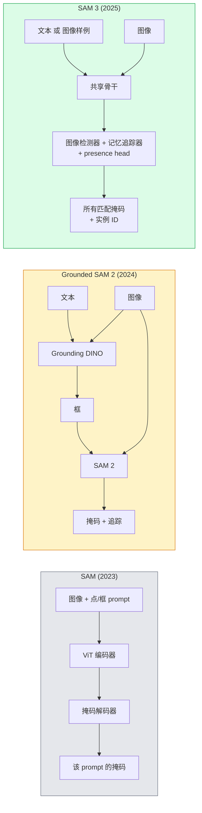

# SAM 3 与开放词表分割

> 给模型一个文本 prompt 和一张图像，得到每个匹配物体的掩码。SAM 3 把这变成了单次前向。

**类型：** Use + Build
**语言：** Python
**前置要求：** 阶段 4 第 07 课（U-Net）、阶段 4 第 08 课（Mask R-CNN）、阶段 4 第 18 课（CLIP）
**预计时间：** ~60 分钟

## 学习目标

- 区分 SAM（仅视觉 prompt）、Grounded SAM / SAM 2（检测器 + SAM）和 SAM 3（通过 Promptable Concept Segmentation 原生支持文本 prompt）
- 解释 SAM 3 架构：共享骨干 + 图像检测器 + 基于记忆的视频追踪器 + presence head + 解耦的检测器-追踪器设计
- 用 Hugging Face `transformers` 的 SAM 3 集成做文本提示的检测、分割和视频追踪
- 根据延迟、概念复杂度和部署目标，在 SAM 3、Grounded SAM 2、YOLO-World 和 SAM-MI 之间挑选

## 问题所在

2023 年的 SAM 是个只接受视觉 prompt 的模型：你点一个点或画一个框，它返回一个掩码。对"给我这张照片里所有的橙子"，你需要一个检测器（Grounding DINO）产出框，再用 SAM 分割每一个。Grounded SAM 把这变成了一条流水线，但它是两个冻结模型的级联，免不了误差累积。

SAM 3（Meta，2025 年 11 月，ICLR 2026）把级联塌掉了。它接受一个短名词短语或一个图像样例作为 prompt，在单次前向里返回所有匹配的掩码和实例 ID。这就是 **Promptable Concept Segmentation（PCS，可提示概念分割）**。结合 2026 年 3 月的 Object Multiplex 更新（SAM 3.1），它能高效地在视频里追踪同一概念的多个实例。

这一课讲的是它代表的结构性转变。2D 分割、检测和文本-图像 grounding 已经合并成了一个模型。生产问题不再是"我要把哪条流水线串起来"，而是"哪个可提示模型端到端处理我的用例"。

## 核心概念

### 三代



### 可提示概念分割

一个"概念 prompt"是一个短名词短语（`"yellow school bus"`、`"striped red umbrella"`、`"hand holding a mug"`）或一个图像样例。模型返回图像里每个匹配该概念的实例的分割掩码，加上每个匹配的唯一实例 ID。

这和经典的视觉提示 SAM 有三点不同：

1. 不需要逐实例提示——一个文本 prompt 返回所有匹配。
2. 开放词表——概念可以是任何能用自然语言描述的东西。
3. 一次返回多个实例，而不是每个 prompt 一个掩码。

### 关键架构部件

- **共享骨干** —— 单个 ViT 处理图像。检测器头和基于记忆的追踪器都从它读取。
- **presence head** —— 预测该概念在图像里到底存不存在。把"它在这吗？"和"它在哪？"解耦。减少对不存在概念的假阳性。
- **解耦的检测器-追踪器** —— 图像级检测和视频级追踪有分开的头，互不干扰。
- **记忆库（memory bank）** —— 跨帧存储逐实例特征用于视频追踪（和 SAM 2 用的同一机制）。

### 规模化训练

SAM 3 在一个数据引擎生成的 **400 万个唯一概念**上训练，该引擎用 AI + 人工审核迭代式地标注和纠正。新的 **SA-CO 基准**包含 27 万个唯一概念，比之前的基准大 50 倍。SAM 3 在 SA-CO 上达到人类表现的 75-80%，在图像 + 视频 PCS 上是现有系统的两倍。

### SAM 3.1 Object Multiplex

2026 年 3 月更新：**Object Multiplex** 引入了一个共享记忆机制，一次性联合追踪同一概念的许多实例。此前，追踪 N 个实例意味着 N 个独立记忆库。Multiplex 把它塌成一个共享记忆加逐实例查询。结果：在不牺牲准确率的前提下，多目标追踪大幅加快。

### 2026 年 Grounded SAM 仍要紧的地方

- 当你需要换入一个特定的开放词表检测器时（DINO-X、Florence-2）。
- 当 SAM 3 的授权（在 HF 上 gated）是个阻碍时。
- 当你需要对检测器阈值的控制超过 SAM 3 暴露的程度时。
- 用于检测器组件的研究 / 消融工作。

模块化流水线仍有一席之地。对大多数生产工作，SAM 3 是更简单的答案。

### YOLO-World vs SAM 3

- **YOLO-World** —— 只是开放词表检测器（无掩码）。实时。需要高 fps 框时最佳。
- **SAM 3** —— 完整分割 + 追踪。更慢但输出更丰富。

生产分工：快速的仅检测流水线（机器人导航、快速看板）用 YOLO-World，任何需要掩码或追踪的用 SAM 3。

### SAM-MI 效率

SAM-MI（2025-2026）解决 SAM 的解码器瓶颈。关键点子：

- **稀疏点提示** —— 用少数精选点而非稠密 prompt；把解码器调用减少 96%。
- **浅层掩码聚合** —— 把粗略掩码预测合并成一个更锐利的掩码。
- **解耦掩码注入** —— 解码器接收预计算的掩码特征，而不是重新跑。

结果：在开放词表基准上比 Grounded-SAM 加速约 1.6 倍。

### 三个模型的输出格式

三者都返回同一个总体结构（框 + 标签 + 分数 + 掩码 + ID），这很有用——你下游的流水线不必根据跑的是哪个模型来分支。

## 动手构建

### 第 1 步：构造 prompt

写一个 helper，把用户句子变成一个 SAM 3 概念 prompt 列表。这是"用户输入的"遇上"模型消费的"的边界。

```python
def split_concepts(sentence):
    """
    多概念 prompt 的启发式切分器。
    返回短名词短语列表。
    """
    for sep in [",", ";", "and", "or", "&"]:
        if sep in sentence:
            parts = [p.strip() for p in sentence.replace("and ", ",").split(",")]
            return [p for p in parts if p]
    return [sentence.strip()]

print(split_concepts("cats, dogs and balloons"))
```

SAM 3 每次前向接受一个概念；对多概念查询，循环或批量处理它们。

### 第 2 步：后处理 helper

把 SAM 3 的原始输出变成一份干净的检测列表，匹配我们 Phase 4 第 16 课的流水线契约。

```python
from dataclasses import dataclass
from typing import List

@dataclass
class ConceptDetection:
    concept: str
    instance_id: int
    box: tuple          # (x1, y1, x2, y2)
    score: float
    mask_rle: str       # 游程编码


def rle_encode(binary_mask):
    flat = binary_mask.flatten().astype("uint8")
    runs = []
    prev, count = flat[0], 0
    for v in flat:
        if v == prev:
            count += 1
        else:
            runs.append((int(prev), count))
            prev, count = v, 1
    runs.append((int(prev), count))
    return ";".join(f"{v}x{c}" for v, c in runs)
```

RLE 让响应负载即便对许多高分辨率掩码也保持小。同一格式在 SAM 2、SAM 3、Grounded SAM 2 之间通用。

### 第 3 步：一个统一的开放词表分割接口

把你手头的任何后端（SAM 3、Grounded SAM 2、YOLO-World + SAM 2）藏在一个方法后面。后端变了，你下游的代码不变。

```python
from abc import ABC, abstractmethod
import numpy as np

class OpenVocabSeg(ABC):
    @abstractmethod
    def detect(self, image: np.ndarray, concept: str) -> List[ConceptDetection]:
        ...


class StubOpenVocabSeg(OpenVocabSeg):
    """
    真实模型未加载时用于流水线测试的确定性 stub。
    """
    def detect(self, image, concept):
        h, w = image.shape[:2]
        return [
            ConceptDetection(
                concept=concept,
                instance_id=0,
                box=(w * 0.2, h * 0.3, w * 0.5, h * 0.8),
                score=0.89,
                mask_rle="0x100;1x50;0x200",
            ),
            ConceptDetection(
                concept=concept,
                instance_id=1,
                box=(w * 0.55, h * 0.25, w * 0.85, h * 0.75),
                score=0.74,
                mask_rle="0x80;1x40;0x220",
            ),
        ]
```

真正的 `SAM3OpenVocabSeg` 子类会包住 `transformers.Sam3Model` 和 `Sam3Processor`。

### 第 4 步：Hugging Face SAM 3 用法（参考）

对实际模型，`transformers` 集成：

```python
from transformers import Sam3Processor, Sam3Model
import torch

processor = Sam3Processor.from_pretrained("facebook/sam3")
model = Sam3Model.from_pretrained("facebook/sam3").eval()

inputs = processor(images=pil_image, return_tensors="pt")
inputs = processor.set_text_prompt(inputs, "yellow school bus")

with torch.no_grad():
    outputs = model(**inputs)

masks = processor.post_process_masks(
    outputs.masks, inputs.original_sizes, inputs.reshaped_input_sizes
)
boxes = outputs.boxes
scores = outputs.scores
```

一个 prompt，一次调用返回所有匹配。

### 第 5 步：衡量 Grounded SAM 2 白送给你的东西

一个诚实的基准：在真实流水线里把 Grounded SAM 2 换成 SAM 3 会怎样？

- 延迟：SAM 3 省掉一次前向（无单独检测器），但模型本身更重；通常净中性或略微加速。
- 准确率：SAM 3 在稀有或组合概念上明显更好（"striped red umbrella"）。在常见单词概念上相近。
- 灵活性：Grounded SAM 2 让你换检测器（DINO-X、Florence-2、Grounding DINO 1.5）；SAM 3 是单体的。

结论：SAM 3 是 2026 年开放词表分割的默认。当你需要检测器灵活性或不同授权条款时，Grounded SAM 2 仍是对的答案。

## 上手使用

生产部署模式：

- **实时标注** —— SAM 3 + CVAT 的"标签即文本 prompt"功能。标注员选一个标签名；SAM 3 给每个匹配实例预标注。审核并纠正。
- **视频分析** —— 多目标追踪用 SAM 3.1 Object Multiplex；把帧喂给基于记忆的追踪器。
- **机器人** —— 开放词表操作用 SAM 3（"拿起红杯子"）；作为一个规划原语运行。
- **医学影像** —— 在医学概念上微调的 SAM 3；需要在 HF 上申请访问。

Ultralytics 在它的 Python 包里包住了 SAM 3：

```python
from ultralytics import SAM

model = SAM("sam3.pt")
results = model(image_path, prompts="yellow school bus")
```

和 YOLO、SAM 2 同一个接口。

## 交付

这一课产出：

- `outputs/prompt-open-vocab-stack-picker.md` —— 一个 prompt，根据延迟、概念复杂度和授权，挑出 SAM 3 / Grounded SAM 2 / YOLO-World / SAM-MI。
- `outputs/skill-concept-prompt-designer.md` —— 一个 skill，把用户话语变成格式良好的 SAM 3 概念 prompt（切分、消歧、降级）。

## 练习

1. **（简单）** 用你选的概念 prompt 在 10 张图像上跑 SAM 3。在同样的图像上和 SAM 2 + Grounding DINO 1.5 对比。报告每个模型漏掉了哪些概念。
2. **（中等）** 在 SAM 3 之上建一个"点击纳入 / 点击排除"的 UI：一个文本 prompt 返回候选实例；用户点击保留哪些算正样本。把最终概念集输出为 JSON。
3. **（困难）** 在一个自定义概念集（例如 5 种电子元件）上各用 20 张标注图像微调 SAM 3。在同样的测试集上和零样本 SAM 3 对比；测量掩码 IoU 的提升。

## 关键术语

| 术语 | 大家嘴上怎么说 | 它实际是什么 |
|------|----------------|----------------------|
| 开放词表分割 | "按文本分割" | 为用自然语言描述的物体产出掩码，而非固定标签集 |
| PCS | "可提示概念分割" | SAM 3 的核心任务——给定名词短语或图像样例，分割所有匹配实例 |
| 概念 prompt | "文本输入" | 短名词短语或图像样例；不是完整句子 |
| presence head | "它在这吗？" | SAM 3 模块，在定位之前决定概念是否存在于图像中 |
| SA-CO | "SAM 3 基准" | 27 万概念的开放词表分割基准；比之前的开放词表基准大 50 倍 |
| Object Multiplex | "SAM 3.1 更新" | 共享记忆的多目标追踪；快速联合追踪许多实例 |
| Grounded SAM 2 | "模块化流水线" | 检测器 + SAM 2 级联；换检测器要紧时仍相关 |
| SAM-MI | "高效 SAM 变体" | 掩码注入，比 Grounded-SAM 加速 1.6 倍 |

## 延伸阅读

- [SAM 3: Segment Anything with Concepts (arXiv 2511.16719)](https://arxiv.org/abs/2511.16719)
- [SAM 3.1 Object Multiplex (Meta AI, March 2026)](https://ai.meta.com/blog/segment-anything-model-3/)
- [SAM 3 model page on Hugging Face](https://huggingface.co/facebook/sam3)
- [Grounded SAM 2 tutorial (PyImageSearch)](https://pyimagesearch.com/2026/01/19/grounded-sam-2-from-open-set-detection-to-segmentation-and-tracking/)
- [Ultralytics SAM 3 docs](https://docs.ultralytics.com/models/sam-3/)
- [SAM3-I: Instruction-aware SAM (arXiv 2512.04585)](https://arxiv.org/abs/2512.04585)
