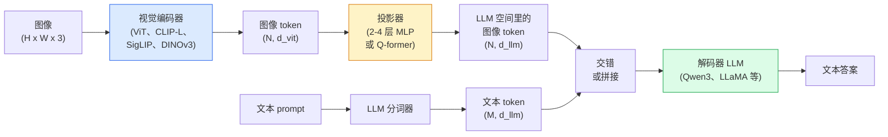

# 视觉-语言模型 —— ViT-MLP-LLM 模式

> 视觉编码器把图像转成 token。一个 MLP 投影器把这些 token 映射进 LLM 的嵌入空间。语言模型做剩下的。那个模式——ViT-MLP-LLM——就是 2026 年每个生产级 VLM。

**类型：** Learn + Use
**语言：** Python
**前置要求：** 阶段 4 第 14 课（ViT）、阶段 4 第 18 课（CLIP）、阶段 7 第 02 课（自注意力）
**预计时间：** ~75 分钟

## 学习目标

- 说出 ViT-MLP-LLM 架构，解释三个组件各自贡献什么
- 在参数量、上下文长度和基准表现上对比 Qwen3-VL、InternVL3.5、LLaVA-Next 和 GLM-4.6V
- 解释 DeepStack：为什么多层级 ViT 特征比单一末层特征更能收紧视觉-语言对齐
- 用跨模态错误率（Cross-Modal Error Rate，CMER）在生产中衡量 VLM 幻觉，并据此行动

## 问题所在

CLIP（阶段 4 第 18 课）给你一个图像和文本的共享嵌入空间，这对零样本分类和检索够用。它回答不了"这张图里有几辆红车？"，因为 CLIP 不生成文本——它只给相似度打分。

视觉-语言模型（VLM）——Qwen3-VL、InternVL3.5、LLaVA-Next、GLM-4.6V——把一个 CLIP 家族的图像编码器栓到一个完整的语言模型上。模型看一张图像加一个问题，生成一个答案。2026 年，开源 VLM 在多模态基准（MMMU、MMBench、DocVQA、ChartQA、MathVista、OSWorld）上匹敌或击败 GPT-5 和 Gemini-2.5-Pro。

这三个部件（ViT、投影器、LLM）是标准。模型之间的区别在于用哪个 ViT、哪个投影器、哪个 LLM、训练数据和对齐配方。一旦你理解了这个模式，换任何组件都是机械的。

## 核心概念

### ViT-MLP-LLM 架构



1. **视觉编码器** —— 一个预训练 ViT（CLIP-L/14、SigLIP、DINOv3，或一个微调变体）。产出 patch token。
2. **投影器** —— 一个小模块（2-4 层 MLP，或一个 Q-former），把视觉 token 映射进 LLM 的嵌入维度。大部分微调发生在这里。
3. **LLM** —— 一个仅解码器的语言模型（Qwen3、Llama、Mistral、GLM、InternLM）。按顺序读视觉 + 文本 token，生成文本。

原则上三个部件都可训练。实践中，视觉编码器和 LLM 大多保持冻结，而投影器训练——几十亿参数的信号，便宜。

### DeepStack

朴素投影只用末层 ViT。DeepStack（Qwen3-VL）从多个 ViT 深度采样特征并把它们堆起来。更深的层携带高层语义；更浅的层携带细粒度的空间和纹理信息。把两者都喂进 LLM，弥合了"图像含有什么"（语义）和"究竟在哪"（空间 grounding）之间的差距。

### 三个训练阶段

现代 VLM 分阶段训练：

1. **对齐（Alignment）** —— 冻结 ViT 和 LLM。只在图像-标题对上训练投影器。教投影器把视觉空间映射进语言空间。
2. **预训练（Pre-training）** —— 解冻一切。在大规模交错的图像-文本数据（5 亿+ 对）上训练。建立模型的视觉知识。
3. **指令微调（Instruction tuning）** —— 在精选的（图像，问题，答案）三元组上微调。教对话行为和任务格式。这就是把一个"有视觉感知的语言模型"变成一个可用助手的步骤。

大多数 LoRA 微调用一个小标注数据集瞄准阶段 3。

### 模型家族对比（2026 年初）

| 模型 | 参数 | 视觉编码器 | LLM | 上下文 | 强项 |
|-------|--------|----------------|-----|---------|-----------|
| Qwen3-VL-235B-A22B (MoE) | 235B（22B 激活） | 自定义 ViT + DeepStack | Qwen3 | 256K | 通用 SOTA、GUI agent |
| Qwen3-VL-30B-A3B (MoE) | 30B（3B 激活） | 自定义 ViT + DeepStack | Qwen3 | 256K | 更小的 MoE 替代 |
| Qwen3-VL-8B (dense) | 8B | 自定义 ViT | Qwen3 | 128K | 生产稠密默认 |
| InternVL3.5-38B | 38B | InternViT-6B | Qwen3 + GPT-OSS | 128K | MMBench / MMVet 强 |
| InternVL3.5-241B-A28B | 241B（28B 激活） | InternViT-6B | Qwen3 | 128K | 与 GPT-4o 竞争 |
| LLaVA-Next 72B | 72B | SigLIP | Llama-3 | 32K | 开放，易微调 |
| GLM-4.6V | ~70B | 自定义 | GLM | 64K | 开源，OCR 强 |
| MiniCPM-V-2.6 | 8B | SigLIP | MiniCPM | 32K | 对边缘友好 |

### 视觉 agent

Qwen3-VL-235B 在 OSWorld 上达到全球顶尖表现——OSWorld 是操作 GUI（桌面、移动、web）的**视觉 agent** 的基准。模型看一张截图，理解 UI，发出动作（点击、输入、滚动）。结合工具，它在常见桌面任务上闭环。这就是大多数 2026 年的"AI PC" demo 底层跑的东西。

### 智能体能力 + RoPE 变体

VLM 需要知道一帧**何时**在视频里。Qwen3-VL 从 T-RoPE（时序旋转位置嵌入）演进到**基于文本的时间对齐**——和视频帧交错的显式时间戳文本 token。模型看到"`<timestamp 00:32>` 帧，prompt"，就能推理时间关系。

### 对齐问题

爬取数据集里 12% 的图像-文本对，其描述并未完全 grounding 在图像上。在这上面训练的 VLM 会悄悄学会幻觉——捏造物体、读错数字、编造关系。在生产中这是主导的失败模式。

Skywork.ai 引入了**跨模态错误率（CMER）**来追踪它：

```
CMER = 文本置信度高、但图像-文本相似度（通过一个 CLIP 家族检查器）低的输出所占比例
```

高 CMER 意味着模型在自信地说图像里没有依据的东西。监控 CMER 并把它当生产 KPI，在他们的部署里把幻觉率降了约 35%。诀窍不是"修模型"，而是"把高 CMER 的输出路由给人工审核"。

### 用 LoRA / QLoRA 微调

完整微调一个 70B 的 VLM 对多数团队遥不可及。在注意力 + 投影器层上做 LoRA（rank 16-64），或用 4-bit 基座权重做 QLoRA，能塞进单块 A100 / H100。成本：5,000-50,000 个样本、100-5,000 美元算力、2-10 小时训练。

### 空间推理仍然弱

当前 VLM 在空间推理基准（上下、左右、计数、距离）上得分 50-60%。如果你的用例依赖"哪个物体在哪个上面"，要大量验证——通用 VLM 表现低于人类。纯空间任务比 VLM 更好的替代：一个专门的关键点 / 姿态估计器、一个深度模型，或一个带框几何后处理的检测模型。

## 动手构建

### 第 1 步：投影器

你最常训练的那部分。带 GELU 的 2-4 层 MLP。

```python
import torch
import torch.nn as nn


class Projector(nn.Module):
    def __init__(self, vit_dim=768, llm_dim=4096, hidden=4096):
        super().__init__()
        self.net = nn.Sequential(
            nn.Linear(vit_dim, hidden),
            nn.GELU(),
            nn.Linear(hidden, llm_dim),
        )

    def forward(self, x):
        return self.net(x)
```

输入是一个 `(N_patches, d_vit)` 的 token 张量。输出是 `(N_patches, d_llm)`。LLM 把每一行输出当成又一个 token。

### 第 2 步：端到端组装 ViT-MLP-LLM

一个极简 VLM 前向传播的骨架。真实代码用 `transformers`；这是概念布局。

```python
class MinimalVLM(nn.Module):
    def __init__(self, vit, projector, llm, image_token_id):
        super().__init__()
        self.vit = vit
        self.projector = projector
        self.llm = llm
        self.image_token_id = image_token_id  # 文本 prompt 里的占位 token

    def forward(self, image, input_ids, attention_mask):
        # 1. 视觉特征
        vision_tokens = self.vit(image)                     # (B, N_patches, d_vit)
        vision_embeds = self.projector(vision_tokens)       # (B, N_patches, d_llm)

        # 2. 文本嵌入
        text_embeds = self.llm.get_input_embeddings()(input_ids)  # (B, M, d_llm)

        # 3. 把图像占位 token 替换成视觉嵌入
        merged = self._merge(text_embeds, vision_embeds, input_ids)

        # 4. 跑 LLM
        return self.llm(inputs_embeds=merged, attention_mask=attention_mask)

    def _merge(self, text_embeds, vision_embeds, input_ids):
        out = text_embeds.clone()
        expected = vision_embeds.size(1)
        for b in range(input_ids.size(0)):
            positions = (input_ids[b] == self.image_token_id).nonzero(as_tuple=True)[0]
            if len(positions) != expected:
                raise ValueError(
                    f"batch item {b} has {len(positions)} image tokens but vision_embeds has {expected} patches."
                    " Every sample in the batch must be pre-padded to the same number of image placeholder tokens.")
            out[b, positions] = vision_embeds[b]
        return out
```

文本里的 `<image>` 占位 token 被替换成真实图像嵌入——和 LLaVA、Qwen-VL、InternVL 用的同一模式。

### 第 3 步：CMER 计算

一个轻量的运行时检查。

```python
import torch.nn.functional as F


def cross_modal_error_rate(image_emb, text_emb, text_confidence, sim_threshold=0.25, conf_threshold=0.8):
    """
    image_emb, text_emb: 图像和生成文本的嵌入（内部归一化）
    text_confidence:     [0, 1] 内的平均逐 token 概率
    返回:             图像-文本对齐低的高置信度输出所占比例
    """
    image_emb = F.normalize(image_emb, dim=-1)
    text_emb = F.normalize(text_emb, dim=-1)
    sim = (image_emb * text_emb).sum(dim=-1)        # 余弦相似度
    high_conf_low_sim = (text_confidence > conf_threshold) & (sim < sim_threshold)
    return high_conf_low_sim.float().mean().item()
```

把 CMER 当生产 KPI。按端点、按 prompt 类型、按客户监控它。CMER 上升意味着模型在某个输入分布上开始幻觉。

### 第 4 步：玩具 VLM 分类器（可运行）

演示投影器在训练。假"ViT 特征"进去；一个小 LLM 风格的 token 预测一个类别。

```python
class ToyVLM(nn.Module):
    def __init__(self, vit_dim=32, llm_dim=64, num_classes=5):
        super().__init__()
        self.projector = Projector(vit_dim, llm_dim, hidden=64)
        self.head = nn.Linear(llm_dim, num_classes)

    def forward(self, vision_tokens):
        projected = self.projector(vision_tokens)
        pooled = projected.mean(dim=1)
        return self.head(pooled)
```

可以在合成的（特征，类别）对上 200 步以内拟合它——足够展示投影器模式奏效。

## 上手使用

2026 年生产团队用 VLM 的三种方式：

- **托管 API** —— OpenAI Vision、Anthropic Claude Vision、Google Gemini Vision。零基础设施，有供应商风险。
- **开源自托管** —— 通过 `transformers` 和 `vllm` 跑 Qwen3-VL 或 InternVL3.5。完全控制，前期投入更高。
- **在领域上微调** —— 加载 Qwen2.5-VL-7B 或 LLaVA-1.6-7B，在 5k-50k 自定义样本上做 LoRA，用 `vllm` 或 `TGI` 服务。

```python
from transformers import AutoProcessor, AutoModelForVision2Seq
import torch
from PIL import Image

model_id = "Qwen/Qwen3-VL-8B-Instruct"
processor = AutoProcessor.from_pretrained(model_id)
model = AutoModelForVision2Seq.from_pretrained(model_id, torch_dtype=torch.bfloat16, device_map="auto")

messages = [{
    "role": "user",
    "content": [
        {"type": "image", "image": Image.open("plot.png")},
        {"type": "text", "text": "What does this chart show?"},
    ],
}]
inputs = processor.apply_chat_template(messages, add_generation_prompt=True, tokenize=True, return_dict=True, return_tensors="pt").to("cuda")
generated = model.generate(**inputs, max_new_tokens=256)
answer = processor.decode(generated[0][inputs["input_ids"].shape[1]:], skip_special_tokens=True)
```

`apply_chat_template` 隐藏了 `<image>` 占位的分词；模型在内部处理合并。

## 交付

这一课产出：

- `outputs/prompt-vlm-selector.md` —— 给定准确率、延迟、上下文长度和预算，挑出 Qwen3-VL / InternVL3.5 / LLaVA-Next / API。
- `outputs/skill-cmer-monitor.md` —— 产出代码，给生产 VLM 端点装上跨模态错误率监测、按端点的看板和告警阈值。

## 练习

1. **（简单）** 在五张图像上用任意开源 VLM 跑三个 prompt（"这是什么？""数物体""描述场景"）。手动把每个答案打分为正确 / 部分正确 / 幻觉。算一个初版的类 CMER 率。
2. **（中等）** 用 LoRA（rank 16）在一个目标领域的 500 张带标题图像上微调 Qwen2.5-VL-3B 或 LLaVA-1.6-7B。对比零样本和微调后的 MMBench 风格准确率。
3. **（困难）** 把 VLM 的图像编码器从它默认的 SigLIP/CLIP 换成 DINOv3。只重训投影器（冻结 LLM + 冻结 DINOv3）。测量稠密预测任务（计数、空间推理）是否改善。

## 关键术语

| 术语 | 大家嘴上怎么说 | 它实际是什么 |
|------|----------------|----------------------|
| ViT-MLP-LLM | "VLM 模式" | 视觉编码器 + 投影器 + 语言模型；2026 年每个 VLM |
| 投影器 | "桥" | 把视觉 token 映射进 LLM 嵌入空间的 2-4 层 MLP（或 Q-former） |
| DeepStack | "Qwen3-VL 特征技巧" | 堆叠多层级 ViT 特征，而非只用末层 |
| 图像 token | "<image> 占位" | 文本流里被投影后视觉嵌入替换的特殊 token |
| CMER | "幻觉 KPI" | 跨模态错误率；文本置信度高但图像-文本相似度低时高 |
| 视觉 agent | "会点击的 VLM" | 用工具调用操作 GUI（OSWorld、移动、web）的 VLM |
| Q-former | "固定数量 token 的桥" | BLIP-2 风格的投影器，产出固定数量的视觉查询 token |
| 对齐 / 预训练 / 指令微调 | "三个阶段" | 标准 VLM 训练流水线 |

## 延伸阅读

- [Qwen3-VL Technical Report (arXiv 2511.21631)](https://arxiv.org/abs/2511.21631)
- [InternVL3.5 Advancing Open-Source Multimodal Models (arXiv 2508.18265)](https://arxiv.org/html/2508.18265v1)
- [LLaVA-Next series](https://llava-vl.github.io/blog/2024-05-10-llava-next-stronger-llms/)
- [BentoML: Best Open-Source VLMs 2026](https://www.bentoml.com/blog/multimodal-ai-a-guide-to-open-source-vision-language-models)
- [MMMU: Multi-discipline Multimodal Understanding benchmark](https://mmmu-benchmark.github.io/)
- [VLMs in manufacturing (Robotics Tomorrow, March 2026)](https://www.roboticstomorrow.com/story/2026/03/when-machines-learn-to-see-like-experts-the-rise-of-vision-language-models-in-manufacturing/26335/)
