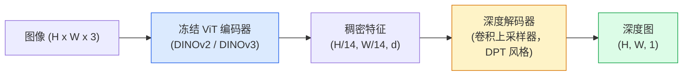

# 单目深度与几何估计

> 深度图是一张单通道图像，每个像素是到相机的距离。从一张 RGB 帧预测它，以前没有立体或 LiDAR 是不可能的。2026 年一个冻结的 ViT 编码器加一个轻量头就能逼近真值几个百分点。

**类型：** Build + Use
**语言：** Python
**前置要求：** 阶段 4 第 14 课（ViT）、阶段 4 第 17 课（自监督视觉）、阶段 4 第 07 课（U-Net）
**预计时间：** ~60 分钟

## 学习目标

- 区分相对深度和度量深度，说出每个生产模型（MiDaS、Marigold、Depth Anything V3、ZoeDepth）解的是哪一个
- 用 Depth Anything V3（DINOv2 骨干）为任意单张图像预测深度，无需标定
- 解释单目深度从一张图像为何能起作用（透视线索、纹理梯度、学到的先验），以及它恢复不了什么（绝对尺度、被遮挡的几何）
- 用深度图和针孔相机内参把 2D 检测抬升到 3D 点

## 问题所在

深度是 2D 计算机视觉里缺失的那根轴。给定 RGB，你知道东西出现在图像平面的哪里；你不知道它们有多远。深度传感器（立体装置、LiDAR、飞行时间）直接解决这点，但贵、脆弱、量程有限。

单目深度估计——从一张 RGB 帧预测深度——以前产出模糊、不可靠的输出。到 2026 年大型预训练编码器改变了这点：Depth Anything V3 用一个冻结的 DINOv2 骨干，产出在室内、室外、医学和卫星领域都能泛化的深度图。Marigold 把深度重新框定为一个条件扩散问题。ZoeDepth 回归真实的度量距离。

深度也是 2D 检测和 3D 理解之间的桥：把一个检测框的像素乘以深度，你就把 2D 物体抬升进一个 3D 点云。那是每个 AR 遮挡系统、每条避障流水线、每个"拿起杯子"机器人的核心。

## 核心概念

### 相对深度 vs 度量深度

- **相对深度** —— 有序的 `z` 值，没有真实世界单位。"像素 A 比像素 B 近，但距离之比不锚定到米。"
- **度量深度** —— 到相机的绝对距离，以米计。要求模型学到图像线索和真实距离之间的统计关系。

MiDaS 和 Depth Anything V3 产出相对深度。Marigold 产出相对深度。ZoeDepth、UniDepth 和 Metric3D 产出度量深度。度量模型对相机内参敏感；相对模型不。

### 编码器-解码器模式



Depth Anything V3 冻结编码器，只训练 DPT 风格的解码器。编码器提供丰富特征；解码器把它们插值回图像分辨率并回归深度。

### 单张图像为何能产出深度

一张 2D 图像含有许多与深度相关的单目线索：

- **透视** —— 3D 里平行的线在 2D 里汇聚。
- **纹理梯度** —— 远处的表面纹理更小更密。
- **遮挡顺序** —— 较近的物体遮挡较远的。
- **大小恒常性** —— 已知物体（车、人）给出近似尺度。
- **大气透视** —— 户外场景里远处物体看起来更朦胧偏蓝。

一个在数十亿图像上训练的 ViT 把这些线索内化了。有足够数据和强骨干，单目深度不需要任何显式 3D 监督就能达到合理准确率。

### 单目深度做不到的

- 没有内参或场景里已知物体时的**绝对度量尺度**。网络能预测"杯子比勺子远一倍"，却不知道杯子是 1 米还是 10 米远。
- **被遮挡的几何** —— 椅子的背面看不见，无法可靠推断。
- **真正无纹理 / 反射的表面** —— 镜子、玻璃、均匀墙面。网络报告貌似合理但错误的深度。

### 2026 年的 Depth Anything V3

- 朴素 DINOv2 ViT-L/14 作编码器（冻结）。
- DPT 解码器。
- 在来自多样来源的带位姿图像对上训练（除了光度一致性，不需要显式深度监督）。
- 从**任意数量的视觉输入，无论是否有已知相机位姿**，预测空间一致的几何。
- 在单目深度、任意视角几何、视觉渲染、相机位姿估计上都是 SOTA。

这是 2026 年你需要深度时即插即用的模型。

### Marigold —— 用扩散做深度

Marigold（Ke 等人，CVPR 2024）把深度估计重新框定为条件图到图扩散。条件：RGB。目标：深度图。用一个预训练的 Stable Diffusion 2 U-Net 作骨干。输出深度图在物体边界异常锐利。代价：推理比前馈模型慢（10-50 个去噪步）。

### 内参与针孔相机

要把一个带深度 `d` 的像素 `(u, v)` 抬升到相机坐标里的 3D 点 `(X, Y, Z)`：

```
fx, fy, cx, cy = 相机内参
X = (u - cx) * d / fx
Y = (v - cy) * d / fy
Z = d
```

内参来自 EXIF 元数据、一个标定图案，或一个单目内参估计器（Perspective Fields、UniDepth）。没有内参，你仍能假设一个 60-70° FOV 和中等分辨率主点来渲染点云——能用于可视化，不能用于测量。

### 评估

两个标准指标：

- **AbsRel**（绝对相对误差）：`mean(|d_pred - d_gt| / d_gt)`。越低越好。生产模型 0.05-0.1。
- **delta < 1.25**（阈值准确率）：`max(d_pred/d_gt, d_gt/d_pred) < 1.25` 的像素所占比例。越高越好。SOTA 0.9+。

对相对深度（Depth Anything V3、MiDaS），评估用两个指标的尺度-平移不变版本。

## 动手构建

### 第 1 步：深度指标

```python
import torch

def abs_rel_error(pred, target, mask=None):
    if mask is not None:
        pred = pred[mask]
        target = target[mask]
    return (torch.abs(pred - target) / target.clamp(min=1e-6)).mean().item()


def delta_accuracy(pred, target, threshold=1.25, mask=None):
    if mask is not None:
        pred = pred[mask]
        target = target[mask]
    ratio = torch.maximum(pred / target.clamp(min=1e-6), target / pred.clamp(min=1e-6))
    return (ratio < threshold).float().mean().item()
```

评估前永远掩掉无效深度像素（零、NaN、饱和）。

### 第 2 步：尺度-平移对齐

对相对深度模型，算指标前先把预测对齐到真值。最小二乘拟合 `a * pred + b = target`：

```python
def align_scale_shift(pred, target, mask=None):
    if mask is not None:
        p = pred[mask]
        t = target[mask]
    else:
        p = pred.flatten()
        t = target.flatten()
    A = torch.stack([p, torch.ones_like(p)], dim=1)
    coeffs, *_ = torch.linalg.lstsq(A, t.unsqueeze(-1))
    a, b = coeffs[:2, 0]
    return a * pred + b
```

评估 MiDaS / Depth Anything 时，在 `abs_rel_error` 之前跑 `align_scale_shift`。

### 第 3 步：把深度抬升成点云

```python
import numpy as np

def depth_to_point_cloud(depth, intrinsics):
    H, W = depth.shape
    fx, fy, cx, cy = intrinsics
    v, u = np.meshgrid(np.arange(H), np.arange(W), indexing="ij")
    z = depth
    x = (u - cx) * z / fx
    y = (v - cy) * z / fy
    return np.stack([x, y, z], axis=-1)


depth = np.random.uniform(0.5, 4.0, (240, 320))
intr = (320.0, 320.0, 160.0, 120.0)
pc = depth_to_point_cloud(depth, intr)
print(f"point cloud shape: {pc.shape}  (H, W, 3)")
```

一个函数，每个 3D 抬升的应用。把点云导出成 `.ply`，在 MeshLab 或 CloudCompare 里打开。

### 第 4 步：用合成深度场景做冒烟测试

```python
def synthetic_depth(size=96):
    yy, xx = np.meshgrid(np.arange(size), np.arange(size), indexing="ij")
    # 地面：从近（上）到远（下）的线性梯度
    depth = 1.0 + (yy / size) * 4.0
    # 中间的盒子：更近
    mask = (np.abs(xx - size / 2) < size / 6) & (np.abs(yy - size * 0.6) < size / 6)
    depth[mask] = 2.0
    return depth.astype(np.float32)


gt = torch.from_numpy(synthetic_depth(96))
pred = gt + 0.3 * torch.randn_like(gt)  # 模拟预测
aligned = align_scale_shift(pred, gt)
print(f"before align  absRel = {abs_rel_error(pred, gt):.3f}")
print(f"after align   absRel = {abs_rel_error(aligned, gt):.3f}")
```

### 第 5 步：Depth Anything V3 用法（参考）

```python
import torch
from transformers import pipeline
from PIL import Image

pipe = pipeline(task="depth-estimation", model="LiheYoung/depth-anything-v2-large")

image = Image.open("street.jpg").convert("RGB")
out = pipe(image)
depth_np = np.array(out["depth"])
```

三行。`out["depth"]` 是一张 PIL 灰度图；转成 numpy 做数学。具体到 Depth Anything V3，一旦发布就换模型 id；API 不变。

## 上手使用

- **Depth Anything V3**（Meta AI / ByteDance，2024-2026）—— 相对深度的默认。生产中最快的 ViT-large 骨干模型。
- **Marigold**（ETH，2024）—— 视觉质量最高，推理慢。
- **UniDepth**（ETH，2024）—— 带相机内参估计的度量深度。
- **ZoeDepth**（Intel，2023）—— 度量深度；较老，仍可靠。
- **MiDaS v3.1** —— 遗留但稳定；对比用的好基线。

典型集成模式：

1. RGB 帧到达。
2. 深度模型产出深度图。
3. 检测器产出框。
4. 把框质心通过深度抬升到 3D；如有点云就合并。
5. 下游：AR 遮挡、路径规划、物体尺寸估计、立体替代。

实时用时，Depth Anything V2 Small（INT8 量化）在消费级 GPU 上 518x518 达到约 30 fps。

## 交付

这一课产出：

- `outputs/prompt-depth-model-picker.md` —— 给定延迟、度量 vs 相对需求和场景类型，在 Depth Anything V3、Marigold、UniDepth、MiDaS 之间挑选。
- `outputs/skill-depth-to-pointcloud.md` —— 一个 skill，从深度图构建点云，正确处理内参并导出到 `.ply`。

## 练习

1. **（简单）** 在你书桌的任意 10 张图像上跑 Depth Anything V2。把深度存成灰度 PNG 并检查。找出一个预测深度看起来错的物体，解释为什么单目线索失效了。
2. **（中等）** 给定来自 Depth Anything V2 的 RGB + 深度，抬升成点云，用 `open3d` 渲染。对比两个场景（室内 / 室外），记下哪个看起来更可信。
3. **（困难）** 拿五对仅在一个已知物体位置上不同的图像（例如瓶子近移 30 cm）。用 UniDepth 在两者上预测度量深度。报告预测的距离差值对真实的 30 cm。

## 关键术语

| 术语 | 大家嘴上怎么说 | 它实际是什么 |
|------|----------------|----------------------|
| 单目深度 | "单图深度" | 从一张 RGB 帧做深度估计，无立体或 LiDAR |
| 相对深度 | "有序深度" | 没有真实世界单位的有序 z 值 |
| 度量深度 | "绝对距离" | 以米计的深度；需要标定或一个用度量监督训练的模型 |
| AbsRel | "绝对相对误差" | |d_pred - d_gt| / d_gt 的均值；标准深度指标 |
| Delta 准确率 | "delta < 1.25" | 预测在真值 25% 以内的像素所占比例 |
| 针孔相机 | "fx, fy, cx, cy" | 用于把 (u, v, d) 抬升到 (X, Y, Z) 的相机模型 |
| DPT | "Dense Prediction Transformer" | 用在冻结 ViT 编码器之上做深度的基于卷积的解码器 |
| DINOv2 骨干 | "它能行的原因" | 无需深度标签就能跨领域泛化的自监督特征 |

## 延伸阅读

- [Depth Anything V3 paper page](https://depth-anything.github.io/) —— 带 DINOv2 编码器的 SOTA 单目深度
- [Marigold (Ke et al., CVPR 2024)](https://marigoldmonodepth.github.io/) —— 基于扩散的深度估计
- [UniDepth (Piccinelli et al., 2024)](https://arxiv.org/abs/2403.18913) —— 带内参的度量深度
- [MiDaS v3.1 (Intel ISL)](https://github.com/isl-org/MiDaS) —— 经典的相对深度基线
- [DINOv3 blog post (Meta)](https://ai.meta.com/blog/dinov3-self-supervised-vision-model/) —— 提升深度准确率的编码器家族
