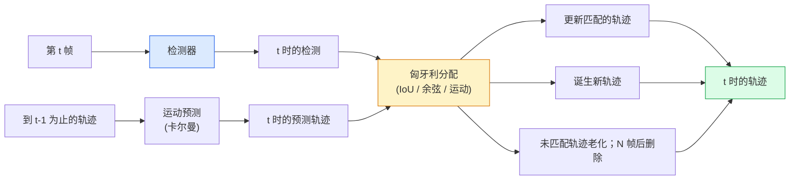

# 多目标追踪与视频记忆

> 追踪是检测加关联。每帧检测。按 ID 把这一帧的检测匹配到上一帧的轨迹。

**类型：** Build
**语言：** Python
**前置要求：** 阶段 4 第 06 课（YOLO 检测）、阶段 4 第 08 课（Mask R-CNN）、阶段 4 第 24 课（SAM 3）
**预计时间：** ~60 分钟

## 学习目标

- 区分基于检测的追踪和基于查询的追踪，点名算法家族（SORT、DeepSORT、ByteTrack、BoT-SORT、SAM 2 记忆追踪器、SAM 3.1 Object Multiplex）
- 从零为经典的基于检测的追踪实现 IoU + 匈牙利分配
- 解释 SAM 2 的记忆库，以及为什么它比基于 IoU 的关联更能处理遮挡
- 读懂三个追踪指标（MOTA、IDF1、HOTA），为给定用例挑出要紧的那个

## 问题所在

检测器告诉你单帧里物体在哪。追踪器告诉你第 `t` 帧的哪个检测和第 `t-1` 帧的某个检测是同一个物体。没有它，你数不了越线的物体、跟不了穿过遮挡的球，也不知道"4 号车已经在车道上 8 秒了"。

追踪对每个面向视频的产品都至关重要：体育分析、监控、自动驾驶、医学视频分析、野生动物监测、字标计数。核心构件是共享的：一个逐帧检测器、一个运动模型（卡尔曼滤波或更丰富的东西）、一个关联步骤（在 IoU / 余弦 / 学到的特征上的匈牙利算法），以及一个轨迹生命周期（诞生、更新、消亡）。

2026 年带来两个新模式：**SAM 2 基于记忆的追踪**（用特征记忆而非运动模型关联）和 **SAM 3.1 Object Multiplex**（同一概念多实例的共享记忆）。这一课先走经典栈，再走基于记忆的方法。

## 核心概念

### 基于检测的追踪



2026 年你会遇到的每个追踪器都是这个循环的变体。区别：

- **SORT**（2016）：卡尔曼滤波 + IoU 匈牙利。简单、快、无外观模型。
- **DeepSORT**（2017）：SORT + 每条轨迹一个基于 CNN 的外观特征（ReID 嵌入）。更好地处理交叉。
- **ByteTrack**（2021）：把低置信度检测作为第二阶段关联；不需要外观特征但在 MOT17 上是顶尖。
- **BoT-SORT**（2022）：Byte + 相机运动补偿 + ReID。
- **StrongSORT / OC-SORT** —— ByteTrack 的后代，运动和外观更好。

### 一段话讲清卡尔曼滤波

卡尔曼滤波为每条轨迹维护一个状态 `(x, y, w, h, dx, dy, dw, dh)` 加一个协方差。每帧用一个匀速模型**预测**状态，再用匹配到的检测**更新**。当预测不确定性高时，更新更信任检测。这给出平滑的轨迹，以及让一条轨迹穿过短暂遮挡（1-5 帧）的能力。

每个经典追踪器都在运动预测步用卡尔曼滤波。

### 匈牙利算法

给定一个 `M x N` 的代价矩阵（轨迹 x 检测），找出使总代价最小的一对一分配。代价通常是 `1 - IoU(track_bbox, detection_bbox)` 或外观特征的负余弦相似度。运行时是 O((M+N)^3)；M、N 最多约 1000 时，在 Python 里通过 `scipy.optimize.linear_sum_assignment` 够快。

### ByteTrack 的关键点子

标准追踪器丢掉低置信度检测（< 0.5）。ByteTrack 把它们留作**第二阶段候选**：把轨迹匹配到高置信度检测之后，未匹配的轨迹用稍微宽松的 IoU 阈值尝试匹配低置信度检测。挽回短暂遮挡、人群附近的 ID 切换。

### SAM 2 基于记忆的追踪

SAM 2 通过保留一个逐实例时空特征的**记忆库**来处理视频。给定一帧上的一个 prompt（点击、框、文本），它把实例编码进记忆。在后续帧上，记忆和新帧的特征做交叉注意力，解码器为新帧里的同一实例产出掩码。

没有卡尔曼滤波，没有匈牙利分配。关联隐含在记忆-注意力操作里。

优点：
- 对大遮挡鲁棒（记忆跨许多帧携带实例身份）。
- 和 SAM 3 的文本 prompt 结合时是开放词表的。
- 无需单独的运动模型就能工作。

缺点：
- 多目标追踪时比 ByteTrack 慢。
- 记忆库会增长；限制上下文窗口。

### SAM 3.1 Object Multiplex

此前的 SAM 2 / SAM 3 追踪每个实例保留一个单独记忆库。50 个物体，50 个记忆库。Object Multiplex（2026 年 3 月）把它们塌成一个共享记忆加**逐实例查询 token**。代价在实例数量上次线性缩放。

Multiplex 是 2026 年人群追踪的新默认：演唱会人群、仓库工人、交通路口。

### 要知道的三个指标

- **MOTA（多目标追踪准确率）** —— 1 - (FN + FP + ID 切换) / GT。按错误类型加权；一个把检测和关联失败混在一起的单一指标。
- **IDF1（ID F1）** —— ID 精确率和召回率的调和平均。专门关注每条真值轨迹随时间保持其 ID 的好坏。对 ID 切换敏感的任务比 MOTA 好。
- **HOTA（高阶追踪准确率）** —— 分解为检测准确率（DetA）和关联准确率（AssA）。自 2020 年起的社区标准；最全面。

监控（谁是谁）：报 IDF1。体育分析（数传球）：HOTA。一般学术对比：HOTA。

## 动手构建

### 第 1 步：基于 IoU 的代价矩阵

```python
import numpy as np


def bbox_iou(a, b):
    """
    a, b: (N, 4) 的 [x1, y1, x2, y2] 数组。
    返回 (N_a, N_b) 的 IoU 矩阵。
    """
    ax1, ay1, ax2, ay2 = a[:, 0], a[:, 1], a[:, 2], a[:, 3]
    bx1, by1, bx2, by2 = b[:, 0], b[:, 1], b[:, 2], b[:, 3]
    inter_x1 = np.maximum(ax1[:, None], bx1[None, :])
    inter_y1 = np.maximum(ay1[:, None], by1[None, :])
    inter_x2 = np.minimum(ax2[:, None], bx2[None, :])
    inter_y2 = np.minimum(ay2[:, None], by2[None, :])
    inter = np.clip(inter_x2 - inter_x1, 0, None) * np.clip(inter_y2 - inter_y1, 0, None)
    area_a = (ax2 - ax1) * (ay2 - ay1)
    area_b = (bx2 - bx1) * (by2 - by1)
    union = area_a[:, None] + area_b[None, :] - inter
    return inter / np.clip(union, 1e-8, None)
```

### 第 2 步：极简 SORT 风格追踪器

为简洁省略固定匀速卡尔曼——这里用简单的 IoU 关联；生产中卡尔曼预测必不可少。`sort` Python 包提供完整版本。

```python
from scipy.optimize import linear_sum_assignment


class Track:
    def __init__(self, tid, bbox, frame):
        self.id = tid
        self.bbox = bbox
        self.last_frame = frame
        self.hits = 1

    def update(self, bbox, frame):
        self.bbox = bbox
        self.last_frame = frame
        self.hits += 1


class SimpleTracker:
    def __init__(self, iou_threshold=0.3, max_age=5):
        self.tracks = []
        self.next_id = 1
        self.iou_threshold = iou_threshold
        self.max_age = max_age

    def step(self, detections, frame):
        if not self.tracks:
            for d in detections:
                self.tracks.append(Track(self.next_id, d, frame))
                self.next_id += 1
            return [(t.id, t.bbox) for t in self.tracks]

        track_boxes = np.array([t.bbox for t in self.tracks])
        det_boxes = np.array(detections) if len(detections) else np.empty((0, 4))

        iou = bbox_iou(track_boxes, det_boxes) if len(det_boxes) else np.zeros((len(track_boxes), 0))
        cost = 1 - iou
        cost[iou < self.iou_threshold] = 1e6

        matched_track = set()
        matched_det = set()
        if cost.size > 0:
            row, col = linear_sum_assignment(cost)
            for r, c in zip(row, col):
                if cost[r, c] < 1.0:
                    self.tracks[r].update(det_boxes[c], frame)
                    matched_track.add(r); matched_det.add(c)

        for i, d in enumerate(det_boxes):
            if i not in matched_det:
                self.tracks.append(Track(self.next_id, d, frame))
                self.next_id += 1

        self.tracks = [t for t in self.tracks if frame - t.last_frame <= self.max_age]
        return [(t.id, t.bbox) for t in self.tracks]
```

60 行。拿逐帧检测，返回逐帧轨迹 ID。真实系统加上卡尔曼预测、ByteTrack 的第二阶段重匹配，以及外观特征。

### 第 3 步：合成轨迹测试

```python
def synthetic_frames(num_frames=20, num_objects=3, H=240, W=320, seed=0):
    rng = np.random.default_rng(seed)
    starts = rng.uniform(20, 200, size=(num_objects, 2))
    velocities = rng.uniform(-5, 5, size=(num_objects, 2))
    frames = []
    for f in range(num_frames):
        dets = []
        for i in range(num_objects):
            cx, cy = starts[i] + f * velocities[i]
            dets.append([cx - 10, cy - 10, cx + 10, cy + 10])
        frames.append(dets)
    return frames


tracker = SimpleTracker()
for f, dets in enumerate(synthetic_frames()):
    tracks = tracker.step(dets, f)
```

三个沿直线移动的物体应在全部 20 帧里保持它们的 ID。

### 第 4 步：ID 切换指标

```python
def count_id_switches(tracks_per_frame, gt_per_frame):
    """
    tracks_per_frame:  (track_id, bbox) 列表的列表
    gt_per_frame:      (gt_id, bbox) 列表的列表
    返回 ID 切换次数。
    """
    prev_assignment = {}
    switches = 0
    for tracks, gts in zip(tracks_per_frame, gt_per_frame):
        if not tracks or not gts:
            continue
        t_boxes = np.array([b for _, b in tracks])
        g_boxes = np.array([b for _, b in gts])
        iou = bbox_iou(g_boxes, t_boxes)
        for g_idx, (gt_id, _) in enumerate(gts):
            j = iou[g_idx].argmax()
            if iou[g_idx, j] > 0.5:
                t_id = tracks[j][0]
                if gt_id in prev_assignment and prev_assignment[gt_id] != t_id:
                    switches += 1
                prev_assignment[gt_id] = t_id
    return switches
```

这是一个简化的、接近 IDF1 的指标：数一个真值物体改变其被分配的预测轨迹 ID 的次数。真正的 MOTA / IDF1 / HOTA 工具在 `py-motmetrics` 和 `TrackEval` 里。

## 上手使用

2026 年的生产追踪器：

- `ultralytics` —— YOLOv8 + 内建 ByteTrack / BoT-SORT。`results = model.track(source, tracker="bytetrack.yaml")`。默认。
- `supervision`（Roboflow）—— ByteTrack 封装加标注工具。
- SAM 2 / SAM 3.1 —— 通过 `processor.track()` 做基于记忆的追踪。
- 自定义栈：检测器（YOLOv8 / RT-DETR）+ `sort-tracker` / `OC-SORT` / `StrongSORT`。

挑选：

- 30+ fps 的行人 / 车 / 盒子：**ultralytics 配 ByteTrack**。
- 人群里一个类别的许多实例：**SAM 3.1 Object Multiplex**。
- 带可辨认外观的重度遮挡：**DeepSORT / StrongSORT**（ReID 特征）。
- 体育 / 复杂交互：**BoT-SORT** 或学习式追踪器（MOTRv3）。

## 交付

这一课产出：

- `outputs/prompt-tracker-picker.md` —— 给定场景类型、遮挡模式和延迟预算，挑出 SORT / ByteTrack / BoT-SORT / SAM 2 / SAM 3.1。
- `outputs/skill-mot-evaluator.md` —— 写一个完整的评估框架，对真值轨迹算 MOTA / IDF1 / HOTA。

## 练习

1. **（简单）** 用 3、10、30 个物体跑上面的合成追踪器。各报告 ID 切换次数。找出仅用 IoU 的简单关联开始失效的地方。
2. **（中等）** 在关联前加一个匀速卡尔曼预测步。展示短（2-3 帧）遮挡不再导致 ID 切换。
3. **（困难）** 把 SAM 2 基于记忆的追踪器（通过 `transformers`）作为一个替代追踪器后端集成进来。在一段 30 秒的人群片段上跑 SimpleTracker 和 SAM 2，对比 ID 切换次数，手动为 5 个显眼的人标真值 ID。

## 关键术语

| 术语 | 大家嘴上怎么说 | 它实际是什么 |
|------|----------------|----------------------|
| 基于检测的追踪 | "先检测再关联" | 逐帧检测器 + 在 IoU / 外观上的匈牙利分配 |
| 卡尔曼滤波 | "运动预测" | 线性动力学 + 协方差，用于平滑轨迹预测和遮挡处理 |
| 匈牙利算法 | "最优分配" | 解最小代价二分匹配问题；`scipy.optimize.linear_sum_assignment` |
| ByteTrack | "低置信度第二遍" | 把未匹配轨迹重匹配到低置信度检测以挽回短暂遮挡 |
| DeepSORT | "SORT + 外观" | 加一个 ReID 特征做跨帧匹配；更好地保住 ID |
| 记忆库 | "SAM 2 技巧" | 跨帧存储的逐实例时空特征；交叉注意力替代显式关联 |
| Object Multiplex | "SAM 3.1 共享记忆" | 带逐实例查询的单个共享记忆，用于快速多目标追踪 |
| HOTA | "现代追踪指标" | 分解为检测准确率和关联准确率；社区标准 |

## 延伸阅读

- [SORT (Bewley et al., 2016)](https://arxiv.org/abs/1602.00763) —— 极简的基于检测的追踪论文
- [DeepSORT (Wojke et al., 2017)](https://arxiv.org/abs/1703.07402) —— 加上外观特征
- [ByteTrack (Zhang et al., 2022)](https://arxiv.org/abs/2110.06864) —— 低置信度第二遍
- [BoT-SORT (Aharon et al., 2022)](https://arxiv.org/abs/2206.14651) —— 相机运动补偿
- [HOTA (Luiten et al., 2020)](https://arxiv.org/abs/2009.07736) —— 分解的追踪指标
- [SAM 2 video segmentation (Meta, 2024)](https://ai.meta.com/sam2/) —— 基于记忆的追踪器
- [SAM 3.1 Object Multiplex (Meta, March 2026)](https://ai.meta.com/blog/segment-anything-model-3/)
