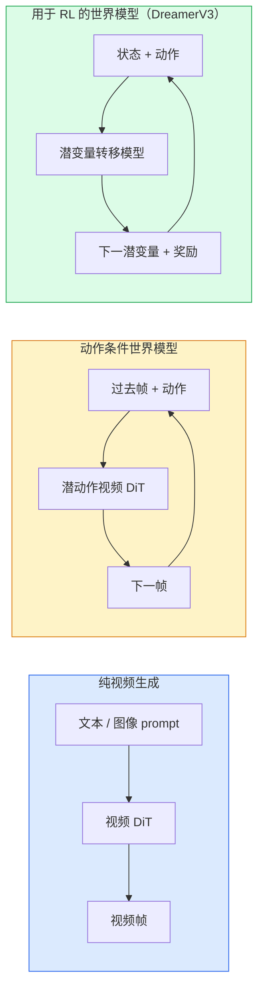

# 世界模型与视频扩散

> 一个能预测场景接下来几秒的视频模型，就是一个世界模拟器。把那个预测以动作为条件，你就有了一个学出来的游戏引擎。

**类型：** Learn + Build
**语言：** Python
**前置要求：** 阶段 4 第 10 课（扩散）、阶段 4 第 12 课（视频理解）、阶段 4 第 23 课（DiT + Rectified Flow）
**预计时间：** ~75 分钟

## 学习目标

- 解释纯视频生成模型（Sora 2）和动作条件世界模型（Genie 3、DreamerV3）的区别
- 描述视频 DiT：时空 patch、3D 位置编码、跨 (T, H, W) token 的联合注意力
- 梳理世界模型如何接入机器人：VLM 规划 → 视频模型模拟 → 逆动力学发出动作
- 为给定用例在 Sora 2、Genie 3、Runway GWM-1 Worlds、Wan-Video、HunyuanVideo 之间挑选（创意视频、交互式仿真、自动驾驶合成）

## 问题所在

视频生成和世界建模在 2026 年汇流了。一个能生成连贯一分钟视频的模型，在某种意义上已经学会了世界如何运动：物体恒常性、重力、因果、风格。如果你把那个预测以动作为条件（往左走、开门），视频模型就成了一个可学习的模拟器，能替代游戏引擎、驾驶模拟器或机器人环境。

利害是具体的。Genie 3 从单张图像生成可玩的环境。Runway GWM-1 Worlds 合成无限可探索的场景。Sora 2 产出带同步音频和建模物理的分钟级视频。NVIDIA Cosmos-Drive、Wayve Gaia-2 和 Tesla DrivingWorld 为自动驾驶训练数据生成逼真的驾驶视频。世界模型范式正悄悄接管机器人的 sim-to-real。

这一课是 Phase 4 的"大图景"课。它把图像生成、视频理解和智能体推理连成主流研究正在走向的那个架构模式。

## 核心概念

### 世界建模的三个家族



- **Sora 2** 是以 prompt 为条件的纯视频生成。没有动作接口。你没法在 rollout 中途"操控"它。
- **Genie 3**、**GWM-1 Worlds**、**Mirage / Magica** 是动作条件世界模型。从观察到的视频推断潜动作，再以动作为条件预测未来帧。交互式——你按键或移动相机，场景就响应。
- **DreamerV3** 和经典 RL 世界模型家族在潜空间里预测，带显式动作条件，用奖励信号训练。视觉性更弱；对样本高效的 RL 更有用。

### 视频 DiT 架构

```
视频潜变量:            (C, T, H, W)
切 patch（空间）:      每帧 P_h x P_w 个 patch 的网格
切 patch（时间）:      把 P_t 帧分组成一个时间 patch
得到的 token:          (T / P_t) * (H / P_h) * (W / P_w) 个 token
```

位置编码是 3D 的：每个 (t, h, w) 坐标一个旋转或学习式嵌入。注意力可以是：

- **完全联合** —— 所有 token 注意所有 token。N 个 token 时 O(N^2)。对长视频代价过高。
- **分离** —— 交替时间注意力（同一空间位置、跨时间：`(H*W) * T^2`）和空间注意力（同一时间步、跨空间：`T * (H*W)^2`）。TimeSformer 和大多数视频 DiT 用。
- **窗口** —— (t, h, w) 里的局部窗口。Video Swin 用。

2026 年每个视频扩散模型都用这三种模式之一，加上 AdaLN 条件化（第 23 课）和 rectified flow。

### 以动作为条件：潜动作模型

Genie 通过判别式地预测一对连续帧之间的动作，为每帧学一个**潜动作**。模型的解码器随后以推断出的潜动作为条件——而不是显式的键盘按键。推理时，用户可以指定一个潜动作（或从一个新的先验里采一个），模型生成与该动作一致的下一帧。

Sora 完全跳过动作接口。它的解码器从过去的时空 token 预测下一个时空 token。Prompt 给出开头；生成中途没有东西操控它。

### 物理合理性

Sora 2 的 2026 年发布明确宣传**物理合理性**：重量、平衡、物体恒常性、因果。团队通过手工评定的合理性分数衡量；相比 Sora 1，模型在掉落物体、角色碰撞和故意失败（一次没跳成的跳跃）上明显改善。

合理性仍是主导的失败模式。2024-2025 年人吃意面或用玻璃杯喝水的视频暴露了模型缺乏持久的物体表示。2026 年的模型（Sora 2、Runway Gen-5、HunyuanVideo）减少但没消除这些。

### 自动驾驶世界模型

驾驶世界模型以轨迹、边界框或导航地图为条件生成逼真的道路场景。用途：

- **Cosmos-Drive-Dreams**（NVIDIA）—— 为 RL 训练生成分钟级驾驶视频。
- **Gaia-2**（Wayve）—— 轨迹条件的场景合成，用于策略评估。
- **DrivingWorld**（Tesla）—— 模拟多样的天气、时段、交通状况。
- **Vista**（ByteDance）—— 反应式驾驶场景合成。

它们替代了对边角情形昂贵的真实世界数据采集——夜间行人乱穿马路、结冰的路口、不寻常的车型——否则需要数百万英里的驾驶。

### 机器人栈：VLM + 视频模型 + 逆动力学

正在浮现的三组件机器人循环：

1. **VLM** 解析目标（"拿起红杯子"），规划一个高层动作序列。
2. **视频生成模型**模拟执行每个动作会是什么样——预测往前 N 帧的观察。
3. **逆动力学模型**提取出能产生那些观察的具体电机指令。

这替代了奖励塑形和样本沉重的 RL。世界模型做想象；逆动力学在执动上闭环。Genie Envisioner 是一个实例；很多研究组正在向这个结构收敛。

### 评估

- **视觉质量** —— FVD（Fréchet Video Distance）、用户研究。
- **prompt 对齐** —— 逐帧 CLIPScore、VQA 风格的评估。
- **物理合理性** —— 在一个基准套件上手工评定（Sora 2 的内部基准、VBench）。
- **可控性**（对交互式世界模型）—— 动作 → 观察的一致性；你能回到先前的状态吗？

### 2026 年的模型版图

| 模型 | 用途 | 参数 | 输出 | 授权 |
|-------|-----|------------|--------|---------|
| Sora 2 | 文本到视频、音频 | — | 1 分钟 1080p + 音频 | 仅 API |
| Runway Gen-5 | 文本/图像到视频 | — | 10s 片段 | API |
| Runway GWM-1 Worlds | 交互式世界 | — | 无限 3D rollout | API |
| Genie 3 | 从图像生成交互式世界 | 11B+ | 可玩帧 | 研究预览 |
| Wan-Video 2.1 | 开源文本到视频 | 14B | 高质量片段 | 非商业 |
| HunyuanVideo | 开源文本到视频 | 13B | 10s 片段 | 宽松 |
| Cosmos / Cosmos-Drive | 自动驾驶仿真 | 7-14B | 驾驶场景 | NVIDIA 开放 |
| Magica / Mirage 2 | AI 原生游戏引擎 | — | 可修改世界 | 产品 |

## 动手构建

### 第 1 步：视频的 3D 切 patch

```python
import torch
import torch.nn as nn


class VideoPatch3D(nn.Module):
    def __init__(self, in_channels=4, dim=64, patch_t=2, patch_h=2, patch_w=2):
        super().__init__()
        self.proj = nn.Conv3d(
            in_channels, dim,
            kernel_size=(patch_t, patch_h, patch_w),
            stride=(patch_t, patch_h, patch_w),
        )
        self.patch_t = patch_t
        self.patch_h = patch_h
        self.patch_w = patch_w

    def forward(self, x):
        # x: (N, C, T, H, W)
        x = self.proj(x)
        n, c, t, h, w = x.shape
        tokens = x.reshape(n, c, t * h * w).transpose(1, 2)
        return tokens, (t, h, w)
```

一个 stride 等于核大小的 3D 卷积充当时空切 patch 器。`(T, H, W) -> (T/2, H/2, W/2)` 的 token 网格。

### 第 2 步：3D 旋转位置编码

旋转位置嵌入（RoPE）分别沿 `t`、`h`、`w` 轴应用：

```python
def rope_3d(tokens, t_dim, h_dim, w_dim, grid):
    """
    tokens: (N, T*H*W, D)
    grid: (T, H, W) 尺寸
    t_dim + h_dim + w_dim == D
    """
    T, H, W = grid
    n, seq, d = tokens.shape
    if t_dim + h_dim + w_dim != d:
        raise ValueError(f"t_dim+h_dim+w_dim ({t_dim}+{h_dim}+{w_dim}) must equal D={d}")
    assert seq == T * H * W
    t_idx = torch.arange(T, device=tokens.device).repeat_interleave(H * W)
    h_idx = torch.arange(H, device=tokens.device).repeat_interleave(W).repeat(T)
    w_idx = torch.arange(W, device=tokens.device).repeat(T * H)
    # 简化版：只用频率缩放通道。真正的 RoPE 旋转成对的通道。
    freqs_t = torch.exp(-torch.log(torch.tensor(10000.0)) * torch.arange(t_dim // 2, device=tokens.device) / (t_dim // 2))
    freqs_h = torch.exp(-torch.log(torch.tensor(10000.0)) * torch.arange(h_dim // 2, device=tokens.device) / (h_dim // 2))
    freqs_w = torch.exp(-torch.log(torch.tensor(10000.0)) * torch.arange(w_dim // 2, device=tokens.device) / (w_dim // 2))
    emb_t = torch.cat([torch.sin(t_idx[:, None] * freqs_t), torch.cos(t_idx[:, None] * freqs_t)], dim=-1)
    emb_h = torch.cat([torch.sin(h_idx[:, None] * freqs_h), torch.cos(h_idx[:, None] * freqs_h)], dim=-1)
    emb_w = torch.cat([torch.sin(w_idx[:, None] * freqs_w), torch.cos(w_idx[:, None] * freqs_w)], dim=-1)
    return tokens + torch.cat([emb_t, emb_h, emb_w], dim=-1)
```

简化的加法形式。真正的 RoPE 以各频率旋转成对的通道；位置信息是一样的。

### 第 3 步：分离注意力块

```python
class DividedAttentionBlock(nn.Module):
    def __init__(self, dim=64, heads=2):
        super().__init__()
        self.time_attn = nn.MultiheadAttention(dim, heads, batch_first=True)
        self.space_attn = nn.MultiheadAttention(dim, heads, batch_first=True)
        self.ln1 = nn.LayerNorm(dim)
        self.ln2 = nn.LayerNorm(dim)
        self.ln3 = nn.LayerNorm(dim)
        self.mlp = nn.Sequential(nn.Linear(dim, 4 * dim), nn.GELU(), nn.Linear(4 * dim, dim))

    def forward(self, x, grid):
        T, H, W = grid
        n, seq, d = x.shape
        # 时间注意力：同一 (h, w)，跨 t
        xt = x.view(n, T, H * W, d).permute(0, 2, 1, 3).reshape(n * H * W, T, d)
        a, _ = self.time_attn(self.ln1(xt), self.ln1(xt), self.ln1(xt), need_weights=False)
        xt = (xt + a).reshape(n, H * W, T, d).permute(0, 2, 1, 3).reshape(n, seq, d)
        # 空间注意力：同一 t，跨 (h, w)
        xs = xt.view(n, T, H * W, d).reshape(n * T, H * W, d)
        a, _ = self.space_attn(self.ln2(xs), self.ln2(xs), self.ln2(xs), need_weights=False)
        xs = (xs + a).reshape(n, T, H * W, d).reshape(n, seq, d)
        xs = xs + self.mlp(self.ln3(xs))
        return xs
```

时间注意力在每个空间位置内跨时间做；空间注意力在每帧内跨位置做。两次 O(T^2 + (HW)^2) 操作，而不是一次 O((THW)^2)。这是 TimeSformer 和每个现代视频 DiT 的核心。

### 第 4 步：组一个小视频 DiT

```python
class TinyVideoDiT(nn.Module):
    def __init__(self, in_channels=4, dim=64, depth=2, heads=2):
        super().__init__()
        self.patch = VideoPatch3D(in_channels=in_channels, dim=dim, patch_t=2, patch_h=2, patch_w=2)
        self.blocks = nn.ModuleList([DividedAttentionBlock(dim, heads) for _ in range(depth)])
        self.out = nn.Linear(dim, in_channels * 2 * 2 * 2)

    def forward(self, x):
        tokens, grid = self.patch(x)
        for blk in self.blocks:
            tokens = blk(tokens, grid)
        return self.out(tokens), grid
```

不是一个能用的视频生成器；一个结构性演示，每个部件形状都对。

### 第 5 步：检查形状

```python
vid = torch.randn(1, 4, 8, 16, 16)  # (N, C, T, H, W)
model = TinyVideoDiT()
out, grid = model(vid)
print(f"input  {tuple(vid.shape)}")
print(f"tokens grid {grid}")
print(f"output {tuple(out.shape)}")
```

切 patch 后预期 `grid = (4, 8, 8)`、`out = (1, 256, 32)`；头随后投影成逐 token 的时空 patch，可以反切 patch 还原成视频。

## 上手使用

2026 年的生产访问模式：

- **Sora 2 API**（OpenAI）—— 文本到视频，同步音频。高端定价。
- **Runway Gen-5 / GWM-1**（Runway）—— 图像到视频，交互式世界。
- **Wan-Video 2.1 / HunyuanVideo** —— 开源自托管。
- **Cosmos / Cosmos-Drive**（NVIDIA）—— 驾驶仿真开放权重。
- **Genie 3** —— 研究预览，申请访问。

要做一个交互式世界模型 demo：用 Wan-Video 起步求质量，叠一个潜动作适配器加交互性。做自动驾驶仿真：Cosmos-Drive 是 2026 年的开放参考。

机器人方面，野外的栈：

1. 语言目标 -> VLM（Qwen3-VL）-> 高层规划。
2. 规划 -> 潜动作视频模型 -> 想象的 rollout。
3. Rollout -> 逆动力学模型 -> 低层动作。
4. 动作执行 -> 观察反馈回第 1 步。

## 交付

这一课产出：

- `outputs/prompt-video-model-picker.md` —— 给定任务、授权和延迟，在 Sora 2 / Runway / Wan / HunyuanVideo / Cosmos 之间挑选。
- `outputs/skill-physical-plausibility-checks.md` —— 一个 skill，定义自动化检查（物体恒常性、重力、连续性），在交付前对任何生成视频运行。

## 练习

1. **（简单）** 算一段 5 秒 360p 视频在 patch-t=2、patch-h=8、patch-w=8 下的 token 数量。推理这个尺寸下注意力的内存。
2. **（中等）** 把上面的分离注意力块换成完全联合注意力块，测量形状和参数量。解释为什么真实视频模型需要分离注意力。
3. **（困难）** 搭一个极简潜动作视频模型：拿一个 (frame_t, action_t, frame_{t+1}) 三元组数据集（任意简单 2D 游戏），训练一个以动作嵌入为条件的小视频 DiT，展示不同动作产出不同的下一帧。

## 关键术语

| 术语 | 大家嘴上怎么说 | 它实际是什么 |
|------|----------------|----------------------|
| 世界模型 | "学出来的模拟器" | 给定状态和动作预测未来观察的模型 |
| 视频 DiT | "时空 transformer" | 带 3D 切 patch 和分离注意力的扩散 transformer |
| 潜动作 | "推断出的控制" | 从帧对推断的离散或连续动作潜变量；用于条件化下一帧生成 |
| 分离注意力 | "先时间后空间" | 每块两次注意力——先跨时间再跨空间——让 O(N^2) 可控 |
| 物体恒常性 | "东西保持真实" | 视频模型必须学的场景性质；食物、玻璃器皿上的经典失败模式 |
| FVD | "Fréchet Video Distance" | FID 的视频版；主要的视觉质量指标 |
| 逆动力学模型 | "观察到动作" | 给定 (状态, 下一状态)，输出连接它们的动作；闭合机器人循环 |
| Cosmos-Drive | "NVIDIA 驾驶仿真" | 用于 RL 和评估的开放权重自动驾驶世界模型 |

## 延伸阅读

- [Sora technical report (OpenAI)](https://openai.com/index/video-generation-models-as-world-simulators/)
- [Genie: Generative Interactive Environments (Bruce et al., 2024)](https://arxiv.org/abs/2402.15391) —— 潜动作世界模型
- [TimeSformer (Bertasius et al., 2021)](https://arxiv.org/abs/2102.05095) —— 视频 transformer 的分离注意力
- [DreamerV3 (Hafner et al., 2023)](https://arxiv.org/abs/2301.04104) —— 用于 RL 的世界模型
- [Cosmos-Drive-Dreams (NVIDIA, 2025)](https://research.nvidia.com/labs/toronto-ai/cosmos-drive-dreams/) —— 驾驶世界模型
- [Top 10 Video Generation Models 2026 (DataCamp)](https://www.datacamp.com/blog/top-video-generation-models)
- [From Video Generation to World Model — survey repo](https://github.com/ziqihuangg/Awesome-From-Video-Generation-to-World-Model/)
