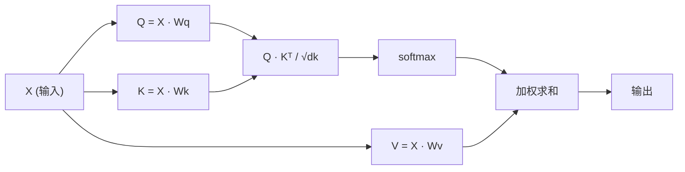

# 从零实现 Self-Attention

> 注意力是一张查找表，每个词都在问"谁对我重要？"——并学会答案。

**类型：** Build
**语言：** Python
**前置要求：** 阶段 3（深度学习核心）、阶段 5 第 10 课（序列到序列）
**预计时间：** ~90 分钟

## 学习目标

- 只用 NumPy 从零实现缩放点积 self-attention，包括 query/key/value 投影和 softmax 加权求和
- 构建一个 multi-head attention 层，拆分多个头、并行计算注意力、再拼接结果
- 追踪注意力矩阵如何捕捉 token 之间的关系，并解释为什么除以 sqrt(d_k) 能防止 softmax 饱和
- 应用因果掩码，把双向注意力转成自回归（解码器风格）注意力

## 问题背景

RNN 一次处理一个 token。等你走到第 50 个 token，来自第 1 个 token 的信息已经被压缩了 50 步。长程依赖被挤进一个固定大小的隐藏状态——这个瓶颈靠再多 LSTM 门控也没法彻底解决。

2014 年的 Bahdanau 注意力论文给出了修法：让解码器回头看每一个编码器位置，决定哪些对当前这一步重要。但它还是焊在 RNN 上的。2017 年的《Attention Is All You Need》问了一个更尖锐的问题：如果注意力是*唯一*的机制呢？没有循环，没有卷积，只有注意力。

self-attention 让序列里的每个位置在一个并行步骤里关注其他每一个位置。这正是 transformer 又快、又能扩展、又称霸的原因。

## 核心概念

### 数据库查找的类比

把注意力想成一次软性的数据库查找：

```
传统数据库：
  Query: "capital of France"  -->  精确匹配  -->  "Paris"

注意力：
  Query: "capital of France"  -->  和所有 key 算相似度  -->  对所有 value 加权混合
```

每个 token 生成三个向量：
- **Query (Q)**："我在找什么？"
- **Key (K)**："我包含什么？"
- **Value (V)**："如果被选中，我提供什么信息？"

query 和所有 key 的点积产生注意力分数。分数高意味着"这个 key 匹配我的 query"。这些分数给 value 加权。输出是 value 的加权和。

### Q、K、V 的计算

每个 token 嵌入都经过三个学到的权重矩阵投影：

```
输入嵌入（n 个 token 的序列，每个 d 维）：

  X = [x1, x2, x3, ..., xn]       shape: (n, d)

三个权重矩阵：

  Wq  shape: (d, dk)
  Wk  shape: (d, dk)
  Wv  shape: (d, dv)

投影：

  Q = X @ Wq    shape: (n, dk)      每个 token 的 query
  K = X @ Wk    shape: (n, dk)      每个 token 的 key
  V = X @ Wv    shape: (n, dv)      每个 token 的 value
```

对单个 token，直观地看：

```
             Wq
  x_i ------[*]------> q_i    "我在找什么？"
       |
       |     Wk
       +----[*]------> k_i    "我包含什么？"
       |
       |     Wv
       +----[*]------> v_i    "我提供什么？"
```

### 注意力矩阵

一旦你有了所有 token 的 Q、K、V，注意力分数就构成一个矩阵：

```
Scores = Q @ K^T    shape: (n, n)

              k1    k2    k3    k4    k5
        +-----+-----+-----+-----+-----+
   q1   | 2.1 | 0.3 | 0.1 | 0.8 | 0.2 |   <- q1 对每个 key 关注多少
        +-----+-----+-----+-----+-----+
   q2   | 0.4 | 1.9 | 0.7 | 0.1 | 0.3 |
        +-----+-----+-----+-----+-----+
   q3   | 0.2 | 0.6 | 2.3 | 0.5 | 0.1 |
        +-----+-----+-----+-----+-----+
   q4   | 0.9 | 0.1 | 0.4 | 1.7 | 0.6 |
        +-----+-----+-----+-----+-----+
   q5   | 0.1 | 0.3 | 0.2 | 0.5 | 2.0 |
        +-----+-----+-----+-----+-----+

每一行：一个 token 对整个序列的注意力
```

看着一个 query 逐个扫过所有 key：每一行给每个 token 打分，softmax 把分数变成权重，context 向量就是 value 的加权融合。

```figure
attention-matrix
```

### 为什么要缩放？

点积随维度 dk 增大。如果 dk = 64，点积可能落在几十的量级，把 softmax 推进梯度消失的区域。修法是：除以 sqrt(dk)。

```
Scaled scores = (Q @ K^T) / sqrt(dk)
```

这让数值保持在 softmax 能产生有用梯度的范围里。

### Softmax 把分数变成权重

softmax 把原始分数转成每一行上的一个概率分布：

```
q1 的原始分数：   [2.1, 0.3, 0.1, 0.8, 0.2]
                            |
                         softmax
                            |
注意力权重：      [0.52, 0.09, 0.07, 0.14, 0.08]   (和约等于 1.0)
```

现在每个 token 都有一组权重，说明它该对其他每个 token 关注多少。

### value 的加权和

每个 token 的最终输出是所有 value 向量的加权和：

```
output_i = sum( attention_weight[i][j] * v_j  for all j )

对 token 1：
  output_1 = 0.52 * v1 + 0.09 * v2 + 0.07 * v3 + 0.14 * v4 + 0.08 * v5
```

### 完整流水线



一行公式：

```
Attention(Q, K, V) = softmax( Q @ K^T / sqrt(dk) ) @ V
```

## 动手构建

### 第 1 步：从零写 softmax

softmax 把原始 logits 转成概率。减去最大值是为了数值稳定。

```python
import numpy as np

def softmax(x):
    shifted = x - np.max(x, axis=-1, keepdims=True)
    exp_x = np.exp(shifted)
    return exp_x / np.sum(exp_x, axis=-1, keepdims=True)

logits = np.array([2.0, 1.0, 0.1])
print(f"logits:  {logits}")
print(f"softmax: {softmax(logits)}")
print(f"sum:     {softmax(logits).sum():.4f}")
```

### 第 2 步：缩放点积注意力

核心函数。接收 Q、K、V 矩阵，返回注意力输出加权重矩阵。

```python
def scaled_dot_product_attention(Q, K, V):
    dk = Q.shape[-1]
    scores = Q @ K.T / np.sqrt(dk)
    weights = softmax(scores)
    output = weights @ V
    return output, weights
```

### 第 3 步：带可学习投影的 self-attention 类

一个完整的 self-attention 模块，Wq、Wk、Wv 权重矩阵用类似 Xavier 的缩放初始化。

```python
class SelfAttention:
    def __init__(self, d_model, dk, dv, seed=42):
        rng = np.random.default_rng(seed)
        scale = np.sqrt(2.0 / (d_model + dk))
        self.Wq = rng.normal(0, scale, (d_model, dk))
        self.Wk = rng.normal(0, scale, (d_model, dk))
        scale_v = np.sqrt(2.0 / (d_model + dv))
        self.Wv = rng.normal(0, scale_v, (d_model, dv))
        self.dk = dk

    def forward(self, X):
        Q = X @ self.Wq
        K = X @ self.Wk
        V = X @ self.Wv
        output, weights = scaled_dot_product_attention(Q, K, V)
        return output, weights
```

### 第 4 步：在一个句子上跑起来

为一个句子造假的嵌入，观察注意力权重。

```python
sentence = ["The", "cat", "sat", "on", "the", "mat"]
n_tokens = len(sentence)
d_model = 8
dk = 4
dv = 4

rng = np.random.default_rng(42)
X = rng.normal(0, 1, (n_tokens, d_model))

attn = SelfAttention(d_model, dk, dv, seed=42)
output, weights = attn.forward(X)

print("Attention weights (each row: where that token looks):\n")
print(f"{'':>6}", end="")
for token in sentence:
    print(f"{token:>6}", end="")
print()

for i, token in enumerate(sentence):
    print(f"{token:>6}", end="")
    for j in range(n_tokens):
        w = weights[i][j]
        print(f"{w:6.3f}", end="")
    print()
```

### 第 5 步：用 ASCII 热力图把注意力可视化

把注意力权重映射成字符，快速看个直观效果。

```python
def ascii_heatmap(weights, tokens, chars=" ░▒▓█"):
    n = len(tokens)
    print(f"\n{'':>6}", end="")
    for t in tokens:
        print(f"{t:>6}", end="")
    print()

    for i in range(n):
        print(f"{tokens[i]:>6}", end="")
        for j in range(n):
            level = int(weights[i][j] * (len(chars) - 1) / weights.max())
            level = min(level, len(chars) - 1)
            print(f"{'  ' + chars[level] + '   '}", end="")
        print()

ascii_heatmap(weights, sentence)
```

## 实际使用

PyTorch 的 `nn.MultiheadAttention` 做的正是我们刚搭的东西，外加多头拆分和输出投影：

```python
import torch
import torch.nn as nn

d_model = 8
n_heads = 2
seq_len = 6

mha = nn.MultiheadAttention(embed_dim=d_model, num_heads=n_heads, batch_first=True)

X_torch = torch.randn(1, seq_len, d_model)

output, attn_weights = mha(X_torch, X_torch, X_torch)

print(f"Input shape:            {X_torch.shape}")
print(f"Output shape:           {output.shape}")
print(f"Attention weight shape: {attn_weights.shape}")
print(f"\nAttn weights (averaged over heads):")
print(attn_weights[0].detach().numpy().round(3))
```

关键区别：multi-head attention 并行跑多个注意力函数，每个有自己的、大小为 dk = d_model / n_heads 的 Q、K、V 投影，然后拼接结果。这让模型能同时关注不同类型的关系。

## 拿去用

这节课产出：
- `outputs/prompt-attention-explainer.md` —— 一个通过数据库查找类比来讲解注意力的 prompt

## 练习

1. 修改 `scaled_dot_product_attention`，让它接受一个可选的掩码矩阵，在 softmax 之前把某些位置置为负无穷（这就是因果/解码器掩码的工作方式）
2. 从零实现 multi-head attention：把 Q、K、V 切成 `n_heads` 块，在每块上跑注意力，拼接，再经过一个最终权重矩阵 Wo 投影
3. 取两个长度相同但不同的句子，喂进同一个 SelfAttention 实例，对比它们的注意力模式。什么变了？什么没变？

## 关键术语

| 术语 | 大家嘴上怎么说 | 实际是什么意思 |
|------|----------------|----------------------|
| Query (Q) | "提问向量" | 输入的一个可学习投影，表示这个 token 在找什么信息 |
| Key (K) | "标签向量" | 一个可学习投影，表示这个 token 包含什么信息，用来和 query 匹配 |
| Value (V) | "内容向量" | 一个可学习投影，携带真正的信息，根据注意力分数被聚合 |
| 缩放点积注意力 | "注意力公式" | softmax(QK^T / sqrt(dk)) @ V —— 缩放防止高维下 softmax 饱和 |
| Self-attention | "token 看自己也看别人" | Q、K、V 都来自同一序列的注意力，让每个位置都能关注其他每个位置 |
| 注意力权重 | "关注多少" | 位置上的一个概率分布，由对缩放点积做 softmax 得到 |
| Multi-head attention | "并行注意力" | 用不同投影跑多个注意力函数，再拼接结果，得到更丰富的表示 |

## 延伸阅读

- [Attention Is All You Need (Vaswani et al., 2017)](https://arxiv.org/abs/1706.03762) —— 最初的 transformer 论文
- [The Illustrated Transformer (Jay Alammar)](https://jalammar.github.io/illustrated-transformer/) —— 对整个架构最好的图解
- [The Annotated Transformer (Harvard NLP)](https://nlp.seas.harvard.edu/annotated-transformer/) —— 逐行 PyTorch 实现并附讲解
