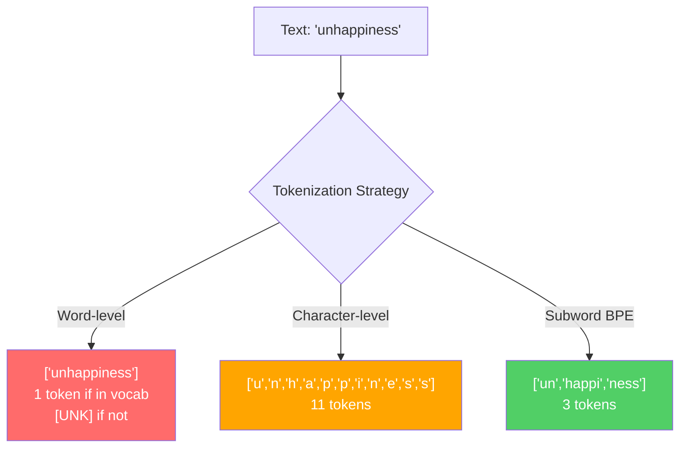
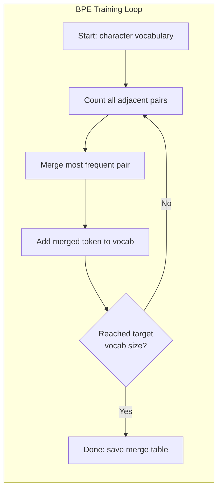
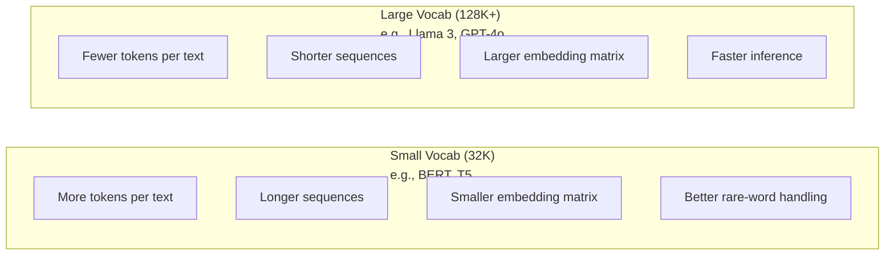

# Tokenizer：BPE、WordPiece、SentencePiece

> 你的 LLM 不读英文，它读整数。tokenizer 决定这些整数是承载意义，还是白白浪费。

**类型：** Build
**语言：** Python
**前置要求：** 阶段 05（NLP 基础）
**预计时间：** ~90 分钟

## 学习目标

- 从零实现 BPE、WordPiece 和 Unigram 三种分词算法，对比它们的合并策略
- 解释词表大小如何影响模型效率：太小会产生过长的序列，太大会浪费 embedding 参数
- 分析跨语言和代码场景下的分词产物，找出特定 tokenizer 失效的地方
- 用 tiktoken 和 sentencepiece 库对文本分词，检查得到的 token ID

## 问题所在

你的 LLM 不读英文。它不读任何一种语言。它读的是数字。

从 "Hello, world!" 到 [15496, 11, 995, 0] 之间的那道鸿沟，就是 tokenizer。每个词、每个空格、每个标点，在模型能处理它之前，都必须先转成一个整数。这个转换不是中立的。它把一些假设烙进模型里，事后再也无法抹除。

弄错了，你的模型就会把容量浪费在用多个 token 编码常见词上。"unfortunately" 变成四个 token 而不是一个。你那 128K 的 context window，碰上多音节词密集的文本，瞬间缩水 75%。弄对了，同样的 context window 能装下两倍的意义。"这个模型代码处理得很好" 和 "这个模型一碰 Python 就卡壳" 之间的差别，往往就取决于 tokenizer 是怎么训练出来的。

你对 GPT-4 或 Claude 发的每一次 API 调用，都是按 token 计价。你的模型生成的每个 token 都要消耗算力。表示一段输出所需的 token 越少，端到端推理就越快。分词不是预处理，它是架构。

## 核心概念

### 三种失败的方案（和一种胜出的方案）

把文本转成数字有三种显而易见的做法。其中两种在规模上行不通。

**词级（word-level）分词**按空格和标点切分。"The cat sat" 变成 ["The", "cat", "sat"]。简单。但 "tokenization" 怎么办？"GPT-4o" 呢？德语复合词 "Geschwindigkeitsbegrenzung" 呢？词级分词需要一个巨大的词表来覆盖每种语言里的每个词。漏掉一个词，你就会得到那个让人头疼的 `[UNK]` token——模型在说 "我完全不知道这是啥"。光英语就有超过一百万种词形。再加上代码、URL、科学计数法和上百种其他语言，你需要一个无限大的词表。

**字符级（character-level）分词**走向另一个极端。"hello" 变成 ["h", "e", "l", "l", "o"]。词表极小（几百个字符）。永远不会有未知 token。但序列变得极长。一句 10 个词级 token 的话，会变成 50 个字符级 token。模型必须学会 "t"、"h"、"e" 放一起意味着 "the"——把注意力容量烧在一个人类三岁就会的事情上。

**子词（subword）分词**找到了甜点区。常见词保持完整："the" 是一个 token。罕见词拆成有意义的片段："unhappiness" 变成 ["un", "happi", "ness"]。词表大小可控（30K 到 128K 个 token）。序列保持简短。未知 token 基本消失，因为任何词都能由子词片段拼出来。

每个现代 LLM 都用子词分词。GPT-2、GPT-4、BERT、Llama 3、Claude——全都是。问题只是用哪个算法。



### BPE：字节对编码（Byte Pair Encoding）

BPE 是一个被改用于分词的贪心压缩算法。这个想法简单到能写在一张卡片上。

从单个字符开始。统计训练语料里每一对相邻字符。把出现最频繁的那一对合并成一个新 token。重复，直到达到你的目标词表大小。

下面是 BPE 在一个只有 "lower"、"lowest"、"newest" 三个词的小语料上运行的过程：

```
Corpus (with word frequencies):
  "lower"  x5
  "lowest" x2
  "newest" x6

Step 0 -- Start with characters:
  l o w e r       (x5)
  l o w e s t     (x2)
  n e w e s t     (x6)

Step 1 -- Count adjacent pairs:
  (e,s): 8    (s,t): 8    (l,o): 7    (o,w): 7
  (w,e): 13   (e,r): 5    (n,e): 6    ...

Step 2 -- Merge most frequent pair (w,e) -> "we":
  l o we r        (x5)
  l o we s t      (x2)
  n e we s t      (x6)

Step 3 -- Recount and merge (e,s) -> "es":
  l o we r        (x5)
  l o we s t      (x2)    <- 'es' only forms from 'e'+'s', not 'we'+'s'
  n e we s t      (x6)    <- wait, the 'e' before 'we' and 's' after 'we'

Actually tracking this precisely:
  After "we" merge, remaining pairs:
  (l,o): 7   (o,we): 7   (we,r): 5   (we,s): 8
  (s,t): 8   (n,e): 6    (e,we): 6

Step 3 -- Merge (we,s) -> "wes" or (s,t) -> "st" (tied at 8, pick first):
  Merge (we,s) -> "wes":
  l o we r        (x5)
  l o wes t       (x2)
  n e wes t       (x6)

Step 4 -- Merge (wes,t) -> "west":
  l o we r        (x5)
  l o west        (x2)
  n e west        (x6)

...continue until target vocab size reached.
```

合并表就是 tokenizer。要编码新文本，按学到的顺序应用这些合并。训练语料决定了存在哪些合并，而这个选择会永久地塑造模型看到的东西。



### 字节级 BPE（GPT-2、GPT-3、GPT-4）

标准 BPE 在 Unicode 字符上工作。字节级 BPE 在原始字节（0-255）上工作。这给你一个恰好 256 大小的基础词表，能处理任何语言或编码，并且永远不会产生未知 token。

GPT-2 引入了这个做法。基础词表覆盖每一个可能的字节。BPE 合并在它之上构建。OpenAI 的 tiktoken 库实现了字节级 BPE，词表大小如下：

- GPT-2：50,257 个 token
- GPT-3.5/GPT-4：~100,256 个 token（cl100k_base 编码）
- GPT-4o：200,019 个 token（o200k_base 编码）

### WordPiece（BERT）

WordPiece 看起来和 BPE 很像，但选合并的方式不同。它不看原始频率，而是最大化训练数据的似然：

```
BPE merge criterion:      count(A, B)
WordPiece merge criterion: count(AB) / (count(A) * count(B))
```

BPE 问的是："哪一对出现得最频繁？" WordPiece 问的是："哪一对一起出现的频率，超过了随机情况下你预期的频率？" 这个微妙的差别会产生不同的词表。WordPiece 偏好那些共现意外（而不只是频繁）的合并。

WordPiece 还用 "##" 前缀标记延续子词：

```
"unhappiness" -> ["un", "##happi", "##ness"]
"embedding"   -> ["em", "##bed", "##ding"]
```

"##" 前缀告诉你这个片段延续了前一个 token。BERT 用 WordPiece，词表为 30,522 个 token。每个 BERT 变体——DistilBERT、RoBERTa 的 tokenizer 其实是 BPE，但 BERT 本身用的是 WordPiece。

### SentencePiece（Llama、T5）

SentencePiece 把输入当成一个原始的 Unicode 字符流，连空白也算进去。没有预分词步骤。没有针对词边界的语言特定规则。这让它真正做到语言无关——它在中文、日文、泰文以及其他不靠空格分词的语言上都能用。

SentencePiece 支持两种算法：
- **BPE 模式**：和标准 BPE 一样的合并逻辑，应用在原始字符序列上
- **Unigram 模式**：从一个大词表开始，迭代地删掉对整体似然影响最小的 token。BPE 的反向操作——剪枝而不是合并。

Llama 2 用 SentencePiece BPE，词表 32,000 个 token。T5 用 SentencePiece Unigram，词表 32,000 个 token。注意：Llama 3 换成了基于 tiktoken 的字节级 BPE tokenizer，词表 128,256 个 token。

### 词表大小的权衡

这是一个有可测量后果的真实工程决策。



来点具体数字。对于一个 128K 词表、4,096 维 embedding 的模型，光是 embedding 矩阵就是 128,000 x 4,096 = 5.24 亿个参数。对于 32K 词表，则是 1.31 亿个参数。这意味着仅 tokenizer 选择一项就带来 4 亿参数的差距。

但更大的词表能更激进地压缩文本。同一段英文，用 32K 词表要 100 个 token，用 128K 词表可能只要 70 个。这意味着生成时前向传播次数少了 30%。对一个服务数百万请求的模型来说，这是算力成本的直接削减。

趋势很清楚：词表大小在增长。GPT-2 用了 50,257。GPT-4 用 ~100K。Llama 3 用 128K。GPT-4o 用 200K。

| 模型 | 词表大小 | tokenizer 类型 | 每个英文词平均 token 数 |
|-------|-----------|----------------|---------------------------|
| BERT | 30,522 | WordPiece | ~1.4 |
| GPT-2 | 50,257 | 字节级 BPE | ~1.3 |
| Llama 2 | 32,000 | SentencePiece BPE | ~1.4 |
| GPT-4 | ~100,256 | 字节级 BPE | ~1.2 |
| Llama 3 | 128,256 | 字节级 BPE（tiktoken） | ~1.1 |
| GPT-4o | 200,019 | 字节级 BPE | ~1.0 |

### 多语言税

主要在英语上训练的 tokenizer，对待其他语言相当残忍。韩语文本在 GPT-2 的 tokenizer 里平均每个词要 2-3 个 token。中文可能更糟。这意味着一个韩语用户实际拥有的 context window，只有英语用户的一半大小——花同样的钱，换到的信息密度却更低。

这就是为什么 Llama 3 把词表从 32K 翻了四倍到 128K。给非英语文字分配更多 token，意味着跨语言的压缩更公平。

## 动手构建

### 第 1 步：字符级 tokenizer

从地基开始。一个字符级 tokenizer 把每个字符映射到它的 Unicode 码点。无需训练。没有未知 token。就是一个直接的映射。

```python
class CharTokenizer:
    def encode(self, text):
        return [ord(c) for c in text]

    def decode(self, tokens):
        return "".join(chr(t) for t in tokens)
```

"hello" 变成 [104, 101, 108, 108, 111]。每个字符都是它自己的一个 token。这是我们后面要改进的基线。

### 第 2 步：从零实现 BPE tokenizer

真正的实现。我们在原始字节上训练（像 GPT-2 那样），统计字节对，合并最频繁的一对，并按顺序记录每一次合并。合并表就是 tokenizer。

```python
from collections import Counter

class BPETokenizer:
    def __init__(self):
        self.merges = {}
        self.vocab = {}

    def _get_pairs(self, tokens):
        pairs = Counter()
        for i in range(len(tokens) - 1):
            pairs[(tokens[i], tokens[i + 1])] += 1
        return pairs

    def _merge_pair(self, tokens, pair, new_token):
        merged = []
        i = 0
        while i < len(tokens):
            if i < len(tokens) - 1 and tokens[i] == pair[0] and tokens[i + 1] == pair[1]:
                merged.append(new_token)
                i += 2
            else:
                merged.append(tokens[i])
                i += 1
        return merged

    def train(self, text, num_merges):
        tokens = list(text.encode("utf-8"))
        self.vocab = {i: bytes([i]) for i in range(256)}

        for i in range(num_merges):
            pairs = self._get_pairs(tokens)
            if not pairs:
                break
            best_pair = max(pairs, key=pairs.get)
            new_token = 256 + i
            tokens = self._merge_pair(tokens, best_pair, new_token)
            self.merges[best_pair] = new_token
            self.vocab[new_token] = self.vocab[best_pair[0]] + self.vocab[best_pair[1]]

        return self

    def encode(self, text):
        tokens = list(text.encode("utf-8"))
        for pair, new_token in self.merges.items():
            tokens = self._merge_pair(tokens, pair, new_token)
        return tokens

    def decode(self, tokens):
        byte_sequence = b"".join(self.vocab[t] for t in tokens)
        return byte_sequence.decode("utf-8", errors="replace")
```

训练循环是 BPE 的核心：统计字节对，合并赢家，重复。每次合并都减少 token 总数。经过 `num_merges` 轮后，词表从 256（基础字节）增长到 256 + num_merges。

编码时严格按学到的顺序应用合并。这很关键。如果合并 1 造出了 "th"、合并 5 造出了 "the"，那么编码必须先应用合并 1，这样 "the" 才能在合并 5 里由 "th" + "e" 拼出来。

解码是逆操作：在词表里查每个 token ID，拼接字节，再解码成 UTF-8。

### 第 3 步：编码-解码往返

```python
corpus = (
    "The cat sat on the mat. The cat ate the rat. "
    "The dog sat on the log. The dog ate the frog. "
    "Natural language processing is the study of how computers "
    "understand and generate human language. "
    "Tokenization is the first step in any NLP pipeline."
)

tokenizer = BPETokenizer()
tokenizer.train(corpus, num_merges=40)

test_sentences = [
    "The cat sat on the mat.",
    "Natural language processing",
    "tokenization pipeline",
    "unhappiness",
]

for sentence in test_sentences:
    encoded = tokenizer.encode(sentence)
    decoded = tokenizer.decode(encoded)
    raw_bytes = len(sentence.encode("utf-8"))
    ratio = len(encoded) / raw_bytes
    print(f"'{sentence}'")
    print(f"  Tokens: {len(encoded)} (from {raw_bytes} bytes) -- ratio: {ratio:.2f}")
    print(f"  Roundtrip: {'PASS' if decoded == sentence else 'FAIL'}")
```

压缩比告诉你 tokenizer 有多有效。0.50 的比值意味着 tokenizer 把文本压到了原始字节数一半的 token。越低越好。在训练语料上，比值会不错。在分布外文本上，比如 "unhappiness"（它没出现在语料里），比值会更差——tokenizer 对没见过的模式只能退回字符级编码。

### 第 4 步：和 tiktoken 对比

```python
import tiktoken

enc = tiktoken.get_encoding("cl100k_base")

texts = [
    "The cat sat on the mat.",
    "unhappiness",
    "Hello, world!",
    "def fibonacci(n): return n if n < 2 else fibonacci(n-1) + fibonacci(n-2)",
    "Geschwindigkeitsbegrenzung",
]

for text in texts:
    our_tokens = tokenizer.encode(text)
    tiktoken_tokens = enc.encode(text)
    tiktoken_pieces = [enc.decode([t]) for t in tiktoken_tokens]
    print(f"'{text}'")
    print(f"  Our BPE:   {len(our_tokens)} tokens")
    print(f"  tiktoken:  {len(tiktoken_tokens)} tokens -> {tiktoken_pieces}")
```

tiktoken 用的是完全相同的算法，但在几百 GB 的文本上训练，做了 100,000 次合并。算法是一模一样的。差别在于训练数据和合并次数。你在一段话上、用 40 次合并训出的 tokenizer，竞争不过 tiktoken 在海量语料上的 100K 次合并。但机制是相同的。

### 第 5 步：词表分析

```python
def analyze_vocabulary(tokenizer, test_texts):
    total_tokens = 0
    total_chars = 0
    token_usage = Counter()

    for text in test_texts:
        encoded = tokenizer.encode(text)
        total_tokens += len(encoded)
        total_chars += len(text)
        for t in encoded:
            token_usage[t] += 1

    print(f"Vocabulary size: {len(tokenizer.vocab)}")
    print(f"Total tokens across all texts: {total_tokens}")
    print(f"Total characters: {total_chars}")
    print(f"Avg tokens per character: {total_tokens / total_chars:.2f}")

    print(f"\nMost used tokens:")
    for token_id, count in token_usage.most_common(10):
        token_bytes = tokenizer.vocab[token_id]
        display = token_bytes.decode("utf-8", errors="replace")
        print(f"  Token {token_id:4d}: '{display}' (used {count} times)")

    unused = [t for t in tokenizer.vocab if t not in token_usage]
    print(f"\nUnused tokens: {len(unused)} out of {len(tokenizer.vocab)}")
```

这揭示了你词表里的 Zipf 分布。少数几个 token 占据主导（空格、"the"、"e"）。大多数 token 很少被用到。生产级 tokenizer 针对这种分布做优化——常见模式拿到短的 token ID，罕见模式用更长的表示。

## 上手使用

你从零写的 BPE 跑通了。现在看看生产工具长什么样。

### tiktoken（OpenAI）

```python
import tiktoken

enc = tiktoken.get_encoding("cl100k_base")

text = "Tokenizers convert text to integers"
tokens = enc.encode(text)
print(f"Tokens: {tokens}")
print(f"Pieces: {[enc.decode([t]) for t in tokens]}")
print(f"Roundtrip: {enc.decode(tokens)}")
```

tiktoken 用 Rust 写成，带 Python 绑定。它每秒能编码数百万个 token。同样的 BPE 算法，工业级的实现。

### Hugging Face tokenizers

```python
from tokenizers import Tokenizer
from tokenizers.models import BPE
from tokenizers.trainers import BpeTrainer
from tokenizers.pre_tokenizers import ByteLevel

tokenizer = Tokenizer(BPE())
tokenizer.pre_tokenizer = ByteLevel()

trainer = BpeTrainer(vocab_size=1000, special_tokens=["<pad>", "<eos>", "<unk>"])
tokenizer.train(["corpus.txt"], trainer)

output = tokenizer.encode("The cat sat on the mat.")
print(f"Tokens: {output.tokens}")
print(f"IDs: {output.ids}")
```

Hugging Face tokenizers 库底层同样是 Rust。它能在几秒内对 GB 级语料训练 BPE。当你训练自己的模型时，用的就是它。

### 加载 Llama 的 tokenizer

```python
from transformers import AutoTokenizer

tokenizer = AutoTokenizer.from_pretrained("meta-llama/Llama-3.1-8B")

text = "Tokenizers are the unsung heroes of LLMs"
tokens = tokenizer.encode(text)
print(f"Token IDs: {tokens}")
print(f"Tokens: {tokenizer.convert_ids_to_tokens(tokens)}")
print(f"Vocab size: {tokenizer.vocab_size}")

multilingual = ["Hello world", "Hola mundo", "Bonjour le monde"]
for text in multilingual:
    ids = tokenizer.encode(text)
    print(f"'{text}' -> {len(ids)} tokens")
```

Llama 3 的 128K 词表对非英语文本的压缩，明显好过 GPT-2 的 50K 词表。你可以自己验证——用多种语言编码同一句话，数一数 token 数。

## 交付

本节课产出 `outputs/prompt-tokenizer-analyzer.md`——一个可复用的 prompt，能为任意文本和模型组合分析分词效率。喂给它一段文本样本，它会告诉你哪个模型的 tokenizer 处理得最好。

## 练习

1. 改造 BPE tokenizer，让它在每一步合并时打印词表。看着 "t" + "h" 变成 "th"，然后 "th" + "e" 变成 "the"。追踪常见英文词是怎么一块块拼起来的。

2. 给 BPE tokenizer 加上特殊 token（`<pad>`、`<eos>`、`<unk>`）。把它们分配为 ID 0、1、2，并把其他所有 token 相应顺延。实现一个预分词步骤，在跑 BPE 之前先按空白切分。

3. 实现 WordPiece 的合并准则（用似然比而不是频率）。在同一份语料上、用相同的合并次数训练 BPE 和 WordPiece。对比得到的词表——哪个产出的子词在语言学上更有意义？

4. 搭一个多语言 tokenizer 效率基准。取英语、西班牙语、中文、韩语、阿拉伯语各 10 个句子。用 tiktoken（cl100k_base）分别分词，测量每个字符的平均 token 数。量化每种语言的 "多语言税"。

5. 在更大的语料上训练你的 BPE tokenizer（下载一篇维基百科文章）。调整合并次数，让压缩比在同一段文本上落到 tiktoken 的 10% 以内。这逼你理解语料大小、合并次数和压缩质量之间的关系。

## 关键术语

| 术语 | 人们怎么说 | 它实际是什么 |
|------|----------------|----------------------|
| Token | "一个词" | 模型词表里的一个单位——可以是一个字符、子词、词，或多词组块 |
| BPE | "某种压缩玩意" | 字节对编码——迭代地合并最频繁的相邻 token 对，直到达到目标词表大小 |
| WordPiece | "BERT 的 tokenizer" | 类似 BPE，但合并最大化似然比 count(AB)/(count(A)*count(B))，而不是原始频率 |
| SentencePiece | "一个 tokenizer 库" | 一个语言无关的 tokenizer，直接在原始 Unicode 上工作、不做预分词，支持 BPE 和 Unigram 算法 |
| 词表大小 | "它认识多少个词" | 唯一 token 的总数：GPT-2 有 50,257，BERT 有 30,522，Llama 3 有 128,256 |
| Fertility（产出率） | "不是 tokenizer 术语" | 每个词的平均 token 数——衡量 tokenizer 跨语言的效率（1.0 是完美，3.0 意味着模型要多干三倍的活） |
| 字节级 BPE | "GPT 的 tokenizer" | BPE 在原始字节（0-255）而非 Unicode 字符上工作，保证对任何输入都不产生未知 token |
| 合并表 | "那个 tokenizer 文件" | 训练时学到的字节对合并的有序列表——它就是 tokenizer 本体，而且顺序很重要 |
| 预分词 | "按空格切" | 在子词分词之前应用的规则：按空白切分、数字分离、标点处理 |
| 压缩比 | "tokenizer 有多高效" | 产出的 token 数除以输入字节数——越低意味着压缩越好、推理越快 |

## 延伸阅读

- [Sennrich et al., 2016 -- "Neural Machine Translation of Rare Words with Subword Units"](https://arxiv.org/abs/1508.07909) -- 把 BPE 引入 NLP 的论文，把一个 1994 年的压缩算法变成了现代分词的基石
- [Kudo & Richardson, 2018 -- "SentencePiece: A simple and language independent subword tokenizer"](https://arxiv.org/abs/1808.06226) -- 语言无关的分词，让多语言模型变得实际可用
- [OpenAI tiktoken repository](https://github.com/openai/tiktoken) -- 用 Rust 实现、带 Python 绑定的生产级 BPE，被 GPT-3.5/4/4o 使用
- [Hugging Face Tokenizers documentation](https://huggingface.co/docs/tokenizers) -- 拥有 Rust 性能的生产级 tokenizer 训练
