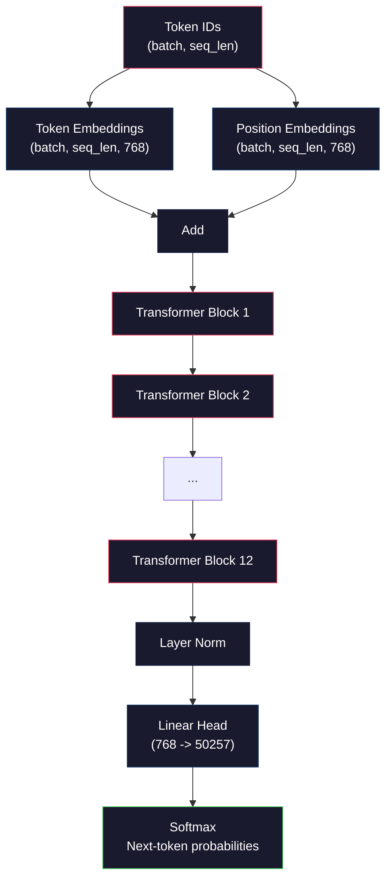
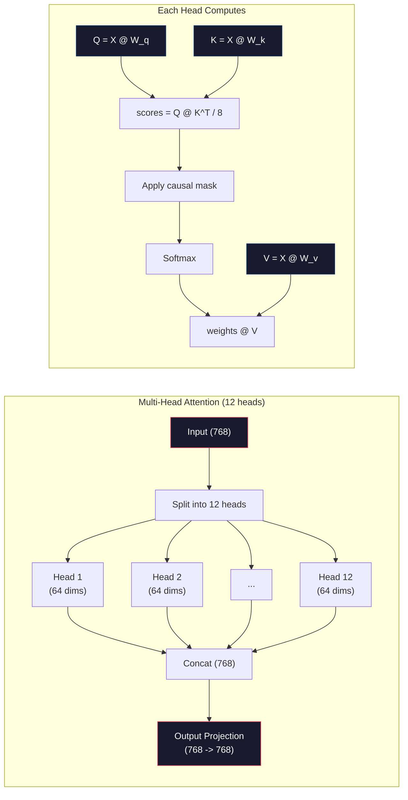
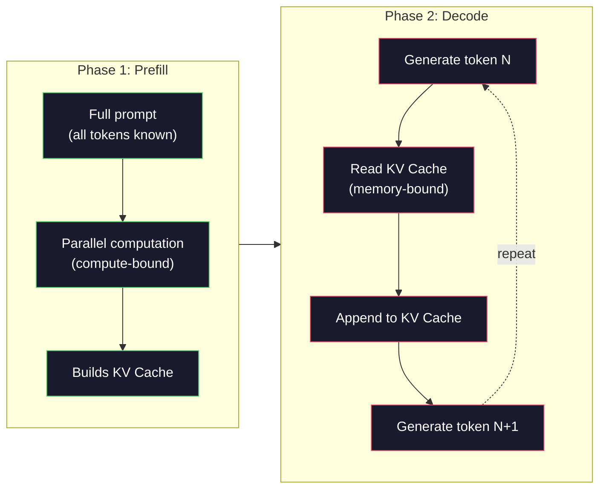

# 预训练一个 Mini GPT（1.24 亿参数）

> GPT-2 Small 有 1.24 亿参数。也就是 12 个 transformer 层、12 个注意力头、768 维 embedding。你能在单卡 GPU 上从零训练它，几小时搞定。大多数人从不这么做。他们用预训练好的 checkpoint。但如果你不自己训一个，你其实并不理解你正在用它做产品的那个模型里头到底发生了什么。

**类型：** Build
**语言：** Python（配合 numpy）
**前置要求：** 阶段 10，第 01-03 课（Tokenizer、从零构建一个 tokenizer、数据流水线）
**预计时间：** ~120 分钟

## 学习目标

- 从零实现完整的 GPT-2 架构（1.24 亿参数）：token embedding、位置 embedding、transformer 块和语言模型头
- 用下一个 token 预测加交叉熵损失，在文本语料上训练一个 GPT 模型
- 实现自回归文本生成，带温度采样和 top-k/top-p 过滤
- 监控训练损失曲线，验证模型学到了连贯的语言模式

## 问题所在

你知道 transformer 是什么。你看过那些图。你能背出 "attention is all you need"，能在白板上画出标着 "Multi-Head Attention" 的方框。

这些都不意味着你理解模型生成文本时发生了什么。

GPT-2 Small 里有 124,438,272 个参数（带权重共享）。它们每一个都是靠跑一个训练循环设定的：前向传播、计算损失、反向传播、更新权重。12 个 transformer 块。每块 12 个注意力头。一个 768 维的 embedding 空间。一个 50,257 个 token 的词表。每次模型生成一个 token，全部 1.24 亿参数都参与到一条矩阵乘法链里，这条链接收一串 token ID，产出下一个 token 上的概率分布。

如果你从没自己搭过这东西，你就是在和一个黑盒打交道。你能用 API。你能微调。但当出问题时——当模型产生幻觉、当它重复自己、当它拒绝跟随指令——你对 *为什么* 没有任何心智模型。

本节课从零搭建 GPT-2 Small。不用 PyTorch。用 numpy。每一次矩阵乘法都可见。每一个梯度都由你的代码计算。你会确切看到 1.24 亿个数字是怎么合谋预测下一个词的。

## 核心概念

### GPT 架构

GPT 是一个自回归语言模型。"自回归" 意思是它一次生成一个 token，每个都以之前所有 token 为条件。架构是一摞 transformer 解码器块。

下面是从 token ID 到下一个 token 概率的完整计算图：

1. token ID 进来。形状：(batch_size, seq_len)。
2. token embedding 查表。每个 ID 映射到一个 768 维向量。形状：(batch_size, seq_len, 768)。
3. 位置 embedding 查表。每个位置（0, 1, 2, ...）映射到一个 768 维向量。形状相同。
4. 把 token embedding + 位置 embedding 相加。
5. 通过 12 个 transformer 块。
6. 最终的 layer normalization。
7. 线性投影到词表大小。形状：(batch_size, seq_len, vocab_size)。
8. softmax 得到概率。

这就是整个模型。没有卷积。没有循环。只有 embedding、注意力、前馈网络和 layer norm 堆叠 12 次。



### transformer 块

12 个块每一个都遵循同样的模式。pre-norm 架构（GPT-2 用 pre-norm，而不是像原始 transformer 那样用 post-norm）：

1. LayerNorm
2. 多头自注意力
3. 残差连接（把输入加回来）
4. LayerNorm
5. 前馈网络（MLP）
6. 残差连接（把输入加回来）

残差连接至关重要。没有它们，反向传播时梯度传到第 1 块就消失了。有了它们，梯度能通过 "跳跃" 路径从损失直接流到任意层。这就是为什么你能堆 12、32 甚至 96 个块（传闻 GPT-4 用了 120 个）。

### 注意力：核心机制

自注意力让每个 token 都能看到之前的每个 token，并决定对每个分配多少注意力。下面是数学。

对每个 token 位置，从输入计算三个向量：
- **Query (Q)**："我在找什么？"
- **Key (K)**："我包含什么？"
- **Value (V)**："我携带什么信息？"

```
Q = input @ W_q    (768 -> 768)
K = input @ W_k    (768 -> 768)
V = input @ W_v    (768 -> 768)

attention_scores = Q @ K^T / sqrt(d_k)
attention_scores = mask(attention_scores)   # causal mask: -inf for future positions
attention_weights = softmax(attention_scores)
output = attention_weights @ V
```

因果 mask 正是让 GPT 自回归的东西。位置 5 能注意到位置 0-5，但不能注意 6、7、8 等等。这防止模型在训练时通过偷看未来 token 来 "作弊"。

**多头注意力**把 768 维空间切成 12 个头，每个 64 维。每个头学一种不同的注意力模式。一个头可能追踪句法关系（主谓一致）。另一个可能追踪语义相似性（同义词）。再一个可能追踪位置邻近性（相邻词）。全部 12 个头的输出被拼接，再投影回 768 维。



除以 sqrt(d_k)——sqrt(64) = 8——是缩放。没有它，高维向量的点积会变得很大，把 softmax 推到梯度近乎为零的区域。这是最初 "Attention Is All You Need" 论文里的关键洞见之一。

### KV Cache：推理为什么快

训练时，你一次处理整条序列。推理时，你一次生成一个 token。不做优化的话，生成第 N 个 token 需要为之前所有 N-1 个 token 重新计算注意力。那是每生成一个 token O(N^2)，或者对长度为 N 的序列总共 O(N^3)。

KV Cache 解决了这个问题。给每个 token 算完 K 和 V 后，把它们存起来。生成第 N+1 个 token 时，你只需为新 token 计算 Q，再查出之前所有 token 缓存的 K 和 V。这把 K 和 V 计算的每 token 成本从 O(N) 降到 O(1)。注意力分数计算仍是 O(N)，因为你要注意到之前所有位置，但你避免了对输入的冗余矩阵乘法。

对于 12 层 12 头的 GPT-2，KV cache 每个 token 存 2（K + V）x 12 层 x 12 头 x 64 维 = 18,432 个值。对一条 1024-token 的序列，FP32 下约 75MB。对于 128 层的 Llama 3 405B，单条序列的 KV cache 能超过 10GB。这就是为什么长 context 推理是内存受限的。

### Prefill vs Decode：推理的两个阶段

当你给 LLM 发一个 prompt 时，推理分两个明确的阶段。

**Prefill** 并行处理你的整个 prompt。所有 token 已知，所以模型能同时为所有位置计算注意力。这个阶段是计算受限的——GPU 在满吞吐做矩阵乘法。在 A100 上，一个 1000-token 的 prompt，prefill 大约要 20-50ms。

**Decode** 一次生成一个 token。每个新 token 依赖之前所有 token。这个阶段是内存受限的——瓶颈是从 GPU 内存读取模型权重和 KV cache，而不是矩阵运算本身。GPU 的计算核心大部分时间闲着等内存读取。对 GPT-2 来说，每个 decode 步骤花的时间大致相同，无论矩阵乘法需要多少 FLOPs，因为约束是内存带宽。

这个区别对生产系统很重要。Prefill 吞吐随 GPU 算力扩展（FLOPS 越多 = prefill 越快）。Decode 吞吐随内存带宽扩展（内存越快 = decode 越快）。这就是为什么 NVIDIA 的 H100 相比 A100 着重提升内存带宽——它直接加速 token 生成。



### 训练循环

训练 LLM 就是下一个 token 预测。给定 token [0, 1, 2, ..., N-1]，预测 token [1, 2, 3, ..., N]。损失函数是模型预测的概率分布和真实下一个 token 之间的交叉熵。

一个训练步：

1. **前向传播**：让批次过完 12 个块。得到每个位置的 logits（softmax 之前的分数）。
2. **计算损失**：logits 和目标 token（输入右移一位）之间的交叉熵。
3. **反向传播**：用反向传播为全部 1.24 亿参数计算梯度。
4. **优化器步骤**：更新权重。GPT-2 用 Adam，配学习率 warmup 和余弦衰减。

学习率调度比你想的更重要。GPT-2 在头 2,000 步从 0 warmup 到峰值学习率，然后按余弦曲线衰减。一开始就用高学习率会让模型发散。一直保持高学习率会让后期训练震荡。warmup-then-decay 这套模式被每个主流 LLM 采用。

### GPT-2 Small：数字

| 组件 | 形状 | 参数 |
|-----------|-------|------------|
| Token embedding | (50257, 768) | 38,597,376 |
| 位置 embedding | (1024, 768) | 786,432 |
| 每块注意力（W_q, W_k, W_v, W_out） | 4 x (768, 768) | 2,359,296 |
| 每块 FFN（up + down） | (768, 3072) + (3072, 768) | 4,718,592 |
| 每块 LayerNorm（2 个） | 2 x 768 x 2 | 3,072 |
| 最终 LayerNorm | 768 x 2 | 1,536 |
| **每块合计** | | **7,080,960** |
| **合计（12 块）** | | **85,054,464 + 39,383,808 = 124,438,272** |

输出投影（logits 头）和 token embedding 矩阵共享权重。这叫权重共享（weight tying）——它减少 38M 参数，并提升性能，因为它逼模型对输入和输出使用同一个表示空间。

## 动手构建

### 第 1 步：embedding 层

token embedding 把 50,257 个可能的 token 每一个映射到一个 768 维向量。位置 embedding 添加每个 token 在序列中位置的信息。两者相加。

```python
import numpy as np

class Embedding:
    def __init__(self, vocab_size, embed_dim, max_seq_len):
        self.token_embed = np.random.randn(vocab_size, embed_dim) * 0.02
        self.pos_embed = np.random.randn(max_seq_len, embed_dim) * 0.02

    def forward(self, token_ids):
        seq_len = token_ids.shape[-1]
        tok_emb = self.token_embed[token_ids]
        pos_emb = self.pos_embed[:seq_len]
        return tok_emb + pos_emb
```

初始化用的 0.02 标准差来自 GPT-2 论文。太大，初始前向传播会产出极端值，破坏训练稳定性。太小，初始输出对所有输入几乎一样，让早期梯度信号变得没用。

### 第 2 步：带因果 mask 的自注意力

先做单头注意力。因果 mask 在 softmax 前把未来位置设成负无穷，确保每个位置只能注意到自身和更早的位置。

```python
def attention(Q, K, V, mask=None):
    d_k = Q.shape[-1]
    scores = Q @ K.transpose(0, -1, -2 if Q.ndim == 4 else 1) / np.sqrt(d_k)
    if mask is not None:
        scores = scores + mask
    weights = np.exp(scores - scores.max(axis=-1, keepdims=True))
    weights = weights / weights.sum(axis=-1, keepdims=True)
    return weights @ V
```

softmax 实现在取指数前减去最大值。没有这一步，exp(大数) 会溢出成无穷。这是个数值稳定性技巧，不改变输出，因为对任意常数 c 都有 softmax(x - c) = softmax(x)。

### 第 3 步：多头注意力

把 768 维输入切成 12 个头，每个 64 维。每个头独立计算注意力。拼接结果，再投影回 768 维。

```python
class MultiHeadAttention:
    def __init__(self, embed_dim, num_heads):
        self.num_heads = num_heads
        self.head_dim = embed_dim // num_heads
        self.W_q = np.random.randn(embed_dim, embed_dim) * 0.02
        self.W_k = np.random.randn(embed_dim, embed_dim) * 0.02
        self.W_v = np.random.randn(embed_dim, embed_dim) * 0.02
        self.W_out = np.random.randn(embed_dim, embed_dim) * 0.02

    def forward(self, x, mask=None):
        batch, seq_len, d = x.shape
        Q = (x @ self.W_q).reshape(batch, seq_len, self.num_heads, self.head_dim).transpose(0, 2, 1, 3)
        K = (x @ self.W_k).reshape(batch, seq_len, self.num_heads, self.head_dim).transpose(0, 2, 1, 3)
        V = (x @ self.W_v).reshape(batch, seq_len, self.num_heads, self.head_dim).transpose(0, 2, 1, 3)

        scores = Q @ K.transpose(0, 1, 3, 2) / np.sqrt(self.head_dim)
        if mask is not None:
            scores = scores + mask
        weights = np.exp(scores - scores.max(axis=-1, keepdims=True))
        weights = weights / weights.sum(axis=-1, keepdims=True)
        attn_out = weights @ V

        attn_out = attn_out.transpose(0, 2, 1, 3).reshape(batch, seq_len, d)
        return attn_out @ self.W_out
```

reshape-transpose-reshape 这套动作是多头注意力里最让人迷糊的部分。下面是发生的事：(batch, seq_len, 768) 张量变成 (batch, seq_len, 12, 64)，再变成 (batch, 12, seq_len, 64)。现在 12 个头每个都有自己的 (seq_len, 64) 矩阵来跑注意力。注意力之后，我们把过程反转：(batch, 12, seq_len, 64) 变回 (batch, seq_len, 12, 64)，再变回 (batch, seq_len, 768)。

### 第 4 步：transformer 块

一个完整的 transformer 块：LayerNorm、带残差的多头注意力、LayerNorm、带残差的前馈。

```python
class LayerNorm:
    def __init__(self, dim, eps=1e-5):
        self.gamma = np.ones(dim)
        self.beta = np.zeros(dim)
        self.eps = eps

    def forward(self, x):
        mean = x.mean(axis=-1, keepdims=True)
        var = x.var(axis=-1, keepdims=True)
        return self.gamma * (x - mean) / np.sqrt(var + self.eps) + self.beta


class FeedForward:
    def __init__(self, embed_dim, ff_dim):
        self.W1 = np.random.randn(embed_dim, ff_dim) * 0.02
        self.b1 = np.zeros(ff_dim)
        self.W2 = np.random.randn(ff_dim, embed_dim) * 0.02
        self.b2 = np.zeros(embed_dim)

    def forward(self, x):
        h = x @ self.W1 + self.b1
        h = np.maximum(0, h)  # GELU 近似：为简单起见用 ReLU
        return h @ self.W2 + self.b2


class TransformerBlock:
    def __init__(self, embed_dim, num_heads, ff_dim):
        self.ln1 = LayerNorm(embed_dim)
        self.attn = MultiHeadAttention(embed_dim, num_heads)
        self.ln2 = LayerNorm(embed_dim)
        self.ffn = FeedForward(embed_dim, ff_dim)

    def forward(self, x, mask=None):
        x = x + self.attn.forward(self.ln1.forward(x), mask)
        x = x + self.ffn.forward(self.ln2.forward(x))
        return x
```

前馈网络把 768 维输入扩展到 3,072 维（4 倍），施加一个非线性，再投影回 768。这种扩展-收缩模式给了模型在每个位置上一个 "更宽" 的内部表示来工作。GPT-2 用 GELU 激活，但我们这里为简单起见用 ReLU——对理解架构来说差别不大。

### 第 5 步：完整的 GPT 模型

堆叠 12 个 transformer 块。前面加 embedding 层，后面加输出投影。

```python
class MiniGPT:
    def __init__(self, vocab_size=50257, embed_dim=768, num_heads=12,
                 num_layers=12, max_seq_len=1024, ff_dim=3072):
        self.embedding = Embedding(vocab_size, embed_dim, max_seq_len)
        self.blocks = [
            TransformerBlock(embed_dim, num_heads, ff_dim)
            for _ in range(num_layers)
        ]
        self.ln_f = LayerNorm(embed_dim)
        self.vocab_size = vocab_size
        self.embed_dim = embed_dim

    def forward(self, token_ids):
        seq_len = token_ids.shape[-1]
        mask = np.triu(np.full((seq_len, seq_len), -1e9), k=1)

        x = self.embedding.forward(token_ids)
        for block in self.blocks:
            x = block.forward(x, mask)
        x = self.ln_f.forward(x)

        logits = x @ self.embedding.token_embed.T
        return logits

    def count_parameters(self):
        total = 0
        total += self.embedding.token_embed.size
        total += self.embedding.pos_embed.size
        for block in self.blocks:
            total += block.attn.W_q.size + block.attn.W_k.size
            total += block.attn.W_v.size + block.attn.W_out.size
            total += block.ffn.W1.size + block.ffn.b1.size
            total += block.ffn.W2.size + block.ffn.b2.size
            total += block.ln1.gamma.size + block.ln1.beta.size
            total += block.ln2.gamma.size + block.ln2.beta.size
        total += self.ln_f.gamma.size + self.ln_f.beta.size
        return total
```

注意权重共享：`logits = x @ self.embedding.token_embed.T`。输出投影复用了 token embedding 矩阵（转置）。这不只是省参数的技巧。它意味着模型用同一个向量空间来理解 token（embedding）和预测它们（输出）。

### 第 6 步：训练循环

要在 1.24 亿参数上真正跑一次训练，你需要 GPU 和 PyTorch。这个训练循环在一个能用纯 numpy 跑的小模型上演示这套机制。我们用一个极小的模型（4 层、4 头、128 维）让它可行。

```python
def cross_entropy_loss(logits, targets):
    batch, seq_len, vocab_size = logits.shape
    logits_flat = logits.reshape(-1, vocab_size)
    targets_flat = targets.reshape(-1)

    max_logits = logits_flat.max(axis=-1, keepdims=True)
    log_softmax = logits_flat - max_logits - np.log(
        np.exp(logits_flat - max_logits).sum(axis=-1, keepdims=True)
    )

    loss = -log_softmax[np.arange(len(targets_flat)), targets_flat].mean()
    return loss


def train_mini_gpt(text, vocab_size=256, embed_dim=128, num_heads=4,
                   num_layers=4, seq_len=64, num_steps=200, lr=3e-4):
    tokens = np.array(list(text.encode("utf-8")[:2048]))
    model = MiniGPT(
        vocab_size=vocab_size, embed_dim=embed_dim, num_heads=num_heads,
        num_layers=num_layers, max_seq_len=seq_len, ff_dim=embed_dim * 4
    )

    print(f"Model parameters: {model.count_parameters():,}")
    print(f"Training tokens: {len(tokens):,}")
    print(f"Config: {num_layers} layers, {num_heads} heads, {embed_dim} dims")
    print()

    for step in range(num_steps):
        start_idx = np.random.randint(0, max(1, len(tokens) - seq_len - 1))
        batch_tokens = tokens[start_idx:start_idx + seq_len + 1]

        input_ids = batch_tokens[:-1].reshape(1, -1)
        target_ids = batch_tokens[1:].reshape(1, -1)

        logits = model.forward(input_ids)
        loss = cross_entropy_loss(logits, target_ids)

        if step % 20 == 0:
            print(f"Step {step:4d} | Loss: {loss:.4f}")

    return model
```

损失从接近 ln(vocab_size) 开始——对一个 256-token 的字节级词表，那是 ln(256) = 5.55。随机模型给每个 token 分配相等的概率。随着训练推进，损失下降，因为模型学会预测常见模式："t" 后面的 "th"、句号后的空格，等等。

在生产里，你会用 Adam 优化器配梯度累积、学习率 warmup 和梯度裁剪。前向-损失-反向-更新这个循环是一模一样的。优化器更复杂而已。

### 第 7 步：文本生成

生成用训练好的模型一次预测一个 token。每次预测都从输出分布里采样（或贪心地取 argmax）。

```python
def generate(model, prompt_tokens, max_new_tokens=100, temperature=0.8):
    tokens = list(prompt_tokens)
    seq_len = model.embedding.pos_embed.shape[0]

    for _ in range(max_new_tokens):
        context = np.array(tokens[-seq_len:]).reshape(1, -1)
        logits = model.forward(context)
        next_logits = logits[0, -1, :]

        next_logits = next_logits / temperature
        probs = np.exp(next_logits - next_logits.max())
        probs = probs / probs.sum()

        next_token = np.random.choice(len(probs), p=probs)
        tokens.append(next_token)

    return tokens
```

温度控制随机性。温度 1.0 用原始分布。温度 0.5 把它锐化（更确定——模型更频繁地选它的最优项）。温度 1.5 把它压平（更随机——低概率 token 得到更大机会）。温度 0.0 是贪心解码（总是选概率最高的 token）。

`tokens[-seq_len:]` 这个窗口是必要的，因为模型有最大 context 长度（GPT-2 是 1024）。一旦超过它，你必须丢掉最旧的 token。这就是大家挂在嘴边的 "context window"。

## 上手使用

### 完整的训练和生成演示

```python
corpus = """The transformer architecture has revolutionized natural language processing.
Attention mechanisms allow the model to focus on relevant parts of the input.
Self-attention computes relationships between all pairs of positions in a sequence.
Multi-head attention splits the representation into multiple subspaces.
Each attention head can learn different types of relationships.
The feedforward network provides nonlinear transformations at each position.
Residual connections enable gradient flow through deep networks.
Layer normalization stabilizes training by normalizing activations.
Position embeddings give the model information about token ordering.
The causal mask ensures autoregressive generation during training.
Pre-training on large text corpora teaches the model general language understanding.
Fine-tuning adapts the pre-trained model to specific downstream tasks."""

model = train_mini_gpt(corpus, num_steps=200)

prompt = list("The transformer".encode("utf-8"))
output_tokens = generate(model, prompt, max_new_tokens=100, temperature=0.8)
generated_text = bytes(output_tokens).decode("utf-8", errors="replace")
print(f"\nGenerated: {generated_text}")
```

在小语料、小模型上，生成的文本顶多半连贯。它会从训练文本里学到一些字节级模式，但没法像 GPT-2 那样泛化——人家有 40GB 训练数据和完整的 1.24 亿参数架构。重点不在输出质量。重点是你能追踪每一步：embedding 查表、注意力计算、前馈变换、logit 投影、softmax 和采样。每一个操作都可见。

## 交付

本节课产出 `outputs/prompt-gpt-architecture-analyzer.md`——一个 prompt，能分析任意 GPT 风格模型的架构选择。喂给它一张模型卡或技术报告，它会拆解参数分配、注意力设计和缩放决策。

## 练习

1. 把模型改成用 24 层 16 头，而不是 12/12。数一数参数。把深度翻倍和把宽度（embedding 维度）翻倍相比，效果如何？

2. 实现 GELU 激活函数（GELU(x) = x * 0.5 * (1 + erf(x / sqrt(2)))），替换前馈网络里的 ReLU。两种激活各跑 500 步训练，对比最终损失。

3. 给生成函数加一个 KV cache。在第一次前向传播后为每一层存下 K 和 V 张量，并在后续 token 复用它们。测量加速：用和不用 cache 各生成 200 个 token，对比墙钟时间。

4. 实现 top-k 采样（只考虑概率最高的 k 个 token）和 top-p 采样（核采样：考虑累积概率超过 p 的最小 token 集合）。在温度 0.8 下对比 top-k=50 vs top-p=0.95 的输出质量。

5. 做一个训练损失曲线绘图器。训练模型 1000 步，画出损失 vs 步数。识别三个阶段：快速的初始下降（学常见字节）、较慢的中段（学字节模式）、平台期（在小语料上过拟合）。这条曲线的形状，不管你训的是 128 维模型还是 GPT-4，都一样。

## 关键术语

| 术语 | 人们怎么说 | 它实际是什么 |
|------|----------------|----------------------|
| 自回归 | "它一次生成一个词" | 每个输出 token 都以之前所有 token 为条件——模型预测 P(token_n \| token_0, ..., token_{n-1}) |
| 因果 mask | "它看不到未来" | 一个由负无穷值构成的上三角矩阵，训练时阻止注意未来位置 |
| 多头注意力 | "多种注意力模式" | 把 Q、K、V 切成并行的头（如 GPT-2 用 12 个 64 维的头），让每个头学不同类型的关系 |
| KV Cache | "为速度而缓存" | 存下之前 token 计算出的 Key 和 Value 张量，避免自回归生成时的冗余计算 |
| Prefill | "处理 prompt" | 第一个推理阶段，所有 prompt token 并行处理——在 GPU FLOPS 上计算受限 |
| Decode | "生成 token" | 第二个推理阶段，一次生成一个 token——在 GPU 带宽上内存受限 |
| 权重共享 | "共享 embedding" | 对输入 token embedding 和输出投影头使用同一个矩阵——在 GPT-2 里省 38M 参数 |
| 残差连接 | "跳跃连接" | 把输入直接加到某个子层的输出上（x + sublayer(x)）——让深层网络的梯度得以流动 |
| Layer normalization | "归一化激活" | 在特征维度上归一化到均值 0、方差 1，带可学习的缩放和偏置参数 |
| 交叉熵损失 | "预测错得多离谱" | -log(分配给正确下一个 token 的概率)，在所有位置上取平均——标准的 LLM 训练目标 |

## 延伸阅读

- [Radford et al., 2019 -- "Language Models are Unsupervised Multitask Learners" (GPT-2)](https://cdn.openai.com/better-language-models/language_models_are_unsupervised_multitask_learners.pdf) -- 引入 124M 到 1.5B 参数家族的 GPT-2 论文
- [Vaswani et al., 2017 -- "Attention Is All You Need"](https://arxiv.org/abs/1706.03762) -- 带缩放点积注意力和多头注意力的原始 transformer 论文
- [Llama 3 Technical Report](https://arxiv.org/abs/2407.21783) -- Meta 如何用 16K 块 GPU 把 GPT 架构扩到 405B 参数
- [Pope et al., 2022 -- "Efficiently Scaling Transformer Inference"](https://arxiv.org/abs/2211.05102) -- 把 prefill vs decode 和 KV cache 分析形式化的论文
