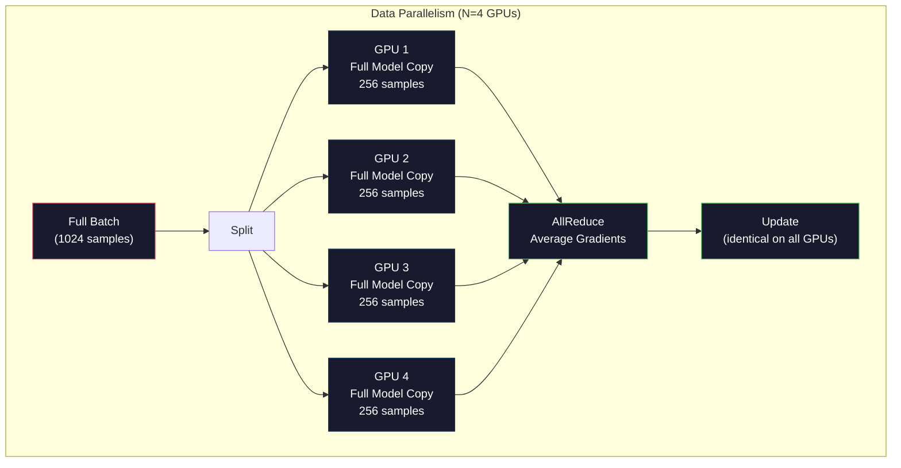
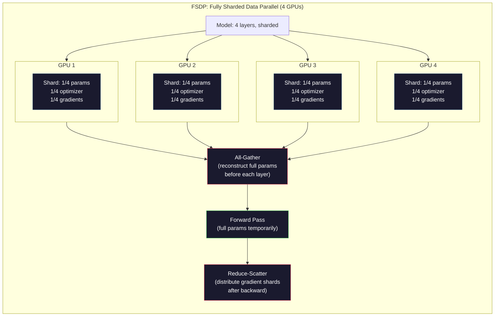
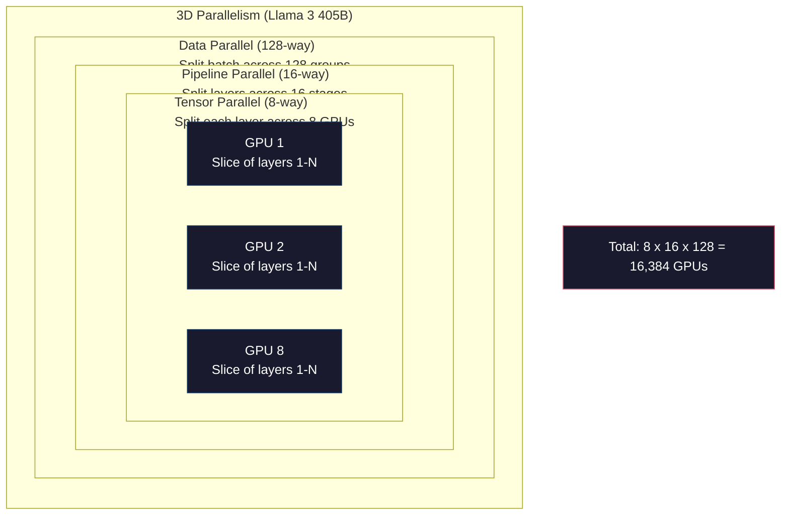

# 规模化：分布式训练、FSDP、DeepSpeed

> 你的 124M 模型在一张 GPU 上训练完了。现在试试 70 亿参数。模型塞不进显存。数据在单机上要跑好几周。到了规模上，分布式训练不是可选项。它是唯一的出路。

**类型：** Build
**语言：** Python
**前置要求：** 阶段 10，第 04 课（预训练一个 Mini GPT）
**预计时间：** ~120 分钟

## 学习目标

- 解释三类并行（数据、张量、流水线），以及在模型和集群规模下各自何时必要
- 用 PyTorch DDP 实现数据并行训练，跨多张 GPU 做梯度同步
- 为给定模型规模计算显存预算（权重 + 优化器状态 + 梯度 + 激活），定出最低硬件需求
- 配置 FSDP 或 DeepSpeed ZeRO 各阶段，把模型状态分片到多张 GPU，让超出单卡显存的模型也能塞下

## 问题所在

一个 7B 参数模型在 FP16 下，光权重就要 14GB。Adam 优化器为每个参数再存两份拷贝（一阶和二阶矩估计）。那又是 28GB。反向传播时的梯度再加 14GB。还没存下任何一个激活，你就到 56GB 了。

一张 NVIDIA A100 有 80GB 显存。

80GB 里吃掉 56GB。剩下 24GB 留给激活——前向传播时计算出、必须保留到反向传播的中间值。对一条 2048-token 序列、4096 维的模型，单层的激活大约用 64MB。32 层的话，每个样本要 2GB。batch size 8 需要 16GB。你有 24GB。batch size 12 就爆了。

现在试试 70B 参数。光权重：FP16 下 140GB。一张 GPU 装不下。你至少需要 2 张 A100（2 x 80GB = 160GB）才能放下权重。加上优化器状态和梯度，你需要的远不止：最少 3+ 张 GPU，按分片策略来看实际要 8-16 张。

Llama 3 405B 在 16,384 张 NVIDIA H100 上训练。这次训练的算力成本估计为 1 亿美元。DeepSeek V3 训出一个可比的模型只花了约 560 万美元，靠的是在架构上的聪明（Mixture of Experts 意味着每个 token 只激活一小部分参数）和训练效率。

本节课覆盖让大规模训练成为可能的四种策略：数据并行、张量并行、流水线并行和完全分片数据并行。你会用纯 Python 模拟每一种，先理解机制，再去碰任何分布式训练框架。

## 核心概念

### 为什么必须分布

下面是真实模型的显存账。每个数字都是算出来的，不是估的。

| 模型 | 参数 | 权重（FP16） | Adam 状态 | 梯度（FP16） | 合计（不含激活） |
|-------|--------|----------------|-------------|------------------|----------------------|
| GPT-2 Small | 124M | 248 MB | 992 MB | 248 MB | 1.5 GB |
| Llama 3 8B | 8B | 16 GB | 64 GB | 16 GB | 96 GB |
| Llama 3 70B | 70B | 140 GB | 560 GB | 140 GB | 840 GB |
| Llama 3 405B | 405B | 810 GB | 3,240 GB | 810 GB | 4,860 GB |

"Adam 状态" 这一列是要命的。Adam 为每个参数存一个滑动均值（m）和一个滑动方差（v），都用 FP32。对一个 70B 模型，那是 70B x 4 字节 x 2 = 560GB。光优化器就要七张 A100。

单张 H100 有 80GB。Llama 3 405B 至少要 61 张 H100 才能放下权重、优化器和梯度。加上激活数字还会涨。Meta 用 16,384 张 GPU 不是因为他们想用——是因为他们不得不用。

### 数据并行

最简单的分布式策略。把整个模型拷贝到 N 张 GPU。把每个训练批次切成 N 等份。每张 GPU 在自己那份数据上跑一次前向和反向传播。反向传播后，把梯度在所有 GPU 间求平均。每张 GPU 用相同的平均梯度更新自己那份权重，让所有拷贝保持同步。

**好处：** 吞吐线性扩展。N 张 GPU 每步处理 N 倍的数据。通信仅限于梯度求平均，而它能和计算重叠。

**坏处：** 每张 GPU 都持有模型、优化器状态和梯度的完整拷贝。对一个 70B 模型，每张 GPU 需要 840GB。数据并行完全不减少每卡显存。它只减少训练时间。

**算式：** 有效 batch size = per_gpu_batch_size x N。对 N=64 张 GPU、每卡 batch 16，有效 batch 是 1,024。Llama 3 用的有效 batch size 是每步 1600 万 token。



### 张量并行

把单个层切到多张 GPU。一次矩阵乘法被分摊到多张 GPU，每张算出结果的一部分。

考虑一个前馈层里形状为 (8192, 8192) 的权重矩阵。用 4 路张量并行，每张 GPU 持有一个 (8192, 2048) 的分片。每张 GPU 把输入乘上自己的分片，产出一个部分结果。这些部分结果被合并（通过 all-reduce 或 all-gather）成完整输出。

**好处：** 减少每卡的模型权重显存。一个 70B 模型切到 8 张 GPU，意味着每张 GPU 只持有约 8.75B 参数量的权重。

**坏处：** 每层之后都需要快速的 GPU 间通信。每次 matmul 后的 all-reduce 增加延迟。这在 NVLink（同节点 GPU 间 900 GB/s）上效果好，但跨 InfiniBand 连接的节点（400 Gb/s，约 50 GB/s）就很差。张量并行几乎总是限制在单个节点内（8 张 GPU）。

**真实用法：** Megatron-LM 开创了张量并行。Llama 3 405B 在每个节点内用 8 路张量并行。

### 流水线并行

按层切分模型。GPU 1 跑第 1-8 层。GPU 2 跑第 9-16 层。GPU 3 跑第 17-24 层。GPU 4 跑第 25-32 层。数据流过流水线：GPU 1 算完自己的层，把激活发给 GPU 2，GPU 2 算完自己的层发给 GPU 3，依此类推。

**好处：** GPU 间通信极少——只有层边界处的激活，相比梯度或权重要小得多。能跨节点工作，因为带宽需求低。

**坏处：** 流水线气泡。当 GPU 4 在对微批次 1 做前向时，GPU 1、2、3 闲着（它们已经前向完自己那部分了）。反向传播时，模式反过来。朴素流水线下，N 个流水线阶段的 GPU 利用率只有 1/N。

**GPipe 和 PipeDream** 通过把批次切成微批次来解决气泡问题。GPU 1 一前向完微批次 1，就立刻开始微批次 2。这让计算在流水线阶段间重叠。有 M 个微批次、N 个阶段时，气泡占比降到 (N-1)/M。用 M=16 个微批次、N=4 个阶段，气泡是 3/16 = 18.75% 的空闲时间。

### FSDP：完全分片数据并行

FSDP 把数据并行的可扩展性和分片的显存效率结合起来。每张 GPU 不再持有模型的完整拷贝，而只持有 1/N 的参数、梯度和优化器状态。

在一层的前向传播之前，FSDP 跑一次 **all-gather**，把所有 GPU 上的完整参数收集到每张 GPU 的显存里。前向之后，每张 GPU 丢掉非本地的参数。反向时，all-gather 再跑一次来重建参数以计算梯度。反向之后，一次 **reduce-scatter** 分发梯度分片，让每张 GPU 只存 1/N 的梯度。

**一个 70B 模型在 8 张 GPU 上的算式：**

| 组件 | 不用 FSDP | 用 FSDP |
|-----------|-------------|-----------|
| 权重（FP16） | 每卡 140 GB | 每卡 17.5 GB |
| Adam 状态（FP32） | 每卡 560 GB | 每卡 70 GB |
| 梯度（FP16） | 每卡 140 GB | 每卡 17.5 GB |
| **合计** | **每卡 840 GB** | **每卡 105 GB** |

不用 FSDP，你没法把 70B 模型塞进单张 80GB GPU。在 8 张 GPU 上用 FSDP，每张 GPU 用 105GB——等等，这还是装不下。你至少需要 16 张 GPU 才能让每卡降到 80GB 以下，或者把 FSDP 和激活检查点结合（反向时重算激活而不是存它们）。

通信成本比普通数据并行更高，因为每层前都有 all-gather。但这点显存节省，让以前不可能的训练成为可能。



### DeepSpeed ZeRO

DeepSpeed 的 ZeRO（Zero Redundancy Optimizer，零冗余优化器）在概念上和 FSDP 完全一致，但由微软独立开发。它定义了三个阶段，每个分片得更激进：

| 阶段 | 分片 | 显存节省 | 通信 |
|-------|--------|---------------|---------------|
| ZeRO-1 | 仅优化器状态 | ~4 倍削减 | 和数据并行相同 |
| ZeRO-2 | + 梯度 | ~8 倍削减 | 略多一点 |
| ZeRO-3 | + 参数 | ~N 倍削减（N 张 GPU） | 每层 all-gather |

ZeRO-3 等价于 FSDP。命名不同，机制相同。DeepSpeed 证明了这个概念后，PyTorch 把 FSDP 加进来作为原生实现。

DeepSpeed 还引入了 ZeRO-Offload（把优化器状态卸载到 CPU 内存，更便宜也更大）和 ZeRO-Infinity（卸载到 NVMe SSD）。这些用计算速度换显存容量——被卸载的操作更慢，但腾出了 GPU 显存。

### 混合精度训练

现代训练同时使用多种浮点格式：

- **前向传播**：FP16 或 BF16（16 位）。FP32 一半的显存。matmul 在 tensor core 上快 2 倍。
- **主权重**：FP32（32 位）。由优化器维护，用于权重更新时的数值精度。
- **损失缩放**：反向传播前把损失乘以一个大常数，防止 FP16 梯度下溢到零。优化器步骤前再除以同一个常数。

BF16（Brain Float 16）和 FP32 有相同的指数范围（8 个指数位），但精度更低（7 个尾数位 vs FP32 的 23 个）。它很少需要损失缩放，因为它能表示相同范围的值。FP16 有 5 个指数位和 10 个尾数位——它能表示细粒度的值，但在极端量级上会溢出/下溢。

Google 的 TPU 原生用 BF16。NVIDIA 的 A100 和 H100 同时支持 FP16 和 BF16。业界基本转向了 BF16，因为它消除了损失缩放的麻烦。

**一个 7B 模型的显存对比：**

| 精度 | 权重 | 优化器 | 梯度 | 合计 |
|-----------|---------|-----------|-----------|-------|
| 处处 FP32 | 28 GB | 56 GB | 28 GB | 112 GB |
| 混合（BF16 + FP32 主权重） | 14 GB | 56 GB | 14 GB | 84 GB |

混合精度在这个模型上省了 28GB。优化器状态无论如何都留在 FP32——这是大部分显存的去处。

### Megatron-LM 和 3D 并行

真正的大规模训练把三种并行全用上：

- **数据并行**跨节点组（扩展 batch size）
- **张量并行**在节点内（把层切到 8 张 GPU）
- **流水线并行**跨节点（把层组切到不同机器）

Llama 3 405B 在 16,384 张 H100 上：
- 每个节点内 8 路张量并行（每节点 8 张 GPU）
- 跨节点 16 路流水线并行（16 个流水线阶段）
- 在剩下的维度上 128 路数据并行（16,384 / 8 / 16 = 128）

这种 3D 分解（8 x 16 x 128 = 16,384）就是你扩展到上千张 GPU 的方式。每张 GPU 看到不同的数据分片（数据并行），持有每层的一个切片（张量并行），并计算一组不同的层（流水线并行）。

DeepSeek V3 走了另一条路。他们的 Mixture of Experts 架构每个 token 只激活 671B 参数里的 37B。这意味着每张 GPU 只需计算（并为之存激活）那些被激活的参数。他们在 2,048 张 H800 GPU 上训练——不到 Meta GPU 数量的 1/8——花了 560 万美元，对比 Meta 估计的 1 亿美元。



## 动手构建

### 第 1 步：模拟数据并行

把一个批次切到模拟的多张 GPU 上。每张 GPU 在自己那份上跑前向。把 "梯度"（我们用损失值模拟）求平均。

```python
import numpy as np

def simulate_data_parallelism(data, num_gpus, model_fn):
    batch_size = len(data)
    shard_size = batch_size // num_gpus
    remainder = batch_size % num_gpus

    gpu_losses = []
    gpu_gradients = []

    offset = 0
    for gpu_id in range(num_gpus):
        extra = 1 if gpu_id < remainder else 0
        shard = data[offset:offset + shard_size + extra]
        offset += shard_size + extra

        loss, grad = model_fn(shard)
        gpu_losses.append(loss)
        gpu_gradients.append(grad)

    avg_loss = np.mean(gpu_losses)
    avg_gradient = np.mean(gpu_gradients, axis=0)

    return avg_loss, avg_gradient
```

all-reduce 操作（梯度求平均）是数据并行里唯一的通信。实践中，这在 NVIDIA GPU 上用 NCCL 库，它实现环形 all-reduce：每张 GPU 把自己 1/N 的梯度发给邻居，从另一个邻居收 1/N，N-1 步之后每张 GPU 都有完整的平均值。总通信量：2 x 梯度大小 x (N-1)/N，对大 N 趋近于梯度大小的 2 倍。

### 第 2 步：模拟张量并行

把一个权重矩阵切到多张 GPU。每张 GPU 算一次部分矩阵乘法。合并结果。

```python
def simulate_tensor_parallelism(input_data, weight_matrix, num_gpus):
    d_in, d_out = weight_matrix.shape
    assert d_out % num_gpus == 0, f"d_out {d_out} not divisible by num_gpus {num_gpus}"
    shard_size = d_out // num_gpus

    partial_results = []
    for gpu_id in range(num_gpus):
        start = gpu_id * shard_size
        end = start + shard_size
        weight_shard = weight_matrix[:, start:end]

        partial = input_data @ weight_shard
        partial_results.append(partial)

    full_output = np.concatenate(partial_results, axis=-1)

    direct_output = input_data @ weight_matrix
    error = np.abs(full_output - direct_output).max()

    return full_output, error
```

误差应该恰好是零（或机器精度）。张量并行在数学上是精确的——它产出的结果和在单张 GPU 上算完整 matmul 一样。切分沿着输出维度，所以每张 GPU 产出不同的列块，拼接就重建出完整结果。

对列并行的线性层（切输出维度），你做拼接。对行并行（切输入维度），你做求和。在 transformer FFN 里，第一个线性层（扩展）用列并行，第二个线性层（收缩）用行并行。这避免了两层之间的一次 all-reduce。

### 第 3 步：模拟流水线并行

把一个模型的层切到虚拟 GPU 上。展示气泡问题——早期阶段闲着、后期阶段在算。

```python
def simulate_pipeline_parallelism(num_layers, num_stages, num_microbatches):
    layers_per_stage = num_layers // num_stages

    timeline = {}
    clock = 0

    for mb in range(num_microbatches):
        for stage in range(num_stages):
            start_time = max(
                timeline.get((stage, mb - 1, "fwd"), (0, 0))[1] if mb > 0 else 0,
                timeline.get((stage - 1, mb, "fwd"), (0, 0))[1] if stage > 0 else 0,
            )
            end_time = start_time + layers_per_stage
            timeline[(stage, mb, "fwd")] = (start_time, end_time)

    last_fwd_end = max(v[1] for v in timeline.values())

    for mb in range(num_microbatches - 1, -1, -1):
        for stage in range(num_stages - 1, -1, -1):
            deps = [last_fwd_end]
            if mb < num_microbatches - 1 and (stage, mb + 1, "bwd") in timeline:
                deps.append(timeline[(stage, mb + 1, "bwd")][1])
            if stage < num_stages - 1 and (stage + 1, mb, "bwd") in timeline:
                deps.append(timeline[(stage + 1, mb, "bwd")][1])
            start_time = max(deps)
            end_time = start_time + layers_per_stage
            timeline[(stage, mb, "bwd")] = (start_time, end_time)

    total_time = max(v[1] for v in timeline.values())
    compute_time = num_microbatches * num_stages * layers_per_stage * 2
    bubble_fraction = 1.0 - compute_time / (total_time * num_stages)

    return timeline, total_time, bubble_fraction
```

4 个阶段、1 个微批次时，气泡占比是 75%——任意时刻四张 GPU 里有三张闲着。用 16 个微批次，它降到约 19%。消除气泡的代价是显存：你必须同时存下所有在途微批次的激活。

### 第 4 步：显存计算器

为任意模型规模算出确切的显存需求。

```python
def memory_calculator(
    params_billions,
    precision_bytes=2,
    optimizer="adam",
    num_gpus=1,
    sharding="none",
    sequence_length=2048,
    batch_size_per_gpu=1,
    hidden_dim=None,
    num_layers=None,
):
    params = params_billions * 1e9

    weight_memory = params * precision_bytes

    if optimizer == "adam":
        optimizer_memory = params * 4 * 2
    elif optimizer == "sgd":
        optimizer_memory = params * 4
    else:
        optimizer_memory = 0

    gradient_memory = params * precision_bytes

    total_no_activation = weight_memory + optimizer_memory + gradient_memory

    if hidden_dim and num_layers:
        activation_per_layer = (
            sequence_length * batch_size_per_gpu * hidden_dim * precision_bytes * 4
        )
        activation_memory = activation_per_layer * num_layers
    else:
        activation_memory = params * precision_bytes * 0.5

    if sharding == "fsdp" or sharding == "zero3":
        weight_memory /= num_gpus
        optimizer_memory /= num_gpus
        gradient_memory /= num_gpus
    elif sharding == "zero2":
        optimizer_memory /= num_gpus
        gradient_memory /= num_gpus
    elif sharding == "zero1":
        optimizer_memory /= num_gpus

    per_gpu_total = weight_memory + optimizer_memory + gradient_memory + activation_memory

    return {
        "params_billions": params_billions,
        "weights_gb": weight_memory / 1e9,
        "optimizer_gb": optimizer_memory / 1e9,
        "gradients_gb": gradient_memory / 1e9,
        "activations_gb": activation_memory / 1e9,
        "per_gpu_total_gb": per_gpu_total / 1e9,
        "total_across_gpus_gb": per_gpu_total * num_gpus / 1e9,
        "fits_on_80gb": per_gpu_total / 1e9 <= 80,
        "num_gpus": num_gpus,
        "sharding": sharding,
    }
```

这个计算器回答每个 ML 工程师都会问的问题："我需要多少张 GPU？" 喂给它模型规模，看它能不能装下。调整分片策略，直到每卡总量降到 80GB 以下。

### 第 5 步：混合精度模拟

对比 FP32、FP16 和混合精度训练之间的显存用量。

```python
def mixed_precision_comparison(params_billions):
    params = params_billions * 1e9

    fp32_weights = params * 4
    fp32_optimizer = params * 4 * 2
    fp32_gradients = params * 4
    fp32_total = fp32_weights + fp32_optimizer + fp32_gradients

    fp16_weights = params * 2
    fp16_master = params * 4
    fp16_optimizer = params * 4 * 2
    fp16_gradients = params * 2
    fp16_total = fp16_weights + fp16_master + fp16_optimizer + fp16_gradients

    mixed_weights = params * 2
    mixed_optimizer = params * 4 * 2
    mixed_gradients = params * 2
    mixed_total = mixed_weights + mixed_optimizer + mixed_gradients

    return {
        "fp32_total_gb": fp32_total / 1e9,
        "fp16_with_master_gb": fp16_total / 1e9,
        "mixed_bf16_gb": mixed_total / 1e9,
        "savings_vs_fp32": 1 - mixed_total / fp32_total,
    }
```

对大多数人最大的意外：混合精度并不把显存减半。优化器状态（Adam 的 m 和 v）无论精度如何都留在 FP32。对一个 7B 模型，FP32 训练用 112GB。混合精度用 84GB。那是削减 25%，不是 50%。优化器才是大头。

## 上手使用

### 跑完所有模拟

```python
def run_all_demos():
    print("=" * 70)
    print("DATA PARALLELISM SIMULATION")
    print("=" * 70)

    np.random.seed(42)
    data = np.random.randn(64, 32)
    weight = np.random.randn(32, 16)

    def model_fn(batch):
        output = batch @ weight
        loss = np.mean(output ** 2)
        grad = 2 * batch.T @ (batch @ weight) / len(batch)
        return loss, grad

    for n_gpus in [1, 2, 4, 8]:
        loss, grad = simulate_data_parallelism(data, n_gpus, model_fn)
        print(f"  {n_gpus} GPUs: loss={loss:.4f}, grad_norm={np.linalg.norm(grad):.4f}")

    print()
    print("=" * 70)
    print("TENSOR PARALLELISM SIMULATION")
    print("=" * 70)

    x = np.random.randn(4, 8192)
    W = np.random.randn(8192, 8192)

    for n_gpus in [1, 2, 4, 8]:
        output, error = simulate_tensor_parallelism(x, W, n_gpus)
        print(f"  {n_gpus} GPUs: output_shape={output.shape}, max_error={error:.2e}")

    print()
    print("=" * 70)
    print("PIPELINE PARALLELISM SIMULATION")
    print("=" * 70)

    for n_mb in [1, 4, 8, 16, 32]:
        _, total_t, bubble = simulate_pipeline_parallelism(32, 4, n_mb)
        print(f"  {n_mb:2d} micro-batches: total_time={total_t:4d}, bubble={bubble:.1%}")

    print()
    print("=" * 70)
    print("MEMORY CALCULATOR")
    print("=" * 70)

    configs = [
        (7, "none", 1),
        (7, "fsdp", 8),
        (70, "none", 1),
        (70, "fsdp", 8),
        (70, "fsdp", 16),
        (405, "fsdp", 64),
        (405, "fsdp", 128),
    ]

    print(f"  {'Model':>8} {'Sharding':>8} {'GPUs':>5} {'Per-GPU':>10} {'Fits 80GB':>10}")
    print("  " + "-" * 50)
    for params, shard, gpus in configs:
        result = memory_calculator(params, num_gpus=gpus, sharding=shard)
        fits = "Yes" if result["fits_on_80gb"] else "No"
        print(f"  {params:>6}B {shard:>8} {gpus:>5} {result['per_gpu_total_gb']:>8.1f}GB {fits:>10}")

    print()
    print("=" * 70)
    print("MIXED PRECISION COMPARISON")
    print("=" * 70)

    for params_b in [7, 13, 70, 405]:
        result = mixed_precision_comparison(params_b)
        print(f"  {params_b}B: FP32={result['fp32_total_gb']:.0f}GB, "
              f"Mixed BF16={result['mixed_bf16_gb']:.0f}GB, "
              f"Savings={result['savings_vs_fp32']:.0%}")
```

## 交付

本节课产出 `outputs/prompt-distributed-training-planner.md`——一个 prompt，接收一个模型规模和可用硬件，然后产出一份完整的分布式训练计划：并行策略、显存预算、通信开销和预期吞吐。

## 练习

1. 改造显存计算器，把激活检查点纳入。用了检查点，只在每 K 层存一次激活（典型 K=1，意味着全部重算）。展示显存-计算的权衡：检查点能省多少显存，又让训练慢多少（全检查点大约多 33% 计算）？

2. 把流水线并行模拟扩展为实现 PipeDream 用的 1F1B（一前向一反向）调度。对 4 个阶段、8 个微批次，把气泡占比和朴素调度对比。1F1B 调度的峰值显存应该更小，因为它更早开始反向传播。

3. 实现一个梯度累积模拟器。不在每个微批次后做 all-reduce，而是本地累积梯度 K 步，然后再 all-reduce。展示这如何把通信减少 K 倍，但产出完全相同的最终梯度（因而训练也完全相同）。

4. 做一个成本估算器。给定模型规模、目标 token 数、GPU 类型（A100 每小时 2 美元，H100 每小时 3.50 美元）和并行策略，估出总训练成本（以美元计）。和已知成本对照验证：据报道 Llama 3 405B 花了约 1 亿美元，DeepSeek V3 花了约 560 万美元。

5. 给显存计算器加上 ZeRO-Offload。假设每节点 CPU 内存 512GB、NVMe 2TB。展示把优化器状态卸载到 CPU 如何让一个 70B 模型在 4 张 GPU 上训练（而不是 16 张），代价是优化器步骤慢 30-50%。

## 关键术语

| 术语 | 人们怎么说 | 它实际是什么 |
|------|----------------|----------------------|
| 数据并行 | "把模型拷到每张 GPU" | 每张 GPU 处理不同的数据分片；每步后梯度通过 all-reduce 求平均 |
| 张量并行 | "把一层切到多张 GPU" | 切分权重矩阵让每张 GPU 算 matmul 的一部分；需要快速的 NVLink 互联 |
| 流水线并行 | "把层切到多张 GPU" | 每张 GPU 跑不同的一组层；数据用微批次流过流水线以减少气泡 |
| FSDP | "把所有东西分片" | 完全分片数据并行——每张 GPU 持有 1/N 的权重、梯度和优化器状态；计算前 all-gather |
| ZeRO | "DeepSpeed 版的 FSDP" | 零冗余优化器，三个阶段：分片优化器（阶段 1）、+ 梯度（阶段 2）、+ 参数（阶段 3） |
| All-reduce | "跨 GPU 求平均" | 一种集合操作，每张 GPU 最终得到所有 GPU 输入的总和（或平均）——通常实现为环形 all-reduce |
| All-gather | "从所有 GPU 收集" | 一种集合操作，每张 GPU 最终得到所有 GPU 数据的拼接——在 FSDP 里用于重建完整参数 |
| Reduce-scatter | "求和并分发" | 一种集合操作，归约（求和）数据并把不同块分散到不同 GPU——在 FSDP 里用于梯度分片 |
| 混合精度 | "用半精度训练" | 前向/反向用 FP16/BF16、优化器状态用 FP32——省约 25% 显存而非 50%，因为优化器是大头 |
| 流水线气泡 | "流水线里的空闲时间" | GPU 闲着等上一阶段数据的时间占比——用更多微批次来减少 |

## 延伸阅读

- [Rajbhandari et al., 2020 -- "ZeRO: Memory Optimizations Toward Training Trillion Parameter Models"](https://arxiv.org/abs/1910.02054) -- 定义了三个分片阶段的 DeepSpeed ZeRO 论文
- [Shoeybi et al., 2020 -- "Megatron-LM: Training Multi-Billion Parameter Language Models Using Model Parallelism"](https://arxiv.org/abs/1909.08053) -- NVIDIA 为 transformer 设计的张量并行
- [Narayanan et al., 2021 -- "Efficient Large-Scale Language Model Training on GPU Clusters Using Megatron-LM"](https://arxiv.org/abs/2104.04473) -- 结合数据、张量、流水线的 3D 并行
- [Zhao et al., 2023 -- "PyTorch FSDP: Experiences on Scaling Fully Sharded Data Parallel"](https://arxiv.org/abs/2304.11277) -- PyTorch 的原生 FSDP 实现
- [Llama 3 Technical Report](https://arxiv.org/abs/2407.21783) -- 16,384 张 GPU 训练的 3D 并行细节
- [DeepSeek-V3 Technical Report](https://arxiv.org/abs/2412.19437) -- MoE 架构如何把训练成本降低一个数量级
