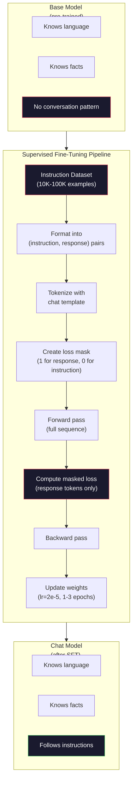

# 指令微调（SFT）

> 基座模型预测下一个 token。就这样。它不跟随指令、不回答问题、也不拒绝有害请求。SFT 是 token 预测器和有用助手之间的桥梁。你聊过的每一个模型——Claude、GPT、Llama Chat——都经过了这一步。

**类型：** Build
**语言：** Python（配合 numpy）
**前置要求：** 阶段 10，第 04 课（预训练一个 Mini GPT）
**预计时间：** ~90 分钟

## 学习目标

- 实现监督微调（SFT），把一个基座语言模型变成一个跟随指令的助手
- 用带 system、user、assistant 角色的 chat 模板格式化训练数据，并在非 assistant token 上 mask 掉损失
- 解释为什么需要 SFT：基座模型是在续写文本，而不是回答问题
- 通过在留出指令集上对比基座模型 vs 微调后模型的回复，评估 SFT 质量

## 问题所在

你在第 04 课训了一个模型。它能给定一段序列预测下一个 token。喂它 "The transformer architecture"，它可能续写 "has revolutionized natural language processing"。对一个下一个 token 预测器来说这很厉害。

现在试试这个：喂它 "What is the capital of France?" 基座模型不会回答 "Paris"。它会续写这个模式。它可能产出 "What is the capital of Germany? What is the capital of Spain?"，因为它从包含问题列表的文档里学到了这个。或者它可能产出 "is a question that many people ask"，因为这是个合理的下一个 token 续写。模型没有 *回答* 这个概念。它只懂 *续写*。

这就是 GPT-3（基座模型，2020 年 6 月发布）和 ChatGPT（指令微调后，2022 年 11 月发布）之间的鸿沟。同样的架构。同样的预训练。差别在于那 2 万到 10 万对精心打磨的（指令，回复），它们教会了模型跟随对话模式。

斯坦福 Alpaca 证明了你不需要几百万个例子。2023 年 3 月，他们在仅 5.2 万对由 GPT-3.5 生成的指令-回复上微调了 Llama 7B。总成本：600 美元。结果是一个能跟随指令、回答问题、进行对话的聊天机器人。没 ChatGPT 那么好，但就 600 美元和几小时训练而言，近得惊人。

Meta 的 Llama 2 Chat 在它最初的 SFT 阶段只用了约 2.7 万个高质量例子。关键洞见：质量比数量更重要。2.7 万个由熟练标注员写的例子，胜过 100 万个从网上扒来的嘈杂例子。

## 核心概念

### SFT 实际在做什么

监督微调延续预训练时的那套训练循环——前向传播、计算损失、反向传播、更新权重——但在一种不同的数据上。不是原始文本，而是在结构化对话上训练：

```json
{
  "system": "You are a helpful assistant.",
  "user": "What is the capital of France?",
  "assistant": "The capital of France is Paris."
}
```

模型早就知道巴黎是法国首都。它在预训练时从 Wikipedia、教科书和网页上学到了。SFT 不教模型新事实。它教模型一种新 *行为*：看到问题，产出答案。看到指令，产出补全。看到有害请求，产出拒绝。

这么想吧。预训练给模型知识。SFT 给模型礼貌。

### 数据格式

业界有三种主导格式。每一种都编码相同的信息——谁说了什么——只是分隔符不同。

**Alpaca 格式**（斯坦福，2023 年 3 月）：

```json
{
  "instruction": "Summarize the following article in 3 sentences.",
  "input": "The European Central Bank raised interest rates...",
  "output": "The ECB increased rates by 25 basis points..."
}
```

简单且广泛使用。`input` 字段是可选的——很多指令不需要额外上下文。斯坦福以这个格式发布了 5.2 万个例子，由 GPT-3.5 生成、花了 600 美元。这开启了开源指令微调的浪潮。

**ShareGPT 格式**（社区，2023 年）：

```json
{
  "conversations": [
    {"from": "system", "value": "You are a helpful assistant."},
    {"from": "human", "value": "What causes tides?"},
    {"from": "gpt", "value": "Tides are caused by the gravitational pull of the Moon..."},
    {"from": "human", "value": "How often do they occur?"},
    {"from": "gpt", "value": "Most coastal areas experience two high tides and two low tides per day..."}
  ]
}
```

支持多轮对话。"from" 字段按惯例用 "human" 和 "gpt"，不管实际模型是什么。Vicuna 在 7 万条从用户分享的 ChatGPT 记录里扒来的 ShareGPT 对话上训练。

**ChatML 格式**（OpenAI，被许多开源模型使用）：

```
<|im_start|>system
You are a helpful assistant.<|im_end|>
<|im_start|>user
What is the capital of France?<|im_end|>
<|im_start|>assistant
The capital of France is Paris.<|im_end|>
```

用特殊 token（`<|im_start|>`、`<|im_end|>`）来分隔角色。这些 token 在微调时被加进 tokenizer 的词表。Qwen、Yi 和许多其他模型用 ChatML。

这三种格式干的是同一件事：它们告诉模型 "这是指令，这是回复，学这个模式"。

### 它为什么有效

模型从预训练里早就知道了语言。它见过几十亿个问题接答案、指令接补全、人与人之间对话的例子。这些模式早就编码在权重里了。

SFT 把这种潜在能力聚焦起来。模型不再需要从上下文里揣摩自己该回答问题还是续写文档，SFT 显式地在对话模式上训练。几千个例子之后，模型学会：看到 assistant 角色标记，产出一个有帮助的回复。

这就是为什么 2.7 万个例子就够了。你不是在教模型英语。不是在教它关于世界的事实。你是在教它一个简单的行为：响应指令。知识本来就在那儿了。

### masked 损失

这是 SFT 里最重要的技术细节，而大多数教程都跳过了它。

预训练时，你在每个 token 上计算损失。模型学会预测序列里的每个下一个 token。SFT 时，你只在 *回复* token 上计算损失。指令 token 在那儿是为了提供上下文，但模型不会因为 "预测" 错它们而受罚。

为什么？因为你不想让模型学会 *生成* 指令。你想让它学会 *响应* 指令。如果你在指令 token 上计算损失，你就是在训练模型把 "What is the capital of France?" 当成是它自己在提问那样去预测。这浪费梯度信号，还可能让模型对自己的角色犯迷糊。

实践中，你创建一个损失 mask：回复 token 为 1，指令 token 为 0。在求平均前，把每个 token 的损失乘以这个 mask。

```
Tokens:    [SYS] You are helpful [USER] What is the capital? [ASST] Paris is the capital [EOS]
Loss mask:   0    0    0     0      0     0   0  0     0       1     1    1   1     1      1
```

只有 `[ASST]` 之后的 token 对损失有贡献。前向传播时模型看到完整对话（它需要指令才能产出正确的回复），但只根据它对回复预测得有多好来更新权重。

### 训练超参数

SFT 用的超参数和预训练截然不同。你不是从零训练。你是在调一个已经能用的模型。

| 参数 | 预训练（Llama 2 7B） | SFT（Llama 2 Chat） |
|-----------|---------------------------|---------------------|
| 学习率 | 3e-4（峰值） | 2e-5 |
| Epoch | 1（数据过一遍） | 2 |
| Batch size | 4M token | 64 个例子 |
| Warmup 步数 | 2,000 | 0-100 |
| Weight decay | 0.1 | 0.0-0.1 |
| 数据量 | 2T token | 27,000 个例子 |

SFT 的学习率低了 15 倍。这很关键。微调时用高学习率会摧毁预训练知识。模型会 "忘掉" 它学的东西，并在小的微调数据集上过拟合。这就是灾难性遗忘。

两个 epoch 意味着模型把每个训练样本看两遍。在小数据集上超过 3 个 epoch 会导致记忆——模型开始逐字复述训练样本，而不是泛化。

### 灾难性遗忘

微调可能摧毁通用能力。在指令跟随数据上训练太久，模型就会失去写代码、做数学或产出创意文本的能力。它会变得非常擅长它训练数据的特定格式，而其他一切都糟糕透顶。

三种缓解办法：

1. **低学习率。** 1e-5 到 5e-5。更小的更新意味着对预训练特征的破坏更少。

2. **短训练。** 1-3 个 epoch。在模型过拟合之前停下。

3. **掺入预训练数据。** Llama 2 Chat 把一小部分（2-5%）原始预训练数据混进 SFT 数据集。这在模型学习新的指令跟随行为时 "提醒" 它自己的通用能力。

### 真实数字

在 1 万个高质量指令对上微调一个 7B 模型，在单张 NVIDIA A100 80GB GPU 上大约要 1 小时。算式如下：

- 10,000 个例子 x 平均 512 token = 512 万 token
- 2 个 epoch = 总共 1024 万 token
- A100 微调 7B 模型的吞吐：~3,000 token/秒
- 1024 万 / 3,000 = ~3,400 秒 = ~57 分钟

对我们的 mini GPT（4 层、128 维），训练几乎瞬间完成。重点是理解机制，不是规模。



## 动手构建

### 第 1 步：指令数据集

创建一个合成指令数据集。在生产里，Scale AI 和 Anthropic 这样的公司雇人工标注员来写这些。我们用程序生成它们来演示格式。

```python
import numpy as np

INSTRUCTION_DATA = [
    {
        "instruction": "What is the capital of France?",
        "response": "The capital of France is Paris."
    },
    {
        "instruction": "Explain gravity in one sentence.",
        "response": "Gravity is the force that attracts objects with mass toward each other."
    },
    {
        "instruction": "Write a haiku about the ocean.",
        "response": "Waves crash on the shore, salt and foam beneath the sun, endless blue expanse."
    },
    {
        "instruction": "What is 15 multiplied by 7?",
        "response": "15 multiplied by 7 is 105."
    },
    {
        "instruction": "Name three programming languages.",
        "response": "Three programming languages are Python, Rust, and TypeScript."
    },
    {
        "instruction": "Summarize photosynthesis.",
        "response": "Photosynthesis converts sunlight, water, and carbon dioxide into glucose and oxygen."
    },
    {
        "instruction": "What year did World War II end?",
        "response": "World War II ended in 1945."
    },
    {
        "instruction": "Define machine learning.",
        "response": "Machine learning is a field where algorithms learn patterns from data to make predictions."
    },
]
```

八个例子太少了。斯坦福 Alpaca 用了 5.2 万。但不管你有 8 个还是 5.2 万个，机制一模一样：分词、mask、只在回复上计算损失。

### 第 2 步：用 chat 模板分词

把指令-回复对转成带角色标记的 token 序列。标记告诉模型指令在哪结束、回复从哪开始。

```python
SPECIAL_TOKENS = {
    "INST_START": 253,
    "INST_END": 254,
    "RESP_START": 255,
}


def tokenize_instruction_pair(instruction, response, vocab_size=256):
    inst_tokens = list(instruction.encode("utf-8"))
    resp_tokens = list(response.encode("utf-8"))

    inst_tokens = [min(t, vocab_size - 4) for t in inst_tokens]
    resp_tokens = [min(t, vocab_size - 4) for t in resp_tokens]

    tokens = (
        [SPECIAL_TOKENS["INST_START"]]
        + inst_tokens
        + [SPECIAL_TOKENS["INST_END"]]
        + [SPECIAL_TOKENS["RESP_START"]]
        + resp_tokens
    )

    return tokens


def create_loss_mask(tokens):
    mask = np.zeros(len(tokens), dtype=np.float32)
    in_response = False

    for i, token in enumerate(tokens):
        if token == SPECIAL_TOKENS["RESP_START"]:
            in_response = True
            continue
        if in_response:
            mask[i] = 1.0

    return mask
```

损失 mask 对指令 token 全是零，对回复 token 全是一。`RESP_START` token 本身 mask 为 0，因为它是个分隔符，不是回复内容的一部分。

### 第 3 步：masked 交叉熵损失

标准的交叉熵，但乘以损失 mask。只有回复 token 对梯度有贡献。

```python
def masked_cross_entropy_loss(logits, targets, loss_mask):
    batch, seq_len, vocab_size = logits.shape
    logits_flat = logits.reshape(-1, vocab_size)
    targets_flat = targets.reshape(-1)
    mask_flat = loss_mask.reshape(-1)

    max_logits = logits_flat.max(axis=-1, keepdims=True)
    log_softmax = logits_flat - max_logits - np.log(
        np.exp(logits_flat - max_logits).sum(axis=-1, keepdims=True)
    )

    per_token_loss = -log_softmax[np.arange(len(targets_flat)), targets_flat]

    masked_loss = per_token_loss * mask_flat
    num_response_tokens = mask_flat.sum()
    if num_response_tokens == 0:
        return 0.0
    loss = masked_loss.sum() / num_response_tokens

    return loss
```

分母是 `num_response_tokens`，不是 `seq_len`。如果你除以总序列长度，更长的指令会稀释梯度信号。除以回复 token 数能确保每个回复 token 权重相等，不管指令多长。

### 第 4 步：SFT 训练循环

复用第 04 课的 MiniGPT。训练循环看起来和预训练几乎一样，只是多了指令格式化和 masked 损失。

```python
import sys
import os
sys.path.insert(0, os.path.join(os.path.dirname(__file__), "..", "..", "04-pre-training-mini-gpt", "code"))
from main import MiniGPT, LayerNorm, FeedForward, MultiHeadAttention, TransformerBlock, Embedding


def sft_train(model, dataset, num_epochs=2, lr=2e-5, seq_len=64):
    formatted_data = []
    for example in dataset:
        tokens = tokenize_instruction_pair(example["instruction"], example["response"])
        mask = create_loss_mask(tokens)
        formatted_data.append((tokens, mask))

    print(f"SFT Training: {len(formatted_data)} examples, {num_epochs} epochs, lr={lr}")
    print(f"Total tokens: {sum(len(t) for t, _ in formatted_data):,}")
    print()

    losses = []

    for epoch in range(num_epochs):
        epoch_loss = 0.0
        num_batches = 0

        indices = np.random.permutation(len(formatted_data))

        for idx in indices:
            tokens, mask = formatted_data[idx]

            if len(tokens) < 3:
                continue
            if len(tokens) > seq_len:
                tokens = tokens[:seq_len]
                mask = mask[:seq_len]

            input_ids = np.array(tokens[:-1]).reshape(1, -1)
            target_ids = np.array(tokens[1:]).reshape(1, -1)
            loss_mask = np.array(mask[1:]).reshape(1, -1)

            logits = model.forward(input_ids)
            loss = masked_cross_entropy_loss(logits, target_ids, loss_mask)

            batch_size, s_len, v_size = logits.shape
            probs = np.exp(logits - logits.max(axis=-1, keepdims=True))
            probs = probs / probs.sum(axis=-1, keepdims=True)
            dlogits = probs.copy()
            dlogits[np.arange(batch_size)[:, None], np.arange(s_len), target_ids] -= 1.0

            mask_expanded = loss_mask[:, :, np.newaxis]
            num_resp = loss_mask.sum()
            if num_resp > 0:
                dlogits = dlogits * mask_expanded / num_resp

            for block in model.blocks:
                block.ffn.W1 -= lr * np.random.randn(*block.ffn.W1.shape) * 0.01
                block.ffn.W2 -= lr * np.random.randn(*block.ffn.W2.shape) * 0.01
                block.ffn.b1 -= lr * np.random.randn(*block.ffn.b1.shape) * 0.01
                block.ffn.b2 -= lr * np.random.randn(*block.ffn.b2.shape) * 0.01

            epoch_loss += loss
            num_batches += 1
            losses.append(loss)

        avg_loss = epoch_loss / max(num_batches, 1)
        print(f"Epoch {epoch + 1}/{num_epochs} | Avg Loss: {avg_loss:.4f}")

    return model, losses
```

学习率是 2e-5，和 Llama 2 Chat 一致。对比预训练用的 3e-4——小了 15 倍。梯度被 mask 了：指令 token 产生零梯度。只有回复 token 推动权重。

### 第 5 步：对比基座 vs SFT 模型

SFT 的全部意义在于行为改变。我们来度量它，看看模型对指令格式化的输入和对原始文本续写分别如何响应。

```python
def generate_response(model, prompt_tokens, max_new_tokens=50, temperature=0.8):
    tokens = list(prompt_tokens)
    seq_len = model.embedding.pos_embed.shape[0]

    for _ in range(max_new_tokens):
        context = np.array(tokens[-seq_len:]).reshape(1, -1)
        logits = model.forward(context)
        next_logits = logits[0, -1, :]

        next_logits = next_logits / max(temperature, 1e-8)
        probs = np.exp(next_logits - next_logits.max())
        probs = probs / probs.sum()
        probs = np.clip(probs, 1e-10, 1.0)
        probs = probs / probs.sum()

        next_token = np.random.choice(len(probs), p=probs)
        tokens.append(int(next_token))

    return tokens


def evaluate_instruction_following(model, instructions):
    print("Evaluating instruction following:")
    print("-" * 50)

    for instruction in instructions:
        tokens = (
            [SPECIAL_TOKENS["INST_START"]]
            + [min(t, 252) for t in list(instruction.encode("utf-8"))]
            + [SPECIAL_TOKENS["INST_END"]]
            + [SPECIAL_TOKENS["RESP_START"]]
        )

        output = generate_response(model, tokens, max_new_tokens=30, temperature=0.6)
        response_start = len(tokens)
        response_tokens = output[response_start:]
        response_bytes = bytes([t for t in response_tokens if t < 128])
        response_text = response_bytes.decode("utf-8", errors="replace")

        print(f"  Q: {instruction}")
        print(f"  A: {response_text[:80]}")
        print()
```

在一个只有 8 个例子的小模型上，回复不会有什么意义。这在意料之中。重要的是 *结构*：模型学会在回复标记之后产出输出，而不是继续生成更多指令。

### 第 6 步：度量灾难性遗忘

对比模型在 SFT 前后的下一个 token 预测能力。如果 SFT 损害了通用能力，原始文本上的损失会上升。

```python
def measure_forgetting(model, test_text, seq_len=64):
    tokens = np.array(list(test_text.encode("utf-8")[:512]))

    total_loss = 0.0
    num_windows = 0

    for start in range(0, len(tokens) - seq_len - 1, seq_len):
        input_ids = tokens[start:start + seq_len].reshape(1, -1)
        target_ids = tokens[start + 1:start + seq_len + 1].reshape(1, -1)

        logits = model.forward(input_ids)

        batch, s_len, vocab_size = logits.shape
        logits_flat = logits.reshape(-1, vocab_size)
        targets_flat = target_ids.reshape(-1)

        max_logits = logits_flat.max(axis=-1, keepdims=True)
        log_softmax = logits_flat - max_logits - np.log(
            np.exp(logits_flat - max_logits).sum(axis=-1, keepdims=True)
        )

        loss = -log_softmax[np.arange(len(targets_flat)), targets_flat].mean()
        total_loss += loss
        num_windows += 1

    return total_loss / max(num_windows, 1)
```

在真实微调里，你会全程追踪这个指标。如果原始文本损失上升超过 10-15%，你的 SFT 就太激进了。降低学习率或减少 epoch 数。

## 上手使用

### 完整 SFT 流水线演示

```python
if __name__ == "__main__":
    np.random.seed(42)

    test_text = """The transformer architecture processes sequences through self-attention.
Each layer applies multi-head attention followed by a feedforward network.
Residual connections and layer normalization stabilize deep networks.
The model learns to predict the next token given all previous tokens."""

    print("=" * 70)
    print("INSTRUCTION TUNING (SFT) DEMO")
    print("=" * 70)
    print()

    model = MiniGPT(
        vocab_size=256, embed_dim=128, num_heads=4,
        num_layers=4, max_seq_len=128, ff_dim=512
    )
    print(f"Model: {model.count_parameters():,} parameters")
    print(f"Config: 4 layers, 4 heads, 128 dims (mini GPT from Lesson 04)")
    print()

    print("PRE-SFT: Measuring base model loss on raw text")
    base_loss = measure_forgetting(model, test_text)
    print(f"  Base model loss: {base_loss:.4f}")
    print()

    print("=" * 70)
    print("SFT TRAINING")
    print("=" * 70)

    model, losses = sft_train(
        model, INSTRUCTION_DATA, num_epochs=3, lr=2e-5, seq_len=128
    )

    print()
    print("POST-SFT: Measuring fine-tuned model loss on raw text")
    sft_loss = measure_forgetting(model, test_text)
    print(f"  SFT model loss: {sft_loss:.4f}")
    print(f"  Change: {((sft_loss - base_loss) / base_loss * 100):+.1f}%")
    if abs(sft_loss - base_loss) / base_loss < 0.15:
        print("  Minimal forgetting (< 15% change)")
    else:
        print("  Significant forgetting detected")
    print()

    print("=" * 70)
    print("INSTRUCTION FOLLOWING EVALUATION")
    print("=" * 70)
    print()

    test_instructions = [
        "What is the capital of France?",
        "Name a programming language.",
        "Define gravity.",
    ]
    evaluate_instruction_following(model, test_instructions)

    print("=" * 70)
    print("DATA FORMAT EXAMPLES")
    print("=" * 70)
    print()

    for i, example in enumerate(INSTRUCTION_DATA[:3]):
        tokens = tokenize_instruction_pair(example["instruction"], example["response"])
        mask = create_loss_mask(tokens)
        resp_count = int(mask.sum())
        total_count = len(tokens)
        print(f"  Example {i + 1}: {total_count} tokens, {resp_count} response tokens ({resp_count/total_count:.0%} of sequence)")
        print(f"    Instruction: {example['instruction']}")
        print(f"    Response: {example['response']}")
        print()

    print("=" * 70)
    print("TRAINING LOSS CURVE")
    print("=" * 70)
    print()

    if losses:
        window = max(1, len(losses) // 5)
        for i in range(0, len(losses), window):
            chunk = losses[i:i + window]
            avg = sum(chunk) / len(chunk)
            print(f"  Steps {i:3d}-{i + len(chunk) - 1:3d}: avg loss = {avg:.4f}")
```

## 交付

本节课产出 `outputs/prompt-sft-data-curator.md`——一个 prompt，帮你为 SFT 设计和筛选指令数据集。给定一个目标能力（代码生成、数学、对话），它产出一份数据收集计划，含格式规范、质量标准和多样性要求。

## 练习

1. 加上 system prompt 支持。改造 `tokenize_instruction_pair` 让它接受一条 system 消息，并把它前置到指令之前。创建 5 个带不同 system prompt 的例子（"You are a poet"、"You are a math tutor"），验证模型在训练时看到了不同的 system prompt。

2. 实现数据混合。写一个函数，接收一个 SFT 数据集和一个原始文本语料，然后产出训练批次，其中 5% 的例子是原始文本（不 mask），95% 是指令对（mask）。跑 3 个 epoch，把遗忘指标和纯 SFT 训练对比。

3. 做一个数据质量打分器。对每个指令-回复对，计算：(a) 回复的 token 长度，(b) 指令对回复的比例，(c) 词表多样性（唯一 token / 总 token）。过滤掉回复长度 < 10 token 或多样性 < 0.3 的例子。展示过滤如何影响最终损失。

4. 实现多轮对话训练。把分词扩展到能处理 3 轮对话（user-assistant-user-assistant-user-assistant）。损失 mask 应该覆盖全部三个 assistant 轮次。通过打印一个例子的 token-mask 对齐来验证 mask 正确。

5. 对比学习率。用 lr=1e-4、lr=2e-5、lr=1e-6 把同一个模型训三次。画出损失曲线。1e-4 那次应该显示快速的初始下降但最终损失更高（过拟合）。1e-6 那次应该几乎不动。2e-5 那次应该是甜点区。

## 关键术语

| 术语 | 人们怎么说 | 它实际是什么 |
|------|----------------|----------------------|
| SFT | "在对话上微调" | 监督微调：在（指令，回复）对上继续训练，只在回复 token 上计算损失 |
| 指令微调 | "教模型跟随指令" | 在显式的指令-回复对上训练，让基座模型学会对话模式，而不是新知识 |
| 损失 masking | "忽略 prompt" | 把指令 token 的损失设为零，让梯度只从回复 token 的预测流出 |
| ChatML | "Chat Markup Language" | 一种 token 格式，用 `<\|im_start\|>` 和 `<\|im_end\|>` 分隔符标记对话数据里的说话者角色 |
| Alpaca 格式 | "斯坦福的格式" | 一种带 instruction/input/output 字段的 JSON 格式，用于那 5.2 万个花 600 美元由 GPT-3.5 生成的例子 |
| 灾难性遗忘 | "模型变笨了" | 微调摧毁了预训练能力，因为梯度更新用任务特定模式覆盖了通用知识 |
| 权重共享 | "共享 embedding" | 对输入 token embedding 和输出预测头用同一个矩阵，省参数并提升连贯性 |
| chat 模板 | "你怎么格式化 prompt" | 为模型组织对话结构的特定 token 序列（角色标记、分隔符） |

## 延伸阅读

- [Ouyang et al., 2022 -- "Training language models to follow instructions with human feedback" (InstructGPT)](https://arxiv.org/abs/2203.02155) -- 在 OpenAI 引入指令微调 + RLHF 的论文
- [Taori et al., 2023 -- "Stanford Alpaca: An Instruction-following LLaMA Model"](https://github.com/tatsu-lab/stanford_alpaca) -- 花 600 美元做 5.2 万个指令例子，证明 SFT 在小数据集上有效
- [Touvron et al., 2023 -- "Llama 2: Open Foundation and Fine-Tuned Chat Models"](https://arxiv.org/abs/2307.09288) -- Meta 用 2.7 万个高质量例子的 SFT + RLHF 流水线
- [Chiang et al., 2023 -- "Vicuna: An Open-Source Chatbot Impressing GPT-4"](https://lmsys.org/blog/2023-03-30-vicuna/) -- 在 7 万条 ShareGPT 对话上训练
- [Zhou et al., 2023 -- "LIMA: Less Is More for Alignment"](https://arxiv.org/abs/2305.11206) -- 证明 1,000 个精心筛选的例子能匹敌在大得多的数据集上做的 SFT
