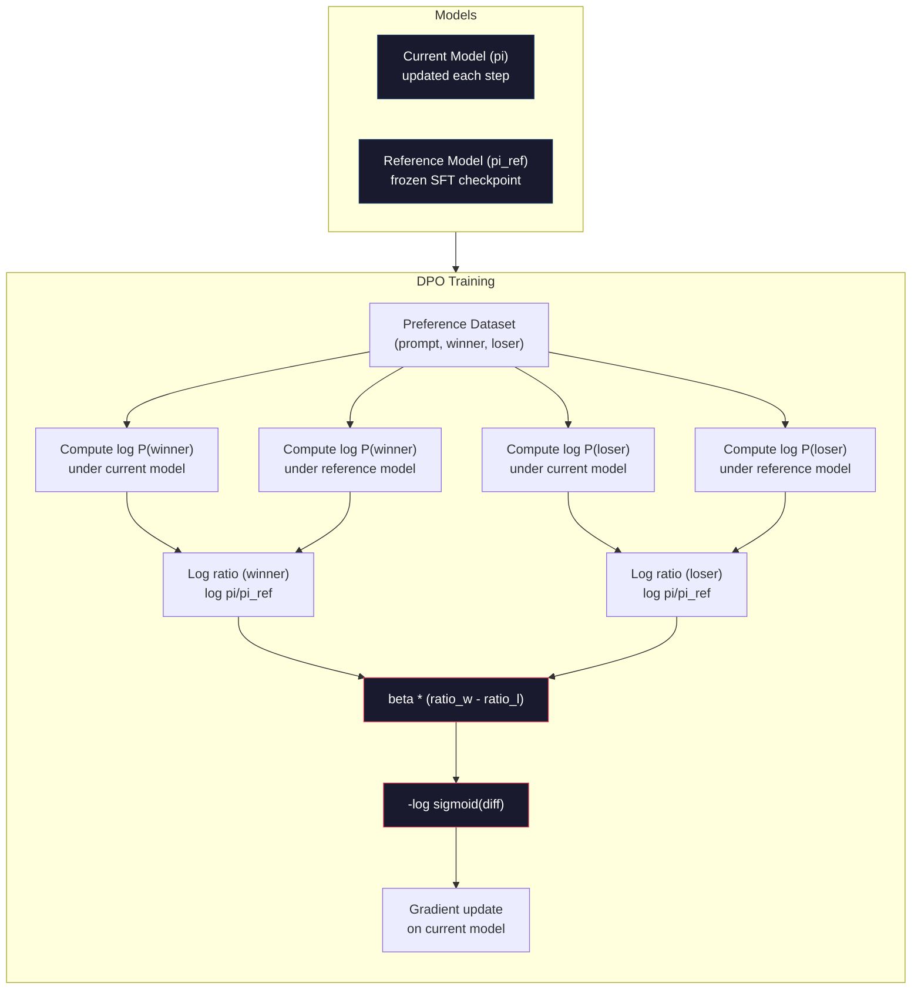

# DPO：直接偏好优化

> RLHF 有效。它也要训练三个模型（SFT、奖励模型、策略）、应付 PPO 的不稳定、调一个 KL 惩罚。DPO 问：要是你能把这些全跳过呢？DPO 直接在偏好对上优化语言模型。没有奖励模型。没有 PPO。一个训练循环。同样的结果。

**类型：** Build
**语言：** Python（配合 numpy）
**前置要求：** 阶段 10，第 07 课（RLHF）
**预计时间：** ~90 分钟

## 学习目标

- 实现 DPO 训练，无需单独的奖励模型，直接在偏好对上优化语言模型
- 推导 DPO 损失函数，并解释它如何通过策略的对数概率隐式地表示一个奖励模型
- 在训练稳定性、算力成本和所需模型数量上对比 DPO vs RLHF
- 调整 beta 参数来控制训练后的策略偏离参考模型多远

## 问题所在

你在第 07 课搭了一条 RLHF 流水线。三个阶段。三个模型。SFT 模型、奖励模型，以及用 PPO 优化的策略模型。光奖励模型就需要数千对人类偏好和一个单独的训练循环。PPO 需要仔细调 KL 系数、学习率、裁剪比率和 epoch 数。

实践中，PPO 训练以不稳定著称。超参数稍微一动，训练就发散。奖励模型是人类偏好的不完美代理，策略会想方设法利用它的弱点。KL 惩罚有帮助，但它本身又要调——太低你就得到奖励作弊，太高模型几乎学不动。

正是这种复杂性，让大多数开源模型在 InstructGPT 发表之后好几年里都在 RLHF 上挣扎。三阶段流水线很脆弱。每个阶段都有自己的失败模式，错误会层层叠加。

2023 年 5 月，斯坦福的 Rafael Rafailov、Archit Sharma 及其同事发表了 "Direct Preference Optimization: Your Language Model is Secretly a Reward Model"。关键洞见：你不需要一个单独的奖励模型。最优奖励函数在数学上由语言模型自己的 token 概率决定。你可以完全跳过奖励模型，直接在偏好对上优化语言模型。

DPO 把 RLHF 化简成单个监督学习步骤。一个模型。一个损失函数。一个训练循环。没有强化学习。Zephyr-7B 是最早大规模使用 DPO 的模型之一，在好几个基准上匹敌甚至打败了用完整 RLHF 训练的模型。Meta 把 DPO 用作 Llama 3 对齐流水线的一部分。Anthropic 在他们的对齐研究里引用过 DPO 风格的方法。

## 核心概念

### 关键洞见

RLHF 优化这个目标：

```
maximize: E[R(x, y)] - beta * KL(pi || pi_ref)
```

其中 R 是奖励模型，pi 是策略，pi_ref 是参考模型，beta 是 KL 系数。

DPO 论文表明这个目标有一个闭式最优解。对任意奖励函数 R，最优策略是：

```
pi*(y | x) = pi_ref(y | x) * exp(R(x, y) / beta) / Z(x)
```

其中 Z(x) 是一个归一化常数。重新整理：

```
R(x, y) = beta * log(pi*(y | x) / pi_ref(y | x)) + beta * log Z(x)
```

这就是突破。奖励完全用策略模型的概率和参考模型的概率来表达。你不需要训练一个单独的奖励模型。奖励 *隐含* 在那个概率比里。

把它代入 Bradley-Terry 偏好模型：

```
P(y_w > y_l | x) = sigmoid(R(x, y_w) - R(x, y_l))
                  = sigmoid(beta * (log pi(y_w|x)/pi_ref(y_w|x) - log pi(y_l|x)/pi_ref(y_l|x)))
```

Z(x) 项抵消了，因为两个回复都以同一个 prompt x 为条件。剩下的，是一个只依赖策略模型在 preferred 和 rejected 回复上的对数概率、以及参考模型对数概率的函数。

### DPO 损失

```
L_DPO = -log(sigmoid(beta * (log pi(y_w|x)/pi_ref(y_w|x) - log pi(y_l|x)/pi_ref(y_l|x))))
```

我们逐块拆解：

- **y_w** = preferred（胜出）回复
- **y_l** = rejected（落败）回复
- **x** = prompt
- **pi** = 当前模型（正在训练）
- **pi_ref** = 参考模型（冻结的 SFT checkpoint）
- **beta** = 控制偏离参考程度的温度参数（通常 0.1 到 0.5）

比率 `log pi(y|x) / pi_ref(y|x)` 是对数概率比。当这个比率为正，当前模型给回复 y 分配的概率高于参考。为负时，当前模型分配的概率更低。

DPO 损失推动模型为 preferred 回复增大对数概率比、为 rejected 回复减小它。beta 参数控制模型偏离参考能有多激进——小 beta 意味着允许大幅偏离，大 beta 让模型靠近参考。



### DPO 为什么更简单

| 方面 | RLHF（PPO） | DPO |
|--------|-----------|-----|
| 要训练的模型 | 3 个（SFT + 奖励 + 策略） | 1 个（仅策略） |
| 训练循环 | 3 个（SFT、RM 训练、PPO） | 2 个（SFT、DPO） |
| 超参数 | lr、KL 系数、裁剪比率、RM lr、epoch x3 | lr、beta、epoch |
| 奖励模型 | 必需（单独训练） | 隐含在模型概率里 |
| RL 算法 | PPO（复杂、不稳定） | 监督学习（稳定） |
| GPU 显存 | PPO 期间内存里有 3-4 个模型 | 2 个模型（当前 + 参考） |
| 训练稳定性 | 对超参数敏感 | 鲁棒，和 SFT 类似 |

DPO 训练时内存里需要两个模型——当前模型和冻结的参考。RLHF 需要三个或四个：策略、参考、奖励模型，以及可选的价值函数 baseline。对一个 70B 模型，每份拷贝 FP16 下占 140GB。消除奖励模型带来的显存节省相当可观。

### 什么时候 DPO 胜过 RLHF

**小数据集。** 在 5,000-20,000 对偏好上，DPO 常常匹敌甚至超过 RLHF。RLHF 里的奖励模型需要足够数据来泛化——数据有限时，它过拟合并产出不可靠的奖励信号。DPO 根本不需要奖励模型，绕过了这个问题。

**算力有限。** DPO 大约只需完整 RLHF 三分之一的算力（一个训练循环而非三个）。对没有大 GPU 集群的团队，这是务实的选择。

**快速迭代。** 想试 10 个不同的偏好数据集看哪个产出最好的模型？DPO 让你每个实验几小时跑完。RLHF 要为每个数据集重训奖励模型。

### 什么时候 RLHF 胜过 DPO

**大规模训练。** 在 GPT-4 或 Claude 那种规模上，RLHF 的单独奖励模型能捕捉更细微的偏好信号。奖励模型扮演一个习得的损失函数，能适应复杂的质量标准。

**复杂的奖励信号。** 当 "更好" 涉及多个维度（有用性、无害性、诚实性），奖励模型能学到这种多目标权衡。DPO 把每个偏好对当成一个二元信号——一个更好、一个更差——而不建模为什么。

**迭代式对齐。** RLHF 流水线能用当前策略生成新回复、让人类打分、在一个在线循环里重训奖励模型。DPO 在一个固定的偏好对数据集上工作。Constitutional AI（Anthropic 的方法）大量利用了 RLHF 的这种迭代性质。

### DPO 之外：KTO、ORPO、SimPO

DPO 启发了一个简化对齐方法的家族。

**KTO（Kahneman-Tversky Optimization，2024）：** 你甚至不需要成对数据。KTO 用非成对反馈工作——只给每个回复标 "好" 或 "坏"，不用和另一个比。这极大简化了数据收集。不再给标注员看两个回复问 "哪个更好？"，而是给一个回复问 "这个好吗？" 损失函数套用前景理论里的损失厌恶：坏回复受的惩罚比好回复得的奖励更重。

**ORPO（Odds Ratio Preference Optimization，2024）：** 把 SFT 和对齐合进单个训练步骤。不是先做 SFT 再做 DPO，ORPO 修改 SFT 损失让它包含一个偏好信号。损失有两项：preferred 回复上的标准下一个 token 预测损失，加一个 odds ratio 项来拉大 preferred 和 rejected 回复概率之间的差距。一个训练循环而非两个。

**SimPO（Simple Preference Optimization，2024）：** 完全消除参考模型。不再对一个冻结参考计算对数概率比，SimPO 用回复的平均对数概率（按长度归一化）作为隐式奖励。这省显存（不需要参考模型）并简化训练。长度归一化防止模型偏好更短的回复。

| 方法 | 年份 | 内存中的模型 | 需要成对？ | 需要参考？ | 训练循环 |
|--------|------|-----------------|-------------|-----------------|----------------|
| RLHF | 2022 | 3-4 | 是（为了 RM） | 是 | 3 |
| DPO | 2023 | 2 | 是 | 是 | 2 |
| KTO | 2024 | 2 | 否（非成对） | 是 | 2 |
| ORPO | 2024 | 1 | 是 | 否 | 1 |
| SimPO | 2024 | 1 | 是 | 否 | 1 |

趋势很清楚：每种方法都消除多一块复杂性。RLHF 需要奖励模型和 PPO。DPO 消除了两者。KTO 消除了成对数据。ORPO 消除了单独的 SFT 阶段。SimPO 消除了参考模型。对齐税——从基座模型走到对齐模型的算力和复杂性成本——持续下降。

### 真实的 DPO 部署

**Zephyr-7B（HuggingFace，2023 年 10 月）：** Mistral 7B 基座，在 UltraChat（20 万个例子）上做 SFT，然后在 UltraFeedback（6 万对偏好）上做 DPO。在 MT-Bench 上得 6.47——当时最高的 7B 模型。作为对比，Llama 2 Chat 70B 得 6.86，意味着 Zephyr 仅靠 DPO 对齐就追到了一个比它大 10 倍的模型的 6% 以内。

**Llama 3（Meta，2024 年 4 月）：** 在初始 RLHF 阶段之后用了 DPO。这个组合暗示 DPO 和 RLHF 能互补——RLHF 做广义对齐，DPO 做定向精炼。

**Neural Magic / nm-chat（2024）：** 把 DPO 应用到多个开源模型上，在对齐基准上相比仅 SFT 的基线持续显示 5-15% 的提升。

## 动手构建

### 第 1 步：偏好数据集

格式和 RLHF 一样——(prompt, preferred, rejected) 三元组。DPO 直接消费这些数据，不经过中间的奖励模型。

```python
import numpy as np
import sys
import os
sys.path.insert(0, os.path.join(os.path.dirname(__file__), "..", "..", "04-pre-training-mini-gpt", "code"))
from main import MiniGPT, LayerNorm, Embedding, TransformerBlock

PREFERENCE_DATA = [
    {
        "prompt": "What is the capital of France?",
        "preferred": "The capital of France is Paris.",
        "rejected": "France is a country in Europe. It has many cities. The capital is Paris. Paris is known for the Eiffel Tower.",
    },
    {
        "prompt": "Explain gravity in one sentence.",
        "preferred": "Gravity is the force that attracts objects with mass toward each other.",
        "rejected": "Gravity is something that makes things fall down when you drop them.",
    },
    {
        "prompt": "What is 15 times 7?",
        "preferred": "15 times 7 is 105.",
        "rejected": "Let me think about this. 15 times 7. Well, 10 times 7 is 70, and 5 times 7 is 35, so the answer might be around 105.",
    },
    {
        "prompt": "Name three programming languages.",
        "preferred": "Python, Rust, and TypeScript.",
        "rejected": "There are many programming languages. Some popular ones include various languages like Python and others.",
    },
    {
        "prompt": "What year did World War II end?",
        "preferred": "World War II ended in 1945.",
        "rejected": "World War II was a major global conflict. It involved many countries. The war ended in the mid-1940s, specifically in 1945.",
    },
    {
        "prompt": "Define machine learning.",
        "preferred": "Machine learning is a field where algorithms learn patterns from data to make predictions without being explicitly programmed.",
        "rejected": "Machine learning is a type of AI. AI stands for artificial intelligence. Machine learning uses data to learn.",
    },
]
```

### 第 2 步：序列对数概率

DPO 损失需要计算给定 prompt 时一个回复的总对数概率。这意味着把模型跑在完整的（prompt + 回复）序列上，并把每个回复 token 的对数概率求和。

```python
def tokenize_sequence(text, vocab_size=256):
    return [min(t, vocab_size - 1) for t in list(text.encode("utf-8"))]


def compute_sequence_log_prob(model, prompt_tokens, response_tokens, max_seq_len=128):
    full_sequence = prompt_tokens + response_tokens
    if len(full_sequence) > max_seq_len:
        full_sequence = full_sequence[:max_seq_len]

    if len(full_sequence) < 2:
        return 0.0

    input_ids = np.array(full_sequence[:-1]).reshape(1, -1)
    target_ids = np.array(full_sequence[1:])

    logits = model.forward(input_ids)
    logits = logits[0]

    max_logits = logits.max(axis=-1, keepdims=True)
    log_probs = logits - max_logits - np.log(
        np.exp(logits - max_logits).sum(axis=-1, keepdims=True)
    )

    prompt_len = len(prompt_tokens)
    response_start = max(0, prompt_len - 1)
    response_end = len(target_ids)

    if response_start >= response_end:
        return 0.0

    response_log_probs = log_probs[response_start:response_end, :]
    response_targets = target_ids[response_start:response_end]

    total_log_prob = 0.0
    for i, target in enumerate(response_targets):
        total_log_prob += response_log_probs[i, target]

    return total_log_prob
```

这个函数是 DPO 的主力。对每个偏好对，它跑四次：模型在 preferred 回复上、模型在 rejected 回复上、参考在 preferred 回复上、参考在 rejected 回复上。也就是每个训练样本 4 次前向传播，对比 RLHF 的 生成 + 奖励打分 + 价值估计 + PPO 更新。更简单、更快、更稳定。

### 第 3 步：DPO 损失

论文核心化成代码。一个函数。一个损失。没有奖励模型。

```python
def sigmoid(x):
    return np.where(
        x >= 0,
        1.0 / (1.0 + np.exp(-x)),
        np.exp(x) / (1.0 + np.exp(x))
    )


def dpo_loss(policy_logprob_preferred, policy_logprob_rejected,
             ref_logprob_preferred, ref_logprob_rejected, beta=0.1):
    preferred_ratio = policy_logprob_preferred - ref_logprob_preferred
    rejected_ratio = policy_logprob_rejected - ref_logprob_rejected

    logit = beta * (preferred_ratio - rejected_ratio)

    loss = -np.log(sigmoid(logit) + 1e-8)

    preferred_reward = beta * preferred_ratio
    rejected_reward = beta * rejected_ratio

    return loss, {
        "preferred_ratio": float(preferred_ratio),
        "rejected_ratio": float(rejected_ratio),
        "logit": float(logit),
        "implicit_preferred_reward": float(preferred_reward),
        "implicit_rejected_reward": float(rejected_reward),
        "reward_margin": float(preferred_reward - rejected_reward),
    }
```

`preferred_ratio` 和 `rejected_ratio` 是 DPO 推导里的对数概率比。当当前模型给 preferred 回复分配更高概率（相对参考）、给 rejected 回复分配更低概率时，logit 为正，损失低。训练信号正好把模型往这个方向推。

`implicit_preferred_reward` 和 `implicit_rejected_reward` 是 DPO 损失隐式分配的奖励。你可以把它们提取出来验证训练在起作用——preferred 和 rejected 奖励之间的间隔应该随训练增大。

### 第 4 步：DPO 训练循环

一个标准的监督训练循环。没有 PPO。没有奖励模型。只有前向传播和梯度更新。

```python
def copy_model_weights(source, target):
    target.embedding.token_embed = source.embedding.token_embed.copy()
    target.embedding.pos_embed = source.embedding.pos_embed.copy()
    target.ln_f.gamma = source.ln_f.gamma.copy()
    target.ln_f.beta = source.ln_f.beta.copy()
    for s_block, t_block in zip(source.blocks, target.blocks):
        t_block.attn.W_q = s_block.attn.W_q.copy()
        t_block.attn.W_k = s_block.attn.W_k.copy()
        t_block.attn.W_v = s_block.attn.W_v.copy()
        t_block.attn.W_out = s_block.attn.W_out.copy()
        t_block.ffn.W1 = s_block.ffn.W1.copy()
        t_block.ffn.W2 = s_block.ffn.W2.copy()
        t_block.ffn.b1 = s_block.ffn.b1.copy()
        t_block.ffn.b2 = s_block.ffn.b2.copy()
        t_block.ln1.gamma = s_block.ln1.gamma.copy()
        t_block.ln1.beta = s_block.ln1.beta.copy()
        t_block.ln2.gamma = s_block.ln2.gamma.copy()
        t_block.ln2.beta = s_block.ln2.beta.copy()


def dpo_train(policy_model, reference_model, preference_data,
              num_epochs=5, lr=5e-6, beta=0.1, max_seq_len=128):
    print(f"DPO Training: {len(preference_data)} pairs, {num_epochs} epochs, "
          f"lr={lr}, beta={beta}")
    print()

    losses = []
    margins = []

    for epoch in range(num_epochs):
        epoch_loss = 0.0
        epoch_margin = 0.0
        num_examples = 0

        indices = np.random.permutation(len(preference_data))

        for idx in indices:
            pair = preference_data[idx]

            prompt_tokens = tokenize_sequence(pair["prompt"])
            preferred_tokens = tokenize_sequence(pair["preferred"])
            rejected_tokens = tokenize_sequence(pair["rejected"])

            pi_logprob_w = compute_sequence_log_prob(
                policy_model, prompt_tokens, preferred_tokens, max_seq_len
            )
            pi_logprob_l = compute_sequence_log_prob(
                policy_model, prompt_tokens, rejected_tokens, max_seq_len
            )
            ref_logprob_w = compute_sequence_log_prob(
                reference_model, prompt_tokens, preferred_tokens, max_seq_len
            )
            ref_logprob_l = compute_sequence_log_prob(
                reference_model, prompt_tokens, rejected_tokens, max_seq_len
            )

            loss, metrics = dpo_loss(
                pi_logprob_w, pi_logprob_l,
                ref_logprob_w, ref_logprob_l, beta
            )

            update_direction = 1.0 if metrics["logit"] < 0 else -0.1
            for block in policy_model.blocks:
                block.ffn.W1 += lr * update_direction * np.random.randn(*block.ffn.W1.shape) * 0.01
                block.ffn.W2 += lr * update_direction * np.random.randn(*block.ffn.W2.shape) * 0.01

            epoch_loss += loss
            epoch_margin += metrics["reward_margin"]
            num_examples += 1
            losses.append(float(loss))
            margins.append(metrics["reward_margin"])

        avg_loss = epoch_loss / max(num_examples, 1)
        avg_margin = epoch_margin / max(num_examples, 1)

        print(f"  Epoch {epoch + 1}/{num_epochs} | Loss: {avg_loss:.4f} | "
              f"Avg Margin: {avg_margin:.4f}")

    return policy_model, losses, margins
```

和 RLHF 相比，这个训练循环简单得让人耳目一新。对每个偏好对：计算四个对数概率（两个模型、两个回复），代入 DPO 损失，计算梯度，更新策略。没有生成步骤。没有奖励模型推理。没有 advantage 估计。没有裁剪。

### 第 5 步：对比 DPO vs RLHF

度量隐式奖励间隔和对数概率偏移，把 DPO 和第 07 课的 RLHF 模型对比。

```python
def evaluate_preference_accuracy(model, reference_model, preference_data, beta=0.1, max_seq_len=128):
    correct = 0
    total = 0

    for pair in preference_data:
        prompt_tokens = tokenize_sequence(pair["prompt"])
        preferred_tokens = tokenize_sequence(pair["preferred"])
        rejected_tokens = tokenize_sequence(pair["rejected"])

        pi_w = compute_sequence_log_prob(model, prompt_tokens, preferred_tokens, max_seq_len)
        pi_l = compute_sequence_log_prob(model, prompt_tokens, rejected_tokens, max_seq_len)
        ref_w = compute_sequence_log_prob(reference_model, prompt_tokens, preferred_tokens, max_seq_len)
        ref_l = compute_sequence_log_prob(reference_model, prompt_tokens, rejected_tokens, max_seq_len)

        preferred_reward = beta * (pi_w - ref_w)
        rejected_reward = beta * (pi_l - ref_l)

        if preferred_reward > rejected_reward:
            correct += 1
        total += 1

    return correct / max(total, 1)


def analyze_implicit_rewards(model, reference_model, preference_data, beta=0.1, max_seq_len=128):
    print("Implicit Reward Analysis:")
    print("-" * 65)
    print(f"  {'Prompt':<30} {'Pref Reward':>12} {'Rej Reward':>12} {'Margin':>10}")
    print("  " + "-" * 60)

    for pair in preference_data:
        prompt_tokens = tokenize_sequence(pair["prompt"])
        preferred_tokens = tokenize_sequence(pair["preferred"])
        rejected_tokens = tokenize_sequence(pair["rejected"])

        pi_w = compute_sequence_log_prob(model, prompt_tokens, preferred_tokens, max_seq_len)
        pi_l = compute_sequence_log_prob(model, prompt_tokens, rejected_tokens, max_seq_len)
        ref_w = compute_sequence_log_prob(reference_model, prompt_tokens, preferred_tokens, max_seq_len)
        ref_l = compute_sequence_log_prob(reference_model, prompt_tokens, rejected_tokens, max_seq_len)

        pref_reward = beta * (pi_w - ref_w)
        rej_reward = beta * (pi_l - ref_l)
        margin = pref_reward - rej_reward

        truncated = pair["prompt"][:28] + ".." if len(pair["prompt"]) > 30 else pair["prompt"]
        print(f"  {truncated:<30} {pref_reward:>12.4f} {rej_reward:>12.4f} {margin:>10.4f}")

    print()
```

### 第 6 步：beta 敏感度分析

beta 参数是 DPO 里对应 RLHF KL 系数的东西。它控制模型能偏离参考多少。这个实验展示它的效果。

```python
def beta_sensitivity_analysis(sft_model, preference_data, betas, max_seq_len=128):
    print("Beta Sensitivity Analysis")
    print("-" * 60)
    print(f"  {'Beta':>8} {'Final Loss':>12} {'Final Margin':>14} {'Accuracy':>10}")
    print("  " + "-" * 55)

    results = []

    for beta in betas:
        policy = MiniGPT(
            vocab_size=256, embed_dim=128, num_heads=4,
            num_layers=4, max_seq_len=max_seq_len, ff_dim=512
        )
        reference = MiniGPT(
            vocab_size=256, embed_dim=128, num_heads=4,
            num_layers=4, max_seq_len=max_seq_len, ff_dim=512
        )
        copy_model_weights(sft_model, policy)
        copy_model_weights(sft_model, reference)

        policy, losses, margins_list = dpo_train(
            policy, reference, preference_data,
            num_epochs=3, lr=5e-6, beta=beta, max_seq_len=max_seq_len
        )

        accuracy = evaluate_preference_accuracy(
            policy, reference, preference_data, beta, max_seq_len
        )

        final_loss = losses[-1] if losses else 0
        final_margin = margins_list[-1] if margins_list else 0

        print(f"  {beta:>8.3f} {final_loss:>12.4f} {final_margin:>14.4f} {accuracy:>10.1%}")
        results.append({
            "beta": beta,
            "final_loss": final_loss,
            "final_margin": final_margin,
            "accuracy": accuracy,
        })

        print()

    return results
```

小 beta（0.01）让模型自由偏离参考——学得快但有退化解的风险。大 beta（1.0）让模型靠近参考——稳定但学得慢。对大多数应用，甜点区是 0.1 到 0.3。

## 上手使用

### 完整 DPO 流水线演示

```python
if __name__ == "__main__":
    np.random.seed(42)

    print("=" * 70)
    print("DPO: DIRECT PREFERENCE OPTIMIZATION")
    print("=" * 70)
    print()

    print("STEP 1: Initialize SFT Model (from Lesson 06)")
    print("-" * 50)
    sft_model = MiniGPT(
        vocab_size=256, embed_dim=128, num_heads=4,
        num_layers=4, max_seq_len=128, ff_dim=512
    )
    print(f"  Parameters: {sft_model.count_parameters():,}")
    print()

    print("STEP 2: DPO Training")
    print("-" * 50)

    policy_model = MiniGPT(
        vocab_size=256, embed_dim=128, num_heads=4,
        num_layers=4, max_seq_len=128, ff_dim=512
    )
    reference_model = MiniGPT(
        vocab_size=256, embed_dim=128, num_heads=4,
        num_layers=4, max_seq_len=128, ff_dim=512
    )
    copy_model_weights(sft_model, policy_model)
    copy_model_weights(sft_model, reference_model)

    policy_model, losses, margins = dpo_train(
        policy_model, reference_model, PREFERENCE_DATA,
        num_epochs=5, lr=5e-6, beta=0.1
    )
    print()

    print("=" * 70)
    print("STEP 3: Evaluate")
    print("=" * 70)
    print()

    pre_accuracy = evaluate_preference_accuracy(
        sft_model, reference_model, PREFERENCE_DATA, beta=0.1
    )
    post_accuracy = evaluate_preference_accuracy(
        policy_model, reference_model, PREFERENCE_DATA, beta=0.1
    )

    print(f"  Preference accuracy (pre-DPO):  {pre_accuracy:.1%}")
    print(f"  Preference accuracy (post-DPO): {post_accuracy:.1%}")
    print()

    analyze_implicit_rewards(policy_model, reference_model, PREFERENCE_DATA, beta=0.1)

    print("=" * 70)
    print("STEP 4: Training Dynamics")
    print("=" * 70)
    print()

    if losses:
        print("  Loss curve:")
        window = max(1, len(losses) // 5)
        for i in range(0, len(losses), window):
            chunk = losses[i:i + window]
            avg = sum(chunk) / len(chunk)
            print(f"    Steps {i:3d}-{i + len(chunk) - 1:3d}: loss = {avg:.4f}")
        print()

    if margins:
        print("  Reward margin curve:")
        window = max(1, len(margins) // 5)
        for i in range(0, len(margins), window):
            chunk = margins[i:i + window]
            avg = sum(chunk) / len(chunk)
            print(f"    Steps {i:3d}-{i + len(chunk) - 1:3d}: margin = {avg:.4f}")
        print()

    print("=" * 70)
    print("STEP 5: Beta Sensitivity")
    print("=" * 70)
    print()

    beta_results = beta_sensitivity_analysis(
        sft_model, PREFERENCE_DATA, betas=[0.01, 0.1, 0.3, 1.0]
    )

    print("=" * 70)
    print("DPO vs RLHF COMPARISON")
    print("=" * 70)
    print()
    print("  DPO advantages:")
    print("    - 1 training loop (vs 3 for RLHF)")
    print("    - 2 models in memory (vs 3-4 for RLHF)")
    print("    - Supervised learning (vs RL, more stable)")
    print("    - No reward model to train or maintain")
    print()
    print("  RLHF advantages:")
    print("    - Separate reward model captures complex preferences")
    print("    - Online learning: generate, rate, retrain")
    print("    - Better for multi-objective alignment")
    print("    - Proven at largest scales (GPT-4, Claude)")
    print()
    print("  Practical guidance:")
    print("    - Start with DPO. It's simpler and often sufficient.")
    print("    - Switch to RLHF if DPO plateaus on your eval metrics.")
    print("    - Many production systems use both: RLHF first, DPO to refine.")
```

## 交付

本节课产出 `outputs/prompt-alignment-method-selector.md`——一个 prompt，帮你为你的用例选对对齐方法（SFT、RLHF、DPO、KTO、ORPO、SimPO）。给定你的数据可得性、算力预算和对齐目标，它推荐一个方法和训练计划。

## 练习

1. 实现 KTO（Kahneman-Tversky Optimization）。KTO 不需要成对——只给每个回复标 "好" 或 "坏"。好回复的损失是 `-log(sigmoid(beta * log_ratio))`，坏回复的损失是 `-log(1 - sigmoid(beta * log_ratio))`，并在坏回复损失上乘一个损失厌恶系数（通常 1.5 倍）。在同一份数据上训练（把 preferred 独立当成 "好"、rejected 当成 "坏"），把准确率和 DPO 对比。

2. 实现长度归一化的 DPO。不用原始对数概率，而是除以回复 token 数：`normalized_logprob = total_logprob / num_tokens`。这防止模型偏好更短的回复（它们总对数概率更高）。对比有无归一化时的隐式奖励间隔。

3. 做一个 ORPO 风格的组合损失。在 DPO 损失上加一个 preferred 回复的标准下一个 token 预测损失：`L = L_sft(preferred) + alpha * L_dpo`。试 alpha 值 0.1、0.5、1.0。组合损失应该产出一个既跟随指令（来自 SFT 项）又偏好更好回复（来自 DPO 项）的模型，省掉单独的 SFT 阶段。

4. 实现迭代式 DPO。跑 3 个 epoch 的 DPO，然后从训练后的模型生成新回复，把它们和原始 preferred 回复配成新偏好对，再跑一遍 DPO。这个 "自我对弈" 过程做两轮。对比第 1 轮和第 2 轮后的偏好准确率，看迭代精炼是否有帮助。

5. 对比用不同参考模型的 DPO。不用 SFT checkpoint 作参考，试：(a) 基座模型（SFT 之前），(b) DPO 第 1 个 epoch 的 checkpoint，(c) 策略模型的指数滑动平均。报告哪个参考产出最高的偏好准确率和最稳定的训练曲线。

## 关键术语

| 术语 | 人们怎么说 | 它实际是什么 |
|------|----------------|----------------------|
| DPO | "没有 RL 的 RLHF" | 直接偏好优化：一个监督学习算法，直接在偏好对上优化语言模型，绕过奖励模型和 PPO |
| 隐式奖励 | "奖励在模型里" | 奖励函数由策略和参考模型之间的对数概率比决定——不需要单独的奖励模型 |
| Beta（DPO） | "那个温度" | 控制策略能偏离参考模型多远——小 beta 允许大幅偏离，大 beta 让模型靠近 |
| 对数概率比 | "模型变了多少" | log pi(y\|x) - log pi_ref(y\|x)——为正意味着当前模型分配的概率高于参考 |
| 参考模型 | "那个冻结的 checkpoint" | SFT 模型的一份拷贝，权重永不改变——作为计算概率比的锚点 |
| KTO | "没有成对的 DPO" | Kahneman-Tversky Optimization：用非成对的 "好" 或 "坏" 标签工作，而不需要偏好对 |
| ORPO | "一步对齐" | Odds Ratio Preference Optimization：通过给 SFT 损失加一个偏好项，把 SFT 和对齐合进一个训练循环 |
| SimPO | "不需要参考" | Simple Preference Optimization：用长度归一化的平均对数概率作为隐式奖励，消除参考模型 |
| 对齐税 | "让模型安全的成本" | 从基座模型走到对齐模型所需的额外算力、数据和复杂性——DPO 显著降低了它 |

## 延伸阅读

- [Rafailov et al., 2023 -- "Direct Preference Optimization: Your Language Model is Secretly a Reward Model"](https://arxiv.org/abs/2305.18290) -- 把对齐从 RLHF 简化为监督学习的 DPO 论文
- [Tunstall et al., 2023 -- "Zephyr: Direct Distillation of LM Alignment"](https://arxiv.org/abs/2310.16944) -- Zephyr-7B，展示在 UltraFeedback 上做 DPO 能在基准上匹敌 RLHF
- [Ethayarajh et al., 2024 -- "KTO: Model Alignment as Prospect Theoretic Optimization"](https://arxiv.org/abs/2402.01306) -- 消除对成对偏好的需求
- [Hong et al., 2024 -- "ORPO: Monolithic Preference Optimization without Reference Model"](https://arxiv.org/abs/2403.07691) -- 把 SFT 和对齐合进一步
- [Meng et al., 2024 -- "SimPO: Simple Preference Optimization with a Reference-Free Reward"](https://arxiv.org/abs/2405.14734) -- 完全消除参考模型
- [Llama 3 Technical Report](https://arxiv.org/abs/2407.21783) -- Meta 结合 RLHF 和 DPO 的对齐流水线
