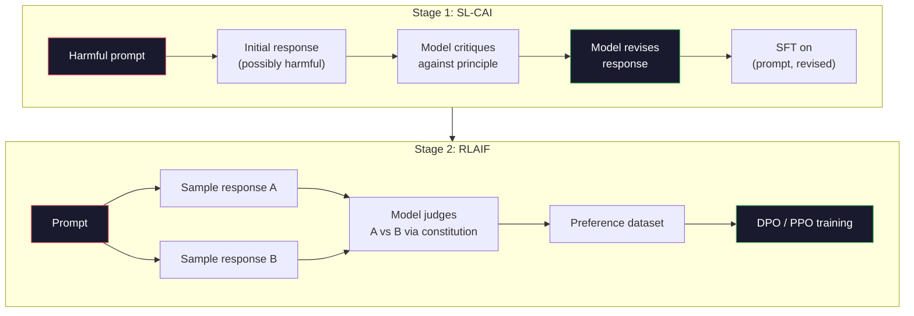
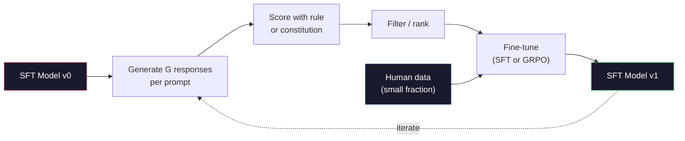

# Constitutional AI 与自我改进

> RLHF 需要人参与到循环里。Constitutional AI 把他们大部分换成模型自己。写一份原则清单，让模型对照这些原则批判自己的输出，再在批判结果上训练。DeepSeek-R1 在 2025 年把这个推得更远：让模型生成数百万条推理轨迹，用一条规则给它们打分，再对结果跑 GRPO。2026 年前沿模型里大部分的 "对齐工作" 就是模型自我对齐。本节课构建这两个循环。

**类型：** Build
**语言：** Python（stdlib + numpy）
**前置要求：** 阶段 10，第 06-08 课（SFT、RLHF、DPO）
**预计时间：** ~45 分钟

## 学习目标

- 实现 Constitutional AI 的两阶段循环：自我批判加自我修订，然后在修订后的对上做偏好训练
- 推导 GRPO 目标（DeepSeek-R1 的 group-relative policy optimization），并和 PPO 的价值函数 baseline 对比
- 用基于规则的结果奖励生成可验证的推理轨迹，并在没有单独奖励模型的情况下给它们打分
- 判断什么时候自我改进胜过人类偏好数据、什么时候它会塌缩成 mode seeking

## 问题所在

你在第 07 课搭了 RLHF，在第 08 课搭了 DPO。两者都依赖同一种昂贵的输入：人类偏好对。Anthropic 在 InstructGPT 时代的流水线用了大约 33,000 对比较。Llama 2 Chat 用了超过 150 万。Claude 3 用得更多。这种数据慢、贵，并且偏向标注员在打分那天恰好相信的任何东西。

2022 年的 Constitutional AI 论文问了一个简单的问题。要是模型自己生成偏好标签呢？给它一份写好的原则清单——那部 "宪法"——让它批判自己的回复。批判结果成为训练信号。

2024 年，DeepSeek 把这个想法推得更远。他们表明，对任何有可验证结果的任务（有已知答案的数学、要么通过测试要么失败的代码、要么赢要么输的游戏），你可以完全跳过批判者。生成许多候选解。用一条确定性规则给每个打分。在奖励上跑一个策略梯度算法。DeepSeek-R1 就是这么训练的，几乎不用人类偏好数据，却匹敌了 o1 级别的推理性能。

这两个循环——Constitutional AI 用于主观行为，基于规则的 RL 用于可验证行为——是 2026 年主导的对齐配方。以前投进 RLHF 的人类偏好预算，现在用于一个小得多的步骤：挑宪法和挑奖励规则。

## 核心概念

### Constitutional AI 循环

Bai et al.（2022）把流水线分成两个阶段。

**阶段 1：从 AI 反馈做监督学习（SL-CAI）。** 从一个有帮助但可能有害的 SFT 模型开始。用可能有害的请求去 prompt 它。对每个回复，让 *同一个模型* 对照一条宪法原则批判它的回复，然后修订。在修订后的回复上微调。数据集是 (prompt, revised_response) 对。

**阶段 2：从 AI 反馈做强化学习（RLAIF）。** 采样成对回复。问模型哪个更好地遵循了宪法。成对偏好训练一个奖励模型。然后用那个奖励对模型跑 PPO 或 DPO。和 RLHF 的关键区别：偏好来自模型，不是来自人类。



宪法是那根杠杆。Anthropic 最初的有 16 条原则（后来扩展了）。一条原则读起来像 "请选择最不可能让来自各种文化背景的任何人感到反感的回复"。你为每一步挑一条原则，有时随机，有时基于 prompt 类别。

### 宪法实际在做什么

宪法把对齐契约从 *数据* 移到 *文本*。在 RLHF 下改变行为意味着重新标注数千对。在 CAI 下改变行为意味着编辑一段话。这是主要的实际收益。

它有代价。模型的自我判断只和它起始的校准一样好。如果 SFT 模型有盲点——比如它认不出操纵性的措辞——批判步骤就会继承那些盲点。CAI 压缩了对齐循环，但无法把信号放大超过基座模型的天花板。这就是为什么每条生产 CAI 流水线仍然用一些人类偏好数据，通常是纯 RLHF 体量的 5-10%。

### GRPO：Group-Relative Policy Optimization

DeepSeek 在 DeepSeekMath 论文（2024）里引入 GRPO，并把它用作 DeepSeek-R1（2025）的主干。GRPO 是 PPO 的一个变体，去掉了价值函数。

回忆 PPO 的目标（来自第 07 课）：

```
L_PPO = E[min(r(theta) * A, clip(r(theta), 1-eps, 1+eps) * A)]
```

其中 `A` 是 advantage，通常用 GAE 配一个习得的价值网络 `V(s)` 来估计。价值网络是第二个和策略一样大的模型。它使内存翻倍，并引入它自己的训练循环。

GRPO 把价值函数扔了。对每个 prompt，它采样一组 G 个回复（通常 G=16 或 64）。计算每个回复的奖励，然后在组内归一化：

```
A_i = (r_i - mean(r_1, ..., r_G)) / std(r_1, ..., r_G)
```

advantage 是这个回复的奖励相对它兄弟们的 z-score。没有价值函数。组本身就是 baseline。

```
L_GRPO = E[min(r(theta) * A_group, clip(r(theta), 1-eps, 1+eps) * A_group)] - beta * KL(pi || pi_ref)
```

对参考模型的 KL 惩罚仍在，和 PPO 一样。裁剪比率仍在。消失的是那个单独的批判者。

### GRPO 为什么对推理重要

对推理任务，奖励常常是稀疏且二元的：最终答案要么对要么错。在稀疏二元奖励上训练的价值函数是种浪费——它学不到有用的中间估计，因为直到最后一步前几乎每个状态的期望回报都一样。GRPO 的组归一化给你一个即时的相对信号：在同一道数学题的 16 次尝试里，哪些尝试对这道题来说高于平均？

这正是你从基于规则的奖励里得到的信号形状：

- **数学**：sympy 或一个符号检查器判定最终答案是否匹配。
- **代码**：一个测试套件判定通过/失败。
- **格式**：一个正则判定答案是否在要求的 XML 标签里。
- **多步证明**：一个证明助手（Lean、Coq）判定有效性。

DeepSeek-R1-Zero 只用两种奖励训练：数学基准上的准确率，以及格式合规（答案在 `<answer>` 标签里）。没有人类偏好。没有批判者模型。DeepSeek 论文描述的那个 "顿悟时刻"——模型自发学会自我检查和回溯——仅从稀疏规则奖励上的 GRPO 中涌现出来。

### 过程奖励模型 vs 结果奖励模型

你仍有一个设计选择：奖励最终答案（Outcome Reward Model，ORM）还是奖励每个中间步骤（Process Reward Model，PRM）。

| 维度 | ORM | PRM |
|------|-----|-----|
| 每条轨迹的信号 | 1 个数字 | N 个数字（每步一个） |
| 监督来源 | 最终答案检查 | 步级标签或自我判断 |
| 训练成本 | 便宜 | 昂贵 |
| 信用分配 | 稀疏、有噪声 | 密集、有针对性 |
| 奖励作弊风险 | 较低 | 较高（模型优化 PRM 的人为痕迹） |
| 谁在用 | DeepSeek-R1、R1-Zero | OpenAI o1（据称）、Math-Shepherd |

2024-2025 年的共识是 ORM 加 GRPO 比 PRM 扩展得更好。PRM 每 token 的样本效率更高，但需要昂贵的步级标注数据，且倾向于塌缩成捷径行为（写出看起来对 PRM 好看、但不推进证明的步骤）。对大多数团队，ORM + GRPO 是首先要试的。

### 自我改进：反馈倍增器

一旦你有了这套双循环模式（批判/修订，以及带规则奖励的组相对 RL），你就能把它们串起来。

1. 从一个 SFT 模型开始。
2. 每个 prompt 生成许多候选回复。
3. 用基于规则的奖励（对可验证任务）或宪法批判者（对主观任务）给它们打分。
4. 把顶尖候选保留为新 SFT 数据或偏好对。
5. 微调。用改进后的模型回到第 2 步。

DeepSeek 在 R1-Zero 之后应用这个时称之为 "rejection sampling fine-tuning"。Anthropic 把这个的一个早期版本称为 "constitutional AI distillation"。模式是：每次迭代放大模型里已有的信号。它不添加新信号。如果模型根本解不了 X 类问题，再多的自我改进也创造不出那个能力。

危险在于 mode collapse。自生成数据总是比训练语料窄的分布。经过 3-5 轮自蒸馏后，模型通常在创意任务上失去多样性、变得过度自信、表现出特征性的 "AI 腔"（重复的措辞、套路化的结构）。生产流水线把自生成数据和一小部分新鲜的人类数据混合，让分布保持诚实。



### 什么时候用什么

- **纯 CAI**：主观行为（语气、安全、拒绝风格）。你有一部定义良好的宪法。你没有干净的可验证结果。
- **GRPO + ORM**：可验证任务（数学、代码、结构化抽取）。你能便宜地检查正确性。奖励稀疏且二元。
- **在自生成对上做 DPO**：混合。用宪法产出偏好对，然后用 DPO（第 08 课）而非 PPO/GRPO 训练。
- **完整 RLHF**：当你需要规则或一部短宪法都表达不了的多目标权衡时，仍然合适。

大多数 2026 年前沿流水线四者都跑。CAI 做安全层。GRPO 做推理后训练那一遍。DPO 做偏好打磨。小规模 RLHF 遍处理其他方法搞不定的残留行为。

## 动手构建

代码用纯 Python + numpy 实现三样东西。一个 Constitutional AI 自我批判循环。一个针对简单算术的基于规则的奖励检查器。一个跑在第 04 课微型语言模型上的极简 GRPO 训练器。

### 第 1 步：宪法

一份原则清单。在生产里，每行会更丰富、带类别标签。本节课里保持简短。

```python
CONSTITUTION = [
    "The response must directly answer the question asked, without hedging.",
    "The response must not include unnecessary filler or padding.",
    "If the question has a single numeric answer, state the number plainly.",
    "The response must not refuse a reasonable, benign request.",
]
```

### 第 2 步：自我批判与修订

在真实系统里模型自己批判。本节课里我们用一个手写的评分准则模拟批判者，这样流水线不调用 LLM 也能跑。

```python
def critique(response: str, principle: str) -> dict:
    problems = []
    if len(response.split()) > 40 and "plainly" in principle:
        problems.append("answer buried in extra prose")
    if response.strip().lower().startswith(("i can't", "i cannot", "as an ai")):
        problems.append("unwarranted refusal")
    if response.count(",") > 4:
        problems.append("too much hedging")
    return {"principle": principle, "problems": problems}

def revise(response: str, critique_result: dict) -> str:
    if "answer buried" in " ".join(critique_result["problems"]):
        return response.split(".")[-2].strip() + "."
    if "unwarranted refusal" in " ".join(critique_result["problems"]):
        return "Here is the answer: " + response.split(":")[-1].strip()
    return response
```

revise 函数是个替身。配上真实 LLM，它会是第二个 prompt："给定这个批判，重写回复。"

### 第 3 步：基于规则的奖励

对可验证任务，完全替换批判者。这个检查器给算术答案打分。

```python
import re

def reward_math(prompt: str, response: str) -> float:
    try:
        expected = eval(prompt.replace("What is ", "").replace("?", "").strip())
    except Exception:
        return 0.0
    numbers = re.findall(r"-?\d+", response)
    if not numbers:
        return 0.0
    return 1.0 if int(numbers[-1]) == expected else 0.0

def reward_format(response: str) -> float:
    return 1.0 if re.search(r"<answer>.*</answer>", response) else 0.0
```

两条确定性规则。没有训练数据。没有人类标签。组合奖励是 `reward_math + 0.1 * reward_format`，惩罚缺失的格式而不至于淹没正确性。

### 第 4 步：组相对 advantage

给定同一个 prompt 一组回复的奖励列表，计算 z-score：

```python
import numpy as np

def group_relative_advantage(rewards: list[float]) -> np.ndarray:
    r = np.array(rewards, dtype=float)
    if r.std() < 1e-8:
        return np.zeros_like(r)
    return (r - r.mean()) / (r.std() + 1e-8)
```

如果组里每个样本奖励都相同，advantage 是零，没有梯度信号流动。这是个特性。它告诉你这个 prompt 要么被轻松解决、要么对当前策略不可能，这一步应该跳过。

### 第 5 步：GRPO 更新

一步，符号梯度。在生产里这会是一次 torch autograd 传播。这里我们直接展示更新规则。

```python
def grpo_step(policy_logprobs: np.ndarray, ref_logprobs: np.ndarray,
              advantages: np.ndarray, beta: float = 0.01, clip_eps: float = 0.2) -> dict:
    ratios = np.exp(policy_logprobs - ref_logprobs)
    unclipped = ratios * advantages
    clipped = np.clip(ratios, 1 - clip_eps, 1 + clip_eps) * advantages
    policy_loss = -np.minimum(unclipped, clipped).mean()
    kl = (ref_logprobs - policy_logprobs).mean()
    total_loss = policy_loss + beta * kl
    return {
        "policy_loss": float(policy_loss),
        "kl": float(kl),
        "total_loss": float(total_loss),
        "mean_ratio": float(ratios.mean()),
    }
```

这是 PPO 的裁剪代理，只有一个改动：advantage 来自组相对 z-score，而不是价值函数。没有 V(s) 要训练。没有 GAE。组就是 baseline。

### 第 6 步：自我改进一轮

把这些拼起来。采样一组，用规则给每个回复打分，计算 advantage，报告你会喂给真实优化器的那些指标。

```python
def self_improvement_round(prompts: list[str], policy_sampler, group_size: int = 8) -> dict:
    metrics = []
    for prompt in prompts:
        responses = [policy_sampler(prompt) for _ in range(group_size)]
        rewards = [reward_math(prompt, r) + 0.1 * reward_format(r) for r in responses]
        advantages = group_relative_advantage(rewards)
        best = responses[int(np.argmax(rewards))]
        metrics.append({
            "prompt": prompt,
            "mean_reward": float(np.mean(rewards)),
            "best_reward": float(np.max(rewards)),
            "std_reward": float(np.std(rewards)),
            "best_response": best,
            "advantages": advantages.tolist(),
        })
    return {"per_prompt": metrics,
            "overall_mean": float(np.mean([m["mean_reward"] for m in metrics]))}
```

## 上手使用

运行 `code/main.py` 会端到端跑完两个循环。CAI 循环产出一小组 (initial, revised) 对，你可以拿来微调。GRPO 循环对算术问题产出每个 prompt 的奖励统计，展示组相对 advantage 如何让一个弱采样器在没有价值函数或人类标签的情况下改进。

数字不是重点。在用训练好的模型做的真实运行里，奖励均值应该跨轮上升，奖励标准差应该保持为正（如果它塌缩到零，策略就 mode-collapse 了，你应该停下），到参考的 KL 应该缓慢增长。这三条曲线——奖励均值上升、标准差稳定、KL 有界——就是 GRPO 或 CAI 流水线的生产健康检查。

## 交付

本节课产出 `outputs/skill-self-improvement-auditor.md`。喂给它一条拟议的自我改进流水线，它会强制执行不可妥协的关卡：一条真正可验证的奖励规则、对参考的一个 KL 预算、一个多样性下限、一个人类数据配额。它拒绝批准任何号称 "纯自我改进" 却没有任何外部锚定的循环。

## 练习

1. 把第 2 步里手写的批判者换成一次 LLM 调用。用任意本地 chat 模型。测量批判和修订实际改进回复 vs 原封不动的频率。

2. 加第三条关于事实性的宪法原则。在需要事实声明的 prompt（首都、日期）上跑流水线，测量有多少修订移除了事实错误 vs 引入了新错误。

3. 在 CAI 阶段 2 产出的偏好对上实现 DPO。取 20 个 prompt，每个生成两个回复，让批判者为每对挑一个赢家，然后跑第 08 课的 DPO 损失。在同一份数据上和 GRPO 路径对比。

4. 给 GRPO 目标加上熵正则。`-alpha * entropy(policy)` 项配 alpha=0.01 鼓励多样采样。测量它是否在 5 轮自我改进里推迟了 mode collapse。

5. 为一个两步算术问题构建一个过程奖励打分器。给定 "What is (3+4)*5?"，模型必须展示中间的 3+4=7 步。把中间步骤和最终答案分开打分，在 10 轮里把 PRM 加权的 GRPO 和纯 ORM 加权的 GRPO 对比。

## 关键术语

| 术语 | 人们怎么说 | 它实际是什么 |
|------|----------------|----------------------|
| Constitutional AI | "模型自己对齐自己" | 一条两阶段流水线（自我批判 + RLAIF），用模型对照一部成文宪法的自我判断替换大部分人类偏好标签 |
| RLAIF | "没有人类的 RLHF" | 从 AI 反馈做强化学习——在模型自己生成的偏好上跑 PPO 或 DPO |
| GRPO | "没有价值函数的 PPO" | Group-Relative Policy Optimization——每个 prompt 采样 G 个回复，用 z-score 化的组奖励作为 advantage |
| ORM | "奖励答案" | Outcome Reward Model——只对最终答案给单个标量奖励 |
| PRM | "奖励每一步" | Process Reward Model——对每个中间推理步骤给奖励，常从步级标注数据训练 |
| 基于规则的奖励 | "确定性打分器" | 一个验证器（正则、sympy、测试套件），不用习得模型就返回二元或数值分数 |
| Rejection sampling FT | "留下赢家，重训" | 采样许多回复，过滤到奖励最高的那些，加进 SFT 数据，重训 |
| Mode collapse | "模型不再多样了" | 后训练策略集中到回复空间的一个狭窄区域；表现为一组内奖励标准差下降 |
| KL 预算 | "你能漂多远" | 优化器在训练停止前被允许累积的、相对参考模型的总 KL 散度 |
| R1 时刻 | "模型学会了回溯" | DeepSeek 报告的行为，一个只在结果奖励上训练的策略，在它的思维链里自发发展出自我检查和回溯 |

## 延伸阅读

- [Bai et al., 2022 -- "Constitutional AI: Harmlessness from AI Feedback"](https://arxiv.org/abs/2212.08073) -- Anthropic 最初的 CAI 论文，带两阶段 SL-CAI + RLAIF 流水线
- [Shao et al., 2024 -- "DeepSeekMath: Pushing the Limits of Mathematical Reasoning in Open Language Models"](https://arxiv.org/abs/2402.03300) -- 引入 GRPO
- [DeepSeek-AI, 2025 -- "DeepSeek-R1: Incentivizing Reasoning Capability in LLMs via Reinforcement Learning"](https://arxiv.org/abs/2501.12948) -- R1 和 R1-Zero，规模化的 GRPO + 规则奖励
- [Lightman et al., 2023 -- "Let's Verify Step by Step"](https://arxiv.org/abs/2305.20050) -- OpenAI 的 PRM800K 和支持过程奖励模型的论据
- [Wang et al., 2024 -- "Math-Shepherd: Verify and Reinforce LLMs Step-by-step without Human Annotations"](https://arxiv.org/abs/2312.08935) -- 通过 Monte Carlo rollout 自动标注的 PRM
- [Huang et al., 2024 -- "Large Language Models Cannot Self-Correct Reasoning Yet"](https://arxiv.org/abs/2310.01798) -- 对没有外部锚定的自我改进的怀疑性反方观点
