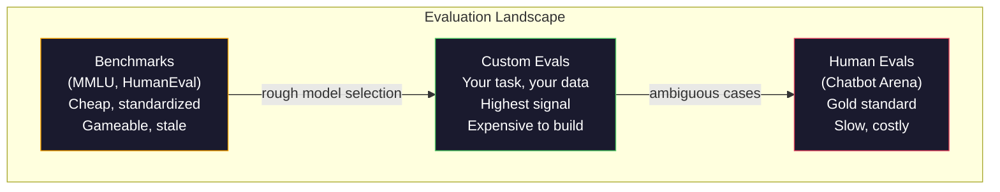
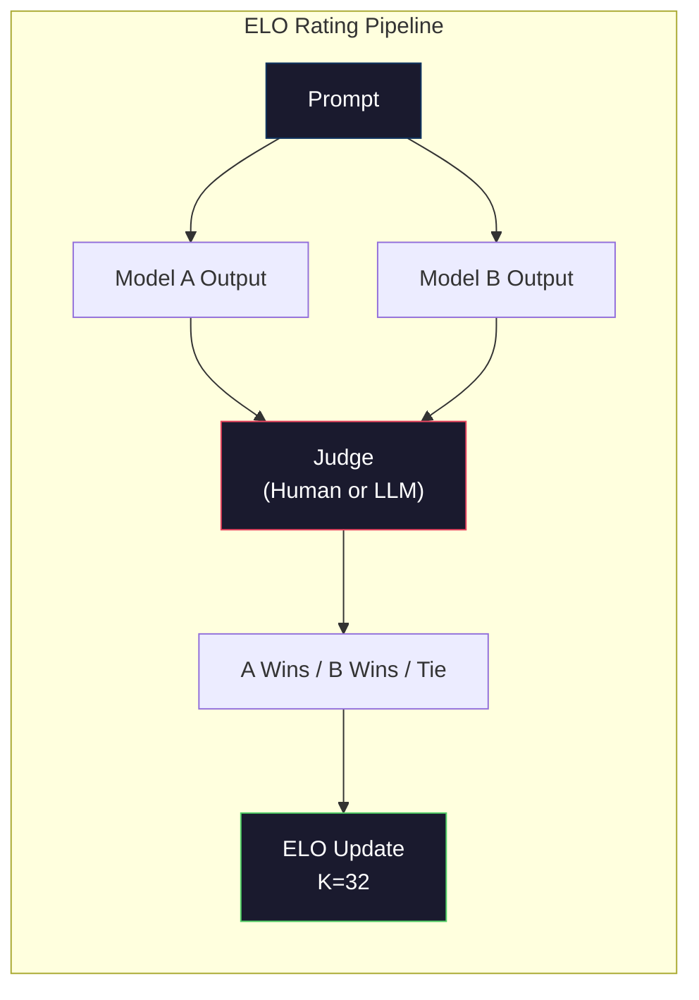

# 评估：基准、eval、LM Harness

> 古德哈特定律：当一个度量变成目标，它就不再是个好度量。每个前沿实验室都在刷基准。MMLU 分数往上涨，模型却仍然数不准 "strawberry" 里有几个 R。唯一重要的 eval 是你自己的 eval——在你的任务上、用你的数据。

**类型：** Build
**语言：** Python
**前置要求：** 阶段 10，第 01-05 课（从零构建 LLM）
**预计时间：** ~90 分钟

## 学习目标

- 构建一个自定义评估 harness，对一个语言模型跑选择题和开放式基准
- 解释为什么标准基准（MMLU、HumanEval）会饱和、区分不开前沿模型
- 用恰当的指标实现任务特定的 eval：exact match、F1、BLEU 和 LLM-as-judge 打分
- 设计一套针对你具体用例的自定义评估套件，而不是只靠公开排行榜

## 问题所在

MMLU 于 2020 年发布，涵盖 57 个学科的 15,908 道题。三年内，前沿模型把它刷饱和了。GPT-4 得 86.4%。Claude 3 Opus 得 86.8%。Llama 3 405B 得 88.6%。排行榜压缩进一个 3 分的区间，差异是统计噪声，不是真实的能力差距。

与此同时，这些同样的模型在一个 10 岁孩子不假思索就能处理的任务上失败。Claude 3.5 Sonnet 在 MMLU 上得 88.7%，最初却数不出 "strawberry" 里有几个字母——一个需要零世界知识、零推理、只需字符级迭代的任务。HumanEval 用 164 道题测代码生成。模型在它上面得 90%+，却仍然产出在任何初级开发者都能抓住的边界情况上崩溃的代码。

基准表现和真实世界可靠性之间的鸿沟，是 LLM 评估的核心问题。基准告诉你模型在基准上表现如何。它几乎不告诉你那个模型在你的具体任务、你的具体数据、你的具体失败模式下表现如何。如果你在做客服机器人，MMLU 无关紧要。如果你在做代码助手，HumanEval 只覆盖函数级生成——它对调试、重构、跨文件解释代码只字不提。

你需要自定义 eval。不是因为基准没用——它们对粗略选型有用——而是因为最终评估必须精确匹配你的部署条件。

## 核心概念

### eval 全景

评估有三类，各有不同的成本和信号质量。

**基准**是标准化的测试套件。MMLU、HumanEval、SWE-bench、MATH、ARC、HellaSwag。你对基准跑一个模型，得到一个分数。优点：每个人用同一套测试，所以你能比较模型。缺点：模型和训练数据越来越污染这些基准。实验室在包含基准题的数据上训练。分数上涨。能力未必。

**自定义 eval**是你为自己具体用例构建的测试套件。你定义输入、期望输出和打分函数。一个法律文档摘要器在法律文档上评估。一个 SQL 生成器在你的数据库 schema 上评估。这些创建起来昂贵，但它们是唯一能预测生产表现的评估。

**人工 eval**用付费标注员按有用性、正确性、流畅性和安全性等标准来评判模型输出。对自动打分失效的开放式任务，它是黄金标准。Chatbot Arena 在 100+ 个模型上收集了超过 200 万张人类偏好票。缺点：成本（每次判断 0.10-2.00 美元）和速度（数小时到数天）。



### 基准为什么会失效

三种机制让基准分数不再反映真实能力。

**数据污染。** 训练语料扒互联网。基准题就在互联网上。模型在训练时看到了答案。这不是传统意义上的作弊——实验室不是故意把基准数据放进去。但 web 级别的扒取让排除它几乎不可能。

**应试。** 实验室为基准表现优化训练混合配比。如果训练混合里 5% 是 MMLU 风格的选择题，模型就学到了格式和答案分布。MMLU 是 4 选 1。模型学到答案分布在 A/B/C/D 上近乎均匀，这在模型不知道答案时也有帮助。

**饱和。** 当每个前沿模型在一个基准上都得 85-90%，这个基准就不再有区分度了。剩下的 10-15% 的题可能模棱两可、标错了，或需要冷门领域知识。在 MMLU 上从 87% 提到 89%，可能意味着模型多记住了两道冷门题，而不是它变聪明了。

### 困惑度：一个快速健康检查

困惑度衡量模型对一串 token 有多惊讶。形式上，它是指数化的平均负对数似然：

```
PPL = exp(-1/N * sum(log P(token_i | context)))
```

困惑度为 10，意味着模型平均而言，在每个 token 位置上的不确定性相当于在 10 个选项里均匀选择。越低越好。GPT-2 在 WikiText-103 上得困惑度 ~30。GPT-3 得 ~20。Llama 3 8B 得 ~7。

困惑度对在同一测试集上比较模型有用，但它有盲点。一个模型可以靠擅长预测常见模式而拿到低困惑度，同时在罕见但重要的模式上糟糕透顶。它也对指令跟随、推理或事实准确性只字不提。把它当作理智检查，不是最终判决。

### LLM-as-Judge

用一个强模型评估一个弱模型的输出。想法很简单：让 GPT-4o 或 Claude Sonnet 在 1-5 分制上给一个回复的正确性、有用性和安全性打分。用 GPT-4o-mini 每次判断大约花 0.01 美元，并且和人类判断的相关性出奇地好——大多数任务上约 80% 一致。

打分 prompt 比模型更重要。模糊的 prompt（"给这个回复打分"）产出噪声分数。带评分准则的结构化 prompt（"如果答案事实正确并引用了来源得 5 分，正确但没来源得 4 分，部分正确得 3 分……"）产出一致、可复现的分数。

失败模式：评判模型表现出位置偏见（成对比较里偏好第一个回复）、啰嗦偏见（偏好更长的回复）和自我偏好（GPT-4 给 GPT-4 的输出打的分高于同等的 Claude 输出）。缓解办法：随机化顺序、按长度归一化、用一个和被评估模型不同的评判者。

### 从成对比较得出 ELO 评分

Chatbot Arena 的做法。给同一个 prompt 展示来自不同模型的两个回复。一个人类（或 LLM 评判者）挑更好的那个。从数千次这样的比较里，为每个模型计算一个 ELO 评分——和国际象棋用的同一套系统。

ELO 的优点：相对排名比绝对打分更可靠、优雅地处理平局、并且比独立给每个输出打分用更少的比较就收敛。截至 2026 年初，Chatbot Arena 排名显示 GPT-4o、Claude 3.5 Sonnet 和 Gemini 1.5 Pro 在顶部彼此相差 20 个 ELO 点以内。



### eval 框架

**lm-evaluation-harness**（EleutherAI）：标准的开源 eval 框架。支持 200+ 个基准。一条命令就能对任意 Hugging Face 模型跑 MMLU、HellaSwag、ARC 等。被 Open LLM Leaderboard 使用。

**RAGAS**：专门为 RAG 流水线设计的评估框架。衡量忠实度（答案是否匹配检索到的上下文？）、相关性（检索到的上下文是否和问题相关？）和答案正确性。

**promptfoo**：用于 prompt 工程的配置驱动 eval。在 YAML 里定义测试用例，对多个模型运行，得到通过/失败报告。对 prompt 的回归测试有用——确保一次 prompt 改动不会弄坏已有的测试用例。

### 构建自定义 eval

对生产唯一重要的 eval。流程：

1. **定义任务。** 模型到底该做什么？要精确。"回答问题" 太模糊。"给定一封客户投诉邮件，抽取产品名、问题类别和情感" 是个你能评估的任务。

2. **创建测试用例。** 原型 eval 最少 50 个，生产 200+ 个。每个测试用例是一个 (input, expected_output) 对。包含边界情况：空输入、对抗输入、模棱两可的输入、其他语言的输入。

3. **定义打分。** 结构化输出用 exact match。文本相似度用 BLEU/ROUGE。开放式质量用 LLM-as-judge。抽取任务用 F1。用权重组合多个指标。

4. **自动化。** 每个 eval 一条命令就跑完。没有手动步骤。把结果存成能随时间比较的格式。

5. **跟踪随时间变化。** 孤立的 eval 分数毫无意义。你需要趋势线。上次 prompt 改动后分数提升了吗？切换模型后退步了吗？把你的 eval 和 prompt 一起做版本管理。

| eval 类型 | 每次判断成本 | 和人类的一致度 | 最适合 |
|-----------|------------------|----------------------|----------|
| Exact match | ~$0 | 100%（适用时） | 结构化输出、分类 |
| BLEU/ROUGE | ~$0 | ~60% | 翻译、摘要 |
| LLM-as-judge | ~$0.01 | ~80% | 开放式生成 |
| 人工 eval | $0.10-$2.00 | 不适用（它就是真值） | 模棱两可、高风险任务 |

## 动手构建

### 第 1 步：一个极简 eval 框架

定义核心抽象。一个 eval 用例有一个输入、一个期望输出和一个可选的元数据字典。一个打分器接收一个预测和一个参考，返回一个 0 到 1 之间的分数。

```python
import json
from collections import Counter

class EvalCase:
    def __init__(self, input_text, expected, metadata=None):
        self.input_text = input_text
        self.expected = expected
        self.metadata = metadata or {}

class EvalSuite:
    def __init__(self, name, cases, scorers):
        self.name = name
        self.cases = cases
        self.scorers = scorers

    def run(self, model_fn):
        results = []
        for case in self.cases:
            prediction = model_fn(case.input_text)
            scores = {}
            for scorer_name, scorer_fn in self.scorers.items():
                scores[scorer_name] = scorer_fn(prediction, case.expected)
            results.append({
                "input": case.input_text,
                "expected": case.expected,
                "prediction": prediction,
                "scores": scores,
            })
        return results
```

### 第 2 步：打分函数

构建 exact match、token F1 和一个模拟的 LLM-as-judge 打分器。

```python
def exact_match(prediction, expected):
    return 1.0 if prediction.strip().lower() == expected.strip().lower() else 0.0

def token_f1(prediction, expected):
    pred_tokens = set(prediction.lower().split())
    exp_tokens = set(expected.lower().split())
    if not pred_tokens or not exp_tokens:
        return 0.0
    common = pred_tokens & exp_tokens
    precision = len(common) / len(pred_tokens)
    recall = len(common) / len(exp_tokens)
    if precision + recall == 0:
        return 0.0
    return 2 * (precision * recall) / (precision + recall)

def llm_judge_simulated(prediction, expected):
    pred_words = set(prediction.lower().split())
    exp_words = set(expected.lower().split())
    if not exp_words:
        return 0.0
    overlap = len(pred_words & exp_words) / len(exp_words)
    length_penalty = min(1.0, len(prediction) / max(len(expected), 1))
    return round(overlap * 0.7 + length_penalty * 0.3, 3)
```

### 第 3 步：ELO 评分系统

实现带 ELO 更新的成对比较。这正是 Chatbot Arena 用来给模型排名的系统。

```python
class ELOTracker:
    def __init__(self, k=32, initial_rating=1500):
        self.ratings = {}
        self.k = k
        self.initial_rating = initial_rating
        self.history = []

    def _ensure_player(self, name):
        if name not in self.ratings:
            self.ratings[name] = self.initial_rating

    def expected_score(self, rating_a, rating_b):
        return 1 / (1 + 10 ** ((rating_b - rating_a) / 400))

    def record_match(self, player_a, player_b, outcome):
        self._ensure_player(player_a)
        self._ensure_player(player_b)

        ea = self.expected_score(self.ratings[player_a], self.ratings[player_b])
        eb = 1 - ea

        if outcome == "a":
            sa, sb = 1.0, 0.0
        elif outcome == "b":
            sa, sb = 0.0, 1.0
        else:
            sa, sb = 0.5, 0.5

        self.ratings[player_a] += self.k * (sa - ea)
        self.ratings[player_b] += self.k * (sb - eb)

        self.history.append({
            "a": player_a, "b": player_b,
            "outcome": outcome,
            "rating_a": round(self.ratings[player_a], 1),
            "rating_b": round(self.ratings[player_b], 1),
        })

    def leaderboard(self):
        return sorted(self.ratings.items(), key=lambda x: -x[1])
```

### 第 4 步：困惑度计算

用 token 概率计算困惑度。实践中你会从模型的 logits 得到这些。这里我们用一个概率分布模拟。

```python
import numpy as np

def perplexity(log_probs):
    if not log_probs:
        return float("inf")
    avg_neg_log_prob = -np.mean(log_probs)
    return float(np.exp(avg_neg_log_prob))

def token_log_probs_simulated(text, model_quality=0.8):
    np.random.seed(hash(text) % 2**31)
    tokens = text.split()
    log_probs = []
    for i, token in enumerate(tokens):
        base_prob = model_quality
        if len(token) > 8:
            base_prob *= 0.6
        if i == 0:
            base_prob *= 0.7
        prob = np.clip(base_prob + np.random.normal(0, 0.1), 0.01, 0.99)
        log_probs.append(float(np.log(prob)))
    return log_probs
```

### 第 5 步：汇总结果

计算一次 eval 运行的汇总统计：均值、中位数、在某阈值上的通过率，以及按指标的细分。

```python
def summarize_results(results, threshold=0.8):
    all_scores = {}
    for r in results:
        for metric, score in r["scores"].items():
            all_scores.setdefault(metric, []).append(score)

    summary = {}
    for metric, scores in all_scores.items():
        arr = np.array(scores)
        summary[metric] = {
            "mean": round(float(np.mean(arr)), 3),
            "median": round(float(np.median(arr)), 3),
            "std": round(float(np.std(arr)), 3),
            "min": round(float(np.min(arr)), 3),
            "max": round(float(np.max(arr)), 3),
            "pass_rate": round(float(np.mean(arr >= threshold)), 3),
            "n": len(scores),
        }
    return summary

def print_summary(summary, suite_name="Eval"):
    print(f"\n{'=' * 60}")
    print(f"  {suite_name} Summary")
    print(f"{'=' * 60}")
    for metric, stats in summary.items():
        print(f"\n  {metric}:")
        print(f"    Mean:      {stats['mean']:.3f}")
        print(f"    Median:    {stats['median']:.3f}")
        print(f"    Std:       {stats['std']:.3f}")
        print(f"    Range:     [{stats['min']:.3f}, {stats['max']:.3f}]")
        print(f"    Pass rate: {stats['pass_rate']:.1%} (threshold >= 0.8)")
        print(f"    N:         {stats['n']}")
```

### 第 6 步：跑完整流水线

把所有东西接起来。定义一个任务、创建测试用例、模拟两个模型、跑 eval、从成对比较计算 ELO，并打印排行榜。

```python
def demo_model_good(prompt):
    responses = {
        "What is the capital of France?": "Paris",
        "What is 2 + 2?": "4",
        "Who wrote Hamlet?": "William Shakespeare",
        "What language is PyTorch written in?": "Python and C++",
        "What is the boiling point of water?": "100 degrees Celsius",
    }
    return responses.get(prompt, "I don't know")

def demo_model_bad(prompt):
    responses = {
        "What is the capital of France?": "Paris is the capital city of France",
        "What is 2 + 2?": "The answer is four",
        "Who wrote Hamlet?": "Shakespeare",
        "What language is PyTorch written in?": "Python",
        "What is the boiling point of water?": "212 Fahrenheit",
    }
    return responses.get(prompt, "Unknown")

cases = [
    EvalCase("What is the capital of France?", "Paris"),
    EvalCase("What is 2 + 2?", "4"),
    EvalCase("Who wrote Hamlet?", "William Shakespeare"),
    EvalCase("What language is PyTorch written in?", "Python and C++"),
    EvalCase("What is the boiling point of water?", "100 degrees Celsius"),
]

suite = EvalSuite(
    name="General Knowledge",
    cases=cases,
    scorers={
        "exact_match": exact_match,
        "token_f1": token_f1,
        "llm_judge": llm_judge_simulated,
    },
)

results_good = suite.run(demo_model_good)
results_bad = suite.run(demo_model_bad)

print_summary(summarize_results(results_good), "Model A (concise)")
print_summary(summarize_results(results_bad), "Model B (verbose)")
```

"好" 模型给出确切答案。"坏" 模型给出啰嗦的复述。Exact match 严厉惩罚啰嗦的模型。Token F1 和 LLM-as-judge 更宽容。这说明了为什么指标的选择很重要：同一个模型看起来很棒还是很糟，取决于你怎么打分。

### 第 7 步：ELO 锦标赛

跨多轮在模型之间跑成对比较。

```python
elo = ELOTracker(k=32)

for case in cases:
    pred_a = demo_model_good(case.input_text)
    pred_b = demo_model_bad(case.input_text)

    score_a = token_f1(pred_a, case.expected)
    score_b = token_f1(pred_b, case.expected)

    if score_a > score_b:
        outcome = "a"
    elif score_b > score_a:
        outcome = "b"
    else:
        outcome = "tie"

    elo.record_match("model_a_concise", "model_b_verbose", outcome)

print("\nELO Leaderboard:")
for name, rating in elo.leaderboard():
    print(f"  {name}: {rating:.0f}")
```

### 第 8 步：困惑度对比

在不同质量水平的 "模型" 之间对比困惑度。

```python
test_text = "The quick brown fox jumps over the lazy dog in the garden"

for quality, label in [(0.9, "Strong model"), (0.7, "Medium model"), (0.4, "Weak model")]:
    log_probs = token_log_probs_simulated(test_text, model_quality=quality)
    ppl = perplexity(log_probs)
    print(f"  {label} (quality={quality}): perplexity = {ppl:.2f}")
```

## 上手使用

### lm-evaluation-harness（EleutherAI）

在任意模型上跑基准的标准工具。

```python
# pip install lm-eval
# 命令行：
# lm_eval --model hf --model_args pretrained=meta-llama/Llama-3.1-8B --tasks mmlu --batch_size 8

# Python API:
# import lm_eval
# results = lm_eval.simple_evaluate(
#     model="hf",
#     model_args="pretrained=meta-llama/Llama-3.1-8B",
#     tasks=["mmlu", "hellaswag", "arc_easy"],
#     batch_size=8,
# )
# print(results["results"])
```

### promptfoo

用于 prompt 工程的配置驱动 eval。在 YAML 里定义测试，对多个 provider 运行。

```yaml
# promptfoo.yaml
providers:
  - openai:gpt-4o-mini
  - anthropic:claude-3-haiku

prompts:
  - "Answer in one word: {{question}}"

tests:
  - vars:
      question: "What is the capital of France?"
    assert:
      - type: contains
        value: "Paris"
  - vars:
      question: "What is 2 + 2?"
    assert:
      - type: equals
        value: "4"
```

### 用 RAGAS 做 RAG 评估

```python
# pip install ragas
# from ragas import evaluate
# from ragas.metrics import faithfulness, answer_relevancy, context_precision
#
# result = evaluate(
#     dataset,
#     metrics=[faithfulness, answer_relevancy, context_precision],
# )
# print(result)
```

RAGAS 衡量通用 eval 漏掉的东西：模型的答案是否扎根于检索到的上下文，而不只是抽象意义上答案 "正确"。

## 交付

本节课产出 `outputs/prompt-eval-designer.md`——一个可复用的 prompt，为任意任务设计自定义 eval 套件。给它一段任务描述，它生成测试用例、打分函数和一个通过/失败阈值建议。

它还产出 `outputs/skill-llm-evaluation.md`——一个决策框架，基于你的任务类型、预算和延迟要求选择正确的评估策略。

## 练习

1. 加一个 "一致性" 打分器，把同一个输入过模型 5 次，测量输出彼此匹配的频率。在确定性输入上的不一致答案，揭示了脆弱的 prompt 或过高的温度设置。

2. 扩展 ELO tracker 让它支持多个评判函数（exact match、F1、LLM-as-judge）并给它们加权。对比当你重权 exact match vs 重权 F1 时排行榜如何变化。

3. 为一个具体任务构建一套 eval：把邮件分到 5 个类别。创建 100 个测试用例，包含多样的例子和边界情况（可能属于多个类别的邮件、空邮件、其他语言的邮件）。测量不同 "模型"（基于规则、关键词匹配、模拟 LLM）的表现。

4. 实现污染检测：给定一组 eval 题目和一个训练语料，检查有多少百分比的 eval 题目（或近似复述）出现在训练数据里。这就是研究者审计基准有效性的方式。

5. 做一个 "模型 diff" 工具。给定两个模型版本的 eval 结果，高亮出哪些具体测试用例改进了、哪些退步了、哪些没变。这是 eval 版的代码 diff——对理解一次改动到底是帮了还是害了至关重要。

## 关键术语

| 术语 | 人们怎么说 | 它实际是什么 |
|------|----------------|----------------------|
| MMLU | "那个基准" | Massive Multitask Language Understanding——57 个学科的 15,908 道选择题，到 2025 年被刷到 88% 以上饱和 |
| HumanEval | "代码 eval" | OpenAI 的 164 道 Python 函数补全题，只测孤立的函数生成 |
| SWE-bench | "真实编码 eval" | 来自 12 个 Python 仓库的 2,294 个 GitHub issue，衡量包含测试生成在内的端到端 bug 修复 |
| 困惑度 | "模型有多困惑" | exp(-avg(log P(token_i 给定 context)))——越低意味着模型给实际 token 分配的概率越高 |
| ELO 评分 | "给模型的国际象棋排名" | 从成对胜负记录计算的相对实力评分，被 Chatbot Arena 用来给 100+ 个模型排名 |
| LLM-as-judge | "用 AI 给 AI 打分" | 一个强模型对照评分准则给弱模型的输出打分，每次判断约 0.01 美元、和人类评判者约 80% 一致 |
| 数据污染 | "模型看过测试" | 训练数据包含基准题，在不提升真实能力的情况下虚高分数 |
| eval 套件 | "一堆测试" | 一个版本化的 (input, expected_output, scorer) 三元组集合，衡量一项具体能力 |
| 通过率 | "它答对的百分比" | eval 用例中得分高于某阈值的比例——比平均分更可操作，因为它衡量可靠性 |
| Chatbot Arena | "模型排名网站" | 拥有 200 万+ 张人类偏好票的 LMSYS 平台，通过 ELO 评分产出最受信任的 LLM 排行榜 |

## 延伸阅读

- [Hendrycks et al., 2021 -- "Measuring Massive Multitask Language Understanding"](https://arxiv.org/abs/2009.03300) -- MMLU 论文，尽管饱和仍是被引用最多的 LLM 基准
- [Chen et al., 2021 -- "Evaluating Large Language Models Trained on Code"](https://arxiv.org/abs/2107.03374) -- OpenAI 的 HumanEval 论文，确立了代码生成评估方法论
- [Zheng et al., 2023 -- "Judging LLM-as-a-Judge"](https://arxiv.org/abs/2306.05685) -- 对用 LLM 评估 LLM 的系统分析，包含位置偏见和啰嗦偏见的发现
- [LMSYS Chatbot Arena](https://chat.lmsys.org/) -- 拥有 200 万+ 票的众包模型对比平台，最受信任的真实世界 LLM 排名
