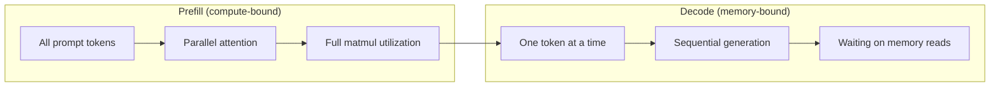
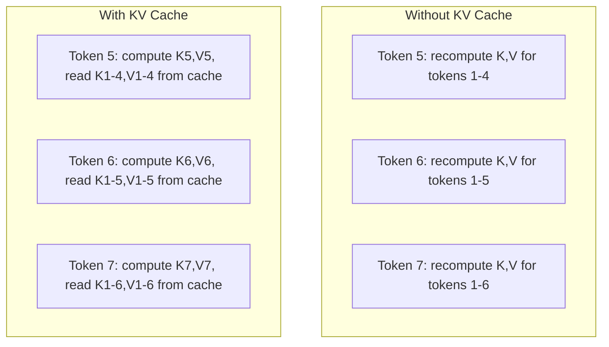
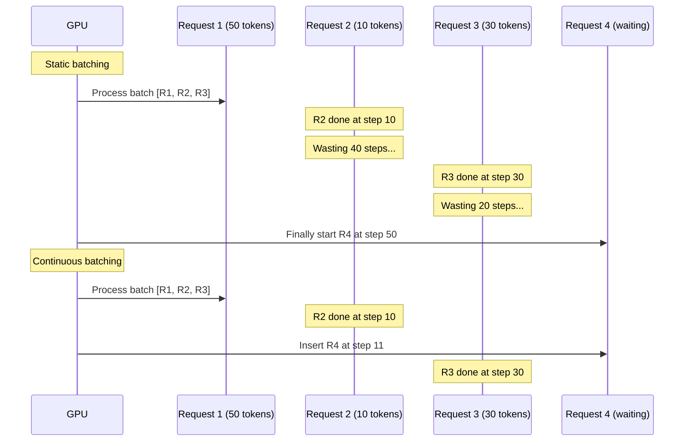
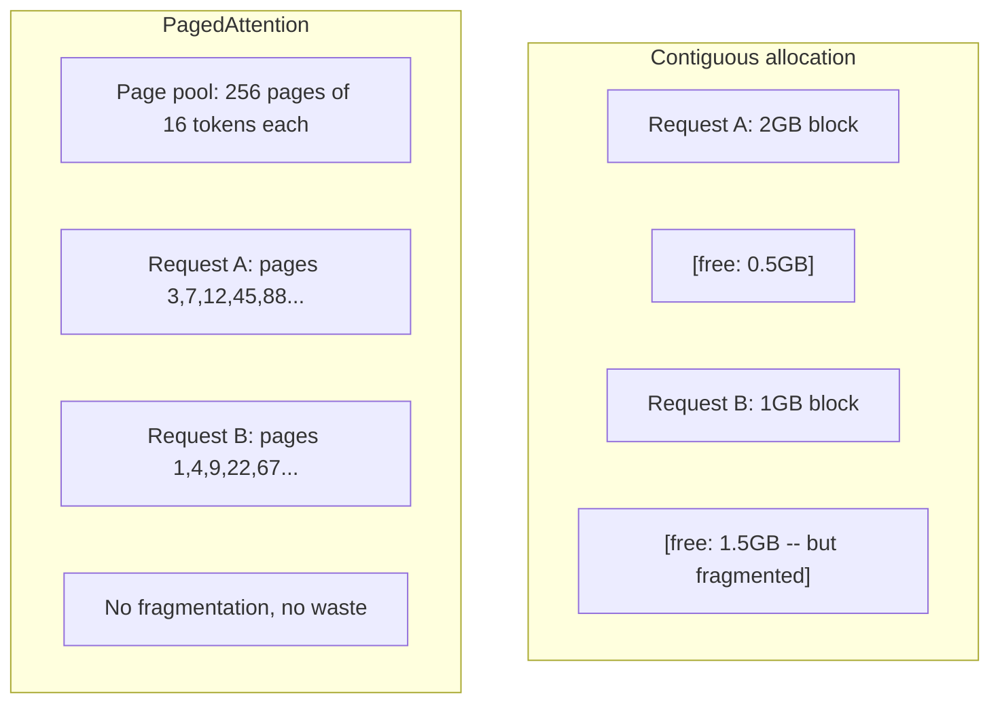
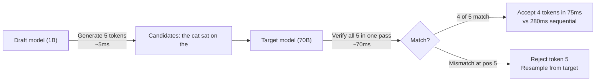

# 推理优化

> LLM 推理由两个阶段定义。Prefill 并行处理你的 prompt——计算受限。Decode 一次生成一个 token——内存受限。每个优化都瞄准其中一个或两个。

**类型：** Build
**语言：** Python
**前置要求：** 阶段 10，第 01-08 课（transformer 架构、注意力）
**预计时间：** ~120 分钟

## 学习目标

- 实现 KV-cache，消除自回归 token 生成时的冗余计算
- 解释 LLM 推理的 prefill vs decode 阶段，以及为什么各自的瓶颈不同（计算受限 vs 内存受限）
- 实现连续批处理和 PagedAttention 的概念，在并发请求下最大化 GPU 利用率
- 对比推理优化技术（KV-cache、推测解码、flash attention）及其吞吐/延迟权衡

## 问题所在

你在 4 张 A100 上部署 Llama 3 70B。单个用户能拿到约 50 token/秒。感觉很快。然后 100 个用户同时打到端点。吞吐掉到 3 token/秒/用户。你那 25,000 美元/月的 GPU 账单，服务回复的速度比人打字还慢。

模型本身在 1 个用户和 100 个用户之间没变。同样的权重、同样的架构、同样的数学。变的是你怎么调度工作。朴素推理浪费了 90%+ 的可用 GPU 算力。一个等第 47 个 token 的用户占着整个 batch 槽位，而 GPU 内存总线在两次 matmul 之间闲着。与此同时，一个新用户的 2,000-token prompt 本可以用有用的计算填满那段死时间。

这不是个扩展问题。这是个调度问题。本节课的技术——KV 缓存、连续批处理、PagedAttention、推测解码、prefix 缓存——就是把同样流量的推理账单从 25k 美元/月降到 5k 美元/月的关键。

vLLM 在 4 张 A100-80GB 上服务 Llama 3 70B，低并发下达到约 50 token/秒/用户，并通过连续批处理和 PagedAttention 在 100 个并发请求下维持 15-25 TPS/用户。没有这些优化，同样的硬件在那个并发下只服务 5 TPS/用户。同样的 GPU、同样的模型，4 倍的吞吐。

## 核心概念

### Prefill vs Decode

每个 LLM 推理请求有两个明确的阶段。

**Prefill** 处理整个输入 prompt。所有 token 已知，所以注意力能在完整序列上并行计算。这是一次大矩阵乘法——GPU 核心保持忙碌。瓶颈是计算：你的硬件每秒能交付多少 FLOPS。一张 A100 做 312 TFLOPS（BF16）。在单张 A100 上，70B 模型一个 4,096-token prompt 的 prefill 大约要 400ms。

**Decode** 一次生成一个输出 token。每个新 token 注意到之前所有 token，但每次前向传播只产出一个 token。权重矩阵和 prefill 时一样大，但你是把它们乘以单个向量而不是矩阵。GPU 核心在微秒内完成，然后等下一批权重从内存到来。瓶颈是内存带宽：你能多快把模型权重从 HBM 流到计算单元。一张 A100 有 2 TB/s 带宽。FP16 下的 70B 模型是 140 GB。把整个模型读一遍要 70ms——那是你单个 decode 步骤的下限。



**ops:byte 比率**（也叫算术强度）抓住了这个权衡。它衡量你每从内存加载一字节执行多少操作。

```
ops:byte ratio = FLOPs per token / bytes read from memory
```

在 4,096 token 一批的 prefill 时，你每加载一个权重执行约 4,096 次乘累加操作。比率高——你计算受限。在 batch size 1 的 decode 时，你每加载一个权重执行约 1 次操作。比率低——你内存受限。

根本洞见：*decode 之所以内存受限，是因为你读整个模型就为产出单个 token*。下面每个优化要么减少你读的量，要么增加每次读处理的 token 批量，要么完全避免读。

### KV Cache

注意力时，每个 token 的 query 注意到之前每个 token 的 key 和 value 向量。没有缓存，生成第 N 个 token 需要为之前所有 N-1 个 token 重算 key 和 value 投影。token 1 在生成 token 2 时被投影，然后为 token 3 再来一次，再为 token 4 又一次。到 token 1,000 时，你总共把 token 1 投影了 999 次。

KV cache 存下之前所有 token 的 key 和 value 投影。生成第 N 个 token 时，你只为 token N 计算 key 和 value，然后把它们和 token 1 到 N-1 缓存的 K/V 拼接。



**KV cache 的内存公式：**

```
KV cache size = 2 * num_layers * num_kv_heads * head_dim * seq_len * bytes_per_param
```

对 Llama 3 70B（80 层，GQA 下 8 个 KV 头，head_dim=128，BF16）：

```
per token: 2 * 80 * 8 * 128 * 2 bytes = 327,680 bytes = 320 KB
at 4,096 tokens: 320 KB * 4,096 = 1.28 GB
at 128K tokens: 320 KB * 131,072 = 40 GB
```

Llama 3 70B 单个 128K-context 的对话消耗 40 GB 的 KV cache——半张 A100 的内存。100 个并发用户、每个 4K token，光 KV cache 就要 128 GB。这就是为什么 KV cache 管理是推理优化的核心挑战。

### 连续批处理

静态批处理等到 N 个请求一批到齐，一起处理，并等到 *所有* 都完成才接受新请求。如果一个请求要 500 个 token、另一个要 10 个，短请求完成后会闲坐 490 个 decode 步骤。

连续批处理（也叫迭代级批处理）只要任何请求完成，就把新请求插入批次。批次在每个 decode 步骤都被重新评估。一个 10 个 token 后完成的请求立刻被一个等待的请求替换。



吞吐提升取决于输出长度变化多大。长度一致时，连续批处理和静态批处理一样。长度可变时（常见情况），连续批处理能交付 2-5 倍更高的吞吐，因为 GPU 槽位从不空着。

### PagedAttention

每个请求的 KV cache 是一块连续内存。请求到来和离开时，内存碎片化——和操作系统里的 RAM 碎片化一模一样。一个 4K-token 请求需要 1.28 GB 连续内存。即使你总共有 2 GB 空闲，也可能没有 1.28 GB *连续的*。你要么浪费内存，要么拒绝请求。

PagedAttention（来自 vLLM）把 OS 风格的虚拟内存应用到 KV cache。它不为每个请求分配一块连续内存，而是分配固定大小的 "页"（通常每页 16 个 token）。页可以在 GPU 物理内存的任何地方。一张页表把每个请求的逻辑序列位置映射到物理页位置。



PagedAttention 还为共享前缀实现 **copy-on-write**。如果 50 个请求共享同一个 system prompt，那个 system prompt 的 KV cache 页只存一次、被全部 50 个请求引用。只有当一个请求分叉（不同的用户消息）时，它才获得自己的页。这对有共享 system prompt 的应用大幅削减内存用量。

vLLM 报告通过 PagedAttention 实现近乎零的内存浪费（约 4%，对比朴素分配的约 60-80%）。

### 推测解码

Decode 慢是因为它是顺序的——你生成一个 token，喂回去，生成下一个。但要是你能廉价地猜出接下来 5 个 token，然后一次全部验证呢？

推测解码用一个小而快的 **draft 模型** 生成 K 个候选 token。然后大的 **target 模型** 在一次前向传播里处理所有 K 个候选（这看起来像 prefill——并行、计算受限、高效）。如果 target 模型同意 draft 模型的预测，你就在一次 target 前向传播的时间里接受所有 K 个 token。如果它在位置 j 不同意，你接受 token 1 到 j-1，丢掉其余的。



加速取决于 **接受率**——draft 模型的预测匹配 target 的频率。对一个为 Llama 3 70B 起草的 Llama 3 8B，自然语言上典型接受率为 70-85%。这转化为 2-3 倍的 decode 加速。

推测解码的三种方法：

| 方法 | Draft 来源 | 接受率 | 开销 |
|--------|-------------|-----------------|----------|
| Draft-target（Leviathan et al.） | 单独的小模型 | 70-85% | draft 模型内存 |
| EAGLE（Li et al.） | target 上的轻量头 | 75-90% | ~1% 额外参数 |
| N-gram 查表 | token n-gram 表 | 40-60% | 可忽略 |

**EAGLE** 在 target 模型的隐藏状态之上训练一个小的自回归头。它用 target 模型的倒数第二层特征预测下一个 token 的 embedding。因为它在 target 模型自己的表示上工作（而不是单独模型的），它用极小的额外内存实现更高的接受率。EAGLE-2 加了一个动态 draft 树，根据上下文调整候选数量。

**N-gram 推测解码** 维护一张来自当前上下文或预建语料的 n-gram 续写表。如果 draft 匹配同一对话里之前出现过的（重复模式、代码、结构化输出），它就以零神经网络开销触发。平均接受率更低，但每次推测的成本基本免费。

推测解码在 *数学上是精确的*——输出分布和 target 模型的分布完全相同。它不是近似。验证步骤确保每个被接受的 token 恰好有 target 模型会分配的概率。

### Prefix 缓存

许多请求共享同一个前缀。一个聊天机器人的 system prompt。一个 RAG 上下文块。一组 few-shot 例子。没有 prefix 缓存，每个请求都从头为这些共享 token 重算 KV cache。

Prefix 缓存为常见前缀存下 KV cache 并跨请求复用。当一个新请求带着已知前缀到来，系统拷贝（或引用）缓存的 KV 条目，只为独特的后缀计算 KV。

对一个跨所有请求共享的 2,000-token system prompt，prefix 缓存每个请求省下约 400ms 的 prefill。在 100 请求/秒下，那是每秒省 40 秒的 GPU 计算——超过一整张 GPU 的工作量。

SGLang 的 RadixAttention 用一棵 radix 树（trie）实现 prefix 缓存，按 token 内容索引前缀。任何匹配已存前缀的请求都免费拿到它的 KV cache。这棵树支持部分前缀匹配——如果你和一个缓存条目共享 2,000 个前缀 token 里的 1,500 个，你就复用那 1,500 个、只重算 500 个。

### 推理引擎

三个引擎主导生产级 LLM 服务：

| 引擎 | 关键创新 | 最适合 |
|--------|---------------|----------|
| vLLM | PagedAttention、连续批处理 | 通用服务、最高兼容性 |
| SGLang | RadixAttention（prefix 缓存）、结构化生成 | 多轮聊天机器人、约束解码 |
| TensorRT-LLM | NVIDIA 核融合、FP8 量化 | NVIDIA 硬件上的最大单卡吞吐 |

**vLLM** 是默认起点。它支持最广的模型范围，能在任何 GPU 厂商（NVIDIA、AMD、Intel）上跑，并通过 PagedAttention + 连续批处理实现强劲吞吐。OpenAI 兼容的 API 意味着你能把它直接当任何 OpenAI API 调用的替代品塞进去。

**SGLang** 建立在和 vLLM 相同的基础上，但加了 RadixAttention 做 prefix 缓存，以及一种用于结构化 LLM 程序的领域特定语言。如果你的工作负载涉及多轮对话、工具使用或约束解码（JSON 输出、正则引导生成），SGLang 通过前缀复用常常比 vLLM 快 2-5 倍。

**TensorRT-LLM** 把模型编译成优化的 NVIDIA GPU 核。它融合操作（注意力 + 线性 + 激活在一个核里）、在 H100 GPU 上用 FP8，并和 NVIDIA Triton Inference Server 集成用于生产部署。它在 NVIDIA 硬件上实现最高的单卡吞吐，但需要更多设置，且只在 NVIDIA GPU 上工作。

Llama 3 70B 的真实世界数字（4 张 A100-80GB，BF16）：

| 指标 | vLLM | SGLang | TensorRT-LLM |
|--------|------|--------|---------------|
| 吞吐（1 用户） | ~50 TPS | ~55 TPS | ~65 TPS |
| 吞吐（100 用户） | 总共 ~2,500 TPS | 总共 ~3,200 TPS | 总共 ~3,000 TPS |
| 首 token 时间 | ~400ms | ~300ms（前缀命中） | ~350ms |
| 最大 context | 128K | 128K | 128K |

### Ops:Byte 框架

你优化不了你没测量的东西。ops:byte 比率告诉你你是计算受限还是内存受限，这决定了哪些优化重要。

```
Compute roof: peak FLOPS of the GPU
Memory roof:  peak bandwidth * ops:byte ratio
```

当 ops:byte 低（decode、小 batch），你撞到内存带宽屋顶。加更多算力（更高主频、更多核心）没用。你需要减少内存读取（量化、KV cache 压缩）或增大 batch size 把读取分摊到更多有用的工作上。

当 ops:byte 高（prefill、大 batch），你撞到计算屋顶。内存带宽优化没用。你需要更快的 GPU、核融合或更低精度来榨出更多 FLOPS。

| 场景 | ops:byte | 受限于 | 用什么优化 |
|----------|----------|-------|---------------|
| Prefill，batch=1 | ~4,096 | 计算 | 核融合、FP8 |
| Decode，batch=1 | ~1 | 内存 | 量化、KV 压缩 |
| Decode，batch=32 | ~32 | 内存 | 更大 batch、连续批处理 |
| Decode，batch=256 | ~256 | 过渡中 | 两者都重要 |
| Decode，batch=1024 | ~1,024 | 计算 | 核融合、张量并行 |

A100 上的交叉点大约在 ops:byte = 156（312 TFLOPS / 2 TB/s）。低于 156，你内存受限。高于 156，你计算受限。连续批处理通过每次迭代塞更多 token，把 decode 推向这个交叉点。

## 动手构建

### 第 1 步：从零实现 KV Cache

我们构建一个多头 KV cache，按层、按头存 key 和 value 投影，并演示内存增长模式。

```python
import numpy as np

class KVCache:
    def __init__(self, num_layers, num_heads, head_dim, max_seq_len, dtype=np.float16):
        self.num_layers = num_layers
        self.num_heads = num_heads
        self.head_dim = head_dim
        self.max_seq_len = max_seq_len
        self.dtype = dtype

        self.k_cache = np.zeros(
            (num_layers, num_heads, max_seq_len, head_dim), dtype=dtype
        )
        self.v_cache = np.zeros(
            (num_layers, num_heads, max_seq_len, head_dim), dtype=dtype
        )
        self.seq_len = 0

    def update(self, layer_idx, new_keys, new_values):
        num_new = new_keys.shape[1]
        end = self.seq_len + num_new
        self.k_cache[layer_idx, :, self.seq_len:end, :] = new_keys
        self.v_cache[layer_idx, :, self.seq_len:end, :] = new_values
        return (
            self.k_cache[layer_idx, :, :end, :],
            self.v_cache[layer_idx, :, :end, :]
        )

    def advance(self, num_tokens):
        self.seq_len += num_tokens

    def memory_bytes(self):
        return self.k_cache.nbytes + self.v_cache.nbytes

    def used_bytes(self):
        per_token = 2 * self.num_layers * self.num_heads * self.head_dim * np.dtype(self.dtype).itemsize
        return per_token * self.seq_len
```

### 第 2 步：带 KV Cache 的注意力

一个简化的多头注意力，在 decode 步骤里使用 KV cache。

```python
def scaled_dot_product_attention(query, keys, values):
    head_dim = query.shape[-1]
    scores = np.matmul(query, keys.transpose(0, 1, 3, 2)) / np.sqrt(head_dim)
    seq_len_q = scores.shape[-2]
    seq_len_k = scores.shape[-1]
    if seq_len_q > 1:
        mask = np.triu(np.ones((seq_len_q, seq_len_k), dtype=np.float32), k=seq_len_k - seq_len_q + 1)
        scores = scores + mask * (-1e9)
    max_scores = np.max(scores, axis=-1, keepdims=True)
    exp_scores = np.exp(scores - max_scores)
    attn_weights = exp_scores / np.sum(exp_scores, axis=-1, keepdims=True)
    return np.matmul(attn_weights, values)


class MultiHeadAttention:
    def __init__(self, d_model, num_heads):
        self.num_heads = num_heads
        self.head_dim = d_model // num_heads
        scale = np.sqrt(2.0 / d_model)
        self.W_q = np.random.randn(d_model, d_model).astype(np.float32) * scale
        self.W_k = np.random.randn(d_model, d_model).astype(np.float32) * scale
        self.W_v = np.random.randn(d_model, d_model).astype(np.float32) * scale
        self.W_o = np.random.randn(d_model, d_model).astype(np.float32) * scale

    def forward(self, x, kv_cache=None, layer_idx=0):
        batch, seq_len, d_model = x.shape
        Q = np.matmul(x, self.W_q).reshape(batch, seq_len, self.num_heads, self.head_dim).transpose(0, 2, 1, 3)
        K = np.matmul(x, self.W_k).reshape(batch, seq_len, self.num_heads, self.head_dim).transpose(0, 2, 1, 3)
        V = np.matmul(x, self.W_v).reshape(batch, seq_len, self.num_heads, self.head_dim).transpose(0, 2, 1, 3)

        if kv_cache is not None:
            K_full, V_full = kv_cache.update(layer_idx, K[0], V[0])
            K = K_full[np.newaxis, :, :, :]
            V = V_full[np.newaxis, :, :, :]
            if seq_len == 1:
                kv_cache.advance(1)

        attn_out = scaled_dot_product_attention(Q, K, V)
        attn_out = attn_out.transpose(0, 2, 1, 3).reshape(batch, -1, d_model)
        return np.matmul(attn_out, self.W_o)
```

### 第 3 步：连续批处理模拟器

这模拟静态和连续批处理之间的调度差异。

```python
import heapq

class Request:
    def __init__(self, request_id, prompt_tokens, output_tokens, arrival_step):
        self.request_id = request_id
        self.prompt_tokens = prompt_tokens
        self.output_tokens = output_tokens
        self.arrival_step = arrival_step
        self.tokens_generated = 0
        self.start_step = None
        self.end_step = None

    def is_done(self):
        return self.tokens_generated >= self.output_tokens


def simulate_static_batching(requests, batch_size):
    step = 0
    completed = []
    queue = list(requests)
    queue.sort(key=lambda r: r.arrival_step)

    while queue:
        batch = []
        while queue and len(batch) < batch_size:
            r = queue.pop(0)
            r.start_step = max(step, r.arrival_step)
            batch.append(r)

        if batch:
            step = max(step, max(r.start_step for r in batch))
            max_output = max(r.output_tokens for r in batch)
            for r in batch:
                r.tokens_generated = r.output_tokens
                r.end_step = step + max_output
            step += max_output
            completed.extend(batch)

    return completed


def simulate_continuous_batching(requests, batch_size):
    step = 0
    completed = []
    queue = sorted(requests, key=lambda r: r.arrival_step)
    queue_idx = 0
    active = []
    waiting = []

    while queue_idx < len(queue) or active or waiting:
        while queue_idx < len(queue) and queue[queue_idx].arrival_step <= step:
            waiting.append(queue[queue_idx])
            queue_idx += 1

        while waiting and len(active) < batch_size:
            r = waiting.pop(0)
            r.start_step = step
            active.append(r)

        if not active:
            if waiting:
                step += 1
                continue
            elif queue_idx < len(queue):
                step = queue[queue_idx].arrival_step
                continue
            else:
                break

        for r in active:
            r.tokens_generated += 1

        done = [r for r in active if r.is_done()]
        for r in done:
            r.end_step = step + 1
            completed.append(r)
        active = [r for r in active if not r.is_done()]

        step += 1

    return completed


def batching_stats(completed):
    latencies = [r.end_step - r.arrival_step for r in completed]
    total_time = max(r.end_step for r in completed) - min(r.arrival_step for r in completed)
    total_tokens = sum(r.output_tokens for r in completed)
    return {
        "avg_latency": np.mean(latencies),
        "p50_latency": np.median(latencies),
        "p99_latency": np.percentile(latencies, 99),
        "total_time": total_time,
        "throughput": total_tokens / total_time if total_time > 0 else 0,
    }
```

### 第 4 步：Prefix 缓存

一个基于 trie 的 prefix 缓存，为共享前缀存 KV 条目。

```python
class TrieNode:
    def __init__(self):
        self.children = {}
        self.kv_data = None
        self.hit_count = 0


class PrefixCache:
    def __init__(self, max_entries=1000):
        self.root = TrieNode()
        self.max_entries = max_entries
        self.total_entries = 0
        self.hits = 0
        self.misses = 0

    def _walk(self, token_ids):
        node = self.root
        depth = 0
        for tid in token_ids:
            if tid not in node.children:
                break
            node = node.children[tid]
            depth += 1
        return node, depth

    def lookup(self, token_ids):
        node, depth = self._walk(token_ids)
        if depth > 0:
            self.hits += 1
            current = self.root
            for tid in token_ids[:depth]:
                current = current.children[tid]
                current.hit_count += 1
            kv_entries = []
            current = self.root
            for tid in token_ids[:depth]:
                current = current.children[tid]
                if current.kv_data is not None:
                    kv_entries.append(current.kv_data)
            return depth, kv_entries
        self.misses += 1
        return 0, []

    def insert(self, token_ids, kv_per_token):
        node = self.root
        for i, tid in enumerate(token_ids):
            if tid not in node.children:
                if self.total_entries >= self.max_entries:
                    return i
                node.children[tid] = TrieNode()
                self.total_entries += 1
            node = node.children[tid]
            if i < len(kv_per_token):
                node.kv_data = kv_per_token[i]
        return len(token_ids)

    def hit_rate(self):
        total = self.hits + self.misses
        return self.hits / total if total > 0 else 0.0
```

### 第 5 步：推测解码模拟器

我们用可配置的接受率模拟 draft-target 推测解码。

```python
class DraftModel:
    def __init__(self, vocab_size, acceptance_rate=0.8):
        self.vocab_size = vocab_size
        self.acceptance_rate = acceptance_rate

    def generate(self, context, num_tokens):
        tokens = np.random.randint(0, self.vocab_size, size=num_tokens)
        return tokens

    def get_probs(self, context, token):
        probs = np.random.dirichlet(np.ones(self.vocab_size))
        return probs


class TargetModel:
    def __init__(self, vocab_size):
        self.vocab_size = vocab_size

    def get_probs(self, context, tokens=None):
        if tokens is not None:
            return [np.random.dirichlet(np.ones(self.vocab_size)) for _ in tokens]
        return np.random.dirichlet(np.ones(self.vocab_size))


def speculative_decode(draft_model, target_model, context, num_speculative=5,
                       draft_cost=1.0, target_cost=10.0, verify_cost=12.0):
    total_tokens = 0
    total_cost = 0.0
    accepted_counts = []
    context = list(context)

    max_tokens = 100

    while total_tokens < max_tokens:
        draft_tokens = draft_model.generate(context, num_speculative)
        total_cost += draft_cost * num_speculative

        target_probs = target_model.get_probs(context, draft_tokens)
        total_cost += verify_cost

        accepted = 0
        for i, token in enumerate(draft_tokens):
            draft_p = draft_model.get_probs(context + list(draft_tokens[:i]), token)
            target_p = target_probs[i]

            r = np.random.random()
            acceptance_prob = min(1.0, target_p[token] / (draft_p[token] + 1e-10))

            if r < draft_model.acceptance_rate:
                accepted += 1
                context.append(token)
                total_tokens += 1
            else:
                new_token = np.random.choice(draft_model.vocab_size, p=target_p)
                context.append(new_token)
                total_tokens += 1
                break

        accepted_counts.append(accepted)

        if accepted == num_speculative:
            bonus_probs = target_model.get_probs(context)
            bonus_token = np.random.choice(draft_model.vocab_size, p=bonus_probs)
            context.append(bonus_token)
            total_tokens += 1

    sequential_cost = total_tokens * target_cost
    return {
        "total_tokens": total_tokens,
        "speculative_cost": total_cost,
        "sequential_cost": sequential_cost,
        "speedup": sequential_cost / total_cost if total_cost > 0 else 1.0,
        "avg_accepted": np.mean(accepted_counts),
        "acceptance_rate": np.mean(accepted_counts) / num_speculative,
    }


def compare_speculation_strategies(vocab_size=1000, num_trials=20):
    results = {}

    for name, acceptance_rate, spec_tokens in [
        ("Draft-target (8B->70B)", 0.78, 5),
        ("EAGLE", 0.85, 6),
        ("N-gram", 0.50, 4),
        ("No speculation", 0.0, 0),
    ]:
        if spec_tokens == 0:
            results[name] = {
                "speedup": 1.0,
                "acceptance_rate": 0.0,
                "avg_accepted": 0.0,
            }
            continue

        trial_results = []
        for _ in range(num_trials):
            draft = DraftModel(vocab_size, acceptance_rate=acceptance_rate)
            target = TargetModel(vocab_size)
            context = list(np.random.randint(0, vocab_size, size=10))
            result = speculative_decode(draft, target, context, num_speculative=spec_tokens)
            trial_results.append(result)

        results[name] = {
            "speedup": np.mean([r["speedup"] for r in trial_results]),
            "acceptance_rate": np.mean([r["acceptance_rate"] for r in trial_results]),
            "avg_accepted": np.mean([r["avg_accepted"] for r in trial_results]),
        }

    return results
```

### 第 6 步：KV Cache 内存剖析器

为真实模型配置计算 KV cache 内存需求。

```python
MODEL_CONFIGS = {
    "Llama-3-8B": {
        "num_layers": 32, "num_kv_heads": 8, "head_dim": 128,
        "model_params_b": 8, "gqa": True,
    },
    "Llama-3-70B": {
        "num_layers": 80, "num_kv_heads": 8, "head_dim": 128,
        "model_params_b": 70, "gqa": True,
    },
    "Llama-3-405B": {
        "num_layers": 126, "num_kv_heads": 8, "head_dim": 128,
        "model_params_b": 405, "gqa": True,
    },
    "Mistral-7B": {
        "num_layers": 32, "num_kv_heads": 8, "head_dim": 128,
        "model_params_b": 7, "gqa": True,
    },
    "GPT-4-est": {
        "num_layers": 120, "num_kv_heads": 96, "head_dim": 128,
        "model_params_b": 1800, "gqa": False,
    },
}


def kv_cache_memory(config, seq_len, dtype_bytes=2):
    per_token = 2 * config["num_layers"] * config["num_kv_heads"] * config["head_dim"] * dtype_bytes
    total = per_token * seq_len
    return {
        "per_token_bytes": per_token,
        "per_token_kb": per_token / 1024,
        "total_bytes": total,
        "total_mb": total / (1024 ** 2),
        "total_gb": total / (1024 ** 3),
    }


def memory_budget(config, gpu_memory_gb, model_dtype_bytes=2, kv_dtype_bytes=2):
    model_memory_gb = config["model_params_b"] * 1e9 * model_dtype_bytes / (1024 ** 3)
    overhead_gb = gpu_memory_gb * 0.1
    available_for_kv = gpu_memory_gb - model_memory_gb - overhead_gb

    if available_for_kv <= 0:
        return {"error": "Model does not fit in GPU memory", "model_memory_gb": model_memory_gb}

    per_token = 2 * config["num_layers"] * config["num_kv_heads"] * config["head_dim"] * kv_dtype_bytes
    max_tokens = int(available_for_kv * (1024 ** 3) / per_token)

    return {
        "gpu_memory_gb": gpu_memory_gb,
        "model_memory_gb": round(model_memory_gb, 1),
        "overhead_gb": round(overhead_gb, 1),
        "available_for_kv_gb": round(available_for_kv, 1),
        "max_total_tokens": max_tokens,
        "max_users_at_2k": max_tokens // 2048,
        "max_users_at_4k": max_tokens // 4096,
        "max_users_at_32k": max_tokens // 32768,
    }
```

## 上手使用

用 vLLM：

```python
from vllm import LLM, SamplingParams

llm = LLM(
    model="meta-llama/Llama-3-70B-Instruct",
    tensor_parallel_size=4,
    enable_prefix_caching=True,
    max_model_len=8192,
    gpu_memory_utilization=0.9,
)

params = SamplingParams(temperature=0.7, max_tokens=256)
outputs = llm.generate(["Explain inference optimization in one paragraph."], params)
```

用 SGLang 做 prefix 缓存 + 结构化输出：

```python
import sglang as sgl

@sgl.function
def classify(s, text):
    s += sgl.system("You are a classifier. Output JSON only.")
    s += sgl.user(f"Classify this text: {text}")
    s += sgl.assistant(sgl.gen("result", regex=r'\{"label": "(positive|negative|neutral)"\}'))

runtime = sgl.Runtime(model_path="meta-llama/Llama-3-70B-Instruct", tp_size=4)
sgl.set_default_backend(runtime)

results = classify.run_batch([
    {"text": "This product is amazing!"},
    {"text": "Terrible experience."},
    {"text": "It was okay I guess."},
])
```

用 TensorRT-LLM：

```python
import tensorrt_llm
from tensorrt_llm.runtime import ModelRunner

runner = ModelRunner.from_dir("./llama-70b-trt-engine/", rank=0)

outputs = runner.generate(
    batch_input_ids=[tokenizer.encode("Explain KV caching.")],
    max_new_tokens=256,
    temperature=0.7,
)
```

## 交付

本节课产出：
- `outputs/skill-inference-optimization.md` —— 一个用于诊断和优化 LLM 推理服务的 skill

## 练习

1. 改造 KV cache 剖析器，对比 FP16 vs FP8 vs INT4 的 KV cache 量化。对 4K context 的 Llama 3 70B，在 4 张 A100-80GB 上计算每种的最大并发用户数。把 KV 量化到 INT4 应该大约把用户容量翻 4 倍。

2. 扩展连续批处理模拟器以跟踪 GPU 利用率（每步填满的 batch 槽位比例）。对 50 个输出长度服从帕累托分布（shape=1.5，scale=20）的请求，画出静态和连续批处理随时间的利用率。连续批处理应该维持 >80% 利用率。

3. 实现一个分组查询注意力（GQA）版的 KV cache，其中 `num_kv_heads < num_query_heads`。Llama 3 70B 用 64 个 query 头但只有 8 个 KV 头。计算相比全多头注意力的内存节省（KV cache 大小减到 1/8）。

4. 构建一个用 LRU 淘汰的 prefix 缓存。把 max_entries 设为 500，生成 1,000 个请求，其中 60% 共享 5 个常见前缀之一。测量命中率，和无限缓存对比。淘汰策略好的话，命中率应该保持在 55% 以上。

5. 扩展推测解码模拟器以实现基于树的推测（EAGLE-2 风格）。不是单链 K 个 draft token，而是生成一棵候选树（比如 3 层每层 2 个分支 = 8 个叶子候选）。把每轮验证接受的总 token 数和线性推测对比。

## 关键术语

| 术语 | 人们怎么说 | 它实际是什么 |
|------|----------------|----------------------|
| Prefill | "处理 prompt" | 在所有输入 token 上并行计算注意力——计算受限，因为完整的矩阵乘法让 GPU 核心忙碌 |
| Decode | "生成 token" | 每次前向传播产出一个 token，每次都读全部模型权重——内存受限，因为计算在下一批权重到来前就完成了 |
| KV cache | "缓存注意力状态" | 存下之前所有 token 的 key 和 value 投影，这样每个 decode 步骤不用重算——用内存换计算 |
| 连续批处理 | "动态批处理" | 只要任何请求完成就把新请求插入运行中的批次，在每个 decode 迭代评估，而不是等整批 |
| PagedAttention | "KV cache 的虚拟内存" | 把 KV cache 分配成固定大小的页而非连续块，消除内存碎片并为共享前缀启用 copy-on-write |
| 推测解码 | "起草并验证" | 用一个快的 draft 模型提议多个 token，然后在一次 target 模型前向传播里全部验证——数学精确，2-3 倍加速 |
| EAGLE | "自推测解码" | 一种推测解码变体，在 target 模型自己的隐藏状态上训练一个轻量头，比单独的 draft 模型实现更高的接受率 |
| Prefix 缓存 | "复用 system prompt 的 KV" | 为常见前缀（system prompt、few-shot 例子）存下计算好的 KV cache 条目并跨请求复用，跳过冗余 prefill |
| Ops:byte 比率 | "算术强度" | 计算操作数与从内存读取字节数之比——决定一个工作负载是计算受限（高比率）还是内存受限（低比率） |
| 首 token 时间 | "TTFT" | 从收到请求到产出第一个输出 token 的延迟——对长 prompt 而言由 prefill 时间主导 |

## 延伸阅读

- Kwon et al., "Efficient Memory Management for Large Language Model Serving with PagedAttention" (2023) —— 引入分页 KV cache 管理的 vLLM 论文，现已成为推理服务的行业标准
- Leviathan et al., "Fast Inference from Transformers via Speculative Decoding" (2023) —— 证明 draft-verify 推测产出精确 target 模型分布、同时实现 2-3 倍加速的奠基性论文
- Li et al., "EAGLE: Speculative Sampling Requires Rethinking Feature Uncertainty" (2024) —— 通过在 target 模型自己的特征上训练一个头而非用单独的 draft 模型，实现更高的接受率
- Zheng et al., "SGLang: Efficient Execution of Structured Language Model Programs" (2024) —— 引入用于 prefix 缓存的 RadixAttention 和一种用于多次调用 LLM 程序的编程模型
- Williams et al., "Roofline: An Insightful Visual Performance Model for Multicore Architectures" (2009) —— 原始的 roofline 论文，形式化了用于推断计算 vs 内存瓶颈的 ops:byte 框架
