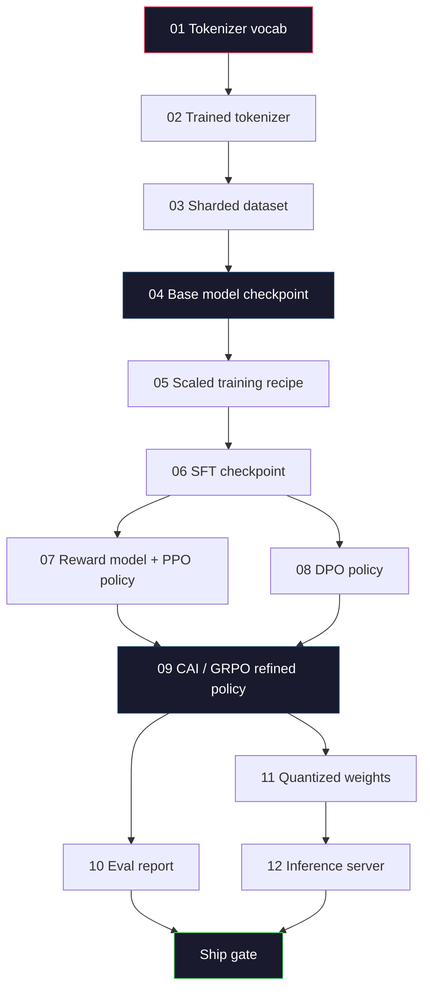
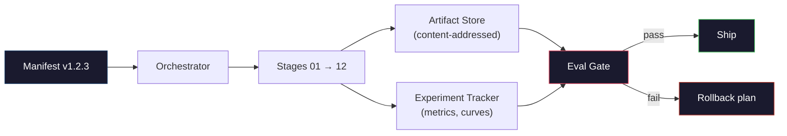

# 构建一条完整的 LLM 流水线

> 第 01 到 12 课的每样东西都是一条流水线里的一个阶段。本节课是把那些阶段变成一次端到端运行的脚手架：分词、预训练、规模化、SFT、对齐、评估、量化、服务。你不会在笔记本电脑上训练一个 70B 模型。你会产出编排层、manifest、eval 关卡和回滚计划——2026 年的前沿团队用它们来决定什么能交付。这是收官之作。

**类型：** Build
**语言：** Python（stdlib）
**前置要求：** 阶段 10 全部 01-12 课
**预计时间：** ~120 分钟

## 学习目标

- 把前面十一节课（tokenizer、数据、预训练、规模化、SFT、RLHF、DPO、CAI、eval、量化、推理）组合成一份可复现的流水线规格
- 定义阶段之间的产物契约：每个阶段消费什么、产出什么、下一个阶段如何验证输入
- 构建一个编排器，跟踪实验、给产物算哈希、用 eval 阈值卡住交付决策
- 设计回滚计划：哪些产物重跑便宜、哪些昂贵，以及一个损坏的 checkpoint 代价多大

## 问题所在

前面每节课都能用。tokenizer 训好了。微型 GPT 预训练了。SFT 数据集组装了。奖励模型训了。DPO 跑了。eval 测了。量化权重导出了。推理服务起来了。每一个都是个 notebook。每一个有自己的约定、自己的输出路径、自己的种子。

一次前沿训练不是 notebook。Llama 3 405B 在约 54 天里用了 3000 万 H100 小时。DeepSeek-V3 用了约 280 万 H800 小时。在那段时间里，一个损坏的 checkpoint、一次数据污染、一次 eval 退步，就能让团队损失一周墙钟时间和一个月的 GPU 预算。团队挺过这些靠的是流水线卫生：每个阶段都有确定性的输入、确定性的输出、一份 manifest、一个哈希、一道关卡。

这是收官之作。你不会在笔记本电脑上端到端跑这条流水线。你会写出协调各阶段的编排器、描述这次运行的 manifest、卡住交付决策的验证器，以及让第三方能从单个文件重跑你工作的回放计划。代码很小；纪律很大。

这套模式从 100M 到 1T 参数原样可扩展。同样的四个组件——manifest、编排器、eval 关卡、产物存储——既跑 Llama 3，也跑你业余玩的 GPT。差别在每个阶段配置里数字的大小，不在流水线的形状。

## 核心概念

### 十二个阶段

每节阶段 10 的课都是一个阶段。这是完整的依赖图。



阶段 07 和 08 能并行跑。其他一切都是硬依赖。阶段 02（tokenizer）的改动会让每个下游产物失效。阶段 10（eval）的改动只让交付决策失效。

### Manifest

manifest 是单个文件，把一次运行描述得完整到足以重放它。流水线产出的任何东西都不应依赖于不在 manifest 里的状态。这些字段无聊但必须有。

```
pipeline_version: 1.2.3
seed: 42
git_commit: a1b2c3d4
stages:
  01_tokenizer:
    recipe: bpe_32k
    input_hash: sha256:...
    output_hash: sha256:...
    wall_clock_sec: 3600
    cost_usd: 12
```

阶段 N 的输出哈希就是阶段 N+1 的输入哈希。任何偏差，流水线就停止。这就是你提早抓住数据损坏的方式。这也是另一个大洲上的队友验证他们的回放是否产出了和你相同产物的方式。

实践中团队用一个小的 YAML schema 加一个 manifest 检查器，它和上一次成功运行做 diff。任何超出预期字段（成本、墙钟）的差异都是红旗。

### 产物类型化

每个阶段的输出是一个有类型的产物。不是一个目录 blob，不是一个 pickle，而是一个有已知 schema 的具名类型。

| 阶段 | 产物类型 | 关键字段 |
|-------|--------------|-----------|
| 01-02 | Tokenizer | vocab.json、merges.txt、config.json、hash |
| 03 | Dataset | shards[]、行数、token 数、去重统计 |
| 04-05 | Checkpoint | weights.safetensors、config.json、优化器状态、步数 |
| 06 | SFT Model | checkpoint + SFT recipe + 数据混合 |
| 07 | Reward Model | RM checkpoint + 偏好数据哈希 |
| 08-09 | Policy | checkpoint + 参考哈希 + beta + 已消耗的 KL 预算 |
| 10 | Eval Report | 基准分数 + 退步 diff + eval 数据哈希 |
| 11 | Quantized Model | 量化权重 + 校准数据 + 相比 FP16 的精度差 |
| 12 | Server Spec | 端点 + 模型哈希 + 配置 + 可观测性钩子 |

类型化防止了最常见的失败模式：把一个阶段 08 的输出当成阶段 06 的输入，把一个 DPO 训练的模型经 SFT 路径交付。有类型的产物和有类型的阶段签名让这些错误成为编译期失败，而不是第五天的失败。

### Eval 关卡

交付不是 "训练完成"。交付是 "训练完成且 eval 关卡通过"。关卡在运行开始前就定义好。

```
gates:
  mmlu:      >= baseline + 0.5   # no regression
  humaneval: >= baseline + 1.0
  truthfulqa: >= baseline         # no drop
  safety_refusal_rate: <= 0.05
  kl_from_reference: <= 25.0
  cost_total_usd: <= 50000
```

每道关卡都是一个数值阈值。没有 "看起来不错" 的关卡。没有主观签字。如果每道关卡都通过，产物就被标为可交付。如果任何一道失败，运行就被搁置，等待一个具名 reviewer 的显式覆盖，而那个覆盖本身会记进 manifest。

两道关卡能抓住大多数灾难。一道 *退步* 关卡（新模型在核心基准上必须至少和上一个一样好）抓住训练 bug。一道 *KL 预算* 关卡（对齐后的策略偏离它的参考不得超过 X）抓住对齐过火。每条生产流水线两者都有。

### 编排器

一小段代码，读 manifest、分派阶段、跟踪产物、在任何契约违规时停止。这不是 Airflow。这不是 Kubeflow。为了流水线卫生，你想要一个你自己写的、无聊的东西。

编排器的职责很窄：

1. 从 manifest 解析出 DAG。
2. 对每个阶段，检查预期输出是否已经以正确的哈希存在（是就跳过）。
3. 运行阶段，捕获 stdout/stderr，测量墙钟和成本。
4. 把输出哈希和下游阶段的预期输入哈希核对。
5. 失败时，写一份部分 manifest，记下确切的失败阶段，并以非零退出。

那是 200 行 Python。它会长得像本节课的 `code/main.py` 文件。底层上，真实流水线用 `torchrun` 或 `ray` 在集群上执行各个阶段，但编排器本身跑在单台机器上。

### 实验跟踪与产物存储

两个外部系统锚定这条流水线。

**实验跟踪器（wandb、neptune、mlflow）。** 记录每个阶段的损失曲线、eval 指标、系统遥测。当你三周后需要把运行 A 和运行 B 对比时，你去跟踪器那里。团队几乎总是为此用一个托管的跟踪器——自己写会浪费本该投入训练的时间。

**产物存储（S3、R2、GCS）。** 用于 checkpoint、数据集、tokenizer、eval 报告的不可变对象存储。产物按哈希寻址，不是按文件名。像 `latest.pt` 这样的文件名是个坑；`ckpt-7b-step-20000-sha256:abc123.safetensors` 是个契约。

编排器对两者都写。跟踪器给看图表的人。产物存储给查输入的下一个阶段。

### 成本核算

一次前沿运行带着一个美元数字。预算纪律发生在两处。

**运行前估算。** 从 manifest 计算预期 FLOPs（预训练用：6 x 参数 x token）、预期 GPU 小时（FLOPs / 峰值吞吐 / 利用率），以及按当前租用价的美元成本。如果估算超过预算关卡，流水线拒绝启动。

**运行中跟踪。** 逐阶段的墙钟和成本记进 manifest。每个阶段之后，检查剩余预算。如果一个阶段超支，下一个阶段的关卡用新的剩余预算来评估。你不会等到 VC 打电话来才发现没钱了。

Llama 3 报告的成本是 6100 万美元。DeepSeek-V3 报告主预训练运行 560 万美元。这个比例主要是硬件效率加上 mixture-of-experts——但具体成本之所以可见，是因为两个团队都按阶段而非按运行来跟踪它。

### 可复现 vs 确定性

这俩不是一回事。*可复现* 意味着相同的 manifest 加相同的代码加相同的基础设施，产出一个具有等价下游指标的 checkpoint。*确定性* 意味着逐位相同的输出。

现代 LLM 训练可复现但不确定。分布式训练的归约顺序、GPU 核非确定性（cuBLAS、flash-attn）和混合精度舍入合在一起，产出在运行之间 1e-5 级别有差异的浮点数。这对不变的最终指标没问题。如果你想用位级 diff 来调试，那就是致命的。解药是记录每个阶段的输入哈希、输出哈希和头条指标——如果那些匹配，即使权重不是逐位相同，运行也算 "复现了"。



### 回滚计划

在运行开始前，写下每个阶段失败时该怎么办。三类。

- **重跑便宜**（小时级）：tokenizer、eval、量化、推理服务。直接重跑。
- **中等**（天级）：SFT、DPO、CAI。保留基座模型；只重跑对齐阶段。
- **昂贵**（周级和数百万美元）：预训练。这里的回滚计划不是 "重跑"。是 "用上一个好的 checkpoint，并用修订后的数据重跑更便宜的下游阶段"。

因为阶段依赖是有类型且哈希过的，编排器能自动计算回滚集：让失败的阶段加上它的每个后代失效。阶段 06（SFT）的失败让 06、07、08、09、10、11、12 失效。阶段 11（量化）的失败只让 11 和 12 失效。预先把这个写明，避免在团队凌晨 4 点筋疲力尽时临场发挥。

### 2026 年观察到的生产配方

大多数前沿团队收敛到了同一套骨架。

- Tokenizer：128k BPE 带字节兜底。在一个小而平衡的多语言切片上训练。
- 预训练：10-20T token，主要是 web 加代码加合成。Muon 或 AdamW 优化器。FSDP2 或 DeepSpeed ZeRO-3。梯度检查点。BF16 权重，FP32 主权重。
- SFT：50 万-200 万个指令对，人类和合成混合，对 eval 集严格去重。
- 对齐：DPO 或 CAI + GRPO。仅在偏好信号对 DPO 来说太多维时用 RLHF。
- Eval：MMLU-Pro、MATH、HumanEval+、GPQA、SWE-Bench Verified、LiveBench，加一个公众从不会看到的私有留出集。
- 量化：服务用 4-bit GPTQ 或 AWQ，精度差有影响的安全 eval 用 8-bit。
- 服务：vLLM、TensorRT-LLM 或自研。连续批处理。推测解码。KV cache 淘汰。

数字每六个月变一次。骨架不变。

## 动手构建

本节课的代码是一个编排器和一个 manifest 检查器，不是十二个训练脚本。每个阶段用一个占位符模拟，它产出一个形状和哈希都正确的输出产物。端到端跑一遍编排器，在你为真实阶段烧 GPU 钱之前，证明流水线的管路是通的。

完整实现见 `code/main.py`。关键部件：

- `Manifest` dataclass：流水线版本、种子、git commit、stages、gates。
- `Stage` dataclass：name、type、inputs（哈希）、output（哈希）、墙钟、成本。
- `Orchestrator.run()`：解析 DAG、分派阶段、核对哈希、更新 manifest。
- `EvalGate.check()`：读阈值，和最新 eval 报告对比，返回通过/失败。
- `ArtifactStore`（内存桩）：按哈希 put/get，模拟 S3。
- `CostTracker`：逐阶段和累计，超上限时停止。

`main.py` 里的流水线跑十二个占位阶段，产出一份 manifest，并触发一道失败的 eval 关卡来展示一个被搁置的运行长什么样。把每个占位符换成对应课的真实训练脚本，你就有了真实前沿流水线用的骨架。

## 上手使用

规范的工作流有三条命令。

```
python code/main.py plan    # validate manifest, compute cost estimate, print DAG
python code/main.py run     # execute stages, writing to manifest.out.yaml
python code/main.py gate    # read manifest.out.yaml, apply eval gates, ship-or-hold
```

每次都先跑 `plan`。大多数流水线 bug 在 plan 时就暴露了——缺失的关卡阈值、过期的哈希、预算超支。跑 `plan` 是免费的。跑 `run` 是昂贵的。在便宜的那一侧抓 bug 来省钱。

`gate` 的输出要么是 `SHIP`，要么是 `HOLD: <reason>`。一个被搁置的运行不是失败；它是个决策点。一个具名 reviewer 要么覆盖（覆盖会被记录），要么批准回滚。

## 交付

本节课产出 `outputs/skill-llm-pipeline-reviewer.md`。喂给它一份拟议的流水线 manifest，它检查所有契约：阶段类型化、哈希链、关卡、回滚计划、成本估算。它拒绝批准缺 eval 关卡、KL 预算无界，或混用 eval 和训练数据的 manifest。

## 练习

1. 扩展编排器以支持阶段 07 和 08 的并行执行。用 stdlib 的 `concurrent.futures` 模块。确认最终 manifest 记录了两个阶段的输出，并且阶段 09 的输入哈希是两者的一个确定性组合。

2. 加一道 "污染检查" 关卡。给定 eval 数据集哈希和训练数据集分片，计算重叠（精确字符串匹配或 13-gram 匹配）。重叠超过 0.1% 关卡就失败。喂给它一个被污染的训练集，确认关卡搁置了运行。

3. 从第一性原理实现一个成本估算器。对阶段 04（预训练），把 FLOPs 估为 6 x 参数 x token，假设 H100 上 40% MFU（模型 FLOPs 利用率）、989 TFLOPs BF16、2.50 美元/GPU 小时。报告一个用 2T token 训练的 7B 模型的估算。和公开的 Llama 2 数字对比。

4. 做一次部分回滚。模拟阶段 09（CAI）的失败，然后重跑阶段 09 到 12，同时让 01-08 保持缓存。编排器应该按哈希检测到缓存产物并跳过它们。测量相比完整重跑省下的墙钟。

5. 加上可观测性。为每个阶段发出 OpenTelemetry span，带参数、已见 token、损失和成本的属性。把 span 输到一个本地 collector。重点不是仪表盘；重点是每个阶段的健康都能从单个 trace ID 追溯。

## 关键术语

| 术语 | 人们怎么说 | 它实际是什么 |
|------|----------------|----------------------|
| Manifest | "那个配方文件" | 描述流水线版本、种子、逐阶段配置和关卡阈值的 YAML 或 JSON——足以重放一次运行 |
| 内容寻址 | "按哈希不按名" | 按内容的 SHA-256 存产物，这样你永远不会把版本 A 和版本 B 搞混 |
| Eval 关卡 | "交付标准" | 基准指标和安全分数上的数值阈值，产物被标为可交付前必须通过 |
| KL 预算 | "对齐漂了多远" | 跨对齐阶段累计 KL(policy \|\| reference) 的一个上限，作为关卡强制执行 |
| MFU | "你用了 GPU 多少" | 模型 FLOPs 利用率——实际 FLOPs 除以理论峰值。70B 规模典型 40%，7B 是 55% |
| 回滚计划 | "坏了我们怎么办" | 每个阶段失败时预先写好的一组动作：重跑、回退、用修订输入重训 |
| 编排器 | "指挥者" | 读 manifest、分派阶段、核对哈希、在任何契约违规时停止的进程 |
| 产物存储 | "给权重的版本化 S3" | 不可变的内容寻址对象存储——checkpoint、数据集、eval 报告的唯一真相来源 |
| 可复现 | "重放得到相同指标" | 位级权重不同但下游指标等价——分布式 LLM 训练的现实目标 |
| 成本关卡 | "你不能超过 X" | 运行前成本估算加运行中跟踪器——如果估算超预算，流水线拒绝启动 |

## 延伸阅读

- [Dubey et al., 2024 -- "The Llama 3 Herd of Models"](https://arxiv.org/abs/2407.21783) -- 对一条前沿流水线最详细的公开描述，含数据、训练、对齐、eval
- [DeepSeek-AI, 2024 -- "DeepSeek-V3 Technical Report"](https://arxiv.org/abs/2412.19437) -- 效率优先的流水线，成本约为 Llama 3 级训练的 1/10
- [Kaplan et al., 2020 -- "Scaling Laws for Neural Language Models"](https://arxiv.org/abs/2001.08361) -- 最初的算力-数据-参数缩放关系
- [Hoffmann et al., 2022 -- "Training Compute-Optimal Large Language Models (Chinchilla)"](https://arxiv.org/abs/2203.15556) -- 对 Kaplan 的修正，重新校准了现代数据预算
- [PyTorch FSDP2 documentation](https://pytorch.org/docs/stable/fsdp.html) -- 在 PyTorch 2.4+ 里取代 FSDP1 的分布式训练原语
- [Weights & Biases LLM Reports](https://wandb.ai/site/llms) -- 开源 LLM 运行的真实 manifest 和实验跟踪器输出，可作为可抄的模板
