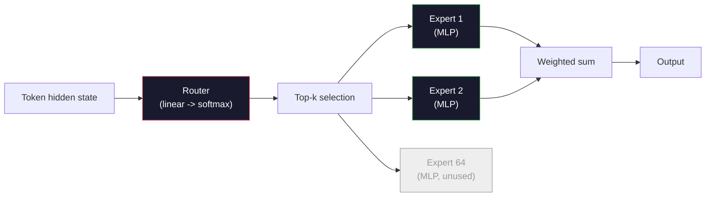

# 开放模型：架构走读

> 你在第 04 课从零搭了一个 GPT-2 Small。2026 年的前沿开放模型就是同一个家族，加上五六处具体改动。RMSNorm 取代 LayerNorm。SwiGLU 取代 GELU。RoPE 取代学习式位置。GQA 或 MLA 取代完整 MHA。规模化的 Mixture-of-Experts。你已经会的数学覆盖了它们的 95%。本节课把 Llama 3、DeepSeek-V3、Mixtral、Qwen 和 Gemma 并排读，点出每个架构分叉的确切那一行。

**类型：** Learn
**语言：** Python（stdlib）
**前置要求：** 阶段 10，第 04、05、12 课（预训练、规模化、推理）
**预计时间：** ~45 分钟

## 学习目标

- 读懂 Llama 3、Mistral、Mixtral、Gemma 2、Qwen 2.5 和 DeepSeek-V3 的 config.json，解释每一个字段
- 点出每个模型相对 GPT-2 Small 做的具体架构改动，并从第一性原理给出理由
- 仅凭一个模型的 config 就计算它的参数量、KV cache 大小和激活内存
- 在延迟、内存和能力约束下，为一个部署目标挑出正确的开放模型

## 问题所在

第 04 课你写了 350 行 numpy，得到一个 GPT-2 形状的模型。Llama 3 405B 有一份 200 页的技术报告。你的直觉是这俩是不同的怪兽。它们不是。那 200 页描述的是同一个对象，加上五六处有充分动机的修改，再加上一千个关于规模化的实现细节。骨架——embedding、transformer 块、注意力、MLP、norm、头——没变。

本节课是一份 diff。对每个主流开放模型家族，我们准确列出它相对 GPT-2 改了什么、为什么、代价是什么。读完，你能拿起一张新的模型卡，在脑子里把它翻译回 GPT-2 基线。

实际收益是：当 Meta 发布 Llama 5 或 DeepSeek 发布 V4 时，你不需要一个新的心智模型。你看看 config，看出哪个众所周知的旋钮动了，就知道下游影响是什么。2026 年的架构是一个有限的工具箱。每个新模型挑一个不同的子集。

## 核心概念

### 不变的核心

所有自回归开放模型都共享：

- token embedding 矩阵（vocab_size x hidden_dim）。
- N 个解码器块的堆叠：norm、自注意力、残差、norm、MLP、残差。
- 最终 norm 和投影到 vocab_size 的线性头（常和 embedding 权重共享）。
- 因果 mask，下一个 token 的交叉熵损失。

那就是形状。其余的都是旋钮。

### 真正会动的六个旋钮

在每个 2024-2026 年的前沿开放模型里，同样的六个设计选择被反复挑选：

1. **归一化。** LayerNorm -> RMSNorm。
2. **位置编码。** 学习式绝对位置 -> RoPE（加变体：YaRN、NTK）。
3. **激活。** GELU -> SwiGLU（或 GeGLU）。
4. **注意力头共享。** MHA -> GQA -> MQA -> MLA。
5. **稠密 vs 稀疏 MLP。** 稠密 -> Mixture-of-Experts。
6. **pre-norm 位置。** pre-norm 留下。post-norm 走了。

其他一切（学习率调度、数据混合、batch size、context 长度）住在训练配置里，不在架构里。六个旋钮。

### 旋钮 1：RMSNorm

LayerNorm 减均值、除标准差、缩放、平移。RMSNorm 只保留缩放：

```
RMSNorm(x) = x / sqrt(mean(x^2) + eps) * gamma
```

不减均值。没有偏置。每个 token 少一次 matmul。Zhang 和 Sennrich（2019）论证它在机器翻译上匹敌 LayerNorm，同时快 10%。每个现代开放模型都跑它。

代价：无。收益：小幅吞吐提升，代码更简单。

### 旋钮 2：RoPE

学习式位置 embedding 在 GPT-2 里是一张 1024 槽的查找表。Context 1025 就超出表尾了。模型无法外推超过它的训练长度。

旋转位置编码（RoPE，Su et al. 2021）在注意力点积之前，通过成对旋转每个 Q 和 K 向量来注入位置。旋转角是位置的确定性函数，所以没有任何要学的东西，也没有什么会用完。配上缩放技巧（NTK 感知插值、YaRN），一个在 8k context 上训练的模型能在推理时拉伸到 128k，精度损失不大。

```
q_rotated = rotate(q, angle(pos))
k_rotated = rotate(k, angle(pos))
score = q_rotated . k_rotated
```

每个 Llama、Mistral、Qwen、DeepSeek 和 Gemma 都用 RoPE。Gemma 2 用混合（大多数层用 RoPE，其余用局部滑动窗口注意力）。

### 旋钮 3：SwiGLU

GPT-2 的 MLP 是 `x -> gelu(xW1 + b1) -> (...)W2 + b2`。SwiGLU（Shazeer 2020）把激活换成一个门控乘积：

```
SwiGLU(x) = (xW1) * sigmoid(xW1) * xV
```

两个并行投影而不是一个，由 Swish 激活门控。经验上每参数困惑度更强。Llama 2 采用了它，大家都跟进。MLP 的隐藏大小通常设成让总参数量匹配原始稠密 MLP：如果 GPT-2 用 `ff_dim = 4 * hidden`，SwiGLU 用 `ff_dim = (2/3) * 4 * hidden = 8/3 * hidden`。

### 旋钮 4：注意力头共享

GPT-2 用 **多头注意力（MHA）**：每个头有自己的 Q、K、V 投影。

**多查询注意力（MQA，Shazeer 2019）** 让所有头共享一个 K 和一个 V。把 KV cache 砍 num_heads 倍，在典型模型上是 12 倍到 32 倍的削减。在难基准上精度略降。

**分组查询注意力（GQA，Ainslie et al. 2023）** 是中间地带：G 组 Q 头共享一个 K 和一个 V。Llama 3 8B 用 GQA，32 个 Q 头、8 个 KV 头（G=8），所以 KV cache 相比完整 MHA 缩小 4 倍。

**多头潜在注意力（MLA，DeepSeek 2024）** 把 K 和 V 压进一个共享的低秩潜在表示，再按头投影回去。进一步减小 KV cache，同时保留每个头的表达力。DeepSeek-V2 和 V3 靠它实现长 context 性能。

| 方案 | KV 头 | KV Cache | 精度 |
|--------|----------|----------|----------|
| MHA    | num_heads | 完整 | 最好 |
| GQA    | num_groups（G < num_heads） | 减小 num_heads / G | 接近 MHA |
| MQA    | 1 | 减小 num_heads | 小幅下降 |
| MLA    | 潜在表示，按头解压 | 比 MQA 更小 | 接近 MHA |

对任何超过约 13B 参数的模型，GQA 或 MLA 实际上是强制的。规模上的完整 MHA 是 KV cache 的灾难。

### 旋钮 5：Mixture of Experts

稠密 MLP 对每个 token 激活它全部参数。MoE MLP 每个块有 K 个专家和一个路由器，给每个 token 挑 top-k 个专家（通常 top-2）。只有那些专家的权重为那个 token 做一次前向传播。

```
router_logits = xW_r
indices, weights = top_k(router_logits, k=2)
output = sum_i weights[i] * expert[indices[i]](x)
```

吸引力在于：你能有 64 个各 7B 大小的专家（所以总参数量巨大），却每个 token 只跑其中 2 个（所以每 token 计算匹配一个稠密 7B 模型）。Mixtral 8x7B 有 47B 总参数但每个 token 只激活 13B。DeepSeek-V3 有 671B 总参数但每个 token 只激活 37B。



优点：同样的计算、更多参数、更好的容量。缺点：专家的内存仍然得住在某个地方（所以服务需要比稠密等价物更多的显存），给路由器做负载均衡很难，对齐时微调路由器本身是个研究领域。

### 旋钮 6：pre-norm 留下

原始 transformer 在每个子层之后应用 layer norm。GPT-2 之后每个开放模型都把它放在每个子层 *之前*。pre-norm 在深度上严格更易训练。没什么好争的。

### 逐模型 diff

下面这张表把这一切落到实处。

| 模型 | 年份 | 总参数 | 激活参数 | Norm | 激活 | 位置 | 注意力 | MoE | Context |
|-------|------|-------------|---------------|------|-----------|----------|-----------|-----|---------|
| GPT-2 Small | 2019 | 124M | 124M | LayerNorm | GELU | 学习式 | MHA（12 头） | 否 | 1k |
| Llama 3 8B | 2024 | 8B | 8B | RMSNorm | SwiGLU | RoPE | GQA (32/8) | 否 | 128k |
| Llama 3 70B | 2024 | 70B | 70B | RMSNorm | SwiGLU | RoPE | GQA (64/8) | 否 | 128k |
| Llama 3 405B | 2024 | 405B | 405B | RMSNorm | SwiGLU | RoPE | GQA (128/16) | 否 | 128k |
| Mistral 7B | 2023 | 7.2B | 7.2B | RMSNorm | SwiGLU | RoPE | GQA | 否 | 32k |
| Mixtral 8x7B | 2023 | 47B | 13B | RMSNorm | SwiGLU | RoPE | GQA | 是（8 专家，top-2） | 32k |
| Gemma 2 9B | 2024 | 9B | 9B | RMSNorm（前+后） | GeGLU | RoPE + 滑动 | GQA | 否 | 8k |
| Qwen 2.5 72B | 2024 | 72B | 72B | RMSNorm | SwiGLU | RoPE (YaRN) | GQA (64/8) | 否 | 128k |
| DeepSeek V2 236B | 2024 | 236B | 21B | RMSNorm | SwiGLU | RoPE | MLA | 是（160 专家，top-6） | 128k |
| DeepSeek V3 | 2024 | 671B | 37B | RMSNorm | SwiGLU | RoPE | MLA | 是（256 专家，top-8） | 128k |

扫一遍各列。RMSNorm 是通用的。SwiGLU 或它的 GeGLU 表亲是通用的。RoPE 是通用的。7B 以上 GQA 是通用的，除非被 MLA 取代。MoE 是顶端的区分项。

### 读一份 config.json

Llama 3 8B 配置：

```
{
  "hidden_size": 4096,
  "intermediate_size": 14336,
  "num_hidden_layers": 32,
  "num_attention_heads": 32,
  "num_key_value_heads": 8,
  "max_position_embeddings": 131072,
  "rope_theta": 500000.0,
  "rms_norm_eps": 1e-5,
  "vocab_size": 128256
}
```

每个字段都对应你已经实现过的某个东西。

- `hidden_size`：embedding 维度。
- `intermediate_size`：MLP 隐藏大小（3.5 倍 hidden——SwiGLU 的算式）。
- `num_hidden_layers`：堆叠深度。
- `num_attention_heads`：Q 头。
- `num_key_value_heads`：KV 头（GQA）。
- `max_position_embeddings`：训练 context 长度。
- `rope_theta`：RoPE 基频。Meta 把它从默认的 10k 缩放到 500k 以做长 context 外推。
- `rms_norm_eps`：数值稳定性。
- `vocab_size`：token 数。

仅凭这些你就能计算总参数、KV cache 和峰值激活内存。确切公式见 `code/main.py`。

### 激活内存预算

超过几十亿参数后，激活主导训练内存。预训练的经验法则（带梯度检查点）：

```
activation_mem ~ batch_size * seq_len * hidden_size * num_layers * bytes_per_element
```

对 batch 1、seq 8192、BF16、32 层、hidden 4096 的 Llama 3 8B：带检查点光激活大约 8 GB，不带检查点 40 GB。这就是为什么 flash-attention 和 ring-attention 重要——它们重写注意力计算，让激活塞得下。

### KV Cache 预算

最大 context 下的推理：

```
kv_cache = 2 * num_layers * num_kv_heads * head_dim * max_seq_len * bytes_per_element
```

128k context、BF16、head_dim = hidden / num_heads = 128 的 Llama 3 8B：
每条序列 `2 * 32 * 8 * 128 * 131072 * 2 = 17.2 GB`。

8B 权重在 BF16 下是 16 GB。单条 128k 序列的 KV cache 比权重还大。这就是驱动 GQA、MLA 和 KV cache 量化研究的内存压力。

### 每个模型何时胜出

- **单张 80GB GPU，无 MoE**：Llama 3 8B、Mistral 7B、Gemma 2 9B。易于服务，工具链广。
- **单节点（8 张 80GB），大容量**：Llama 3 70B、Qwen 2.5 72B。最高的稠密开放能力。
- **最高开放能力，接受 MoE 复杂性**：DeepSeek V3、Mixtral 8x22B。每激活 FLOP 的最佳能力。
- **长 context 需求**：Llama 3（用 RoPE 缩放到 128k）、DeepSeek（MLA 优势）。
- **低延迟服务**：Gemma 2 9B（滑动窗口削减长 context 计算）。

## 动手构建

本节课的代码是个计算器。给定任意 config.json，它按组件打印参数量、最大 context 下的 KV cache、SwiGLU MLP 比率，以及对架构的简短判定（稠密 / GQA / MLA / MoE）。

```python
config = {
    "hidden_size": 4096, "intermediate_size": 14336,
    "num_hidden_layers": 32, "num_attention_heads": 32,
    "num_key_value_heads": 8, "vocab_size": 128256,
    "max_position_embeddings": 131072,
}
```

脚本逐字段走查架构，计算 embedding、注意力（带 GQA 削减）、MLP（带 SwiGLU 扩展）、layernorm 和头的参数量。然后它计算所述 context 长度下的 KV cache 并打印一个摘要。

实现见 `code/main.py`。

## 上手使用

在脚本里捆绑的 Llama 3 8B、Mistral 7B、Mixtral 8x7B 和 DeepSeek V3 配置上跑这个计算器。对比参数细分。注意 MoE 模型的总参数量碾压稠密模型，但激活参数量往往更小。注意 DeepSeek V3 的 KV cache 比 Llama 3 405B 的更小，尽管它有更多总参数——那就是 MLA 在起作用。

然后插入你本地有的任意模型的配置，读摘要，决定它是否塞得进你的 GPU。

## 交付

本节课产出 `outputs/skill-open-model-picker.md`。给定一个部署目标（GPU 类型、显存、context 长度、延迟预算）和一个任务画像（聊天、代码、推理、长 context），它推荐一个开放模型、一个来自第 11 课的量化方案和一个来自第 12 课的推理栈，并对六个架构旋钮给出明确的推理。

## 练习

1. 从 HuggingFace 读 Qwen 2.5 72B 的配置。从零计算总参数。和 HF 报告的值对比，找出任何差异从哪来（head 维度舍入、KV 共享因子等）。

2. DeepSeek V3 用 256 个专家、top-8 路由。计算激活专家与总专家之比，和 Mixtral 8x7B 的 8 选 2 对比。从稀疏（25%）到更密的稀疏（3%）的转变，对每 FLOP 的容量意味着什么？

3. 计算 128k context 下 Llama 3 405B 在 FP8 和 BF16 的 KV cache。FP8 下是 BF16 数字的一半。在单个 8 张 H100 的节点上（每张 80GB = 总共 640GB，减去权重内存），你能服务多少条并行序列？

4. Gemma 2 交替使用完整注意力和滑动窗口注意力层。写出当一半层用 4096-token 滑动窗口而非完整 context 时 KV cache 的算式。在 8k 总 context 下这省多少内存？

5. 找一个本节课写完之后发布的近期前沿开放模型。识别它挑了六个旋钮里的哪些，以及它是否引入了第七个旋钮。一旦有新架构发布，这门课就会显得过时——目标是更新你的表，而不重建你的心智模型。

## 关键术语

| 术语 | 人们怎么说 | 它实际是什么 |
|------|----------------|----------------------|
| RMSNorm | "没有均值的 LayerNorm" | 只按均方根归一化，带一个学习的缩放——比 LayerNorm 便宜且相当 |
| RoPE | "旋转位置" | 按一个依赖位置的角度，成对地以 2D 旋转每个 Q 和 K 向量——配缩放技巧能外推超过训练长度 |
| SwiGLU | "新的 MLP 激活" | 带 Swish 的门控线性单元：`(xW1) * sigmoid(xW1) * xV`——每个 2024+ 开放模型的标准 |
| GQA | "中间地带的注意力" | 分组查询注意力：G 组 Q 头共享一个 K 和一个 V 头——缩小 KV cache 而无 MQA 的精度下降 |
| MLA | "DeepSeek 的注意力" | 多头潜在注意力：把 K/V 压进一个共享的低秩潜在表示，按头解压——大模型最小的 KV cache |
| MoE | "稀疏专家" | Mixture of Experts：每块 N 个 MLP，路由器每 token 挑 top-k——巨大的总参数，小的激活参数 |
| Top-k 路由 | "每 token 挑 k 个专家" | 路由器为每个专家算一个分数，激活最高的 k 个——典型 k 是 2（Mixtral）到 8（DeepSeek） |
| YaRN | "拉伸 RoPE" | 又一个 RoPE 扩展——插值旋转角，在推理时把 context 从 8k 扩到 128k+ |
| 滑动窗口注意力 | "别注意所有东西" | 每个 token 只注意最近 W 个 token——把注意力成本封顶在每 token O(W)，Gemma 2 和早期 Mistral 用 |
| 激活参数 | "每 token 跑什么" | 对 MoE 模型，每 token 做一次前向传播的参数量（远小于总参数）——决定每 token FLOPs |

## 延伸阅读

- [Dubey et al., 2024 -- "The Llama 3 Herd of Models"](https://arxiv.org/abs/2407.21783) -- 稠密 Llama 3 家族的架构和训练参考
- [DeepSeek-AI, 2024 -- "DeepSeek-V3 Technical Report"](https://arxiv.org/abs/2412.19437) -- MLA 加无辅助损失负载均衡加 671B MoE
- [Jiang et al., 2024 -- "Mixtral of Experts"](https://arxiv.org/abs/2401.04088) -- 经典的 MoE 开放模型论文
- [Su et al., 2021 -- "RoFormer: Enhanced Transformer with Rotary Position Embedding"](https://arxiv.org/abs/2104.09864) -- RoPE 论文
- [Shazeer, 2020 -- "GLU Variants Improve Transformer"](https://arxiv.org/abs/2002.05202) -- SwiGLU、GeGLU 及其同伴
- [Ainslie et al., 2023 -- "GQA: Training Generalized Multi-Query Transformer Models"](https://arxiv.org/abs/2305.13245) -- GQA 论文
- [Gemma 2 Team, 2024 -- "Gemma 2: Improving Open Language Models at a Practical Size"](https://arxiv.org/abs/2408.00118) -- 混合完整+滑动注意力，前+后 norm
- [Qwen Team, 2024 -- "Qwen 2.5 Technical Report"](https://arxiv.org/abs/2412.15115) -- YaRN context 扩展和长 context 训练配方
