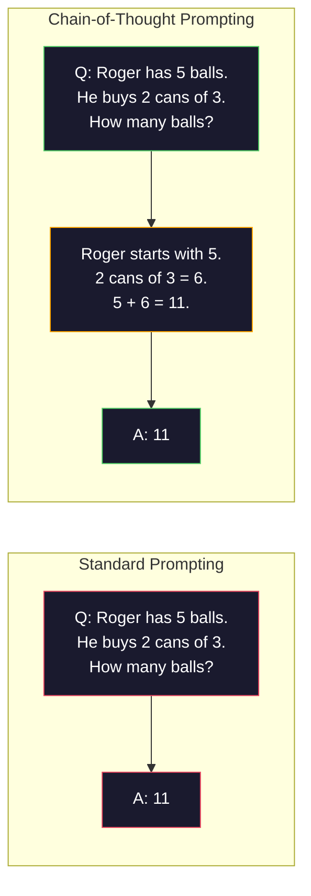
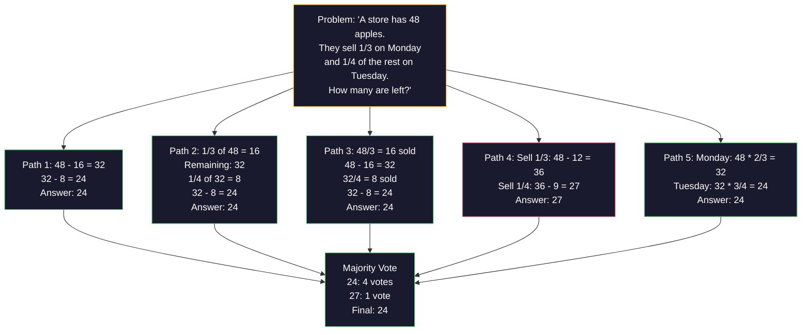
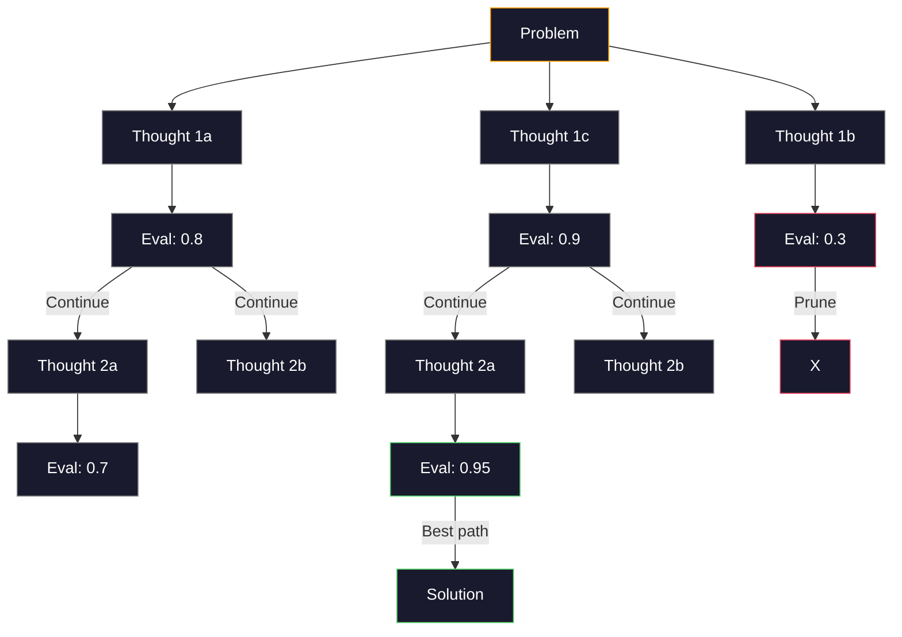

# Few-Shot、Chain-of-Thought、Tree-of-Thought

> 告诉模型该做什么，那是 prompting。教它该怎么想，那是工程。同一个模型、同一个任务、同一份数据上，78% 和 91% 准确率之间的差距，靠的不是更好的模型，而是更好的推理策略。

**类型：** Build
**语言：** Python
**前置要求：** 第 11.01 课（Prompt Engineering）
**预计时间：** ~45 分钟

## 学习目标

- 实现 few-shot prompting：挑选并格式化示例演示，把任务准确率拉满
- 套用思维链（CoT）推理，提升数学应用题这类多步问题的准确率
- 构建一个 tree-of-thought prompt，探索多条推理路径并选出最佳的那条
- 在标准基准上测量 zero-shot、few-shot 和 CoT 各自带来的准确率提升

## 问题所在

你在做一个数学辅导应用。你的 prompt 写着："解这道应用题。"在标准的小学数学基准 GSM8K 上，GPT-5 有 94% 的时候答对。你以为已经到顶了，其实没有——思维链还能再加 3-4 个点。

加上五个词——"Let's think step by step"——准确率就跳到 91%。再放几个做过的例子，它达到 95%。同一个模型，同样的温度，同样的 API 成本。唯一的差别是，你给了模型一张草稿纸。

这不是 hack，这就是推理的运作方式。人类不会一个念头就跳着解完多步问题，transformer 也不会。当你逼模型生成中间 token 时，这些 token 就成了下一个 token 的上下文的一部分。每一步推理喂给下一步。模型是真的一步步算到答案的。

但"一步步思考"是起点，不是终点。如果你采样五条推理路径再做多数表决呢？如果你让模型探索一棵可能性的树，评估并剪掉分支呢？如果你把推理和工具调用交错起来呢？这些都不是假设。它们是有论文、有实测提升的技术，本课你会把它们全部构建出来。

## 核心概念

### Zero-Shot 与 Few-Shot：示例什么时候胜过指令

Zero-shot prompting 只给模型一个任务，别的什么都不给。Few-shot prompting 先给它示例。

Wei et al.（2022）在 8 个基准上做了测量。对于情感分类这类简单任务，zero-shot 和 few-shot 的表现相差不到 2%。对于多步算术、符号推理这类复杂任务，few-shot 把准确率提升了 10-25%。

直觉是：示例是被压缩过的指令。与其描述输出格式，不如直接展示它。与其解释推理过程，不如直接演示它。模型在示例上做模式匹配，比解读抽象指令要可靠得多。


**Few-shot 占优时：** 对格式敏感的任务、分类、结构化抽取、领域专属术语，以及任何需要模型匹配特定模式的任务。

**Zero-shot 占优时：** 简单的事实性问题、示例会限制创造力的创意任务，以及找好示例比写好指令还难的任务。

### 示例选择：相似胜过随机

并非所有示例都一样好。挑选与目标输入相似的示例，在分类任务上比随机选择高出 5-15%（Liu et al., 2022）。三条原则：

1. **语义相似**：挑选在 embedding 空间里与输入最接近的示例
2. **标签多样**：让你的示例覆盖所有输出类别
3. **难度匹配**：匹配目标问题的复杂度

大多数任务的最优示例数是 3-5 个。少于 3 个，模型没有足够的信号去提取模式。多于 5 个，你会撞上收益递减，还白白浪费上下文窗口的 token。对于标签很多的分类，每个标签用一个示例。

### 思维链：给模型一张草稿纸

思维链（CoT）prompting 由 Google Brain 的 Wei et al.（2022）提出。想法很简单：与其只问模型要答案，不如让它先把推理步骤写出来。



从机制上讲，为什么这管用？transformer 生成的每个 token 都会成为下一个 token 的上下文。没有 CoT 时，模型必须把所有推理压缩进一次前向传播的隐藏状态里。有了 CoT，模型把中间计算以 token 的形式外化出来。每一个推理 token 都延展了有效的计算深度。

**GSM8K 基准（小学数学，8.5K 道题）：**

| 模型 | Zero-Shot | Zero-Shot CoT | Few-Shot CoT |
|-------|-----------|---------------|--------------|
| GPT-4o | 78% | 91% | 95% |
| GPT-5 | 94% | 97% | 98% |
| o4-mini (reasoning) | 97% | — | — |
| Claude Opus 4.7 | 93% | 97% | 98% |
| Gemini 3 Pro | 92% | 96% | 98% |
| Llama 4 70B | 80% | 89% | 94% |
| DeepSeek-V3.1 | 89% | 94% | 96% |

**关于推理模型的说明。** OpenAI 的 o 系列（o3、o4-mini）和 DeepSeek-R1 这类模型，会在给出答案之前在内部跑思维链。给推理模型加"Let's think step by step"是多余的，有时甚至帮倒忙——它们已经做过这件事了。

CoT 有两种口味：

**Zero-shot CoT**：在 prompt 后面追加"Let's think step by step"。不需要示例。Kojima et al.（2022）证明了这一句话就能在算术、常识和符号推理任务上提升准确率。

**Few-shot CoT**：提供带推理步骤的示例。比 zero-shot CoT 更有效，因为模型看到了你期望的确切推理格式。

**CoT 帮倒忙时**：简单的事实回忆（"法国的首都是哪？"）、单步分类，以及速度比准确率更重要的任务。CoT 每次查询会多出 50-200 token 的推理开销。对于高吞吐、低复杂度的任务，那就是白花的成本。

### Self-Consistency：多采样，一次表决

Wang et al.（2023）提出了 self-consistency。洞见在于：单条 CoT 路径可能含有推理错误。但如果你采样 N 条独立的推理路径（用 temperature > 0），再对最终答案做多数表决，错误就会相互抵消。



在最初的 PaLM 540B 实验里，self-consistency 把 GSM8K 准确率从 56.5%（单条 CoT）提升到 N=40 时的 74.4%。在 GPT-5 上提升很小（97% 到 98%），因为基础准确率已经饱和了。这项技术在基础 CoT 准确率 60-85% 的模型上最出彩——这是单路径错误频繁但不成系统的甜区。对于推理模型（o 系列、R1），self-consistency 已被内置的内部采样所涵盖。

代价是：N 个采样意味着 N 倍的 API 成本和延迟。实践中，N=5 就能抓住大部分收益。N=3 是有意义表决的下限。对大多数任务来说，N > 10 收益递减。

### Tree-of-Thought：分叉探索

Yao et al.（2023）提出了 Tree-of-Thought（ToT）。CoT 走的是一条线性推理路径，而 ToT 会探索多个分支，并在继续之前评估哪些最有希望。



ToT 有三个组成部分：

1. **想法生成**：产出多个候选的下一步
2. **状态评估**：给每个候选打分（可以用 LLM 自己当评估器）
3. **搜索算法**：在树上做 BFS 或 DFS，剪掉低分分支

在 Game of 24 任务上（用四个数字做算术凑出 24），GPT-4 用标准 prompting 解出 7.3% 的题。用 CoT 是 4.0%（这里 CoT 反而帮倒忙，因为搜索空间太宽）。用 ToT 是 74%。

ToT 很贵。树上每个节点都要一次 LLM 调用。一棵分支因子 3、深度 3 的树最多要 39 次 LLM 调用。只在搜索空间大但可评估的问题上用它——规划、解谜、带约束的创意问题求解。

### ReAct：思考 + 行动

Yao et al.（2022）把推理轨迹和动作结合了起来。模型在思考（生成推理）和行动（调用工具、搜索、计算）之间交替。

```mermaid
graph LR
    Q["Question:\nWhat is the\npopulation of the\ncountry where\nthe Eiffel Tower\nis located?"]
    T1["Thought: I need to\nfind which country\nhas the Eiffel Tower"]
    A1["Action: search\n'Eiffel Tower location'"]
    O1["Observation:\nParis, France"]
    T2["Thought: Now I need\nFrance's population"]
    A2["Action: search\n'France population 2024'"]
    O2["Observation:\n68.4 million"]
    T3["Thought: I have\nthe answer"]
    F["Answer:\n68.4 million"]

    Q --> T1 --> A1 --> O1 --> T2 --> A2 --> O2 --> T3 --> F

    style Q fill:#1a1a2e,stroke:#ffa500,color:#fff
    style T1 fill:#1a1a2e,stroke:#51cf66,color:#fff
    style A1 fill:#1a1a2e,stroke:#e94560,color:#fff
    style O1 fill:#1a1a2e,stroke:#808080,color:#fff
    style T2 fill:#1a1a2e,stroke:#51cf66,color:#fff
    style A2 fill:#1a1a2e,stroke:#e94560,color:#fff
    style O2 fill:#1a1a2e,stroke:#808080,color:#fff
    style T3 fill:#1a1a2e,stroke:#51cf66,color:#fff
    style F fill:#1a1a2e,stroke:#51cf66,color:#fff
```



在知识密集型任务上，ReAct 胜过纯 CoT，因为它能把推理建立在真实数据之上。在 HotpotQA（多跳问答）上，GPT-4 配合 ReAct 达到 35.1% 的精确匹配，而单用 CoT 是 29.4%。真正的威力在于推理错误会被观测结果纠正——模型可以在执行途中更新自己的计划。

ReAct 是现代 AI agent 的基石。每个 agent 框架（LangChain、CrewAI、AutoGen）都实现了某种 Thought-Action-Observation 循环的变体。你会在阶段 14 构建完整的 agent。本课讲的是这个 prompting 模式。

### 结构化 prompting：XML 标签、分隔符、标题

随着 prompt 变复杂，结构能防止模型混淆各个部分。三种做法：

**XML 标签**（配 Claude 最好，到哪都靠谱）：
```
<context>
You are reviewing a pull request.
The codebase uses TypeScript and React.
</context>

<task>
Review the following diff for bugs, security issues, and style violations.
</task>

<diff>
{diff_content}
</diff>

<output_format>
List each issue with: file, line, severity (critical/warning/info), description.
</output_format>
```

**Markdown 标题**（通用）：
```
## Role
Senior security engineer at a fintech company.

## Task
Analyze this API endpoint for vulnerabilities.

## Input
{api_code}

## Rules
- Focus on OWASP Top 10
- Rate each finding: critical, high, medium, low
- Include remediation steps
```

**分隔符**（极简但有效）：
```
---INPUT---
{user_text}
---END INPUT---

---INSTRUCTIONS---
Summarize the above in 3 bullet points.
---END INSTRUCTIONS---
```

### Prompt 链：顺序分解

有些任务对单个 prompt 来说太复杂了。Prompt 链把它们拆成多个步骤，一个 prompt 的输出成为下一个的输入。


链式胜过单 prompt，有三个原因：

1. **每一步都更简单**：模型处理一个聚焦的任务，而不是同时兼顾一切
2. **中间输出可检查**：你可以在步骤之间做校验和纠正
3. **不同步骤可以用不同模型**：抽取用便宜的模型，推理用贵的模型

### 性能对比

| 技术 | 最适合 | GSM8K 准确率（GPT-5） | API 调用次数 | Token 开销 | 复杂度 |
|-----------|----------|------------------------|-----------|----------------|------------|
| Zero-Shot | 简单任务 | 94% | 1 | 无 | 极低 |
| Few-Shot | 格式匹配 | 96% | 1 | 200-500 token | 低 |
| Zero-Shot CoT | 快速提升推理 | 97% | 1 | 50-200 token | 极低 |
| Few-Shot CoT | 单次调用准确率拉满 | 98% | 1 | 300-600 token | 低 |
| Self-Consistency（N=5） | 高风险推理 | 98.5% | 5 | 5 倍 token 成本 | 中 |
| 推理模型（o4-mini） | 直接替换 CoT | 97% | 1 | 隐藏（内部 2-10 倍） | 极低 |
| Tree-of-Thought | 搜索/规划问题 | 不适用（Game of 24 上 74%） | 10-40+ | 10-40 倍 token 成本 | 高 |
| ReAct | 知识接地的推理 | 不适用（HotpotQA 上 35.1%） | 3-10+ | 不定 | 高 |
| Prompt 链 | 复杂多步任务 | 96%（流水线） | 2-5 | 2-5 倍 token 成本 | 中 |

选对技术取决于三个因素：准确率要求、延迟预算和成本容忍度。对大多数生产系统来说，few-shot CoT 配上 3 采样的 self-consistency 兜底，能覆盖 90% 的用例。

## 动手构建

我们要构建一个数学解题器，把 few-shot prompting、思维链推理和 self-consistency 表决合进单条流水线。然后再为难题加上 tree-of-thought。

完整实现在 `code/advanced_prompting.py`。下面是关键组件。

### 第 1 步：Few-Shot 示例库

第一个组件管理 few-shot 示例，并为给定问题挑出最相关的那些。

```python
GSM8K_EXAMPLES = [
    {
        "question": "Janet's ducks lay 16 eggs per day. She eats three for breakfast every morning and bakes muffins for her friends every day with four. She sells every egg at the farmers' market for $2. How much does she make every day at the farmers' market?",
        "reasoning": "Janet's ducks lay 16 eggs per day. She eats 3 and bakes 4, using 3 + 4 = 7 eggs. So she has 16 - 7 = 9 eggs left. She sells each for $2, so she makes 9 * 2 = $18 per day.",
        "answer": "18"
    },
    ...
]
```

每个示例有三部分：问题、推理链和最终答案。推理链正是把一个普通 few-shot 示例变成 CoT few-shot 示例的关键。

### 第 2 步：思维链 prompt 构建器

prompt 构建器把 system message、带推理链的 few-shot 示例和目标问题组装成单个 prompt。

```python
def build_cot_prompt(question, examples, num_examples=3):
    system = (
        "You are a math problem solver. "
        "For each problem, show your step-by-step reasoning, "
        "then give the final numerical answer on the last line "
        "in the format: 'The answer is [number]'."
    )

    example_text = ""
    for ex in examples[:num_examples]:
        example_text += f"Q: {ex['question']}\n"
        example_text += f"A: {ex['reasoning']} The answer is {ex['answer']}.\n\n"

    user = f"{example_text}Q: {question}\nA:"
    return system, user
```

那个格式约束（"The answer is [number]"）至关重要。没有它，self-consistency 就无法跨采样抽取并比较答案。

### 第 3 步：Self-Consistency 表决

采样 N 条推理路径，取多数答案。

```python
def self_consistency_solve(question, examples, client, model, n_samples=5):
    system, user = build_cot_prompt(question, examples)

    answers = []
    reasonings = []
    for _ in range(n_samples):
        response = client.chat.completions.create(
            model=model,
            messages=[
                {"role": "system", "content": system},
                {"role": "user", "content": user}
            ],
            temperature=0.7
        )
        text = response.choices[0].message.content
        reasonings.append(text)
        answer = extract_answer(text)
        if answer is not None:
            answers.append(answer)

    vote_counts = Counter(answers)
    best_answer = vote_counts.most_common(1)[0][0] if vote_counts else None
    confidence = vote_counts[best_answer] / len(answers) if best_answer else 0

    return best_answer, confidence, reasonings, vote_counts
```

Temperature 0.7 很重要。在 temperature 0.0 下，N 个采样会完全相同，那就失去了意义。你需要足够的随机性来产生多样的推理路径，但又不能多到模型开始胡言乱语。

### 第 4 步：Tree-of-Thought 解题器

对于线性推理失效的问题，ToT 探索多种思路，并评估哪个方向最有希望。

```python
def tree_of_thought_solve(question, client, model, breadth=3, depth=3):
    thoughts = generate_initial_thoughts(question, client, model, breadth)
    scored = [(t, evaluate_thought(t, question, client, model)) for t in thoughts]
    scored.sort(key=lambda x: x[1], reverse=True)

    for current_depth in range(1, depth):
        next_thoughts = []
        for thought, score in scored[:2]:
            extensions = extend_thought(thought, question, client, model, breadth)
            for ext in extensions:
                ext_score = evaluate_thought(ext, question, client, model)
                next_thoughts.append((ext, ext_score))
        scored = sorted(next_thoughts, key=lambda x: x[1], reverse=True)

    best_thought = scored[0][0] if scored else ""
    return extract_answer(best_thought), best_thought
```

评估器本身就是一次 LLM 调用。你问模型："在 0.0 到 1.0 的尺度上，这条推理路径对解决问题有多大希望？"这是 ToT 的关键洞见——模型评估自己的部分解。

### 第 5 步：完整流水线

流水线把所有技术配上一套升级策略组合起来。

```python
def solve_with_escalation(question, examples, client, model):
    system, user = build_cot_prompt(question, examples)
    single_response = call_llm(client, model, system, user, temperature=0.0)
    single_answer = extract_answer(single_response)

    sc_answer, confidence, _, _ = self_consistency_solve(
        question, examples, client, model, n_samples=5
    )

    if confidence >= 0.8:
        return sc_answer, "self_consistency", confidence

    tot_answer, _ = tree_of_thought_solve(question, client, model)
    return tot_answer, "tree_of_thought", None
```

升级逻辑是：先试便宜的（单条 CoT）。如果 self-consistency 的置信度低于 0.8（5 个采样里不到 4 个一致），就升级到 ToT。这在成本和准确率之间取得平衡——大多数问题廉价解决，难题分到更多算力。

## 上手使用

### 配合 LangChain

LangChain 内置了对 prompt 模板和输出解析的支持，能简化 few-shot 和 CoT 模式：

```python
from langchain_core.prompts import FewShotPromptTemplate, PromptTemplate
from langchain_openai import ChatOpenAI

example_prompt = PromptTemplate(
    input_variables=["question", "reasoning", "answer"],
    template="Q: {question}\nA: {reasoning} The answer is {answer}."
)

few_shot_prompt = FewShotPromptTemplate(
    examples=examples,
    example_prompt=example_prompt,
    suffix="Q: {input}\nA: Let's think step by step.",
    input_variables=["input"]
)

llm = ChatOpenAI(model="gpt-4o", temperature=0.7)
chain = few_shot_prompt | llm
result = chain.invoke({"input": "If a train travels 120 km in 2 hours..."})
```

LangChain 还有用于语义相似度选择的 `ExampleSelector` 类：

```python
from langchain_core.example_selectors import SemanticSimilarityExampleSelector
from langchain_openai import OpenAIEmbeddings

selector = SemanticSimilarityExampleSelector.from_examples(
    examples,
    OpenAIEmbeddings(),
    k=3
)
```

### 配合 DSPy

DSPy 把 prompting 策略当成可优化的模块。你不再手工打磨 CoT prompt，而是定义一个 signature，让 DSPy 去优化 prompt：

```python
import dspy

dspy.configure(lm=dspy.LM("openai/gpt-4o", temperature=0.7))

class MathSolver(dspy.Module):
    def __init__(self):
        self.solve = dspy.ChainOfThought("question -> answer")

    def forward(self, question):
        return self.solve(question=question)

solver = MathSolver()
result = solver(question="Janet's ducks lay 16 eggs per day...")
```

DSPy 的 `ChainOfThought` 会自动加上推理轨迹。`dspy.majority` 实现了 self-consistency：

```python
result = dspy.majority(
    [solver(question=q) for _ in range(5)],
    field="answer"
)
```

### 对比：从零手写 vs 框架

| 特性 | 从零手写（本课） | LangChain | DSPy |
|---------|--------------------------|-----------|------|
| 对 prompt 格式的控制 | 完全 | 基于模板 | 自动 |
| Self-consistency | 手动表决 | 手动 | 内置（`dspy.majority`） |
| 示例选择 | 自定义逻辑 | `ExampleSelector` | `dspy.BootstrapFewShot` |
| Tree-of-Thought | 自定义树搜索 | 社区 chain | 未内置 |
| Prompt 优化 | 手动迭代 | 手动 | 自动编译 |
| 最适合 | 学习、定制流水线 | 标准工作流 | 研究、优化 |

## 交付

本节课产出两个产物。

**1. 推理链 prompt**（`outputs/prompt-reasoning-chain.md`）：一个生产可用的 few-shot CoT 加 self-consistency 的 prompt 模板。插入你自己的示例和问题领域即可。

**2. CoT 模式选择 skill**（`outputs/skill-cot-patterns.md`）：一套决策框架，根据任务类型、准确率要求和成本约束来挑选正确的推理技术。

## 练习

1. **测量差距**：取 10 道 GSM8K 题。每道分别用 zero-shot、few-shot、zero-shot CoT 和 few-shot CoT 解一遍。记录各自的准确率。在你的模型上，哪种技术带来的提升最大？

2. **示例选择实验**：对同样这 10 道题，对比随机选示例 vs 手挑相似示例。测量准确率差异。到什么程度，示例质量比示例数量更重要？

3. **Self-consistency 成本曲线**：在 20 道 GSM8K 题上，用 N=1、3、5、7、10 跑 self-consistency。画出准确率 vs 成本（总 token 数）。在你的模型上，曲线的拐点在哪？

4. **构建一个 ReAct 循环**：给流水线扩展一个计算器工具。当模型生成一个数学表达式时，用 Python 的 `eval()`（在沙箱里）执行它，再把结果喂回去。测量工具接地的推理是否胜过纯 CoT。

5. **用 ToT 做创意任务**：把 Tree-of-Thought 解题器改造成一个创意写作任务："写一个既好笑又悲伤的六词故事。"用 LLM 当评估器。分叉探索是否比一次性生成产出更好的创意输出？

## 关键术语

| 术语 | 大家怎么说 | 它实际是什么 |
|------|----------------|----------------------|
| Few-shot prompting | "给它几个例子" | 在 prompt 里放进输入-输出演示，锚定模型的输出格式和行为 |
| 思维链 | "让它一步步想" | 引出中间推理 token，在产出最终答案之前延展模型的有效计算 |
| Self-Consistency | "多跑几次" | 在 temperature > 0 下采样 N 条多样的推理路径，用多数表决选出最常见的最终答案 |
| Tree-of-Thought | "让它探索选项" | 在推理分支上做结构化搜索，每个部分解都被评估，只扩展有希望的路径 |
| ReAct | "思考 + 工具调用" | 在 Thought-Action-Observation 循环里，把推理轨迹和外部动作（搜索、计算、API 调用）交错起来 |
| Prompt 链 | "拆成步骤" | 把复杂任务分解为顺序的 prompt，每个输出喂给下一个输入 |
| Zero-shot CoT | "直接加上 think step by step" | 给 prompt 追加一句推理触发短语、不带任何示例，依靠模型潜在的推理能力 |

## 延伸阅读

- [Chain-of-Thought Prompting Elicits Reasoning in Large Language Models](https://arxiv.org/abs/2201.11903)——Wei et al. 2022。Google Brain 最初的 CoT 论文。看第 2-3 节的核心结果。
- [Self-Consistency Improves Chain of Thought Reasoning in Language Models](https://arxiv.org/abs/2203.11171)——Wang et al. 2023。self-consistency 论文。表 1 有你需要的全部数字。
- [Tree of Thoughts: Deliberate Problem Solving with Large Language Models](https://arxiv.org/abs/2305.10601)——Yao et al. 2023。ToT 论文。第 4 节的 Game of 24 结果是亮点。
- [ReAct: Synergizing Reasoning and Acting in Language Models](https://arxiv.org/abs/2210.03629)——Yao et al. 2022。现代 AI agent 的基石。第 3 节讲解 Thought-Action-Observation 循环。
- [Large Language Models are Zero-Shot Reasoners](https://arxiv.org/abs/2205.11916)——Kojima et al. 2022。"Let's think step by step"那篇论文。就它这么简单，效果好得出奇。
- [DSPy: Compiling Declarative Language Model Calls into Self-Improving Pipelines](https://arxiv.org/abs/2310.03714)——Khattab et al. 2023。把 prompting 当成一个编译问题。如果你想超越手工 prompt engineering，就读它。
- [OpenAI — Reasoning models guide](https://platform.openai.com/docs/guides/reasoning)——厂商指南，讲思维链什么时候从一个 prompt 层面的小技巧变成内部的、按 token 计价的"推理"模式。
- [Lightman et al., "Let's Verify Step by Step" (2023)](https://arxiv.org/abs/2305.20050)——过程奖励模型（PRM），给链上每一步打分；这种推理监督信号胜过只看结果的奖励。
- [Snell et al., "Scaling LLM Test-Time Compute Optimally" (2024)](https://arxiv.org/abs/2408.03314)——对 CoT 长度、self-consistency 采样和 MCTS 的系统研究；当准确率比延迟更重要时，"一步步思考"会走向何方。
