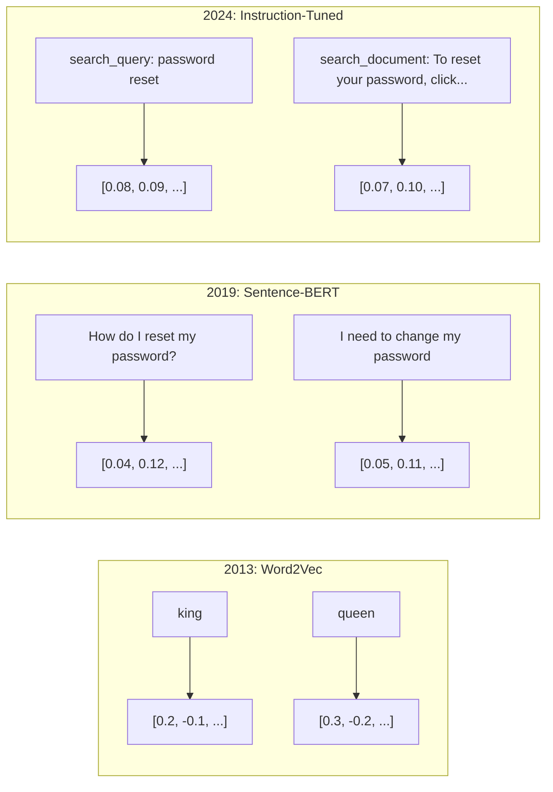
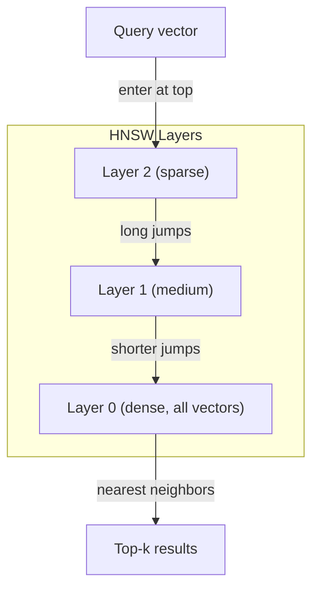
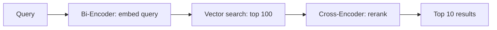

# 嵌入（embedding）与向量表示

> 文本是离散的，数学是连续的。每次你让 LLM 找"相似"文档、比较语义，或者做超越关键词的搜索时，你都在依赖这两个世界之间的一座桥。那座桥就是 embedding。如果你不理解 embedding，你就不理解现代 AI，你只是在用它。

**类型：** Build
**语言：** Python
**前置要求：** 阶段 11，第 01 课（Prompt Engineering）
**预计时间：** ~75 分钟
**相关：** 阶段 5 · 22（嵌入模型深入）讲 dense vs sparse vs multi-vector、Matryoshka 截断，以及按维度选模型。本课聚焦生产流水线（向量数据库、HNSW、相似度数学）。选模型之前先读阶段 5 · 22。

## 学习目标

- 用 API provider 和开源模型生成文本 embedding，并计算它们之间的余弦相似度
- 解释为什么 embedding 能解决关键词搜索搞不定的词表错配问题
- 构建一个语义搜索索引，按语义而非精确关键词匹配来检索文档
- 用检索基准（precision@k、recall）评估 embedding 质量，并为你的任务挑选正确的 embedding 模型

## 问题所在

你有 1 万张工单。一个客户写道："my payment didn't go through."（我的付款没成功。）你需要找出相似的历史工单。关键词搜索找到含"payment"和"didn't go through"的工单。它漏掉了"transaction failed"、"charge was declined"和"billing error"。这些工单用完全不同的词描述了完全相同的问题。

这就是词表错配问题。人类语言有几十种方式说同一件事。关键词搜索把每个词当成一个没有意义的独立符号。它无法知道"declined"和"didn't go through"指的是同一个概念。

你需要一种文本表示，让相似度由语义而非拼写决定。你需要一种方式，把"my payment didn't go through"和"transaction was declined"在某个数学空间里放得很近，同时把"my payment arrived on time"推得很远——尽管它们都含"payment"这个词。

那种表示就是 embedding。

## 核心概念

### 什么是 embedding？

embedding 是一个由浮点数构成的稠密向量，代表文本的语义。"稠密"这个词很重要——每一维都携带信息，不像稀疏表示（词袋、TF-IDF）那样大部分维度都是零。

"The cat sat on the mat"变成类似 `[0.023, -0.041, 0.087, ..., 0.012]` 的东西——一个含 768 到 3072 个数字的列表，具体取决于模型。这些数字编码了语义。你从不直接去看它们，你比较它们。

### Word2Vec 的突破

2013 年，Google 的 Tomas Mikolov 和同事发表了 Word2Vec。核心洞见：训练一个神经网络从邻居预测一个词（或从一个词预测邻居），隐藏层的权重就成了有意义的向量表示。

那个著名的结果：

```
king - man + woman = queen
```

在词 embedding 上做向量算术能捕捉语义关系。从"man"到"woman"的方向，大致和从"king"到"queen"的方向一样。就是在这一刻，这个领域意识到几何可以编码语义。

Word2Vec 产出 300 维向量。每个词不管上下文都只有一个向量。"river bank"和"bank account"里的"bank"有同一个 embedding。这个局限驱动了接下来十年的研究。

### 从词到句

词 embedding 表示单个 token。生产系统需要嵌入整句、整段或整篇文档。出现了四种做法：

**平均**：取句中所有词向量的均值。便宜、有损，对短文本意外地还不错。完全丢失词序——"dog bites man"和"man bites dog"得到一模一样的 embedding。

**CLS token**：transformer 模型（BERT，2018）输出一个特殊的 [CLS] token embedding，代表整个输入。比平均好，但 [CLS] token 是为下一句预测训练的，不是为相似度。

**对比学习**：显式训练模型把相似对推到一起、把不相似对推开。Sentence-BERT（Reimers & Gurevych, 2019）用了这个方法，成了现代 embedding 模型的基础。给定"How do I reset my password?"和"I need to change my password"，模型学到这两者应该有几乎一样的向量。

**指令微调的 embedding**：最新的做法。E5、GTE 这类模型接受一个任务前缀（"search_query:"、"search_document:"），告诉模型该产出哪种 embedding。这让一个模型服务于多个任务。



### 现代 embedding 模型

市场已经收敛到少数几个生产级选项（MTEB 分数为 2026 年初，MTEB v2）：

| 模型 | 提供方 | 维度 | MTEB | 上下文 | 每 1M token 成本 |
|-------|----------|-----------|------|---------|------------------|
| Gemini Embedding 2 | Google | 3072（Matryoshka） | 67.7（检索） | 8192 | $0.15 |
| embed-v4 | Cohere | 1024（Matryoshka） | 65.2 | 128K | $0.12 |
| voyage-4 | Voyage AI | 1024/2048（Matryoshka） | 66.8 | 32K | $0.12 |
| text-embedding-3-large | OpenAI | 3072（Matryoshka） | 64.6 | 8192 | $0.13 |
| text-embedding-3-small | OpenAI | 1536（Matryoshka） | 62.3 | 8192 | $0.02 |
| BGE-M3 | BAAI | 1024（dense+sparse+ColBERT） | 63.0 多语言 | 8192 | 开源权重 |
| Qwen3-Embedding | Alibaba | 4096（Matryoshka） | 66.9 | 32K | 开源权重 |
| Nomic-embed-v2 | Nomic | 768（Matryoshka） | 63.1 | 8192 | 开源权重 |

MTEB（Massive Text Embedding Benchmark）v2 覆盖检索、分类、聚类、重排和摘要等 100 多个任务。越高越好。到 2026 年，开源权重模型（Qwen3-Embedding、BGE-M3）在大多数维度上追平甚至超过闭源托管模型。Gemini Embedding 2 在纯检索上领先；Voyage/Cohere 在特定领域（金融、法律、代码）领先。在投入之前，永远先拿你自己的查询跑基准。

### 相似度度量

给定两个 embedding 向量，有三种衡量它们有多相似的方式：

**余弦相似度**：两个向量夹角的余弦值。范围从 -1（相反）到 1（方向相同）。忽略幅度——一个 10 词的句子和一篇 500 词的文档，只要方向相同就能得 1.0 分。这是 90% 用例的默认选择。

```
cosine_sim(a, b) = dot(a, b) / (||a|| * ||b||)
```

**点积**：两个向量的原始内积。当向量已归一化（单位长度）时，与余弦相似度完全相同。计算更快。OpenAI 的 embedding 是归一化的，所以点积和余弦给出相同的排序。

```
dot(a, b) = sum(a_i * b_i)
```

**欧氏（L2）距离**：向量空间里的直线距离。越小 = 越相似。对幅度差异敏感。当空间里的绝对位置重要、而不只是方向重要时使用。

```
L2(a, b) = sqrt(sum((a_i - b_i)^2))
```

什么时候用哪个：

| 度量 | 适用于 | 避免用于 |
|--------|----------|------------|
| 余弦相似度 | 比较不同长度的文本；大多数检索任务 | 幅度本身携带信息时 |
| 点积 | embedding 已归一化；追求最快速度 | 向量幅度各不相同时 |
| 欧氏距离 | 聚类；空间最近邻问题 | 比较长度差异极大的文档时 |

### 向量数据库与 HNSW

暴力相似度搜索把查询和每个存储的向量逐一比较。100 万个 1536 维向量，那就是每次查询 15 亿次乘加运算。太慢了。

向量数据库用近似最近邻（ANN）算法解决这个。主流算法是 HNSW（Hierarchical Navigable Small World）：

1. 构建一个多层的向量图
2. 上层稀疏——远距离簇之间的长程连接
3. 下层稠密——邻近向量之间的细粒度连接
4. 搜索从顶层开始，贪心地往下逐层细化
5. 以 O(log n) 而非 O(n) 的时间返回近似的 top-k 结果

HNSW 用一点点准确率损失（通常 95-99% recall）换来巨大的速度提升。1000 万个向量时，暴力搜索要几秒，HNSW 只要几毫秒。



生产可选项：

| 数据库 | 类型 | 最适合 | 最大规模 |
|----------|------|----------|-----------|
| Pinecone | 托管 SaaS | 零运维生产 | 数十亿 |
| Weaviate | 开源 | 自托管、混合搜索 | 1 亿+ |
| Qdrant | 开源 | 高性能、过滤 | 1 亿+ |
| ChromaDB | 嵌入式 | 原型、本地开发 | 100 万 |
| pgvector | Postgres 扩展 | 已经在用 Postgres | 1000 万 |
| FAISS | 库 | 进程内、研究 | 10 亿+ |

### 分块策略

文档太长，没法嵌入成单个向量。一份 50 页的 PDF 涵盖几十个主题——它的 embedding 变成了一切的平均，谁都不像。你把文档切成块，逐块嵌入。

**定长分块**：每 N 个 token 切一块，块间重叠 M 个 token。简单可预测。文档没有清晰结构时效果好。一个 512 token、重叠 50 token 的块：块 1 是 token 0-511，块 2 是 token 462-973。

**基于句子的分块**：在句子边界切，把句子聚到一起直到逼近 token 上限。每块至少是一个完整句子。比定长好，因为你绝不会把一个想法拦腰切断。

**递归分块**：先尝试在最大边界切（章节标题）。如果还是太大，试段落边界。然后句子边界。然后字符上限。这就是 LangChain 的 `RecursiveCharacterTextSplitter`，对混合格式的语料效果不错。

**语义分块**：嵌入每一句，然后把 embedding 相似的连续句子聚到一起。当 embedding 相似度跌破阈值时，开一个新块。昂贵（需要逐句嵌入），但产出最连贯的块。

| 策略 | 复杂度 | 质量 | 最适合 |
|----------|-----------|---------|----------|
| 定长 | 低 | 还行 | 非结构化文本、日志 |
| 基于句子 | 低 | 好 | 文章、邮件 |
| 递归 | 中 | 好 | Markdown、HTML、混合文档 |
| 语义 | 高 | 最佳 | 检索质量至关重要时 |

大多数系统的甜区：256-512 token 的块，配 50 token 重叠。

### Bi-Encoder 与 Cross-Encoder

bi-encoder 独立嵌入查询和文档，再比较向量。快——你只嵌入查询一次，再和预先算好的文档 embedding 比较。这就是你做检索用的。

cross-encoder 把查询和一篇文档当成单个输入，输出一个相关性分数。慢——它把每个查询-文档对都过一遍完整模型。但准确得多，因为它能同时在查询和文档 token 之间做注意力。

生产模式是：bi-encoder 检索出 top-100 候选，cross-encoder 把它们重排到 top-10。这就是先检索后重排的流水线。



重排模型：Cohere Rerank 3.5（每 1000 次查询 $2）、BGE-reranker-v2（免费、开源）、Jina Reranker v2（免费、开源）。

### Matryoshka embedding

传统 embedding 是全有或全无。一个 1536 维向量就用 1536 个浮点数。不重新训练就没法截断到 256 维。

Matryoshka Representation Learning（Kusupati et al., 2022）解决了这个。模型被训练成让前 N 维捕捉最重要的信息，像俄罗斯套娃一样。把一个 1536 维的 Matryoshka embedding 截断到 256 维会损失一些准确率，但仍然可用。

OpenAI 的 text-embedding-3-small 和 text-embedding-3-large 通过 `dimensions` 参数支持 Matryoshka 截断。请求 256 维而非 1536 维，存储减少 6 倍，在 MTEB 基准上准确率损失大约 3-5%。

### 二值量化

一个 1536 维 embedding 以 float32 存储要用 6144 字节。乘以 1000 万篇文档：光向量就是 61 GB。

二值量化把每个浮点数转成单个比特：正值变 1，负值变 0。存储从 6144 字节降到 192 字节——减少 32 倍。相似度用汉明距离（数不同比特的个数）计算，CPU 一条指令就能完成。

准确率损失在检索 recall 上约 5-10%。常见模式是：用二值量化在数百万向量上做第一轮搜索，然后用全精度向量给 top-1000 重新打分。这能让你以 32 倍更少的内存，拿到全精度 95%+ 的准确率。

## 动手构建

我们从零构建一个语义搜索引擎。没有向量数据库，没有外部 embedding API。纯 Python，数学部分用 numpy。

### 第 1 步：文本分块

```python
def chunk_text(text, chunk_size=200, overlap=50):
    words = text.split()
    chunks = []
    start = 0
    while start < len(words):
        end = start + chunk_size
        chunk = " ".join(words[start:end])
        chunks.append(chunk)
        start += chunk_size - overlap
    return chunks


def chunk_by_sentences(text, max_chunk_tokens=200):
    sentences = text.replace("\n", " ").split(".")
    sentences = [s.strip() + "." for s in sentences if s.strip()]
    chunks = []
    current_chunk = []
    current_length = 0
    for sentence in sentences:
        sentence_length = len(sentence.split())
        if current_length + sentence_length > max_chunk_tokens and current_chunk:
            chunks.append(" ".join(current_chunk))
            current_chunk = []
            current_length = 0
        current_chunk.append(sentence)
        current_length += sentence_length
    if current_chunk:
        chunks.append(" ".join(current_chunk))
    return chunks
```

### 第 2 步：从零构建 embedding

我们用带 L2 归一化的 TF-IDF 实现一个简单的稠密 embedding。这不是神经 embedding，但它遵守同样的契约：文本进，定长向量出，相似的文本产出相似的向量。

```python
import math
import numpy as np
from collections import Counter

class SimpleEmbedder:
    def __init__(self):
        self.vocab = []
        self.idf = []
        self.word_to_idx = {}

    def fit(self, documents):
        vocab_set = set()
        for doc in documents:
            vocab_set.update(doc.lower().split())
        self.vocab = sorted(vocab_set)
        self.word_to_idx = {w: i for i, w in enumerate(self.vocab)}
        n = len(documents)
        self.idf = np.zeros(len(self.vocab))
        for i, word in enumerate(self.vocab):
            doc_count = sum(1 for doc in documents if word in doc.lower().split())
            self.idf[i] = math.log((n + 1) / (doc_count + 1)) + 1

    def embed(self, text):
        words = text.lower().split()
        count = Counter(words)
        total = len(words) if words else 1
        vec = np.zeros(len(self.vocab))
        for word, freq in count.items():
            if word in self.word_to_idx:
                tf = freq / total
                vec[self.word_to_idx[word]] = tf * self.idf[self.word_to_idx[word]]
        norm = np.linalg.norm(vec)
        if norm > 0:
            vec = vec / norm
        return vec
```

### 第 3 步：相似度函数

```python
def cosine_similarity(a, b):
    dot = np.dot(a, b)
    norm_a = np.linalg.norm(a)
    norm_b = np.linalg.norm(b)
    if norm_a == 0 or norm_b == 0:
        return 0.0
    return float(dot / (norm_a * norm_b))


def dot_product(a, b):
    return float(np.dot(a, b))


def euclidean_distance(a, b):
    return float(np.linalg.norm(a - b))
```

### 第 4 步：带暴力搜索的向量索引

```python
class VectorIndex:
    def __init__(self):
        self.vectors = []
        self.texts = []
        self.metadata = []

    def add(self, vector, text, meta=None):
        self.vectors.append(vector)
        self.texts.append(text)
        self.metadata.append(meta or {})

    def search(self, query_vector, top_k=5, metric="cosine"):
        scores = []
        for i, vec in enumerate(self.vectors):
            if metric == "cosine":
                score = cosine_similarity(query_vector, vec)
            elif metric == "dot":
                score = dot_product(query_vector, vec)
            elif metric == "euclidean":
                score = -euclidean_distance(query_vector, vec)
            else:
                raise ValueError(f"Unknown metric: {metric}")
            scores.append((i, score))
        scores.sort(key=lambda x: x[1], reverse=True)
        results = []
        for idx, score in scores[:top_k]:
            results.append({
                "text": self.texts[idx],
                "score": score,
                "metadata": self.metadata[idx],
                "index": idx
            })
        return results

    def size(self):
        return len(self.vectors)
```

### 第 5 步：语义搜索引擎

```python
class SemanticSearchEngine:
    def __init__(self, chunk_size=200, overlap=50):
        self.embedder = SimpleEmbedder()
        self.index = VectorIndex()
        self.chunk_size = chunk_size
        self.overlap = overlap

    def index_documents(self, documents, source_names=None):
        all_chunks = []
        all_sources = []
        for i, doc in enumerate(documents):
            chunks = chunk_text(doc, self.chunk_size, self.overlap)
            all_chunks.extend(chunks)
            name = source_names[i] if source_names else f"doc_{i}"
            all_sources.extend([name] * len(chunks))
        self.embedder.fit(all_chunks)
        for chunk, source in zip(all_chunks, all_sources):
            vec = self.embedder.embed(chunk)
            self.index.add(vec, chunk, {"source": source})
        return len(all_chunks)

    def search(self, query, top_k=5, metric="cosine"):
        query_vec = self.embedder.embed(query)
        return self.index.search(query_vec, top_k, metric)

    def search_with_scores(self, query, top_k=5):
        results = self.search(query, top_k)
        return [
            {
                "text": r["text"][:200],
                "source": r["metadata"].get("source", "unknown"),
                "score": round(r["score"], 4)
            }
            for r in results
        ]
```

### 第 6 步：对比相似度度量

```python
def compare_metrics(engine, query, top_k=3):
    results = {}
    for metric in ["cosine", "dot", "euclidean"]:
        hits = engine.search(query, top_k=top_k, metric=metric)
        results[metric] = [
            {"score": round(h["score"], 4), "preview": h["text"][:80]}
            for h in hits
        ]
    return results
```

## 上手使用

用上生产级 embedding API，架构保持不变。只有 embedder 变了：

```python
from openai import OpenAI

client = OpenAI()

def openai_embed(texts, model="text-embedding-3-small", dimensions=None):
    kwargs = {"model": model, "input": texts}
    if dimensions:
        kwargs["dimensions"] = dimensions
    response = client.embeddings.create(**kwargs)
    return [item.embedding for item in response.data]
```

用 OpenAI 做 Matryoshka 截断——同一个模型，更少的维度，更低的存储：

```python
full = openai_embed(["semantic search query"], dimensions=1536)
compact = openai_embed(["semantic search query"], dimensions=256)
```

256 维向量用的存储少 6 倍。对 1000 万篇文档来说，是 10 GB vs 61 GB。在标准基准上准确率损失大约 3-5%。

用 Cohere 做重排：

```python
import cohere

co = cohere.ClientV2()

results = co.rerank(
    model="rerank-v3.5",
    query="What is the refund policy?",
    documents=["Full refund within 30 days...", "No refunds after 90 days..."],
    top_n=3
)
```

本地 embedding、不依赖任何 API：

```python
from sentence_transformers import SentenceTransformer

model = SentenceTransformer("BAAI/bge-small-en-v1.5")
embeddings = model.encode(["semantic search query", "another document"])
```

我们构建里的 VectorIndex 类对这些都适用。换掉 embedding 函数，保留搜索逻辑即可。

## 交付

本节课产出：
- `outputs/prompt-embedding-advisor.md`——一个 prompt，为特定用例挑选 embedding 模型和策略
- `outputs/skill-embedding-patterns.md`——一个 skill，教 agent 如何在生产中有效使用 embedding

## 练习

1. **度量对比**：用余弦相似度、点积和欧氏距离，对样本文档跑同样的 5 个查询。记录各自的 top-3 结果。哪些查询上这几个度量意见不一？为什么？

2. **块大小实验**：用 50、100、200、500 词的块大小给样本文档建索引。每种都跑 5 个查询，记录 top-1 相似度分数。画出块大小和检索质量的关系。找到块更大开始帮倒忙的那个点。

3. **Matryoshka 模拟**：构建一个产出 500 维向量的 SimpleEmbedder。截断到 50、100、200、500 维。测量每次截断下检索 recall 如何退化。这在不需要真正训练技巧的情况下模拟了 Matryoshka 行为。

4. **二值量化**：拿搜索引擎里的 embedding，把它们转成二进制（正为 1，负为 0），并实现汉明距离搜索。把 top-10 结果和全精度余弦相似度对比。测量重叠百分比。

5. **基于句子的分块**：用 `chunk_by_sentences` 替换定长分块。跑同样的查询并对比检索分数。尊重句子边界是否改善了结果？

## 关键术语

| 术语 | 大家怎么说 | 它实际是什么 |
|------|----------------|----------------------|
| Embedding | "文本变数字" | 一个稠密向量，几何上的接近编码了语义相似 |
| Word2Vec | "embedding 鼻祖" | 2013 年的模型，通过预测上下文词来学习词向量；证明了向量算术能编码语义 |
| 余弦相似度 | "两个向量有多像" | 向量夹角的余弦值；1 = 方向相同，0 = 正交，-1 = 相反 |
| HNSW | "快速向量搜索" | Hierarchical Navigable Small World 图——多层结构，实现 O(log n) 的近似最近邻搜索 |
| Bi-encoder | "分开嵌入，快速比较" | 把查询和文档独立编码成向量；支持预计算和快速检索 |
| Cross-encoder | "慢但准的重排器" | 把查询-文档对联合过一遍完整模型；准确率更高，无法预计算 |
| Matryoshka embedding | "可截断的向量" | 训练成前 N 维捕捉最重要信息的 embedding，支持可变大小存储 |
| 二值量化 | "1 比特 embedding" | 把浮点向量转成二进制（只留符号位），用汉明距离搜索，存储减少 32 倍 |
| 分块 | "为嵌入切文档" | 把文档拆成 256-512 token 的片段，让每段都能独立嵌入和检索 |
| 向量数据库 | "embedding 的搜索引擎" | 为存储向量、并大规模执行近似最近邻搜索而优化的数据存储 |
| 对比学习 | "靠比较来训练" | 一种训练方法，把相似对的 embedding 推到一起、把不相似对的推开 |
| MTEB | "embedding 基准" | Massive Text Embedding Benchmark——横跨 8 类任务的 56 个数据集；比较 embedding 模型的标准 |

## 延伸阅读

- Mikolov et al., "Efficient Estimation of Word Representations in Vector Space" (2013)——用 king-queen 类比开启 embedding 革命的 Word2Vec 论文
- Reimers & Gurevych, "Sentence-BERT: Sentence Embeddings using Siamese BERT-Networks" (2019)——如何训练 bi-encoder 做句子级相似度，现代 embedding 模型的基础
- Kusupati et al., "Matryoshka Representation Learning" (2022)——OpenAI 在 text-embedding-3 上采用的可变维度 embedding 背后的技术
- Malkov & Yashunin, "Efficient and Robust Approximate Nearest Neighbor using Hierarchical Navigable Small World Graphs" (2018)——HNSW 论文，大多数生产向量搜索背后的算法
- OpenAI Embeddings Guide (platform.openai.com/docs/guides/embeddings)——text-embedding-3 模型的实用参考，包括 Matryoshka 降维
- MTEB Leaderboard (huggingface.co/spaces/mteb/leaderboard)——跨任务、跨语言比较所有 embedding 模型的实时基准
- [Muennighoff et al., "MTEB: Massive Text Embedding Benchmark" (EACL 2023)](https://arxiv.org/abs/2210.07316)——定义了榜单所报告的 8 类任务（分类、聚类、配对分类、重排、检索、STS、摘要、双语文本挖掘）的基准；在相信任何单一 MTEB 分数之前先读它。
- [Sentence Transformers documentation](https://www.sbert.net/)——bi-encoder vs cross-encoder、池化策略，以及本课实现的"摄入-切分-嵌入-存储"RAG 流水线的权威参考。
