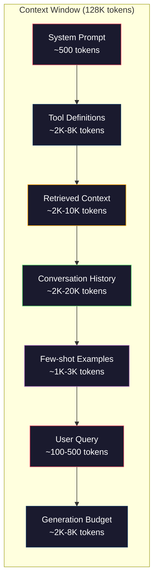
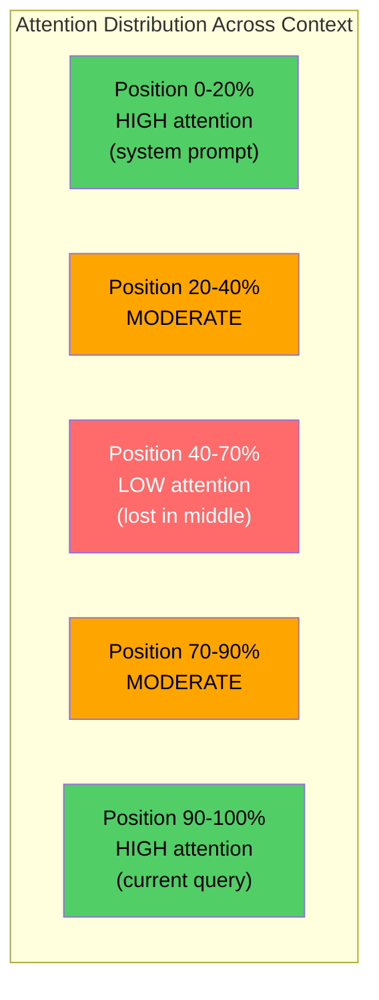
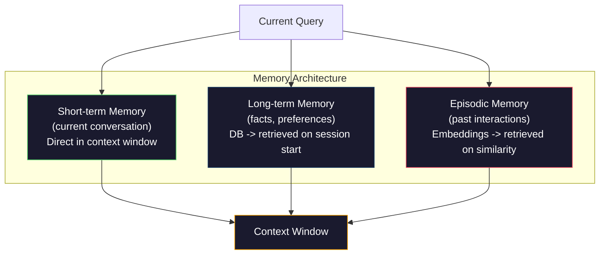

# Context Engineering：窗口、预算、记忆与检索

> Prompt engineering 只是个子集。Context engineering 才是整盘棋。Prompt 是你敲进去的一个字符串。Context 是进入模型窗口的一切：system 指令、检索到的文档、工具定义、对话历史、few-shot 示例，以及 prompt 本身。2026 年最好的 AI 工程师都是 context 工程师。他们决定什么放进去、什么留在外面，以及按什么顺序。

**类型：** Build
**语言：** Python
**前置要求：** 阶段 10（从零构建 LLM）、阶段 11 第 01-02 课
**预计时间：** ~90 分钟
**相关：** 阶段 11 · 15（Prompt Caching）——对缓存友好的布局是 context engineering 的延伸。阶段 5 · 28（长上下文评估）讲如何用 NIAH/RULER 测量 lost-in-the-middle。

## 学习目标

- 计算覆盖所有上下文窗口组件的 token 预算（system prompt、工具、历史、检索到的文档、生成余量）
- 实现上下文窗口管理策略：截断、摘要，以及用于对话历史的滑动窗口
- 给上下文组件排优先级和顺序，把模型的注意力最大化地聚到最相关的信息上
- 构建一个上下文组装器，根据查询类型和可用窗口空间动态分配 token

## 问题所在

Claude Opus 4.7 有 200K token 窗口（beta 版 1M）。GPT-5 有 400K。Gemini 3 Pro 有 2M。Llama 4 号称 10M。这些数字听着大得吓人，直到你把它们填满。

下面是一个编码助手的真实拆解。System prompt：500 token。50 个工具的定义：8000 token。检索到的文档：4000 token。对话历史（10 轮）：6000 token。当前用户查询：200 token。生成预算（最大输出）：4000 token。合计：22700 token。这才占一个 128K 窗口的 18%。

但注意力不随上下文长度线性增长。一个有 128K token 上下文的模型，付的是平方级的注意力代价（原版 transformer 是 O(n^2)，不过大多数生产模型用的是高效注意力变体）。更重要的是，检索准确率会退化。"大海捞针"测试表明，模型很难找到放在长上下文中间的信息。Liu et al.（2023）的研究显示，LLM 检索长上下文开头和结尾的信息时准确率近乎完美，但放在中间（上下文 40-70% 的位置）的信息，准确率会下降 10-20%。这种"lost-in-the-middle"效应因模型而异，但影响所有当前的架构。

实用的教训是：有 200K token 可用，不等于用满 200K token 就有效。一个精心策划的 10K token 上下文，往往胜过一个一股脑塞进去的 100K token 上下文。Context engineering 就是在上下文窗口里最大化信噪比的学科。

你放进窗口的每个 token，都挤掉了一个本可以承载更相关信息的 token。每个不相关的工具定义、每一轮过时的对话、每一块答不到点上的检索文本——它们每一个都让模型在任务上变差一点。

## 核心概念

### 上下文窗口是一种稀缺资源

把上下文窗口当成内存，而不是硬盘。它快、可直接访问，但有限。你装不下所有东西，必须取舍。



每个组件都在争抢空间。多加工具定义，留给对话历史的空间就少。多加检索上下文，留给 few-shot 示例的空间就少。Context engineering 就是分配这份预算、把任务表现最大化的艺术。

### Lost-in-the-Middle

context engineering 里最重要的一个经验发现。模型更关注上下文开头和结尾的信息。中间的信息得到更低的注意力分数，更容易被忽略。

Liu et al.（2023）系统地测试了这个。他们把一篇相关文档放在 20 篇不相关文档里的不同位置，测量回答准确率。相关文档在第一或最后时，准确率是 85-90%。在中间（20 篇里的第 10 篇）时，准确率掉到 60-70%。

这有直接的工程含义：

- 把最重要的信息放最前面（system prompt、关键指令）
- 把当前查询和最相关的上下文放最后（近因偏好有帮助）
- 把上下文的中间当成最低优先级的区域
- 如果你必须在中间放信息，就在结尾把关键点再复述一遍



### 上下文组件

**System prompt**：设定人设、约束和行为规则。它放最前面，跨轮次保持不变。Claude Code 的 system prompt 大约用 6000 token，包含工具定义和行为指令。保持精炼。system prompt 里的每个词，在每次 API 调用时都会重复一遍。

**工具定义**：每个工具加 50-200 token（名称、描述、参数 schema）。50 个工具每个 150 token，那就是在任何对话开始前先吃掉 7500 token。动态工具选择——只包含与当前查询相关的工具——能把这个减少 60-80%。

**检索上下文**：来自向量数据库的文档、搜索结果、文件内容。检索的质量直接决定回复的质量。糟糕的检索比没有检索更糟——它用噪声填满窗口，还主动误导模型。

**对话历史**：之前每条用户消息和 assistant 回复。随对话长度线性增长。一段 50 轮、每轮 200 token 的对话就是 10000 token 的历史。其中大部分和当前查询无关。

**Few-shot 示例**：演示所需行为的输入/输出对。两三个挑得好的示例，往往比几千 token 的指令更能提升输出质量。但它们占空间。

**生成预算**：为模型回复预留的 token。如果你把窗口填满，模型就没地方作答了。至少给生成预留 2000-4000 token。

### 上下文压缩策略

**历史摘要**：与其逐字保留所有过往轮次，不如定期给对话做摘要。"我们讨论了 X，决定了 Y，用户想要 Z"——100 token 替换掉占了 2000 token 的 10 轮对话。当历史超过阈值（比如 5000 token）时跑摘要。

**相关性过滤**：给每篇检索到的文档对当前查询打分，丢掉低于阈值的。如果你检索出 10 块但只有 3 块相关，把另外 7 块扔掉。3 块高度相关好过 10 块平庸的。

**工具裁剪**：对用户的查询意图分类，只包含与该意图相关的工具。代码问题不需要日历工具。日程问题不需要文件系统工具。这能把工具定义从 8000 token 减到 1000。

**递归摘要**：对很长的文档，分阶段摘要。先给每个章节做摘要，再给摘要做摘要。一份 50 页的文档变成一段 500 token、抓住关键点的摘要。

### 记忆系统

context engineering 横跨三个时间尺度。

**短期记忆**：当前对话。直接存在上下文窗口里。每轮都在增长。靠摘要和截断来管理。

**长期记忆**：跨对话持久的事实和偏好。"用户偏好 TypeScript。""项目用 PostgreSQL。"存在数据库里，会话开始时取出。Claude Code 把这个存在 CLAUDE.md 文件里，ChatGPT 存在它的记忆功能里。

**情景记忆**：可能相关的特定过往交互。"上周二，我们在 auth 模块调过一个类似的问题。"以 embedding 存储，当前对话匹配上某段过往情景时取出。



### 动态上下文组装

关键洞见是：不同的查询需要不同的上下文。静态 system prompt + 静态工具 + 静态历史是一种浪费。最好的系统会按查询动态组装上下文。

1. 对查询意图分类
2. 选相关的工具（不是所有工具）
3. 检索相关的文档（不是一个固定集合）
4. 纳入相关的历史轮次（不是全部历史）
5. 加上匹配任务类型的 few-shot 示例
6. 一切按重要性排序：关键的放最前，重要的放最后，可选的放中间

这就是把一个好的 AI 应用和一个出色的应用区分开的东西。模型是一样的，上下文才是分水岭。

## 动手构建

### 第 1 步：Token 计数器

你没法给量不出来的东西做预算。构建一个简单的 token 计数器（用空白切分做近似，因为确切计数取决于分词器）。

```python
import json
import numpy as np
from collections import OrderedDict

def count_tokens(text):
    if not text:
        return 0
    return int(len(text.split()) * 1.3)

def count_tokens_json(obj):
    return count_tokens(json.dumps(obj))
```

### 第 2 步：上下文预算管理器

核心抽象。预算管理器跟踪每个组件用了多少 token，并强制执行上限。

```python
class ContextBudget:
    def __init__(self, max_tokens=128000, generation_reserve=4000):
        self.max_tokens = max_tokens
        self.generation_reserve = generation_reserve
        self.available = max_tokens - generation_reserve
        self.allocations = OrderedDict()

    def allocate(self, component, content, max_tokens=None):
        tokens = count_tokens(content)
        if max_tokens and tokens > max_tokens:
            words = content.split()
            target_words = int(max_tokens / 1.3)
            content = " ".join(words[:target_words])
            tokens = count_tokens(content)

        used = sum(self.allocations.values())
        if used + tokens > self.available:
            allowed = self.available - used
            if allowed <= 0:
                return None, 0
            words = content.split()
            target_words = int(allowed / 1.3)
            content = " ".join(words[:target_words])
            tokens = count_tokens(content)

        self.allocations[component] = tokens
        return content, tokens

    def remaining(self):
        used = sum(self.allocations.values())
        return self.available - used

    def utilization(self):
        used = sum(self.allocations.values())
        return used / self.max_tokens

    def report(self):
        total_used = sum(self.allocations.values())
        lines = []
        lines.append(f"Context Budget Report ({self.max_tokens:,} token window)")
        lines.append("-" * 50)
        for component, tokens in self.allocations.items():
            pct = tokens / self.max_tokens * 100
            bar = "#" * int(pct / 2)
            lines.append(f"  {component:<25} {tokens:>6} tokens ({pct:>5.1f}%) {bar}")
        lines.append("-" * 50)
        lines.append(f"  {'Used':<25} {total_used:>6} tokens ({total_used/self.max_tokens*100:.1f}%)")
        lines.append(f"  {'Generation reserve':<25} {self.generation_reserve:>6} tokens")
        lines.append(f"  {'Remaining':<25} {self.remaining():>6} tokens")
        return "\n".join(lines)
```

### 第 3 步：Lost-in-the-Middle 重排

实现重排策略：最重要的条目放最前和最后，最不重要的放中间。

```python
def reorder_lost_in_middle(items, scores):
    paired = sorted(zip(scores, items), reverse=True)
    sorted_items = [item for _, item in paired]

    if len(sorted_items) <= 2:
        return sorted_items

    first_half = sorted_items[::2]
    second_half = sorted_items[1::2]
    second_half.reverse()

    return first_half + second_half

def score_relevance(query, documents):
    query_words = set(query.lower().split())
    scores = []
    for doc in documents:
        doc_words = set(doc.lower().split())
        if not query_words:
            scores.append(0.0)
            continue
        overlap = len(query_words & doc_words) / len(query_words)
        scores.append(round(overlap, 3))
    return scores
```

### 第 4 步：对话历史压缩器

给老的对话轮次做摘要，回收 token 预算。

```python
class ConversationManager:
    def __init__(self, max_history_tokens=5000):
        self.turns = []
        self.summaries = []
        self.max_history_tokens = max_history_tokens

    def add_turn(self, role, content):
        self.turns.append({"role": role, "content": content})
        self._compress_if_needed()

    def _compress_if_needed(self):
        total = sum(count_tokens(t["content"]) for t in self.turns)
        if total <= self.max_history_tokens:
            return

        while total > self.max_history_tokens and len(self.turns) > 4:
            old_turns = self.turns[:2]
            summary = self._summarize_turns(old_turns)
            self.summaries.append(summary)
            self.turns = self.turns[2:]
            total = sum(count_tokens(t["content"]) for t in self.turns)

    def _summarize_turns(self, turns):
        parts = []
        for t in turns:
            content = t["content"]
            if len(content) > 100:
                content = content[:100] + "..."
            parts.append(f"{t['role']}: {content}")
        return "Previous: " + " | ".join(parts)

    def get_context(self):
        parts = []
        if self.summaries:
            parts.append("[Conversation Summary]")
            for s in self.summaries:
                parts.append(s)
        parts.append("[Recent Conversation]")
        for t in self.turns:
            parts.append(f"{t['role']}: {t['content']}")
        return "\n".join(parts)

    def token_count(self):
        return count_tokens(self.get_context())
```

### 第 5 步：动态工具选择器

只包含与当前查询相关的工具。先对意图分类，再过滤。

```python
TOOL_REGISTRY = {
    "read_file": {
        "description": "Read contents of a file",
        "tokens": 120,
        "categories": ["code", "files"],
    },
    "write_file": {
        "description": "Write content to a file",
        "tokens": 150,
        "categories": ["code", "files"],
    },
    "search_code": {
        "description": "Search for patterns in codebase",
        "tokens": 130,
        "categories": ["code"],
    },
    "run_command": {
        "description": "Execute a shell command",
        "tokens": 140,
        "categories": ["code", "system"],
    },
    "create_calendar_event": {
        "description": "Create a new calendar event",
        "tokens": 180,
        "categories": ["calendar"],
    },
    "list_emails": {
        "description": "List recent emails",
        "tokens": 160,
        "categories": ["email"],
    },
    "send_email": {
        "description": "Send an email message",
        "tokens": 200,
        "categories": ["email"],
    },
    "web_search": {
        "description": "Search the web for information",
        "tokens": 140,
        "categories": ["research"],
    },
    "query_database": {
        "description": "Run a SQL query on the database",
        "tokens": 170,
        "categories": ["code", "data"],
    },
    "generate_chart": {
        "description": "Generate a chart from data",
        "tokens": 190,
        "categories": ["data", "visualization"],
    },
}

def classify_intent(query):
    query_lower = query.lower()

    intent_keywords = {
        "code": ["code", "function", "bug", "error", "file", "implement", "refactor", "debug", "test"],
        "calendar": ["meeting", "schedule", "calendar", "appointment", "event"],
        "email": ["email", "mail", "send", "inbox", "message"],
        "research": ["search", "find", "what is", "how does", "explain", "look up"],
        "data": ["data", "query", "database", "chart", "graph", "analytics", "sql"],
    }

    scores = {}
    for intent, keywords in intent_keywords.items():
        score = sum(1 for kw in keywords if kw in query_lower)
        if score > 0:
            scores[intent] = score

    if not scores:
        return ["code"]

    max_score = max(scores.values())
    return [intent for intent, score in scores.items() if score >= max_score * 0.5]

def select_tools(query, token_budget=2000):
    intents = classify_intent(query)
    relevant = {}
    total_tokens = 0

    for name, tool in TOOL_REGISTRY.items():
        if any(cat in intents for cat in tool["categories"]):
            if total_tokens + tool["tokens"] <= token_budget:
                relevant[name] = tool
                total_tokens += tool["tokens"]

    return relevant, total_tokens
```

### 第 6 步：完整的上下文组装流水线

把一切串起来。给定一个查询，动态组装出最优上下文。

```python
class ContextEngine:
    def __init__(self, max_tokens=128000, generation_reserve=4000):
        self.budget = ContextBudget(max_tokens, generation_reserve)
        self.conversation = ConversationManager(max_history_tokens=5000)
        self.system_prompt = (
            "You are a helpful AI assistant. You have access to tools for "
            "code editing, file management, web search, and data analysis. "
            "Use the appropriate tools for each task. Be concise and accurate."
        )
        self.knowledge_base = [
            "Python 3.12 introduced type parameter syntax for generic classes using bracket notation.",
            "The project uses PostgreSQL 16 with pgvector for embedding storage.",
            "Authentication is handled by Supabase Auth with JWT tokens.",
            "The frontend is built with Next.js 15 using the App Router.",
            "API rate limits are set to 100 requests per minute per user.",
            "The deployment pipeline uses GitHub Actions with Docker multi-stage builds.",
            "Test coverage must be above 80% for all new modules.",
            "The codebase follows the repository pattern for data access.",
        ]

    def assemble(self, query):
        self.budget = ContextBudget(self.budget.max_tokens, self.budget.generation_reserve)

        system_content, _ = self.budget.allocate("system_prompt", self.system_prompt, max_tokens=1000)

        tools, tool_tokens = select_tools(query, token_budget=2000)
        tool_text = json.dumps(list(tools.keys()))
        tool_content, _ = self.budget.allocate("tools", tool_text, max_tokens=2000)

        relevance = score_relevance(query, self.knowledge_base)
        threshold = 0.1
        relevant_docs = [
            doc for doc, score in zip(self.knowledge_base, relevance)
            if score >= threshold
        ]

        if relevant_docs:
            doc_scores = [s for s in relevance if s >= threshold]
            reordered = reorder_lost_in_middle(relevant_docs, doc_scores)
            doc_text = "\n".join(reordered)
            doc_content, _ = self.budget.allocate("retrieved_context", doc_text, max_tokens=3000)

        history_text = self.conversation.get_context()
        if history_text.strip():
            history_content, _ = self.budget.allocate("conversation_history", history_text, max_tokens=5000)

        query_content, _ = self.budget.allocate("user_query", query, max_tokens=500)

        return self.budget

    def chat(self, query):
        self.conversation.add_turn("user", query)
        budget = self.assemble(query)
        response = f"[Response to: {query[:50]}...]"
        self.conversation.add_turn("assistant", response)
        return budget


def run_demo():
    print("=" * 60)
    print("  Context Engineering Pipeline Demo")
    print("=" * 60)

    engine = ContextEngine(max_tokens=128000, generation_reserve=4000)

    print("\n--- Query 1: Code task ---")
    budget = engine.chat("Fix the bug in the authentication module where JWT tokens expire too early")
    print(budget.report())

    print("\n--- Query 2: Research task ---")
    budget = engine.chat("What is the best approach for implementing vector search in PostgreSQL?")
    print(budget.report())

    print("\n--- Query 3: After conversation history builds up ---")
    for i in range(8):
        engine.conversation.add_turn("user", f"Follow-up question number {i+1} about the implementation details of the system")
        engine.conversation.add_turn("assistant", f"Here is the response to follow-up {i+1} with technical details about the architecture")

    budget = engine.chat("Now implement the changes we discussed")
    print(budget.report())

    print("\n--- Tool Selection Examples ---")
    test_queries = [
        "Fix the bug in auth.py",
        "Schedule a meeting with the team for Tuesday",
        "Show me the database query performance stats",
        "Search for best practices on error handling",
    ]

    for q in test_queries:
        tools, tokens = select_tools(q)
        intents = classify_intent(q)
        print(f"\n  Query: {q}")
        print(f"  Intents: {intents}")
        print(f"  Tools: {list(tools.keys())} ({tokens} tokens)")

    print("\n--- Lost-in-the-Middle Reordering ---")
    docs = ["Doc A (most relevant)", "Doc B (somewhat relevant)", "Doc C (least relevant)",
            "Doc D (relevant)", "Doc E (moderately relevant)"]
    scores = [0.95, 0.60, 0.20, 0.80, 0.50]
    reordered = reorder_lost_in_middle(docs, scores)
    print(f"  Original order: {docs}")
    print(f"  Scores:         {scores}")
    print(f"  Reordered:      {reordered}")
    print(f"  (Most relevant at start and end, least relevant in middle)")
```

## 上手使用

### Claude Code 的上下文策略

Claude Code 用分层的方式管理上下文。system prompt 包含行为规则和工具定义（约 6K token）。当你打开一个文件，它的内容作为上下文注入。当你搜索，结果被加进来。老的对话轮次被摘要。CLAUDE.md 提供跨会话持久的长期记忆。

关键的工程决策是：Claude Code 不会把你整个 codebase 一股脑塞进上下文。它按需检索相关文件。这就是 context engineering 的实战。

### Cursor 的动态上下文加载

Cursor 把你整个 codebase 索引成 embedding。当你敲入一个查询，它用向量相似度检索出最相关的文件和代码块。只有那些片段进入上下文窗口。一个 50 万行的 codebase 被压缩成最相关的 5-10 个代码块。

这就是那个模式：嵌入一切，按需检索，只纳入要紧的。

### ChatGPT Memory

ChatGPT 把用户偏好和事实作为长期记忆存储。每次对话开始时，相关记忆被取出并加进 system prompt。"用户偏好 Python"只占 5 token，却省下跨对话里几百 token 的重复指令。

### RAG 即 context engineering

检索增强生成（RAG）就是 context engineering 的形式化。你不再把知识塞进模型权重里（训练）或 system prompt 里（静态上下文），而是在查询时检索相关文档并注入上下文窗口。整条 RAG 流水线——分块、嵌入、检索、重排——都是为了解决一个问题：把对的信息放进上下文窗口。

## 交付

本节课产出 `outputs/prompt-context-optimizer.md`——一个可复用的 prompt，审查一套上下文组装策略并推荐优化。喂给它你的 system prompt、工具数量、平均历史长度和检索策略，它会找出 token 浪费并给出改进建议。

它还产出 `outputs/skill-context-engineering.md`——一套决策框架，根据任务类型、上下文窗口大小和延迟预算来设计上下文组装流水线。

## 练习

1. 给 ContextBudget 类加一个"token 浪费检测器"。它应当标记用了超过 30% 预算的组件，并针对每种组件类型给出具体的压缩策略（摘要历史、裁剪工具、给文档重排）。

2. 给检索上下文实现语义去重。如果两篇检索到的文档相似度超过 80%（按词重叠或它们 embedding 的余弦相似度），只保留分数更高的那篇。测量这回收了多少 token 预算。

3. 做一个"上下文回放"工具。给定一段对话记录，让它通过 ContextEngine 回放，可视化预算分配如何随每一轮变化。画出随时间各组件的 token 使用量。找出上下文开始被压缩的那一轮。

4. 实现一个基于优先级的工具选择器。不再是二元的纳入/排除，而是给每个工具对当前查询打一个相关性分数。按相关性降序纳入工具，直到工具预算耗尽。对比纳入 5、10、20、50 个工具时的任务表现。

5. 做一个多策略上下文压缩器。实现三种压缩策略（截断、摘要、抽取关键句），在 20 篇文档的集合上给它们跑基准。测量压缩比和信息保留之间的权衡（压缩后的版本是否仍含有查询的答案？）。

## 关键术语

| 术语 | 大家怎么说 | 它实际是什么 |
|------|----------------|----------------------|
| 上下文窗口 | "模型能读多少" | 模型单次前向传播处理的最大 token 数（输入 + 输出）——GPT-5 是 400K，Claude Opus 4.7 是 200K（beta 1M），Gemini 3 Pro 是 2M |
| Context engineering | "进阶版 prompt engineering" | 决定什么进入上下文窗口、按什么顺序、什么优先级的学科——涵盖检索、压缩、工具选择和记忆管理 |
| Lost-in-the-middle | "模型会忘掉中间的东西" | 一个经验发现：LLM 更关注上下文的开头和结尾，放在中间的信息准确率下降 10-20% |
| Token 预算 | "你还剩多少 token" | 把上下文窗口容量在各组件（system prompt、工具、历史、检索、生成）间显式分配，并设每组件上限 |
| 动态上下文 | "现场加载东西" | 根据意图分类、相关工具选择和检索结果，为每个查询以不同方式组装上下文窗口 |
| 历史摘要 | "压缩对话" | 用一段简洁摘要替换逐字的老对话轮次，在保留关键信息的同时降低 token 成本 |
| 工具裁剪 | "只包含相关的工具" | 对查询意图分类，只包含匹配的工具定义，把工具 token 成本减少 60-80% |
| 长期记忆 | "跨会话记住" | 存在数据库、会话开始时取出的事实和偏好——CLAUDE.md、ChatGPT Memory 等系统 |
| 情景记忆 | "记住特定的过往事件" | 以 embedding 存储的过往交互，当前查询与某段过往对话相似时取出 |
| 生成预算 | "给答案留的地方" | 为模型输出预留的 token——如果上下文把窗口完全填满，模型就没地方作答了 |

## 延伸阅读

- [Liu et al., 2023 -- "Lost in the Middle: How Language Models Use Long Contexts"](https://arxiv.org/abs/2307.03172)——关于位置相关注意力的权威研究，表明模型在长上下文中间的信息上吃力
- [Anthropic's Contextual Retrieval blog post](https://www.anthropic.com/news/contextual-retrieval)——Anthropic 如何做上下文感知的块检索，把检索失败率降低了 49%
- [Simon Willison's "Context Engineering"](https://simonwillison.net/2025/Jun/27/context-engineering/)——给这门学科命名、并把它与 prompt engineering 区分开的那篇博客
- [LangChain documentation on RAG](https://python.langchain.com/docs/tutorials/rag/)——把检索增强生成作为一种 context engineering 模式的实战实现
- [Greg Kamradt's Needle in a Haystack test](https://github.com/gkamradt/LLMTest_NeedleInAHaystack)——揭示所有主流模型位置相关检索失败的基准
- [Pope et al., "Efficiently Scaling Transformer Inference" (2022)](https://arxiv.org/abs/2211.05102)——为什么上下文长度推高内存和延迟，以及 KV cache、MQA、GQA 如何改变预算计算。
- [Agrawal et al., "SARATHI: Efficient LLM Inference by Piggybacking Decodes with Chunked Prefills" (2023)](https://arxiv.org/abs/2308.16369)——推理的两个阶段，让长 prompt 在 TTFT 上昂贵、在 TPOT 上廉价；上下文打包权衡背后的真相。
- [Ainslie et al., "GQA: Training Generalized Multi-Query Transformer Models from Multi-Head Checkpoints" (EMNLP 2023)](https://arxiv.org/abs/2305.13245)——分组查询注意力论文，在不损失质量的情况下把生产解码器的 KV 内存削减 8 倍。
