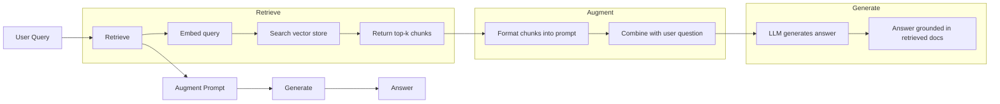
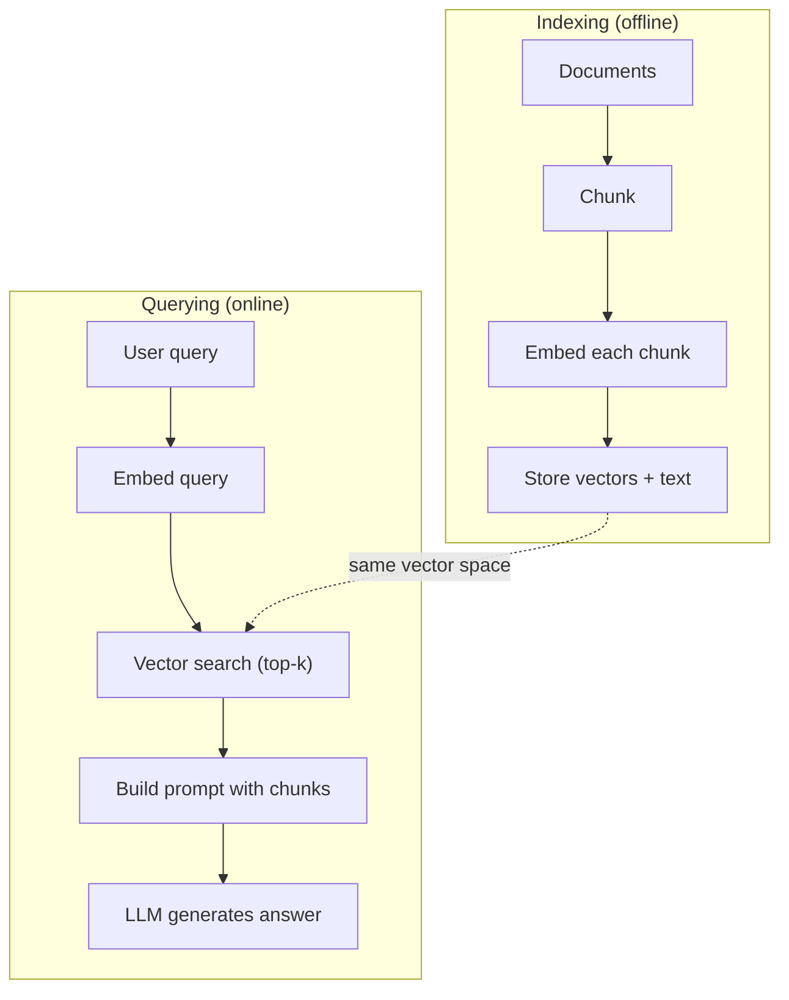

# RAG（检索增强生成）

> 你的 LLM 知道训练截止之前的一切。它对你公司的文档、你的 codebase、上周的会议纪要一无所知。RAG 解决这个问题的办法是：检索相关文档，把它们塞进 prompt。这是生产 AI 里部署最多的模式。如果这门课你只动手做一样东西，那就做一条 RAG 流水线。

**类型：** Build
**语言：** Python
**前置要求：** 阶段 10（从零构建 LLM）、阶段 11 第 01-05 课
**预计时间：** ~90 分钟
**相关：** 阶段 5 · 23（RAG 的分块策略）讲六种分块算法以及各自何时占优。阶段 5 · 22（嵌入模型深入）讲怎么挑 embedder。阶段 11 · 07（进阶 RAG）讲混合搜索、重排和查询变换。

## 学习目标

- 构建一条完整的 RAG 流水线：文档加载、分块、嵌入、向量存储、检索和生成
- 用向量数据库（ChromaDB、FAISS 或 Pinecone）配合恰当的索引实现语义搜索
- 解释为什么知识接地的应用里 RAG 比微调更受青睐（成本、时效、可溯源）
- 用检索指标（precision、recall）和生成指标（忠实度、相关性）评估 RAG 质量

## 问题所在

你给你公司做一个聊天机器人。一个客户问"企业版套餐的退款政策是什么？"LLM 给出一个关于典型 SaaS 退款政策的泛泛答案。真正的政策，埋在一份 200 页的内部 wiki 里，写着企业客户有 60 天窗口期、按比例退款。LLM 从没见过这份文档。它不可能知道自己没被训练过的东西。

微调是一种解法。拿 LLM，在你的内部文档上训练它，部署更新后的模型。这管用，但问题严重。微调要花上千美元的算力。文档一变，模型立刻就过时。你没法知道模型是从哪个来源拿的答案。而且如果公司下个月收购了另一条产品线，你又得再微调一次。

RAG 是另一种解法。模型原封不动。问题进来时，在你的文档存储里搜出相关段落，把它们贴在问题之前的 prompt 里，让模型把这些段落当上下文来作答。文档存储几分钟就能更新。你能精确看到检索了哪些文档。模型本身从不改变。这就是为什么 RAG 是生产里的主导模式：它更便宜、更新鲜、更可审计，而且配任何 LLM 都行。

## 核心概念

### RAG 模式

整个模式就四步：



查询 -> 检索 -> 增强 prompt -> 生成。每个 RAG 系统都遵循这个模式。生产 RAG 系统之间的差异在每一步的细节里：你怎么分块、怎么嵌入、怎么搜索、怎么构造 prompt。

### 为什么 RAG 胜过微调

| 关注点 | 微调 | RAG |
|---------|------------|-----|
| 成本 | 每次训练 $1,000-$100,000+ | 每次查询 $0.01-$0.10（嵌入 + LLM） |
| 时效 | 不重训就过时 | 重新索引文档即可分钟级更新 |
| 可审计 | 无法把答案追溯到来源 | 能展示精确的检索段落 |
| 幻觉 | 仍然随意产生幻觉 | 建立在检索到的文档之上 |
| 数据隐私 | 训练数据被烤进权重 | 文档留在你的向量存储里 |

微调永久地改变模型的权重。RAG 临时地改变模型的上下文。对大多数应用来说，临时上下文才是你想要的。

微调占优的唯一情形：当你需要模型采用某种单靠 prompting 无法实现的特定风格、语气或推理模式时。对于事实性知识检索，RAG 每次都赢。

### 嵌入模型

嵌入模型把文本转成一个稠密向量。相似的文本在这个高维空间里产出彼此接近的向量。"How do I reset my password?"和"I need to change my password"尽管共享的词很少，却产出几乎一样的向量。"The cat sat on the mat"产出一个非常不同的向量。

常见的嵌入模型（2026 年阵容——完整分析见阶段 5 · 22）：

| 模型 | 维度 | 提供方 | 备注 |
|-------|-----------|----------|-------|
| text-embedding-3-small | 1536（Matryoshka） | OpenAI | 大多数用例下性价比最好 |
| text-embedding-3-large | 3072（Matryoshka） | OpenAI | 准确率更高，可截断到 256/512/1024 |
| Gemini Embedding 2 | 3072（Matryoshka） | Google | MTEB 检索榜首；8K 上下文 |
| voyage-4 | 1024/2048（Matryoshka） | Voyage AI | 有领域变体（代码、金融、法律） |
| Cohere embed-v4 | 1024（Matryoshka） | Cohere | 多语言强，128K 上下文 |
| BGE-M3 | 1024（dense + sparse + ColBERT） | BAAI（开源权重） | 一个模型给三种视图 |
| Qwen3-Embedding | 4096（Matryoshka） | Alibaba（开源权重） | 开源权重检索分最高 |
| all-MiniLM-L6-v2 | 384 | 开源权重（Sentence Transformers） | 原型基线 |

本课我们用 TF-IDF 自己构建一个简单的嵌入。不是因为生产系统用 TF-IDF，而是因为它把概念讲具体了：文本进，向量出，相似的文本产出相似的向量。

### 向量相似度

给定两个向量，怎么衡量相似度？三个选项：

**余弦相似度**：两个向量夹角的余弦值。范围从 -1（相反）到 1（相同）。忽略幅度，只在意方向。这是 RAG 的默认选择。

```
cosine_sim(a, b) = dot(a, b) / (||a|| * ||b||)
```

**点积**：原始内积。更大的向量得到更高的分数。当幅度携带信息时有用（更长的文档可能更相关）。

```
dot(a, b) = sum(a_i * b_i)
```

**L2（欧氏）距离**：向量空间里的直线距离。距离越小 = 越相似。对幅度差异敏感。

```
L2(a, b) = sqrt(sum((a_i - b_i)^2))
```

余弦相似度是标准选择。它优雅地处理不同长度的文档，因为它按幅度做了归一化。当有人说"向量搜索"时，他们几乎总是指余弦相似度。

### 分块策略

文档太长，没法嵌入成单个向量。一份 50 页的 PDF 可能产出一个糟糕的嵌入，因为它包含几十个主题。所以你把文档切成块，逐块单独嵌入。

**定长分块**：每 N 个 token 切一块。简单可预测。一个 512 token、重叠 50 token 的块意味着块 1 是 token 0-511，块 2 是 token 462-973，以此类推。重叠确保你不会在一个倒霉的边界把句子切断。

**语义分块**：在自然边界切。段落、章节或 markdown 标题。每块都是一个连贯的意义单元。实现起来更复杂，但检索更好。

**递归分块**：先尝试在最大边界切（章节标题）。如果一个章节还是太大，在段落边界切。如果一个段落还是太大，在句子边界切。这就是 LangChain RecursiveCharacterTextSplitter 的做法，实践中效果不错。

块大小的重要性超出大多数人的想象：

- 太小（64-128 token）：每块缺乏上下文。"它上季度增长了 15%"——不知道"它"指什么，这句话毫无意义。
- 太大（2048+ token）：每块涵盖多个主题，稀释了相关性。当你搜营收数据时，拿到的是一块 10% 关于营收、90% 关于人头数的内容。
- 甜区（256-512 token）：上下文够自洽，又聚焦到足够相关。

大多数生产 RAG 系统用 256-512 token 的块、配 50 token 重叠。Anthropic 的 RAG 指南推荐这个区间。

### 向量数据库

有了嵌入，你需要个地方存储和搜索它们。选项：

| 数据库 | 类型 | 最适合 |
|----------|------|----------|
| FAISS | 库（进程内） | 原型、中小型数据集 |
| Chroma | 轻量数据库 | 本地开发、小型部署 |
| Pinecone | 托管服务 | 无运维负担的生产 |
| Weaviate | 开源数据库 | 自托管生产 |
| pgvector | Postgres 扩展 | 已经在用 Postgres |
| Qdrant | 开源数据库 | 高性能自托管 |

本课我们构建一个简单的内存向量存储。它把向量存在一个列表里，做暴力余弦相似度搜索。这等价于带 flat 索引的 FAISS。它大概能扩展到 10 万个向量才开始变慢。生产系统用 HNSW 这类近似最近邻（ANN）算法，在数百万向量里毫秒级搜索。

### 完整流水线



索引阶段每篇文档跑一次（或在文档更新时）。查询阶段在每个用户请求上跑。在生产里，索引可能耗时数小时处理数百万篇文档。查询必须在一秒内响应。

### 真实数字

大多数生产 RAG 系统用这些参数：

- 每次查询检索 **k = 5 到 10** 块
- **块大小 = 256 到 512 token**，配 50 token 重叠
- **上下文预算**：每次查询 2,500-5,000 token 的检索内容
- **总 prompt**：约 8,000-16,000 token（system prompt + 检索到的块 + 对话历史 + 用户查询）
- **嵌入维度**：384-3072，取决于模型
- **索引吞吐**：用 API 嵌入时每秒 100-1,000 篇文档
- **查询延迟**：检索 50-200ms，生成 500-3000ms

## 动手构建

### 第 1 步：文档分块

```python
def chunk_text(text, chunk_size=200, overlap=50):
    words = text.split()
    chunks = []
    start = 0
    while start < len(words):
        end = start + chunk_size
        chunk = " ".join(words[start:end])
        chunks.append(chunk)
        start += chunk_size - overlap
    return chunks
```

### 第 2 步：TF-IDF 嵌入

我们构建一个简单的嵌入函数。TF-IDF（词频-逆文档频率）不是神经嵌入，但它以一种捕捉词重要性的方式把文本转成向量。文档里高频的词获得更高的 TF。在整个语料里稀有的词获得更高的 IDF。两者相乘得到一个向量，其中重要、有辨识度的词取值高。

```python
import math
from collections import Counter

def build_vocabulary(documents):
    vocab = set()
    for doc in documents:
        vocab.update(doc.lower().split())
    return sorted(vocab)

def compute_tf(text, vocab):
    words = text.lower().split()
    count = Counter(words)
    total = len(words)
    return [count.get(word, 0) / total for word in vocab]

def compute_idf(documents, vocab):
    n = len(documents)
    idf = []
    for word in vocab:
        doc_count = sum(1 for doc in documents if word in doc.lower().split())
        idf.append(math.log((n + 1) / (doc_count + 1)) + 1)
    return idf

def tfidf_embed(text, vocab, idf):
    tf = compute_tf(text, vocab)
    return [t * i for t, i in zip(tf, idf)]
```

### 第 3 步：余弦相似度搜索

```python
def cosine_similarity(a, b):
    dot = sum(x * y for x, y in zip(a, b))
    norm_a = math.sqrt(sum(x * x for x in a))
    norm_b = math.sqrt(sum(x * x for x in b))
    if norm_a == 0 or norm_b == 0:
        return 0.0
    return dot / (norm_a * norm_b)

def search(query_embedding, stored_embeddings, top_k=5):
    scores = []
    for i, emb in enumerate(stored_embeddings):
        sim = cosine_similarity(query_embedding, emb)
        scores.append((i, sim))
    scores.sort(key=lambda x: x[1], reverse=True)
    return scores[:top_k]
```

### 第 4 步：构造 prompt

这就是 RAG 里"增强"发生的地方。拿检索到的块，格式化进一个 prompt，让 LLM 基于提供的上下文作答。

```python
def build_rag_prompt(query, retrieved_chunks):
    context = "\n\n---\n\n".join(
        f"[Source {i+1}]\n{chunk}"
        for i, chunk in enumerate(retrieved_chunks)
    )
    return f"""Answer the question based ONLY on the following context.
If the context doesn't contain enough information, say "I don't have enough information to answer that."

Context:
{context}

Question: {query}

Answer:"""
```

### 第 5 步：完整的 RAG 流水线

```python
class RAGPipeline:
    def __init__(self):
        self.chunks = []
        self.embeddings = []
        self.vocab = []
        self.idf = []

    def index(self, documents):
        all_chunks = []
        for doc in documents:
            all_chunks.extend(chunk_text(doc))
        self.chunks = all_chunks
        self.vocab = build_vocabulary(all_chunks)
        self.idf = compute_idf(all_chunks, self.vocab)
        self.embeddings = [
            tfidf_embed(chunk, self.vocab, self.idf)
            for chunk in all_chunks
        ]

    def query(self, question, top_k=5):
        query_emb = tfidf_embed(question, self.vocab, self.idf)
        results = search(query_emb, self.embeddings, top_k)
        retrieved = [(self.chunks[i], score) for i, score in results]
        prompt = build_rag_prompt(
            question, [chunk for chunk, _ in retrieved]
        )
        return prompt, retrieved
```

### 第 6 步：生成（模拟）

在生产里，这就是你调用 LLM API 的地方。本课里，我们通过从检索到的上下文中抽取最相关的句子来模拟生成。

```python
def simple_generate(prompt, retrieved_chunks):
    query_words = set(prompt.lower().split("question:")[-1].split())
    best_sentence = ""
    best_score = 0
    for chunk in retrieved_chunks:
        for sentence in chunk.split("."):
            sentence = sentence.strip()
            if not sentence:
                continue
            words = set(sentence.lower().split())
            overlap = len(query_words & words)
            if overlap > best_score:
                best_score = overlap
                best_sentence = sentence
    return best_sentence if best_sentence else "I don't have enough information."
```

## 上手使用

用上真正的嵌入模型和 LLM，代码几乎不变：

```python
from openai import OpenAI

client = OpenAI()

def embed(text):
    response = client.embeddings.create(
        model="text-embedding-3-small",
        input=text
    )
    return response.data[0].embedding

def generate(prompt):
    response = client.chat.completions.create(
        model="gpt-4o-mini",
        messages=[{"role": "user", "content": prompt}],
        temperature=0
    )
    return response.choices[0].message.content
```

或者用 Anthropic：

```python
import anthropic

client = anthropic.Anthropic()

def generate(prompt):
    response = client.messages.create(
        model="claude-sonnet-4-20250514",
        max_tokens=1024,
        messages=[{"role": "user", "content": prompt}]
    )
    return response.content[0].text
```

流水线是一样的。换掉嵌入函数，换掉生成函数。检索逻辑、分块、prompt 构造——不管你用哪个模型，全都相同。

对于大规模的向量存储，把暴力搜索换成一个正经的向量数据库：

```python
import chromadb

client = chromadb.Client()
collection = client.create_collection("my_docs")

collection.add(
    documents=chunks,
    ids=[f"chunk_{i}" for i in range(len(chunks))]
)

results = collection.query(
    query_texts=["What is the refund policy?"],
    n_results=5
)
```

Chroma 在内部处理嵌入（默认用 all-MiniLM-L6-v2），并把向量存在一个本地数据库里。同样的模式，不同的管道。

## 交付

本节课产出：
- `outputs/prompt-rag-architect.md`——一个 prompt，为特定用例设计 RAG 系统
- `outputs/skill-rag-pipeline.md`——一个 skill，教 agent 如何构建和调试 RAG 流水线

## 练习

1. 把 TF-IDF 嵌入换成简单的词袋方法（二值：词出现为 1，否则为 0）。在样本文档上对比检索质量。TF-IDF 应该胜出，因为它给稀有词更高的权重。

2. 实验块大小：在同一文档集上试 50、100、200、500 词。每种大小都跑同样的 5 个查询，数有多少个在 top-3 里返回了相关的块。找到检索质量达到峰值的甜区。

3. 给每块加元数据（来源文档名、块位置）。改写 prompt 模板以包含来源标注，让 LLM 引用它的来源。

4. 实现一个简单的评估：给定 10 个问答对，让每个问题通过 RAG 流水线，测量检索到的块里有多大比例含有答案。这就是 k 处的检索 recall。

5. 构建一条对话感知的 RAG 流水线：维护最近 3 轮交流的历史，把它们和检索到的块一起放进 prompt。用追问来测试，比如先问定价、再问"那企业版呢？"。

## 关键术语

| 术语 | 大家怎么说 | 它实际是什么 |
|------|----------------|----------------------|
| RAG | "会读你文档的 AI" | 检索相关文档，把它们贴进 prompt，生成一个建立在那些文档之上的答案 |
| Embedding | "把文本变成数字" | 文本的稠密向量表示，相似的语义产出相似的向量 |
| 向量数据库 | "给 AI 用的搜索引擎" | 为存储向量、并按相似度找最近邻而优化的数据存储 |
| 分块 | "把文档切成小块" | 把文档拆成更小的片段（通常 256-512 token），让每块都能独立嵌入和检索 |
| 余弦相似度 | "两个向量有多像" | 两个向量夹角的余弦值；1 = 方向相同，0 = 正交，-1 = 相反 |
| Top-k 检索 | "拿最匹配的 k 个" | 从向量存储里返回与查询最相似的 k 块 |
| 上下文窗口 | "LLM 能看见多少文本" | LLM 单次请求能处理的最大 token 数；检索到的块必须装得下 |
| 增强生成 | "用给定的上下文作答" | 用检索到的文档作为上下文来生成回复，而不是只靠训练得到的知识 |
| TF-IDF | "词重要性打分" | 词频乘以逆文档频率；按一个词在语料里有多有辨识度来给它加权 |
| 索引 | "为搜索准备文档" | 离线过程：分块、嵌入、存储文档，让它们在查询时可被搜索 |

## 延伸阅读

- Lewis et al., "Retrieval-Augmented Generation for Knowledge-Intensive NLP Tasks" (2020)——来自 Facebook AI Research 的原始 RAG 论文，把先检索后生成的模式形式化
- Anthropic 的 RAG 文档（docs.anthropic.com）——块大小、prompt 构造和评估的实用指南
- Pinecone Learning Center, "What is RAG?"——对 RAG 流水线清晰的图解，附带生产层面的考量
- Sentence-BERT: Reimers & Gurevych (2019)——all-MiniLM 嵌入模型背后的论文，展示如何训练 bi-encoder 做语义相似度
- [Karpukhin et al., "Dense Passage Retrieval for Open-Domain Question Answering" (EMNLP 2020)](https://arxiv.org/abs/2004.04906)——DPR 论文，证明稠密 bi-encoder 检索在开放域 QA 上胜过 BM25，并为现代 RAG 检索器定下了模式。
- [LlamaIndex High-Level Concepts](https://docs.llamaindex.ai/en/stable/getting_started/concepts.html)——构建 RAG 流水线时该懂的主要概念：数据加载器、节点解析器、索引、检索器、响应合成器。
- [LangChain RAG tutorial](https://python.langchain.com/docs/tutorials/rag/)——另一种风味的编排器；同样的先检索后生成模式的 chain-of-runnables 视角。
