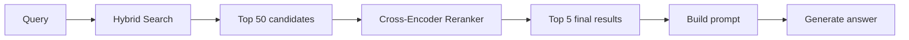
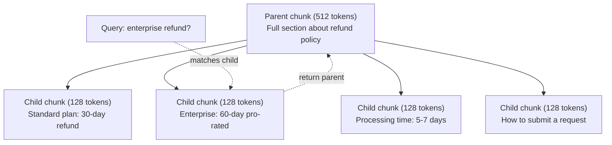
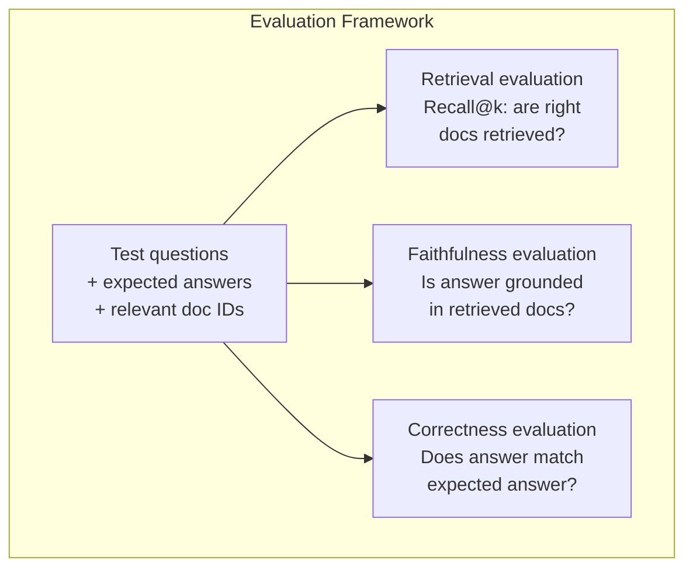

# 进阶 RAG（分块、重排、混合搜索）

> 基础 RAG 检索最相似的 top-k 块。这对简单问题有效。碰上多跳推理、含糊查询和大语料，它就崩了。进阶 RAG 就是一个在 10 篇文档上能跑的 demo，和一个在 1000 万篇上能跑的系统之间的差别。

**类型：** Build
**语言：** Python
**前置要求：** 阶段 11，第 06 课（RAG）
**预计时间：** ~90 分钟
**相关：** 阶段 5 · 23（RAG 的分块策略）讲全部六种分块算法——recursive、semantic、sentence、parent-document、late chunking、contextual retrieval——附带 Vectara/Anthropic 基准。本课在其之上构建：混合搜索、重排、查询变换。

## 学习目标

- 实现进阶分块策略（语义、递归、parent-child），保留文档结构和上下文
- 构建一条混合搜索流水线，把 BM25 关键词匹配、语义向量搜索和一个 cross-encoder 重排器结合起来
- 套用查询变换技术（HyDE、multi-query、step-back），改善含糊或复杂问题上的检索
- 诊断并修复常见的 RAG 失败：检索到错的块、答案不在上下文里、多跳推理崩溃

## 问题所在

你在第 06 课构建了一条基础 RAG 流水线。它对小语料上的直白问题有效。现在试试这些：

**含糊查询**："上季度营收是多少？"语义搜索返回关于营收策略、营收预测、CFO 对营收增长看法的块。全都和"营收"这个词语义相似，但没一个含真正的数字。正确的那块写着"2025 年 Q3 为 $47.2M"，但用的词是"earnings"而不是"revenue"。嵌入模型觉得"revenue strategy"比"Q3 earnings were $47.2M"离查询更近。

**多跳问题**："哪个团队的客户满意度分数提升最高？"这需要找出每个团队的满意度分数、比较它们、找出最大值。没有单一块包含答案。信息分散在各个团队报告里。

**大语料问题**：你有 200 万个块。正确答案在第 1,847,293 块。你的 top-5 检索拉出来的是第 14、89,201、1,200,000、44 和 901,333 块。在嵌入空间里很近，但没一个含答案。在这个规模上，近似最近邻搜索引入的误差，足以把相关结果挤出 top-k。

基础 RAG 失败，是因为向量相似不等于相关。一个块可以在语义上和查询相似，却对回答它没用。进阶 RAG 用四种技术应对这个：混合搜索（加上关键词匹配）、重排（更仔细地给候选打分）、查询变换（搜索前先修好查询）、更好的分块（以合适的粒度检索）。

## 核心概念

### 混合搜索：语义 + 关键词

语义搜索（向量相似度）擅长理解语义。"How do I cancel my subscription?"能匹配上"Steps to terminate your plan"，尽管它们没有共同的词。但它会漏掉精确匹配。"Error code E-4021"可能匹配不上含"E-4021"的块，如果嵌入模型把它当成噪声。

关键词搜索（BM25）正相反。它擅长精确匹配。"E-4021"完美匹配。但如果文档写的是"terminate your plan"，"cancel my subscription"就返回零结果。

混合搜索两个都跑，然后合并结果。

**BM25**（Best Matching 25）是标准的关键词搜索算法。从 1990 年代起它就是搜索引擎的支柱。公式：

```
BM25(q, d) = sum over terms t in q:
    IDF(t) * (tf(t,d) * (k1 + 1)) / (tf(t,d) + k1 * (1 - b + b * |d| / avgdl))
```

其中 tf(t,d) 是 t 在文档 d 中的词频，IDF(t) 是逆文档频率，|d| 是文档长度，avgdl 是平均文档长度，k1 控制词频饱和（默认 1.2），b 控制长度归一化（默认 0.75）。

说白了：当文档含有查询词（尤其是稀有的）时，BM25 给它更高的分，但重复出现的词收益递减。一篇含"revenue"50 次的文档，并不比含一次的相关 50 倍。

### 倒数排名融合（RRF）

你有两个排好序的列表：一个来自向量搜索，一个来自 BM25。怎么合并它们？倒数排名融合是标准做法。

```
RRF_score(d) = sum over rankings R:
    1 / (k + rank_R(d))
```

其中 k 是一个常数（通常 60），防止排名最高的结果一家独大。

一篇在向量搜索里排第 1、在 BM25 里排第 5 的文档得到：1/(60+1) + 1/(60+5) = 0.0164 + 0.0154 = 0.0318

一篇在向量搜索里排第 3、在 BM25 里排第 2 的文档得到：1/(60+3) + 1/(60+2) = 0.0159 + 0.0161 = 0.0320

RRF 自然地平衡两个信号。在两个列表里都排得高的文档得到最好的分。在一个列表里排第 1、却在另一个里缺席的文档得到中等的分。这很稳健，因为它用的是排名而非原始分数，所以两个系统之间分数分布的差异无关紧要。

### 重排

检索（不管是向量、关键词还是混合）快但不精确。它用 bi-encoder：查询和每篇文档独立嵌入，再比较。嵌入算一次然后缓存。这能扩展到数百万篇文档。

重排用 cross-encoder：查询和一篇候选文档一起喂进一个模型，模型输出一个相关性分数。模型同时看到两段文本，能捕捉它们之间的细粒度交互。cross-encoder 能理解"What were Q3 earnings?"和含"$47.2M in Q3"的块高度相关，即使 bi-encoder 漏掉了这个联系。

代价是：cross-encoder 比 bi-encoder 慢 100-1000 倍，因为它把查询-文档对联合处理。你没法给一百万篇文档预先算好 cross-encoder 分数。解法是：检索一个更大的候选集（混合搜索的 top-50），再用 cross-encoder 重排，得到最终的 top-5。



常见的重排模型（2026 年阵容）：
- Cohere Rerank 3.5：托管 API，多语言，混合语料上 recall 提升最佳
- Voyage rerank-2.5：托管 API，托管选项里延迟最低
- Jina-Reranker-v2 Multilingual：开源权重，100+ 语言
- bge-reranker-v2-m3：开源权重，强基线
- cross-encoder/ms-marco-MiniLM-L-6-v2：开源权重，可在 CPU 上跑做原型
- ColBERTv2 / Jina-ColBERT-v2：late-interaction 多向量重排器——打分时是 O(tokens) 而非 O(docs)

### 查询变换

有时问题不在检索，而在查询本身。"那个关于新政策变动的事是啥来着？"是个糟糕的搜索查询。它没有任何具体词，嵌入很模糊。没有哪个检索系统能从这里找出对的文档。

**查询重写**：把用户的查询改写成更好的搜索查询。LLM 能做这个：

```
User: "What was that thing about the new policy change?"
Rewritten: "Recent policy changes and updates"
```

**HyDE（假设性文档嵌入）**：不用查询去搜索，而是生成一个假设性的答案，嵌入它，再去搜索相似的真实文档。

```
Query: "What is the refund policy for enterprise?"
Hypothetical answer: "Enterprise customers are eligible for a full refund
within 60 days of purchase. Refunds are pro-rated based on the remaining
subscription period and processed within 5-7 business days."
```

嵌入这个假设性答案，去搜索与它相似的真实文档。直觉是：假设性答案在嵌入空间里比原始问题更靠近真实答案。问题和答案有不同的语言结构。通过生成一个假设性答案，你在嵌入里架起了"问题空间"和"答案空间"之间的桥。

HyDE 在检索前多加一次 LLM 调用。这会让延迟增加 500-2000ms。当原始查询的检索质量很差时，这值得。

### Parent-child 分块

标准分块逼你做权衡：小块用于精确检索，大块用于充足上下文。Parent-child 分块消除了这个权衡。

用小块（128 token）建索引做检索。当一个小块被检索到时，把它的父块（512 token）返回给 prompt。小块精确匹配查询，父块为 LLM 提供足够上下文来生成好答案。



查询"enterprise refund?"精确匹配子块 C2。但 prompt 收到的是完整的父块 P，里面包含了关于处理时间和提交流程的周边上下文。

### 元数据过滤

在跑向量搜索之前，按元数据过滤语料：日期、来源、类别、作者、语言。这缩小了搜索空间，避免了不相关的结果。

"上个月安全政策改了什么？"应当只搜索安全类别里最近 30 天的文档。没有元数据过滤，你搜索整个语料，可能检索到一份两年前、恰好语义相似的安全文档。

生产 RAG 系统在每块旁边存元数据：来源文档、创建日期、类别、作者、版本。向量数据库支持在相似度搜索之前按元数据预过滤，这对大规模下的性能至关重要。

### 评估

你构建了一个 RAG 系统。怎么知道它管不管用？三个指标：

**检索相关性（Recall@k）**：对一组已知相关文档的测试问题，有多大比例的相关文档出现在 top-k 结果里？如果一个问题的答案在第 47 块，第 47 块出现在 top-5 里了吗？

**忠实度**：生成的答案是否建立在检索到的文档之上？如果检索到的块说"60 天退款窗口"，模型却说"90 天退款窗口"，那就是忠实度失败。模型在拥有正确上下文的情况下还是产生了幻觉。

**答案正确性**：生成的答案是否匹配预期答案？这是端到端的指标。它结合了检索质量和生成质量。

一个简单的忠实度检查：拿生成答案里的每一个论断，核验它（在实质上）出现在检索到的块里。如果答案含有一个不在任何检索块里的事实，它很可能是幻觉。



## 动手构建

### 第 1 步：实现 BM25

```python
import math
from collections import Counter

class BM25:
    def __init__(self, k1=1.2, b=0.75):
        self.k1 = k1
        self.b = b
        self.docs = []
        self.doc_lengths = []
        self.avg_dl = 0
        self.doc_freqs = {}
        self.n_docs = 0

    def index(self, documents):
        self.docs = documents
        self.n_docs = len(documents)
        self.doc_lengths = []
        self.doc_freqs = {}

        for doc in documents:
            words = doc.lower().split()
            self.doc_lengths.append(len(words))
            unique_words = set(words)
            for word in unique_words:
                self.doc_freqs[word] = self.doc_freqs.get(word, 0) + 1

        self.avg_dl = sum(self.doc_lengths) / self.n_docs if self.n_docs else 1

    def score(self, query, doc_idx):
        query_words = query.lower().split()
        doc_words = self.docs[doc_idx].lower().split()
        doc_len = self.doc_lengths[doc_idx]
        word_counts = Counter(doc_words)
        score = 0.0

        for term in query_words:
            if term not in word_counts:
                continue
            tf = word_counts[term]
            df = self.doc_freqs.get(term, 0)
            idf = math.log((self.n_docs - df + 0.5) / (df + 0.5) + 1)
            numerator = tf * (self.k1 + 1)
            denominator = tf + self.k1 * (1 - self.b + self.b * doc_len / self.avg_dl)
            score += idf * numerator / denominator

        return score

    def search(self, query, top_k=10):
        scores = [(i, self.score(query, i)) for i in range(self.n_docs)]
        scores.sort(key=lambda x: x[1], reverse=True)
        return scores[:top_k]
```

### 第 2 步：倒数排名融合

```python
def reciprocal_rank_fusion(ranked_lists, k=60):
    scores = {}
    for ranked_list in ranked_lists:
        for rank, (doc_id, _) in enumerate(ranked_list):
            if doc_id not in scores:
                scores[doc_id] = 0.0
            scores[doc_id] += 1.0 / (k + rank + 1)
    fused = sorted(scores.items(), key=lambda x: x[1], reverse=True)
    return fused
```

### 第 3 步：混合搜索流水线

```python
def hybrid_search(query, chunks, vector_embeddings, vocab, idf, bm25_index, top_k=5, fusion_k=60):
    query_emb = tfidf_embed(query, vocab, idf)
    vector_results = search(query_emb, vector_embeddings, top_k=top_k * 3)
    bm25_results = bm25_index.search(query, top_k=top_k * 3)
    fused = reciprocal_rank_fusion([vector_results, bm25_results], k=fusion_k)
    return fused[:top_k]
```

### 第 4 步：简单重排器

在生产里你会用一个 cross-encoder 模型。这里我们构建一个重排器，用词重叠、词重要性和短语匹配来给查询-文档的相关性打分。

```python
def rerank(query, candidates, chunks):
    query_words = set(query.lower().split())
    stop_words = {"the", "a", "an", "is", "are", "was", "were", "what", "how",
                  "why", "when", "where", "do", "does", "for", "of", "in", "to",
                  "and", "or", "on", "at", "by", "it", "its", "this", "that",
                  "with", "from", "be", "has", "have", "had", "not", "but"}
    query_terms = query_words - stop_words

    scored = []
    for doc_id, initial_score in candidates:
        chunk = chunks[doc_id].lower()
        chunk_words = set(chunk.split())

        term_overlap = len(query_terms & chunk_words)

        query_bigrams = set()
        q_list = [w for w in query.lower().split() if w not in stop_words]
        for i in range(len(q_list) - 1):
            query_bigrams.add(q_list[i] + " " + q_list[i + 1])
        bigram_matches = sum(1 for bg in query_bigrams if bg in chunk)

        position_boost = 0
        for term in query_terms:
            pos = chunk.find(term)
            if pos != -1 and pos < len(chunk) // 3:
                position_boost += 0.5

        rerank_score = (
            term_overlap * 1.0
            + bigram_matches * 2.0
            + position_boost
            + initial_score * 5.0
        )
        scored.append((doc_id, rerank_score))

    scored.sort(key=lambda x: x[1], reverse=True)
    return scored
```

### 第 5 步：HyDE（假设性文档嵌入）

```python
def hyde_generate_hypothesis(query):
    templates = {
        "what": "The answer to '{query}' is as follows: Based on our documentation, {topic} involves specific policies and procedures that define how the process works.",
        "how": "To address '{query}': The process involves several steps. First, you need to initiate the request. Then, the system processes it according to the defined rules.",
        "default": "Regarding '{query}': Our records indicate specific details and policies related to this topic that provide a comprehensive answer."
    }
    query_lower = query.lower()
    if query_lower.startswith("what"):
        template = templates["what"]
    elif query_lower.startswith("how"):
        template = templates["how"]
    else:
        template = templates["default"]

    topic_words = [w for w in query.lower().split()
                   if w not in {"what", "is", "the", "how", "do", "does", "a", "an",
                                "for", "of", "to", "in", "on", "at", "by", "and", "or"}]
    topic = " ".join(topic_words) if topic_words else "this topic"

    return template.format(query=query, topic=topic)


def hyde_search(query, chunks, vector_embeddings, vocab, idf, top_k=5):
    hypothesis = hyde_generate_hypothesis(query)
    hypothesis_emb = tfidf_embed(hypothesis, vocab, idf)
    results = search(hypothesis_emb, vector_embeddings, top_k)
    return results, hypothesis
```

### 第 6 步：Parent-child 分块

```python
def create_parent_child_chunks(text, parent_size=200, child_size=50):
    words = text.split()
    parents = []
    children = []
    child_to_parent = {}

    parent_idx = 0
    start = 0
    while start < len(words):
        parent_end = min(start + parent_size, len(words))
        parent_text = " ".join(words[start:parent_end])
        parents.append(parent_text)

        child_start = start
        while child_start < parent_end:
            child_end = min(child_start + child_size, parent_end)
            child_text = " ".join(words[child_start:child_end])
            child_idx = len(children)
            children.append(child_text)
            child_to_parent[child_idx] = parent_idx
            child_start += child_size

        parent_idx += 1
        start += parent_size

    return parents, children, child_to_parent
```

### 第 7 步：忠实度评估

```python
def evaluate_faithfulness(answer, retrieved_chunks):
    answer_sentences = [s.strip() for s in answer.split(".") if len(s.strip()) > 10]
    if not answer_sentences:
        return 1.0, []

    grounded = 0
    ungrounded = []
    context = " ".join(retrieved_chunks).lower()

    for sentence in answer_sentences:
        words = set(sentence.lower().split())
        stop_words = {"the", "a", "an", "is", "are", "was", "were", "and", "or",
                      "to", "of", "in", "for", "on", "at", "by", "it", "this", "that"}
        content_words = words - stop_words
        if not content_words:
            grounded += 1
            continue

        matched = sum(1 for w in content_words if w in context)
        ratio = matched / len(content_words) if content_words else 0

        if ratio >= 0.5:
            grounded += 1
        else:
            ungrounded.append(sentence)

    score = grounded / len(answer_sentences) if answer_sentences else 1.0
    return score, ungrounded


def evaluate_retrieval_recall(queries_with_relevant, retrieval_fn, k=5):
    total_recall = 0.0
    results = []

    for query, relevant_indices in queries_with_relevant:
        retrieved = retrieval_fn(query, k)
        retrieved_indices = set(idx for idx, _ in retrieved)
        relevant_set = set(relevant_indices)
        hits = len(retrieved_indices & relevant_set)
        recall = hits / len(relevant_set) if relevant_set else 1.0
        total_recall += recall
        results.append({
            "query": query,
            "recall": recall,
            "hits": hits,
            "total_relevant": len(relevant_set)
        })

    avg_recall = total_recall / len(queries_with_relevant) if queries_with_relevant else 0
    return avg_recall, results
```

## 上手使用

用一个真正的 cross-encoder 做重排：

```python
from sentence_transformers import CrossEncoder

reranker = CrossEncoder("cross-encoder/ms-marco-MiniLM-L-6-v2")

def rerank_with_cross_encoder(query, candidates, chunks, top_k=5):
    pairs = [(query, chunks[doc_id]) for doc_id, _ in candidates]
    scores = reranker.predict(pairs)
    scored = list(zip([doc_id for doc_id, _ in candidates], scores))
    scored.sort(key=lambda x: x[1], reverse=True)
    return scored[:top_k]
```

用 Cohere 的托管重排器：

```python
import cohere

co = cohere.Client()

def rerank_with_cohere(query, candidates, chunks, top_k=5):
    docs = [chunks[doc_id] for doc_id, _ in candidates]
    response = co.rerank(
        model="rerank-english-v3.0",
        query=query,
        documents=docs,
        top_n=top_k
    )
    return [(candidates[r.index][0], r.relevance_score) for r in response.results]
```

用真正的 LLM 做 HyDE：

```python
import anthropic

client = anthropic.Anthropic()

def hyde_with_llm(query):
    response = client.messages.create(
        model="claude-sonnet-4-20250514",
        max_tokens=256,
        messages=[{
            "role": "user",
            "content": f"Write a short paragraph that would be a good answer to this question. Do not say you don't know. Just write what the answer would look like.\n\nQuestion: {query}"
        }]
    )
    return response.content[0].text
```

用 Weaviate 做生产级混合搜索：

```python
import weaviate

client = weaviate.connect_to_local()

collection = client.collections.get("Documents")
response = collection.query.hybrid(
    query="enterprise refund policy",
    alpha=0.5,
    limit=10
)
```

alpha 参数控制平衡：0.0 = 纯关键词（BM25），1.0 = 纯向量，0.5 = 等权。大多数生产系统用 0.3 到 0.7 之间的 alpha。

## 交付

本节课产出：
- `outputs/prompt-advanced-rag-debugger.md`——一个 prompt，诊断并修复 RAG 质量问题
- `outputs/skill-advanced-rag.md`——一个 skill，构建带混合搜索和重排的生产级 RAG

## 练习

1. 在样本文档上对比 BM25 vs 向量搜索 vs 混合搜索。对 5 个测试查询中的每一个，记录哪种方法在第 1 位返回了最相关的块。混合搜索应当在 5 个里至少赢 3 个。

2. 实现一个元数据过滤器。给每篇文档加一个"category"字段（security、billing、api、product）。在跑向量搜索前，把块过滤到只剩相关类别。用"用了什么加密？"测试，核验它只搜索 security 类别的块。

3. 用第 06 课的简单 generate 函数构建一条完整的 HyDE 流水线。在全部 5 个测试查询上对比直接查询搜索和 HyDE 搜索的检索质量（top-3 相关性）。HyDE 应当改善含糊查询的结果。

4. 在样本文档上实现 parent-child 分块策略。用 child_size=30、parent_size=100。用子块搜索，但在 prompt 里返回父块。把生成的答案和 chunk_size=50 的标准分块做对比。

5. 创建一个评估数据集：10 个带已知答案块的问题。对以下四种分别测量 Recall@3、Recall@5、Recall@10：（a）仅向量搜索，（b）仅 BM25，（c）混合搜索，（d）混合 + 重排。画出结果，找出重排帮助最大的地方。

## 关键术语

| 术语 | 大家怎么说 | 它实际是什么 |
|------|----------------|----------------------|
| BM25 | "关键词搜索" | 一种概率排名算法，按词频、逆文档频率和文档长度归一化给文档打分 |
| 混合搜索 | "两全其美" | 并行跑语义（向量）和关键词（BM25）搜索，再用排名融合合并结果 |
| 倒数排名融合 | "合并排名列表" | 通过对每篇文档在所有列表里求和 1/(k + rank) 来合并多个排名列表 |
| 重排 | "第二轮打分" | 用一个更昂贵的 cross-encoder 模型，给初次检索的候选集重新打分 |
| Cross-encoder | "联合查询-文档模型" | 把查询和文档当成单个输入、产出相关性分数的模型；比 bi-encoder 更准，但对全语料搜索太慢 |
| Bi-encoder | "独立嵌入模型" | 独立嵌入查询和文档的模型；因为嵌入可预计算所以快，但不如 cross-encoder 准 |
| HyDE | "用假答案搜索" | 为查询生成一个假设性答案，嵌入它，再搜索与它相似的真实文档 |
| Parent-child 分块 | "小块搜索，大块上下文" | 用小块建索引做精确检索，但返回更大的父块以提供充足上下文 |
| 元数据过滤 | "搜索前先缩小范围" | 在跑向量搜索前按属性（日期、来源、类别）过滤文档，缩小搜索空间 |
| 忠实度 | "它有没有守住根据" | 生成的答案是否被检索到的文档所支持，而非从模型训练数据里幻觉出来 |

## 延伸阅读

- Robertson & Zaragoza, "The Probabilistic Relevance Framework: BM25 and Beyond" (2009)——BM25 的权威参考，讲解公式背后的概率基础
- Cormack et al., "Reciprocal Rank Fusion Outperforms Condorcet and Individual Rank Learning Methods" (2009)——最初的 RRF 论文，证明它胜过更复杂的融合方法
- Gao et al., "Precise Zero-Shot Dense Retrieval without Relevance Labels" (2022)——HyDE 论文，证明假设性文档嵌入能在没有任何训练数据的情况下改善检索
- Nogueira & Cho, "Passage Re-ranking with BERT" (2019)——表明在 BM25 之上做 cross-encoder 重排能显著提升检索质量
- [Khattab et al., "DSPy: Compiling Declarative Language Model Calls into Self-Improving Pipelines" (2023)](https://arxiv.org/abs/2310.03714)——把 prompt 构造和权重选择当成检索流水线上的优化问题；想"编程 LLM"而非"prompt LLM"就读它。
- [Edge et al., "From Local to Global: A Graph RAG Approach to Query-Focused Summarization" (Microsoft Research 2024)](https://arxiv.org/abs/2404.16130)——GraphRAG 论文：实体-关系抽取 + Leiden 社区检测，做面向查询的摘要；全局 vs 局部检索的区分。
- [Asai et al., "Self-RAG: Learning to Retrieve, Generate, and Critique through Self-Reflection" (ICLR 2024)](https://arxiv.org/abs/2310.11511)——带反思 token 的自评估 RAG；超越静态先检索后生成的 agentic 前沿。
- [LangChain Query Construction blog](https://blog.langchain.dev/query-construction/)——如何把自然语言查询翻译成结构化数据库查询（Text-to-SQL、Cypher），作为检索前的一步。
