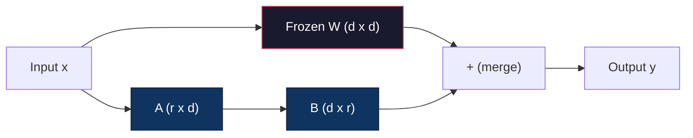
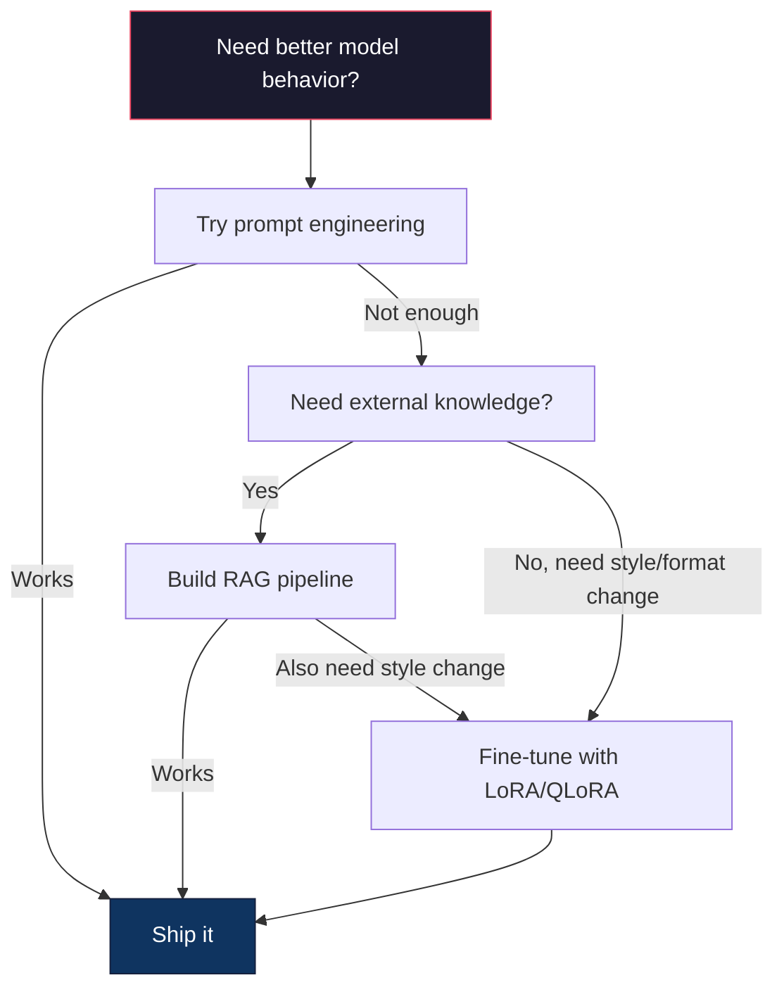

# 用 LoRA 和 QLoRA 微调

> 全量微调一个 7B 模型需要 56GB 显存。你没有，大多数公司也没有。LoRA 让你只训练不到 1% 的参数，就能在 6GB 里微调同一个模型。这不是妥协——在大多数任务上它能匹配全量微调的质量。整个开源微调生态就靠这一个小技巧运转。

**类型：** Build
**语言：** Python
**前置要求：** 阶段 10，第 06 课（指令微调 / SFT）
**预计时间：** ~75 分钟
**相关：** 阶段 10 从零讲 SFT/DPO 循环。本课把它们接入 2026 年的 PEFT 工具箱（PEFT、TRL、Unsloth、Axolotl、LLaMA-Factory）。

## 学习目标

- 实现 LoRA：把低秩适配矩阵（A 和 B）注入预训练模型的注意力层
- 计算 LoRA 相对全量微调省下的参数：秩 r 在 d_model 维度上训练 2*r*d 个参数，而非 d^2
- 用 QLoRA（4-bit 量化的基座 + LoRA 适配器）微调模型，把它塞进消费级 GPU 内存
- 把 LoRA 权重合并回基座模型用于部署，对比带与不带适配器的推理速度

## 问题所在

你有一个基座模型。Llama 3 8B。你想让它用你公司的口吻回答客服工单。SFT 就是答案。但 SFT 有个成本问题。

全量微调更新模型里的每一个参数。Llama 3 8B 有 80 亿参数。fp16 下每个参数占 2 字节。光加载权重就是 16GB。训练时你还需要梯度（16GB）、Adam 的优化器状态（动量 + 方差共 32GB），以及激活值。合计：一个 8B 模型大概要 56GB 显存。

一张 A100 80GB 勉强装得下。两张 A100 在云厂商上是每小时 $3-4。在 5 万个样本上训 3 个 epoch 要 6-10 小时。那就是每次实验 $30-40。跑 10 次实验把超参调对，部署任何东西之前你已经花了 $400。

把它放大到 Llama 3 70B，数字就荒唐了。光权重就 140GB。你需要一个集群。每次实验 $100+。

还有个更深的问题。全量微调改动模型里的每一个权重。如果你在客服数据上微调，可能会削弱模型的通用能力。这叫灾难性遗忘。模型在你的任务上变好，在其他一切上变差。

你需要一个训练更少参数、用更少内存、又不毁掉模型已有知识的方法。

## 核心概念

### LoRA：低秩适配

微软的 Edward Hu 和同事在 2021 年 6 月发表了 LoRA。论文的洞见是：微调期间的权重更新有低的内在秩。你不需要更新一个 4096x4096 权重矩阵里全部 1670 万个参数。更新里有用的信息可以被一个秩 16 或 32 的矩阵捕捉。

数学如下。一个标准线性层计算：

```
y = Wx
```

其中 W 是一个 d_out x d_in 的矩阵。对一个 4096x4096 的注意力投影来说，那是 16,777,216 个参数。

LoRA 冻结 W，加上一个低秩分解：

```
y = Wx + BAx
```

其中 B 是 (d_out x r)，A 是 (r x d_in)。秩 r 远小于 d——通常是 8、16 或 32。

在一个 4096x4096 的层上取 r=16：
- 原始参数：4096 x 4096 = 16,777,216
- LoRA 参数：(4096 x 16) + (16 x 4096) = 65,536 + 65,536 = 131,072
- 缩减比：131,072 / 16,777,216 = 0.78%

你训练 0.78% 的参数，拿到 95-100% 的质量。



A 用随机高斯初始化。B 初始化为零。这意味着 LoRA 的贡献从零开始——模型从它原本的行为出发训练，逐渐学到这个适配。

### 缩放因子：Alpha

LoRA 引入一个缩放因子 alpha，控制低秩更新对输出的影响有多大：

```
y = Wx + (alpha / r) * BAx
```

当 alpha = r 时，缩放是 1 倍。当 alpha = 2r（常见默认值）时，缩放是 2 倍。这个超参独立于基础学习率，控制 LoRA 路径的学习率。

实用建议：
- alpha = 2 * rank 是社区常见惯例（原论文大多数实验用的是 alpha = rank）
- alpha = rank 给出 1 倍缩放，保守但稳定
- alpha 越高，每步更新越大，可能加快收敛，也可能引起不稳定

### LoRA 加在哪

一个 transformer 有很多线性层。你不需要给它们全部加 LoRA。原论文测试了不同的组合：

| 目标层 | 可训练参数（7B） | 质量 |
|--------------|----------------------|---------|
| 仅 q_proj | 4.7M | 好 |
| q_proj + v_proj | 9.4M | 更好 |
| q_proj + k_proj + v_proj + o_proj | 18.9M | 注意力上最佳 |
| 所有线性层（注意力 + MLP） | 37.7M | 收益微薄，参数翻倍 |

大多数任务的甜区：q_proj + v_proj。这针对自注意力里的查询和值投影，它们控制模型关注什么、抽取什么信息。加上 MLP 层对代码生成这类复杂任务有帮助，但在更简单的任务上参数翻倍却收益递减。

### 秩的选择

秩 r 控制适配的表达能力：

| 秩 | 可训练参数（每层） | 最适合 |
|------|---------------------------|----------|
| 4 | 32,768 | 简单分类、情感 |
| 8 | 65,536 | 单领域问答、摘要 |
| 16 | 131,072 | 多领域任务、指令遵循 |
| 32 | 262,144 | 复杂推理、代码生成 |
| 64 | 524,288 | 对大多数任务收益递减 |
| 128 | 1,048,576 | 很少有理由用 |

Hu et al. 表明，对简单任务 r=4 就已经捕捉了大部分适配。r=8 和 r=16 是实践中最常见的选择。超过 r=64 很少能提升质量，还开始失去 LoRA 的内存优势。

### QLoRA：4-bit 量化 + LoRA

华盛顿大学的 Tim Dettmers 和同事在 2023 年 5 月发表了 QLoRA。想法是：把冻结的基座模型量化到 4-bit 精度，然后在上面挂 fp16 的 LoRA 适配器。

这大幅改变了内存等式：

| 方法 | 权重内存（7B） | 训练内存（7B） | 所需 GPU |
|--------|-------------------|---------------------|-------------|
| 全量微调（fp16） | 14GB | ~56GB | 1x A100 80GB |
| LoRA（fp16 基座） | 14GB | ~18GB | 1x A100 40GB |
| QLoRA（4-bit 基座） | 3.5GB | ~6GB | 1x RTX 3090 24GB |

QLoRA 做出三项技术贡献：

**NF4（Normal Float 4-bit）**：一种专为神经网络权重设计的新数据类型。神经网络权重大致服从正态分布。NF4 把它的 16 个量化级别放在标准正态分布的分位数上。对正态分布的数据来说，这在信息论上是最优的。它比均匀 4-bit 量化（INT4）或标准 Float4 损失的信息更少。

**双重量化**：量化常数本身也占内存。每 64 个权重一块，需要一个 fp32 的 scale 因子（4 字节）。对一个 7B 模型来说，那是额外的 0.4GB。双重量化把这些常数量化到 fp8，把开销降到 0.1GB。不大，但累积起来有用。

**分页优化器**：训练时，优化器状态（Adam 的动量和方差）在长序列上可能超出 GPU 内存。分页优化器用 NVIDIA 的统一内存，在 GPU 内存耗尽时自动把优化器状态分页到 CPU RAM，需要时再分页回来。这以一些吞吐为代价，避免了 OOM 崩溃。

### 质量问题

减少参数或量化基座会不会伤害质量？来自多篇论文的结果：

| 方法 | MMLU（5-shot） | MT-Bench | HumanEval |
|--------|--------------|----------|-----------|
| 全量微调（Llama 2 7B） | 48.3 | 6.72 | 14.6 |
| LoRA r=16 | 47.9 | 6.68 | 14.0 |
| QLoRA r=16（NF4） | 47.5 | 6.61 | 13.4 |
| QLoRA r=64（NF4） | 48.1 | 6.70 | 14.2 |

r=16 的 LoRA 在大多数基准上与全量微调相差不到 1%。r=16 的 QLoRA 再损失零点几个百分点。r=64 的 QLoRA 基本追平全量微调，同时少用 90% 的内存。

### 真实世界的成本

在 5 万个样本上微调 Llama 3 8B（3 个 epoch）：

| 方法 | GPU | 时间 | 成本 |
|--------|-----|------|------|
| 全量微调 | 2x A100 80GB | 8 小时 | ~$32 |
| LoRA r=16 | 1x A100 40GB | 4 小时 | ~$8 |
| QLoRA r=16 | 1x RTX 4090 24GB | 6 小时 | ~$5 |
| QLoRA r=16（Unsloth） | 1x RTX 4090 24GB | 2.5 小时 | ~$2 |
| QLoRA r=16 | 1x T4 16GB | 12 小时 | ~$4 |

在一张消费级 GPU 上跑 QLoRA，比一顿午饭还便宜。这就是为什么开源权重微调社区在 2023 年爆发，也是为什么下面每个训练框架在 2026 年都默认带上 QLoRA。

### 2026 年的 PEFT 技术栈

| 框架 | 它是什么 | 何时选它 |
|-----------|-----------|-----------|
| **Hugging Face PEFT** | 规范的 LoRA/QLoRA/DoRA/IA3 库 | 你想要原始的控制权，训练循环已经在 `transformers.Trainer` 上 |
| **TRL** | HF 的从反馈中强化学习的训练器（SFT、DPO、GRPO、PPO、ORPO） | SFT 之后你需要 DPO/GRPO；构建在 PEFT 之上 |
| **Unsloth** | 用 Triton kernel 重写前向/反向传播 | 你想要 2-5 倍加速 + 一半显存且无精度损失；Llama/Mistral/Qwen 系列 |
| **Axolotl** | 在 PEFT + TRL + DeepSpeed + Unsloth 之上的 YAML 配置封装 | 你想要可复现、纳入版本控制的训练 |
| **LLaMA-Factory** | 在 PEFT + TRL 之上的 GUI/CLI/API | 你想要零代码微调；支持 100+ 模型系列 |
| **torchtune** | 原生 PyTorch 配方，不依赖 `transformers` | 你想要最少的依赖，而且你的团队已经标准化用 PyTorch |

经验法则：研究用途或一次性实验 → PEFT。可复现的生产流水线 → 开启 Unsloth kernel 的 Axolotl。用完即弃的原型 → LLaMA-Factory。

### 合并适配器

训练之后，你有两样东西：冻结的基座模型和一个小的 LoRA 适配器（通常 10-100MB）。你可以选择：

1. **保持分离**：加载基座模型，在上面加载适配器。为不同任务切换适配器。这就是你如何从一个基座模型服务多个微调变体。

2. **永久合并**：计算 W' = W + (alpha/r) * BA，把结果存成一个新的完整模型。合并后的模型和原来一样大。没有推理开销，没有适配器要管理。

要服务多个任务（客服适配器、代码适配器、翻译适配器），保持分离。要部署单个专用模型，就合并。

组合多个适配器的进阶合并技术：

- **TIES-Merging**（Yadav et al. 2023）：修剪小幅度参数，解决符号冲突，然后合并。减少适配器之间的干扰。
- **DARE**（Yu et al. 2023）：合并前随机丢弃适配器参数，并对其余的重新缩放。在组合能力上出乎意料地有效。
- **任务算术**：直接加或减适配器权重。加一个"代码"适配器和一个"数学"适配器，往往产出一个两样都擅长的模型。

### 什么时候不该微调

微调是第三选项，不是第一选项。

**第一：prompt engineering。** 写一个更好的 system prompt。加 few-shot 示例。用思维链。这不花钱，几分钟搞定。如果 prompting 能带你走完 80% 的路，你大概不需要微调。

**第二：RAG。** 如果模型需要了解你的特定数据（文档、知识库、产品目录），检索比把它烤进权重更便宜、更好维护。见第 06 课。

**第三：微调。** 当你需要模型采用某种单靠 prompting 无法实现的特定风格、格式或推理模式时用它。当你需要稳定的结构化输出时。当你需要把一个更大的模型蒸馏成更小的时。当延迟重要、你又承担不起 few-shot prompting 那些额外 token 时。



## 动手构建

我们用纯 PyTorch 从零实现 LoRA。不用库，不耍魔法。你会构建 LoRA 层，把它注入一个模型，训练它，再把权重合并回去。

### 第 1 步：LoRA 层

```python
import torch
import torch.nn as nn
import math

class LoRALayer(nn.Module):
    def __init__(self, in_features, out_features, rank=8, alpha=16):
        super().__init__()
        self.rank = rank
        self.alpha = alpha
        self.scaling = alpha / rank

        self.A = nn.Parameter(torch.randn(in_features, rank) * (1 / math.sqrt(rank)))
        self.B = nn.Parameter(torch.zeros(rank, out_features))

    def forward(self, x):
        return (x @ self.A @ self.B) * self.scaling
```

A 用缩放后的随机值初始化。B 初始化为零。乘积 BA 从零开始，所以模型从它原本的行为出发。

### 第 2 步：用 LoRA 包裹的线性层

```python
class LinearWithLoRA(nn.Module):
    def __init__(self, linear, rank=8, alpha=16):
        super().__init__()
        self.linear = linear
        self.lora = LoRALayer(
            linear.in_features, linear.out_features, rank, alpha
        )

        for param in self.linear.parameters():
            param.requires_grad = False

    def forward(self, x):
        return self.linear(x) + self.lora(x)
```

原始线性层被冻结。只有 LoRA 参数（A 和 B）可训练。

### 第 3 步：把 LoRA 注入模型

```python
def inject_lora(model, target_modules, rank=8, alpha=16):
    for param in model.parameters():
        param.requires_grad = False

    lora_layers = {}
    for name, module in model.named_modules():
        if isinstance(module, nn.Linear):
            if any(t in name for t in target_modules):
                parent_name = ".".join(name.split(".")[:-1])
                child_name = name.split(".")[-1]
                parent = dict(model.named_modules())[parent_name]
                lora_linear = LinearWithLoRA(module, rank, alpha)
                setattr(parent, child_name, lora_linear)
                lora_layers[name] = lora_linear
    return lora_layers
```

首先，冻结模型里的每一个参数。然后遍历模型树，找出匹配你目标名称的线性层，把它们替换成 LoRA 包裹的版本。LoRA 的 A 和 B 矩阵是整个模型里唯一可训练的参数。

### 第 4 步：统计参数

```python
def count_parameters(model):
    total = sum(p.numel() for p in model.parameters())
    trainable = sum(p.numel() for p in model.parameters() if p.requires_grad)
    frozen = total - trainable
    return {
        "total": total,
        "trainable": trainable,
        "frozen": frozen,
        "trainable_pct": 100 * trainable / total if total > 0 else 0
    }
```

### 第 5 步：把权重合并回去

```python
def merge_lora_weights(model):
    for name, module in model.named_modules():
        if isinstance(module, LinearWithLoRA):
            with torch.no_grad():
                merged = (
                    module.lora.A @ module.lora.B
                ) * module.lora.scaling
                module.linear.weight.data += merged.T
            parent_name = ".".join(name.split(".")[:-1])
            child_name = name.split(".")[-1]
            if parent_name:
                parent = dict(model.named_modules())[parent_name]
            else:
                parent = model
            setattr(parent, child_name, module.linear)
```

合并之后，LoRA 层就消失了。模型和原来一样大，适配被烤进了权重里。没有推理开销。

### 第 6 步：模拟 QLoRA 量化

```python
def quantize_to_nf4(tensor, block_size=64):
    blocks = tensor.reshape(-1, block_size)
    scales = blocks.abs().max(dim=1, keepdim=True).values / 7.0
    scales = torch.clamp(scales, min=1e-8)
    quantized = torch.round(blocks / scales).clamp(-8, 7).to(torch.int8)
    return quantized, scales

def dequantize_from_nf4(quantized, scales, original_shape):
    dequantized = quantized.float() * scales
    return dequantized.reshape(original_shape)
```

这通过把权重映射到每 64 个一块里的 16 个离散级别来模拟 4-bit 量化。生产 QLoRA 用 bitsandbytes 库在 GPU 上做真正的 NF4。

### 第 7 步：训练循环

```python
def train_lora(model, data, epochs=5, lr=1e-3, batch_size=4):
    optimizer = torch.optim.AdamW(
        [p for p in model.parameters() if p.requires_grad], lr=lr
    )
    criterion = nn.MSELoss()

    losses = []
    for epoch in range(epochs):
        epoch_loss = 0.0
        n_batches = 0
        indices = torch.randperm(len(data["inputs"]))

        for i in range(0, len(indices), batch_size):
            batch_idx = indices[i:i + batch_size]
            x = data["inputs"][batch_idx]
            y = data["targets"][batch_idx]

            output = model(x)
            loss = criterion(output, y)

            optimizer.zero_grad()
            loss.backward()
            optimizer.step()

            epoch_loss += loss.item()
            n_batches += 1

        avg_loss = epoch_loss / n_batches
        losses.append(avg_loss)

    return losses
```

### 第 8 步：完整演示

```python
def demo():
    torch.manual_seed(42)
    d_model = 256
    n_classes = 10

    model = nn.Sequential(
        nn.Linear(d_model, 512),
        nn.ReLU(),
        nn.Linear(512, 512),
        nn.ReLU(),
        nn.Linear(512, n_classes),
    )

    n_samples = 500
    x = torch.randn(n_samples, d_model)
    y = torch.randint(0, n_classes, (n_samples,))
    y_onehot = torch.zeros(n_samples, n_classes).scatter_(1, y.unsqueeze(1), 1.0)

    data = {"inputs": x, "targets": y_onehot}

    params_before = count_parameters(model)

    lora_layers = inject_lora(
        model, target_modules=["0", "2"], rank=8, alpha=16
    )

    params_after = count_parameters(model)

    losses = train_lora(model, data, epochs=20, lr=1e-3)

    merge_lora_weights(model)
    params_merged = count_parameters(model)

    return {
        "params_before": params_before,
        "params_after": params_after,
        "params_merged": params_merged,
        "losses": losses,
    }
```

这个演示创建一个小模型，把 LoRA 注入两层，训练它，再把权重合并回去。LoRA 训练期间，参数量从全量可训练降到约 1% 可训练，合并之后回到原始架构。

## 上手使用

用上 Hugging Face 生态，在真实模型上做 LoRA 大约 20 行：

```python
from transformers import AutoModelForCausalLM, AutoTokenizer
from peft import LoraConfig, get_peft_model, TaskType

model = AutoModelForCausalLM.from_pretrained("meta-llama/Llama-3.1-8B")
tokenizer = AutoTokenizer.from_pretrained("meta-llama/Llama-3.1-8B")

lora_config = LoraConfig(
    task_type=TaskType.CAUSAL_LM,
    r=16,
    lora_alpha=32,
    lora_dropout=0.05,
    target_modules=["q_proj", "v_proj"],
)

model = get_peft_model(model, lora_config)
model.print_trainable_parameters()
```

对于 QLoRA，加上 bitsandbytes 量化：

```python
from transformers import BitsAndBytesConfig

bnb_config = BitsAndBytesConfig(
    load_in_4bit=True,
    bnb_4bit_quant_type="nf4",
    bnb_4bit_compute_dtype=torch.bfloat16,
    bnb_4bit_use_double_quant=True,
)

model = AutoModelForCausalLM.from_pretrained(
    "meta-llama/Llama-3.1-8B",
    quantization_config=bnb_config,
    device_map="auto",
)

model = get_peft_model(model, lora_config)
```

就这样。同样的训练循环，同样的数据流水线。基座模型现在活在 4-bit 里，LoRA 适配器在 fp16 里训练，整件事装进 6GB。

用 Hugging Face Trainer 训练：

```python
from transformers import TrainingArguments, Trainer
from datasets import load_dataset

dataset = load_dataset("tatsu-lab/alpaca", split="train[:5000]")

training_args = TrainingArguments(
    output_dir="./lora-llama",
    num_train_epochs=3,
    per_device_train_batch_size=4,
    gradient_accumulation_steps=4,
    learning_rate=2e-4,
    fp16=True,
    logging_steps=10,
    save_strategy="epoch",
    optim="paged_adamw_8bit",
)

trainer = Trainer(
    model=model,
    args=training_args,
    train_dataset=dataset,
)

trainer.train()

model.save_pretrained("./lora-adapter")
```

保存的适配器是 10-100MB。基座模型保持原封不动。你可以在 Hugging Face Hub 上分享适配器，而无需重新分发完整模型。

## 交付

本节课产出：
- `outputs/prompt-lora-advisor.md`——一个 prompt，帮你为特定任务决定 LoRA 秩、目标模块和超参
- `outputs/skill-fine-tuning-guide.md`——一个 skill，教 agent 何时以及如何微调的决策树

## 练习

1. **秩消融研究。** 用秩 2、4、8、16、32、64 跑演示。画出最终 loss vs 秩。找出收益递减的那个点：秩翻倍不再让 loss 减半。对 256 维特征上的简单分类任务，这应该在 r=8-16 附近。

2. **目标模块对比。** 改写 inject_lora，分别只针对层 "0"、只针对层 "2"、只针对层 "4"，以及三者全针对。每个变体训 20 个 epoch。对比收敛速度和最终 loss。这映射了针对 q_proj vs v_proj vs 所有线性层的真实决策。

3. **量化误差分析。** 取训练后模型的权重矩阵，做 quantize_to_nf4 / dequantize_from_nf4 前后对比。计算均方误差、最大绝对误差，以及原始权重与重构权重之间的相关性。用 block_size 取 32、64、128、256 做实验。

4. **多适配器服务。** 在数据的不同子集上（偶数下标 vs 奇数下标）训练两个 LoRA 适配器。保存这两个适配器。把基座模型加载一次，然后切换适配器，核验各自在同一输入上产出不同的输出。这就是生产系统如何从一个基座服务多个微调模型。

5. **合并 vs 未合并推理。** 在同样的 100 个输入上，对比 LoRA 模型在 merge_lora_weights 前后的输出。核验输出一致（浮点容差 1e-5 以内）。然后给两者跑推理速度基准——合并后应当略快，因为它是一次矩阵乘法而非两次。

## 关键术语

| 术语 | 大家怎么说 | 它实际是什么 |
|------|----------------|----------------------|
| LoRA | "高效微调" | 低秩适配：冻结基座权重，训练两个小矩阵 A 和 B，其乘积近似完整的权重更新 |
| QLoRA | "在笔记本上微调" | 量化 LoRA：把基座模型以 4-bit NF4 加载，在上面以 fp16 训练 LoRA 适配器，让 7B 微调在 6GB 显存里实现 |
| 秩（r） | "模型能学多少" | A 和 B 矩阵的内部维度；权衡表达能力与参数量 |
| Alpha | "LoRA 学习率" | 作用于 LoRA 输出的缩放因子；alpha/r 缩放适配对最终输出的贡献 |
| NF4 | "4-bit 量化" | Normal Float 4：一种 4-bit 数据类型，量化级别在正态分布的分位数上，对神经网络权重最优 |
| 适配器 | "训练出来的那小部分" | 存成单独文件（10-100MB）的 LoRA A 和 B 矩阵，可加载到任意一份基座模型上 |
| 目标模块 | "给哪些层加 LoRA" | 注入 LoRA 适配器的特定线性层（q_proj、v_proj 等） |
| 合并 | "烤进去" | 计算 W + (alpha/r) * BA 并替换原始权重，消除推理时的适配器开销 |
| 分页优化器 | "训练时别 OOM" | GPU 内存耗尽时把优化器状态（Adam 动量、方差）卸载到 CPU |
| 灾难性遗忘 | "微调把别的全搞坏了" | 更新所有权重导致模型丢失之前学到的能力 |

## 延伸阅读

- Hu et al., "LoRA: Low-Rank Adaptation of Large Language Models" (2021)——引入低秩分解方法的原始论文，在 GPT-3 175B 上测试过、秩低至 4
- Dettmers et al., "QLoRA: Efficient Finetuning of Quantized Language Models" (2023)——引入 NF4、双重量化和分页优化器，让 65B 微调在一张 48GB GPU 上实现
- PEFT library documentation (huggingface.co/docs/peft)——Hugging Face 生态里 LoRA、QLoRA 和其他参数高效方法的标准库
- Yadav et al., "TIES-Merging: Resolving Interference When Merging Models" (2023)——在不损失质量的情况下组合多个 LoRA 适配器的技术
- [Rafailov et al., "Direct Preference Optimization: Your Language Model is Secretly a Reward Model" (NeurIPS 2023)](https://arxiv.org/abs/2305.18290)——DPO 推导；SFT 之后的偏好微调阶段，无需奖励模型。
- [TRL documentation](https://huggingface.co/docs/trl/)——`SFTTrainer`、`DPOTrainer`、`KTOTrainer` 的官方参考，以及与 PEFT/bitsandbytes/Unsloth 的集成层。
- [Unsloth documentation](https://docs.unsloth.ai/)——把微调吞吐翻倍、内存减半的融合 kernel；TRL 之下的性能层。
- [Axolotl documentation](https://axolotl-ai-cloud.github.io/axolotl/)——用 YAML 配置的多 GPU SFT/DPO/QLoRA 训练器；手写脚本的配置即代码替代品。
