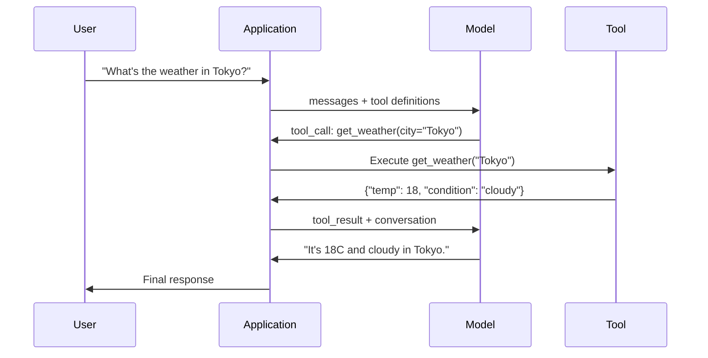

# Function Calling 与 Tool Use

> LLM 什么都做不了。它们生成文本。这就是它们的全部能力。它们查不了天气、查不了数据库、发不了邮件、跑不了代码、读不了文件。你见过的每一个"AI agent"，都是一个 LLM 在生成说该调用哪个函数的 JSON——然后由你的代码真正去调它。模型是大脑，工具是手，function calling 是连接二者的神经系统。

**类型：** Build
**语言：** Python
**前置要求：** 阶段 11 第 03 课（结构化输出）
**预计时间：** ~75 分钟
**相关：** 阶段 11 · 14（Model Context Protocol）——当一个工具要跨多个 host 共享时，从内联的 function-calling 升级到一个 MCP server。本课讲内联的情形；MCP 讲协议的情形。

## 学习目标

- 实现一个 function calling 循环：定义工具 schema、解析模型的 tool-call JSON、执行函数、返回结果
- 设计带清晰描述和有类型参数的工具 schema，让模型能可靠地调用
- 构建一个多轮 agent 循环，链式调用多个函数来回答复杂查询
- 处理 function calling 的边缘情况：并行工具调用、错误传播，以及防止无限工具循环

## 问题所在

你做一个聊天机器人。一个用户问："东京现在天气怎么样？"

模型回复："我无法访问实时天气数据，但根据季节，东京大概在 15 摄氏度左右……"

这是一句披着免责声明外衣的幻觉。模型不知道天气，它永远也不会知道。天气每小时都在变。模型的训练数据是几个月前的。

正确的答案需要调用 OpenWeatherMap API、拿到当前温度、返回真实的数字。模型调不了 API，你的代码能。缺的那块：一个结构化的协议，让模型能说"我需要用这些参数调用天气 API"，让你的代码去执行它、再把结果喂回来。

这就是 function calling。模型输出结构化 JSON，描述要用什么参数调用哪个函数。你的应用执行这个函数。结果回到对话里。模型用这个结果产出它的最终答案。

没有 function calling，LLM 是百科全书。有了它，它们变成 agent。

## 核心概念

### Function calling 循环

每一次 tool-use 交互都遵循同样的 5 步循环。



第 1 步：用户发一条消息。第 2 步：模型收到消息，连同工具定义（描述可用函数的 JSON Schema）。第 3 步：模型不回文本，而是输出一个 tool call——一个带函数名和参数的结构化 JSON 对象。第 4 步：你的代码执行函数、抓住结果。第 5 步：结果回到模型，它现在有真实数据来产出最终答案了。

模型从不执行任何东西。它只决定调什么、用什么参数。你的代码才是执行者。

### 工具定义：JSON Schema 契约

每个工具由一个 JSON Schema 定义，告诉模型这个函数干什么、接受什么参数、那些参数必须是什么类型。

```json
{
  "type": "function",
  "function": {
    "name": "get_weather",
    "description": "Get current weather for a city. Returns temperature in Celsius and conditions.",
    "parameters": {
      "type": "object",
      "properties": {
        "city": {
          "type": "string",
          "description": "City name, e.g. 'Tokyo' or 'San Francisco'"
        },
        "units": {
          "type": "string",
          "enum": ["celsius", "fahrenheit"],
          "description": "Temperature units"
        }
      },
      "required": ["city"]
    }
  }
}
```

`description` 字段至关重要。模型读它们来决定何时、如何使用这个工具。一个含糊的描述比如"gets weather"，比"Get current weather for a city. Returns temperature in Celsius and conditions."产出更差的工具选择。这个描述就是给工具选择用的一个 prompt。

### Provider 对比

每个主流 provider 都支持 function calling，但 API 这层各不相同。

| Provider | API 参数 | Tool Call 格式 | 并行调用 | 强制调用 |
|----------|--------------|-----------------|---------------|----------------|
| OpenAI（GPT-5、o4） | `tools` | `tool_calls[].function` | 是（每轮多个） | `tool_choice="required"` |
| Anthropic（Claude 4.6/4.7） | `tools` | `content[].type="tool_use"` | 是（多个块） | `tool_choice={"type":"any"}` |
| Google（Gemini 3） | `function_declarations` | `functionCall` | 是 | `function_calling_config` |
| 开源权重（Llama 4、Qwen3、DeepSeek-V3） | Llama 4 上原生 `tools`；其他用 Hermes 或 ChatML | 混杂 | 取决于模型 | 基于 prompt，或支持时用 `tool_choice` |

到 2026 年，三家闭源 provider 已经收敛到近乎一致的、基于 JSON Schema 的格式。Llama 4 自带一个匹配 OpenAI 形状的原生 `tools` 字段。开源权重的微调版本仍各不相同——第三方微调里最常见的是 Hermes 格式（NousResearch）。对于跨 host 共享的工具，相比内联 function-calling 更应该用 MCP（阶段 11 · 14）——server 对它们都是同一个。

### Tool Choice：Auto、Required、Specific

你控制模型何时使用工具。

**Auto**（默认）：模型自己决定调工具还是直接回答。"2+2 等于几？"——直接回答。"天气怎么样？"——调工具。

**Required**：模型必须至少调一个工具。当你确定用户的意图需要工具时用它。防止模型靠猜而不是去查真实数据。

**Specific function**：强制模型调某个特定函数。`tool_choice={"type":"function", "function": {"name": "get_weather"}}` 保证天气工具被调用，无论查询是什么。用它做路由——当上游逻辑已经确定了需要哪个工具时。

### 并行 function calling

GPT-4o 和 Claude 能在单轮里调多个函数。一个用户问："东京和纽约天气怎么样？"模型同时输出两个 tool call：

```json
[
  {"name": "get_weather", "arguments": {"city": "Tokyo"}},
  {"name": "get_weather", "arguments": {"city": "New York"}}
]
```

你的代码执行这两个（最好并发），返回两个结果，模型合成出单一回复。这把往返从 2 次砍到 1 次。对每次查询有 5-10 个工具调用的 agent，并行调用把延迟降低 60-80%。

### 结构化输出 vs function calling

第 03 课讲了结构化输出。function calling 用同样的 JSON Schema 机制，但目的不同。

**结构化输出**：强制模型产出特定形状的数据。输出就是最终产物。例子：把文本里的产品信息抽成 `{name, price, in_stock}`。

**Function calling**：模型声明执行某个动作的意图。输出是一个中间步骤。例子：`get_weather(city="Tokyo")`——模型在请求一个动作，不是在产出最终答案。

想做数据抽取就用结构化输出。想让模型和外部系统交互就用 function calling。

### 安全：不容商量的规则

function calling 是你能给 LLM 的最危险的能力。模型选择执行什么。如果你的工具集里有数据库查询，模型就构造查询。如果里面有 shell 命令，模型就写命令。

**规则 1：永远不要把模型生成的 SQL 直接传给数据库。** 模型能、也会生成 DROP TABLE、UNION 注入，或返回每一行的查询。永远参数化。永远校验。永远用一份操作允许清单。

**规则 2：函数走允许清单。** 模型只能调你显式定义的函数。绝不要造一个通用的"按名字执行任意函数"的工具。如果你有 50 个内部函数，只暴露用户需要的那 5 个。

**规则 3：校验参数。** 模型可能传一个城市名 `"; DROP TABLE users; --"`。执行前，把每个参数对照预期的类型、范围和格式校验一遍。

**规则 4：净化工具结果。** 如果一个工具返回敏感数据（API key、PII、内部错误），在把它发回模型之前先过滤掉。模型会把工具结果原封不动地放进它的回复里。

**规则 5：给工具调用限流。** 一个陷入循环的模型能调工具几百次。设一个上限（每段对话 10-20 次比较合理）。打断无限循环。

### 错误处理

工具会失败。API 会超时。数据库会宕。文件会不存在。模型需要知道一个工具何时失败、为什么失败。

把错误作为结构化的工具结果返回，而不是异常：

```json
{
  "error": true,
  "message": "City 'Toky' not found. Did you mean 'Tokyo'?",
  "code": "CITY_NOT_FOUND"
}
```

模型读这个，调整它的参数，再重试。模型很擅长从结构化错误消息里自我纠正。它们不擅长从空响应或泛泛的"出了点问题"错误里恢复。

### MCP：Model Context Protocol

MCP 是 Anthropic 关于工具互操作的开放标准。不再是每个应用各自定义工具，MCP 提供一个通用协议：工具由 MCP server 提供，被 MCP client（比如 Claude Code、Cursor，或你的应用）消费。

一个 MCP server 可以把工具暴露给任何兼容的 client。一个 Postgres MCP server 让任何 MCP 兼容的 agent 拿到数据库访问。一个 GitHub MCP server 让任何 agent 拿到仓库访问。工具定义一次，到处使用。

MCP 之于 function calling，就像 HTTP 之于网络。它标准化了传输层，让工具变得可移植。

## 动手构建

### 第 1 步：定义工具注册表

构建一个注册表，存储工具定义和它们的实现。每个工具有一个 JSON Schema 定义（模型看到的）和一个 Python 函数（你的代码执行的）。

```python
import json
import math
import time
import hashlib


TOOL_REGISTRY = {}


def register_tool(name, description, parameters, function):
    TOOL_REGISTRY[name] = {
        "definition": {
            "type": "function",
            "function": {
                "name": name,
                "description": description,
                "parameters": parameters,
            },
        },
        "function": function,
    }
```

### 第 2 步：实现 5 个工具

构建一个计算器、天气查询、网页搜索模拟器、文件读取器和代码运行器。

```python
def calculator(expression, precision=2):
    allowed = set("0123456789+-*/.() ")
    if not all(c in allowed for c in expression):
        return {"error": True, "message": f"Invalid characters in expression: {expression}"}
    try:
        result = eval(expression, {"__builtins__": {}}, {"math": math})
        return {"result": round(float(result), precision), "expression": expression}
    except Exception as e:
        return {"error": True, "message": str(e)}


WEATHER_DB = {
    "tokyo": {"temp_c": 18, "condition": "cloudy", "humidity": 72, "wind_kph": 14},
    "new york": {"temp_c": 22, "condition": "sunny", "humidity": 45, "wind_kph": 8},
    "london": {"temp_c": 12, "condition": "rainy", "humidity": 88, "wind_kph": 22},
    "san francisco": {"temp_c": 16, "condition": "foggy", "humidity": 80, "wind_kph": 18},
    "sydney": {"temp_c": 25, "condition": "sunny", "humidity": 55, "wind_kph": 10},
}


def get_weather(city, units="celsius"):
    key = city.lower().strip()
    if key not in WEATHER_DB:
        suggestions = [c for c in WEATHER_DB if c.startswith(key[:3])]
        return {
            "error": True,
            "message": f"City '{city}' not found.",
            "suggestions": suggestions,
            "code": "CITY_NOT_FOUND",
        }
    data = WEATHER_DB[key].copy()
    if units == "fahrenheit":
        data["temp_f"] = round(data["temp_c"] * 9 / 5 + 32, 1)
        del data["temp_c"]
    data["city"] = city
    return data


SEARCH_DB = {
    "python function calling": [
        {"title": "OpenAI Function Calling Guide", "url": "https://platform.openai.com/docs/guides/function-calling", "snippet": "Learn how to connect LLMs to external tools."},
        {"title": "Anthropic Tool Use", "url": "https://docs.anthropic.com/en/docs/tool-use", "snippet": "Claude can interact with external tools and APIs."},
    ],
    "MCP protocol": [
        {"title": "Model Context Protocol", "url": "https://modelcontextprotocol.io", "snippet": "An open standard for connecting AI models to data sources."},
    ],
    "weather API": [
        {"title": "OpenWeatherMap API", "url": "https://openweathermap.org/api", "snippet": "Free weather API with current, forecast, and historical data."},
    ],
}


def web_search(query, max_results=3):
    key = query.lower().strip()
    for db_key, results in SEARCH_DB.items():
        if db_key in key or key in db_key:
            return {"query": query, "results": results[:max_results], "total": len(results)}
    return {"query": query, "results": [], "total": 0}


FILE_SYSTEM = {
    "data/config.json": '{"model": "gpt-4o", "temperature": 0.7, "max_tokens": 4096}',
    "data/users.csv": "name,email,role\nAlice,alice@example.com,admin\nBob,bob@example.com,user",
    "README.md": "# My Project\nA tool-use agent built from scratch.",
}


def read_file(path):
    if ".." in path or path.startswith("/"):
        return {"error": True, "message": "Path traversal not allowed.", "code": "FORBIDDEN"}
    if path not in FILE_SYSTEM:
        available = list(FILE_SYSTEM.keys())
        return {"error": True, "message": f"File '{path}' not found.", "available_files": available, "code": "NOT_FOUND"}
    content = FILE_SYSTEM[path]
    return {"path": path, "content": content, "size_bytes": len(content), "lines": content.count("\n") + 1}


def run_code(code, language="python"):
    if language != "python":
        return {"error": True, "message": f"Language '{language}' not supported. Only 'python' is available."}
    forbidden = ["import os", "import sys", "import subprocess", "exec(", "eval(", "__import__", "open("]
    for pattern in forbidden:
        if pattern in code:
            return {"error": True, "message": f"Forbidden operation: {pattern}", "code": "SECURITY_VIOLATION"}
    try:
        local_vars = {}
        exec(code, {"__builtins__": {"print": print, "range": range, "len": len, "str": str, "int": int, "float": float, "list": list, "dict": dict, "sum": sum, "min": min, "max": max, "abs": abs, "round": round, "sorted": sorted, "enumerate": enumerate, "zip": zip, "map": map, "filter": filter, "math": math}}, local_vars)
        result = local_vars.get("result", None)
        return {"success": True, "result": result, "variables": {k: str(v) for k, v in local_vars.items() if not k.startswith("_")}}
    except Exception as e:
        return {"error": True, "message": f"{type(e).__name__}: {e}"}
```

### 第 3 步：注册所有工具

```python
def register_all_tools():
    register_tool(
        "calculator", "Evaluate a mathematical expression. Supports +, -, *, /, parentheses, and decimals. Returns the numeric result.",
        {"type": "object", "properties": {"expression": {"type": "string", "description": "Math expression, e.g. '(10 + 5) * 3'"}, "precision": {"type": "integer", "description": "Decimal places in result", "default": 2}}, "required": ["expression"]},
        calculator,
    )
    register_tool(
        "get_weather", "Get current weather for a city. Returns temperature, condition, humidity, and wind speed.",
        {"type": "object", "properties": {"city": {"type": "string", "description": "City name, e.g. 'Tokyo' or 'San Francisco'"}, "units": {"type": "string", "enum": ["celsius", "fahrenheit"], "description": "Temperature units, defaults to celsius"}}, "required": ["city"]},
        get_weather,
    )
    register_tool(
        "web_search", "Search the web for information. Returns a list of results with title, URL, and snippet.",
        {"type": "object", "properties": {"query": {"type": "string", "description": "Search query"}, "max_results": {"type": "integer", "description": "Maximum results to return", "default": 3}}, "required": ["query"]},
        web_search,
    )
    register_tool(
        "read_file", "Read the contents of a file. Returns the file content, size, and line count.",
        {"type": "object", "properties": {"path": {"type": "string", "description": "Relative file path, e.g. 'data/config.json'"}}, "required": ["path"]},
        read_file,
    )
    register_tool(
        "run_code", "Execute Python code in a sandboxed environment. Set a 'result' variable to return output.",
        {"type": "object", "properties": {"code": {"type": "string", "description": "Python code to execute"}, "language": {"type": "string", "enum": ["python"], "description": "Programming language"}}, "required": ["code"]},
        run_code,
    )
```

### 第 4 步：构建 function calling 循环

这是核心引擎。它模拟模型决定调哪个工具、执行工具、再把结果喂回去。

```python
def simulate_model_decision(user_message, tools, conversation_history):
    msg = user_message.lower()

    if any(word in msg for word in ["weather", "temperature", "forecast"]):
        cities = []
        for city in WEATHER_DB:
            if city in msg:
                cities.append(city)
        if not cities:
            for word in msg.split():
                if word.capitalize() in [c.title() for c in WEATHER_DB]:
                    cities.append(word)
        if not cities:
            cities = ["tokyo"]
        calls = []
        for city in cities:
            calls.append({"name": "get_weather", "arguments": {"city": city.title()}})
        return calls

    if any(word in msg for word in ["calculate", "compute", "math", "what is", "how much"]):
        for token in msg.split():
            if any(c in token for c in "+-*/"):
                return [{"name": "calculator", "arguments": {"expression": token}}]
        if "+" in msg or "-" in msg or "*" in msg or "/" in msg:
            expr = "".join(c for c in msg if c in "0123456789+-*/.() ")
            if expr.strip():
                return [{"name": "calculator", "arguments": {"expression": expr.strip()}}]
        return [{"name": "calculator", "arguments": {"expression": "0"}}]

    if any(word in msg for word in ["search", "find", "look up", "google"]):
        query = msg.replace("search for", "").replace("look up", "").replace("find", "").strip()
        return [{"name": "web_search", "arguments": {"query": query}}]

    if any(word in msg for word in ["read", "file", "open", "cat", "show"]):
        for path in FILE_SYSTEM:
            if path.split("/")[-1].split(".")[0] in msg:
                return [{"name": "read_file", "arguments": {"path": path}}]
        return [{"name": "read_file", "arguments": {"path": "README.md"}}]

    if any(word in msg for word in ["run", "execute", "code", "python"]):
        return [{"name": "run_code", "arguments": {"code": "result = 'Hello from the sandbox!'", "language": "python"}}]

    return []


def execute_tool_call(tool_call):
    name = tool_call["name"]
    args = tool_call["arguments"]

    if name not in TOOL_REGISTRY:
        return {"error": True, "message": f"Unknown tool: {name}", "code": "UNKNOWN_TOOL"}

    tool = TOOL_REGISTRY[name]
    func = tool["function"]
    start = time.time()

    try:
        result = func(**args)
    except TypeError as e:
        result = {"error": True, "message": f"Invalid arguments: {e}"}

    elapsed_ms = round((time.time() - start) * 1000, 2)
    return {"tool": name, "result": result, "execution_time_ms": elapsed_ms}


def run_function_calling_loop(user_message, max_iterations=5):
    conversation = [{"role": "user", "content": user_message}]
    tool_definitions = [t["definition"] for t in TOOL_REGISTRY.values()]
    all_tool_results = []

    for iteration in range(max_iterations):
        tool_calls = simulate_model_decision(user_message, tool_definitions, conversation)

        if not tool_calls:
            break

        results = []
        for call in tool_calls:
            result = execute_tool_call(call)
            results.append(result)

        conversation.append({"role": "assistant", "content": None, "tool_calls": tool_calls})

        for result in results:
            conversation.append({"role": "tool", "content": json.dumps(result["result"]), "tool_name": result["tool"]})

        all_tool_results.extend(results)
        break

    return {"conversation": conversation, "tool_results": all_tool_results, "iterations": iteration + 1 if tool_calls else 0}
```

### 第 5 步：参数校验

构建一个校验器，在执行前把 tool call 的参数对照 JSON Schema 检查。

```python
def validate_tool_arguments(tool_name, arguments):
    if tool_name not in TOOL_REGISTRY:
        return [f"Unknown tool: {tool_name}"]

    schema = TOOL_REGISTRY[tool_name]["definition"]["function"]["parameters"]
    errors = []

    if not isinstance(arguments, dict):
        return [f"Arguments must be an object, got {type(arguments).__name__}"]

    for required_field in schema.get("required", []):
        if required_field not in arguments:
            errors.append(f"Missing required argument: {required_field}")

    properties = schema.get("properties", {})
    for arg_name, arg_value in arguments.items():
        if arg_name not in properties:
            errors.append(f"Unknown argument: {arg_name}")
            continue

        prop_schema = properties[arg_name]
        expected_type = prop_schema.get("type")

        type_checks = {"string": str, "integer": int, "number": (int, float), "boolean": bool, "array": list, "object": dict}
        if expected_type in type_checks:
            if not isinstance(arg_value, type_checks[expected_type]):
                errors.append(f"Argument '{arg_name}': expected {expected_type}, got {type(arg_value).__name__}")

        if "enum" in prop_schema and arg_value not in prop_schema["enum"]:
            errors.append(f"Argument '{arg_name}': '{arg_value}' not in {prop_schema['enum']}")

    return errors
```

### 第 6 步：运行演示

```python
def run_demo():
    register_all_tools()

    print("=" * 60)
    print("  Function Calling & Tool Use Demo")
    print("=" * 60)

    print("\n--- Registered Tools ---")
    for name, tool in TOOL_REGISTRY.items():
        desc = tool["definition"]["function"]["description"][:60]
        params = list(tool["definition"]["function"]["parameters"].get("properties", {}).keys())
        print(f"  {name}: {desc}...")
        print(f"    params: {params}")

    print(f"\n--- Argument Validation ---")
    validation_tests = [
        ("get_weather", {"city": "Tokyo"}, "Valid call"),
        ("get_weather", {}, "Missing required arg"),
        ("get_weather", {"city": "Tokyo", "units": "kelvin"}, "Invalid enum value"),
        ("calculator", {"expression": 123}, "Wrong type (int for string)"),
        ("unknown_tool", {"x": 1}, "Unknown tool"),
    ]
    for tool_name, args, label in validation_tests:
        errors = validate_tool_arguments(tool_name, args)
        status = "VALID" if not errors else f"ERRORS: {errors}"
        print(f"  {label}: {status}")

    print(f"\n--- Tool Execution ---")
    direct_tests = [
        {"name": "calculator", "arguments": {"expression": "(10 + 5) * 3 / 2"}},
        {"name": "get_weather", "arguments": {"city": "Tokyo"}},
        {"name": "get_weather", "arguments": {"city": "Mars"}},
        {"name": "web_search", "arguments": {"query": "python function calling"}},
        {"name": "read_file", "arguments": {"path": "data/config.json"}},
        {"name": "read_file", "arguments": {"path": "../etc/passwd"}},
        {"name": "run_code", "arguments": {"code": "result = sum(range(1, 101))"}},
        {"name": "run_code", "arguments": {"code": "import os; os.system('rm -rf /')"}},
    ]
    for call in direct_tests:
        result = execute_tool_call(call)
        print(f"\n  {call['name']}({json.dumps(call['arguments'])})")
        print(f"    -> {json.dumps(result['result'], indent=None)[:100]}")
        print(f"    time: {result['execution_time_ms']}ms")

    print(f"\n--- Full Function Calling Loop ---")
    test_queries = [
        "What's the weather in Tokyo?",
        "Calculate (100 + 250) * 0.15",
        "Search for MCP protocol",
        "Read the config file",
        "Run some Python code",
        "Tell me a joke",
    ]
    for query in test_queries:
        print(f"\n  User: {query}")
        result = run_function_calling_loop(query)
        if result["tool_results"]:
            for tr in result["tool_results"]:
                print(f"    Tool: {tr['tool']} ({tr['execution_time_ms']}ms)")
                print(f"    Result: {json.dumps(tr['result'], indent=None)[:90]}")
        else:
            print(f"    [No tool called -- direct response]")
        print(f"    Iterations: {result['iterations']}")

    print(f"\n--- Parallel Tool Calls ---")
    multi_city_query = "What's the weather in tokyo and london?"
    print(f"  User: {multi_city_query}")
    result = run_function_calling_loop(multi_city_query)
    print(f"  Tool calls made: {len(result['tool_results'])}")
    for tr in result["tool_results"]:
        city = tr["result"].get("city", "unknown")
        temp = tr["result"].get("temp_c", "N/A")
        print(f"    {city}: {temp}C, {tr['result'].get('condition', 'N/A')}")

    print(f"\n--- Security Checks ---")
    security_tests = [
        ("read_file", {"path": "../../etc/passwd"}),
        ("run_code", {"code": "import subprocess; subprocess.run(['ls'])"}),
        ("calculator", {"expression": "__import__('os').system('ls')"}),
    ]
    for tool_name, args in security_tests:
        result = execute_tool_call({"name": tool_name, "arguments": args})
        blocked = result["result"].get("error", False)
        print(f"  {tool_name}({list(args.values())[0][:40]}): {'BLOCKED' if blocked else 'ALLOWED'}")
```

## 上手使用

### OpenAI Function Calling

```python
# from openai import OpenAI
#
# client = OpenAI()
#
# tools = [{
#     "type": "function",
#     "function": {
#         "name": "get_weather",
#         "description": "Get current weather for a city",
#         "parameters": {
#             "type": "object",
#             "properties": {
#                 "city": {"type": "string"},
#                 "units": {"type": "string", "enum": ["celsius", "fahrenheit"]}
#             },
#             "required": ["city"]
#         }
#     }
# }]
#
# response = client.chat.completions.create(
#     model="gpt-4o",
#     messages=[{"role": "user", "content": "Weather in Tokyo?"}],
#     tools=tools,
#     tool_choice="auto",
# )
#
# tool_call = response.choices[0].message.tool_calls[0]
# args = json.loads(tool_call.function.arguments)
# result = get_weather(**args)
#
# final = client.chat.completions.create(
#     model="gpt-4o",
#     messages=[
#         {"role": "user", "content": "Weather in Tokyo?"},
#         response.choices[0].message,
#         {"role": "tool", "tool_call_id": tool_call.id, "content": json.dumps(result)},
#     ],
# )
# print(final.choices[0].message.content)
```

OpenAI 把 tool call 作为 `response.choices[0].message.tool_calls` 返回。每个调用有一个 `id`，你返回结果时必须带上它。模型用这个 ID 把结果和调用匹配起来。GPT-4o 能在单次响应里返回多个 tool call——遍历并执行它们全部。

### Anthropic Tool Use

```python
# import anthropic
#
# client = anthropic.Anthropic()
#
# response = client.messages.create(
#     model="claude-sonnet-4-20250514",
#     max_tokens=1024,
#     tools=[{
#         "name": "get_weather",
#         "description": "Get current weather for a city",
#         "input_schema": {
#             "type": "object",
#             "properties": {
#                 "city": {"type": "string"},
#                 "units": {"type": "string", "enum": ["celsius", "fahrenheit"]}
#             },
#             "required": ["city"]
#         }
#     }],
#     messages=[{"role": "user", "content": "Weather in Tokyo?"}],
# )
#
# tool_block = next(b for b in response.content if b.type == "tool_use")
# result = get_weather(**tool_block.input)
#
# final = client.messages.create(
#     model="claude-sonnet-4-20250514",
#     max_tokens=1024,
#     tools=[...],
#     messages=[
#         {"role": "user", "content": "Weather in Tokyo?"},
#         {"role": "assistant", "content": response.content},
#         {"role": "user", "content": [{"type": "tool_result", "tool_use_id": tool_block.id, "content": json.dumps(result)}]},
#     ],
# )
```

Anthropic 把 tool call 作为 `type: "tool_use"` 的内容块返回。工具结果放进一条 `type: "tool_result"` 的 user 消息里。注意关键差异：Anthropic 用 `input_schema` 定义工具参数，而 OpenAI 用 `parameters`。

### MCP 集成

```python
# MCP server 通过标准化协议暴露工具。
# 任何 MCP 兼容的 client 都能发现并调用这些工具。
#
# 示例：连接到一个 Postgres MCP server
#
# from mcp import ClientSession, StdioServerParameters
# from mcp.client.stdio import stdio_client
#
# server_params = StdioServerParameters(
#     command="npx",
#     args=["-y", "@modelcontextprotocol/server-postgres", "postgresql://localhost/mydb"],
# )
#
# async with stdio_client(server_params) as (read, write):
#     async with ClientSession(read, write) as session:
#         await session.initialize()
#         tools = await session.list_tools()
#         result = await session.call_tool("query", {"sql": "SELECT count(*) FROM users"})
```

MCP 把工具实现和工具消费解耦。Postgres server 懂 SQL。GitHub server 懂 API。你的 agent 只管发现并调用工具——它不需要为每个集成写 provider 专属的代码。

## 交付

本节课产出 `outputs/prompt-tool-designer.md`——一个可复用的 prompt 模板，用来设计工具定义。给它一段描述说你想让工具干什么，它就产出完整的 JSON Schema 定义，带描述、类型和约束。

它还产出 `outputs/skill-function-calling-patterns.md`——一套在生产中实现 function calling 的决策框架，涵盖工具设计、错误处理、安全和 provider 专属模式。

## 练习

1. **加第 6 个工具：数据库查询。** 实现一个带内存表的模拟 SQL 工具。这个工具接受表名和过滤条件（不是原始 SQL）。校验表名在允许清单里，且过滤运算符限制在 `=`、`>`、`<`、`>=`、`<=`。把匹配的行作为 JSON 返回。

2. **实现带错误反馈的重试。** 当一个 tool call 失败时（比如城市未找到），把错误消息喂回给模型决策函数，让它纠正参数。跟踪每个调用重试了几次。每个 tool call 最多重试 3 次。

3. **构建一个多步 agent。** 有些查询需要链式调用工具："读 config 文件告诉我配的是哪个模型，然后上网搜那个模型的定价。"实现一个循环，跑到模型决定不再需要工具为止，把累积的结果传进每一步决策。限制 10 次迭代以防无限循环。

4. **测量工具选择准确率。** 创建 30 个带预期工具名的测试查询。在全部 30 个上跑你的决策函数，测量它选对工具的比例。找出哪些查询最容易在工具之间造成混淆。

5. **实现 tool call 缓存。** 如果同一个工具在 60 秒内被用一模一样的参数调用，返回缓存结果而不是重新执行。用一个以 `(tool_name, frozenset(args.items()))` 为键的字典。在一段 20 个查询的对话里测量缓存命中率。

## 关键术语

| 术语 | 大家怎么说 | 它实际是什么 |
|------|----------------|----------------------|
| Function calling | "Tool use" | 模型输出结构化 JSON，描述要用特定参数调用的函数——执行它的是你的代码，不是模型 |
| 工具定义 | "函数 schema" | 一个 JSON Schema 对象，描述工具的名称、用途、参数和类型——模型读它来决定何时、如何使用该工具 |
| Tool choice | "调用模式" | 控制模型是必须调工具（required）、可以调工具（auto），还是必须调特定工具（named） |
| 并行调用 | "多工具" | 模型在单轮里输出多个 tool call，减少往返——GPT-4o 和 Claude 都支持 |
| 工具结果 | "函数输出" | 执行工具的返回值，作为消息发回模型，让它能在回复里用上真实数据 |
| 参数校验 | "输入检查" | 在执行工具前，核验模型生成的参数匹配预期的类型、范围和约束 |
| MCP | "工具协议" | Model Context Protocol——Anthropic 关于通过 server 暴露工具的开放标准，任何兼容 client 都能发现并调用 |
| Agent 循环 | "ReAct 循环" | 模型决定工具、代码执行工具、结果喂回去的迭代周期，直到模型有足够信息作答 |
| 工具投毒 | "通过工具的 prompt 注入" | 一种攻击：工具结果里含有操纵模型行为的指令——净化所有工具输出 |
| 限流 | "调用预算" | 给每段对话设一个工具调用的最大次数，防止无限循环和失控的 API 成本 |

## 延伸阅读

- [OpenAI Function Calling Guide](https://platform.openai.com/docs/guides/function-calling)——GPT-4o tool use 的权威参考，包括并行调用、强制调用和结构化参数
- [Anthropic Tool Use Guide](https://docs.anthropic.com/en/docs/tool-use)——Claude 的 tool use 实现，带 input_schema、多工具响应和 tool_choice 配置
- [Model Context Protocol Specification](https://modelcontextprotocol.io)——跨 AI 应用做工具互操作的开放标准，带 server/client 架构
- [Schick et al., 2023 -- "Toolformer: Language Models Can Teach Themselves to Use Tools"](https://arxiv.org/abs/2302.04761)——训练 LLM 决定何时、如何调用外部工具的奠基性论文
- [Patil et al., 2023 -- "Gorilla: Large Language Model Connected with Massive APIs"](https://arxiv.org/abs/2305.15334)——微调 LLM 在 1645 个 API 上做准确的 API 调用，并减少幻觉
- [Berkeley Function Calling Leaderboard](https://gorilla.cs.berkeley.edu/leaderboard.html)——实时基准，比较 GPT-4o、Claude、Gemini 和开源模型的 function calling 准确率
- [Yao et al., "ReAct: Synergizing Reasoning and Acting in Language Models" (ICLR 2023)](https://arxiv.org/abs/2210.03629)——Thought-Action-Observation 循环，是包在每次工具调用外面的 agent 外层循环；本课结束的地方，阶段 14 接着讲。
- [Anthropic — Building effective agents (Dec 2024)](https://www.anthropic.com/research/building-effective-agents)——从单一的 tool-use 原语构建出的五种可组合模式（prompt chaining、routing、parallelization、orchestrator-workers、evaluator-optimizer）。
