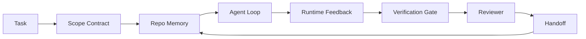

# Agent 工作台工程：能干的模型为什么还会失败

> 一个能干的模型还不够。可靠的 agent 需要一个工作台：指令、状态、范围、反馈、验证、审查和交接。把这些剥掉，连前沿模型都会产出不安全到无法交付的活儿。

**类型：** Learn + Build
**语言：** Python（标准库）
**前置要求：** 阶段 14 · 01（Agent 循环）、阶段 14 · 26（失败模式）
**预计时间：** ~45 分钟

## 学习目标

- 把模型能力和执行可靠性分开。
- 说出决定一个 agent 能否交付的七个工作台接触面。
- 在一个小仓库任务上，把「仅 prompt」运行和「工作台引导」运行做对比。
- 产出一份失败模式报告，把每个缺失的接触面映射到它造成的症状。

## 问题所在

你把一个前沿模型丢进一个真实仓库，让它加输入校验。它打开四个文件，写出看着合理的代码，宣布成功，然后停下。你跑测试。两个失败。第三个被改动的文件和校验毫无关系。没有任何记录说明 agent 假设了什么、最先试了什么、还剩什么没做。

模型对 Python 没搞错。它对这份活儿搞错了。它根本不知道什么算做完、它被允许往哪里写、哪些测试是权威的、下一个会话该怎么接手。

这不是模型 bug。这是工作台 bug。模型周围的接触面缺了那些把一次性生成变成可靠、可恢复工程的部件。

## 核心概念

工作台是在一个任务期间包裹模型的运行环境。它有七个接触面：

| 接触面 | 它承载什么 | 缺失时的失败 |
|---------|-----------------|----------------------|
| 指令 | 启动规则、禁止动作、完成的定义 | agent 猜什么叫交付 |
| 状态 | 当前任务、已碰文件、阻塞点、下一步动作 | 每个会话从零重启 |
| 范围 | 允许文件、禁止文件、验收标准 | 编辑泄漏进无关代码 |
| 反馈 | 捕获进循环的真实命令输出 | agent 在 400 上宣布成功 |
| 验证 | 测试、lint、冒烟运行、范围检查 | 「看着挺好」直达 main |
| 审查 | 用不同角色再过一遍 | 构建者给自己批作业 |
| 交接 | 改了什么、为什么、还剩什么 | 下个会话把一切重新发现一遍 |

工作台独立于模型。你可以换模型而保留接触面。你不能换掉接触面还保住可靠性。



循环闭合在状态文件上，而不是聊天历史上。聊天是易失的。仓库才是记录系统。

### 工作台 vs prompt 工程

prompt 告诉模型你这一轮想要什么。工作台告诉模型如何跨轮次、跨会话地干活。大多数 agent 失败故事都是穿着 prompt 工程衣服的工作台失败。

### 工作台 vs 框架

框架给你一个运行时（LangGraph、AutoGen、Agents SDK）。工作台给 agent 一个在那个运行时里干活的地方。两个你都需要。这个小专题讲的是第二个。

### 从原语推理，而非从厂商分类法

眼下关于「harness 工程」的文章很多。Addy Osmani、OpenAI、Anthropic、LangChain、Martin Fowler、MongoDB、HumanLayer、Augment Code、Thoughtworks、walkinglabs 的 awesome 清单，以及源源不断的 Medium 和 Hacker News 文章都在扛着它。他们对「harness 是什么」的边界、什么在范围内、用哪套术语意见不一。我们不必选边站。这七个接触面是一个 UX 层；每个工作台底下都是同一套撑起任何可靠后端的分布式系统原语。

把 agent 标签先撕掉一会儿。一次 agent 运行是跨时间、跨进程、跨机器的计算。要让它可靠，你需要任何生产系统都需要的同一套原语。

| 原语 | 它是什么 | 它为 agent 承载什么 |
|-----------|------------|------------------------------|
| 函数 | 带类型的处理器。尽量纯。掌管自己的输入输出。 | 一次工具调用、一次规则检查、一个验证步骤、一次模型调用 |
| Worker | 长存进程，掌管一个或多个函数和一个生命周期 | 构建者、审查者、验证者、一个 MCP 服务器 |
| 触发器 | 调用一个函数的事件源 | agent 循环 tick、HTTP 请求、队列消息、cron、文件变更、hook |
| 运行时 | 决定什么在哪里跑、用什么超时和资源的边界 | Claude Code 的进程、LangGraph 的运行时、一个 worker 容器 |
| HTTP / RPC | 调用方和 worker 之间的线 | 工具调用协议、MCP 请求、模型 API |
| 队列 | 触发器和 worker 之间的持久缓冲；背压、重试、幂等 | 任务看板、反馈日志、审查收件箱 |
| 会话持久化 | 在崩溃、重启、换模型后存活的状态 | `agent_state.json`、检查点、KV 存储、仓库本身 |
| 授权策略 | 谁能用哪个范围调哪个函数 | 允许/禁止文件、审批边界、MCP 能力清单 |

现在把七个工作台接触面映射到这些原语上。

- **指令** —— 策略 + 函数元数据。规则是检查（函数）。路由器（`AGENTS.md`）是附在运行时启动上的策略。
- **状态** —— 会话持久化。运行时在每一步读取的一个带键存储。文件、KV 或 DB；持久化语义重要，存储后端不重要。
- **范围** —— 每任务的授权策略。允许/禁止 glob 是一个 ACL。所需审批是一个权限格。
- **反馈** —— 写进一个队列的调用日志。每次 shell 调用都是一条记录，持久、可重放。
- **验证** —— 一个函数。在输入上确定。任务关闭时触发。失败时关闭。
- **审查** —— 一个独立 worker，对构建者产物有只读授权，对审查报告有只写授权。
- **交接** —— 由会话结束触发器发出的一条持久记录。下个会话的启动触发器读它。

agent 循环本身是一个 worker，它消费事件（用户消息、工具结果、定时器 tick），调用函数（先模型，然后模型挑的工具），写记录（状态、反馈），发出触发器（验证、审查、交接）。没什么神秘的；和一个作业处理器是同一个形态。

### 流传中的模式，翻译成原语

每个流行的 harness 模式都可归约成这八个原语。翻译表。

| 厂商或社区模式 | 它实际是什么 |
|------------------------------|--------------------|
| Ralph Loop（Claude Code、Codex、agentic_harness 一书）—— 当 agent 试图过早停下时，把原始意图重新注入一个全新上下文窗口 | 一个把任务用干净上下文重新入队的触发器；会话持久化把目标向前承载 |
| Plan / Execute / Verify（PEV） | 三个 worker，每角色一个，通过状态和阶段间的一个队列通信 |
| Harness-compute separation（OpenAI Agents SDK，2026 年 4 月）—— 把控制平面和执行平面分开 | 重述控制平面 / 数据平面。比 agent 标签早了几十年 |
| Open Agent Passport（OAP，2026 年 3 月）—— 在执行前对照声明式策略对每次工具调用签名和审计 | 由一个动作前 worker 强制的授权策略，带一个签名审计队列 |
| Guides and Sensors（Birgitta Böckeler / Thoughtworks）—— 前馈规则 + 反馈可观测性 | 授权策略 + 验证函数 + 可观测性 trace |
| 渐进式压实，5 阶段（Claude Code 逆向工程，2026 年 4 月） | 一个状态管理 worker，类 cron 地在会话持久化上跑，把它保持在预算内 |
| Hooks / middleware（LangChain、Claude Code）—— 拦截模型和工具调用 | 包在运行时调用路径周围的触发器 + 函数 |
| Skills 作为带渐进式披露的 Markdown（Anthropic、Flue） | 一个函数注册表，函数元数据被即时加载进上下文 |
| Sandbox agent（Codex、Sandcastle、Vercel Sandbox） | 计算平面：一个带隔离文件系统、网络和生命周期的运行时 |
| MCP 服务器 | 通过稳定 RPC 暴露函数的 worker，能力清单作为授权 |

那张表里的每一项，都是 agent 社区到达了一个在分布式系统里早已有名字的原语，然后给它起了个新名字。对营销是有用的标签；作为工程词汇没用。

### 收据上实际写了什么

「harness 胜过模型」的主张现在有数字撑腰了。值得知道，因为它们也是反对「等个更聪明的模型就行」的唯一诚实论据。

- Terminal Bench 2.0 —— 同一个模型，光改 harness 就把一个编码 agent 从前 30 名开外挪到了第五名（LangChain，《Anatomy of an Agent Harness》）。
- Vercel —— 删掉了它 agent 80% 的工具；成功率从 80% 跳到 100%（MongoDB）。
- Harvey —— 法律 agent 仅靠 harness 优化就把准确率翻了一倍多（MongoDB）。
- 88% 的企业 AI agent 项目无法进入生产。失败聚集在运行时，而不是推理（preprints.org，《Harness Engineering for Language Agents》，2026 年 3 月）。
- 2025 年一项横跨三个流行开源框架的基准研究报告任务完成率约 50%；长上下文 WebAgent 在长上下文条件下从 40-50% 崩到不足 10%，大多源于死循环和目标丢失（2026 年初多篇文章广泛报道）。

要点不是「harness 永远赢」。模型确实会随时间吸收 harness 技巧。要点是今天，承重的工程在模型周围，而不在它内部，而扛起那个负载的原语，正是每个生产系统一直以来都需要的那些。

### 厂商文章在哪里没讲透

这部分你不用客气。

- LangChain 的《Anatomy of an Agent Harness》列举了十一个组件 —— prompt、工具、hook、sandbox、编排、记忆、skill、子 agent，和一个运行时「笨循环」。它没点名队列、把 worker 当部署单元、触发器语义、把会话持久化当独立关切、或授权策略。它把 harness 当成一个你去配置的对象，而不是一个你去部署的系统。
- Addy Osmani 的《Agent Harness Engineering》落地了 `Agent = Model + Harness` 的框定和棘轮模式，但没说 harness 是用什么造出来的。读起来像个立场，不是一份规格。
- Anthropic 和 OpenAI 在接触面上挖得最深，但都待在自己的运行时里。2026 年 4 月 Agents SDK 里的「harness-compute separation」公告是第一篇明确支持控制平面 / 数据平面拆分的厂商文章。那是个原语想法，不是个新想法。
- agentic_harness 一书把 harness 当成一个配置对象（Jaymin West 的《Agentic Engineering》第 6 章），里头最强的一句是「harness 是 agent 系统里的主要安全边界」。那只是授权策略，换了个说法。
- Hacker News 帖子总在同一个地方落地。2026 年 4 月那个帖子《The agent harness belongs outside the sandbox》主张 harness 应当坐得「更像一个 hypervisor，待在一切之外，基于上下文和用户授权访问」。那，又是把授权策略当作一个独立平面。

你不用反对这些文章里的任何一篇，也能注意到那个缺口。它们在给一个早已存在的系统写 UX 描述。我们在写那个系统。系统造对了，七个接触面就从原语里掉出来。系统造错了，再多的 `AGENTS.md` 打磨也修不了那个缺失的队列。

所以当你在别处听到「harness 工程」，把它翻译成原语。prompt 和规则是策略和函数。脚手架是运行时。guardrail 是授权 + 验证。hook 是触发器。记忆是会话持久化。Ralph Loop 是重新入队。子 agent 是 worker。sandbox 是计算平面。词汇变了；工程没变。工作台是面向 agent 的 UX；而 harness —— 在能挺过下一次厂商重新框定的那个意义上 —— 是函数、worker、触发器、运行时、队列、持久化和策略正确接在一起。

## 动手构建

`code/main.py` 把一个小仓库任务跑两遍。先仅用 prompt，然后接好七个接触面。同一个模型，同一个任务。脚本统计失败那次运行缺了哪些接触面，并打印一份失败模式报告。

这个仓库任务故意做得小：给一个单文件的 FastAPI 式处理器加输入校验，并写一个能通过的测试。

运行它：

```
python3 code/main.py
```

输出：两次运行的并排日志、一份总结仅 prompt 运行的 `failure_modes.json`，以及工作台运行的一行裁决。

这个 agent 是个微小的基于规则的桩；重点是接触面，不是模型。在这个小专题的其余部分，你将把每个接触面重建成一个真实、可复用的产物。

## 上手使用

工作台接触面在野外已经存在的三个地方，尽管没人这么叫它们：

- **Claude Code、Codex、Cursor。** `AGENTS.md` 和 `CLAUDE.md` 是指令接触面。斜杠命令是范围。hook 是验证。
- **LangGraph、OpenAI Agents SDK。** 检查点和会话存储是状态接触面。handoff 是交接接触面。
- **真实仓库上的 CI。** 测试、lint 和类型检查是验证。PR 模板是交接。CODEOWNERS 是审查。

工作台工程是把这些接触面显式化、可复用化的学科，而不是让每个团队各自重新发现它们。

## 交付

`outputs/skill-workbench-audit.md` 是一个可移植技能，审计一个现有仓库的七个工作台接触面，报告哪些缺失、哪些部分齐备、哪些健康。把它丢在任何 agent 配置旁边；它告诉你先修什么。

## 练习

1. 挑一个你已经在跑 agent 的仓库。给七个接触面从 0（缺失）到 2（健康）打分。你最弱的接触面是哪个？
2. 扩展 `main.py`，让仅 prompt 的运行也产出一个假的「成功」声称。验证验证关卡本来能抓到它。
3. 为你自己的产品加第八个接触面。论证它为什么没塌进现有七个之一。
4. 用一个会幻觉出额外文件写入的不同桩 agent 重跑脚本。哪个接触面最先抓到它？
5. 把阶段 14 · 26 里五种行业反复出现的失败模式映射到七个接触面上。每个接触面设计来吸收哪个模式？

## 关键术语

| 术语 | 大家怎么说 | 它实际是什么 |
|------|----------------|------------------------|
| Workbench | 「那套配置」 | 模型周围让活儿可靠的工程化接触面 |
| Surface | 「一个文档」或「一个脚本」 | 一个具名、机器可读的输入，agent 每轮读或写 |
| System of record | 「那些笔记」 | 聊天历史没了时 agent 当作真相的那个文件 |
| Definition of done | 「验收」 | 一份客观的、有文件支撑的、agent 无法伪造的清单 |
| Workbench audit | 「仓库就绪检查」 | 对七个接触面过一遍，在开工前标出缺失部件 |

## 延伸阅读

把这些当数据点读，不是当权威。每一篇都是一份局部分类法。把每个概念翻译回一个原语（函数、worker、触发器、运行时、HTTP/RPC、队列、持久化、策略），再决定要不要采用它。

厂商框定：

- [Addy Osmani, Agent Harness Engineering](https://addyosmani.com/blog/agent-harness-engineering/) —— `Agent = Model + Harness` 和棘轮模式；基础设施层面单薄
- [LangChain, The Anatomy of an Agent Harness](https://blog.langchain.com/the-anatomy-of-an-agent-harness/) —— 十一个组件：prompt、工具、hook、编排、sandbox、记忆、skill、子 agent、运行时；遗漏了队列、部署、授权
- [OpenAI, Harness engineering: leveraging Codex in an agent-first world](https://openai.com/index/harness-engineering/) —— Codex 团队对其运行时周围接触面的看法
- [OpenAI, Unrolling the Codex agent loop](https://openai.com/index/unrolling-the-codex-agent-loop/) —— agent 循环归约成对函数调用的一个 `while`
- [Anthropic, Effective harnesses for long-running agents](https://www.anthropic.com/engineering/effective-harnesses-for-long-running-agents) —— 一个特定运行时内的长跨度接触面
- [Anthropic, Harness design for long-running application development](https://www.anthropic.com/engineering/harness-design-long-running-apps) —— 应用设计笔记
- [LangChain Deep Agents harness capabilities](https://docs.langchain.com/oss/python/deepagents/harness) —— 运行时配置接触面

带可用细节的实践者文章：

- [Martin Fowler / Birgitta Böckeler, Harness engineering for coding agent users](https://martinfowler.com/articles/harness-engineering.html) —— guides（前馈）+ sensors（反馈）；最干净的控制论框定
- [HumanLayer, Skill Issue: Harness Engineering for Coding Agents](https://www.humanlayer.dev/blog/skill-issue-harness-engineering-for-coding-agents) —— 「这不是模型问题，是配置问题」
- [MongoDB, The Agent Harness: Why the LLM Is the Smallest Part of Your Agent System](https://www.mongodb.com/company/blog/technical/agent-harness-why-llm-is-smallest-part-of-your-agent-system) —— 收据：Vercel 80% 到 100%、Harvey 准确率翻倍、Terminal Bench 前 30 到前 5
- [Augment Code, Harness Engineering for AI Coding Agents](https://www.augmentcode.com/guides/harness-engineering-ai-coding-agents) —— 约束优先的逐步讲解
- [Sequoia podcast, Harrison Chase on Context Engineering Long-Horizon Agents](https://sequoiacap.com/podcast/context-engineering-our-way-to-long-horizon-agents-langchains-harrison-chase/) —— 运行时关切高于模型关切

书籍、论文和参考实现：

- [Jaymin West, Agentic Engineering — Chapter 6: Harnesses](https://www.jayminwest.com/agentic-engineering-book/6-harnesses) —— 书本长度的论述，把 harness 当作主要安全边界
- [preprints.org, Harness Engineering for Language Agents (March 2026)](https://www.preprints.org/manuscript/202603.1756) —— 学术框定为控制 / 能动性 / 运行时
- [walkinglabs/awesome-harness-engineering](https://github.com/walkinglabs/awesome-harness-engineering) —— 横跨上下文、评估、可观测性、编排的精选阅读清单
- [ai-boost/awesome-harness-engineering](https://github.com/ai-boost/awesome-harness-engineering) —— 另一份精选清单（工具、评估、记忆、MCP、权限）
- [andrewgarst/agentic_harness](https://github.com/andrewgarst/agentic_harness) —— 生产就绪的参考实现，带 Redis 支撑的记忆和评估套件
- [HKUDS/OpenHarness](https://github.com/HKUDS/OpenHarness) —— 开放 agent harness，内置个人 agent

值得读分歧而非共识的 Hacker News 帖子：

- [HN: Effective harnesses for long-running agents](https://news.ycombinator.com/item?id=46081704)
- [HN: Improving 15 LLMs at Coding in One Afternoon. Only the Harness Changed](https://news.ycombinator.com/item?id=46988596)
- [HN: The agent harness belongs outside the sandbox](https://news.ycombinator.com/item?id=47990675) —— 主张把授权当作一个独立平面

本课程内部的交叉引用：

- 阶段 14 · 23 —— OpenTelemetry GenAI 约定：sensors 文献指向的可观测性层
- 阶段 14 · 26 —— 失败模式，编目了七个接触面设计来吸收的东西
- 阶段 14 · 27 —— 坐在授权策略原语上的 prompt 注入防御
- 阶段 14 · 29 —— 生产运行时（队列、事件、cron）：这一课里的原语在部署里住的地方
