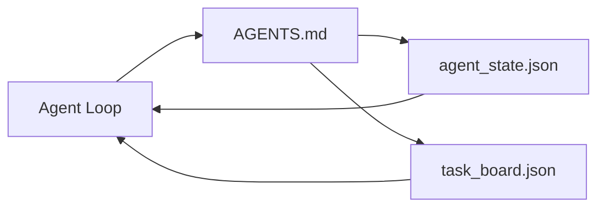

# 最小 Agent 工作台

> 最小可用的工作台是三个文件：一个根指令路由器、一个状态文件、一个任务看板。其他一切都叠在它们之上。如果一个仓库连这三个都扛不住，没有模型救得了它。

**类型：** Build
**语言：** Python（标准库）
**前置要求：** 阶段 14 · 31（能干的模型为什么还会失败）
**预计时间：** ~45 分钟

## 学习目标

- 定义构成最小可行工作台的三个文件。
- 解释为什么一个简短的根路由器胜过一个冗长的单体 `AGENTS.md`。
- 构建一个 agent 每轮可读、结束时可写的状态文件。
- 构建一个不靠聊天历史就能挺过多会话工作的任务看板。

## 问题所在

大多数团队搞工作台靠写一个 3000 行的 `AGENTS.md` 然后宣布完事。模型加载它，忽略它没法总结的部分，仍在它一直失败的那些接触面上失败。

你需要的是反过来。一个微小的根文件，只在相关时把 agent 路由进更深的文件。持久状态，agent 行动前读、行动后写。一个任务看板，写明什么在进行、什么被阻塞、接下来轮到什么。

三个文件。每个有一份职责。每个都足够机器可读，以便日后演化成一个真实系统。

## 核心概念



### AGENTS.md 是路由器，不是手册

一个好的 `AGENTS.md` 很短。它把 agent 指向：

- 状态文件（你在哪儿）。
- 任务看板（还剩什么）。
- 更深的规则（在 `docs/agent-rules.md` 下）。
- 验证命令（怎么知道它管用）。

任何更长的东西都进更深的文档，只在需要时加载。长手册会被忽略。短路由器会被遵循。

### agent_state.json 是记录系统

状态承载：活跃任务 id、已碰文件、做出的假设、阻塞点、下一步动作。agent 每轮读它。下个会话读它而不是重放聊天。

状态住在一个文件里，因为聊天历史不可靠。会话会死。对话会被裁剪。文件不会。

### task_board.json 是队列

任务看板承载每个任务，状态为 `todo | in_progress | done | blocked`。它是状态为空时 agent 从中拉取的队列，也是你想知道 agent 是否在正轨上时去读的队列。

看板上的一个任务有一个 id、一个目标、一个负责人（`builder`、`reviewer` 或 `human`）和验收标准。看板故意做得小：当它长过一屏时，你有个规划问题，不是看板问题。

### 三个文件是地板，不是天花板

后面的课会加范围契约、反馈运行器、验证关卡、审查者清单和交接包。这里的三个文件是它们全都假设存在的东西。

## 动手构建

`code/main.py` 把最小工作台写进一个空仓库，并演示单个 agent 轮次：

1. 读 `agent_state.json`。
2. 如果状态为空，从 `task_board.json` 拉下一个任务。
3. 在范围内碰一个文件。
4. 写回更新后的状态。

运行它：

```
python3 code/main.py
```

脚本在自己旁边创建 `workdir/`，铺下三个文件，跑一轮，并打印 diff。重跑它，看第二轮如何从第一轮停下的地方接手。

## 上手使用

在生产 agent 产品里，同样的三个文件以不同名字出现：

- **Claude Code：** `AGENTS.md` 或 `CLAUDE.md` 作路由器，`.claude/state.json` 风格的存储作状态，hook 作看板。
- **Codex / Cursor：** workspace 规则作路由器，会话记忆作状态，聊天侧栏里排队的任务作看板。
- **自定义 Python agent：** 你刚写的那几个文件。

名字变了。形态没变。

## 野外的生产模式

当三个模式叠在最小工作台之上时，它能挺过与真实 monorepo 的交锋。它们相互独立；挑你仓库真正需要的那些。

**嵌套 `AGENTS.md`，就近者胜的优先级。** OpenAI 在它主仓库里铺了 88 个 `AGENTS.md` 文件，每个子组件一个。Codex、Cursor、Claude Code 和 Copilot 都从工作文件朝仓库根走，把一路上找到的每个 `AGENTS.md` 拼接起来。子目录文件扩展根文件。Codex 加了 `AGENTS.override.md` 来替换而非扩展；这个 override 机制是 Codex 专属的，跨工具工作时避开它。Augment Code 的测量是关键那句：最好的 `AGENTS.md` 文件给出的质量跃升等同于从 Haiku 升到 Opus；最差的让输出比没有文件还糟。

**要拒绝的反模式，哪怕它们看着像覆盖了。** 相互冲突的指令会静默地把 agent 从交互模式降到贪婪模式（ICLR 2026 AMBIG-SWE：48.8% → 28% 解决率）；给优先级编号，别把它们扁平地堆在一起。无可验证命令的、不可验证的风格规则（「遵循 Google Python Style Guide」）会让 agent 自己编造合规；每条风格规则都配上确切的 lint 命令。以风格而非命令开头会埋掉验证路径；命令在前，风格在后。为人而非为 agent 写会浪费上下文预算；简洁是个特性。

**跨工具符号链接。** 一个根文件加符号链接（`ln -s AGENTS.md CLAUDE.md`、`ln -s AGENTS.md .github/copilot-instructions.md`、`ln -s AGENTS.md .cursorrules`）让每个编码 agent 用同一个真相源。Nx 的 `nx ai-setup` 从单一配置在 Claude Code、Cursor、Copilot、Gemini、Codex 和 OpenCode 之间自动化这件事。

## 交付

`outputs/skill-minimal-workbench.md` 为任意新仓库生成三文件工作台：一个为项目调过的 `AGENTS.md` 路由器、一个带正确键的 `agent_state.json`，以及一个用当前 backlog 播种的 `task_board.json`。

## 练习

1. 给 `agent_state.json` 加一个 `last_run` 时间戳。如果文件超过 24 小时旧，除非运维确认否则拒绝运行。
2. 给任务看板加一个 `priority` 字段，把拉取器改成总是挑优先级最高的 `todo`。
3. 把 `task_board.json` 迁到 JSON Lines，这样每个任务是一行，版本控制里 diff 干净。
4. 写一个 `lint_workbench.py`，如果 `AGENTS.md` 超过 80 行或引用了不存在的文件就让它失败。
5. 决定三个文件里弄丢哪个最痛。为它辩护。

## 关键术语

| 术语 | 大家怎么说 | 它实际是什么 |
|------|----------------|------------------------|
| Router | `AGENTS.md` | 把 agent 指向更深文档和文件的简短根文件 |
| State file | 「那些笔记」 | agent 所处位置的机器可读记录，每轮写 |
| Task board | 「backlog」 | 带状态、负责人、验收的工作 JSON 队列 |
| System of record | 「真相源」 | 聊天没了时工作台当作权威的那个文件 |

## 延伸阅读

- [agents.md — the open spec](https://agents.md/) —— 被 Cursor、Codex、Claude Code、Copilot、Gemini、OpenCode 采用
- [Augment Code, A good AGENTS.md is a model upgrade. A bad one is worse than no docs at all](https://www.augmentcode.com/blog/how-to-write-good-agents-dot-md-files) —— 测量出的质量跃升
- [Blake Crosley, AGENTS.md Patterns: What Actually Changes Agent Behavior](https://blakecrosley.com/blog/agents-md-patterns) —— 经验上什么管用、什么不管用
- [Datadog Frontend, Steering AI Agents in Monorepos with AGENTS.md](https://dev.to/datadog-frontend-dev/steering-ai-agents-in-monorepos-with-agentsmd-13g0) —— 实战中的嵌套优先级
- [Nx Blog, Teach Your AI Agent How to Work in a Monorepo](https://nx.dev/blog/nx-ai-agent-skills) —— 横跨六个工具的单源生成
- [The Prompt Shelf, AGENTS.md Best Practices: Structure, Scope, and Real Examples](https://thepromptshelf.dev/blog/agents-md-best-practices/) —— 能挺过审查的章节排序
- [Anthropic, Claude Code subagents and session store](https://docs.anthropic.com/en/docs/agents-and-tools/claude-code/sub-agents)
- 阶段 14 · 31 —— 这个最小集吸收的失败模式
- 阶段 14 · 34 —— 这一课预演的持久状态 schema
