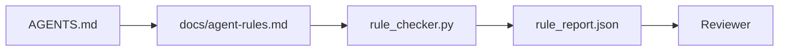

# Agent 指令即可执行约束

> 写成散文的指令是愿望。写成约束的指令是测试。工作台把每条规则变成 agent 在运行时能检查、审查者事后能验证的东西。

**类型：** Build
**语言：** Python（标准库）
**前置要求：** 阶段 14 · 32（最小工作台）
**预计时间：** ~50 分钟

## 学习目标

- 把路由散文和操作规则分开。
- 把启动规则、禁止动作、完成的定义、不确定性处理和审批边界表达成机器可检查的约束。
- 实现一个规则检查器，对照规则集给一次运行打分。
- 让规则集 diff 友好，好让审查能看出改了什么。

## 问题所在

一个典型的 `AGENTS.md` 读起来像新人入职文档。它告诉 agent「小心点」「充分测试」「不确定就问」。三天后，agent 交付了一个没有测试的改动、往一个禁止目录写了东西、而且从没问过，因为它从不知道线在哪儿。

指令在操作性时强大，在务虚时虚弱。修法是写工作台能解释、审查者能打分的规则。

## 核心概念

规则属于 `docs/agent-rules.md`，离那个简短的根路由器远些。每条规则有一个名字、一个类别和一个检查。



### 覆盖大多数规则的五个类别

| 类别 | 规则回答的问题 | 例子 |
|----------|---------------------------|---------|
| 启动 | 开工前什么必须为真？ | 「状态文件存在且新鲜」 |
| 禁止 | 什么绝不能发生？ | 「不要编辑 `scripts/release.sh`」 |
| 完成的定义 | 什么证明任务完成？ | 「pytest 退出 0 且验收行通过」 |
| 不确定性 | agent 不确定时做什么？ | 「开一条问题笔记而非瞎猜」 |
| 审批 | 什么需要人工审批？ | 「任何新依赖、任何生产写入」 |

一条不符合这五个之一的规则，通常想成为两条规则。强制拆分。

### 规则是机器可读的

每条规则有一个 slug、一个类别、一行描述，和一个 `check` 字段，命名 `rule_checker.py` 里的一个函数。加一条规则意味着加一个检查；检查器随工作台一起增长。

### 规则是 diff 友好的

规则住在单个 markdown 文件里，每条一个标题。重命名在 diff 里可见。新规则坐在它类别的顶部。过时规则被删除，而不是注释掉，因为工作台是真相源，不是团队上个季度感受如何的聊天记录。

### 规则 vs 框架 guardrail

框架 guardrail（OpenAI Agents SDK guardrail、LangGraph interrupt）在运行时层面强制规则。这一课的规则集是那些 guardrail 实现的、人类可读、可审查的契约。两个你都需要：运行时在一轮中抓违规，规则集证明运行时在做对的事。

## 动手构建

`code/main.py` 提供：

- `agent-rules.md` 解析器，把规则加载进一个 dataclass。
- `rule_checker.py` 风格的检查器函数，每个 `check` 引用一个。
- 一次违反两条规则的演示 agent 运行，以及一遍抓到它们的检查。

运行它：

```
python3 code/main.py
```

输出：解析后的规则集、运行轨迹、每规则的通过/失败，以及一份存在脚本旁边的 `rule_report.json`。

## 野外的生产模式

三个模式区分了一个能撑一个季度的规则集和一个一周就腐烂的规则集。

**写入时打严重度标签。** 每条规则带 `severity`：`block`、`warn` 或 `info`。检查器报告全部三种；运行时只在 `block` 上拒绝。大多数团队早期把严重度说得过重，然后在 deadline 压力下悄悄削弱它；写入时打标逼着把校准提到前面。配验证关卡（阶段 14 · 38），它把任何对 `block` 规则的覆盖签进一个 `overrides.jsonl` 审计日志。

**规则过期作为强制函数。** 每条规则带一个 `expires_at` 日期（默认从撰写起 90 天）。当一条未过期规则连续 60 天零违规时，检查器发出一个警告；下次季度评审要么论证保留它、要么把它削弱成 `info`、要么删除。Cloudflare 的生产 AI Code Review 数据（2026 年 4 月，30 天内横跨 5,169 个仓库的 131,246 次评审运行）显示，带显式过期的规则集每仓库保持在 30 条以下；没有过期的涨到 80+，且大多从不触发。

**markdown 作源，JSON 作缓存。** `agent-rules.md` 是撰写的文件；`agent-rules.lock.json` 是检查器在热路径里读的缓存。lock 由一个 pre-commit hook 重新生成。markdown diff 可审查；JSON 解析不进每一轮。和 `package.json` / `package-lock.json` 以及 `Cargo.toml` / `Cargo.lock` 同一个形态。

## 上手使用

在生产中：

- Claude Code、Codex、Cursor 在会话开始时读规则，并在拒绝动作时引用它们。检查器在 CI 里重跑它们以抓静默漂移。
- OpenAI Agents SDK guardrail 把同样的检查注册为输入和输出 guardrail。markdown 是文档接触面；SDK 是运行时接触面。
- LangGraph interrupt 在一个进行中的节点违反规则时触发。interrupt 处理器读规则、问人、恢复。

规则集在这三者间可移植，因为它只是 markdown 加函数名。

## 交付

`outputs/skill-rule-set-builder.md` 访谈一个项目负责人，把他们现有的散文指令分类进五个类别，并产出一份带版本的 `agent-rules.md` 加一个检查器桩。

## 练习

1. 如果你的产品确实需要，加第六个类别。论证它为什么没塌进五个之一。
2. 扩展检查器，让一条规则能带一个严重度（`block`、`warn`、`info`），报告相应聚合。
3. 把检查器接进 CI：如果一条 block 严重度的规则在最新 agent 运行上失败就让构建失败。
4. 给每条规则加一个「过期」字段。90 天无检查失败后，规则进入待评审。
5. 找一个真实的 `AGENTS.md`，把它重写成五类别规则。它有多少行是操作性的？多少行是务虚的？

## 关键术语

| 术语 | 大家怎么说 | 它实际是什么 |
|------|----------------|------------------------|
| Operational rule | 「一条真指令」 | 工作台能在运行时检查的规则 |
| Aspirational rule | 「小心点」 | 没有检查的规则；要么删除要么升级 |
| Definition of done | 「验收」 | 任务完成的客观、有文件支撑的证明 |
| Block severity | 「硬规则」 | 违规停掉运行；没有运维就无法消音 |
| Rule expiry | 「过时规则清扫」 | N 天无失败的规则进入待退役 |

## 延伸阅读

- [OpenAI Agents SDK guardrails](https://platform.openai.com/docs/guides/agents-sdk/guardrails)
- [LangGraph interrupts](https://langchain-ai.github.io/langgraph/how-tos/human_in_the_loop/breakpoints/)
- [Anthropic, Building Effective Agents](https://www.anthropic.com/research/building-effective-agents)
- [Rick Hightower, Agent RuleZ: A Deterministic Policy Engine](https://medium.com/@richardhightower/agent-rulez-a-deterministic-policy-engine-for-ai-coding-agents-9489e0561edf) —— 生产中的 block/warn/info 严重度
- [Cloudflare, Orchestrating AI Code Review at Scale](https://blog.cloudflare.com/ai-code-review/) —— 13.1 万次评审运行、规则组合的教训
- [microservices.io, GenAI development platform — part 1: guardrails](https://microservices.io/post/architecture/2026/03/09/genai-development-platform-part-1-development-guardrails.html) —— 规则与 CI 之间的纵深防御
- [Type-Checked Compliance: Deterministic Guardrails (arXiv 2604.01483)](https://arxiv.org/pdf/2604.01483) —— Lean 4 作为「规则即检查」的上限
- [logi-cmd/agent-guardrails](https://github.com/logi-cmd/agent-guardrails) —— 合并关卡实现：范围、变异测试、违规预算
- 阶段 14 · 32 —— 这个规则集落入的最小工作台
- 阶段 14 · 38 —— 消费规则报告的验证关卡
- 阶段 14 · 39 —— 给规则合规打分的审查者 agent
