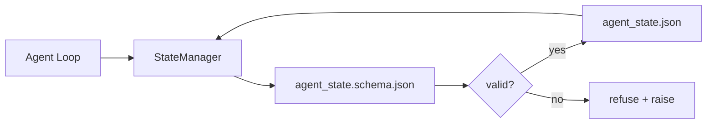

# 仓库记忆与持久状态

> 聊天历史是易失的。仓库是持久的。工作台把 agent 状态存进有版本的文件，于是下个会话、下个 agent、下个审查者都从同一个真相源读取。

**类型：** Build
**语言：** Python（标准库 + 可选 `jsonschema`）
**前置要求：** 阶段 14 · 32（最小工作台）
**预计时间：** ~60 分钟

## 学习目标

- 定义什么属于仓库记忆、什么属于聊天历史。
- 为 `agent_state.json` 和 `task_board.json` 撰写 JSON Schema。
- 构建一个状态管理器，原子地加载、校验、变更并持久化状态。
- 用 schema 在坏写入污染工作台之前拒绝它们。

## 问题所在

agent 完成一个会话。聊天关闭。下个会话打开，问从哪里开始。模型说「让我看看文件」，读了过时的笔记，把已经完成的活儿重做一遍。或者更糟，它重写一个已完成的文件，因为没人告诉它那文件已经完成了。

工作台的修法是仓库记忆：状态住在仓库里的 JSON 文件中，按 schema 写入、原子持久化、在代码审查里 diff 友好。聊天是一个瞬态流；仓库是记录系统。

## 核心概念



### 什么属于仓库记忆

| 属于 | 不属于 |
|---------|-----------------|
| 活跃任务 id | 原始聊天 transcript |
| 本会话已碰的文件 | token 级推理轨迹 |
| agent 做出的假设 | 「用户似乎不耐烦了」 |
| 未决阻塞点 | 采样出的补全 |
| 下一步动作 | 厂商专属的模型 id |

判据是持久性：这个在三个月后的一次 CI 重跑里还有用吗？有用就进仓库。没用就是遥测。

### schema 优先的状态

JSON Schema 是契约。没有它，每个 agent 发明新字段，每个审查者学一个新形态，每个 CI 脚本都得为过去的版本特判。有了它，坏写入就是被拒的写入。

schema 覆盖：

- 必需键。
- 允许的 `status` 值。
- 禁止的值（如数组的 `null`）。
- 模式约束（任务 id 匹配 `T-\d{3,}`）。
- 用于迁移的版本字段。

### 原子写入

状态写入需要挺过部分失败：写到临时文件、fsync、重命名覆盖目标。状态文件是真相源；一个写了一半的比没有文件还糟。

### 迁移

当 schema 变化时，在 schema 升级旁边发一个迁移脚本。状态文件带一个 `schema_version` 字段；管理器拒绝加载一个它迁移不了的版本的文件。

## 动手构建

`code/main.py` 实现：

- `agent_state.schema.json` 和 `task_board.schema.json`。
- 一个仅标准库的校验器（JSON Schema 子集：required、type、enum、pattern、items）。
- `StateManager.load`、`StateManager.update`、`StateManager.commit`，带原子的「临时文件加重命名」写入。
- 一个演示，变更状态、持久化、重新加载并证明往返成立。

运行它：

```
python3 code/main.py
```

脚本写 `workdir/agent_state.json` 和 `workdir/task_board.json`，跨两轮变更它们，并在每一步打印校验后的状态。

## 野外的生产模式

四个模式把这一课的最小集变成一个多 agent monorepo 能挺住的东西。

**「临时文件加重命名」的原子写入不是可选项。** 2026 年 3 月一个 Hive 项目 bug 报告干净地记录了这个失败模式：`state.json` 通过 `write_text()` 写入，异常被捕获并消音。部分写入让会话对着损坏状态恢复，毫无信号。修法永远是：在目标同目录下 `tempfile.mkstemp`、写入、`fsync`、`os.replace`（POSIX 和 Windows 上的原子重命名）。这一课的 `atomic_write` 正是这么做的。

**给每个非幂等工具调用加幂等键。** 如果 agent 在调用一个工具后、给结果做检查点前崩溃，恢复会重试那次工具调用。对读取安全；对邮件、DB 插入、文件上传危险。模式是：执行前把每个工具调用 ID 记进一个 `pending_calls.jsonl`。重试时，检查这个 ID；若存在，跳过调用并用缓存结果。Anthropic 和 LangChain 在 2026 年指导里都点出了这点；LangGraph 的检查点器出于同样原因持久化未决写入。

**把大产物和状态分开。** 别把 CSV、长 transcript 或生成文件存进 `agent_state.json`。把产物存成一个单独文件（或上传到对象存储），状态里只保留路径。检查点保持小而快；产物独立增长。

**审计用事件溯源，恢复用快照。** 每次变更追加到一个事件日志（`state.events.jsonl`）；周期性快照到 `state.json`。恢复读快照，然后重放快照时间戳之后的任何事件。这费更多磁盘，但让你能逐字重放 agent 决策 —— 调试长跨度运行时不可或缺。和 Postgres 内部 WAL 用的同一个形态。

**schema 迁移，否则拒绝加载。** `schema_version` 整数是契约。当管理器加载一个未知版本的文件时，它拒绝读取。在 schema 升级旁边发一个迁移脚本；`tools/migrate_state.py` 在每次启动时幂等运行。

## 上手使用

在生产中：

- **LangGraph 检查点器。** 同样的想法，不同的存储。检查点器把图状态持久化到 SQLite、Postgres 或一个自定义后端。这一课教的 schema，正是检查点器死掉、你需要手动读状态时要够的东西。
- **Letta 记忆块。** 带结构化 schema 的持久块（阶段 14 · 08）。同样的纪律，限定到长存人设。
- **OpenAI Agents SDK 会话存储。** 可插拔后端，schema 感知。这一课的状态文件就是本地文件后端。

## 交付

`outputs/skill-state-schema.md` 生成一对项目专属的 JSON Schema（状态 + 看板）、一个接好原子写入的 Python `StateManager`，以及一个迁移脚手架，让下次 schema 升级不破坏工作台。

## 练习

1. 加一个 `last_human_touch` 时间戳。拒绝任何在人工编辑五秒内的 agent 写入。
2. 扩展校验器支持 `oneOf`，这样一个任务可以是构建任务或审查任务，各有不同的必需字段。
3. 加一个 `schema_version` 字段，写从 v1 到 v2 的迁移（把 `blockers` 重命名为 `risks`）。
4. 把存储后端从本地文件挪到 SQLite。保持 `StateManager` API 一模一样。
5. 让两个 agent 对着同一个状态文件、以 50ms 的写竞争跑。什么会出问题，原子重命名怎么救你？

## 关键术语

| 术语 | 大家怎么说 | 它实际是什么 |
|------|----------------|------------------------|
| Repo memory | 「笔记文件」 | 存在仓库被追踪文件里、带 schema 的状态 |
| Schema-first | 「校验输入」 | 在写入者之前定义契约，拒绝漂移 |
| Atomic write | 「重命名就行」 | 写临时、fsync、重命名，让部分失败无法污染 |
| Migration | 「schema 升级」 | 把 vN 状态变成 v(N+1) 状态的脚本 |
| System of record | 「真相源」 | 工作台当作权威的那个产物 |

## 延伸阅读

- [JSON Schema specification](https://json-schema.org/specification.html)
- [LangGraph checkpointers](https://langchain-ai.github.io/langgraph/concepts/persistence/)
- [Letta memory blocks](https://docs.letta.com/concepts/memory)
- [Fast.io, AI Agent State Checkpointing: A Practical Guide](https://fast.io/resources/ai-agent-state-checkpointing/) —— 带幂等的 schema 优先检查点
- [Fast.io, AI Agent Workflow State Persistence: Best Practices 2026](https://fast.io/resources/ai-agent-workflow-state-persistence/) —— 并发控制、TTL、事件溯源
- [Hive Issue #6263 — non-atomic state.json writes silently ignored](https://github.com/aden-hive/hive/issues/6263) —— 一个真实项目里的失败模式
- [eunomia, Checkpoint/Restore Systems: Evolution, Techniques, Applications](https://eunomia.dev/blog/2025/05/11/checkpointrestore-systems-evolution-techniques-and-applications-in-ai-agents/) —— 把 OS 历史里的 CR 原语应用到 agent
- [Indium, 7 State Persistence Strategies for Long-Running AI Agents in 2026](https://www.indium.tech/blog/7-state-persistence-strategies-ai-agents-2026/)
- [Microsoft Agent Framework, Compaction](https://learn.microsoft.com/en-us/agent-framework/agents/conversations/compaction) —— 厂商检查点管理器
- 阶段 14 · 08 —— 记忆块与 sleep-time compute
- 阶段 14 · 32 —— 这一课 schema 化的三文件最小集
- 阶段 14 · 40 —— 从同一个 schema 读取的交接包
