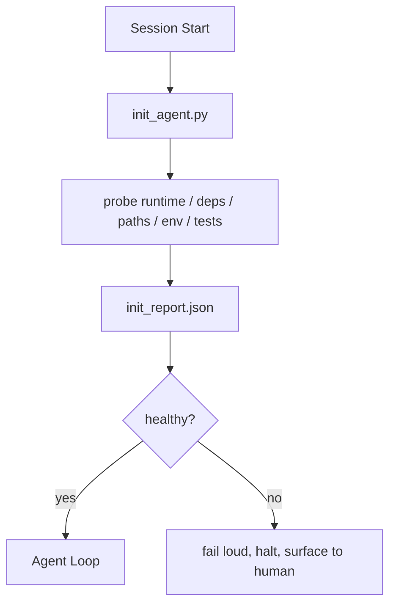

# Agent 初始化脚本

> 每个冷启动的会话都要交税。agent 读同样的文件、重试同样的探测、重新发现同样的路径。一个 init 脚本把税交一次，把答案写进状态。

**类型：** Build
**语言：** Python（标准库）
**前置要求：** 阶段 14 · 32（最小工作台）、阶段 14 · 34（仓库记忆）
**预计时间：** ~45 分钟

## 学习目标

- 认清 agent 每会话绝不该重做的工作。
- 构建一个确定性的 init 脚本，探测运行时、依赖和仓库健康。
- 持久化探测结果，让 agent 读它而不是重跑检查。
- 在初始化失败时失败得大声、迅速，且只有一个地方可看。

## 问题所在

打开一个会话。agent 猜 Python 版本。猜测试命令。把仓库根列五遍来找入口点。试图 import 一个没装的包。问用户配置文件在哪。等它做出一次真实编辑时，一万个 token 已经花在了本该是一个脚本的 setup 工作上。

修法是一个初始化脚本，它在 agent 做任何其他事之前运行，并写一份 agent 在启动时读的 `init_report.json`。

## 核心概念



### init 脚本探测什么

| 探测 | 为什么重要 |
|-------|----------------|
| 运行时版本 | 错误的 Python 或 Node 版本意味着静默的版本错误 bug |
| 依赖可用性 | 一个缺失的包到后面才发现，代价是现在抓到的十倍 |
| 测试命令 | agent 必须知道如何验证；命令缺失则工作台坏了 |
| 仓库路径 | 硬编码路径会漂移；一次性解析它们并钉住 |
| 环境变量 | 缺 `OPENAI_API_KEY` 是个失败接触面，不是个运行时谜题 |
| 状态 + 看板新鲜度 | 来自崩溃会话的过时状态是个自伤工具 |
| 上一次已知良好 commit | 会话结束时交接 diff 的锚点 |

### 失败得大声、迅速、且只有一处

一次探测失败意味着停下并暴露给人。没有「agent 会想办法的」。init 的全部意义就是在工作台坏了时拒绝启动。

### 幂等

连跑两次。第二次除了一个新鲜时间戳外应该是 no-op。幂等性正是让你能把脚本接进 CI、hook 或一个任务前斜杠命令的东西。

### init vs 启动规则

规则（阶段 14 · 33）描述行动前什么必须为真。init 是建立「那些规则能被检查」的脚本。没有 init 的规则变成「小心点」。没有规则的 init 变成一次精致的失败。

## 动手构建

`code/main.py` 实现 `init_agent.py`：

- 五个探测：Python 版本、通过 `importlib.util.find_spec` 列出依赖、测试命令可解析性、必需环境变量、状态文件新鲜度。
- 每个探测返回 `(name, status, detail)`。
- 脚本写 `init_report.json`，含完整探测集，若任何 block 严重度的探测失败则以非零退出。

运行它：

```
python3 code/main.py
```

脚本打印探测表，写 `init_report.json`，在顺利路径上以零退出，或带一份失败探测列表以非零退出。

## 野外的生产模式

三个模式区分了一个有用的 init 脚本和一个仪式。

**上一次已知良好 commit 锚定。** 把当前 commit 对照一个在上次成功合并时写的 `LKG` 文件做探测。如果 diff 超过一个预算（默认 50 个文件），拒绝启动并要求人来批准这个新基线。这就是 Cloudflare 的 AI Code Review 用来限定审查者 agent 范围的办法：每个审查会话都对着同一个上一次已知良好锚定，绝不跨会话叠加漂移。

**带 TTL 的锁文件。** 第一次成功的探测通过后写一个 `prereqs.lock`。后续运行在 N 小时内（默认 24h）信任这个锁，跳过昂贵的探测。init 脚本先读锁；如果它新鲜且依赖清单哈希匹配，就短路。这和 Docker 用于层缓存的是同一个模式：幂等探测 + 内容哈希 = 跳过。

**热路径里无网络、无 LLM、无意外。** init 探测是确定性的管道。一个调 LLM 去分类失败、或访问外部服务去检查许可证的探测不是探测；它是一个工作流。如果一个探测在干跑里超过三秒，把那当成工作台的异味，要么把它移出 init，要么缓存它的结果。

## 上手使用

在生产中：

- **Claude Code hook。** `pre-task` hook 调用 init 脚本，若失败则拒绝启动 agent。
- **GitHub Actions。** 一个 `setup-agent` 作业跑 init 脚本；agent 作业依赖它。
- **Docker entrypoint。** agent 容器在 exec agent 运行时之前跑 init 脚本；失败时日志暴露。

init 脚本可移植，因为它不调用任何特定框架。Bash、Make 或一个 tasks 文件都能包它。

## 交付

`outputs/skill-init-script.md` 访谈项目，把它的 setup 工作分类成探测，并产出一个项目专属的 `init_agent.py` 加一个在任何 agent 步骤前跑它的 CI 工作流。

## 练习

1. 加一个探测，把当前 commit 与上一次已知良好 commit 做 diff，若超过 50 个文件变化就拒绝启动。
2. 把脚本接成写一个 `prereqs.lock` 文件，若锁超过七天旧就拒绝启动。
3. 加一个 `--fix` 标志，自动安装缺失的开发依赖，但绝不在没审批时修改运行时依赖。
4. 把探测从硬编码函数挪到一个 YAML 注册表。为这个取舍辩护。
5. 给每个探测加一个时间预算。一个跑超过三秒的探测是工作台异味。

## 关键术语

| 术语 | 大家怎么说 | 它实际是什么 |
|------|----------------|------------------------|
| Probe | 「一个检查」 | 一个返回 `(name, status, detail)` 的确定性函数 |
| Init report | 「setup 输出」 | 写在状态旁边、带探测结果的 JSON |
| Idempotent | 「可安全重跑」 | 连跑两次除时间戳外产出一致的报告 |
| Fail loud | 「别吞掉」 | 停下并暴露给人；无静默兜底 |
| Setup tax | 「引导成本」 | agent 每会话花在重新发现显而易见之事上的 token |

## 延伸阅读

- [Anthropic, Effective harnesses for long-running agents](https://www.anthropic.com/engineering/effective-harnesses-for-long-running-agents)
- [GitHub Actions, composite actions for setup](https://docs.github.com/en/actions/sharing-automations/creating-actions/creating-a-composite-action)
- [microservices.io, GenAI dev platform: guardrails](https://microservices.io/post/architecture/2026/03/09/genai-development-platform-part-1-development-guardrails.html) —— 把 pre-commit + CI 检查当 init
- [Augment Code, How to Build Your AGENTS.md (2026)](https://www.augmentcode.com/guides/how-to-build-agents-md) —— init 预期
- [Codex Blog, Codex CLI Context Compaction](https://codex.danielvaughan.com/2026/03/31/codex-cli-context-compaction-architecture/) —— 把会话开始当成压实感知的 init
- 阶段 14 · 33 —— 这个脚本使之成为可能的规则集
- 阶段 14 · 34 —— 这个脚本播种的状态文件
- 阶段 14 · 38 —— init 脚本喂给的验证关卡
- 阶段 14 · 40 —— 消费 init 报告里上一次已知良好的交接
