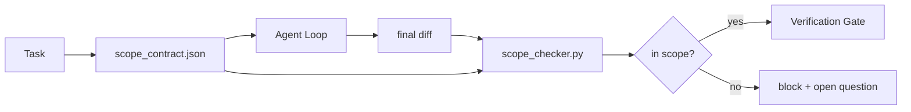

# 范围契约与任务边界

> 模型不知道活儿在哪里结束。范围契约是一个按任务的文件，说明活儿从哪里开始、在哪里结束、溢出时怎么回滚。契约把「待在范围内」从一个愿望变成一个检查。

**类型：** Build
**语言：** Python（标准库）
**前置要求：** 阶段 14 · 32（最小工作台）、阶段 14 · 33（规则即约束）
**预计时间：** ~50 分钟

## 学习目标

- 写一份 agent 在任务开始时读、验证器在任务结束时读的范围契约。
- 指定允许文件、禁止文件、验收标准、回滚计划和审批边界。
- 实现一个范围检查器，把 diff 与契约对比并标出违规。
- 让范围蔓延变得可见、自动、可审查。

## 问题所在

agent 会蔓延。任务是「修登录 bug」。diff 碰了登录路由、邮件辅助函数、数据库驱动、README 和发布脚本。每一次碰当时都有个看着合理的理由。合起来，它们是一个不同于被审查过的改动。

范围蔓延是 agent 工作里监控得最不足的失败模式，因为 agent 一片好心地叙述每一步。修法不是更严的 prompt。修法是磁盘上一份说明承诺了什么的契约，加一个把结果与承诺对比的检查。

## 核心概念



### 范围契约里放什么

| 字段 | 用途 |
|-------|---------|
| `task_id` | 链接到看板上的任务 |
| `goal` | 一句审查者能验证的话 |
| `allowed_files` | agent 可写的 glob |
| `forbidden_files` | agent 哪怕不小心也不能碰的 glob |
| `acceptance_criteria` | 证明完成的测试命令或断言行 |
| `rollback_plan` | 若需停下，运维可执行的一段话 |
| `approvals_required` | 范围外需要明确人工签字的动作 |

没有 `forbidden_files` 的契约是不完整的。那块负空间是契约的一半。

### glob，不是原始路径

真实仓库会挪文件。把契约钉到 glob（`app/**/*.py`、`tests/test_signup*.py`），这样会话之间的一次重构不会让契约失效。

### 回滚是范围的一部分

列出怎么回滚，逼着契约作者去想哪里可能出错。一个你回滚不了的契约，是个不该被批准的契约。

### 范围检查是 diff 检查

agent 写一个 diff。检查器读 diff、允许的 glob、禁止的 glob，以及一份跑过的验收命令清单。每个违规都是一条带标签的发现，验证关卡可以拒绝它。

## 动手构建

`code/main.py` 实现：

- `scope_contract.json` schema（JSON Schema 子集，glob 数组）。
- 一个 diff 解析器，把一份已碰文件列表加一份运行命令列表变成一个 `RunSummary`。
- 一个 `scope_check`，对照契约返回 `(violations, in_scope, off_scope)`。
- 两次演示运行：一次待在范围内，一次蔓延。检查器用确切的文件和原因标出蔓延。

运行它：

```
python3 code/main.py
```

输出：契约、两次运行、每次运行的裁决，以及一份存下的 `scope_report.json`。

## 野外的生产模式

一位跑「specsmaxxing」（在调 agent 之前用 YAML 写范围契约）的实践者报告，在三周里兔子洞率从 52% 降到 21%，而没改 agent。是契约干的活，不是模型。三个模式让收益站得住。

**违规预算，而非二值失败。** `agent-guardrails`（Claude Code、Cursor、Windsurf、Codex 通过 MCP 用的 OSS 合并关卡）每个任务带一个 `violationBudget`：预算内的轻微范围滑移作为警告暴露；只有超预算时合并关卡才拒绝。配 `violationSeverity: "error" | "warning"`。预算就是一个能上线的关卡和一个被讨厌它的团队禁掉的关卡之间的区别。

**按路径家族的严重度不对称。** 对 `docs/**` 的范围外写入通常是 `warn`；对 `scripts/**`、`migrations/**`、`config/prod/**` 的范围外写入永远是 `block`。这种不对称必须住在契约里，而不是运行时里，因为它是项目专属的、每个任务都变。

**和文件预算并列的时间和网络预算。** 一个 `time_budget_minutes` 字段约束墙钟；运行时拒绝在没有重新审批时越过它继续。一个对主机名的 `network_egress` 白名单防止 agent 悄悄访问一个不属于该任务的外部 API。这些也是范围维度；文件 glob 是必要的，不是充分的。

**多契约合并语义（最小权限）。** 当两份范围契约都适用时（如一份项目级契约加一份任务专属契约），合并是：**交集** `allowed_files`（两份契约都必须允许该路径）、**并集** `forbidden_files`（任一份都可禁止）、`time_budget_minutes` 取最严（最小值）、`approvals_required` 累加。`network_egress` 为 `None` 表示不强制、`[]` 表示全拒、`[...]` 作为白名单；合并时，`None` 顺从另一边，两个列表取交集，全拒保持全拒。把这写进契约 schema，让合并是机械且可审查的。

## 上手使用

生产模式：

- **Claude Code 斜杠命令。** 一个 `/scope` 命令写契约并把它钉为会话上下文。子 agent 行动前读契约。
- **GitHub PR。** 把契约作为 PR 正文里的一个 JSON 文件、或一个签入的产物推上去。CI 对合并 diff 跑范围检查器。
- **LangGraph interrupt。** 一次范围违规触发一个 interrupt；处理器问人是契约需要扩大还是 agent 需要退让。

契约随任务一起走。任务关闭时，契约被归档到 `outputs/scope/closed/` 下。

## 交付

`outputs/skill-scope-contract.md` 为一段任务描述生成一份范围契约和一个 glob 感知的检查器，在每个 agent diff 上跑 CI。

## 练习

1. 加一个 `network_egress` 字段，列出允许的外部主机。拒绝碰其他主机的运行。
2. 扩展检查器，对 `docs/**` 软失败、对 `scripts/**` 硬失败。论证这个不对称。
3. 让契约用一套静态规则集（无 LLM）从一个 `goal` 字段推导 `allowed_files`。第一个边界情况上出什么问题？
4. 加一个 `time_budget_minutes`，墙钟一超过它就拒绝继续。
5. 让两份契约对着同一个 diff 跑。两份都适用时正确的合并语义是什么？

## 关键术语

| 术语 | 大家怎么说 | 它实际是什么 |
|------|----------------|------------------------|
| Scope contract | 「任务简报」 | 列出允许/禁止文件、验收、回滚的按任务 JSON |
| Scope creep | 「它还碰了……」 | 同一任务里契约外的文件被改了 |
| Rollback plan | 「我们能回退」 | 用于停止的一段运维操作手册 |
| Approval boundary | 「需要签字」 | 契约里列为需要明确人工审批的动作 |
| Diff check | 「路径审计」 | 把已碰文件与契约 glob 对比 |

## 延伸阅读

- [LangGraph human-in-the-loop interrupts](https://langchain-ai.github.io/langgraph/concepts/human_in_the_loop/)
- [OpenAI Agents SDK tool approval policies](https://platform.openai.com/docs/guides/agents-sdk)
- [logi-cmd/agent-guardrails — merge gates and scope validation](https://github.com/logi-cmd/agent-guardrails) —— 违规预算、严重度分级
- [Dev|Journal, Preventing AI Agent Configuration Drift with Agent Contract Testing](https://earezki.com/ai-news/2026-05-05-i-built-a-tiny-ci-tool-to-keep-ai-agent-configs-from-drifting-in-my-repo/) —— 无外部依赖的 `--strict` 模式
- [Agentic Coding Is Not a Trap (production logs)](https://dev.to/jtorchia/agentic-coding-is-not-a-trap-i-answered-the-viral-hn-post-with-my-own-production-logs-33d9) —— specsmaxxing 收据：52% → 21%
- [OpenCode permission globs](https://opencode.ai/docs/agents/) —— 细粒度的每权限范围
- [Knostic, AI Coding Agent Security: Threat Models and Protection Strategies](https://www.knostic.ai/blog/ai-coding-agent-security) —— 把范围当最小权限的一部分
- [Augment Code, AI Spec Template](https://www.augmentcode.com/guides/ai-spec-template) —— 三级边界系统（must/ask/never）
- 阶段 14 · 27 —— 与范围锁配对的 prompt 注入防御
- 阶段 14 · 33 —— 这份契约按任务特化的规则集
- 阶段 14 · 38 —— 检查器报告进去的验证关卡
