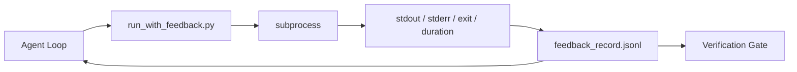

# 运行时反馈循环

> 看不到真实命令输出的 agent 在瞎猜。一个反馈运行器把 stdout、stderr、退出码和计时捕获进一条结构化记录，下一轮可以读。然后 agent 对事实做反应，而不是对自己对事实的预测做反应。

**类型：** Build
**语言：** Python（标准库）
**前置要求：** 阶段 14 · 32（最小工作台）、阶段 14 · 35（Init 脚本）
**预计时间：** ~50 分钟

## 学习目标

- 区分运行时反馈和可观测性遥测。
- 构建一个反馈运行器，包裹 shell 命令并持久化结构化记录。
- 确定性地截断大输出，让循环留在 token 预算内。
- 反馈缺失时拒绝推进循环。

## 问题所在

agent 说「现在跑测试」。下一条消息说「所有测试通过」。现实是没有测试跑过。agent 想象了输出，或者它跑了命令却从没读结果，或者它读了结果却悄悄截掉了那行失败。

一个反馈运行器消除那个缝隙。每个命令都过运行器。每条记录承载命令、捕获的 stdout 和 stderr、退出码、墙钟时长，以及一行 agent 笔记。agent 在下一轮读这条记录。验证关卡在任务结束时读这些记录。

## 核心概念



### 反馈记录里放什么

| 字段 | 为什么重要 |
|-------|----------------|
| `command` | 确切的 argv，没有 shell 展开的意外 |
| `stdout_tail` | 最后 N 行，确定性截断 |
| `stderr_tail` | 最后 N 行，与 stdout 分开 |
| `exit_code` | 无歧义的成功信号 |
| `duration_ms` | 暴露慢探测和失控进程 |
| `started_at` | 用于重放的时间戳 |
| `agent_note` | agent 写的一行，关于它预期什么 |

### 截断是确定性的

一个 50 MB 的日志会毁掉循环。运行器用一个 `...truncated N lines...` 标记截断头和尾，是确定性的，于是同样的输出总是产出同样的记录。不采样；agent 需要看的部分（最后的错误、最后的汇总）住在尾部。

### 反馈 vs 遥测

遥测（阶段 14 · 23，OTel GenAI 约定）是给人类运维跨时间审查运行用的。反馈是给这次运行的下一轮用的。它们共享字段，但住在不同文件里，有不同的保留策略。

### 没有反馈就拒绝推进

如果运行器在捕获退出之前出错，记录就带 `exit_code: null` 和 `error: <reason>`。agent 循环必须拒绝在 `null` 退出上声称成功。没有退出，就没有进展。

## 动手构建

`code/main.py` 实现：

- `run_with_feedback(command, agent_note)`，包裹 `subprocess.run`，捕获 stdout/stderr/exit/duration，确定性截断，追加到 `feedback_record.jsonl`。
- 一个小加载器，把 JSONL 流式读进一个 Python 列表。
- 一个演示，跑三个命令（成功、失败、慢）并打印每个命令的最后一条记录。

运行它：

```
python3 code/main.py
```

输出：三条反馈记录追加到 `feedback_record.jsonl`，每个的最后一条内联打印。跨重跑 tail 这个文件，看循环累积。

## 野外的生产模式

三个模式把运行器加固到足以上线。

**写入时脱敏，不是读取时。** 任何碰 stdout 或 stderr 的记录都可能泄露密钥。运行器在 JSONL 追加之前做一遍脱敏：剥掉匹配 `^Bearer `、`password=`、`api[_-]?key=`、`AKIA[0-9A-Z]{16}`（AWS）、`xox[baprs]-`（Slack）的行。读取时脱敏是个自伤工具；磁盘上的文件才是攻击者触达的。每季度对照生产运行时观察到的密钥格式审计脱敏模式。

**轮转策略，而非单个文件。** 把 `feedback_record.jsonl` 每文件封顶 1 MB；溢出时轮转到 `.1`、`.2`，丢掉 `.5`。agent 循环只读当前文件，所以运行时成本有界。CI 产物存储拿完整的轮转集。没有轮转，这个文件就成了每次加载器调用的瓶颈。

**给重试链加父命令 id。** 每条记录拿一个 `command_id`；重试带一个指向上一次尝试的 `parent_command_id`。审查者的「失败尝试」列表（阶段 14 · 40）和验证关卡的审计都顺着这条链走。没有这个链接，重试看起来像独立的成功，审计就藏住了失败历史。

## 上手使用

生产模式：

- **Claude Code Bash 工具。** 这个工具已经捕获 stdout、stderr、exit 和 duration。这一课的运行器是任意 agent 产品的框架无关等价物。
- **LangGraph 节点。** 把任何 shell 节点包进运行器，让记录持久化在图状态之外。
- **CI 日志。** 把 JSONL 灌进你的 CI 产物存储；审查者可以重放任何命令而不重跑会话。

运行器是个薄包装，能挺过每次框架迁移，因为它掌管记录的形态。

## 交付

`outputs/skill-feedback-runner.md` 生成一个项目专属的 `run_with_feedback.py`，带正确的截断预算、一个接到工作台的 JSONL 写入器，以及一个 agent 每轮读的加载器。

## 练习

1. 给每条记录加一个 `cwd` 字段，让从不同目录跑的同一命令可区分。
2. 加一个 `redaction` 步骤，剥掉匹配 `^Bearer ` 或 `password=` 的行。在一个固定记录上测试。
3. 通过轮转到 `.1`、`.2` 文件把 `feedback_record.jsonl` 总大小封顶 1 MB。为轮转策略辩护。
4. 加一个 `parent_command_id`，让重试链可见：哪个命令产出了下一个命令消费的输入。
5. 把 JSONL 灌进一个小 TUI，高亮最新的非零退出。这个 TUI 必须展示哪八个关键特性才能在审查里有用。

## 关键术语

| 术语 | 大家怎么说 | 它实际是什么 |
|------|----------------|------------------------|
| Feedback record | 「运行日志」 | 带命令、输出、退出、时长的结构化 JSONL 条目 |
| Tail truncation | 「裁剪日志」 | 确定性的头+尾捕获，让记录装进 token 预算 |
| Refuse-on-null | 「数据缺失时阻断」 | `exit_code` 为 null 时循环不得推进 |
| Agent note | 「预期标签」 | agent 在读结果前写的一行预测 |
| Telemetry split | 「两个日志文件」 | 反馈给下一轮，遥测给运维 |

## 延伸阅读

- [OpenTelemetry GenAI semantic conventions](https://opentelemetry.io/docs/specs/semconv/gen-ai/)
- [Anthropic, Effective harnesses for long-running agents](https://www.anthropic.com/engineering/effective-harnesses-for-long-running-agents)
- [Guardrails AI x MLflow — deterministic safety, PII, quality validators](https://guardrailsai.com/blog/guardrails-mlflow) —— 把脱敏模式当回归测试
- [Aport.io, Best AI Agent Guardrails 2026: Pre-Action Authorization Compared](https://aport.io/blog/best-ai-agent-guardrails-2026-pre-action-authorization-compared/) —— 工具前/后捕获
- [Andrii Furmanets, AI Agents in 2026: Practical Architecture for Tools, Memory, Evals, Guardrails](https://andriifurmanets.com/blogs/ai-agents-2026-practical-architecture-tools-memory-evals-guardrails) —— 可观测性接触面
- 阶段 14 · 23 —— 遥测侧的 OTel GenAI 约定
- 阶段 14 · 24 —— agent 可观测性平台（Langfuse、Phoenix、Opik）
- 阶段 14 · 33 —— 要求宣布完成前先有反馈的规则
- 阶段 14 · 38 —— 读这个 JSONL 的验证关卡
