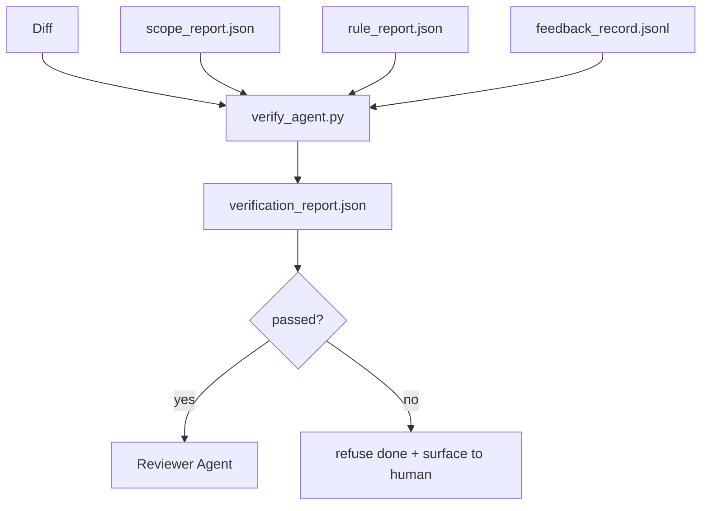

# 验证关卡

> agent 没资格把自己的活儿标记为完成。验证关卡读范围契约、反馈日志、规则报告和 diff，回答一个问题：这个任务真的完成了吗？如果关卡说没有，那任务就没完成，不管聊天里怎么说。

**类型：** Build
**语言：** Python（标准库）
**前置要求：** 阶段 14 · 33（规则）、阶段 14 · 36（范围）、阶段 14 · 37（反馈）
**预计时间：** ~55 分钟

## 学习目标

- 把验证关卡定义为在工作台产物上的一个确定性函数。
- 把规则报告、范围报告、反馈记录和 diff 合并成单个裁决。
- 产出一份审查者 agent 和 CI 都能读的 `verification_report.json`。
- 在任何 block 严重度的失败上拒绝推进任务，无一例外。

## 问题所在

agent 太容易宣布成功。三种失败形态占主导：

- 「看着挺好。」模型读了自己的 diff，决定它是对的。
- 「测试通过了。」说得很自信。没有测试真的跑过的记录。
- 「满足验收了。」验收标准被宽松解读到「任何像完成的东西」都行。

工作台的修法是单个验证关卡，它读 agent 已经产出的产物并做判断。关卡是确定性的。关卡在版本控制里。关卡接进了 CI。agent 没法贿赂它。

## 核心概念



### 关卡检查什么

| 检查 | 来源产物 | 严重度 |
|-------|-----------------|----------|
| 所有验收命令都跑了 | `feedback_record.jsonl` | block |
| 所有验收命令都以零退出 | `feedback_record.jsonl` | block |
| 范围检查没有禁止写入 | `scope_report.json` | block |
| 范围检查没有范围外写入 | `scope_report.json` | block 或 warn |
| 所有 block 严重度的规则通过 | `rule_report.json` | block |
| 反馈里没有 `null` 退出码 | `feedback_record.jsonl` | block |
| 已碰文件匹配 `scope.allowed_files` | 两者 | warn |

一条 `warn` 发现给裁决加注；一条 `block` 发现阻止 `passed: true`。

### 确定性，不是概率性

关卡必须对同一个产物集每次都产出同样的裁决。不用 LLM 裁判。LLM 裁判属于审查者那一侧（阶段 14 · 39），那里的目标是定性评估，不是状态。

### 一份报告，一个路径

关卡每次任务收尾产出一份 `verification_report.json`，写在 `outputs/verification/<task_id>.json` 下。CI 消费同一个路径。带不同路径的多个关卡会分叉真相源。

### 无例外地拒绝

block 严重度的发现不能被 agent 覆盖。它们只能被人覆盖，带一个记录在案的 `override_reason` 和一个 `overridden_by` 用户 id。覆盖是一次签名变更，不是一个 agent 决定。

## 动手构建

`code/main.py` 实现：

- 每个输入产物的一个加载器，全部本地打桩，让这一课自成一体。
- 一个 `verify(task_id, artifacts) -> VerdictReport` 纯函数。
- 一个打印器，展示每检查结果和最终通过/失败。
- 一个带三个任务场景的演示：干净通过、范围蔓延、缺验收。

运行它：

```
python3 code/main.py
```

输出：三份裁决报告，各自存在脚本旁边。

## 野外的生产模式

四个模式把关卡从「又一个 lint 作业」提升到「定夺的那条边」。

**纵深防御，而非单个关卡。** pre-commit hook → CI 状态检查 → 工具前授权 hook → 合并前关卡。每一层都是确定性的，于是一层的失败被下一层抓到。microservices.io 2026 年 3 月的剧本说得很明确：pre-commit hook 不可绕过，因为与模型侧的 skill 不同，它不依赖 agent 遵循指令。验证关卡坐在 CI / 合并前那一层。

**用确定性检查防御，模型裁判只管细微之处。** Anthropic 2026 年的 Hybrid Norm 配对：可验证奖励（单元测试、schema 检查、退出码）回答「代码解决问题了吗？」—— LLM 评分标准回答「代码可读吗、安全吗、合风格吗？」关卡跑第一类；审查者（阶段 14 · 39）跑第二类。混在一起会让信号坍缩。

**签名覆盖日志，而非 Slack 线程。** 每次覆盖在 `outputs/verification/overrides.jsonl` 里产出一行，带：时间戳、发现码、原因、签名用户、当前 HEAD commit。运行时拒绝任何缺签名的覆盖；审计轨迹由 git 追踪。这就是一个覆盖策略和一场覆盖戏剧之间的界线。

**覆盖率底线作为一等检查。** 一份 `coverage_report.json` 喂给一个 `coverage_floor`（默认 80%）检查。如果测得的覆盖率掉到底线之下、或比上次合并的底线低超过 1 个百分点，关卡就失败。没有这个检查，agent 会悄悄删掉失败的测试，验证报告还保持绿色。

**`--strict` 模式把 warn 提升为 block。** 对发布分支、阻断上线的 PR 或事故后分诊，`--strict` 让每个警告都成为硬失败。这个标志按分支 opt-in；不是全局默认，因为对一切都 strict 会腐蚀日常流程。

## 上手使用

生产模式：

- **CI 步骤。** 一个 `verify_agent` 作业对着 agent 的最终产物跑关卡。没有 `passed: true` 时合并保护拒绝。
- **交接前 hook。** agent 运行时在生成交接文档前调关卡。没有绿色裁决，就没有交接。
- **人工分诊。** 当一个 agent 声称成功而人怀疑它时，运维读这份报告。

关卡是工作台流程里定夺的那条边。其他每个接触面都在它上游。

## 交付

`outputs/skill-verification-gate.md` 把关卡接进一个具体项目：哪些验收命令喂给它、哪些规则是 block 严重度、容忍哪些范围外写入、覆盖审计日志怎么存。

## 练习

1. 加一个 `coverage_floor` 检查：测试命令必须产出至少 80% 的覆盖率报告。决定哪个产物承载底线。
2. 支持一个 `--strict` 模式，把每个 `warn` 提升为 `block`。记录 strict 模式是正确默认的那些情形。
3. 让关卡除 JSON 外还产出一份 Markdown 摘要。论证哪些字段属于摘要。
4. 加一个 `time_since_last_human_touch` 检查：任何在人工击键 60 秒内被编辑的文件免于范围外标记。
5. 在你产品的一个真实 agent diff 上跑关卡。多少发现是真的、多少是噪声？关卡需要在哪里增长？

## 关键术语

| 术语 | 大家怎么说 | 它实际是什么 |
|------|----------------|------------------------|
| Verification gate | 「停住事情的那个检查」 | 在工作台产物上产出通过/失败裁决的确定性函数 |
| Block severity | 「硬失败」 | 阻止 `passed: true`、需要签名覆盖的发现 |
| Override log | 「我们为什么放它过去」 | 带原因和用户 id 的签名条目，由审查审计 |
| Acceptance command | 「那个证明」 | 一个 shell 命令，它的零退出就是 `done` 的含义 |
| One report path | 「真相源」 | `outputs/verification/<task_id>.json`，CI 和人都消费 |

## 延伸阅读

- [Anthropic, Harness design for long-running application development](https://www.anthropic.com/engineering/harness-design-long-running-apps)
- [OpenAI Agents SDK guardrails](https://platform.openai.com/docs/guides/agents-sdk/guardrails)
- [microservices.io, GenAI dev platform: guardrails](https://microservices.io/post/architecture/2026/03/09/genai-development-platform-part-1-development-guardrails.html) —— pre-commit 与 CI 之间的纵深防御
- [ICMD, The 2026 Playbook for Agentic AI Ops](https://icmd.app/article/the-2026-playbook-for-agentic-ai-ops-guardrails-costs-and-reliability-at-scale-1776661990431) —— 审批关卡阶梯（草稿 → 审批 → 阈值内自动）
- [Type-Checked Compliance: Deterministic Guardrails (arXiv 2604.01483)](https://arxiv.org/pdf/2604.01483) —— Lean 4 作为确定性关卡的上限
- [logi-cmd/agent-guardrails — merge gate spec](https://github.com/logi-cmd/agent-guardrails) —— 范围 + 变异测试关卡
- [Guardrails AI x MLflow](https://guardrailsai.com/blog/guardrails-mlflow) —— 把确定性校验器当 CI 打分器
- [Akira, Real-Time Guardrails for Agentic Systems](https://www.akira.ai/blog/real-time-guardrails-agentic-systems) —— 工具前/后关卡
- 阶段 14 · 27 —— prompt 注入防御（关卡的对抗搭档）
- 阶段 14 · 36 —— 这个关卡强制的范围契约
- 阶段 14 · 37 —— 这个关卡打分的反馈日志
- 阶段 14 · 39 —— 关卡交接给的审查者 agent
