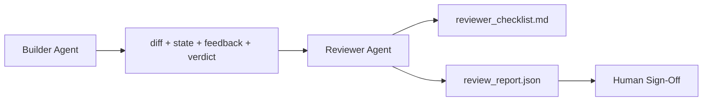

# 审查者 Agent：把构建者和打分者分开

> 写代码的 agent 没法给它打分。审查者是第二个循环，有不同的 system prompt、不同的目标，以及对构建者产出的一切的只读访问。构建者和审查者之间的那道缝隙，是大部分可靠性所在之处。

**类型：** Build
**语言：** Python（标准库）
**前置要求：** 阶段 14 · 38（验证关卡）
**预计时间：** ~55 分钟

## 学习目标

- 陈述为什么同一个 agent 无法可靠地审查自己的工作。
- 构建一个审查者 agent 循环，消费构建者产物并产出一份结构化审查报告。
- 撰写一份审查者评分标准，给具体维度打分，而不是凭感觉。
- 把审查者接进工作台，让人工审查步骤从一份真实产物开始。

## 问题所在

你让 agent 修一个 bug。它编辑四个文件、跑测试、报告完成。验证关卡（阶段 14 · 38）确认验收跑过、范围守住。关卡说 `passed: true`。你合并。两天后你发现修复解决的是 bug 错误的那一半。

验收是必要的，不是充分的。审查者问验收问不了的问题：这解决了正确的问题吗？它有没有不声不响地扩大范围？它有没有把本该被质疑的假设记录下来？它有没有把工作台留在下个会话能接手的状态？

## 核心概念



### 审查者评分标准

五个维度，每个打 0 到 2 分。

| 维度 | 问题 |
|-----------|----------|
| 问题契合 | 改动解决的是所陈述的任务，而不是一个邻近任务吗？ |
| 范围纪律 | 编辑是限定在契约内，还是契约被刻意扩大了？ |
| 假设 | 所有隐藏假设是否都写在某处可审查的地方？ |
| 验证质量 | 验收命令真的证明了目标，还是证明了一个更弱的版本？ |
| 交接就绪 | 下个会话能从当前状态干净接手吗？ |

总分 10。低于 7 分是软失败；低于 5 分是硬失败。

### 审查者是一个独立角色，不是一个独立模型

你可以用和构建者同一个模型跑审查者。纪律在于角色分离：不同的 system prompt、不同的输入、对 diff 无写访问。姿态的改变就是信号的改变。

### 审查者不能编辑 diff

审查者读 diff、状态、反馈、裁决。它写一份报告。它不打补丁。如果报告说「修这个」，下一个构建者轮次做修复；审查者回去审查。混淆角色会击穿那道缝隙。

### 审查者评分标准 vs 验证关卡

关卡（阶段 14 · 38）检查确定性事实：验收跑了吗、规则过了吗、范围守住了吗。审查者做定性判断：这是不是正确的活儿、有没有记录、交接能不能用。两者都需要。

## 动手构建

`code/main.py` 实现：

- 一个 `ReviewerInputs` dataclass，捆绑审查者读取的产物。
- 一个评分标准打分器，每维度一个函数。每个函数对这一课来说是确定性的、桩级别的；真实实现会调 LLM。
- 一个 `review_report.json` 写入器，带五个分数、总分和一个裁决（`pass`、`soft_fail`、`hard_fail`）。
- 两个演示用例：一个干净改动和一个「对的测试，错的问题」改动。

运行它：

```
python3 code/main.py
```

输出：两份写到磁盘的审查报告和一个控制台维度分数表。

## 野外的生产模式

收据：Cloudflare 2026 年 4 月的 AI Code Review 系统在 30 天内横跨 5,169 个仓库的 48,095 个合并请求跑了 131,246 次审查运行。审查中位数在 3 分 39 秒内完成。多达七个专家审查者（安全、性能、代码质量、文档、发布管理、合规、Engineering Codex）在一个去重发现并判定严重度的 Review Coordinator 下并行运行。顶级模型专门留给协调器；专家跑在更便宜的档位。

四个模式让这在规模上行得通。

**专家池，而非一个大审查者。** 一个带 5 维度评分标准的审查者对单人仓库管用。一旦代码库有了安全关键、性能关键和文档接触面，就拆成带更小 prompt 的专家。协调器做去重；专家从不跑完整评分标准。模型档位分离随之而来：便宜的专家、昂贵的协调器。

**把偏见缓解当设计要求，而非优化。** LLM 裁判表现出四种可靠偏见（Adnan Masood，2026 年 4 月）：位置偏见（GPT-4 在 (A,B) vs (B,A) 排序上约 40% 不一致）、冗长偏见（约 15% 分数向更长输出膨胀）、自我偏好（裁判偏好同一模型家族的输出）、权威偏见（裁判过度抬高对知名作者引用的评分）。缓解：评估两种排序、只计一致的胜出；用明确奖励简洁的 1-4 刻度；跨模型家族轮换裁判；打分前剥掉作者名。

**校准集，而非凭感觉。** 一个 10-20 任务的历史集，带已知正确裁决。每次 prompt 变更都拿审查者在它上面跑。如果与历史记录的一致性掉到 80% 以下，评分标准在审查者上线前需要修订。这是每个团队最终都会重新发现的；不如一开始就上。

**与关卡的混合规范。** 验证关卡（阶段 14 · 38）处理确定性检查（验收跑了吗、测试过了吗、范围守住了吗）。审查者处理语义检查（这是不是正确的活儿、假设有没有记录、交接能不能用）。Anthropic 2026 年的指导对这个拆分说得很明确：别让审查者重做关卡已经证明的东西。

## 上手使用

生产模式：

- **Claude Code 子 agent。** 一个审查者子 agent 在构建者关闭一个任务后运行。它在 PR 上发一条带评分标准分数的评论。
- **OpenAI Agents SDK handoff。** 构建者在任务完成时交给审查者。审查者可以带一份发现清单交回，或上交给人。
- **双模型配对。** 构建者跑在更快更便宜的模型上。审查者跑在更强、上下文更小、专注判断的模型上。

审查者是工作台在人类无法亲自做每一次审查时长出来的第二双眼睛。

## 交付

`outputs/skill-reviewer-agent.md` 生成一份项目专属的审查者评分标准、一个接到构建者产物的审查者 agent 桩，以及一个与验证关卡的集成，让人工审查从一份写好的报告而不是一张白纸开始。

## 练习

1. 加一个你产品领域专属的第六个维度。论证它为什么没被现有五个吸收。
2. 用两个不同的 system prompt（简洁、冗长）跑审查者。哪个产出的报告人更可能去读？
3. 给每个维度加一个 `confidence` 字段。当最低维度的置信度低于 0.6 时拒绝交付报告。
4. 构建一个校准集：10 个带已知正确裁决的历史任务收尾。拿审查者在它们上跑。它在哪里与历史记录分歧？
5. 加一个「请求更多证据」的便利项：审查者可以在打分前向构建者要一次具体的测试运行。怎样的退避才不会让这循环起来？

## 关键术语

| 术语 | 大家怎么说 | 它实际是什么 |
|------|----------------|------------------------|
| Reviewer rubric | 「清单」 | 五维度 0-2 打分，每维度一个写好的问题 |
| Soft fail | 「需要修订」 | 总分低于 7；构建者拿到要处理的发现 |
| Hard fail | 「拒绝」 | 总分低于 5 或任一维度为 0；停下并暴露给人 |
| Role separation | 「不同的 prompt」 | 同一模型可担任两个角色；纪律在于输入和姿态 |
| Confidence floor | 「别交付低信号报告」 | 评分标准不确定时拒绝产出裁决 |

## 延伸阅读

- [OpenAI Agents SDK handoffs](https://platform.openai.com/docs/guides/agents-sdk/handoffs)
- [Anthropic Claude Code subagents](https://docs.anthropic.com/en/docs/agents-and-tools/claude-code/sub-agents)
- [Cloudflare, Orchestrating AI Code Review at Scale](https://blog.cloudflare.com/ai-code-review/) —— 7 专家 + 协调器架构，30 天 13.1 万次运行
- [Agent-as-a-Judge: Evaluating Agents with Agents (OpenReview / ICLR)](https://openreview.net/forum?id=DeVm3YUnpj) —— DevAI 基准，366 个分层解法要求
- [Adnan Masood, Rubric-Based Evaluations and LLM-as-a-Judge: Methodologies, Biases, Empirical Validation](https://medium.com/@adnanmasood/rubric-based-evals-llm-as-a-judge-methodologies-and-empirical-validation-in-domain-context-71936b989e80) —— 四种偏见与缓解
- [MLflow, LLM-as-a-Judge Evaluation](https://mlflow.org/llm-as-a-judge) —— 用于分离构建者/评估者的生产工具
- [LangChain, How to Calibrate LLM-as-a-Judge with Human Corrections](https://www.langchain.com/articles/llm-as-a-judge) —— 校准集工作流
- [Evidently AI, LLM-as-a-judge: a complete guide](https://www.evidentlyai.com/llm-guide/llm-as-a-judge)
- [Arize, LLM as a Judge — Primer and Pre-Built Evaluators](https://arize.com/llm-as-a-judge/)
- 阶段 14 · 05 —— Self-Refine 与 CRITIC（单 agent 自审基线）
- 阶段 14 · 30 —— 评估驱动的 agent 开发（校准集生成器）
- 阶段 14 · 38 —— 审查者读取的验证关卡
- 阶段 14 · 40 —— 审查者报告喂给的交接包
