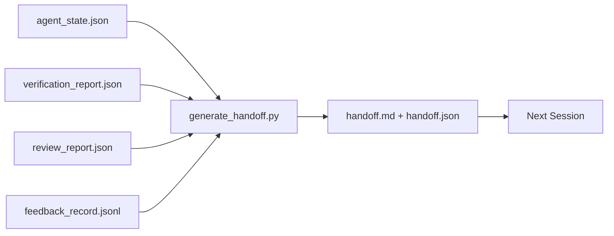

# 多会话交接

> 会话要结束了。活儿没有。交接包是那个把「agent 干了一个小时」变成「下个会话第一分钟就高效」的产物。有意去构建它，而不是事后补一下。

**类型：** Build
**语言：** Python（标准库）
**前置要求：** 阶段 14 · 34（仓库记忆）、阶段 14 · 38（验证）、阶段 14 · 39（审查者）
**预计时间：** ~50 分钟

## 学习目标

- 认清每个交接包需要的七个字段。
- 从工作台产物生成交接，而不靠手写散文。
- 把大反馈日志裁剪成交接大小的摘要。
- 让下个会话的第一个动作是确定性的。

## 问题所在

会话结束。agent 说「很好，我们有进展了」。下个会话打开。下个 agent 问「我们停在哪儿了？」第一个 agent 的答案没了。下个 agent 重新发现、重跑同样的命令、重新问人同样的问题，烧掉三十分钟来恢复上个会话最后那三十秒。

一次糟糕交接的代价在任务的整个生命里每个会话都付一遍。修法是一个在会话结束时自动生成的包：改了什么、为什么、试了什么、什么失败了、还剩什么、下次先做什么。

## 核心概念



### 每个交接承载的七个字段

| 字段 | 它回答的问题 |
|-------|---------------------|
| `summary` | 做了什么的一段话 |
| `changed_files` | 一眼看清的 diff |
| `commands_run` | 实际执行了什么 |
| `failed_attempts` | 试了什么、为什么没成 |
| `open_risks` | 什么可能在下个会话咬你，带严重度 |
| `next_action` | 下个会话采取的第一个具体步骤 |
| `verdict_pointer` | 指向验证 + 审查报告的路径 |

`next_action` 字段是承重的那个。一个除了 `next_action` 什么都有的交接是一份状态报告，不是一个交接。

### 交接是生成的，不是写出来的

手写的交接是那种在难熬的日子里会被跳过的交接。生成器读工作台产物并产出包。agent 的职责是把工作台留在生成器能总结的状态，而不是去写那份摘要。

### 两种形态：人类可读和机器可读

`handoff.md` 是人读的。`handoff.json` 是下个 agent 加载的。两者来自同样的源产物。如果它们分歧，以 JSON 为准。

### 反馈日志裁剪

完整的 `feedback_record.jsonl` 可能有几百条。交接只承载最后 K 条加每一条非零退出的条目。下个会话如果需要就加载完整日志，但包保持小。

## 动手构建

`code/main.py` 实现：

- 一个加载器，把状态、裁决、审查和反馈收集进一个 `WorkbenchSnapshot`。
- 一个 `generate_handoff(snapshot) -> (markdown, payload)` 函数。
- 一个过滤器，挑最后 K 条反馈条目加所有非零退出。
- 一个演示运行，在脚本旁边写 `handoff.md` 和 `handoff.json`。

运行它：

```
python3 code/main.py
```

输出：一段打印的交接正文，外加磁盘上的两个文件。

## 野外的生产模式

Codex CLI、Claude Code 和 OpenCode 各自有一套不同的压实故事；结构化交接包坐在这三者之上。

**压实策略各异；包 schema 不变。** Codex CLI 的 POST /v1/responses/compact 是个服务端不透明 AES blob（OpenAI 模型的快路径）；回退是一个作为 `_summary` user 角色消息追加的本地「交接摘要」。Claude Code 在 95% 上下文处跑五阶段渐进式压实。OpenCode 做基于时间戳的消息隐藏外加一个 5 标题 LLM 摘要。三种不同机制，同一个需求：把挺过压缩的东西序列化成一个可移植产物。包就是那个产物。

**全新会话交接不是压实。** 压实延长一个会话；交接干净地关闭一个并开始下一个。Hermes Issue #20372 的框定（2026 年 4 月）是对的：当原地压缩开始退化时，agent 应该写一份紧凑交接、结束会话、在全新上下文里恢复。包让那个转换变得廉价。错误做法是一直压缩到质量崩溃；修法是为一次早期、干净的交接留预算。

**每分支每主题一个活跃交接。** 多 agent 协调更多败在过时交接上，而非坏模型输出上。永远包含 `branch`、`last_known_good_commit` 和一个 `active | superseded | archived` 的 `status`。过时交接被归档；只有活跃那个驱动下个会话。这就是「交接即笔记」和「交接即状态」之间的区别。

**在 50-75% 上下文前收尾，而不是撞墙时。** 手写模式的剧本（CLAUDE.md + HANDOVER.md）报告，会话在 50-75% 上下文预算处结束而非 95% 时结果最好。包生成器在压缩产物污染源状态之前干净地运行。上下文完好时写它很便宜；模型已经找不着北时很贵。

## 上手使用

生产模式：

- **会话结束 hook。** 用户关闭聊天时运行时触发生成器。包进 `outputs/handoff/<session_id>/`。
- **PR 模板。** 生成器的 markdown 也是一份 PR 正文。审查者不用打开另外五个文件就能读它。
- **跨 agent 交接。** 用一个产品（Claude Code）构建，用另一个（Codex）继续。包是通用语。

包小、规整、产出廉价。成本节省随每个会话复利累积。

## 交付

`outputs/skill-handoff-generator.md` 产出一个为项目产物路径调过的生成器、一个跑它的会话结束 hook，以及一个下个 agent 在启动时读的 `handoff.json` schema。

## 练习

1. 加一个 `assumptions_to_validate` 字段，暴露每个构建者记录了但审查者没打到 1 分以上的假设。
2. 对失败运行和通过运行用不同方式裁剪反馈摘要。为这个不对称辩护。
3. 包含一个「给人的问题」清单。一个问题进包 vs 进聊天消息的阈值是什么？
4. 让生成器幂等：跑两次产出同样的包。要让这成立，什么必须稳定？
5. 加一个「下个会话前置条件」章节，确切列出下个会话行动前必须加载的产物。

## 关键术语

| 术语 | 大家怎么说 | 它实际是什么 |
|------|----------------|------------------------|
| Handoff packet | 「会话摘要」 | 承载七字段的生成产物，markdown 和 JSON 兼有 |
| Next action | 「先做什么」 | 启动下个会话的那一个具体步骤 |
| Feedback trim | 「日志摘要」 | 最后 K 条记录加每一条非零退出 |
| Status report | 「我们做了什么」 | 缺 `next_action` 的文档；有用，但不是交接 |
| Verdict pointer | 「收据」 | 指向验证 + 审查报告的路径，用于可追溯 |

## 延伸阅读

- [Anthropic, Effective harnesses for long-running agents](https://www.anthropic.com/engineering/effective-harnesses-for-long-running-agents)
- [OpenAI Agents SDK handoffs](https://platform.openai.com/docs/guides/agents-sdk/handoffs)
- [Codex Blog, Codex CLI Context Compaction: Architecture, Configuration, Managing Long Sessions](https://codex.danielvaughan.com/2026/03/31/codex-cli-context-compaction-architecture/) —— POST /v1/responses/compact 和本地回退
- [Justin3go, Shedding Heavy Memories: Context Compaction in Codex, Claude Code, OpenCode](https://justin3go.com/en/posts/2026/04/09-context-compaction-in-codex-claude-code-and-opencode) —— 三厂商压实对比
- [JD Hodges, Claude Handoff Prompt: How to Keep Context Across Sessions (2026)](https://www.jdhodges.com/blog/ai-session-handoffs-keep-context-across-conversations/) —— CLAUDE.md + HANDOVER.md，50-75% 上下文预算
- [Mervin Praison, Managing Handoffs in Multi-Agent Coding Sessions: Fresh Context Without Losing Continuity](https://mer.vin/2026/04/managing-handoffs-in-multi-agent-coding-sessions-fresh-context-without-losing-continuity/) —— 分布式系统框定
- [Hermes Issue #20372 — automatic fresh-session handoff when compression becomes risky](https://github.com/NousResearch/hermes-agent/issues/20372)
- [Hermes Issue #499 — Context Compaction Quality Overhaul](https://github.com/NousResearch/hermes-agent/issues/499) —— Codex CLI 里面向交接的 prompt
- [Microsoft Agent Framework, Compaction](https://learn.microsoft.com/en-us/agent-framework/agents/conversations/compaction)
- [OpenCode, Context Management and Compaction](https://deepwiki.com/sst/opencode/2.4-context-management-and-compaction)
- [LangChain, Context Engineering for Agents](https://www.langchain.com/blog/context-engineering-for-agents)
- 阶段 14 · 34 —— 生成器读取的状态文件
- 阶段 14 · 38 —— 包指向的验证裁决
- 阶段 14 · 39 —— 打包进包里的审查者报告
