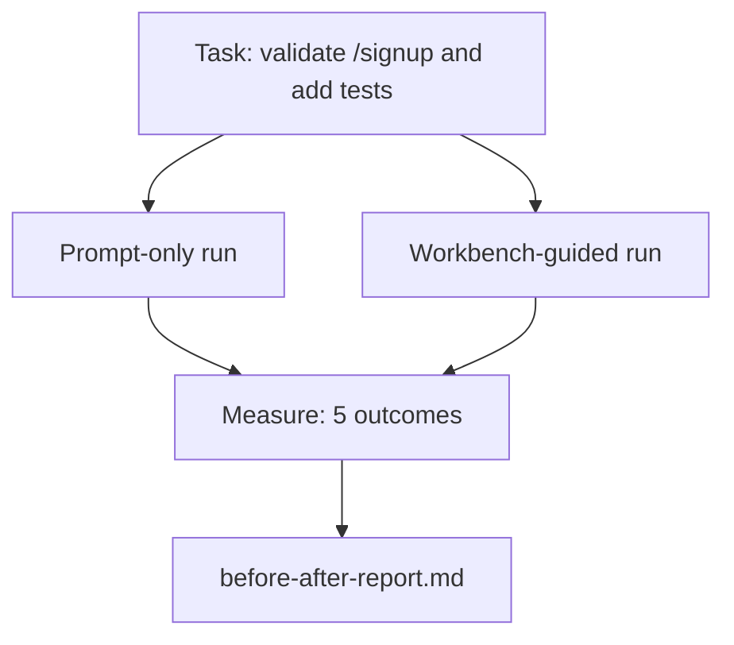

# 真实仓库上的工作台

> 十一课的接触面，如果挺不过与真实代码库的交锋，就一文不值。这一课在一个小示例应用上把同一个任务跑两遍：仅 prompt vs 工作台引导。数字来论证。

**类型：** Build
**语言：** Python（标准库）
**前置要求：** 阶段 14 · 32 到 14 · 40
**预计时间：** ~60 分钟

## 学习目标

- 在一个小应用上把七个工作台接触面整合到一起。
- 把同一个任务跑两遍（仅 prompt 和工作台引导）并度量五个结果。
- 读 before/after 报告，判断哪些接触面给了最大杠杆。
- 面对「但我的模型够好了」的反弹为工作台辩护。

## 问题所在

在一个玩具任务上演示说服不了谁。工作台的论据，是在一个有真实感的任务、一个有真实感的仓库上以更少失败、更少回退、加一个下个会话能用的包落到生产时才立得住。

这一课提供那个有真实感的仓库，并让同一个任务过两条流水线。结果是一份你可以递给怀疑者的 before/after 报告。

## 核心概念



### 示例应用

`sample_app/` 里一个极简的 FastAPI 式处理器：

- `app.py`，带 `/signup`（还没校验）。
- `test_app.py`，带一个顺利路径测试。
- `README.md` 和 `scripts/release.sh` 作为禁区诱饵。

### 任务

> 给 `/signup` 加输入校验：拒绝短于 8 字符的密码，返回 422 加一个带类型的错误信封。加一个证明新行为的测试。

### 两条流水线

仅 prompt：

1. 读 README。
2. 读 `app.py`。
3. 编辑文件。
4. 声称完成。

工作台引导：

1. 跑 init 脚本（第 35 课）。
2. 读范围契约（第 36 课）。
3. 读状态（第 34 课）。
4. 只编辑允许的文件。
5. 通过反馈运行器跑验收命令（第 37 课）。
6. 跑验证关卡（第 38 课）。
7. 跑审查者（第 39 课）。
8. 生成交接（第 40 课）。

### 度量的五个结果

| 结果 | 为什么重要 |
|---------|----------------|
| `tests_actually_run` | 大多数「测试通过」声称是不可验证的 |
| `acceptance_met` | 证明目标的那个测试必须是跑过的那个测试 |
| `files_outside_scope` | 范围蔓延是占主导的静默失败 |
| `handoff_quality` | 下个会话为它付出代价或从中受益 |
| `reviewer_total` | 在关卡之上的定性判断 |

## 动手构建

`code/main.py` 在同一个示例应用 fixture 上编排两条流水线。两条流水线都是脚本化的（循环里没有 LLM），所以度量可复现。脚本把对比写进 `before-after-report.md` 和 `comparison.json`。

运行它：

```
python3 code/main.py
```

输出：每条流水线结果的控制台表、存在脚本旁边的 markdown 报告，以及给想画图的人用的 JSON。

## 野外的生产模式

怀疑者的问题是「工作台到底帮多大忙？」2026 年的数字比解释说得多得多。

**同一个模型在 Terminal Bench 上从前 30 到前 5。** LangChain 的《Anatomy of an Agent Harness》（2026 年 4 月）：一个编码 agent 仅靠改 harness 就在 Terminal Bench 2.0 上从前 30 名开外跳到第五名。同一个模型。不同的接触面。25 名的差距。

**Vercel 靠删工具从 80% 到 100%。** Vercel 报告删掉它 agent 80% 的工具把成功率从 80% 移到 100%。更小的工具接触面、更锐利的范围、更少的失败途径。负空间获胜。

**Harvey 仅靠 harness 准确率翻倍。** 法律 agent 仅靠 harness 优化就把准确率翻了一倍多，没改模型。

**88% 的企业 AI agent 项目无法进入生产。** preprints.org 的《Harness Engineering for Language Agents》论文（2026 年 3 月）把失败追溯到运行时，而非推理：过时状态、脆弱重试、过度生长的上下文、从中间错误中恢复不力。

**长上下文崩溃。** WebAgent 基线 40-50% 的成功率在长上下文条件下掉到不足 10%，大多源于死循环和目标丢失。Ralph Loop 和交接包的存在就是为了吸收那个。

**假阴性仍然存在。** 单步事实任务、一行 lint、格式化器运行、任何模型逐字记住的东西 —— 这些仅 prompt 跑得更快。基准应该诚实地把它们列举出来，免得工作台被框定成大材小用。

要点不是「harness 永远赢」。模型确实会随时间吸收 harness 技巧。要点是今天，工程负载坐在七个接触面里，数字证明了这点。

## 上手使用

这一课是你引用的案卷，当：

- 有人问为什么每个 PR 都带一个 `agent-rules.md` 和一个范围契约。
- 一个团队想「就这个 sprint」丢掉验证关卡。
- 一个新 agent 产品上线，你需要一个可移植基准来判断它是否真省时间。

数字比解释传得更远。

## 交付

`outputs/skill-workbench-benchmark.md` 是一个可移植评估 harness，让任意 agent 产品对着一个项目自己的示例应用过两条流水线，并报告五个结果。

## 练习

1. 加一个第六个结果：到第一次有意义编辑的时间。你怎么干净地度量它？
2. 在你代码库里一个真实的第二天任务上跑这个对比。工作台数字在哪里滑落？
3. 加一遍「假阴性」：那些仅 prompt 本来更快、工作台开销是真实成本的任务。仍然为保留工作台辩护。
4. 把脚本化「agent」换成一次真实 LLM 调用。哪些结果变得更嘈杂？
5. 撰写一份面向非工程师的一页摘要。什么挺过了删减？

## 关键术语

| 术语 | 大家怎么说 | 它实际是什么 |
|------|----------------|------------------------|
| Sample app | 「玩具仓库」 | 小但真实到足以演练所有七个接触面 |
| Pipeline | 「工作流」 | agent 遵循的、有序的接触面读/写序列 |
| Before/after report | 「收据」 | 你递给怀疑者的产物 |
| False negative | 「工作台大材小用」 | 仅 prompt 更快的任务；诚实列举有用 |
| Workbench benchmark | 「可靠性分数」 | 在你代码库上跑这个对比的可移植 harness |

## 延伸阅读

- [LangChain, The Anatomy of an Agent Harness](https://blog.langchain.com/the-anatomy-of-an-agent-harness/) —— Terminal Bench 前 30 到前 5 的收据
- [MongoDB, The Agent Harness: Why the LLM Is the Smallest Part of Your Agent System](https://www.mongodb.com/company/blog/technical/agent-harness-why-llm-is-smallest-part-of-your-agent-system) —— Vercel + Harvey 数字
- [preprints.org, Harness Engineering for Language Agents](https://www.preprints.org/manuscript/202603.1756) —— 88% 企业失败率、运行时根因
- [HN: Improving 15 LLMs at Coding in One Afternoon. Only the Harness Changed](https://news.ycombinator.com/item?id=46988596) —— 在 15 个模型上复现
- [Cloudflare, Orchestrating AI Code Review at Scale](https://blog.cloudflare.com/ai-code-review/) —— 生产中 30 天 13.1 万次审查运行
- [Anthropic, Building Effective Agents](https://www.anthropic.com/research/building-effective-agents)
- 阶段 14 · 32 到 14 · 40 —— 这一课端到端演练的接触面
- 阶段 14 · 19 —— SWE-bench、GAIA、AgentBench 作为这一课补充的宏观基准
- 阶段 14 · 30 —— 同一个 harness 接入的评估驱动 agent 开发
