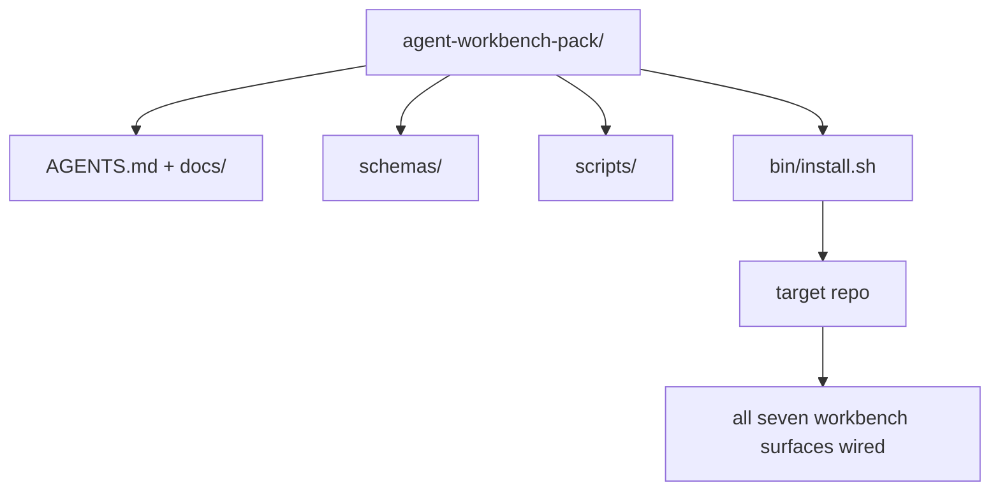

# 综合项目：交付一个可复用的 Agent 工作台包

> 这个小专题以一个你能丢进任何仓库的包收尾。十一课的接触面压缩进一个你能 `cp -r`、然后第二天早上就有一个可靠工作的 agent 的目录。综合项目就是这门课程赖以立足的产物。

**类型：** Build
**语言：** Python（标准库）
**前置要求：** 阶段 14 · 31 到 14 · 41
**预计时间：** ~75 分钟

## 学习目标

- 把七个工作台接触面打包进一个即插即用目录。
- 钉住 schema、脚本和模板，让新仓库拿到一个已知良好的基线。
- 加一个幂等地铺下这个包的单一安装脚本。
- 决定什么留在包里、什么留在外面，为每个取舍辩护。

## 问题所在

一个住在 Google Doc、一段聊天历史和三个半记得的脚本里的工作台，是个每个季度都要重建的工作台。解药是一个带版本的包：一个带接触面、schema、脚本和单命令安装器的仓库或目录。

你将以磁盘上交付的 `outputs/agent-workbench-pack/` 和一个把它丢进任意目标仓库的 `bin/install.sh` 来结束这一课。

## 核心概念



### 包布局

```
outputs/agent-workbench-pack/
├── AGENTS.md
├── docs/
│   ├── agent-rules.md
│   ├── reliability-policy.md
│   ├── handoff-protocol.md
│   └── reviewer-rubric.md
├── schemas/
│   ├── agent_state.schema.json
│   ├── task_board.schema.json
│   └── scope_contract.schema.json
├── scripts/
│   ├── init_agent.py
│   ├── run_with_feedback.py
│   ├── verify_agent.py
│   └── generate_handoff.py
├── bin/
│   └── install.sh
└── README.md
```

### 什么留在里面、什么留在外面

里面：

- 接触面 schema。它们是契约。
- 上面四个脚本。它们是运行时。
- 四份文档。它们是规则和评分标准。

外面：

- 项目专属任务。任务属于目标仓库的看板，不属于包。
- 厂商 SDK 调用。包是框架无关的。
- 入职散文。包住在团队现有入职文档旁边，不在它里面。

### 安装器

一个简短的 `bin/install.sh`（或 `bin/install.py`）：

1. 没有 `--force` 时拒绝覆盖一个现有包。
2. 把包复制进目标仓库。
3. 如果存在 `.github/workflows/` 就接好 CI。
4. 打印下一步：填看板、设验收命令、跑 init 脚本。

### 版本管理

包带一个 `VERSION` 文件。需要迁移的 schema 升级和脚本变更升主版本号。仅文档的变更升补丁号。目标仓库的 `agent_state.json` 记录它是对着哪个包版本初始化的。

## 动手构建

`code/main.py` 把包组装进课旁边的 `outputs/agent-workbench-pack/`，用这个小专题之前各课的 schema 和脚本以及你已经写好的文档播种。

运行它：

```
python3 code/main.py
```

脚本复制并钉住接触面、写 README、打印包目录树，以零退出。重跑是幂等的。

## 野外的生产模式

一个包只有挺过 fork、更新和一个不友好的上游才有价值。四个模式让这行得通。

**`VERSION` 是契约，不是营销。** 主版本升级需要一次状态迁移。次版本升级需要一次检查器重跑。补丁升级只动文档。安装器在每次安装时把 `.workbench-version` 写进目标仓库；`lint_pack.py` 在目标的锁与包的 `VERSION` 不一致时拒绝交付。这就是 `npm`、`Cargo` 和 `pyproject.toml` 挺过十年动荡的办法；关于 agent 的一切都没改变规则。

**跨工具分发的单一源。** Nx 提供一个 `nx ai-setup`，从单一配置铺下 `AGENTS.md`、`CLAUDE.md`、`.cursor/rules/`、`.github/copilot-instructions.md` 和一个 MCP 服务器。包应该做同样的事；安装器产出符号链接（`ln -s AGENTS.md CLAUDE.md`），让单一真相源扇出到每个编码 agent。为了支持某个工具而非另一个去 fork 包是个失败模式。

**在非平凡状态上拒绝的 `uninstall.sh`。** 卸载包绝不能删掉用户的 `agent_state.json`、`task_board.json` 或 `outputs/`。卸载器移除 schema、脚本、文档和 `AGENTS.md`（带 `--keep-agents-md` 退出选项），并在状态文件有任何未提交变更时拒绝继续。状态属于用户；包不拥有它。

**skill 可发布。SkillKit 式分发。** 包作为一个 SkillKit skill 交付：`skillkit install agent-workbench-pack` 从单一源把它铺到 32 个 AI agent 上。包仓库是真相源；SkillKit 是分发渠道。厂商锁定坍缩；七个接触面保持不变。

## 上手使用

包交付的三个地方：

- **作为一个你丢进仓库的目录。** `cp -r outputs/agent-workbench-pack /path/to/repo`。
- **作为一个公开模板仓库。** fork 后定制，用 `VERSION` 控制漂移。
- **作为一个 SkillKit skill。** 接进你的 agent 产品，让单个命令把它铺下。

包是食谱。每次安装是一份上桌的菜。

## 交付

`outputs/skill-workbench-pack.md` 生成一个项目调过的包：规则按团队历史锐化、范围 glob 匹配仓库、评分标准维度扩展一个领域专属条目。

## 练习

1. 决定哪个可选的第五份文档值得被提升进规范的包。为这个取舍辩护。
2. 把安装器重写成带 `--dry-run` 标志的 Python。对比它与 bash 的人体工学。
3. 加一个 `bin/uninstall.sh`，安全移除包，并在状态文件有非平凡历史时拒绝。什么算非平凡？
4. 加一个 `lint_pack.py`，当包偏离 `VERSION` 时失败。把它接进包自己仓库的 CI。
5. 撰写从一个手搓工作台迁移到这个包的操作手册。最小化停机的操作顺序是什么？

## 关键术语

| 术语 | 大家怎么说 | 它实际是什么 |
|------|----------------|------------------------|
| Workbench pack | 「starter kit」 | 一个承载所有七个接触面的带版本目录 |
| Installer | 「setup 脚本」 | 幂等铺下包的 `bin/install.sh` |
| Pack version | 「VERSION」 | schema/脚本变更升主版本，仅文档升补丁 |
| Drop-in pack | 「cp -r 就走」 | 包第一天就无需每仓库定制就能工作 |
| Forkable template | 「GitHub 模板」 | GitHub 的「Use this template」能从中克隆的公开仓库 |

## 延伸阅读

- 阶段 14 · 31 到 14 · 41 —— 这个包打包的每一个接触面
- [SkillKit](https://github.com/rohitg00/skillkit) —— 把这个 skill 装到 32 个 AI agent 上
- [Nx Blog, Teach Your AI Agent How to Work in a Monorepo](https://nx.dev/blog/nx-ai-agent-skills) —— 横跨六个工具的单源生成器
- [agents.md — the open spec](https://agents.md/) —— 你的包路由器必须实现什么
- [HKUDS/OpenHarness](https://github.com/HKUDS/OpenHarness) —— 一个等价于包的东西的参考实现
- [andrewgarst/agentic_harness](https://github.com/andrewgarst/agentic_harness) —— 带评估套件的 Redis 支撑参考
- [Augment Code, A good AGENTS.md is a model upgrade](https://www.augmentcode.com/blog/how-to-write-good-agents-dot-md-files) —— 包文档的质量标杆
- [Anthropic, Effective harnesses for long-running agents](https://www.anthropic.com/engineering/effective-harnesses-for-long-running-agents)
- [Anthropic, Harness design for long-running application development](https://www.anthropic.com/engineering/harness-design-long-running-apps)
- 阶段 14 · 30 —— 消费这个包验证关卡的评估驱动 agent 开发
- 阶段 14 · 41 —— 这个包改进其上的 before/after 基准
