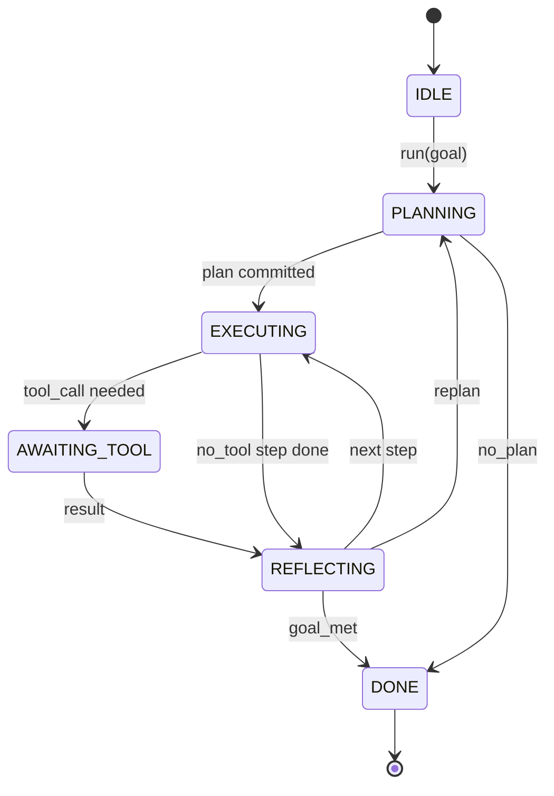

# Agent Harness Loop 契约

> harness 才是 agent。模型只是协处理器。这节课把 loop 契约钉死，好让你把任何模型接进去。

**类型：** Build
**语言：** Python
**前置要求：** 第 13 阶段第 01-07 课、第 14 阶段第 01 课
**预计时间：** ~90 分钟

## 学习目标
- 把 agent harness loop 指定成一个带显式转移的确定性状态机。
- 实现 10 个生命周期 hook topic，供运维把策略、遥测和护栏接进去。
- 定义 2 个 pull point，让 loop 把控制权还给调用方，并在收到新输入后恢复。
- 对每个 session 强制执行预算限制（turn、tool call、wall-clock），且超限时不泄漏半截状态。
- 发出一条带类型的 11 种事件流，让下游 UI 和 tracer 不用直接窥探 loop 就能订阅。

## 框架

一个能无人值守跑 40 个 turn 的 coding agent，不是聊天循环。它是一个状态机：运维可以拦它的节点，可以审它的边。一旦你把契约写清楚，换模型、换工具、换策略都不再是重构，而是一次注册调用。

这节课就做这件事。我们把 6 个状态、10 个 hook topic、2 个 pull point、11 种事件类型和一层预算外壳都定下来。harness 里的其他东西（tool registry、JSON-RPC transport、dispatcher、planner）都往这个形状里插。

## 状态

loop 有 6 个状态。5 个是活动态，1 个是终止态。



`IDLE` 是唯一合法入口。`DONE` 是唯一合法出口。`AWAITING_TOOL` 是唯一会让出 pull point 的状态，其他转移全是内部行为。

这个状态机必须是确定性的。给定同一份事件日志，harness 必须重回同一个状态。正是这个性质，才让你能在调试时 replay session，而不用重新调用模型。

## Hook Topic

hook 是运维插进 loop 的接缝。harness 会触发 10 个 topic。每个 topic 都能挂任意多个 subscriber。subscriber 按注册顺序触发；它可以改 payload、抛错中止本轮，也可以返回一个 sentinel 跳过下一步。

```text
before_plan         after_plan
before_tool_call    after_tool_call
before_step         after_step
on_error
on_pause
on_budget_exceeded
on_complete
```

这个形状，基本就是 Claude Code、Cursor、OpenCode 到 2025 年中收敛出来的公共套路。名字是功能性的，不是品牌性的。拦 `rm -rf` 的 hook 放在 `before_tool_call`。发 OpenTelemetry span 的 hook 放在 `after_step`。处理暂停恢复的 hook 放在 `on_pause`。

## Pull Point

loop 会让出控制权两次。第一次是在 `AWAITING_TOOL`，因为没有工具结果它没法继续。第二次是在 `on_pause`，因为预算耗尽，或者某个 hook 明确要求人工 review。

pull point 不是异常，而是 return。调用方检查 harness 状态，取回 harness 要的东西，然后调用 `resume(payload)`。harness 从停下来的地方继续。这和 Python generator 是同一种形状。pull point 之上的 transport 由你选：TUI 里是按键；MCP 里是 `tools/call`；队列里是 job poll。

## 事件流

loop 会在契约里的特定位置把事件追加到一条带类型的流里。流是 append-only，subscriber 可以从任意 offset replay。实现的 11 种事件如下：

- `session.start`：调用 `run(goal)` 时发一次
- `plan.draft`：planner 返回草案时发
- `plan.commit`：草案被提交成当前 plan 后发
- `step.start`：每个执行 step 开始时发
- `step.end`：每个执行 step 结束时发
- `tool.call`：需要工具的 step 把控制权让回调用方时发
- `tool.result`：带着 tool result 恢复时发
- `tool.error`：带着错误恢复，或 hook 中止调用时发
- `budget.warn`：打到预算上限时发
- `session.pause`：loop 因预算或 hook 暂停时发
- `session.complete`：loop 进入 `DONE` 时发一次

事件不复制 hook payload。hook 是命令式的，负责改、拦、跳过；事件是观察式的，负责记录和外发。两者别混。

## 预算外壳

一个 session 带 3 个限制：turn 数、tool call 数、wall-clock 秒数。每个 turn 把 turn 计数加一，每次 tool call 把 tool call 计数加一，wall-clock 在每次状态转移时检查。任何一个限制被打满时，loop 会先触发 `on_budget_exceeded`，再发 `budget.warn`，然后在下一个 pull point 上带着预算超限原因转回 `IDLE`。

预算不是 kill switch，而是 yield。到底是扩预算后恢复，还是直接结束 session，由调用方决定。

## 这节课不做什么

它不调用模型，不注册真实工具，也不实现 transport。那是后面 4 节课的事。这节课先把契约钉死，好让后面 4 节可以接进来而不用重写。

`main.py` 里的 deterministic planner 只是占位符。它会返回一个硬编码的 3 步 plan，其中两步需要 tool result。重点是 loop，不是 plan。

## 怎么读代码

`HarnessLoop` 是主类，负责持有状态、触发 hook、发事件。`Budget` 跟踪预算。`Event` 是事件流里的类型化信封。`HookRegistry` 是分发表。`_transition` 是唯一能改状态的函数，所以状态机约束全收口在这一处。

先把 `main.py` 从头到尾读一遍，再读 `code/tests/test_loop.py`。测试把每条状态转移和每种 hook 触发顺序都钉住了。

## 往前走

生产里最难的不是写状态机，而是让契约真的可执行。它得扛住 planner 热重载，扛住工具返回坏 JSON，也得扛住一个 hook 在 40 turn session 跑到三分之二时于 `before_tool_call` 抛错。这节课的测试就在打这些故障模式。跑它们，拆它们，再补 case。

下一课加 tool registry。再下一课加 JSON-RPC transport。再下一课加 dispatcher。到第 24 课，这个文件里的 loop 就会带着真实 plan、真实工具和真实预算跑起来。
