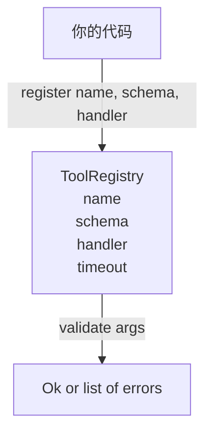

# 带 Schema 校验的 Tool Registry

> 一个 agent 连校验都做不了的 tool，本质上就不能安全调用。先把 registry 和 schema checker 做出来，再谈工具本身。

**类型：** Build
**语言：** Python
**前置要求：** 第 13 阶段第 01-07 课、第 14 阶段第 01 课
**预计时间：** ~90 分钟

## 学习目标
- 维护一份带类型的注册表：`tool name -> schema -> handler`，让 dispatcher 只问一次、之后就能信。
- 实现一个 JSON Schema 2020-12 子集，覆盖 90% 工具调用真正会用到的关键字。
- 返回精确到 json-pointer 形状的错误路径，让模型一轮往返就能自修。
- 默认拒绝重复注册，除非显式 override；静默覆盖就是线上 tool catalog 漂移的起点。
- 保持 validator 纯净（无 I/O、无时间、无全局），这样 replay log 时能重跑。

## 为什么 registry 要先于 tool

2026 年的 coding agent，注册进系统的 tool 往往比模型一次上下文窗口装得下的还多。一个稍像样的 harness 会注册 200 个 tool，而单个 turn 真正暴露给模型的只有 10-40 个。registry 就是三件事的真值源：

- 到底有哪些 tool
- 它们的参数长什么样
- 最终该调用哪个 handler

这三件事钉住之后，harness 的其他层就不用再猜。我们要避免的，就是“handler 已经发出去了但没有 schema”，或者“schema 发出去了但没人验证”。这两种都很常见，也都会把下一层（第 23 课的 dispatcher）变成猜谜游戏，最后唯一的失败模式就是 handler 自己炸出一条栈。

## Tool Record 长什么样

```text
ToolRecord
  name        : str          (唯一；小写字母数字和下划线段，以点分隔，如 snake_case.segment.case)
  description : str          (单行，展示给模型)
  schema      : dict         (JSON Schema 2020-12 子集)
  handler     : Callable     (同步或异步，返回 Any)
  idempotent  : bool         (dispatcher 用它决定是否可重试)
  timeout_ms  : int          (覆盖 dispatcher 默认超时)
```

validator 只碰 `schema`，完全不碰 `handler`。这是故意的。schema 是数据，handler 是代码。把两者缠到一起，你迟早会把校验逻辑偷塞进 handler，而这正是我们要掐死的 bug。

## JSON Schema 2020-12 子集

完整的 2020-12 规范像一篇论文。我们只拿 8 个关键字：

```text
type           string / number / integer / boolean / object / array / null
properties     property 名 -> schema 的映射
required       必填字段名列表
enum           允许的原始值列表
minLength      整数，仅作用于字符串
maxLength      整数，仅作用于字符串
pattern        兼容 ECMA-262 的正则，仅作用于字符串
items          作用于数组每个元素的 schema
```

这已经够覆盖真实工具 API 的大多数需求。我们故意不加 `oneOf`、`anyOf`、`allOf`、`$ref`、条件分支，因为一旦上这些，validator 就会膨胀成一个带循环引用的树遍历器。这里要建的是 registry，不是再造一个 JSON Schema 引擎。

## Json Pointer 错误路径

校验失败时，validator 返回一组错误。每个错误都要带一条指向输入内部位置的 json pointer。pointer 就是一个以 `/` 开头、后面跟属性名或数组下标的路径。

```text
{"a": {"b": [1, 2, "x"]}}
                    ^
                    /a/b/2
```

模型读这类错误路径，比读自然语言更快。如果 schema 要求 `args.user.email` 是字符串，而模型传了整数，错误最好直接给 `/user/email` 和 `expected_type: string`。这样模型下一轮就能自己修，不用你再写一段废话解释。

## 注册与 override

`register(name, schema, handler, **opts)` 默认拒绝重复注册。调用方必须显式传 `override=True` 才能替换。这不是洁癖，是运维卫生。代码库里两个不同模块悄悄注册了同一个 tool name，这种 bug 在线上能耗你一周。

registry 暴露 3 个读接口：

- `get(name)`：返回 record，否则抛错
- `validate(name, args)`：返回 `Ok` 或错误列表
- `names()`：按注册顺序返回 tool name

## Validator 是什么，不是什么

它是一个递归的 schema 树单次遍历器，而且必须是纯函数。它不调用 handler，不做类型强转（字符串 `"42"` 不会通过 number schema），也不会偷偷截断输入。

它不是安全边界。一个恶意 handler 就算通过校验，也一样能乱来。第 23 课的 dispatcher 会继续加 timeout 和 sandbox。registry 管的是“形状”，不是“后果”。

## 形状



## 怎么读代码

`code/main.py` 里定义了 `ToolRegistry`、`ToolRecord`、`ValidationError`，以及 8 个 validator 函数。validator 按 `schema["type"]` 分发；如果 schema 只有 `enum`，就走无类型 enum 校验。每个类型校验器要么返回空列表，要么返回一组 `ValidationError`。顶层 walker 在递归时负责拼接错误，并在下钻时把路径段前缀补上。

`code/tests/test_registry.py` 覆盖了注册、override、校验成功、带路径的校验失败，以及 8 个关键字的全部分支。

## 往前走

一旦这节落地，后面最想补的两个扩展通常是：

- 针对本地 definitions block 的 `$ref` 解析
- `additionalProperties: false` 这种严格形状限制

这两个都不大，也都很常见。但为了让文件保持在“一遍能读完”的尺度里，这节课先不带它们。下一课（22）会把这个 registry 暴露到 JSON-RPC stdio transport 上；再下一课（23）会把两者包进带 timeout 和 retry 的 dispatcher。
